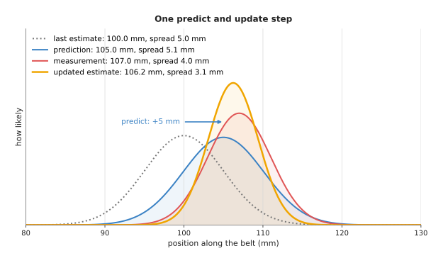
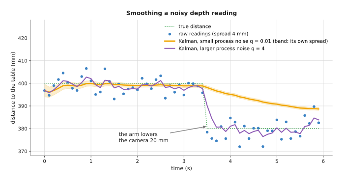
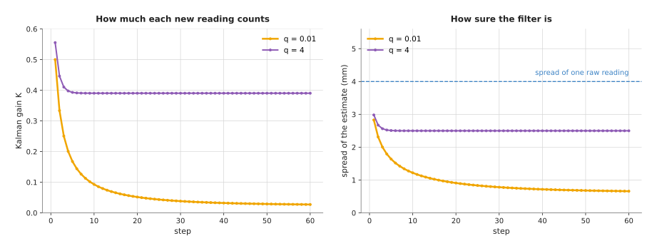
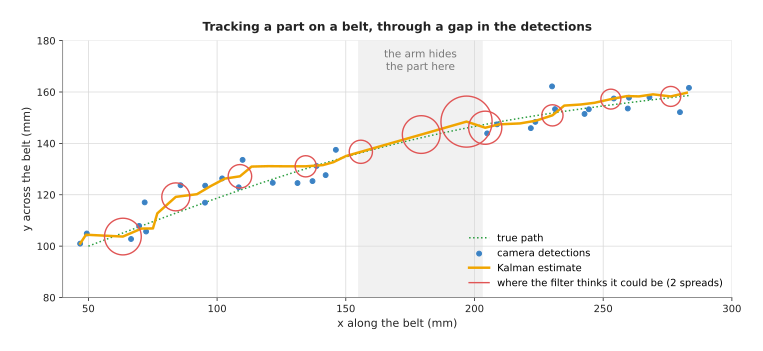
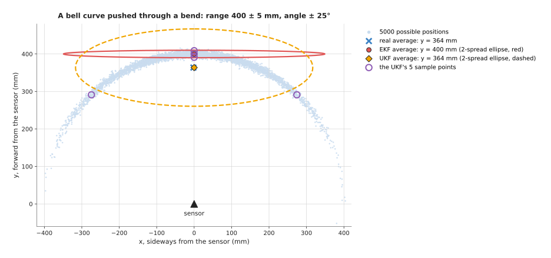
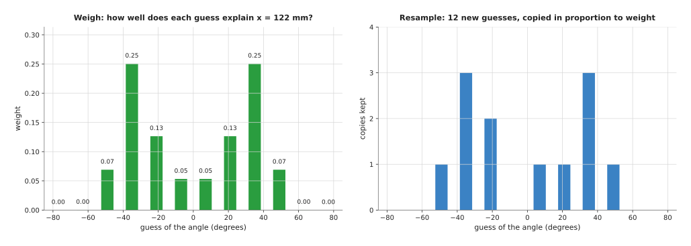
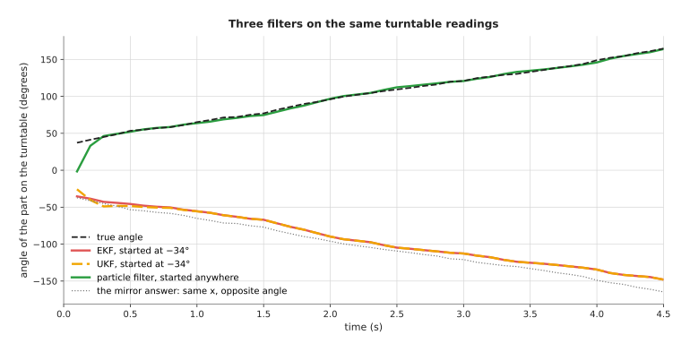

# The Kalman filter

This page explains the Kalman filter: a way to keep a running estimate of a
quantity that is measured again and again with noise, such as the distance to a
table or the position of a part on a moving belt, and it answers four questions
about doing that. What do the two steps, predict and update, do? How much should
each new reading be trusted? Where does a robot arm use the filter? And what
makes it go wrong?

It is for a reader who has read the page on
[least-squares fitting](01_least-squares-fitting.md), or who knows what an
average and a spread of readings are. The page starts with a single number and
then moves to a position on a table. Every number on this page comes from a real
run of the diagram script, `docs/diagrams/fitting_and_estimation.py`.

The filter is named after Rudolf Kálmán, who published it in 1960, and it is
used in nearly every machine that moves and senses: phones, drones, cars and
robot arms. On an arm it appears most often in tracking objects the camera sees,
and in smoothing sensor readings.

## Contents

1. [What this page answers](#1-what-this-page-answers)
2. [The idea in one sentence](#2-the-idea-in-one-sentence)
3. [How it works, step by step](#3-how-it-works-step-by-step)
   · [What the filter keeps](#what-the-filter-keeps)
   · [Predict](#predict)
   · [Update](#update)
   · [A worked example: a block on a belt](#a-worked-example-a-block-on-a-belt)
   · [The steps as pseudocode](#the-steps-as-pseudocode)
   · [The two settings: sensor noise and process noise](#the-two-settings-sensor-noise-and-process-noise)
   · [Tracking a position and a speed together](#tracking-a-position-and-a-speed-together)
4. [When things are not straight lines: EKF, UKF and the particle filter](#4-when-things-are-not-straight-lines-ekf-ukf-and-the-particle-filter)
   · [What breaks when the relationship bends](#what-breaks-when-the-relationship-bends)
   · [The extended Kalman filter: straighten the bend at the estimate](#the-extended-kalman-filter-straighten-the-bend-at-the-estimate)
   · [The unscented Kalman filter: push a few sample points through](#the-unscented-kalman-filter-push-a-few-sample-points-through)
   · [The particle filter: many guesses, weighted and resampled](#the-particle-filter-many-guesses-weighted-and-resampled)
   · [A small run: a part on a turntable](#a-small-run-a-part-on-a-turntable)
   · [Where each one is used, where it fails, and libraries](#where-each-one-is-used-where-it-fails-and-libraries)
5. [Where it is used on a robot arm](#5-where-it-is-used-on-a-robot-arm)
6. [Where it is useful, and where it is not](#6-where-it-is-useful-and-where-it-is-not)
7. [Libraries that provide it](#7-libraries-that-provide-it)
8. [Why a Kalman filter, and what it costs](#8-why-a-kalman-filter-and-what-it-costs)
9. [The learned alternative](#9-the-learned-alternative)
10. [Where to read next](#10-where-to-read-next)
11. [Using it in Python](#11-using-it-in-python)

---

## 1. What this page answers

Many readings on a robot arm come in a stream, because a camera gives a picture
30 times a second and a force sensor gives a reading 1000 times a second. Each
reading is a little wrong, and sometimes a reading is missing, for example when
the arm's own body hides an object from the camera.

The arm wants one steady value at each moment, not a shaking one. It also wants
to know how far that value might be off. And when the quantity is changing, such
as a part moving on a belt, it wants a value for the part's position now. It
also wants a guess for its position a moment from now.

The Kalman filter gives all three, because it keeps an estimate and a measure of
how sure it is, and improves both each time a reading arrives. It can also run
without a reading, which lets it carry on through a short gap.

---

## 2. The idea in one sentence

**Before each new reading, predict where the quantity should be from how it was
moving; then move the prediction towards the reading by an amount that depends
on which of the two you trust more.**

That one sentence describes the whole loop, and an everyday example shows how it
feels. You are walking to a friend's house in the dark, and you know you walk
about one metre per step. After ten steps you think you
are about ten metres along, but you are not quite sure: each step could have
been a little long or short. Then you see a lamp post you know is at eleven
metres, but it is dark and you cannot judge exactly how far away it is. You do
not throw away your step count, and you do not ignore the lamp post, but settle
on something in between, closer to whichever you trust more. Then you carry on
counting steps from that new position.

Counting steps is the **predict** step, while looking at the lamp post is the
**update** step. The Kalman filter does exactly this, with numbers for "how
sure".

---

## 3. How it works, step by step

### What the filter keeps

Since the filter has to carry its belief from one reading to the next, it keeps
two things at all times.

- The **estimate**: its best value for the quantity. For a part on a belt this
  could be its position in millimetres.
- The **variance**: how unsure it is about the estimate. The variance is the
  square of the **spread**, also called the standard deviation. A spread of
  5 mm means the true value is usually within about 5 mm of the estimate, and
  gives a variance of 25 mm².

Variances are used inside the filter because they add up simply: when two
independent uncertainties combine, their variances add, while their spreads do
not.

The filter also needs two numbers from you, both as variances.

- The **sensor noise**, written `r`: how much a single reading scatters. A
  camera whose positions scatter by 4 mm has `r = 16`.
- The **process noise**, written `q`: how much the quantity can change between
  readings in ways the prediction does not know about. A belt that runs at a
  nearly steady speed has a small `q`.

### Predict

Once those four numbers are in place, the predict step moves the filter's
estimate forward to the time of the next reading. It does this using what it
knows about how the quantity moves. For example, if a belt carries the part 5 mm
between pictures, the predicted position is the last estimate plus 5 mm.

The prediction is less certain than the last estimate, because the belt might
have slipped or sped up a little. So the variance grows by the process noise:

```
predicted estimate = last estimate + known change
predicted variance = last variance + q
```

### Update

After that prediction, a reading arrives in the update step, and the filter
compares it with the prediction. The difference, reading minus prediction, is
called the **innovation**, because it is the part of the reading the prediction
did not expect.

The filter then moves the prediction part of the way towards the reading. The
share it moves is called the **Kalman gain**, written `K`, and it is a number
between 0 and 1:

```
K = predicted variance / (predicted variance + r)
new estimate = predicted estimate + K × (reading − predicted estimate)
new variance = (1 − K) × predicted variance
```

The gain reads like this: if the prediction is very unsure compared with the
sensor, `K` is close to 1 and the new estimate is almost the reading. However,
if the sensor is very noisy compared with the prediction, `K` is close to 0 and
the reading barely moves the estimate. The new variance is always smaller than
both the predicted variance and the sensor noise, because combining two pieces
of evidence gives a result more certain than either one alone.

### A worked example: a block on a belt

Those two steps are easiest to follow on real numbers, so imagine a block riding
on a conveyor belt at 50 mm per second. A camera takes 10 pictures a second, so
the block moves 5 mm between pictures. The camera's position
readings scatter by 4 mm, so `r = 16`. The belt is steady but not perfect, so
`q = 1`. The filter starts with an estimate of 100 mm and a spread of 5 mm, a
variance of 25.

Starting from those numbers, the first step goes like this.

1. Predict: the estimate becomes 100 + 5 = 105 mm. The variance becomes
   25 + 1 = 26, a spread of 5.1 mm.
2. The camera reads 107 mm. The innovation is 107 − 105 = 2 mm.
3. The gain is 26 / (26 + 16) = 0.619.
4. The new estimate is 105 + 0.619 × 2 = 106.24 mm.
5. The new variance is (1 − 0.619) × 26 = 9.90, a spread of 3.15 mm.

The picture below shows this step as bell-shaped curves, where each curve's peak
is at the value and its width is the spread.



The prediction (blue) is the last estimate (dotted) moved 5 mm to the right and
made a little wider. The measurement (red) is narrower than the prediction,
because the camera's 4 mm spread is smaller than the prediction's 5.1 mm. That
is why the updated estimate (orange) lands closer to the measurement, and it is
narrower than either.

Then the table below lists all four steps of the same run, and each row is one
picture.

| Step | Predicted (mm) | Predicted variance | Reading (mm) | Gain K | Updated (mm) | Updated spread (mm) |
| --- | --- | --- | --- | --- | --- | --- |
| 1 | 105.00 | 26.00 | 107 | 0.619 | 106.24 | 3.15 |
| 2 | 111.24 | 10.90 | 109 | 0.405 | 110.33 | 2.55 |
| 3 | 115.33 | 7.48 | 118 | 0.319 | 116.18 | 2.26 |
| 4 | 121.18 | 6.10 | 121 | 0.276 | 121.13 | 2.10 |

Notice that the gain falls from 0.619 to 0.276, because as the filter becomes
surer each new reading moves it less. So after four readings the spread is
2.1 mm, about half the spread of a single camera reading.

### The steps as pseudocode

The pseudocode below is the one-number filter used above, where the known change
per step can be 0 for a quantity that should stay still.

```
function kalman_1d(readings, start_estimate, start_variance, q, r, change_per_step):
    x = start_estimate
    p = start_variance
    for each reading z in readings:
        # predict
        x = x + change_per_step
        p = p + q
        # update, only if a reading arrived
        if z is present:
            k = p / (p + r)
            x = x + k * (z - x)
            p = (1 - k) * p
        output x and p
```

For several numbers at once, such as a position and a speed, the same steps
use matrices. `x` becomes a list of numbers called the **state**, and `p`
becomes a table called the **covariance**, which also says how the errors of the
numbers are linked. `F` is the table that moves the state forward one step. `H`
picks out the part of the state that the sensor measures. `Q` and `R` are the
process and sensor noise as tables.

```
    # predict
    x = F · x
    P = F · P · transpose(F) + Q
    # update
    S = H · P · transpose(H) + R            # expected spread of the innovation
    K = P · transpose(H) · inverse(S)
    x = x + K · (z − H · x)
    P = (identity − K · H) · P
```

Each line matches a line of the one-number version, so `S` plays the part of
`p + r`, and the rest follows the same pattern.

### The two settings: sensor noise and process noise

Both versions of the filter need the same two settings. The sensor noise `r` is
the easy one, because you can measure it: hold the sensor still and record the
spread of its readings. However, the process noise `q` is harder, since it says
how much the quantity can change in ways the prediction does not model. It
therefore sets how quickly the filter follows real changes.

The picture below shows the difference. In it, a depth camera on the wrist reads
the distance to the table, 400 mm, with a 4 mm spread, 10 times a second.
After 3.5 seconds the arm lowers the camera by 20 mm. Then two filters run on
the same readings, one with `q = 0.01` and one with `q = 4`.



While the distance is steady, the filter with the small `q` is the smoother of
the two. From the 11th to the 35th reading its average error is 0.77 mm, against
1.67 mm for the other filter and 2.76 mm for the raw readings. But when the
camera drops, the small-`q` filter believes the distance cannot change, so it
drifts down very slowly. At the end of the run, 2.4 seconds later, it still
reads 388.7 mm, 8.7 mm too far. However, the filter with `q = 4` is within 5 mm
of the new distance by the second reading after the drop.

The next picture shows why, by plotting the gain and the spread over time for
the steady part.



With `q = 0.01` the gain keeps falling: 0.5 at the first step, 0.168 at the
fifth, 0.093 at the tenth and 0.027 at the sixtieth. As a result, the filter trusts its
own estimate more and more, and each reading counts less. This is what makes it
smooth, and also what makes it slow to follow a real change. With `q = 4`,
however, the gain settles at 0.39 within a few steps, and the spread settles at
2.5 mm. So that filter always gives each reading a fair share.

There is no single right `q`, so choose it from how fast the real quantity can
change. If you know the arm is about to move the camera, you can also tell the
filter so: the move is a known change, just like the belt's 5 mm per step.

### Tracking a position and a speed together

So far the filter has tracked one number at a time, but a part on a belt has a
position and a speed. The camera measures only the position, but the filter can
estimate the speed too, by putting both in its state. This is called a
**constant-velocity** model: the predict step assumes the part keeps its speed,
and adds the speed times the time step to the position. The update step corrects
the position from the reading, and the covariance links position and speed, so
the speed is corrected too.

The picture below tracks a part moving across a belt at about 60 mm/s, with the
camera's positions scattering by 4 mm. For 0.8 seconds the arm reaches in and
hides the part, so there are 8 pictures with no reading.



Before the gap, the filter has learned a speed of 58.7 mm/s along the belt and
16.8 mm/s across it. During the gap it keeps predicting with that speed, and the
red ellipses show where the filter thinks the part could be. They grow during
the gap, because there are no readings to shrink them: the spread along the belt
rises from 2.0 mm to 5.0 mm. At the end of the gap the estimate is 3.6 mm from
the true position, close enough to match the next detection to the same part.
Then, once readings return, the ellipses shrink again.

The same growing ellipse tells a tracker how far from the prediction a new
detection may be and still count as the same part. Book 2 explains this idea,
called **gating**, in
[tracking and association](../../../02_perception/02_object-perception/10_tracking-and-association.md#33-a-predictor-constant-velocity-then-the-kalman-filter).

The Kalman filter as described here assumes the motion and the measurement are
straight-line relationships, like "position plus speed times time". However,
many real problems are not, because an object turning on a turntable, or a
camera measuring an angle and a distance, bends the relationship. Section 4
explains what goes
wrong then, and the three filters people use instead: the extended Kalman
filter, the unscented Kalman filter and the particle filter.

---

## 4. When things are not straight lines: EKF, UKF and the particle filter

So this section is for the case the rest of the page leaves out: a motion or a
measurement that is not a straight-line relationship. It uses the same predict
and update words as section 3, and the numbers come from a real run of a second
diagram script, `docs/diagrams/fitting_and_estimation_2.py`.

### What breaks when the relationship bends

The Kalman filter describes what it believes as one bell curve: an estimate and
a spread. That works because of one fact: push a bell curve through a
straight-line relationship, such as "position plus speed times time", and you
get another bell curve. As a result, the filter only has to work out its new
centre and width.

However, push a bell curve through a bent relationship and the result is no
longer a bell curve. Angles are the common cause of this on an arm. For example,
a sensor may measure a distance and an angle, or a camera may see a turning part
side-on. Then the relationship between what it reads and where the thing is
becomes bent.

The picture below shows this, using a sensor that says an object is 400 mm away,
give or take 5 mm, straight ahead, give or take 25°. The blue dots are 5000
positions drawn from that belief, and they form a curved band, not an oval.



The real average of the dots is 364 mm forward, not 400 mm, because the ends of
the band curve back towards the sensor. Their forward spread is 49 mm, not 5 mm,
so a filter that simply converts the best guess, 400 mm straight ahead, gets
both of those wrong.

### The extended Kalman filter: straighten the bend at the estimate

The first way round that problem is the **extended Kalman filter (EKF)**, which
replaces the bent relationship with a straight one that touches it at the
current estimate. It is like laying a ruler against a curve at one point. The slope of that ruler is called the
**Jacobian**: a table of how much each output changes when each input changes a
little. The filter then runs the usual predict and update steps with the ruler
in place of the curve.

This works well when the bend is gentle over the width of the bell curve, but
badly when the bell curve is wide. In the picture, the EKF's ellipse (red) is
centred at 400 mm and has a forward spread of only 5 mm. So it is sure of
something that is wrong.

### The unscented Kalman filter: push a few sample points through

The **unscented Kalman filter (UKF)** does not straighten anything at all.
Instead, it picks a small set of sample points, called **sigma points**, around
the estimate: the estimate itself, plus two points one step out along each
direction of the spread. So for two numbers that makes five points, and
it pushes each point through the real, bent relationship. Then it works out a
new centre and spread from where the points landed, each point with a fixed
weight.

In the picture, the five purple rings are the sample points after the push. The
UKF's ellipse (dashed) is centred at 364 mm, the same as the real average, with a
forward spread of 52 mm against the real 49 mm. It still draws one oval around a
curved band, but it puts the oval in the right place and the right size. It
needs no Jacobian, so there is no slope to work out by hand. Its cost is running
the relationship `2n + 1` times per step for `n` numbers in the state.

### The particle filter: many guesses, weighted and resampled

Both Kalman filters still hold one bell curve, but sometimes the belief is not
one hump at all. A part seen side-on on a turntable, for example, could be at an
angle `a` or at the mirror angle `−a`: both give the same sideways position. The
belief has two humps, and one bell curve cannot hold two.

A **particle filter** holds the belief as a crowd of guesses instead, and each
guess is called a **particle**. Each step then has three parts.

1. **Move.** Push every particle through the motion model, adding a little random
   jitter for the process noise.
2. **Weigh.** Give each particle a weight for how well it explains the new
   reading. A particle whose predicted reading is close to the real one gets a
   large weight.
3. **Resample.** Draw a new crowd of the same size from the old one, where each
   particle is copied in proportion to its weight. Heavy particles are copied
   several times. Light ones die out.

The picture below shows one weigh and resample step with only 12 guesses of a
part's angle, spaced 14° apart. In it, the camera read a sideways position of
122 mm. To make the bars easy to see, this picture uses a sensor spread of 15 mm
rather than the 5 mm of the run below.



The guesses at −35° and +35° explain the reading best, with a weight of 0.25
each. After resampling they have three copies each, while the guesses at ±63°
and ±77° had weights near zero and are gone. Notice that both the positive and
the negative angles survive: the particle filter keeps both answers until later
readings decide between them.

In pseudocode, one step looks like this:

```
function particle_filter_step(particles, reading):
    for each particle p:
        p = motion_model(p) + small random jitter      # move
        w[p] = how likely reading is if p were true      # weigh
    normalise w so the weights add up to 1
    particles = draw count(particles) particles, each with chance w[p]   # resample
    estimate = weighted average of the particles before resampling
    return particles, estimate
```

### A small run: a part on a turntable

To compare the three filters on one problem, a part sits 150 mm from the centre
of a turntable that turns at a known 0.5 rad/s. A camera looks along the table and sees only the part's sideways
position, `x = 150 × cos(angle)`, with a spread of 5 mm, 10 times a second.
The motion is a straight line (the angle grows by 0.05 rad each step), but the
measurement is bent. The true angle starts at 37°, and the first reading is
122.5 mm.

Three filters run on the same 45 readings, and the EKF and the UKF start from a
wrong guess of −34°, with a spread of 29°. That is the mirror answer, because it
explains the first reading just as well. The particle filter starts with 1000
particles spread evenly all round the table, meaning it has no idea where the
part is.



The EKF (red) and the UKF (dashed orange) both stay on the wrong side. Every
reading fits the mirror angle almost as well as the true one, so each update
pulls them back to it. After one second they are 121° off, and over the last
three seconds they are 119° off on average. Worse, at the end they report a
spread of only 1.7°: they are sure, and wrong. Started at the right angle
instead, the same EKF tracks the part with an average error of 1.2°. So the EKF
is fine once it is near the answer; it just cannot choose between two answers.

The particle filter (green) finds the right side within three readings. Its first
estimate is 39° off, because it averages two humps and lands between them. By
the third reading it is 1.3° off, and over the last three seconds its average
error is 1.2°, the same as the well-started EKF.

The picture below shows why, because it draws the particles on the turntable,
larger when their weight is larger.


After the first reading, the weight is split almost evenly between two clusters,
48% on the mirror side and 52% on the true side. The table then turns, and on
the true side the part's sideways position shrinks as the angle grows, while on
the mirror side it would grow. Since the readings shrink, the mirror particles
lose their weight, and by the fourth reading all the weight is on the true
side.

### Where each one is used, where it fails, and libraries

Once you know how each filter behaves, it is easier to see where the three
appear on a robot arm.

- **EKF.** Tracking an object with a camera that measures pixels, because the
  [pinhole camera model](../../02_geometry-and-cameras/02_most-used/01_pinhole-camera-model.md)
  divides by depth, which is a bend. Joining wheel counts, an inertial
  measurement unit and a camera on a mobile base with an arm, where headings are
  angles.
- **UKF.** The same jobs when the bend is sharper, or when working out the
  Jacobian by hand is error-prone.
- **Particle filter.** Finding where a mobile base is on a known map, where the
  belief often has several humps. Finding how a part sits in the hand from a few
  touch contacts. Deciding which of two symmetric ways round a part is, as in the
  turntable run.

Each has its own way to fail, so the table below gives the cause, the sign you
would see, and what people do about it.

| Filter and cause | The sign you would see | What to do |
| --- | --- | --- |
| EKF, wide spread across a sharp bend | a small spread but large, one-sided innovations; the estimate drifts | a UKF; or smaller time steps; or better starting guesses |
| EKF or UKF, two answers fit the readings | a confident estimate on the wrong answer, as in the turntable run | a particle filter at the start, then hand over to a Kalman filter |
| Particle filter, too many numbers in the state | needs far more particles; most have near-zero weight | keep the state small (up to about six numbers); use a Kalman filter for the rest |
| Particle filter, very precise sensor | all particles collapse onto a few copies, and the crowd stops exploring | more jitter in the move step; more particles |
| Particle filter, random draws | slightly different answers on every run | more particles; a fixed random seed for testing |

The Python library filterpy has `ExtendedKalmanFilter` and
`UnscentedKalmanFilter` classes, and resampling functions such as
`filterpy.monte_carlo.systematic_resample`, which is the resampling method this
page's script uses. The ROS 2 package `robot_localization` provides `ekf_node`
and `ukf_node`. The ROS 2 navigation stack, Nav2, includes `nav2_amcl`, a
particle filter that finds a mobile base on a map. GTSAM, listed in section 7,
handles bent relationships by re-straightening them over a window of past steps
rather than only at the latest one.

The particle filter's cost is speed, because the run above updated 1000
particles every step, where the EKF updated one number and one spread. For a
small state that is still fast, but for a large one a Kalman filter that is
started near the right answer is the practical choice.

---

## 5. Where it is used on a robot arm

Whichever version of the filter is used, it appears in perception, sensing and
the arm's own state.

- **Tracking objects the camera sees.** A tracker runs one filter per object.
  Each picture, it predicts every object forward, matches detections to the
  predictions, and updates each filter with its match. The
  [assignment and matching](../../03_searching-and-matching/02_most-used/03_assignment-and-matching.md)
  page shows the matching step.
- **Picking from a conveyor.** The filter's speed estimate lets the arm aim for
  where the part will be when the gripper arrives, not where it was when the
  picture was taken.
- **Coasting through a missed detection.** When the arm hides a part, or the
  detector misses it for a frame, the filter keeps predicting. The growing
  spread tells the program when to give up on the track.
- **Smoothing a depth or force reading.** A wrist camera's distance to the
  table, or a force sensor's reading during a gentle push, is filtered before a
  controller acts on it. A [PID controller](../../07_control-and-motion/02_most-used/01_pid-control.md)
  that acts on raw readings passes the noise straight to the motors.
- **Estimating a slowly changing constant.** A robot that pushes objects can
  estimate the table's friction from push after push. The sibling repo's
  [contact-parameters page](https://github.com/RobinNagpal/robot-arm-projects/blob/main/v5-pick-glasses/docs/problem-3/solutions/09-identify-the-contact-parameters.md)
  shows that for a constant, the Kalman filter becomes recursive least squares:
  the least-squares fit updated one reading at a time.
- **Joining sensors.** A mobile base with an arm on it combines wheel counts, an
  inertial measurement unit (IMU) and sometimes a camera into one position.
  The ROS package `robot_localization` does this with an EKF or a UKF.
- **Estimating joint speed.** An arm's encoders measure joint angles. A small
  filter per joint estimates the speed more smoothly than subtracting two
  angles and dividing by the time.

---

## 6. Where it is useful, and where it is not

In all of those places, the filter works best when you can say how the quantity
moves from one moment to the next. It also needs noise that is roughly
bell-shaped and does not depend on the last reading, and readings that arrive
regularly with known times.

However, the table below lists the ways it goes wrong, and each row gives the
cause, the sign you would see, and what people use instead.

| What goes wrong | The sign you would see | What to use instead |
| --- | --- | --- |
| Process noise `q` too small | smooth but late; after a real change the estimate trails for seconds | raise `q`, or tell the filter about known changes such as arm moves |
| Process noise `q` too large | the estimate is nearly as noisy as the raw readings | lower `q`; check with a recording of the sensor held still |
| The object stops following the motion model (a person picks it up, it hits a stop) | the estimate carries on past where the object is; innovations are suddenly large | detect large innovations and restart the track; use several motion models side by side |
| A wrong detection is fed in (the wrong object, a reflection) | a sudden jump that then decays slowly | a gate that refuses readings too far from the prediction; see [tracking and association](../../../02_perception/02_object-perception/10_tracking-and-association.md#33-a-predictor-constant-velocity-then-the-kalman-filter) |
| Irregular timing (dropped frames, late messages) | speed estimate jumps; prediction off by one frame | use each reading's real timestamp for the time step, not a nominal rate |
| Strongly bent relationships (angles, rotations) | the filter becomes over-confident and then drifts | EKF, UKF or a particle filter, as [section 4](#4-when-things-are-not-straight-lines-ekf-ukf-and-the-particle-filter) explains; for orientation, a filter built for rotations |
| Readings with rare large errors, not bell-shaped | one bad reading drags the estimate | a gate, or a robust filter that limits the pull of one reading |
| Motion too complex to write down (a cloth, a rolling object bouncing) | large innovations all the time | a learned motion model, such as a [learned dynamics model](../../../06_learned-models/08_world-models/02_most-used/01_learned-dynamics-models.md) |

---

## 7. Libraries that provide it

Since the one-number filter is ten lines of code, many projects write it
themselves. For more than that, the libraries below are well known. Each row
gives the library, the languages it is used from, the class or package, and a
note.

| Library | Languages | Class or package | Note |
| --- | --- | --- | --- |
| OpenCV | C++, Python | `cv::KalmanFilter` | linear filter with the standard predict and correct steps |
| filterpy | Python | `filterpy.kalman.KalmanFilter`, `ExtendedKalmanFilter`, `UnscentedKalmanFilter` | readable code written alongside a free textbook on the subject |
| robot_localization | ROS 2 (C++) | `ekf_node`, `ukf_node` | joins wheel, IMU, GPS and pose readings into one position |
| GTSAM | C++, Python | factor graphs | a smoother that corrects past estimates as well as the current one; used for camera and robot position |
| Eigen | C++ | matrix types | the matrices to write your own filter with, as most C++ robotics code does |

---

## 8. Why a Kalman filter, and what it costs

As a result, the Kalman filter is a loop that predicts a quantity forward and
then corrects it with each new reading, weighting the two by how much each is
trusted. It gives the arm a steady value, a measure of how sure that value is,
and a prediction for the next moment, even through short gaps.

The obvious alternative is a moving average: average the last ten readings,
which is simpler and needs no model. On the steady part of the depth example, a
10-reading average has an average error of 1.08 mm, close to the Kalman filters.
However, it has three drawbacks, and the first is that it always lags. After the
20 mm drop it took seven readings to get within 5 mm, against two for the
`q = 4` filter. It cannot predict ahead, so it cannot help an arm meet a moving
part. And it gives no spread, so a tracker cannot tell how far to look for the
next detection.

A second alternative is to fit a line through the last few positions with
[least squares](01_least-squares-fitting.md) and extend it forward. That gives a
speed and a prediction, but it forgets everything older than its window, and it
does not say how sure it is. The Kalman filter keeps all past readings in two
small numbers, the estimate and the covariance, and costs the same on every
step however long it runs.

The costs are these: you need a model of how the quantity moves, and the filter
is only as good as that model. You must choose the process noise, and a poor
choice gives either a laggy or a noisy result without any error message. The
filter's confidence is highest just before an object does something new, such as
change direction. And its state lives on from step to step, so a wrong reading
or a bug can affect many steps after it.

---

## 9. The learned alternative

Those costs raise the question of a learned alternative, but the learned
trackers in Book 6's
[tracking and motion](../../../06_learned-models/03_seeing-models/03_also-used/03_tracking-and-motion.md)
mostly keep the filter rather than replace it. Methods such as SORT and ByteTrack
take boxes from a trained detector and use a Kalman filter to predict where each
object should be, and some also compare how the objects look, so that two similar
objects are not swapped. When the motion is too complex to write down, a
[learned dynamics model](../../../06_learned-models/08_world-models/02_most-used/01_learned-dynamics-models.md)
predicts the next state from recordings of the real arm instead of a formula, but
it needs those recordings, and its errors add up over many steps. For touch,
[force and slip models](../../../06_learned-models/09_touch-and-body-models/02_most-used/01_force-and-slip-models.md)
recognise patterns such as the fast shaking of a slip, which a filter that smooths
the reading cannot tell apart from noise. For a steady estimate of a position or a
speed, the Kalman filter is still the better choice, because it needs no
training data, costs a few lines of arithmetic per reading, and says how sure it
is.

---

## 10. Where to read next

The pages below cover what this filter builds on, and where its output is used.

- [Least-squares fitting](01_least-squares-fitting.md) is the batch version of
  the same idea. For a quantity that does not change, the Kalman filter gives the
  least-squares answer one reading at a time.
- [RANSAC](02_ransac.md) handles bad points in a batch. A gate does the same job
  for a filter.
- [Assignment and matching](../../03_searching-and-matching/02_most-used/03_assignment-and-matching.md)
  matches new detections to the filter's predictions.
- [PID control](../../07_control-and-motion/02_most-used/01_pid-control.md) often acts on a
  filtered reading.
- Book 2 goes deeper into tracking on a real arm in
  [tracking and association](../../../02_perception/02_object-perception/10_tracking-and-association.md).

---

## 11. Using it in Python

Section 3 worked through the belt example by hand, and section 7 named filterpy
as the library that does the same arithmetic for more than one number at a time.
This section shows that library on the same belt, so you can compare the code
with the table in section 3. After it you will be able to run a filter that
tracks a position and a speed together, and you will know exactly which of its
settings describe your robot rather than the filter.

The program below is the belt example from section 3, with the state holding
both the block's position and its speed as in the last part of that section.
filterpy is a small library whose classes hold the matrices as plain attributes,
which makes it easy to see the correspondence with the steps on this page.

```python
import numpy as np
from filterpy.kalman import KalmanFilter
from filterpy.common import Q_discrete_white_noise

dt = 0.1                                  # the camera gives 10 pictures a second
kf = KalmanFilter(dim_x=2, dim_z=1)       # state: position and speed; one reading
kf.x = np.array([100.0, 50.0])            # start: 100 mm, moving at 50 mm/s
kf.F = np.array([[1.0, dt],               # predict: position += speed * dt
                 [0.0, 1.0]])             #          speed stays the same
kf.H = np.array([[1.0, 0.0]])             # the camera sees position, not speed
kf.P = np.diag([25.0, 100.0])             # how unsure the start is, as variances
kf.R = np.array([[16.0]])                 # camera noise: a 4 mm spread, squared
kf.Q = Q_discrete_white_noise(dim=2, dt=dt, var=100.0)   # process noise

for reading in (107.0, 109.0, 118.0, 121.0):
    kf.predict()
    kf.update(reading)
    print(kf.x[0], kf.x[1], np.sqrt(kf.P[0, 0]), kf.mahalanobis)
```

Run it and the four steps print 106.24, 110.32, 116.26 and 121.25 mm, with the
spread falling from 3.15 mm to 2.39 mm. The first of those matches the 106.24 mm
in the table in section 3 exactly, because it is the same arithmetic. The speed
estimate stays between 49.3 and 51.2 mm per second, which brackets the real belt
speed even though no reading measures speed at all.

The library does the predict and update matrix arithmetic, and it also gives you
two things the hand-worked example did not. `kf.y` is the innovation, the
difference between the reading and the prediction, and `kf.mahalanobis` is that
difference measured in units of the spread. That second number is the gate
described in section 6: a value above about 3 means the reading is further off
than the filter's own uncertainty can explain, so you skip the `update` call and
let the prediction carry on alone. `Q_discrete_white_noise` also builds the
process noise matrix for you from one number, which saves writing out the
correlation between position and speed by hand.

What you still have to write is the model, and this is the sentence to remember
from the whole page. `kf.F` says how the quantity moves when nothing measures
it, `kf.H` says how your sensor relates to the quantity, and both of those are
statements about your robot that no library can guess. A belt gets the `F`
above, while a part sitting still gets an `F` of all ones with no speed, and a
wrist camera reading a distance through a lens gets an `H` that is not a plain
1. You also write the loop, the gate, and the handling of a missing reading,
which is simply calling `predict` without `update`.

What you have to decide or measure are the four matrices of numbers. `kf.R` you
measure, by holding the sensor still and recording the spread of its readings,
then squaring that spread. `kf.P` is your honesty about the first guess, and
setting it too small makes the filter ignore the first few real readings. `kf.Q`
is the hard one, because section 3 showed that it sets how quickly the filter
follows a real change, and there is no measurement that gives it to you. You
choose it from how fast the quantity can genuinely move, and you check the
choice by running the filter on a recorded trace and looking at whether it lags.
Finally you decide `dt`, and it must be the real time between readings rather
than the rate you hoped for, which is why the
[sensor streams](04_sensor-streams.md) page insists on reading the time stamp on
every message.
