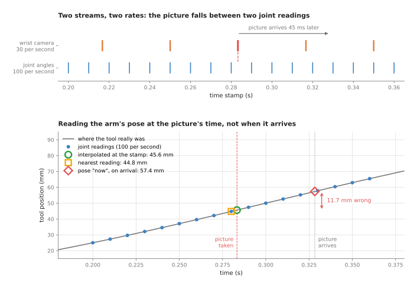
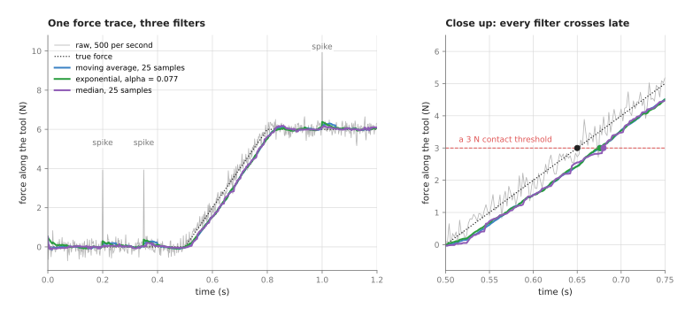
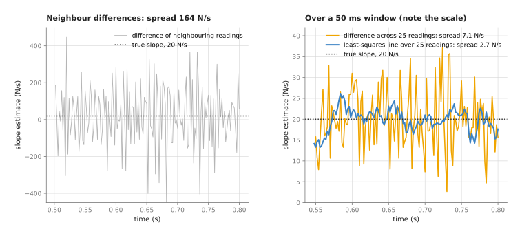
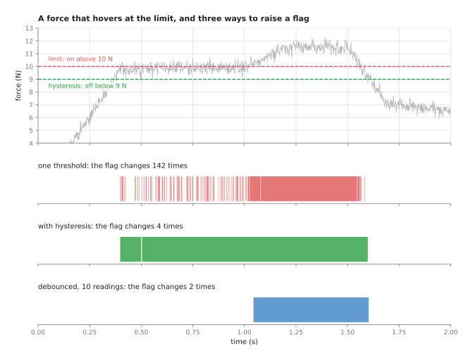

# Sensor streams: time stamps, filters and thresholds

This page explains how to work with a stream of sensor readings. This means
readings that arrive one after another, many times a second, for as long as the
arm runs. It answers the five questions that come up most often once you write a
program against such a stream. How do you pair a camera picture with the joint
angles of the same moment? What goes wrong when two devices keep their own
clocks? How do you smooth a noisy reading, and what does smoothing cost? How do
you get a rate of change, such as how fast a force is rising, out of noisy
readings? And how do you turn a reading into a yes-or-no flag, such as "the force
is too high", without the flag flickering on and off?

It is for a reader who knows what a joint angle, a wrist camera and a force
sensor are, at the level of Books 1 and 2. So this page does not explain those
parts again. It also helps to have read the
[Kalman filter](03_kalman-filter.md) page, because that page handles one stream
in a more careful way than anything here does. Every number on this page comes
from a real run of the diagram script,
`docs/diagrams/sensor_streams_and_safety.py`, rather than from an estimate.

Two running examples are used throughout, and both come from an ordinary arm. The
first is a **wrist camera**, which is a camera fixed to the arm near the gripper,
so that it moves whenever the arm moves. The second is a **force-torque trace**,
which is the stream of readings from a force-torque sensor at the wrist. That
means a stream of numbers saying how hard the tool is pushing on something.

## Contents

1. [What this page answers](#1-what-this-page-answers)
2. [The idea in one sentence](#2-the-idea-in-one-sentence)
3. [How it works, step by step](#3-how-it-works-step-by-step)
   · [Every reading carries a time stamp](#every-reading-carries-a-time-stamp)
   · [Pairing a picture with the arm's pose](#pairing-a-picture-with-the-arms-pose)
   · [Clock offsets and latency](#clock-offsets-and-latency)
   · [Smoothing: moving average, exponential and median filters](#smoothing-moving-average-exponential-and-median-filters)
   · [A slope from noisy readings](#a-slope-from-noisy-readings)
   · [Thresholds that do not flicker: hysteresis and debouncing](#thresholds-that-do-not-flicker-hysteresis-and-debouncing)
   · [The steps as pseudocode](#the-steps-as-pseudocode)
4. [Where it is used on a robot arm](#4-where-it-is-used-on-a-robot-arm)
5. [Where it is useful, and where it is not](#5-where-it-is-useful-and-where-it-is-not)
6. [Libraries that provide it](#6-libraries-that-provide-it)
7. [Why these techniques, and what they cost](#7-why-these-techniques-and-what-they-cost)
8. [The learned alternative](#8-the-learned-alternative)
9. [Where to read next](#9-where-to-read-next)

---

## 1. What this page answers

A robot arm has many sensors, and each one sends its own stream at its own rate.
The joint encoders report the joint angles perhaps 100 or 1,000 times a second,
and an **encoder** is the sensor inside a joint that measures its angle. A wrist
camera is much slower, because it sends only 30 pictures a second, while a
force-torque sensor is faster again at 500 or 1,000 readings a second.

Because those rates differ, and because no reading is perfect, these streams
cause four everyday problems.

- The streams do not line up, because a picture is taken between two joint
  readings rather than at the same instant as one.
- Every reading is late, so a picture arrives at the computer some tens of
  milliseconds after it was taken.
- Every reading is noisy, since a force sensor's reading shakes a little even
  when nothing touches it, and now and then it jumps for no real reason.
- Decisions made from noisy readings flicker, so a check such as "is the force
  above 10 newtons?" can switch between yes and no hundreds of times while the
  real force sits near 10.

The techniques on this page are small, and none of them needs a model of the arm,
but almost every arm program uses all of them. Getting them wrong causes some of
the hardest bugs to find, because nothing crashes. Instead the arm just places
things a few millimetres off, or stops for no visible reason.

---

## 2. The idea in one sentence

Since the four problems above all come from time, the answer is stated in terms
of time as well.

**Treat each reading as a value together with the moment it was true, combine
readings by their moments rather than by when they arrived, and smooth and
threshold them in ways whose delay you have measured.**

Here is an everyday example of the same rule, taken from outside robotics. You
take a photo from a moving train, while a friend on the train writes down where
the train is every second. Later you want to know where each photo was taken, so
you must match each photo to one of the positions your friend wrote down. You do
not use the position written down at the moment you looked at the photo, because
that moment has nothing to do with the photo. Instead you use the position at the
time printed on the photo. So if the photo says 10:15:03.5, you take the
positions at 10:15:03 and 10:15:04 and pick the point halfway between them. And
if your camera's clock is a minute fast, you must correct for that first, or
every photo is placed a minute's travel down the line.

---

## 3. How it works, step by step

### Every reading carries a time stamp

That rule starts from the moment a reading was true, so the first thing every
stream needs is a way of writing that moment down. A **time stamp** is the moment
a reading was true, recorded together with the reading itself. In the Robot
Operating System (ROS), most messages carry a **header**. This header holds the
time stamp and the name of the frame the numbers are measured in. Book 4's
[ROS introduction](../../../04_ros-and-rviz/01_ros/01_ros-intro.md)
shows the header, while Book 2's section on
[the right frame at the wrong instant](../../../02_perception/02_object-perception/02_sensors.md#53-the-bug-in-four-instances)
shows what goes wrong without it.

The rule about stamps is short, and it decides everything that follows: the time
stamp should say when the reading was **true**, not when it **arrived**. For a
picture that is the moment the camera's sensor was exposed to light, and for a
force reading it is the moment the sensor sampled. So a program that uses the
time its callback ran, instead of the stamp, is using the arrival time. Here the
callback is the function that runs when a message arrives.

### Pairing a picture with the arm's pose

Once every reading carries a stamp, two streams can be paired by those stamps,
and the picture below shows the two streams of the running example. The joint
angles arrive 100 times a second, while the wrist camera takes only 30 pictures
a second. The arm moves the tool 100 mm in 0.6 seconds along a smooth path. As a
result, at the moment of the marked picture the tool is moving at 261 mm/s.



The picture has the time stamp 0.2833 s, which falls between the joint readings
at 0.28 s and 0.29 s. So there are three ways to get the arm's pose for it.

1. **Read the pose "now", when the picture arrives.** The picture arrives 45 ms
   after it was taken, so by then the tool is at 57.4 mm although it was really
   at 45.6 mm. That means the pose is 11.7 mm wrong, and this is the most common
   mistake of the three.
2. **Take the nearest joint reading.** The nearest one is at 0.28 s, which is 3.3
   ms before the picture, and it gives 44.8 mm, so the error is 0.9 mm. At 100
   readings a second the nearest reading is never more than 5 ms away, so at this
   speed the error is never more than about 1.3 mm.
3. **Interpolate at the picture's stamp.** **Interpolate** means working out a
   value between two known ones, here by drawing a straight line between the
   readings at 0.28 s and 0.29 s. It gives 45.6 mm, which is the same as the true
   position to one decimal place.

Method 2 is called **approximate-time matching**, because it pairs each message
with the message from the other stream whose stamp is closest. ROS provides it as
`ApproximateTimeSynchronizer` in the `message_filters` package, which Book 2's
[one-box code](../../../02_perception/01_camera/04_one-box-code.md#27-message_filters-messages-that-belong-together)
introduces. You give it a **slop**, which is the largest difference between two
stamps that still counts as a pair. That is why the method suits two streams at similar
rates, such as a colour picture and a depth picture.

Method 3 suits a slow stream against a fast one instead, such as pictures against
joint angles. Keep the last second or so of joint readings in a buffer. Then,
when a picture arrives, look up the two readings either side of its stamp and
interpolate between them. This is exactly what the ROS transform library, tf2,
does when you ask `lookup_transform` for the pose at a given time. Book 2's
[wrist camera page](../../../02_perception/02_object-perception/08_the-wrist-camera.md#9-the-look-as-pseudo-code)
does this in its code, where the rule is written as "the pose must belong to the
frame, not to now".

### Clock offsets and latency

Pairing by stamps only works when the stamps themselves are right, and two
different delays hide in a stream, so each one needs its own fix.

**Latency** is the time between a reading being true and it arriving, and for the
camera above it is 45 ms. It comes from the exposure, the transfer over the
cable, and the driver's work. Latency on its own is harmless if the stamp is
right, because you look up the pose at the stamp. So it only matters when you act
on the result, since an arm steering by a picture is always steering by the past.

A **clock offset** is a difference between two clocks. Such an offset appears
because the camera may stamp its pictures with its own internal clock, while the
joint readings are stamped with the computer's clock. If the camera's clock runs
12 ms ahead, every picture looks 12 ms later than it was. So in the example, pairing by the uncorrected stamp gives the pose at 0.2713 s instead of
0.2833 s. That is 42.5 mm instead of 45.6 mm, which is 3.1 mm wrong. Nothing
warns you, because the pairs look perfectly matched.

Clocks also **drift**, which means that two clocks agreeing at start-up slowly
move apart, because no two crystals tick at exactly the same rate. So an offset
measured once is not enough for a long run.

Three fixes are used against these clock problems, and the most reliable comes
first.

- Put every device on one clock. Computers are kept in step with the Precision
  Time Protocol (PTP), which some cameras and arm controllers also support, or
  with the Network Time Protocol through a program such as `chrony`.
- Let the driver translate, because some camera drivers convert the camera's own
  time into the computer's time. The Intel RealSense library, for example, has a
  "global time" setting that does this.
- Measure the offset yourself by moving the arm at a steady speed past a marker
  the camera can see. Then find the time shift that makes the marker's position
  in the pictures agree best with the arm's recorded position. That shift is the
  offset, together with any stamping delay in the driver.

### Smoothing: moving average, exponential and median filters

Correct stamps put every reading at the right moment, but they do nothing about
noise, so the next step is to smooth each stream. A **filter** here is a small
calculation that takes the stream of raw readings and gives back a smoother
stream. Filters that let slow changes through and damp fast ones are called
**low-pass filters**. The
[PID page](../../07_control-and-motion/02_most-used/01_pid-control.md#two-fixes-every-real-pid-needs)
uses one to clean up a noisy speed.

The picture below uses the force-torque trace, where the sensor sends 500
readings a second with 0.25 N of noise. The tool moves freely until 0.5 s and
then touches a surface, so the force rises at 20 N/s to 6 N and stays there.
Three single-reading spikes of +4 N stand for electrical glitches, and three
filters run on the same raw readings.



- A **moving average** reports the average of the last `n` readings, and here `n`
  is 25, which is 50 ms of readings. On the quiet part before contact it cuts the
  spread of the readings from 0.25 N to 0.04 N. A spike of 4 N becomes a bump of
  about 0.3 N, because the spike is shared among 25 readings.
- An **exponential filter** keeps one number, the estimate, and each new reading
  moves the estimate a fixed fraction of the way towards itself:
  `estimate = estimate + alpha × (reading − estimate)`. Here `alpha` is 0.077,
  which is the usual match for a 25-reading average. That is why it behaves much like the
  moving average, with a spread of 0.055 N and a spike bump of about 0.4 N. It
  needs no buffer of past readings, which is why it is popular on small
  processors.
- A **median filter** reports the middle value of the last `n` readings once they
  are sorted. It has a spread of 0.04 N, and the spikes almost vanish, because
  the worst bump is 0.2 N, which is the noise itself. A single wild reading only
  moves the median by one place in the sorted list. Book 2's section on
  [conditioning a force reading](../../../02_perception/02_object-perception/02_sensors.md#26-conditioning-a-force-or-contact-reading)
  explains this with a 200 g object and a 9,577 g spike.

Every filter is late, however, and the right panel shows the moment each output
first crosses 3 N. The true force crosses at 0.650 s, while the moving average
and the exponential filter cross at 0.676 s, 26 ms late. The median crosses at
0.680 s, which is 30 ms late. A causal moving average of `n` readings is late by
about half its window, here 12 readings or 24 ms. The word **causal** means that
it uses only readings that have already arrived, as any filter on a running robot
must.

The raw readings are not late, but they cannot be used either. A 3 N threshold on
the raw readings would have fired at 0.20 s on the first spike, while the tool
was still in free air.

This is the trade that runs through every filter, since a longer window gives a
smoother signal and a later one. Choose the window from the noise you must remove
and the delay you can afford, and measure both.

### A slope from noisy readings

Smoothing gives a steadier value, but often the useful number is how fast a
reading changes rather than the reading itself. How fast the force rises tells
you how stiff the surface is, and how fast a joint angle changes is the joint's
speed. This rate of change is called the **derivative**, or the **slope**.

The obvious way is to subtract neighbouring readings and divide by the time
between them, and the picture below shows why that fails. It uses the rising part
of the force trace, where the true slope is 20 N/s.



The readings are only 2 ms apart, so noise of 0.25 N divided by 0.002 s is
already 125 N/s. As a result the neighbour differences have a spread of 164 N/s
around a true value of 20 N/s. Their average is right at 20.2 N/s, but no single
value is any use.

Two better ways use a window of 25 readings, which is 50 ms long.

- The **difference across the window** subtracts the reading 25 places back, so
  the noise is the same while the time between the two readings is 25 times
  longer. That brings its spread down to 7.1 N/s.
- A **least-squares line** through all 25 readings uses every reading in the
  window rather than just the two ends, and
  [least-squares fitting](01_least-squares-fitting.md) explains how. Its slope
  has a spread of 2.7 N/s, and its average is 19.8 N/s.

Both are late by about half the window, 24 ms, for the same reason as the
filters. A Kalman filter that tracks a value and its speed together, as on the
[Kalman filter](03_kalman-filter.md#tracking-a-position-and-a-speed-together)
page, is the next step up. The Savitzky–Golay filter in SciPy fits a small curve
in a sliding window and can return its slope, which is the same idea as the
least-squares line.

### Thresholds that do not flicker: hysteresis and debouncing

Once a value is smooth and its slope is known, the last step is to turn it into a
decision. A **threshold** does that by turning a reading into a flag, so that
"the force is above 10 N" is either true or false. The trouble comes when the
real value sits near the threshold, because noise then pushes each reading to one
side or the other at random.

The picture below shows a force that climbs to 9.8 N, creeps up to 10 N, rises to
11.5 N, then falls back to 6.5 N. In that run the noise is 0.3 N and the limit is
10 N.



- **One threshold.** The flag is on whenever the reading is above 10 N, and it
  changes 142 times in two seconds. So a program that stops the arm when the flag
  goes on, and restarts it when the flag goes off, would jerk the arm about.
- **Hysteresis.** The flag turns on above 10 N but only turns off below 9 N,
  because **hysteresis** means that the switch-on level and the switch-off level
  are different, so the flag remembers which side it came from. The gap between
  the two levels must be wider than the noise. Here it changes 4 times, since the
  gap of 1 N is only about three times the noise, so one dip early on still gets
  through. A wider gap between the two levels would remove that dip.
- **Debouncing.** The flag only changes after 10 readings in a row, 20 ms, agree
  with the new state, and the word comes from mechanical switches, whose contacts
  bounce open and shut for a moment when pressed. Here the flag changes twice, on
  at 1.044 s and off at 1.602 s. That is because it ignored the early touches of
  10 N, when the real force was still 9.8 N, and waited until the real force was
  clearly above the limit.

The two tricks do different jobs, and they are often used together. Hysteresis
stops the flag chattering once it has changed, while debouncing stops a brief
excursion from changing it at all. But debouncing adds a delay, because here the
flag waits 20 ms before acting. For a safety stop that delay must be counted, and
it should be short. Instead, for a slow decision such as "the part is seated", a
longer wait is fine. The
[edges and contours](../../05_image-and-point-cloud-processing/03_also-used/01_edges-and-contours.md)
page uses the same two-level idea to link edge pixels.

### The steps as pseudocode

All five steps sit in one program, so the pseudocode below puts them in the order
they run. That order is to pair the streams, smooth them, take a slope, and then
set the flag.

```
# 1. pair a slow stream with a fast one
pose_buffer = ring buffer of (stamp, joint_angles), last 1 second
on joint reading (stamp, angles):
    append (stamp, angles) to pose_buffer
on picture (stamp, image):
    stamp = stamp - camera_clock_offset           # measured, or zero if on one clock
    before, after = readings either side of stamp in pose_buffer
    if none, or the gap between them > 2 × joint period:
        drop the picture and count it              # never fall back to "now"
    w = (stamp - before.stamp) / (after.stamp - before.stamp)
    angles = before.angles + w × (after.angles - before.angles)
    use (image, angles) together

# 2. smooth, and 3. take a slope, over the last n readings
window = last n readings
smooth = median(window)                            # or mean, or an exponential filter
slope  = slope of the least-squares line through (stamps, window)

# 4. a flag with hysteresis and debouncing
if flag is off and smooth > on_level:  count_up = count_up + 1  else count_up = 0
if flag is on  and smooth < off_level: count_down = count_down + 1 else count_down = 0
if count_up   >= k: flag = on,  count_up = 0
if count_down >= k: flag = off, count_down = 0
```

---

## 4. Where it is used on a robot arm

That short program is not a special case, because almost every program on an arm
reads a stream, so these techniques turn up everywhere. The list below gives the
places where they appear most often.

- **Placing what the wrist camera sees.** A detection in a wrist-camera picture
  becomes a point in the room only through the arm's pose at the picture's time.
  Book 2's
  [wrist camera](../../../02_perception/02_object-perception/08_the-wrist-camera.md)
  page computes what a stale pose costs at different speeds.
- **Stitching several views.** A depth camera on the wrist, swept over a table,
  gives many point clouds, and each must be placed with its own pose. A wrong
  pairing shows as a surface that is doubled or smeared.
- **Guarded moves.** An arm creeps towards a surface and stops when the force
  passes a threshold, so the filter decides how late the stop is. The
  [impedance and force control](../../07_control-and-motion/03_also-used/01_impedance-and-force-control.md#guarded-moves-stop-when-you-feel-it)
  page simulates one with a 5-reading average.
- **Weighing a held object.** A long median over a still arm gives the weight,
  because a short filter would measure the arm's own shaking instead.
- **Force limits.** A "force too high" flag with hysteresis and a short debounce
  stops a press or an insertion without flickering, and the
  [safety monitoring](../../07_control-and-motion/02_most-used/04_safety-monitoring.md)
  page builds on this.
- **Joint speed from encoders.** A controller that needs speed gets it as a slope
  from the angles, filtered, as the
  [PID page](../../07_control-and-motion/02_most-used/01_pid-control.md#two-fixes-every-real-pid-needs)
  shows.
- **Recording demonstrations for learning.** A learned policy is trained on
  pictures, joint angles and commands recorded together, so if the streams are
  paired wrongly, the policy learns that the arm reacts before it sees. Book 6's
  [actions and observations](../../../06_learned-models/06_movement-models/02_most-used/04_actions-and-observations.md)
  page covers how those recordings are laid out.
- **Gripper checks.** "The fingers stopped closing" is a slope near zero on the
  finger position, debounced so that one still reading does not count.

---

## 5. Where it is useful, and where it is not

Those uses share one shape, and that shape tells you when to reach for these
techniques. They are the right tool whenever one stream must be read at another
stream's times, or whenever a noisy stream must be turned into a steady number or
a clean flag. They are cheap, they need no model of the arm, and they are easy to
test on a recording.

They still fail in a handful of ways, and the table below lists the common ones.
Each row gives the cause, the sign you would see, and what people use instead.

| What goes wrong | The sign you would see | What to use instead |
| --- | --- | --- |
| The pose is read when the picture arrives | objects land a few millimetres off, more when the arm moves fast, and are right when it is still | look up the pose at the picture's stamp |
| The driver stamps pictures on arrival, not on exposure | the same error, even though the code uses stamps | measure the stamping delay with a moving marker and subtract it |
| Two clocks disagree, or drift apart during a long run | a constant offset in moving views that slowly grows | one clock for everything (PTP), or the driver's clock translation |
| No pose within the slop, so pairs are dropped | fewer detections than pictures; gaps when the computer is busy | a longer pose buffer; raise the joint rate; count and report drops |
| The filter window is too long | contact detected late, force overshoots; a threshold on the filtered signal never fires during a short event | a shorter window for detection, a long one only for measurement |
| A mean is used where readings spike | a jump the size of the spike divided by the window | a median, or a gate that discards readings far from the rest |
| A slope from neighbouring readings | a speed or force rate that swings wildly | a least-squares slope over a window, or a Kalman filter |
| A single threshold near the working value | a flag or a stop that chatters | hysteresis, debouncing, or both |
| The value really changes in steps, and the filter smooths them | a step becomes a ramp; an estimate that is wrong in a believable way | a [Kalman filter](03_kalman-filter.md) that is told when the arm moves; reset the filter at known events |

Book 2's
[diagnosis ladder](../../../02_perception/02_object-perception/07_making-it-work.md#3-when-it-does-not-work-a-diagnosis-ladder)
has the most useful single test for pairing errors. If the result is right while
the arm is still and wrong while it moves, then the problem is timing.

---

## 6. Libraries that provide it

Once you know which of these techniques a failure calls for, you rarely have to
write it yourself, because the table below lists well-known tools that already
provide it. Each row gives the library, the languages it is used from, the
function or class, and what it does here.

| Library | Languages | Function or class | What it does here |
| --- | --- | --- | --- |
| message_filters (ROS 2) | Python, C++ | `TimeSynchronizer`, `ApproximateTimeSynchronizer`, `Cache` | pairs messages with equal or close stamps; keeps a short history of one stream |
| tf2 (ROS 2) | Python, C++ | `Buffer.lookup_transform(target, source, time)` | the pose of any frame at a given time, interpolated from the published transforms |
| NumPy | Python | `np.interp`, `np.convolve`, `np.median`, `np.polyfit` | interpolation, moving averages, medians and least-squares slopes on a buffer |
| SciPy | Python | `scipy.signal.butter`, `scipy.signal.lfilter`, `scipy.signal.savgol_filter`, `scipy.signal.medfilt` | proper low-pass filter design; smoothing and slopes on a recorded trace |
| filters (ROS) | C++ | mean, median and transfer-function filter plugins | configurable filter chains for ROS nodes |
| control_toolbox (ros-controls) | C++ | `control_toolbox::LowPassFilter` | a first-order low-pass filter used on wrenches and other controller signals |
| linuxptp, chrony | command line | `ptp4l`; `chronyd` | keep the computers' clocks, and PTP-capable devices, in step |

For a quick look at a recorded trace, NumPy is enough. But for a filter that runs
in a ROS 2 control loop, use one from control_toolbox or the filters package, so
that it runs in the same place as the controller.

---

## 7. Why these techniques, and what they cost

Whichever of those libraries you use, they all follow the same small set of rules
for handling readings that arrive over time. Those rules are to pair readings by
their stamps, correct the clocks, smooth them with a known delay, take slopes
over a window, and put hysteresis and debouncing on every threshold. They give
the arm poses that belong to the right picture, forces it can trust, and flags
that change once.

The obvious alternative for pairing is to use the latest pose, which is simpler
and needs no buffer. In the running example, though, it put the tool 11.7 mm from
where it was, which is larger than most grasps can tolerate. And because that
error only appears when the arm moves, it survives every still test.

The obvious alternative for smoothing is a [Kalman filter](03_kalman-filter.md),
which gives a smoother value, a speed and a measure of how sure it is. But it
needs a model of how the value changes, and its settings are harder to choose. A
moving average or a median has one setting, the window, and its delay is easy to
state. That is why most arms use the simple filters for force and joint signals,
and a Kalman filter for tracking things the camera sees.

The obvious alternative for a flag is a single threshold, which works only when
the value passes through the threshold quickly. So when the value can
linger near it, as a pressing force does, it chatters.

These techniques carry costs of their own, and the first is delay. Every filter
and every slope window adds about half its window, so that delay moves every
threshold later. A pose buffer uses memory and must be long enough for the
slowest stream, while clock synchronisation is work to set up and must be
checked again after hardware changes. Debouncing trades chatter for a fixed
wait, and that wait must be counted like any other delay. And none of these
tricks can fix a stream that is wrong in a steady way, because the median of a
drifting sensor drifts with it.

---

## 8. The learned alternative

Since those costs are the price of rules written by hand, it is worth asking what
a learned model would do instead. There is no learned model that replaces time
stamps and clock correction, because pairing readings by time is bookkeeping with
one right answer. For thresholds, though, Book 6 has two learned models that read
a short window of readings, as the filters on this page do. A learned collision
detector, from
[collision and failure detection](../../../06_learned-models/09_touch-and-body-models/02_most-used/02_collision-and-failure-detection.md),
tells a gentle bump from a fast movement by the shape of the torque gap over time,
which one fixed stop line cannot. A slip model, from
[force and slip models](../../../06_learned-models/09_touch-and-body-models/02_most-used/01_force-and-slip-models.md),
calls a slip from the pattern of the force signal, where a fixed rule needs a
friction number that changes when the surface is wet. Both need recorded examples,
including collisions or slips caused on purpose, and retraining when the gripper or
payload changes. Book 6 also says that a learned detector adds to the certified
safety function and never replaces it. So the filters, hysteresis and debouncing
on this page stay underneath as the check that always works. When the job is to
name the contact state, such as free, touching, pressing or slipping, from a few
numbers per window, a
[decision tree or forest](../../../06_learned-models/02_classical-machine-learning/02_most-used/02_decision-trees-and-forests.md)
learns the thresholds from labelled windows. Then a
[hidden Markov model](../../../06_learned-models/02_classical-machine-learning/03_also-used/01_mixture-models-and-hidden-markov-models.md)
follows the states over time, so a single noisy reading does not flip the answer.

---

## 9. Where to read next

Each page below takes one step of this one further, so read whichever step you
need next.

- The [Kalman filter](03_kalman-filter.md) combines readings over time with a
  model, and tracks a value and its speed together.
- [Least-squares fitting](01_least-squares-fitting.md) explains the line fit used
  for the slope.
- [Safety monitoring](../../07_control-and-motion/02_most-used/04_safety-monitoring.md)
  uses filtered readings, thresholds and a watchdog on the command stream to keep
  the arm safe.
- [System identification](../03_also-used/01_system-identification.md) uses
  recorded streams to measure how the arm itself responds.
- Book 2's [sensors page](../../../02_perception/02_object-perception/02_sensors.md#26-conditioning-a-force-or-contact-reading)
  goes deeper into settling time and window length for a force sensor.
- Book 2's [wrist camera](../../../02_perception/02_object-perception/08_the-wrist-camera.md)
  page shows the pose-at-the-picture's-time rule in working code.
