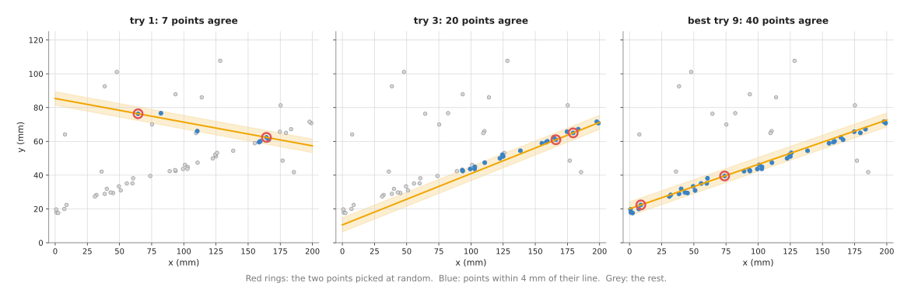
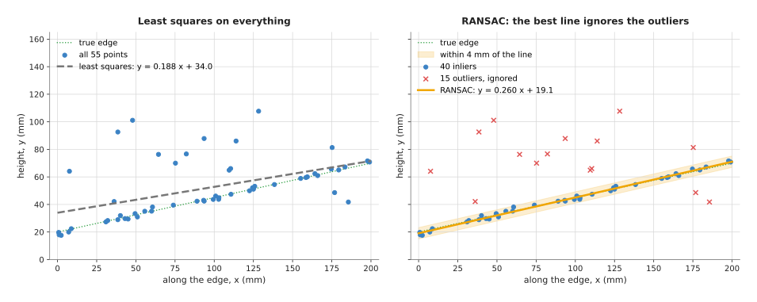
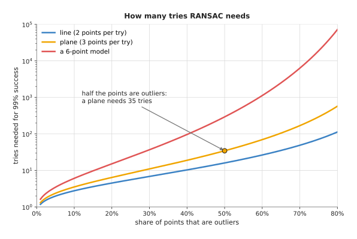
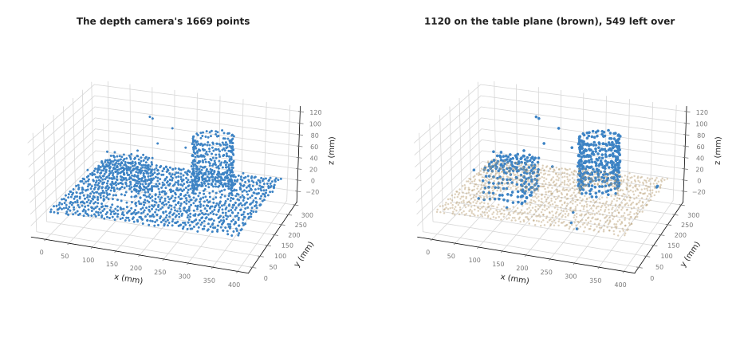

# RANSAC: fitting when some points are wrong

This page explains random sample consensus (RANSAC): a way to fit a line, a
plane, a circle or a cylinder to points when many of the points belong to
something else. It answers four questions. How does RANSAC find the right shape
when a third or half of the points are wrong? How many tries does it need? Where
does a robot arm use it? And what makes it fail?

It is for a reader who has read the page on
[least-squares fitting](02_least-squares-fitting.md). That page explains
parameters, residuals and the root mean square (RMS) residual, and shows that one
bad point can move a least-squares line a long way. This page starts from that
problem. Every number on this page comes from a real run of the diagram script,
`docs/diagrams/fitting_and_estimation.py`.

RANSAC is the standard way a table-top robot finds the table in a depth camera's
point cloud. It was published by Martin Fischler and Robert Bolles in 1981, and it
is still the first thing most perception pipelines run on a new point cloud.

## Contents

1. [What this page answers](#1-what-this-page-answers)
2. [The idea in one sentence](#2-the-idea-in-one-sentence)
3. [How it works, step by step](#3-how-it-works-step-by-step)
   · [The loop](#the-loop)
   · [A worked example: a table edge with stray points](#a-worked-example-a-table-edge-with-stray-points)
   · [The steps as pseudocode](#the-steps-as-pseudocode)
   · [How many tries are enough](#how-many-tries-are-enough)
   · [Planes and cylinders in a point cloud](#planes-and-cylinders-in-a-point-cloud)
   · [Choosing the distance limit](#choosing-the-distance-limit)
4. [Where it is used on a robot arm](#4-where-it-is-used-on-a-robot-arm)
5. [Where it is useful, and where it is not](#5-where-it-is-useful-and-where-it-is-not)
6. [Libraries that provide it](#6-libraries-that-provide-it)
7. [Why RANSAC, and what it costs](#7-why-ransac-and-what-it-costs)
8. [Where to read next](#8-where-to-read-next)

---

## 1. What this page answers

Real point clouds are messy. A depth camera looking at a table sees the table,
but also the objects on it, the edge of the table, the floor beyond, and a
scatter of false readings where the light hit a shiny surface. If you want the
table's plane, only some of those points belong to it.

Least squares uses every point, so the other points drag the answer away. You
could remove them first, but to know which points to remove you need to know
where the table is. That is the question you started with.

RANSAC breaks this circle. It does not need to know in advance which points are
good. It finds the shape and the points that belong to it at the same time. The
points that belong to the shape are called **inliers**. The rest are called
**outliers**.

---

## 2. The idea in one sentence

**Guess the shape from a few randomly chosen points, count how many other points
agree with the guess, repeat many times, and keep the guess that most points
agree with.**

Here is an everyday example. A group of people each point at where they think a
lost ball landed. Most of them saw it and point near the same spot. A few are
guessing and point all over the field. If you take the average of all the
pointing directions, the guessers pull it off. Instead, you pick one person at
random and ask everyone else, "Who agrees with this person, give or take a
metre?" If most hands go up, you have found the spot. If only two hands go up,
you picked a guesser, so you pick someone else and ask again.

The key point is that a guess made only from good points will be agreed with by
all the other good points. A guess that includes even one bad point will be
agreed with by almost nobody. So you do not need to know which points are good.
You only need to keep trying until one guess is made entirely from good points.

---

## 3. How it works, step by step

### The loop

RANSAC needs three things from you: the kind of shape, the smallest number of
points that defines one such shape, and a distance limit.

- The smallest number of points is 2 for a line, 3 for a plane and 3 for a
  circle on a table.
- The **distance limit** says how close a point must be to the shape to count
  as agreeing with it. It should be a little larger than the sensor's noise.

Then it runs this loop:

1. Pick the smallest number of points at random.
2. Make the one shape that passes exactly through them.
3. Measure every point's distance from that shape. Count the points closer
   than the distance limit. Those points are this try's inliers.
4. If this try has more inliers than the best try so far, remember it.
5. Repeat from step 1 a fixed number of times.
6. Take the inliers of the best try, and fit the shape to all of them with
   [least squares](02_least-squares-fitting.md). This last step uses every good
   point, not just the two or three that were picked.

### A worked example: a table edge with stray points

The example has 55 points in a side view of a table edge, in millimetres. Forty
of them lie along the edge, whose true line is `y = 0.25 x + 20`, with 1.5 mm of
noise. Fifteen are stray readings scattered above it. So 27% of the points are
outliers.

The picture below shows three of the 100 tries RANSAC made, with a distance
limit of 4 mm.



Try 1 picked a stray point and an edge point, so its line crosses the edge at
an angle and only 7 points lie within 4 mm of it. Try 3 picked two edge points
close together at the right end. Their noise tilts the line a little, so it
fits the right part of the edge and misses the left part: 20 points agree. Try 9
picked two edge points 65 mm apart. Its line follows the whole edge, and all 40
edge points agree with it. No try did better than 40.

The final step fits a least-squares line to those 40 inliers. The picture below
compares the result with a least-squares line through all 55 points.



The least-squares line through everything is `y = 0.188 x + 34.0`. Its offset is
14 mm too high and its slope is a quarter too shallow. The RANSAC line is
`y = 0.260 x + 19.1`, close to the true `y = 0.25 x + 20`. RANSAC also labelled
every one of the 55 points correctly: the 40 edge points as inliers and the 15
stray points as outliers.

### The steps as pseudocode

```
function ransac(points, sample_size, distance_limit, tries):
    best_inliers = empty set
    repeat tries times:
        sample = choose sample_size points at random, without repeats
        shape = the shape that passes exactly through sample
        if shape could not be made (for example, the points are on one line):
            continue with the next try
        inliers = every point whose distance to shape < distance_limit
        if size of inliers > size of best_inliers:
            best_inliers = inliers
    final_shape = least-squares fit of the shape to best_inliers
    inliers = every point whose distance to final_shape < distance_limit
    return final_shape, inliers
```

Two common improvements are worth knowing. The first stops early: after each
new best try, recompute how many tries are needed from the share of inliers
just found, as the next section explains, and stop when that many have been
done. The second, called **MSAC**, scores each try by how close the agreeing
points are, not just how many there are, which breaks ties between guesses more
sensibly.

### How many tries are enough

A try succeeds when every point in its sample is an inlier. If a share `w` of
the points are inliers and a sample has `s` points, one try succeeds with a
chance of `w` multiplied by itself `s` times, written `wˢ`. To be sure, with a
chance `p` such as 99%, that at least one try succeeds, you need this many
tries:

```
tries = log(1 − p) / log(1 − wˢ)
```

In the worked example, `w` is 40 out of 55, which is 0.727, and `s` is 2. One
try succeeds with a chance of 0.53. For 99% certainty the formula gives 6.1, so
7 tries are enough. The example used 100, which is far more than needed. That
is common in practice: a line or plane try is cheap, so people use a generous
number.

The picture below plots the formula for a line, a plane and a shape that needs 6
points.



The number of tries grows slowly at first and then very fast. For a plane with
half the points as outliers, 35 tries are enough. For a plane with 70% outliers,
168 tries are needed. A shape that needs 6 points, with half the points as
outliers, needs 292 tries. This is why RANSAC works best for shapes defined by
very few points, and why it slows down sharply when the wanted shape is only a
small part of the scene.

### Planes and cylinders in a point cloud

For a plane, a try picks 3 points. The plane through them has a normal equal to
the cross product of two edges of the triangle they make. The cross product is a
standard operation that gives the direction at right angles to two other
directions. A point's distance from the plane is the size of its offset from
one of the three points, measured along the normal.

The picture below runs RANSAC on a simulated depth camera view of a table with a
box and a cup on it, plus 25 stray readings. It used 200 tries and a distance
limit of 5 mm.



Of the 1669 points, 1120 are on the table plane and 549 are left over. The
fitted plane's normal is (−0.030, 0.020, 0.999). The table was made tilted with
a normal of (−0.030, 0.020, 0.999), so the fit matches to three decimal places.
The top of the box is also a plane, but it has only 90 points against the
table's 1100 or so, so RANSAC keeps the table. The leftover points go to
[clustering](../05_image-and-point-cloud-processing/05_clustering.md), which
splits them into one group per object.

A cylinder, such as a can, a bottle or a pipe, is harder, because two or three
positions alone do not fix its axis. The usual method first works out each
point's **normal**, the direction the surface faces at that point, from a small
plane fit to its nearest neighbours. Then a try picks 2 points with their
normals. On a cylinder, both normals point straight away from the axis, so the
axis runs at right angles to both. That gives the axis direction, and then its
position and the radius. A point agrees if its distance from the axis is close
to the radius and its normal points away from the axis. The Point Cloud Library
(PCL) does this with its cylinder model, described in section 6.

### Choosing the distance limit

The distance limit is the one setting that matters most. A good start is two to
three times the sensor's noise. For a depth camera with about 1.5 mm of noise
on a table half a metre away, 4 to 5 mm is common.

If the limit is too small, real surface points count as outliers. The inlier
count of the true shape then drops, and a wrong shape can win. If the limit is
too large, points just above the surface count as inliers. On a table, that
means the bottom few millimetres of every object are deleted with the table.
That matters for flat objects such as a coin or a phone lying down, which can
vanish completely.

---

## 4. Where it is used on a robot arm

RANSAC is mostly a perception tool, but it also appears in calibration and
sensing.

- **Removing the table.** The classic table-top recipe finds the biggest plane,
  deletes it, and clusters what is left into objects. Book 2 describes this in
  [remove the plane, then cluster](../../02_perception/02_object-perception/03_programmed-methods.md#16-point-clouds-remove-the-plane-then-cluster),
  and the [tools and libraries](../../03_frameworks/01_tools-and-libraries.md#9-perception-camera-drivers-opencv-and-open3d)
  page shows it as real Open3D code.
- **Finding walls and bin sides.** A robot picking from a bin runs RANSAC
  several times: find the biggest plane (the bin floor), remove its points, find
  the next (a wall), and so on. What is left is the parts.
- **Fitting cylinders.** A robot that picks cans, bottles or pipes fits a
  cylinder to each cluster to get its axis and radius, and so the direction to
  approach it from.
- **Finding a circle in a noisy rim.** A glass's rim seen by a camera often has
  a few pixels from a reflection or from a neighbouring glass. A circle RANSAC
  finds the rim first, then least squares refines it.
- **Matching features between pictures.** When a camera on the arm moves, a
  program matches small patches between the old and new picture. Some matches
  are wrong. RANSAC finds the camera movement that most matches agree with. The
  same idea finds an object's pose from matched points, which OpenCV provides as
  `solvePnPRansac`.
- **Calibration.** When some checkerboard corners or marker detections in a
  calibration set are wrong, a RANSAC step can drop those poses before the
  final least-squares fit. The
  [calibration](../02_geometry-and-cameras/04_calibration.md) page covers this.
- **Checking a known table.** When the table is fixed to the arm and measured
  once, RANSAC is not needed on every picture. The glass-picking project in the
  sibling repo explains that choice in its
  [clustering notes](https://github.com/RobinNagpal/robot-arm-projects/blob/main/v5-pick-glasses/docs/problem-2/solutions/02-cluster-on-the-table.md).
  RANSAC can still run now and then, to check that the camera has not been
  knocked.

---

## 5. Where it is useful, and where it is not

RANSAC is the right tool when the shape you want is the biggest single shape in
the data, it is defined by a few points, and you can say how far from the shape
a good point may be. It copes with half or more of the points being outliers,
which almost nothing else does.

The table below lists the ways it fails. Each row gives the cause, the sign you
would see, and what people use instead.

| What goes wrong | The sign you would see | What to use instead |
| --- | --- | --- |
| The wanted shape is not the biggest (a large box top beside a small patch of visible table) | the "table" is 60 mm too high, or tilted | check the plane's normal and height against what you expect; restrict the search to a region; or use a known table plane |
| Two shapes of similar size | the answer flips between them from one picture to the next | find one, remove its points, find the other; decide between them by a rule such as "lowest" |
| Too few tries for the share of outliers | a different, wrong answer on some runs | raise the number of tries, or use the formula above to set it |
| Distance limit too small | many real surface points marked as outliers; the answer jumps around | raise the limit to two or three times the noise |
| Distance limit too large | flat objects vanish with the table; the bottom of every object is cut off | lower the limit; keep points just above the plane for small objects |
| Shape needs many points to define | very many tries, slow | a method that starts from a good guess, such as [iterative closest point](../03_searching-and-matching/03_iterative-closest-point.md), or a learned model |
| You need the same answer every run | tiny differences between runs, which make tests flaky | fix the random seed, or refit with least squares on the inliers (which is usually stable) |
| No shape dominates (a cluttered pile of parts) | low inlier counts for every try | a [point cloud model](../../06_neural-network-models/03_3d-models/02_point-cloud-models.md) that labels each point, or [clustering](../05_image-and-point-cloud-processing/05_clustering.md) first |

---

## 6. Libraries that provide it

RANSAC is built into every major point cloud and vision library. The table below
lists well-known ones. Each row gives the library, the languages it is used from,
the function or class, and a note.

| Library | Languages | Function or class | Note |
| --- | --- | --- | --- |
| Open3D | Python, C++ | `PointCloud.segment_plane(distance_threshold, ransac_n, num_iterations)` | returns the plane and the inlier indices; the usual table-removal call |
| PCL (Point Cloud Library) | C++ | `pcl::SACSegmentation` with `pcl::SACMODEL_PLANE`; `pcl::SACSegmentationFromNormals` with `pcl::SACMODEL_CYLINDER` | planes, lines, circles, spheres and cylinders; also MSAC and other variants |
| OpenCV | C++, Python | `cv::findHomography`, `cv::estimateAffine2D`, `cv::solvePnPRansac`, `cv::findEssentialMat` with the `RANSAC` flag | for matched points between pictures; newer versions also offer the USAC family of improved methods |
| scikit-learn | Python | `sklearn.linear_model.RANSACRegressor` | wraps any regression model; good for lines and planes in NumPy arrays |
| scikit-image | Python | `skimage.measure.ransac` | general RANSAC with ready-made line, circle and ellipse models |

For a table plane in Python, the Open3D call is one line. The
[tools and libraries](../../03_frameworks/01_tools-and-libraries.md#9-perception-camera-drivers-opencv-and-open3d)
page uses `distance_threshold=0.005`, which is 5 mm in metres, and 3 points per
try.

---

## 7. Why RANSAC, and what it costs

RANSAC is a fitting method that tries many shapes, each through a few random
points, and keeps the one most points agree with. It gives the arm the right
shape even when many of the points belong to other things, and it says which
points belong to the shape.

The obvious alternative is least squares on all the points, perhaps after
throwing away the points far from a first fit and fitting again. That works when
only a few points are bad. But the first fit is already pulled towards the bad
points, so it may throw away good points and keep bad ones. In the worked
example, the first least-squares line was 14 mm too high at the left end. The
turn-top-flat project's repeated refit, described on the
[least-squares page](02_least-squares-fitting.md#4-where-it-is-used-on-a-robot-arm),
works because only a thin strip of edge points was wrong. RANSAC never averages
bad points in, so it works when a third or half of the points are bad.

A second alternative is a robust loss: a least-squares variant that counts large
errors less, such as the Huber loss in SciPy's `least_squares`. It is smooth and
repeatable, and good when outliers are a small share. But it starts from a guess,
and with many outliers it can settle on the wrong shape. RANSAC does not need a
starting guess.

The costs are these. It uses random choices, so two runs can give slightly
different answers unless the seed is fixed. It needs a distance limit, which
must match the sensor's noise. It is slower than one least-squares fit, because
it makes many tries, and it gets very slow for shapes that need many points. It
finds only the biggest shape, which may not be the one you meant. And it needs a
least-squares refit at the end to get the best accuracy.

---

## 8. Where to read next

- [Least-squares fitting](02_least-squares-fitting.md) explains the final refit
  and the plane and circle fits that RANSAC calls.
- The [Kalman filter](04_kalman-filter.md) handles readings that arrive over
  time, rather than one batch of points.
- [Clustering](../05_image-and-point-cloud-processing/05_clustering.md) takes
  the points left after the table is removed and splits them into objects.
- [Nearest-neighbour search](../03_searching-and-matching/02_nearest-neighbour-search.md)
  finds the neighbours used to compute each point's normal before a cylinder fit.
- [Point cloud models](../../06_neural-network-models/03_3d-models/02_point-cloud-models.md)
  in Book 6 label each point with a class, which replaces RANSAC when no single
  shape dominates the scene.
- Book 2 shows the full recipe in
  [remove the plane, then cluster](../../02_perception/02_object-perception/03_programmed-methods.md#16-point-clouds-remove-the-plane-then-cluster).
