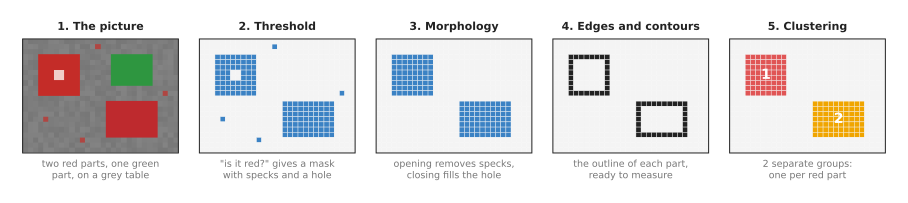
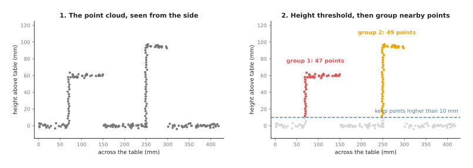

# Image and point cloud processing: an overview

This page opens the chapter on image and point cloud processing, which is the
fourth of the seven families of technique in this book. These are the techniques
that clean up and cut up pictures and point clouds, so that separate objects stand
out from the surface they are standing on.

The page answers four questions: what this family of techniques is for, and which
question it answers for a robot arm. It then says which techniques are in the
family and how they differ. Last, it says how the family connects to the other
families and to the learned models of Book 6.

It is for a reader who already knows what a pixel, a camera picture, a depth
picture and a point cloud are. Book 2 explains all four of those in
[finding an object in a picture](../../02_perception/01_camera/02_finding-objects.md).
You do not need to know any of the techniques themselves yet, because each of the
next five pages explains one group of them from the start.

## Contents

1. [What this family is for](#1-what-this-family-is-for)
2. [The question it answers for a robot arm](#2-the-question-it-answers-for-a-robot-arm)
3. [The technique pages, in two groups](#3-the-technique-pages-in-two-groups)
4. [How the techniques compare](#4-how-the-techniques-compare)
5. [The same ideas on a point cloud](#5-the-same-ideas-on-a-point-cloud)
6. [How this family connects to the others](#6-how-this-family-connects-to-the-others)
7. [Where to read next](#7-where-to-read-next)

---

## 1. What this family is for

Everything in this family starts with what the camera gives the robot, which is a
picture: a grid of numbers holding one small group of numbers for each pixel. A
depth camera also gives a **depth picture**, which holds one distance for each
pixel. So turning every depth pixel into a 3D point gives a **point cloud**, which
is a long list of points that each have an x, a y and a z.

None of these tell the robot where the objects are, because a picture of a mug on
a table is only 300,000 or so coloured dots. Some of those dots belong to the mug
and most belong to the table, so the robot must first decide which dot is which.

The techniques in this family make that decision with written rules. A **rule**
here is a short, exact test that the program applies to every pixel or every
point. "Keep the pixel if it is red enough" is one such rule, and "Keep the point
if it is more than 10 millimetres above the table" is another. Nobody trains these
rules on examples. Instead a person writes them, and the computer then applies
them the same way every time.

The family has four jobs, done one after the other on each picture.

1. **Pick out** the pixels or points that might belong to an object, which gives a
   **mask**: a grid the size of the picture, holding 1 where a pixel passed the
   test and 0 where it did not.
2. **Tidy** the mask, by removing stray specks and filling small holes.
3. **Trace** the outline of each patch in the mask, so that its shape can be
   measured.
4. **Group** the pixels or points into separate objects, one group per object.

A fifth job joins many pictures together, because a camera on a moving arm sees a
different part of the scene in each picture. **Combining** the pictures into one
3D map of free, occupied and not-yet-seen space therefore lets the arm remember
what it cannot see right now.

The picture below shows the first four jobs on one small picture. Every panel in
it was computed from the panel before it by the diagram script.

The picture is 22 by 30 pixels, and the "is it red?" test keeps 134 pixels of it,
but it also keeps four specks of slightly red table and leaves a hole where a
white highlight sits on the first part. After tidying, the specks and the hole are
gone, so grouping then finds exactly 2 objects where the raw mask had held 6
separate patches.

---

## 2. The question it answers for a robot arm

Those four jobs all serve one purpose. Every technique in this family answers some
form of the same question: **which pixels, or which points, belong to which
object?**

A robot arm asks this question before almost everything else it does, and a few
examples show why.

- To pick up a part, the arm needs the part's position and size, and both are
  measured on the part's own pixels or points, never on the table's.
- To place a suction cup, the arm needs a flat spot well inside the part and away
  from its edges, and that spot is found on the part's mask.
- To plan a path that does not hit anything, the planner needs to know which
  points are obstacles, so the table and each object must be separate groups of
  points.
- To count the parts in a tray, the program needs one group per part.

The techniques are also fast, because most of them take about a millisecond on a
normal processor for a camera picture. That is why they can run on every frame of
a live camera, and on the small computers inside the robot.

---

## 3. The technique pages, in two groups

Because the family has those four jobs, plus the fifth one that joins pictures
together, this chapter splits it into five pages arranged in two groups. The first
group is **most used**, which means that almost every programmed perception
pipeline on a robot arm runs all three of them. The second group is **also used**,
which means that those pages are common but are needed only for some jobs or some
set-ups.

The most used pages follow the order of the jobs listed above.

1. [Thresholding and colour masks](02_most-used/01_thresholding-and-colour-masks.md)
   picks out pixels by testing each one against a limit, which can be a
   brightness, a colour range in hue, saturation and value, or a depth range. It
   also covers Otsu's method, which chooses the brightness limit from the picture
   itself.
2. [Morphology and the distance transform](02_most-used/02_morphology-and-distance-transform.md)
   tidies a mask by shrinking and growing it. It also measures how far each mask
   pixel is from the nearest edge. That is how it finds the most central point of
   a part, and how it helps split touching objects.
3. [Clustering](02_most-used/03_clustering.md) groups pixels or points into
   separate objects, using connected components on a mask, and Euclidean
   clustering and DBSCAN on a point cloud. It also covers voxel downsampling,
   which thins a point cloud before the grouping, and k-means and mean shift,
   which find the centre of each crowd of points.

These three are the most used because each one is needed in nearly every pipeline.
A mask must be made, then it must be cleaned, and then it must be split into
objects before the arm can pick one of them.

The also used pages are needed less often, because most pipelines can finish
without them.

4. [Edges and contours](03_also-used/01_edges-and-contours.md) finds where the
   brightness changes sharply, traces the outline of each patch, and turns an
   outline into a few corners or a fitted shape. It also covers the Hough
   transform, which finds straight lines and circles, such as a cup's rim, in
   broken edges. Many pipelines only need a mask's centre and size, which
   clustering already gives, so outlines are needed mainly when the shape itself
   matters.
5. [Volumetric maps](03_also-used/02_volumetric-maps.md) combine many depth
   pictures into one 3D map: an occupancy map of free, occupied and unknown space,
   and distance maps that planners read. A robot with a fixed camera and a clear
   table often plans straight from the latest point cloud. So the map is needed
   mainly when the camera moves or parts of the scene are hidden. When it is used,
   it is usually built for you by a library such as MoveIt.

The first two pages are read best in order, because the second page tidies the
masks that the first page makes. Clustering and edges and contours can then be
read in either order, since neither one depends on the other. Volumetric maps can
be read on its own after the [clustering](02_most-used/03_clustering.md) page,
which is where voxels are introduced.

---

## 4. How the techniques compare

Now that the five pages have been named, the table below compares the main
techniques inside them side by side. Each row is one technique, so read across a
row to see what that technique takes in, what it gives back, and a typical use on
a robot arm. The last column gives how many numbers you usually have to choose by
hand, which is a fair guide to how much tuning the technique needs.

| Technique | Page | What goes in | What comes out | A typical use on an arm | Numbers to choose |
| --- | --- | --- | --- | --- | --- |
| Brightness threshold | [thresholding](02_most-used/01_thresholding-and-colour-masks.md) | a grey picture | a mask | a dark part on a light tray | 1 |
| Otsu's method | [thresholding](02_most-used/01_thresholding-and-colour-masks.md) | a grey picture | a mask, and the limit it chose | the same, when the light level drifts | 0 |
| Colour range in HSV | [thresholding](02_most-used/01_thresholding-and-colour-masks.md) | a colour picture | a mask | a red part on a grey table | 6 |
| Depth threshold | [thresholding](02_most-used/01_thresholding-and-colour-masks.md) | a depth picture | a mask | anything standing on the table | 1 or 2 |
| Erosion and dilation | [morphology](02_most-used/02_morphology-and-distance-transform.md) | a mask | a smaller or larger mask | keep a grasp point away from edges | 1 (brush size) |
| Opening and closing | [morphology](02_most-used/02_morphology-and-distance-transform.md) | a mask | a tidier mask | remove specks and fill holes after a threshold | 1 (brush size) |
| Distance transform | [morphology](02_most-used/02_morphology-and-distance-transform.md) | a mask | a distance for every mask pixel | the most central point for a suction cup | 0 |
| Connected components | [clustering](02_most-used/03_clustering.md) | a mask | a label for each separate patch | count the parts on a tray | 0 or 1 |
| Euclidean clustering and DBSCAN | [clustering](02_most-used/03_clustering.md) | a point cloud | a label for each group of points | one group per object on a table | 2 |
| Voxel downsampling | [clustering](02_most-used/03_clustering.md) | a point cloud | fewer, evenly spread points | make a large cloud fast to process | 1 |
| K-means | [clustering](02_most-used/03_clustering.md#3-finding-the-peaks-k-means-and-mean-shift) | points or pixel colours | k groups and their centres | the main colours of a known set of parts | 1 (k) |
| Mean shift | [clustering](02_most-used/03_clustering.md#3-finding-the-peaks-k-means-and-mean-shift) | points | the crowded middle of each group | one grasp from many proposed grasps | 1 (window) |
| Edges (Canny) | [edges](03_also-used/01_edges-and-contours.md) | a grey picture | thin lines where brightness jumps | the rim of a mug | 2 |
| Contours and polygons | [edges](03_also-used/01_edges-and-contours.md) | a mask | an outline, then a few corners | count the corners of a flat part | 1 |
| Hough transform | [edges](03_also-used/01_edges-and-contours.md#3-finding-lines-and-circles-by-voting-the-hough-transform) | edge pixels | straight lines and circles | a cup's rim seen from above, partly hidden | 2 or 3 |
| Occupancy map | [volumetric maps](03_also-used/02_volumetric-maps.md) | many depth pictures and camera poses | free, occupied or unknown for each voxel | obstacles the planner must avoid | 1 (voxel size) |
| TSDF and ESDF | [volumetric maps](03_also-used/02_volumetric-maps.md#step-5-the-truncated-signed-distance-function) | many depth pictures and camera poses | a smooth surface, and the distance to the nearest obstacle | scan an object; keep a path clear | 2 |

Two of those columns matter most when you choose. The first is "what goes in",
because it tells you which camera you need: a colour camera, a grey camera or a
depth camera. The second is "numbers to choose", because it tells you how much
work it is to make the technique behave in a new setting. A technique with zero
numbers adapts on its own, whereas a technique with six numbers needs care
whenever the light changes.

---

## 5. The same ideas on a point cloud

The table above lists picture techniques and point cloud techniques together. That
is possible because most of the techniques were first written for pictures, but
almost all of them also have a point cloud form in which the idea is the same. The
three pairs below show how a picture technique and its point cloud twin line up.

- A threshold on a picture keeps pixels whose value is inside a range, and on a
  point cloud a **pass-through filter** keeps points whose x, y or z is inside a
  range, such as "higher than 10 millimetres above the table".
- Opening removes lone specks from a mask, and on a point cloud an **outlier
  removal** step removes lone points that have too few neighbours.
- Connected components joins mask pixels that touch, and on a point cloud
  **Euclidean clustering** joins points that are closer together than a set
  distance.

The picture below shows the first and last of these on a point cloud of a table
with a box and a tall cylinder on it, seen from the side.

The left panel holds every point, while in the right panel the height threshold
has dropped the table points, which are shown in light grey. Grouping the points
that lie closer than 15 millimetres to each other then gives exactly two groups,
with 47 points on the box and 49 on the cylinder. Both the points and the groups
were computed by the diagram script.

The table under an object is hidden from the camera, so there are no table points
there at all, and that is normal. It is also why the table has to be found first,
usually by fitting a plane with [random sample consensus (RANSAC)](../04_fitting-and-estimation/02_most-used/02_ransac.md).
Only then does a height threshold make any sense.

---

## 6. How this family connects to the others

Because this family turns the raw numbers from the camera into masks, outlines and
groups, it sits between the camera and almost everything else the robot does. That
position means it both depends on other families and feeds them.

It depends on two families in particular.

- [Geometry and cameras](../02_geometry-and-cameras/01_overview.md) turns pixels,
  frames and joint angles into positions you can trust. Its
  [pinhole camera model](../02_geometry-and-cameras/02_most-used/01_pinhole-camera-model.md)
  turns a depth picture into a point cloud, and it turns a mask's middle pixel
  into a 3D point the arm can reach.
- [Fitting and estimation](../04_fitting-and-estimation/01_overview.md) gets a
  clean shape or a steady number out of noisy measurements. So it finds the table
  plane that a height threshold needs, and it fits circles and lines to the
  outlines this family traces.

Two other families then use its output.

- [Searching and matching](../03_searching-and-matching/01_overview.md) finds the
  closest thing and decides which thing is which. So clustering a point cloud uses
  [nearest-neighbour search](../03_searching-and-matching/02_most-used/01_nearest-neighbour-search.md)
  inside it, and matching each group to the object seen one frame ago uses
  [assignment](../03_searching-and-matching/02_most-used/03_assignment-and-matching.md).
- [Planning and search](../06_planning-and-search/01_overview.md) finds a way for
  the arm to get from here to there without hitting anything, so it needs the
  groups of points, or a [volumetric map](03_also-used/02_volumetric-maps.md)
  built from many pictures, as its obstacles.

Book 6 has learned models that do the same job. For example, a
[segmentation model](../../06_learned-models/03_seeing-models/02_most-used/02_segmentation.md)
gives a mask for each object straight from the picture, and a
[point cloud model](../../06_learned-models/04_3d-models/02_most-used/01_point-cloud-models.md)
labels each point on its own. A learned model copes with cluttered scenes, mixed
colours and changing light far better than a written rule. But it needs training
pictures, a bigger computer and more time for each frame, and when it fails it is
much harder to see why. The page
[choosing a technique](../01_what-techniques-are/03_choosing-a-technique.md)
explains when to switch from one to the other.

The two are often used together, because a learned model gives a rough mask and
the techniques in this chapter then tidy it, measure it and split it. The
[morphology page](02_most-used/02_morphology-and-distance-transform.md#4-where-it-is-used-on-a-robot-arm)
shows a real example of that pairing.

---

## 7. Where to read next

Since the five technique pages do not all have to be read in order, the list below
says which one to open first and where each of the others fits.

- Start with [thresholding and colour masks](02_most-used/01_thresholding-and-colour-masks.md),
  because it makes the masks that most of the other pages work on.
- Read [volumetric maps](03_also-used/02_volumetric-maps.md) when the arm must
  avoid obstacles that nobody put in its model.
- [The map of techniques](../01_what-techniques-are/04_the-map-of-techniques.md)
  shows where this family sits among all seven.
- Book 2 runs a complete colour-and-depth example with real code in
  [finding an object in a picture](../../02_perception/01_camera/02_finding-objects.md#3-finding-it-by-colour),
  and it describes many more written methods in
  [methods you write yourself](../../02_perception/02_object-perception/03_programmed-methods.md).
- [Segmentation](../../06_learned-models/03_seeing-models/02_most-used/02_segmentation.md)
  in Book 6 is the learned model that does the same job as this whole chapter.
