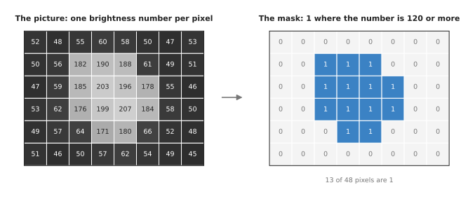
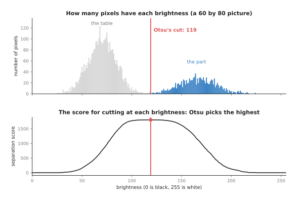
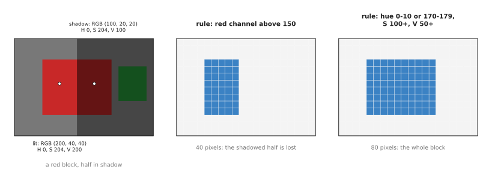
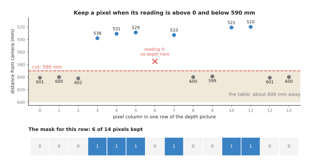

# Thresholding and colour masks

This page explains thresholding, which is the technique that decides whether a
pixel belongs to the thing you are looking for. It makes that decision for every
pixel on its own, so no pixel is ever compared with its neighbours.

The page answers four questions, and the first two are about grey pictures: how a
threshold turns a picture into a mask, and how the picture itself can choose the
limit. The other two questions move on to colour and depth. So the page also asks
why robot programs test colour in hue, saturation and value rather than in red,
green and blue, and it then shows how the same idea works on a depth picture.

It is for a reader who knows that a picture is a grid of pixels and that each
pixel is stored as numbers. Beyond that you need no background in algorithms,
because every example here uses a few pixels you can check by hand. Every number
on this page came from a real run of the diagram script.

Thresholding is usually the first step of a hand-written perception program, so
the [overview of this chapter](../01_overview.md) puts it first. It makes the mask
that the later steps tidy, trace and group.

## Contents

1. [The idea in one sentence](#1-the-idea-in-one-sentence)
2. [How a brightness threshold works](#2-how-a-brightness-threshold-works) ·
   [One limit, one test per pixel](#one-limit-one-test-per-pixel) ·
   [Otsu's method: let the picture choose the limit](#otsus-method-let-the-picture-choose-the-limit)
3. [Colour and depth thresholds](#3-colour-and-depth-thresholds) ·
   [Colour in hue, saturation and value](#colour-in-hue-saturation-and-value) ·
   [A depth threshold](#a-depth-threshold) ·
   [The steps as pseudocode](#the-steps-as-pseudocode)
4. [Where it is used on a robot arm](#4-where-it-is-used-on-a-robot-arm)
5. [Where it is useful, and where it is not](#5-where-it-is-useful-and-where-it-is-not)
6. [Libraries that provide it](#6-libraries-that-provide-it)
7. [Why thresholding, and what it costs](#7-why-thresholding-and-what-it-costs)
8. [The learned alternative](#8-the-learned-alternative)
9. [Where to read next](#9-where-to-read-next)

---

## 1. The idea in one sentence

The whole technique fits into one sentence, and the rest of this page only fills
that sentence in. A threshold compares each pixel with a fixed limit, and it
writes 1 into a mask where the pixel passes and 0 where it does not.

The limit is called the **threshold**, and the grid of ones and zeros is called a
**mask**. This mask has one entry for each pixel of the picture. Some libraries
store 255 instead of 1 so that the mask can be shown as a black and white picture,
but the meaning is the same.

For an everyday example, think of a farmer who sorts eggs by weight. Every egg
goes on the scale, and the ones of 63 grams or more go in the "large" box while
the rest go in the other box. The farmer never compares one egg with another,
because each egg is tested on its own against a single number. A threshold treats
pixels in exactly that way.

---

## 2. How a brightness threshold works

### One limit, one test per pixel

That one-sentence idea is easiest to follow on a grey picture, which holds one
number per pixel, its **brightness**. Brightness runs from 0 for black to 255 for
white, so a bright object on a dark background is already separated by that one
number.

The picture below is a real 6 by 8 grey picture, in which a bright metal part lies
on a dark rubber mat. Each square in it shows the brightness number of one pixel.



The rule here is "brightness 120 or more", and it works cleanly because the two
groups of numbers lie far apart. The mat pixels all fall between 45 and 66, so
they all fail, while the part pixels all fall between 171 and 207, so they all
pass. So the mask holds 13 ones out of 48 pixels, and those 13 pixels are the
part.

Thresholding a whole picture takes only the three steps below.

1. Choose the limit, here 120.
2. Go through the pixels one at a time.
3. If the pixel's number is at the limit or above it, write 1 in the mask.
   Otherwise, write 0.

Each pixel is tested on its own, and the test never looks at the neighbours. This
is why thresholding is so fast, because a computer can test a whole camera picture
of 300,000 pixels in well under a millisecond.

Some programs want the dark pixels instead, for example a black part on a white
tray. For them the rule becomes "brightness below the limit", while other programs
keep a band, with a lower limit and an upper limit. Both are the same idea pointed
in a different direction.

### Otsu's method: let the picture choose the limit

The limit of 120 above was chosen by a person, which works only while the light
stays the same. Because every number falls when the room gets darker, the part may
drop to around 110, and the fixed limit then loses it.

**Otsu's method** chooses the limit from the picture itself, and it is named after
Nobuyuki Otsu, who published it in 1979. It assumes that the picture holds two
groups of pixels, a dark group and a bright group. So it tries every possible
limit and keeps the one that separates those two groups best.

"Separates best" has an exact meaning, because for each possible limit the method
splits the pixels into a dark group and a bright group. It then works out a
**score** for that split:

    score = (share of pixels in the dark group)
          × (share of pixels in the bright group)
          × (bright group's average − dark group's average)²

The score is large when the two averages are far apart and when neither group is
tiny. So the method simply keeps the limit with the largest score.

Here is a small worked example with 14 pixel values, taken along one line across a
mat and a part:

    48  52  55  60  63  70  85  110  150  172  180  188  196  201

The value 110 is a pixel on the edge of the part, so it is half mat and half part.
This means the method has to decide which of the two groups it belongs to. The
table below shows the score for some of the possible splits. Read each row as "put
every value up to here in the dark group, and the rest in the bright group".

| Split between | Dark group | Dark average | Bright group | Bright average | Score |
| --- | --- | --- | --- | --- | --- |
| 70 and 85 | 6 values | 58.0 | 8 values | 160.2 | 2,560 |
| 85 and 110 | 7 values | 61.9 | 7 values | 171.0 | 2,978 |
| **110 and 150** | 8 values | 67.9 | 6 values | 181.2 | **3,143** |
| 150 and 172 | 9 values | 77.0 | 5 values | 187.4 | 2,798 |
| 172 and 180 | 10 values | 86.5 | 4 values | 191.2 | 2,239 |

For the best row, the score is 8/14 × 6/14 × (181.2 − 67.9)², which comes out at
about 3,143. So Otsu's method puts the edge pixel 110 with the mat, and the six
values from 150 upwards with the part. Any limit between 111 and 150 gives that
same split.

A real picture has thousands of pixels, so the method works on a **histogram**
instead. A histogram counts how many pixels have each brightness from 0 to 255.
This means the method only has to try 255 splits, whatever the size of the
picture.



The top panel is the histogram of a 60 by 80 picture that holds a bright part on a
dark mat, with some camera noise, and it has two humps. The bottom panel is the
score for every possible cut, and the highest score is at 119, in the empty gap
between the humps. So 119 is the limit that Otsu's method returns. The score curve
is almost flat across that gap, which is good news. This means a small change in
the picture moves the limit a little, but the mask hardly changes.

Otsu's method has no number for you to choose, and that is its main strength. Its
main weakness is the assumption that there are only two groups. So if the picture
holds three groups, for example a dark mat, a grey part and a white label, the
method still returns a single limit. This means it may cut through the wrong gap.

---

## 3. Colour and depth thresholds

### Colour in hue, saturation and value

Brightness is enough for a part that is plainly lighter or darker than its
background, but many parts are picked out by their colour instead. A colour pixel
is usually stored as three numbers, how much red, green and blue it has, and each
of them runs from 0 to 255. This way of storing a colour is called **RGB**.

However, RGB is a poor way to ask "is this pixel red?", because when the light
gets weaker all three numbers fall together. A red block might be (200, 40, 40) in
the light and (100, 20, 20) in shadow. So a rule such as "red above 150" finds the
first and misses the second.

So robot programs convert each pixel to **HSV** first, which stands for hue,
saturation and value. HSV describes the same colour with three more useful
numbers.

- **Hue** says which colour it is, going round a colour circle. In OpenCV, the
  most used vision library, hue runs from 0 to 179 so that it fits in one byte.
  Red is near 0, green near 60 and blue near 120.
- **Saturation** says how strong the colour is, from 0 to 255. Grey, white and
  black have saturation 0.
- **Value** says how bright the pixel is, from 0 to 255.

In shadow, a red block keeps its hue and its saturation, and only its value falls.
This is exactly why splitting the colour into three numbers helps. The table below
shows the numbers for six pixels, as the diagram script computed them on OpenCV's
scale. Read each row across to see the pixel, its HSV numbers, and whether each of
two rules accepts it.

| Pixel | RGB | Hue | Saturation | Value | "Red above 150" | "Hue 0–10 or 170–179, saturation 100+, value 50+" |
| --- | --- | --- | --- | --- | --- | --- |
| red block, lit | (200, 40, 40) | 0 | 204 | 200 | yes | yes |
| red block, in shadow | (100, 20, 20) | 0 | 204 | 100 | **no** | yes |
| a slightly bluish red | (200, 40, 60) | 176 | 204 | 200 | yes | yes |
| grey table | (120, 120, 120) | 0 | 0 | 120 | no | no |
| white sheet of paper | (235, 235, 235) | 0 | 0 | 235 | **yes** | no |
| green block | (40, 160, 60) | 65 | 191 | 160 | no | no |

The RGB rule makes two mistakes, because it loses the shadowed red and it accepts
the white paper, whose red number is also high. The HSV rule makes neither
mistake, since it looks at hue for the colour and at saturation to throw out grey
and white. It then looks at value only to throw out pixels that are too dark to
judge.

The third row shows a quirk of red, which sits at both ends of the hue circle,
just above 0 and just below 179. So a slightly bluish red has hue 176 rather than 2.
This means a red rule needs two hue ranges, where every other colour needs only
   one.



The picture is 14 by 20 pixels, and the red block covers 80 of them. The RGB rule
keeps only the 40 lit pixels, while the HSV rule keeps all 80. The green block is
also in the shadow, and neither rule keeps it, because both rules are looking for
red.

A colour mask has six numbers to choose, a lower and an upper limit for each of
hue, saturation and value. So it takes more tuning than a brightness threshold,
which has only one. People usually find the six by pointing at the object in a few
pictures and reading off its HSV numbers, then leaving some room on each side.

### A depth threshold

Colour separates a part from its background only when the two differ in colour,
whereas a depth camera separates them by distance instead. A depth camera gives a
**depth picture**, in which each pixel holds a distance from the camera, often in
millimetres. So a depth threshold keeps the pixels whose distance is inside a
range.

The most common use is "keep everything nearer than the table". For example,
imagine a camera looking straight down at a table 600 millimetres away. Anything
standing on that table is nearer than 600, so the rule "distance below 590" keeps
every object taller than about 10 millimetres, whatever its colour.

A depth picture has one trap, which is that most cameras write 0 wherever they
could not measure. This happens on glass, on shiny metal, on very dark surfaces
and along the edges of objects. A reading of 0 would pass the test "below 590",
because 0 is below 590, so the rule must also say "above 0".



This is one real row of 14 depth pixels, in which the table pixels read 599 to 602
and two objects read between 520 and 538. Pixel 6 reads 0, because the camera saw
nothing there. With the rule "above 0 and below 590", the mask keeps 6 of the 14
pixels. Without the "above 0" part it would keep 7, and pixel 6 would count as an
object right next to the camera.

However, a missing reading is not always noise to throw away. A patch of zeros
shaped like a glass, with the glass clearly visible in the colour picture, is a
strong sign of a transparent object. Book 2 uses this in
[the depth hole, for glass and chrome](../../../02_perception/02_object-perception/03_programmed-methods.md#17-the-depth-hole-for-glass-and-chrome),
where the threshold is simply "reading equals 0".

A fixed limit such as 590 only works if the camera looks straight down at a flat
table. That is because a tilted camera sees the table nearer at the top of the
picture than at the bottom. So the usual fix is to turn the depth picture into a
point cloud, find the table plane with
[RANSAC](../../04_fitting-and-estimation/02_most-used/02_ransac.md), and keep the
points higher than 10 millimetres above that plane. This is the same threshold,
measured from the table instead of from the camera.

### The steps as pseudocode

The three kinds of threshold described above are written out below as plain steps.
This pseudocode does not belong to any programming language.

```text
function brightness_mask(grey, limit):
    mask = a grid the size of grey, filled with 0
    for each pixel p:
        if grey[p] >= limit:
            mask[p] = 1
    return mask

function otsu_limit(grey):
    count = how many pixels have each brightness 0..255
    best_limit = 0, best_score = 0
    for limit from 1 to 255:
        dark   = pixels with brightness below limit
        bright = pixels with brightness at or above limit
        if dark or bright is empty: skip this limit
        score = share(dark) * share(bright) * (average(bright) - average(dark))^2
        if score > best_score:
            best_score = score, best_limit = limit
    return best_limit

function red_mask(colour):
    mask = a grid the size of colour, filled with 0
    for each pixel p:
        h, s, v = convert colour[p] to hue, saturation, value
        red_hue = (h <= 10) or (h >= 170)
        if red_hue and s >= 100 and v >= 50:
            mask[p] = 1
    return mask

function depth_mask(depth, near, far):
    mask = a grid the size of depth, filled with 0
    for each pixel p:
        if depth[p] > 0 and near <= depth[p] < far:
            mask[p] = 1
    return mask
```

Real libraries do not loop over pixels one by one in slow code. Instead they run
the same test on the whole grid at once, in fast compiled code, and the result is
the same.

---

## 4. Where it is used on a robot arm

Now that all three kinds of threshold are on the table, it is worth seeing where
they actually turn up. Thresholding appears in almost every hand-written
perception program on an arm, and the list below gives some concrete places.

- A coloured part is found with a colour mask, so a red block, a blue bin or a
  green marker on a table is picked out by an HSV mask. The middle of the mask,
  together with the depth at that pixel, gives the point the arm reaches for, and
  Book 2 runs this end to end in [finding it by colour](../../../02_perception/01_camera/02_finding-objects.md#3-finding-it-by-colour).
- Anything that stands on the table is found with a depth threshold, because a
  threshold measured from the table plane keeps every object whatever its colour.
  This is the first step of the classic "remove the plane, then cluster" recipe,
  described in Book 2 under [point clouds: remove the plane, then cluster](../../../02_perception/02_object-perception/03_programmed-methods.md#16-point-clouds-remove-the-plane-then-cluster).
- The point cloud is cropped to the workspace by a box-shaped threshold on x, y
  and z, which keeps only the points inside the arm's reach. It throws away the
  floor, the walls and the robot's own base, and so it makes every later step
  faster.
- A depth threshold checks that the gripper holds something, because a wrist
  camera looks between the fingers and the program counts the depth pixels nearer
  than the fingertips inside a small window. If that count is above a limit, then
  something is in the gripper.
- Otsu's method suits parts on a backlit tray, since a light box under the tray
  makes every part a dark shadow on a white background. Otsu's method then finds
  the limit on its own, even as the lamp ages and dims.
- A depth threshold notices a person entering the cell, because a fixed overhead
  depth camera watches the cell all the time. If more than a set number of pixels
  become nearer than the empty floor, then something has entered, and the arm
  slows down or stops.
- A threshold turns a learned model's scores into a mask, because a
  [segmentation model](../../../06_learned-models/03_seeing-models/02_most-used/02_segmentation.md)
  gives each pixel a number from 0 to 1 saying how sure it is that the pixel
  belongs to an object. A threshold, often 0.5, turns that into a mask, so even a
  learned pipeline ends in a threshold.

---

## 5. Where it is useful, and where it is not

All of those uses share one condition, which is that a single simple number
separates the object from everything else. That number is its brightness, its
colour or its height. So thresholding fails whenever no such number exists, and
the table below lists the common failures. Read each row as: this goes wrong, this
is what you see, and this is what people use instead.

| What goes wrong | The sign you would see | What people use instead |
| --- | --- | --- |
| The light changes, for example daylight through a window | The mask shrinks or grows during the day; the part is lost in the evening | HSV instead of RGB; Otsu's method; a lamp you control; a depth threshold |
| Uneven light, bright on one side of the table and dark on the other | Otsu's limit is right on one side and wrong on the other | An **adaptive threshold**, which picks a separate limit for each small area of the picture |
| The object is the same colour as the background, such as a white mug on a white table | The mask is empty, or it covers the whole table | A depth threshold, or a [segmentation model](../../../06_learned-models/03_seeing-models/02_most-used/02_segmentation.md) |
| Two objects of the same colour touch | One patch in the mask where there should be two | [The distance transform](02_morphology-and-distance-transform.md) and watershed, or 3D [clustering](03_clustering.md) |
| A shiny highlight on the object | A hole in the middle of the mask | [Closing](02_morphology-and-distance-transform.md) to fill the hole |
| Camera noise near the limit | Single specks scattered across the mask | [Opening](02_morphology-and-distance-transform.md), or a small blur before the threshold |
| Glass, mirrors and polished metal | Zeros in the depth picture; colour taken from whatever is behind | Treat the zeros as a signal, or use a learned depth model such as [depth from pictures](../../../06_learned-models/03_seeing-models/03_also-used/02_depth-from-pictures.md) |
| Many kinds of object, each a different colour | One mask per colour, and a new rule every time a new part arrives | A trained [object detector](../../../06_learned-models/03_seeing-models/02_most-used/01_object-detection.md) |

Book 2 lists the same failures from the other side in
[when colour stops working](../../../02_perception/01_camera/02_finding-objects.md#36-when-colour-stops-working).

---

## 6. Libraries that provide it

Because those failures and their fixes are so well known, they are already built
into the standard libraries. So you rarely write a threshold yourself, apart from
the one-line comparison. The table below lists well-known libraries that provide
thresholds out of the box. Read each row as the library, the languages you can
call it from, the function or class to look for, and a note on what to watch.

| Library | Languages | Function or class | Note |
| --- | --- | --- | --- |
| OpenCV | C++, Python | `cv2.threshold` with `THRESH_BINARY`; add `THRESH_OTSU` for Otsu's method | Otsu's method needs an 8-bit grey picture |
| OpenCV | C++, Python | `cv2.adaptiveThreshold` | A separate limit for each small area, for uneven light |
| OpenCV | C++, Python | `cv2.cvtColor` with `COLOR_BGR2HSV`, then `cv2.inRange` | OpenCV reads pictures as blue, green, red; hue runs 0 to 179 |
| scikit-image | Python | `skimage.filters.threshold_otsu`, `skimage.color.rgb2hsv` | Its HSV numbers run from 0 to 1, not 0 to 179 and 0 to 255 |
| NumPy | Python | the comparison operators, such as `grey >= 120`, and `np.logical_and` | A threshold is one line; the result is an array of true and false |
| Open3D | C++, Python | `PointCloud.crop` with an `AxisAlignedBoundingBox` | A box-shaped threshold on a point cloud |
| PCL (Point Cloud Library) | C++ | `pcl::PassThrough` | Keeps points whose x, y or z is inside a range |

When you copy HSV limits from one library to another, check the scale first. This
matters because a hue of 0.5 in scikit-image is a hue of 90 in OpenCV.

---

## 7. Why thresholding, and what it costs

With the libraries in hand, the remaining question is when to reach for
thresholding at all. So this section answers the four standard questions: what it
is, what it does for you, why it rather than the obvious alternative, and what it
costs.

It is a test applied to each pixel on its own, against a fixed limit or a range.
This turns a picture into a mask of the pixels that might be the object. It runs
in well under a millisecond, needs no training and no graphics card, and gives the
same answer every time for the same picture. So when it goes wrong, you can find
out why by reading one pixel's numbers.

The obvious alternative is a learned segmentation model, and
[Section 8](#8-the-learned-alternative) says when each one is the better choice.

The second obvious alternative is to skip the mask and go straight to 3D
[clustering](03_clustering.md). But clustering needs a depth camera, and it still
needs a threshold first to remove the table. So in practice the two are used
together rather than one instead of the other.

Against all that, you must choose the limits, and a colour mask has six of them,
so there is real tuning work before anything runs. Because those limits are tied
to the light, the camera and the objects, they need checking again whenever one of
those three changes. A threshold also only says "might be the object". So it
cannot tell two touching objects apart, and it cannot say what an object is.

---

## 8. The learned alternative

That first alternative is worth a closer look, because Book 6 has two kinds of
model that do this same job. A [segmentation model](../../../06_learned-models/03_seeing-models/02_most-used/02_segmentation.md)
marks the pixels of each object without any hand-set limits, and an
[object detector](../../../06_learned-models/03_seeing-models/02_most-used/01_object-detection.md)
puts a named box round each object. A model wins when you cannot control the
scene, because it handles mixed colours, clutter and changing light much better.
It also copes with many kinds of part without a new rule for each one. However, a
threshold still wins when the object has a property that nothing else in the scene
shares. That property may be a colour you chose, a height above a known table, or
a brightness against a backlit tray. In a robot cell you often control these
things, so a threshold is the right answer more often than its simplicity
suggests.

---

## 9. Where to read next

- The next page is [morphology and the distance transform](02_morphology-and-distance-transform.md),
  which removes the specks and fills the holes that a threshold leaves behind.
- [Clustering](03_clustering.md) turns a mask into separate objects, and does the
  same for a point cloud.
- [RANSAC](../../04_fitting-and-estimation/02_most-used/02_ransac.md) finds the
  table plane that a height threshold is measured from.
- The [pinhole camera model](../../02_geometry-and-cameras/02_most-used/01_pinhole-camera-model.md)
  turns the middle of a mask into a 3D point.
- Book 2 has real code for an HSV mask in [finding an object in a picture](../../../02_perception/01_camera/02_finding-objects.md#32-the-steps),
  and a summary of colour ranges in [methods you write yourself](../../../02_perception/02_object-perception/03_programmed-methods.md#11-a-colour-range).
