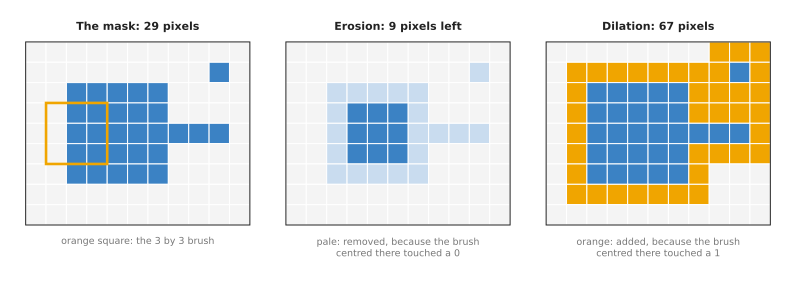
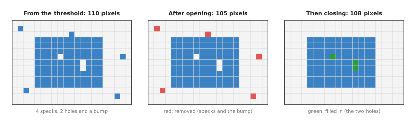
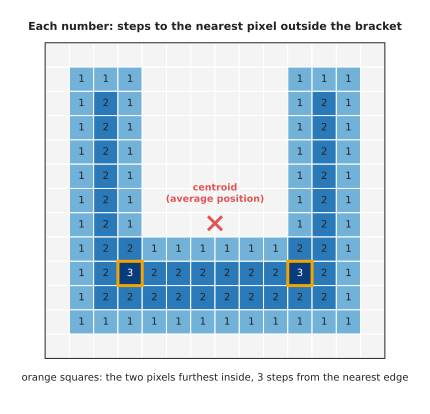
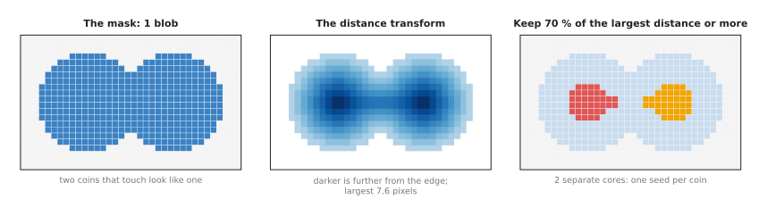

# Morphology and the distance transform

This page explains two related techniques that work on a mask. **Morphology**
shrinks and grows a mask to remove specks, fill holes and smooth edges. The
**distance transform** measures, for every pixel in a mask, how far it is from the
nearest edge. The page answers four questions. How do erosion and dilation work?
Why are they almost always used in pairs, as opening and closing? How is the
distance transform worked out? And what does a robot arm use them for, such as
finding the most central point of a part, or separating two parts that touch?

It is for a reader who knows what a mask is: a grid the size of a picture, with 1
where a pixel belongs to the object and 0 where it does not. The page before this
one, [thresholding and colour masks](01_thresholding-and-colour-masks.md), explains
how a mask is made. You do not need any algorithms background. Every example uses
a small mask you can check by hand, and every number on this page came from a real
run of the diagram script.

## Contents

1. [The idea in one sentence](#1-the-idea-in-one-sentence)
2. [How morphology works](#2-how-morphology-works)
   · [Erosion and dilation](#erosion-and-dilation)
   · [Opening and closing](#opening-and-closing)
3. [How the distance transform works](#3-how-the-distance-transform-works)
   · [Two passes over the mask](#two-passes-over-the-mask)
   · [The most central point](#the-most-central-point)
   · [Separating objects that touch](#separating-objects-that-touch)
   · [The steps as pseudocode](#the-steps-as-pseudocode)
4. [Where it is used on a robot arm](#4-where-it-is-used-on-a-robot-arm)
5. [Where it is useful, and where it is not](#5-where-it-is-useful-and-where-it-is-not)
6. [Libraries that provide it](#6-libraries-that-provide-it)
7. [Why these techniques, and what they cost](#7-why-these-techniques-and-what-they-cost)
8. [Where to read next](#8-where-to-read-next)

---

## 1. The idea in one sentence

Morphology slides a small shape over the mask and keeps or adds each pixel
depending on what the shape covers there. The distance transform writes into each
mask pixel the distance to the nearest pixel that is not in the mask.

The word "morphology" means "the study of shape". The small shape is called the
**brush** here. Many books call it the **structuring element** or the **kernel**.
It is usually a 3 by 3 square, a small disc or a small cross.

Here is an everyday example for each. Morphology is like trimming a hedge and then
letting it grow back evenly. The trimming removes the thin twigs that stick out.
The regrowth brings the hedge back to its old size, but the twigs do not come
back. The distance transform is like standing on a lawn and asking how many steps
it is to the nearest flower bed. The middle of a big lawn is many steps from any
bed. A spot next to a bed is one step.

---

## 2. How morphology works

### Erosion and dilation

There are two basic operations. Everything else in morphology is built from them.

**Erosion** shrinks a mask. Put the centre of the brush on a pixel. The pixel
stays 1 only if every pixel under the brush is 1. If the brush touches even one 0,
the pixel becomes 0. So erosion peels one layer off every edge. Anything thinner
than the brush disappears completely.

**Dilation** grows a mask. Put the centre of the brush on a pixel. The pixel
becomes 1 if any pixel under the brush is 1. So dilation adds one layer to every
edge. Gaps narrower than the brush get filled.

The picture below shows both on a real 9 by 11 mask with a 3 by 3 square brush.
The mask holds a 5 by 5 block, a thin arm one pixel wide sticking out to the right,
and a single stray pixel above the arm.



The mask has 29 pixels. The orange square in the left panel shows the brush,
centred on a pixel at the block's left edge. That brush covers three 0 pixels, so
erosion removes that pixel.

After erosion, 9 pixels are left: the 3 by 3 middle of the block. The whole outer
layer of the block is gone. The arm and the stray pixel are gone too, because
they are only one pixel wide. After dilation, the mask has 67 pixels. Every part
has grown by one pixel on every side, and the stray pixel has grown into a 3 by 3
square.

A bigger brush has a bigger effect. A 5 by 5 square peels two layers at once.
Running a 3 by 3 erosion twice has the same effect as one 5 by 5 erosion.

The brush does not have to be a square. A disc-shaped brush shrinks and grows the
mask by the same distance in every direction, so round objects stay round. A
square brush grows round objects towards a square shape. In practice, people use a
disc when shape matters, and a square when speed matters.

### Opening and closing

Erosion and dilation on their own change the size of the object. A robot that
measures a part after an erosion finds it too small. So the two are nearly always
used in pairs.

**Opening** is an erosion followed by a dilation with the same brush. The erosion
removes everything thinner than the brush, such as specks, thin arms and small
bumps. The dilation then grows what is left back to its old size. The specks do
not come back, because nothing of them survived the erosion.

**Closing** is a dilation followed by an erosion with the same brush. The dilation
fills every hole and gap narrower than the brush. The erosion then shrinks the
object back to its old size. The holes stay filled, because the erosion only peels
the outside edge.

The picture below shows both on a real 15 by 21 mask. It looks like the mask a
colour threshold gives: a 9 by 12 part with four specks around it, two small holes
where a shiny highlight broke the colour, and a one-pixel bump on the top edge.



The mask starts with 110 pixels. Opening with a 3 by 3 square removes the four
specks and the bump, which leaves 105 pixels. Closing then fills the two holes,
which gives 108 pixels. That is exactly the 9 by 12 part, 108 pixels, with no
pixel wrong.

The order matters. Opening first removes the specks. If closing ran first, it
would not remove the specks, and it could join a speck to the part if the two were
close. Book 2 uses the same order, opening then closing, in
[tidying the mask](../../../02_perception/01_camera/02_finding-objects.md#33-tidying-the-mask).

One more useful result falls out of erosion. The mask minus its own erosion is the
outer ring of edge pixels. That is the outline of the object, one pixel thick. The
[overview](../01_overview.md#1-what-this-family-is-for) uses this to draw outlines,
and the page on [edges and contours](../03_also-used/01_edges-and-contours.md) traces such outlines
into shapes.

---

## 3. How the distance transform works

The distance transform takes a mask and gives back a grid of the same size. Each
pixel outside the mask gets 0. Each pixel inside the mask gets its distance to the
nearest pixel outside the mask. Pixels on the edge get small numbers. Pixels deep
inside get large ones.

There are three common ways to measure the distance.

- The **city-block distance** counts steps up, down, left or right, as a person
  walks along the streets of a grid-shaped town.
- The **chessboard distance** also allows diagonal steps, as a king moves in chess.
- The **straight-line distance** is the ordinary distance you would measure with a
  ruler. It is also called the Euclidean distance.

The worked examples below use the city-block distance, because its numbers are
whole steps that you can count by hand. Libraries usually give the straight-line
distance. The ideas are the same.

### Two passes over the mask

A slow way to compute the transform is to take each mask pixel, measure its
distance to every outside pixel, and keep the smallest. That takes a long time on
a big picture. The classic fast way needs only two passes over the grid, and it
was published by Rosenfeld and Pfaltz in 1966.

1. Give every mask pixel a very large number, and every outside pixel 0.
2. **First pass**, from the top-left corner, row by row, to the bottom-right corner.
   For each mask pixel, look at the pixel above and the pixel to the left. Set the
   pixel to the smaller of its own number, (above + 1) and (left + 1).
3. **Second pass**, from the bottom-right corner, backwards, to the top-left corner.
   For each mask pixel, look at the pixel below and the pixel to the right. Set the
   pixel to the smaller of its own number, (below + 1) and (right + 1).

After the first pass, every pixel knows the distance to the nearest outside pixel
above it or to its left. After the second pass, it also knows about the outside
pixels below it and to its right. So after both passes, the number is the true
distance.

Here is a worked example on a 5 by 5 square of mask pixels, with 0s all round it.
After the first pass, the numbers grow towards the bottom-right, because that pass
has only looked up and to the left:

    after pass 1        after pass 2
    1 1 1 1 1           1 1 1 1 1
    1 2 2 2 2           1 2 2 2 1
    1 2 3 3 3           1 2 3 2 1
    1 2 3 4 4           1 2 2 2 1
    1 2 3 4 5           1 1 1 1 1

The second pass corrects the bottom and right sides. The final grid has 1 on the
edge, 2 one step in, and 3 in the very middle.

### The most central point

The pixel with the largest distance is the point deepest inside the object. It is
the point furthest from every edge. It is also the centre of the largest circle
that fits inside the object, and that circle's radius is the distance itself.

This matters because the obvious alternative, the **centroid**, can be badly
wrong. The centroid is the average position of all the mask pixels. For a round or
square part, it is in the middle. For a bent part, it can lie outside the part
altogether.

The picture below shows a real U-shaped bracket, seen from above. Each number is
the city-block distance to the nearest pixel outside the bracket.



The bracket has 90 pixels. Its centroid, the red cross, lands at row 6.9 and
column 6.5 of the grid. That is in the empty space between the two walls. A
suction cup sent there would touch nothing.

The largest distance is 3 steps, at two pixels where the walls meet the base. They
tie, because the bracket is the same on both sides. Either one is a safe place for
a suction cup: it is 3 pixels from every edge, so a cup up to 3 pixels in radius
fits there entirely on the part. On a real picture, a pixel is often about 1
millimetre on the table, so the robot can read the largest cup that fits straight
from the number.

### Separating objects that touch

When two objects of the same colour touch, a threshold gives one patch. Grouping
the mask then finds one object where there are two. The distance transform can
split them.

The idea is simple. Where two round objects touch, the join is narrow. Pixels at
the join are close to an edge, so their distance is small. The middle of each
object is far from every edge, so its distance is large. So keep only the pixels
whose distance is large, and the join falls away. What is left is one **core**
inside each object.

The picture below does this on a real mask of two touching coins, each 8 pixels in
radius, with their centres 14 pixels apart.



The mask has 404 pixels in one patch. The largest straight-line distance is 7.6
pixels, in the middle of each coin. The pixels at the join have a distance of only
5.0. Keeping the pixels with at least 70 % of the largest distance, which is 5.3,
drops the join. Two separate cores of 36 pixels each are left, one per coin.

The cores are not yet the full coins. They are **seeds**: one starting point per
object. A second step grows each seed back out to the edge of the mask, and draws
a line where two seeds meet. The standard method for that step is called
**watershed**. It treats the distance picture as a landscape and floods it from
each seed. Book 2 describes it in
[watershed and GrabCut](../../../02_perception/02_object-perception/03_programmed-methods.md#15-watershed-and-grabcut).

The 70 % limit is a number you choose. Too low, and the join survives, so the
coins stay as one. On this mask, 60 % still leaves one core. Too high, and a small
or oddly shaped object may lose its core entirely.

### The steps as pseudocode

Here are the operations as plain steps. The pseudocode does not belong to any
programming language. "Outside the picture" counts as 0.

```text
function erode(mask, brush):
    out = a grid the size of mask, filled with 0
    for each pixel p:
        if every pixel under brush centred at p is 1 in mask:
            out[p] = 1
    return out

function dilate(mask, brush):
    out = a grid the size of mask, filled with 0
    for each pixel p:
        if any pixel under brush centred at p is 1 in mask:
            out[p] = 1
    return out

function open(mask, brush):  return dilate(erode(mask, brush), brush)
function close(mask, brush): return erode(dilate(mask, brush), brush)

function distance_transform(mask):             # city-block distance
    d = a grid the size of mask
    for each pixel p:
        d[p] = a very large number if mask[p] is 1, else 0
    for each row from top to bottom, each column from left to right:
        if mask[p] is 1:
            d[p] = min(d[p], d[above p] + 1, d[left of p] + 1)
    for each row from bottom to top, each column from right to left:
        if mask[p] is 1:
            d[p] = min(d[p], d[below p] + 1, d[right of p] + 1)
    return d

function most_central_point(mask):
    d = distance_transform(mask)
    return the pixel with the largest d, and that largest d

function seeds_for_touching_objects(mask, fraction):
    d = distance_transform(mask)
    cores = the pixels where d >= fraction * largest d
    return connected groups of cores     # one group per object
```

The last line uses connected components, which the page on
[clustering](03_clustering.md) explains.

---

## 4. Where it is used on a robot arm

Morphology and the distance transform appear wherever an arm works from a mask.
Here are some concrete places.

- Opening and closing tidy a threshold's mask. Opening and closing with a small brush come right
  after almost every colour or depth threshold. Without them, a speck of the right
  colour on the table counts as an object, and a highlight on the part splits its
  mask.
- The distance transform chooses where to place a suction cup. The most central point of a part's mask is the spot
  furthest from every edge. The distance there, turned into millimetres, says
  whether the cup fits. If the largest distance is smaller than the cup's radius,
  the part is too narrow for that cup, and the program can say so before the arm
  moves.
- Erosion keeps a grasp away from the edges. Eroding a part's mask by the width of a
  fingertip leaves only the places where the fingertip can land fully on the part.
- Dilation grows obstacles by the size of the gripper. On a top-down map of the table,
  dilating every obstacle by the gripper's radius gives the area where the
  gripper's centre must not go. A planner can then treat the gripper as a single
  point. The [planning and search](../../06_planning-and-search/01_overview.md)
  chapter builds on this kind of map.
- The distance transform separates touching parts. Coins, pills, fruit and nuts in a tray often touch.
  The distance transform gives one seed per part, and watershed splits the mask.
- The distance transform measures thickness. Twice the largest distance is the diameter of the
  largest circle that fits inside a part. A part that must be at least 8 millimetres thick
  to grip can be checked with one number.
- Erosion cleans up a learned model's masks. The
  [glass-picking project](https://github.com/RobinNagpal/robot-arm-projects/blob/main/v5-pick-glasses/docs/problem-2/solutions/07-a-segmenter-trained-from-scratch.md)
  in the robot-arm-projects repository erodes each region from a trained
  segmentation model before counting its doubtful pixels. The erosion removes the
  thin rim of doubt that every region has along its edge, so what is left in the
  middle points to a second glass hiding behind the first.
- Erosion also draws outlines. The mask minus its erosion is the outline of each part, one
  pixel thick. It is a quick way to draw what the robot found on a screen for a
  person to check.

---

## 5. Where it is useful, and where it is not

Morphology works when the unwanted things are smaller than the objects you want.
The distance transform works best on compact objects, such as discs and blocks.
Both fail in known ways. The table below lists the common failures. Read each row
as: this goes wrong, this is what you see, and this is what people use instead.

| What goes wrong | The sign you would see | What people use instead |
| --- | --- | --- |
| The brush is bigger than a thin part of the object | A handle, a wire or a thin wall disappears; a part with a narrow waist splits in two | A smaller brush, or removing specks by size with [connected components](03_clustering.md) |
| Closing bridges the gap between two nearby objects | The object count drops by one when two parts come close | A smaller brush for closing, or splitting with the distance transform afterwards |
| Specks bigger than the brush | Small false objects survive opening | Throw away every patch smaller than a set area, using [connected components](03_clustering.md) |
| Holes bigger than the brush | A large hole stays; the most central point lands next to it | A bigger closing brush, or filling all holes inside the outer [contour](../03_also-used/01_edges-and-contours.md) |
| Long thin objects standing side by side | Their distance transform has a ridge along each object, not a peak; two touching ridges join, so there is only one seed | A different cue, such as where each object meets the table, or a [segmentation model](../../../06_neural-network-models/02_seeing-models/02_most-used/02_segmentation.md) |
| A part cut off by the edge of the picture | The most central point sits near the picture edge | Ignore parts that touch the picture edge, or move the camera |
| A mask with ragged edges from noise | The distance values near the edge jump about, and the central point moves between frames | Opening and closing before the distance transform |

The long-thin-objects row comes from a real project. The
[glass-picking project](https://github.com/RobinNagpal/robot-arm-projects/blob/main/v5-pick-glasses/docs/problem-2/solutions/01-split-the-blob-in-the-picture.md)
tried the distance transform and watershed on standing wine glasses seen from the
side. A glass is several times taller than it is wide. So the deepest part of its
mask is a line up its middle, not a single point. When two glasses overlap in the
picture, their two lines join into one, and watershed has only one seed. The
project measured this across every merged pair it could produce, and watershed
split only a handful of them. It used the row where each glass meets the table
instead.

On a point cloud, the same ideas have their own forms. **Radius outlier removal**
deletes points with too few neighbours within a set distance. It removes lone
points, as opening removes specks. Growing an obstacle in 3D is usually done by
**voxels**, which are small cubes that divide space into a 3D grid. Each cube near
an occupied cube is also marked occupied. That is dilation on a 3D grid.

---

## 6. Libraries that provide it

Morphology and the distance transform are in every image library. The table below
lists well-known ones. Read each row as the library, the languages you can call it
from, the function or class to look for, and a note on what to watch.

| Library | Languages | Function or class | Note |
| --- | --- | --- | --- |
| OpenCV | C++, Python | `cv2.erode`, `cv2.dilate` | Pass the brush and, if you want, a number of repeats |
| OpenCV | C++, Python | `cv2.morphologyEx` with `MORPH_OPEN` or `MORPH_CLOSE` | Opening and closing in one call |
| OpenCV | C++, Python | `cv2.getStructuringElement` with `MORPH_RECT`, `MORPH_ELLIPSE` or `MORPH_CROSS` | Makes a square, disc-like or cross-shaped brush |
| OpenCV | C++, Python | `cv2.distanceTransform` with `DIST_L1` or `DIST_L2` | `DIST_L1` is the city-block distance; `DIST_L2` is the straight-line distance |
| OpenCV | C++, Python | `cv2.watershed`, `cv2.connectedComponents` | For splitting touching objects from seeds |
| SciPy | Python | `scipy.ndimage.binary_erosion`, `binary_dilation`, `binary_opening`, `binary_closing` | Works on masks of true and false, in any number of dimensions |
| SciPy | Python | `scipy.ndimage.distance_transform_edt` | The exact straight-line distance |
| scikit-image | Python | `skimage.morphology` (`disk`, `binary_opening`, `remove_small_objects`), `skimage.segmentation.watershed` | `remove_small_objects` removes patches below an area |
| Open3D | C++, Python | `PointCloud.remove_radius_outlier`, `PointCloud.remove_statistical_outlier` | The point cloud form of removing specks |
| PCL (Point Cloud Library) | C++ | `pcl::RadiusOutlierRemoval`, `pcl::StatisticalOutlierRemoval` | The same, in C++ |

OpenCV treats a mask as 0 and 255, while SciPy and scikit-image use false and
true. Converting between them is one line, but forgetting it gives a mask that is
all zeros or all ones.

---

## 7. Why these techniques, and what they cost

This section answers the four questions for morphology and the distance
transform: what they are, what they do for you, why they rather than the obvious
alternative, and what they cost.

Morphology shrinks and grows a mask with a small brush. It removes specks, fills
holes and smooths edges, and it keeps the object's size when erosion and dilation
are used in pairs. The distance transform gives every mask pixel its distance to
the nearest edge. It finds the most central point of a part, tells you how big a
tool fits there, and gives seeds for splitting touching objects. Both run in about
a millisecond on a camera picture, and both give exactly the same answer every
time.

The obvious alternative to opening is to label the patches with
[connected components](03_clustering.md) and throw away the small ones. That
removes specks, and it does not change the shape of the real object at all. But it
does not fill holes, and it does not remove thin bumps attached to the object.
Many programs use both: opening and closing with a small brush, then an area
filter for anything larger that got through.

The obvious alternative to the distance transform's central point is the
centroid. The centroid is cheaper and smoother from frame to frame. It is right
for round, square and other convex parts, which have no dents or gaps. It is wrong
for U shapes, L shapes, rings and anything else with a gap or a hole, where it can
fall off the part. The distance transform costs a little more, and it never
chooses a point outside the mask.

The obvious alternative for splitting touching objects is a learned
[segmentation model](../../../06_neural-network-models/02_seeing-models/02_most-used/02_segmentation.md)
that gives one mask per object from the start. The model handles long, thin and
oddly shaped objects that defeat the distance transform. But it needs training
pictures and a bigger computer.

The costs are these. You must choose the brush size, and that one number trades
two errors against each other. A bigger brush removes more noise, but it also
removes thin parts and joins close objects. Book 2 counts these two errors
separately in
[merge and split are two failures](../../../02_perception/02_object-perception/07_making-it-work.md#15-merge-and-split-are-two-failures-and-only-one-of-them-announces-itself).
And the distance transform only knows about the mask. If the mask is wrong, its
central point is confidently wrong too.

---

## 8. Where to read next

- The next page is [edges and contours](../03_also-used/01_edges-and-contours.md). It traces the
  outline of a tidy mask and fits shapes to it.
- [Clustering](03_clustering.md) turns a mask into separate objects, and does the
  same for a point cloud.
- The page before this one, [thresholding and colour masks](01_thresholding-and-colour-masks.md),
  makes the masks that this page tidies.
- [Nearest-neighbour search](../../03_searching-and-matching/02_most-used/01_nearest-neighbour-search.md)
  is how radius outlier removal finds each point's neighbours.
- [Segmentation](../../../06_neural-network-models/02_seeing-models/02_most-used/02_segmentation.md)
  and [suction and affordance](../../../06_neural-network-models/04_grasp-models/02_most-used/02_suction-and-affordance.md)
  in Book 6 are the learned models that make masks and choose suction points.
- The [glass-picking project's notes on splitting a blob](https://github.com/RobinNagpal/robot-arm-projects/blob/main/v5-pick-glasses/docs/problem-2/solutions/01-split-the-blob-in-the-picture.md)
  show in detail why the distance transform fails on tall thin objects.
