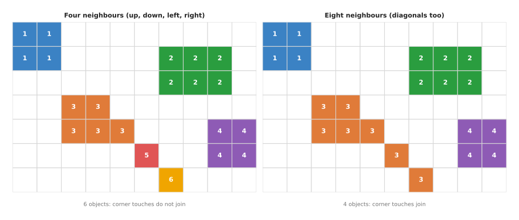
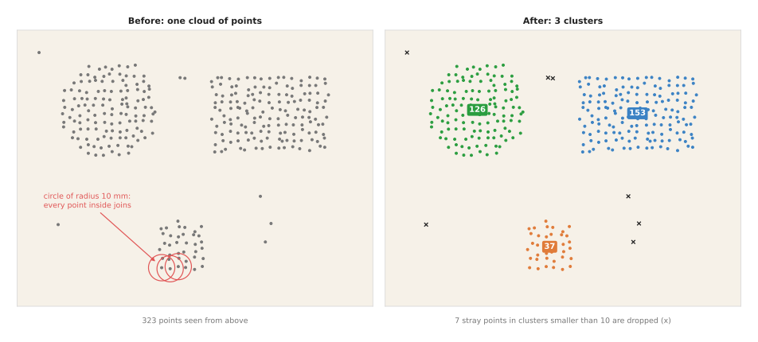
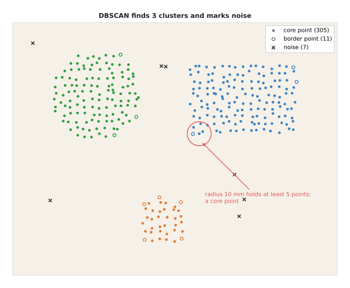
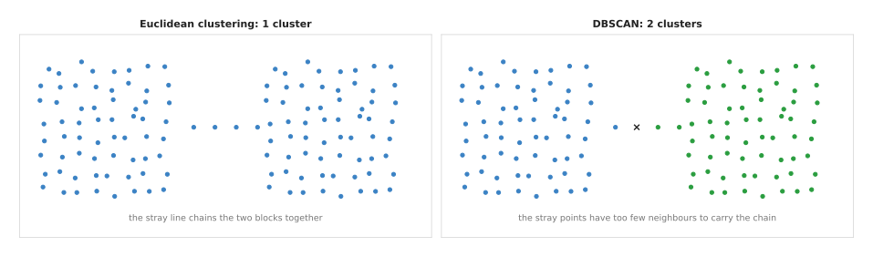
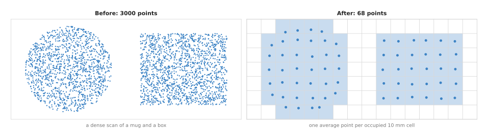
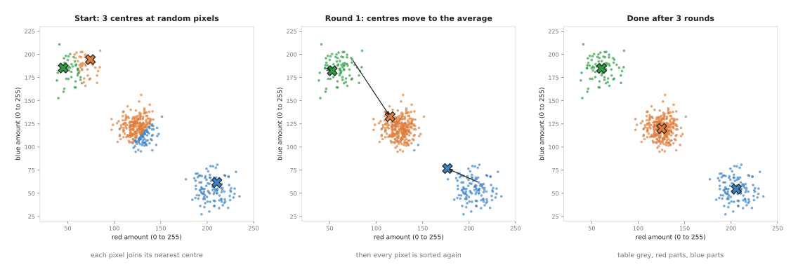
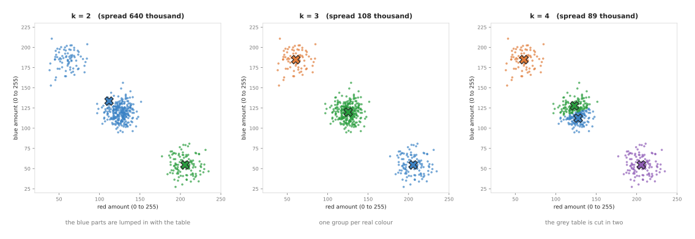
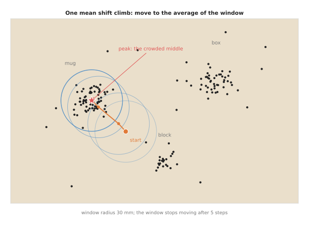
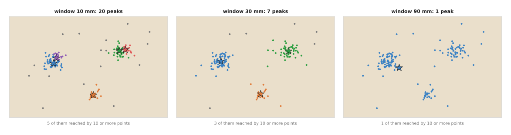

# Clustering

This page explains how a program splits a mask or a point cloud into separate
objects. It answers four questions. How does a program number the separate
blobs in a mask? How does it group 3D points into objects by how close they are?
How does DBSCAN do the same while also marking stray points as noise? And why is
a point cloud usually thinned out onto a grid of small cubes before any of this
runs? A later section adds two methods that look for the centre of each crowd of
points instead: k-means, which must be told how many groups there are, and mean
shift, which is not.

It is for a reader who knows what a mask and a point cloud are. A **mask** is a
picture in which each pixel is either "object" or "not object"; the page on
[thresholding and colour masks](01_thresholding-and-colour-masks.md) makes one.
A **point cloud** is a list of 3D points, one for each depth pixel, that a depth
camera measures on the surfaces in front of it.

Clustering is the step that turns "these pixels, or these points, are not table"
into "this is object 1, this is object 2 and this is object 3". Almost every
programmed perception pipeline on a robot arm needs it, because the arm picks
one object at a time.

## Contents

1. [The idea in one sentence](#1-the-idea-in-one-sentence)
2. [How it works](#2-how-it-works)
   · [Connected components: blobs in a mask](#connected-components-blobs-in-a-mask)
   · [Euclidean clustering: groups of nearby points](#euclidean-clustering-groups-of-nearby-points)
   · [DBSCAN: nearby points, with a noise rule](#dbscan-nearby-points-with-a-noise-rule)
   · [Voxel downsampling: preparing the cloud](#voxel-downsampling-preparing-the-cloud)
   · [Choosing the distance](#choosing-the-distance)
3. [Finding the peaks: k-means and mean shift](#3-finding-the-peaks-k-means-and-mean-shift)
   · [K-means: k centres, moved to the average](#k-means-k-centres-moved-to-the-average)
   · [Mean shift: every point climbs to its crowd](#mean-shift-every-point-climbs-to-its-crowd)
   · [Where each fits on a robot arm](#where-each-fits-on-a-robot-arm)
   · [Where they fail](#where-they-fail)
   · [Libraries](#libraries)
4. [Where it is used on a robot arm](#4-where-it-is-used-on-a-robot-arm)
5. [Where it works, and where it does not](#5-where-it-works-and-where-it-does-not)
6. [Libraries that provide it](#6-libraries-that-provide-it)
7. [Why clustering, and what it costs](#7-why-clustering-and-what-it-costs)
8. [The learned alternative](#8-the-learned-alternative)
9. [Where to read next](#9-where-to-read-next)

---

## 1. The idea in one sentence

**Clustering** puts two pixels or two points in the same group whenever they are
close enough to each other, and keeps doing so until every group stops growing.

Here is an everyday example. Scatter some rice, some lentils and a few coins on
a dark table and look at it from above. You see three heaps and a few loose
grains. You do not need to know what rice is to see the heaps. You see them
because the grains in one heap touch each other, and there is bare table between
heaps. Clustering uses the same rule. It does not know what the objects are. It
only knows which points are near which.

This is why clustering works on objects the robot has never seen. It is also
why it fails when two objects touch: then there is no bare table between them.

---

## 2. How it works

This section covers three grouping methods and one preparation step. Connected
components works on a mask, which is a grid of pixels. Euclidean clustering and
DBSCAN work on a point cloud, where the points have no grid. Voxel downsampling
thins a point cloud before it is clustered.

A point cloud of a table scene normally goes through two steps before clustering.
First, points too far away are cut off. Second, the table itself is found and
removed, usually with [RANSAC](../../04_fitting-and-estimation/02_most-used/02_ransac.md). What is
left is a set of points that are not table. Those are the points that clustering
splits into objects.

### Connected components: blobs in a mask

**Connected components** gives every separate blob in a mask its own number. Two
object pixels belong to the same blob if you can walk from one to the other by
stepping only on object pixels.

The only choice is what counts as a step. With **four-connectivity**, you may
step up, down, left or right. With **eight-connectivity**, you may also step
diagonally. The difference matters when two blobs touch only at a corner.

The method is a **flood fill**, the same as the paint-bucket tool in a drawing
program.

```
function connected_components(mask, neighbours):   # neighbours: 4 or 8 steps
    label = a grid of zeros, the same size as mask
    next_label = 0
    for each pixel p in mask, row by row:
        if mask[p] is object and label[p] is 0:
            next_label = next_label + 1
            label[p] = next_label
            queue = [p]
            while queue is not empty:
                q = take one from queue
                for each step s in neighbours:
                    n = q + s
                    if n is inside the grid and mask[n] is object and label[n] is 0:
                        label[n] = next_label
                        add n to queue
    return label, next_label
```

Here is a worked example. The picture below shows a mask 10 pixels wide and 7
high, labelled both ways.



Each coloured square is an object pixel, and the number on it is the label the
flood fill gave it.

With four-connectivity the program finds 6 blobs. Blob 3, blob 5 and blob 6 form
a diagonal line of pixels. They touch only at corners, so four-connectivity keeps
them apart. With eight-connectivity the diagonal steps are allowed, so these
three join into one blob and the program finds 4. Neither answer is wrong. You
choose eight-connectivity when a thin diagonal part, such as a wire, should stay
in one piece. You choose four-connectivity when objects that touch only at a
corner should stay apart. OpenCV and scikit-image use eight-connectivity by default, and SciPy uses
four-connectivity by default, so check which one your library uses.

Once each blob has a number, the program can measure each one: its area in
pixels, its bounding box and its centroid. It then throws away blobs that are
too small to be an object. This size filter removes specks of noise left over
from the threshold.

The flood fill visits each pixel a fixed number of times, so its time grows in
step with the number of pixels. On a camera picture it takes about a
millisecond.

### Euclidean clustering: groups of nearby points

A point cloud has no grid, so "neighbour" cannot mean "the next pixel". Instead,
two points are neighbours if the straight-line distance between them is below a
chosen value. This value is called the **cluster tolerance**. "Euclidean" just
means this ordinary straight-line distance.

**Euclidean cluster extraction** is then the same flood fill as above, with that
new meaning of "neighbour".

```
function euclidean_clusters(points, tolerance, min_size):
    label = -1 for every point            # -1 means "not yet in a group"
    groups = []
    for each point p:
        if label[p] is not -1: skip it
        start a new group g containing p; label[p] = g
        queue = [p]
        while queue is not empty:
            q = take one from queue
            for each point n within tolerance of q:    # a radius search
                if label[n] is -1:
                    label[n] = g
                    add n to queue
        add g to groups
    throw away every group with fewer than min_size points
    return groups
```

The line "each point within tolerance of q" is a **radius search**. Written
simply, it compares `q` with every other point, which is slow for a large
cloud. Real libraries build a k-d tree first, so that each search only looks at
nearby points. The page on
[nearest-neighbour search](../../03_searching-and-matching/02_most-used/01_nearest-neighbour-search.md)
explains how.

Here is a worked example. The points below are what is left on a table after the
table plane was removed, seen from above. There is a round cup, a box, a small
block and 7 scattered stray points, 323 points in all. The points on each object
are about 6 mm apart, with a little random noise, and the objects are at least
43 mm apart.



The left panel shows the points before clustering, with the 10 mm circle round
three points of the block. The right panel shows the result, with the size of
each cluster written on it.

With a tolerance of 10 mm, the flood fill first finds 9 groups: the box with 153
points, the cup with 126, the block with 37, one pair of stray points and five
single stray points. A minimum size of 10 points then throws away the 6 small
groups. The result is 3 clusters, which is right. These numbers come from
running the code behind the picture on these points.

### DBSCAN: nearby points, with a noise rule

Euclidean clustering has one known weakness. It **chains**: if A is near B and B
is near C, then A, B and C are one group, even if A and C are far apart. So a
thin line of stray points between two objects joins them into one cluster. Such
lines are common. Depth cameras make stray points along the edges of objects,
and a cable or a speck of dust can lie between two parts.

**DBSCAN**, short for "density-based spatial clustering of applications with
noise", fixes this with one extra rule. It sorts every point into one of three
kinds, using a radius `eps` (the same idea as the tolerance) and a count
`min_pts`.

- A **core point** has at least `min_pts` points, counting itself, within `eps`.
  It sits in a crowded area, such as the middle of an object's surface.
- A **border point** is not a core point, but it lies within `eps` of a core
  point. It sits on the edge of a crowded area.
- A **noise point** is neither. It sits alone.

Clusters then grow like Euclidean clusters, with one change: a cluster only
keeps growing from core points. A border point joins the cluster, but the
search does not continue from it. Noise points join nothing.

```
function dbscan(points, eps, min_pts):
    for each point p:
        near[p] = all points within eps of p           # includes p itself
        core[p] = (size of near[p] >= min_pts)
    label = -1 for every point                         # -1 means noise
    next = 0
    for each point p:
        if not core[p] or label[p] is not -1: skip it
        label[p] = next
        queue = [p]
        while queue is not empty:
            q = take one from queue
            for each n in near[q]:
                if label[n] is -1:
                    label[n] = next
                    if core[n]: add n to queue         # only core points spread
        next = next + 1
    return label
```

The picture below runs DBSCAN on the same 323 table points, with `eps` of 10 mm
and `min_pts` of 5.



Filled dots are core points, open circles are border points, and crosses are
noise; the red circle shows the 10 mm radius round one core point.

DBSCAN finds the same 3 clusters: 153, 126 and 37 points. Of the 323 points, 305
are core points, 11 are border points and 7 are noise. The border points sit on
the corners and outer edges of the objects, where a point has fewer neighbours. The 7 noise
points are exactly the stray points that Euclidean clustering removed with its
size filter. Here the two methods agree.

They disagree when stray points form a bridge. The picture below shows two
blocks 30 mm apart, with a line of 4 stray points between them.



The same 132 points and the same 10 mm distance give one cluster on the left and
two on the right.

The stray points are about 7 mm apart, so each is within 10 mm of the next.
Euclidean clustering walks along the line from one block to the other and
reports one cluster of 132 points. DBSCAN counts neighbours first. Three of the
four stray points have only 3 points within 10 mm, counting themselves, which is
below `min_pts` of 5. So they are not core points, and the search cannot pass
through them. DBSCAN reports two clusters of 65 and 66 points and marks 1 point
as noise.

DBSCAN's `min_pts` does two jobs at once, and Book 2 warns about mixing them. It
is a noise filter, which decides whether a point sits in a crowded area. It is
not a size filter for whole objects. A program still throws away clusters that
are too small as a separate step. Book 2's
[choosing the grouping distance](../../../02_perception/02_object-perception/03_programmed-methods.md#19-choosing-the-grouping-distance-and-clustering-on-the-plane)
works through both numbers for a real camera.

### Voxel downsampling: preparing the cloud

A depth camera with 640 by 480 pixels gives up to 307,200 points per picture.
Clustering them all is slow, and it is not needed: two points 1 mm apart on the
same surface tell the program nothing new. So the cloud is thinned first.

**Voxel downsampling** divides space into small cubes of equal size. Each cube is
called a **voxel**, short for "volume pixel". Every cube that holds at least one
point is replaced by one point: the average of the points inside it.

```
function voxel_downsample(points, size):
    for each point p:
        cell = (floor(p.x / size), floor(p.y / size), floor(p.z / size))
        add p to the list for that cell
    return, for each cell with points, the average of its points
```

The picture below does this in 2D, seen from above, for a dense scan of a mug and
a box.



The left panel has 3,000 points. The right panel has one average point for each
occupied 10 mm cell, which is 68 points.

The table below shows how the cell size sets the number of points left from the
same 3,000. Read each row as "with cubes of this size, this many points remain".

| cell size | points left | share of the original |
|---|---|---|
| 5 mm | 245 | 8.2% |
| 10 mm | 68 | 2.3% |
| 20 mm | 26 | 0.9% |

Downsampling does three useful things for clustering. It makes clustering much
faster, because there are far fewer points to search. It makes the point
spacing even, so one tolerance works everywhere: near the camera the points are
crowded, far away they are sparse, and the grid removes that difference. And it
averages away some of the depth noise.

It also sets a limit. After downsampling, the points on one surface are about
one cell apart, and up to one cell diagonal apart. A cube of side 10 mm has a
diagonal of 10 × √3 = 17.3 mm. So the cluster tolerance must be larger than
that, or one object will break into several clusters. The page
[singulation and pre-grasp manipulation](../../../03_frameworks/02_gripping/10_singulation-and-pre-grasp.md#21-every-cheap-perception-method-merges-touching-objects)
works through this link between the cell size and the tolerance, using the
settings from the Point Cloud Library's own tutorial.

### Choosing the distance

The tolerance, or `eps`, is the one setting that decides the result. It must lie
between two limits.

- It must be **larger than the gaps between points on one object**. If it is
  smaller, one object breaks into many small clusters.
- It must be **smaller than the gap between two objects**. If it is larger, two
  objects join into one cluster.

The table below shows this on the 323 table points, with Euclidean clustering and
a minimum size of 10. Read each row as "with this tolerance, the program keeps
these clusters and drops this many points".

| tolerance | clusters kept (points in each) | points dropped |
|---|---|---|
| 5 mm | none | 323 |
| 6 mm | 11 pieces, from 47 down to 10 points | 114 |
| 8 mm | 3 (153, 126, 37) | 7 |
| 20 mm | 3 (153, 126, 37) | 7 |
| 30 mm | 2 (281, 37) | 5 |
| 50 mm | 1 (322) | 1 |

At 5 mm and 6 mm the tolerance is below the point spacing, and the objects
shatter. From 8 mm to 20 mm the answer is right and does not change. At 30 mm
the cup and the box join, together with two stray points. At 50 mm everything
joins. The wide range from 8 mm to 20 mm with the same answer is what you look
for when you tune: pick a value in the middle of it. The robot-arm-projects
repository explains the same two limits for glasses on a table, in plain words,
in
[cluster on the table](https://github.com/RobinNagpal/robot-arm-projects/blob/main/v5-pick-glasses/docs/problem-2/solutions/02-cluster-on-the-table.md).

One more trick helps a great deal. Objects on a table stand on the same plane.
If the program first flattens the points onto the table plane, and clusters in
2D, then the height of the objects no longer matters. A tall object and a short
one next to it are then compared only by the gap between them on the table.

## 3. Finding the peaks: k-means and mean shift

Every grouping method in section 2 uses one rule: two points are in the same
group if a chain of close neighbours joins them. This section covers two methods
with a different rule. They look for **centres**: places where points crowd
together. Each point then belongs to the centre it is nearest to, or the centre
it climbs to.

The two methods differ in one important way. **K-means** must be told how many
groups to find. **Mean shift** finds the number for itself. Section 7 says that
k-means is the wrong tool for counting objects, because on a robot the number of
objects is usually the thing you want to find out. That is still true. But there
are jobs on a robot arm where the number of groups is known in advance, and there
k-means is the simplest tool. And there are jobs where you want the crowded
middle of each group, not the whole group. Mean shift is made for those.

Here is an everyday example. A school has three buses, and each child must walk
to one bus stop. K-means is the planner who is told "place three stops". The
planner puts the stops where they make the total walking shortest. Mean shift is
what happens with no planner. Each child walks towards where most other children
are standing, again and again, until the children stand in a few tight crowds.
The number of crowds is whatever it turns out to be.

### K-means: k centres, moved to the average

K-means has one setting: `k`, the number of groups. It works in rounds.

1. Choose `k` starting centres. The simplest way is to pick `k` of the points at
   random.
2. Put every point in the group of its nearest centre.
3. Move each centre to the average of the points in its group.
4. Repeat steps 2 and 3 until the centres stop moving.

```
function kmeans(points, k):
    centres = k points picked at random
    repeat:
        for each point p:
            group[p] = the index of the centre nearest to p
        new_centres = for each group, the average of its points
        if new_centres == centres: stop
        centres = new_centres
    return group, centres
```

Here is a worked example on a job where `k` is known. A camera looks at red and
blue parts on a grey table. The program must find the three colours in the
picture, so that it can build a colour mask for each kind of part. Each pixel's
colour has a red amount and a blue amount, each from 0 to 255. So each pixel can
be drawn as one point, with its red amount across and its blue amount up. The
picture has 500 pixels: 300 of table, 120 of red parts and 80 of blue parts.



In each panel, the crosses are the centres and each dot is coloured by the
centre it is nearest to.

The random start is poor. It picks one red pixel and two blue pixels, and no
table pixel. After the first round, the orange centre has moved from
(74.3, 194.4) to (115.0, 132.8), because most of its group was table pixels. The
blue centre has moved from (210.4, 61.7) to (176.7, 76.8), pulled towards the
table. After 3 rounds the centres are at (205.7, 54.6), (60.6, 184.9) and
(125.4, 119.9). A fourth round changes nothing, so the method stops. The groups
hold exactly 120, 80 and 300 pixels, one group per real colour.

A start can be so poor that k-means stops at a wrong answer. Out of 10 different
random starts on these pixels, 8 give the answer above. The other 2 end with two
centres inside one colour and one centre between the other two colours. The fix
is simple. Run k-means several times from different starts, and keep the answer
with the smallest **spread**, which is the sum, over all pixels, of the squared
distance to their centre. Libraries do this for you. They also choose the starts
more carefully, with a method called **k-means++** that picks starting centres
far apart from each other.

The picture below shows what happens when `k` is wrong. Each panel keeps the best
of 10 starts.



With `k` = 2, the blue parts are lumped in with the table, and the spread is
640,122. With `k` = 3, the spread drops to 108,302. With `k` = 4, the grey table
is cut into two halves of 153 and 147 pixels, and the spread drops again, to
89,061. So a smaller spread does not mean a better answer. The spread always
falls as `k` grows, until every pixel is its own group. The usual sign of the
right `k` is where the spread stops falling steeply: here from 640,122 to
108,302 is a big drop, and from 108,302 to 89,061 is a small one.

### Mean shift: every point climbs to its crowd

Mean shift has one setting too, but it is a distance, not a count. It is called
the **bandwidth** or the **window**. The method treats the points like a hilly
landscape, where the ground is highest where the points are most crowded. From
each point it climbs uphill until it reaches a top, called a **peak**.

1. Put a round window of the chosen radius on a starting point.
2. Move the window's centre to the average of all points inside the window.
3. Repeat step 2 until the window stops moving. Where it stops is a peak.
4. Do this from every point. Peaks that end up very close together are one peak.
5. Each point belongs to the peak it climbed to.

The average of the points in the window always lies a little further into the
crowd than the window's centre, because more points sit on the crowded side. So
each step moves uphill.

```
function mean_shift(points, window):
    peaks = []
    for each point p:
        c = p
        repeat:
            near = all points within window of c
            new_c = the average of near
            if distance(new_c, c) is tiny: stop
            c = new_c
        if c is within window / 2 of a peak already in peaks:
            label[p] = that peak
        else:
            add c to peaks; label[p] = the new peak
    return peaks, label
```

Here is a worked example. A grasp model looked at a table with a mug, a box and a
small block. It proposed 150 grasp centres, seen from above and measured in
millimetres: 70 round the mug, 45 round the box, 20 round the block and 15
scattered at random. The arm wants one grasp per object, at the middle of each
crowd of proposals.



The picture follows one climb, with a window of radius 30 mm. It starts at
(112, 60), between the mug and the block. The average of the points in the first
window is (105.0, 67.6), a small step towards the mug. The next window holds more
mug points, so the next step is bigger, to (85.4, 83.9). Then comes (79.0, 90.1),
and then (78.8, 90.3), where the window stops moving. The mug's proposals were
spread round the point (80, 90), so the peak is within 2 mm of it.

Run from all 150 points with the same 30 mm window, mean shift finds 7 peaks. The
3 largest are reached from 72, 49 and 23 points. They are at (78.8, 90.3) for the
mug, (198.5, 108.3) for the box and (149.1, 32.0) for the block. The other 4
peaks are reached from only 1 or 2 points each. They are stray proposals with no
crowd round them, and a size limit throws them away, just as in section 2.

The window is the one number that matters. The picture below runs the same
points with three windows.



Coloured dots belong to peaks reached from 10 or more points, and grey dots
belong to the small peaks.

The table below gives the full result for six windows. Read each row as "with
this window, mean shift finds this many peaks, and this many of them are reached
from at least 10 points".

| window | peaks found | peaks reached from 10 or more points |
|---|---|---|
| 10 mm | 20 | 5 (the mug and the box each split in two) |
| 20 mm | 12 | 3 |
| 30 mm | 7 | 3 |
| 45 mm | 4 | 3 |
| 60 mm | 3 | 3 |
| 90 mm | 1 | 1 (at (98.8, 78.5), between the objects) |

A window from 20 mm to 60 mm gives the three right crowds. That wide, steady
range is what you look for, as with the tolerance in section 2. A window that is
too small splits one crowd into several. A window that is too large joins
everything into one peak, which may lie on bare table between the objects.

### Where each fits on a robot arm

K-means fits where the number of groups is fixed by the job.

- **Finding the colours of a known set of parts.** As in the example, k-means
  finds the `k` main colours in a picture. Their centres give the colour ranges
  for the masks on the
  [thresholding page](01_thresholding-and-colour-masks.md), and they adapt when
  the light changes.
- **Choosing `k` spread-out options.** A planner may want 5 different approach
  directions, or 4 camera viewpoints, out of hundreds of candidates. K-means on
  the candidates gives `k` groups, and the program takes the best candidate from
  each.
- **Splitting a pile you have already counted.** If a weighing scale or a
  barcode says the tray holds exactly 3 parts, k-means with `k` = 3 splits the
  tray's points into 3 groups, even where connected components sees one blob.

Mean shift fits where you want the crowded middle, and the count is unknown.

- **Merging many proposals into a few.** A grasp model, an object detector run on
  several frames, or several camera views each give many nearby guesses for the
  same object. Mean shift turns each crowd of guesses into one answer at its
  middle, as in the example.
- **Finding vote peaks.** Some pose models let every pixel of an object vote for
  where the object's centre is. Mean shift finds the peak of those votes. It is
  the same job as finding the peak in the
  [Hough transform's](../03_also-used/01_edges-and-contours.md#3-finding-lines-and-circles-by-voting-the-hough-transform)
  vote table, without a table of cells.
- **Following a coloured object in a video.** OpenCV's `meanShift` and `CamShift`
  climb a picture that holds, for each pixel, how well its colour matches the
  object. Started at the object's last position, the window climbs to its new
  position in each frame.

### Where they fail

K-means fails in these ways. With the wrong `k`, objects merge or split, as in
the picture above. From a poor start it can stop at a wrong answer; you would
see a different answer on each run. Use k-means++ starts and several runs. It
expects groups that are round and of similar size. A long thin object, such as a
pen, gets split, and a big group steals points from a small one next to it. And a
few far-away points pull a centre away from its crowd, because every point counts
in the average. For objects on a table, the methods of section 2 are usually the
better choice.

Mean shift fails in these ways. With a poor window, peaks split or merge, as the
table shows. It is slow on large clouds: each step of each climb searches all
the points, so it is run on a few hundred proposals, not on 300,000 camera
points. Downsample first, or start climbs only from a grid of seed points. And a
peak can lie between two objects when the window is large, as in the 90 mm
panel. Always check a peak against the points near it before sending the arm
there.

### Libraries

OpenCV provides `cv::kmeans`, with `cv::KMEANS_PP_CENTERS` for k-means++ starts
and an `attempts` setting for several runs, and `cv::meanShift` and
`cv::CamShift` for following an object in a video. scikit-learn provides
`sklearn.cluster.KMeans`, which uses k-means++ and several runs by default,
`sklearn.cluster.MiniBatchKMeans` for very many points, and
`sklearn.cluster.MeanShift`, with `sklearn.cluster.estimate_bandwidth` to suggest
a window from the data. SciPy provides `scipy.cluster.vq.kmeans2`.

---

## 4. Where it is used on a robot arm

Clustering is used wherever a program has "not background" and needs "separate
objects". Here are concrete places.

- **The table-top pick pipeline.** Take the depth picture as a point cloud,
  downsample it, remove the table plane with RANSAC, cluster the rest, and pick
  the cluster nearest the gripper. This is the most common programmed
  perception recipe for arms. Book 2 describes it in
  [point clouds: remove the plane, then cluster](../../../02_perception/02_object-perception/03_programmed-methods.md#16-point-clouds-remove-the-plane-then-cluster),
  and the
  [tools and libraries](../../../03_frameworks/01_tools-and-libraries.md#9-perception-camera-drivers-opencv-and-open3d)
  page shows it as real Open3D code.
- **Counting objects.** The number of clusters is the number of objects. A tray
  check can compare it with the number of parts that should be there.
- **Splitting a colour mask into objects.** After an HSV threshold finds "red
  pixels", connected components splits them into one blob per red block, and
  the program measures each blob's centre.
- **Checking whether objects touch.** If two objects the robot knows are there
  come back as one cluster, they are closer than the tolerance. The arm can then
  push them apart before it grasps, as the
  [singulation](../../../03_frameworks/02_gripping/10_singulation-and-pre-grasp.md)
  page describes.
- **Removing noise before other steps.** DBSCAN's noise points, or clusters
  below the minimum size, are thrown away before fitting shapes or computing
  grasps. This stops a stray point from moving an object's centre.
- **Building a map of obstacles.** A motion planner often keeps the scene as a
  grid of occupied voxels. Voxel downsampling is the same operation, and the
  voxels it produces can be passed straight to the collision checker used by
  the [sampling-based planners](../../06_planning-and-search/02_most-used/01_sampling-based-planning.md).
  The page on [volumetric maps](../03_also-used/02_volumetric-maps.md) explains
  how such a map is built from many depth pictures.
- **Grouping detections over time.** When several camera views each see an
  object, their 3D centres form small groups in space. Clustering those centres
  gives one position per object, ready for
  [assignment and matching](../../03_searching-and-matching/02_most-used/03_assignment-and-matching.md).

---

## 5. Where it works, and where it does not

Clustering works best when objects stand apart on a known surface, the depth
measurements are good, and the objects are about the same size. It fails in a
few common ways.

The table below lists them. Read each row as: this is what goes wrong, this is
what you would see, and this is what people use instead.

| what goes wrong | the sign you would see | what people use instead |
|---|---|---|
| Objects touch or stand closer than the tolerance | One cluster is twice the expected size, or has a strange shape | Push them apart first; the distance transform and watershed on the [morphology page](02_morphology-and-distance-transform.md); a learned [segmentation model](../../../06_neural-network-models/02_seeing-models/02_most-used/02_segmentation.md) |
| The tolerance is smaller than the point spacing | One object comes back as many small clusters | Raise the tolerance above the voxel diagonal, or use a finer voxel size |
| Stray points bridge two objects | Two objects join under Euclidean clustering | DBSCAN with a `min_pts` that stray points cannot reach; a statistical outlier filter before clustering |
| Point density varies a lot, for example near and far objects | Far objects break up, or near objects join | Voxel downsampling first; HDBSCAN, a version of DBSCAN that adapts to density |
| The table plane was not fully removed | Every object joins the table's leftover edge into one large cluster | Remove points a few millimetres above the plane as well; crop to the work area |
| Glass or shiny objects | The object has few or no depth points, so it is missing or broken into pieces | Look for the hole in the depth picture instead, as Book 2 describes in [the depth hole](../../../02_perception/02_object-perception/03_programmed-methods.md#17-the-depth-hole-for-glass-and-chrome); a colour picture with a trained model |
| One object has two parts with a gap, such as a mug and its handle | The handle becomes its own small cluster | Merge clusters whose bounding boxes overlap; use a larger tolerance if objects stand far apart |

---

## 6. Libraries that provide it

Every method on this page is available in well-known libraries. Read the table
below as: this library, used from these languages, provides this method under
this name.

| library | languages | function or class | note |
|---|---|---|---|
| OpenCV | C++, Python, Java | `cv::connectedComponents`, `cv::connectedComponentsWithStats` | Labels a mask. The second version also returns each blob's area, bounding box and centroid. |
| SciPy | Python | `scipy.ndimage.label` | Connected components on a NumPy array of any number of dimensions, so it also works on a voxel grid. |
| scikit-image | Python | `skimage.measure.label`, `skimage.measure.regionprops` | Labelling, then measuring each blob. |
| Open3D | Python, C++ | `PointCloud.cluster_dbscan` (C++: `ClusterDBSCAN`) | DBSCAN on a point cloud. Returns a label for each point, with -1 for noise. |
| Open3D | Python, C++ | `PointCloud.voxel_down_sample` (C++: `VoxelDownSample`) | Voxel downsampling with one average point per voxel. |
| PCL | C++ | `pcl::EuclideanClusterExtraction` | Euclidean clustering with a tolerance, a minimum size and a maximum size. Uses a k-d tree for the radius search. |
| PCL | C++ | `pcl::VoxelGrid` | Voxel downsampling. |
| PCL | C++ | `pcl::ConditionalEuclideanClustering`, `pcl::RegionGrowing` | Clustering with an extra rule, such as similar colour or similar surface direction, so touching objects can sometimes be split. |
| scikit-learn | Python | `sklearn.cluster.DBSCAN`, `sklearn.cluster.HDBSCAN` | DBSCAN and its density-adapting version, on any array of points. |
| scikit-learn | Python | `sklearn.cluster.KMeans`, `sklearn.cluster.MeanShift` | K-means and mean shift from [section 3](#3-finding-the-peaks-k-means-and-mean-shift). |
| OpenCV | C++, Python, Java | `cv::kmeans`, `cv::meanShift`, `cv::CamShift` | K-means, and mean shift for following an object in a video. |

---

## 7. Why clustering, and what it costs

This section answers the four questions for this technique: what it is, what it
does for you, why it rather than the obvious alternative, and what it costs.

Clustering is a set of flood-fill rules that group pixels or points by how close
they are. Connected components does it on a grid of pixels. Euclidean clustering
does it on 3D points with a distance. DBSCAN adds a rule that keeps stray points
out. Voxel downsampling prepares the points so the other steps run fast.

What it does for you is split "not background" into separate objects without
knowing what the objects are. It works on a part the robot has never seen, on
the first day, with no training data. It has one main setting, the distance, and
that setting can be worked out from the camera's point spacing and the smallest
gap between objects.

There are two obvious alternatives. The first is **k-means**, the clustering
method most people meet first. K-means must be told how many groups to find. On
a robot, the number of objects is usually the thing you want to find out, so
k-means is the wrong tool for that job. Euclidean clustering and DBSCAN find the
number for themselves. K-means is still useful when the number of groups is
fixed by the job, such as the colours of a known set of parts;
[section 3](#3-finding-the-peaks-k-means-and-mean-shift) shows where. The second alternative is a trained segmentation model or point cloud model;
[section 8](#8-the-learned-alternative) says when each is the better choice.

The costs are these. Clustering merges objects that touch, and nothing in the
method can fix that. You must choose the tolerance, the minimum size and the
voxel size, and they depend on each other and on the camera's distance from the
table. It needs good depth, so glass and shiny metal are hard. And a radius
search on a large cloud is slow unless you downsample first and use a k-d tree.

---

## 8. The learned alternative

Two kinds of model in Book 6 do this job. A
[segmentation model](../../../06_neural-network-models/02_seeing-models/02_most-used/02_segmentation.md)
gives one mask per object in the colour picture, and the depth points inside each
mask become that object's points. A
[point cloud model](../../../06_neural-network-models/03_3d-models/02_most-used/01_point-cloud-models.md)
names every 3D point directly. Either one can split objects that touch, which
clustering cannot do, and it can also say what each object is. But a model needs
labelled training data and a computer that can run it, and it only knows the kinds
of object it was trained on. Choose clustering when objects stand apart, or when
the robot can push them apart; choose a model when touching objects are the normal
case.

---

## 9. Where to read next

- The previous page is [edges and contours](../03_also-used/01_edges-and-contours.md). It traces
  the outline of each blob that connected components finds.
- [Morphology and the distance transform](02_morphology-and-distance-transform.md)
  tidies a mask before labelling it, and can split two touching blobs that
  clustering would merge.
- [Nearest-neighbour search](../../03_searching-and-matching/02_most-used/01_nearest-neighbour-search.md)
  explains the k-d tree and the radius search that make clustering fast.
- [RANSAC](../../04_fitting-and-estimation/02_most-used/02_ransac.md) removes the table plane
  before clustering.
- The chapter [overview](../01_overview.md) compares all the techniques in this
  chapter.
- Book 2's
  [methods you write yourself](../../../02_perception/02_object-perception/03_programmed-methods.md#19-choosing-the-grouping-distance-and-clustering-on-the-plane)
  goes deeper into choosing the grouping distance for a real camera, and
  [singulation and pre-grasp manipulation](../../../03_frameworks/02_gripping/10_singulation-and-pre-grasp.md)
  covers what the arm does when objects touch.
- The diagrams in section 2 are drawn by `docs/diagrams/image_processing_2.py`.
  Every number in that section comes from the functions in that script; run it with
  `--numbers` to print them.
  The k-means and mean shift pictures in section 3 are drawn by
  `docs/diagrams/image_processing_3.py`, which also takes `--numbers`.
