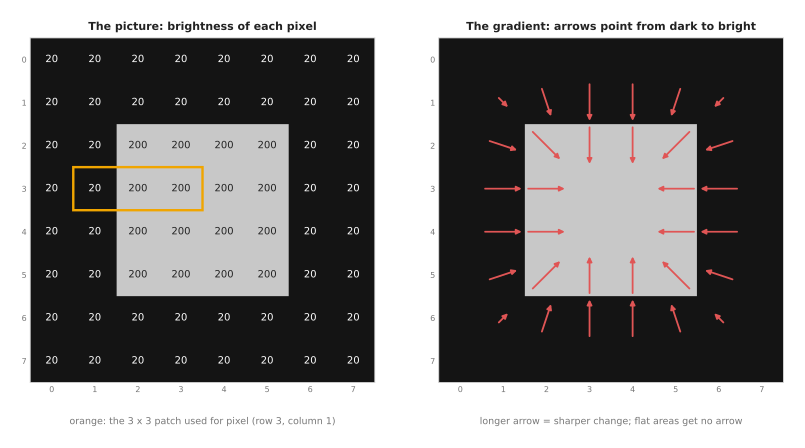
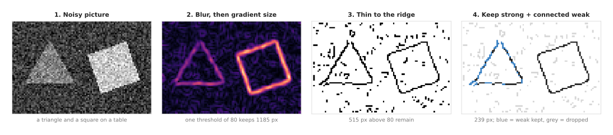
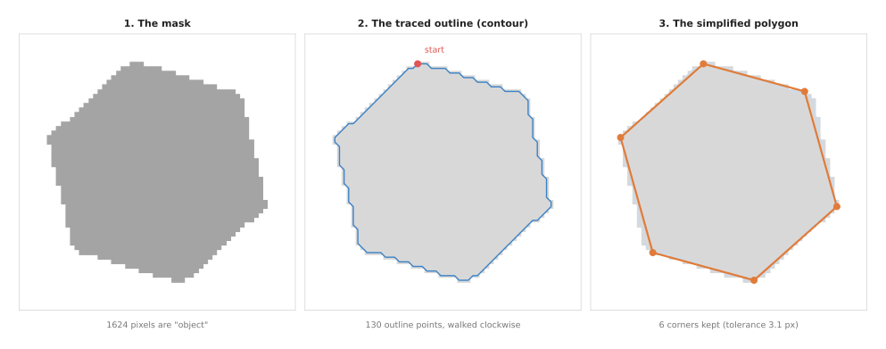
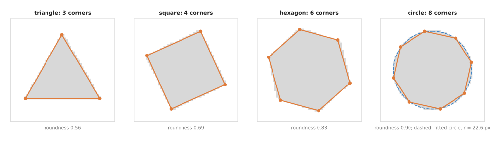
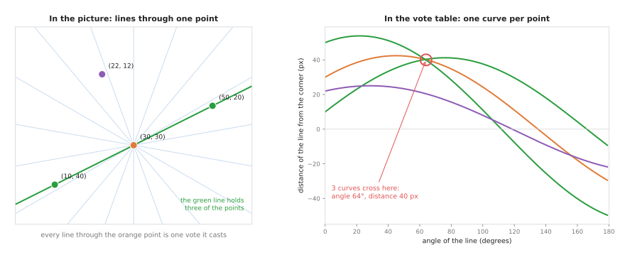
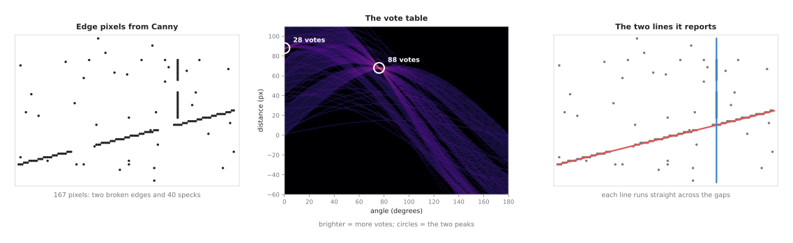
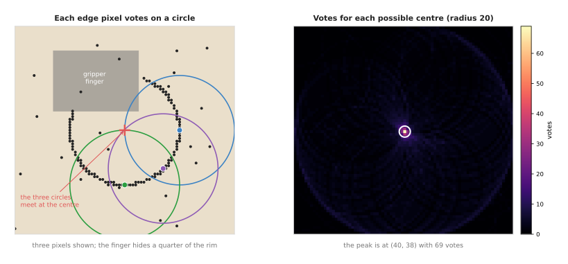
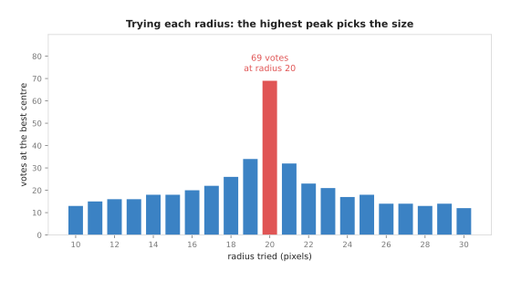

# Edges and contours

This page explains how a program finds the outline of an object in a picture, and
what it can learn from that outline once it has traced it. Because a program does
that work in a fixed order, the page follows the same order through five
questions. What is an edge, and how is it computed from the raw brightness
numbers? How does the Canny edge detector turn a noisy picture into thin, clean
lines? How does a program walk round the outline of a blob and store it as a list
of points? How does it then turn that list into a polygon with a few corners? And
how does it count those corners, or fit a known shape, so that it can say "this is
a triangle" or "this is a circle"? Because real outlines are often broken, a last
section adds a sixth question: how does a program find a straight line or a circle
when the outline comes in pieces?

It is for a reader who knows what a pixel and a grey picture are, and who has
already read [thresholding and colour masks](../02_most-used/01_thresholding-and-colour-masks.md).
That page explains how to turn a picture into a **mask**, which is a picture where
each pixel is either "object" or "not object". This page often starts from such a
mask rather than from the raw picture. So the mask has to be tidy before its
outline is worth tracing, and [morphology and the distance transform](../02_most-used/02_morphology-and-distance-transform.md)
explains how to tidy it.

On a robot arm, edges and outlines answer questions like "where exactly is the
border of this part?", "which way is this block turned?" and "is this block a
hexagon or a circle?". They answer them cheaply, because they cost a few
milliseconds and need no training data at all.

## Contents

1. [The idea in one sentence](#1-the-idea-in-one-sentence)
2. [How it works](#2-how-it-works) ·
   [Step 1: the gradient of a picture](#step-1-the-gradient-of-a-picture) ·
   [Step 2: the Canny edge detector](#step-2-the-canny-edge-detector) ·
   [Step 3: tracing a contour](#step-3-tracing-a-contour) ·
   [Step 4: simplifying the contour to a polygon](#step-4-simplifying-the-contour-to-a-polygon)
   · [Step 5: counting corners and fitting shapes](#step-5-counting-corners-and-fitting-shapes)
3. [Finding lines and circles by voting: the Hough transform](#3-finding-lines-and-circles-by-voting-the-hough-transform)
   · [Lines: every point votes for every line through it](#lines-every-point-votes-for-every-line-through-it)
   ·
   [A worked example: a broken table edge](#a-worked-example-a-broken-table-edge)
   · [Circles: the rim of a cup seen from above](#circles-the-rim-of-a-cup-seen-from-above)
   · [Where the Hough transform is used, and where it fails](#where-the-hough-transform-is-used-and-where-it-fails)
4. [Where it is used on a robot arm](#4-where-it-is-used-on-a-robot-arm)
5. [Where it works, and where it does not](#5-where-it-works-and-where-it-does-not)
6. [Libraries that provide it](#6-libraries-that-provide-it)
7. [Why edges and contours, and what they cost](#7-why-edges-and-contours-and-what-they-cost)
8. [The learned alternative](#8-the-learned-alternative)
9. [Where to read next](#9-where-to-read-next)
10. [Using it in Python](#10-using-it-in-python)

---

## 1. The idea in one sentence

An **edge** is a place in a picture where the brightness changes sharply, and a
**contour** is the closed line you get by following the edge all the way round one
object.

For example, put a white plate on a dark wooden table and look at it. Because one
side of the rim is dark and the other side is bright, your eye finds the plate's
rim at once. If you traced that rim with a pencil on a photo, the line you drew
would be its contour. If someone then asked whether the plate was round or square,
you would look at the traced line and count its corners. This means a program does
the same three things, in the same order, and the rest of this page is how it does
each one.

---

## 2. How it works

The three things your eye did in the last section become five steps in a program.
While the first two find edges in a grey picture, the last three start from a
mask, trace its outline and describe its shape. Because it depends on what a
program already has, a real program often uses only some of the five. For example,
a program that already has a clean mask from a colour threshold skips steps 1 and
2 and begins at step 3.

### Step 1: the gradient of a picture

The **gradient** of a picture at a pixel is an arrow that points in the direction
in which the brightness rises fastest. Because its length says how fast the
brightness rises, the arrow has length zero in a flat area and is long on an edge.

Since a program cannot measure a slope at a single pixel, it has to compare that
pixel with its neighbours. The most common way of doing so is the **Sobel
operator**, which looks at the 3 by 3 patch of pixels round the pixel it is
working on. It multiplies that patch by two small tables of weights, one for the
change from left to right and one for the change from top to bottom. So between
them the two tables cover both directions, and here they are:

```
change left to right (gx)      change top to bottom (gy)
   -1   0  +1                     -1  -2  -1
   -2   0  +2                      0   0   0
   -1   0  +1                     +1  +2  +1
```

To get `gx`, multiply each weight by the pixel under it and add the nine results
together. Then do the same with the second table of weights to get `gy`, the
change from top to bottom. The length of the arrow is `sqrt(gx² + gy²)`, and its
direction is the angle of the point `(gx, gy)`. Because the pixels right next to
the centre are the best evidence of what happens at the centre, the middle row and
column carry a weight of 2.

For example, the picture below is 8 pixels wide and 8 high, and a bright square
with brightness 200 sits on a dark table with brightness 20.



The left panel shows the brightness numbers, and the right panel shows the
gradient that the Sobel operator computes at every pixel.

Take the pixel in row 3, column 1, which is dark while its right-hand neighbour is
bright. The orange box marks its 3 by 3 patch, and each row of that patch reads
20, 20, 200. For `gx`, each row gives `−20 + 0 + 200 = 180`, and the middle row
counts twice. So `gx = 180 + 2 × 180 + 180 = 720`. Because the top row and the
bottom row are the same, they cancel, so `gy` comes out as 0. This means the arrow
has length 720 and points straight to the right, towards the bright square.

The pixel in row 3, column 3 sits inside the square, where the whole patch reads 200.
So both sums come out as 0, and that pixel gets no arrow at all. The pixel on
     the square's top-left corner, row 2, column 2, gets `gx = 540` and `gy =
     540`. This means its arrow has length 763.7 and points diagonally down and to
     the right, into the square. All of these numbers come from running the Sobel
     operator in NumPy on this exact picture.

Two things in the right panel matter for the step that follows. First, the arrows
sit on both sides of the real border. This means a raw gradient gives an edge two
pixels thick rather than one. Second, the arrows always point across the edge and
never along it. That is why the Canny detector, which is the next step, can use
both of those facts.

### Step 2: the Canny edge detector

Because the gradient from step 1 is both thick and noisy, something has to thin it
down. The **Canny edge detector**, published by John Canny in 1986, is the
standard way to turn a gradient into thin edge lines one pixel wide, and it does
that in four steps.

1. **Blur** the picture a little with a Gaussian blur. A **Gaussian blur**
   replaces each pixel by a weighted average of the pixels round it, with the
   nearest pixels weighted most. This removes single-pixel noise, which would
   otherwise give strong gradients everywhere.
2. **Compute the gradient** at every pixel with the Sobel operator.
3. **Thin the edges.** Look at each pixel's two neighbours across the edge, in the
   direction of its gradient arrow. Keep the pixel only if its gradient is at
   least as long as both of theirs. Otherwise set it to zero. This step is called
   **non-maximum suppression**. It leaves only the ridge of each thick band.
4. **Keep strong edges, and weak edges that touch them.** Use two thresholds, a
   high one and a low one. A pixel above the high threshold is a **strong** edge
   and is kept. A pixel between the two is a **weak** edge. It is kept only if it
   is connected, through other kept pixels, to a strong edge. Everything below the
   low threshold is dropped. This step is called **hysteresis thresholding**.

The two thresholds in step 4 are the reason Canny works so well. For example, a
real edge often has a strong part and a faint part, where a shadow falls across
it. So a single high threshold would break the edge at the faint part, while a
single low threshold would keep every patch of noise as well. The two thresholds
together keep the whole of a real edge and still drop the noise that stands alone.

The picture below shows the four steps on a 64 by 96 picture that has a lot of
noise in it. Because there is so much noise, the two thresholds really matter
here. A dim triangle (brightness 130) and a bright turned square (brightness 200)
sit on a table of brightness 60.



Each panel is the real output of that step, computed in NumPy. The Gaussian blur
has a spread (its standard deviation, called sigma) of 1 pixel, the low threshold
is 80 and the high threshold is 200.

The numbers tell the story of what each step takes away. A single threshold of 80
on the gradient keeps 1,185 pixels, which form thick bands round both shapes as
well as many specks of noise. After thinning, 515 pixels above 80 remain, of which
163 are strong and the other 352 are weak. Hysteresis then keeps 76 of the weak
pixels, because they touch a strong chain, and it drops the other 276. So the
final result has 239 edge pixels in all. In the last panel the kept weak pixels
are blue, and they lie almost all on the dim triangle, whose edge is too faint in
places to be strong. Because the dropped weak pixels are scattered noise that
touches no strong chain, they are drawn in light grey.

Written out as pseudocode, the whole of Canny comes to only a few lines, because
each of its steps is a simple pass over the pixels:

```
function canny(image, blur_width, low, high):
    smooth = gaussian_blur(image, blur_width)
    for each pixel p:
        gx, gy = sobel(smooth, p)
        size[p] = sqrt(gx*gx + gy*gy)
        direction[p] = angle(gx, gy) rounded to 0, 45, 90 or 135 degrees

    for each pixel p:                              # thin
        a, b = the two neighbours of p along direction[p]
        ridge[p] = size[p] if size[p] >= size[a] and size[p] >= size[b] else 0

    edge = all pixels with ridge >= high           # strong
    queue = list of those pixels
    while queue is not empty:                      # grow into weak pixels
        p = take one from queue
        for each of the 8 neighbours n of p:
            if ridge[n] >= low and n not in edge:
                add n to edge and to queue
    return edge
```

### Step 3: tracing a contour

Canny gives back loose edge pixels rather than whole objects. So a program that
wants to describe an object still needs its outline as one list of points in
order, and that ordered list is the **contour**.

Because a mask's outline is always closed while an edge line can have gaps in it,
contours are usually traced from a mask rather than from Canny edges. The usual
method is **border following**, also called **Moore-neighbour tracing**. It works
like a person walking round a pond while keeping one hand on the fence.

1. Scan the mask row by row from the top. The first object pixel you meet is on
   the outline. Call it the start.
2. Stand on the current pixel. Look at its 8 neighbours one by one, turning
   clockwise, beginning just after the pixel you came from.
3. The first object pixel you meet is the next outline pixel. Step onto it.
4. Repeat until you come back to the start pixel, arriving the same way as the
   first time.

The result is a list of pixel positions in walking order. For example, the picture
below shows that list for a mask of a hexagonal block.



The middle panel shows the 130 outline points the trace found, and the right panel
shows the 6 corners that step 4 keeps from them.

A contour gives several useful numbers straight away, before anything is
simplified. Its **area** is the number of pixels inside it, which here is 1,624.
Its **perimeter** is the length of the line through the outline points, which here
is 154.0 pixels. Its **centroid** is the average position of the pixels inside.
That is why it is a good point to aim the gripper at when the object is compact.
Book 2 uses exactly these numbers in [the biggest blob, and its middle](../../../02_perception/01_camera/02_finding-objects.md#34-the-biggest-blob-and-its-middle).

A mask can hold several objects, and an object can have a hole in it, such as a
washer. This is why real contour functions handle both cases: they return one
contour per outline, and they also record which contour lies inside which. Then,
when you only want the outer outline of each object, you ask the function for the
outer contours only.

### Step 4: simplifying the contour to a polygon

Because the traced outline follows every pixel step, it holds far more points than
the shape itself needs. For example, a hexagon's outline has 130 points, while a
person would describe the same shape with 6 corners. The **Ramer–Douglas–Peucker
algorithm** (RDP) removes the points that are not needed. It keeps a point only if
leaving that point out would move the line by more than a chosen **tolerance**.

For an open line, which has a first point and a last point to work from, the
method goes like this.

1. Draw a straight line from the first point to the last point.
2. Find the point that lies farthest from that line.
3. If that distance is less than the tolerance, the straight line is good enough.
   Keep only the two end points.
4. Otherwise keep the farthest point, and repeat the whole method on the part
   before it and the part after it.

A contour is closed, however, so it has no first point and no last point to start
from. The usual fix is to cut the loop in two at two points that lie far apart.
Then simplify each half on its own, and join the two halves back together. Because
the outline point farthest from the centroid is almost always a real corner, the
code behind the pictures on this page starts there.

Since the tolerance is the one setting that matters here, it is worth choosing
with care. For example, a common choice is 2% of the contour's perimeter, so that
the setting grows with the object's size in the picture. For the hexagon that
works out as 0.02 × 154.0 = 3.08 pixels, and it gives 6 corners.

The table below shows how the number of corners changes with the tolerance, for
the hexagon and for a circle of about the same size. Read each row as "with this
tolerance, the program would report this many corners".

| tolerance, as a share of the perimeter | hexagon corners | circle corners |
|---|---|---|
| 0.5% | 12 | 16 |
| 1% | 6 | 16 |
| 2% | 6 | 8 |
| 5% | 6 | 4 |
| 10% | 4 | 4 |

The hexagon gives 6 corners over a wide range of tolerances, from 1% to 5%. This
means that a wide flat range is the sign of a real corner count. The circle has no
real corners, so its count keeps falling as the tolerance grows. For example, at a
tolerance of 5% the circle would even pass for a square. This means that counting
corners on its own cannot tell a circle from a polygon, so the next step adds a
second measure.

### Step 5: counting corners and fitting shapes

Once a program has the polygon from step 4, naming the shape is simple for flat
parts with straight sides. Three corners means a triangle, and six corners means a
hexagon. But four corners means either a square or a rectangle, and the side
lengths and angles tell you which.

Round shapes have no corners, so they need a different test. The usual one is
**roundness**, also called **circularity**: `4π × area / perimeter²`. It is 1 for
a perfect circle and smaller for every other shape. For example, a perfect square
gives 0.79 and a perfect equilateral triangle gives 0.60.

The picture below runs steps 3 to 5 on four masks of the same size. So the corner
count and the roundness can be compared side by side.



Each title is the corner count at 2% tolerance, and each caption is the measured
roundness.

The measured roundness values are 0.56, 0.69, 0.83 and 0.90, which are all lower
than the perfect values given above. They come out low because a traced outline
steps from pixel to pixel, and so it is a little longer than the true smooth
outline. The order is still right, however, and the circle stands clearly apart
from the other three. This means a rule such as "roundness above 0.87 means round,
otherwise count the corners" sorts all four shapes correctly here. But on your own
camera you would measure the values on real parts before choosing that number.

For a round object you usually want its centre and its radius rather than a corner
count. A **least-squares circle fit** finds the circle that passes closest to all
the outline points at once. That fit is explained on the
[least-squares fitting](../../04_fitting-and-estimation/02_most-used/01_least-squares-fitting.md)
page, and run on the circle's 128 outline points it gives a centre of (30.0, 30.0)
and a radius of 22.56 pixels. The mask itself was drawn with its centre at (30, 30)
and a radius of 23 pixels. So the fit is half a pixel small, because the
traced points are the centres of the outer ring of pixels, and those centres lie
half a pixel inside the true edge. This is a real effect rather than a mistake, so
it is worth knowing about when you turn pixels into millimetres. The dashed blue
line in the picture is this fitted circle.

Other fits work in the same way, and each one answers a different question about
the part. For example, the smallest turned rectangle round a contour gives the
part's length, width and angle, while a fitted ellipse gives the tilt of a round
rim. A program can also compute the **convex hull**, which is the outline you get
by stretching a rubber band round the contour. Then comparing the hull's area with
the contour's area finds dents and notches.

## 3. Finding lines and circles by voting: the Hough transform

Steps 3 to 5 all start from a clean mask with one closed outline. But real edges
are often not like that at all. A cable lies across the edge of the table, a
shadow hides part of a box, or a gripper finger covers a quarter of a cup's rim.
In each of those cases Canny gives back several short pieces of edge, plus specks
of texture. So in those cases no single contour is the whole object.

The **Hough transform**, named after Paul Hough, who patented the idea in 1962,
finds straight lines and circles in exactly those broken edges. Its idea fits into
one sentence: **every edge pixel votes for every shape that could pass through it,
and the shape with the most votes wins.**

For example, ask a room of people, each standing somewhere on a large floor, to
name every straight path across the room that passes through their own spot. Most
paths get one or two names, but if ten people happen to stand in a row, the path
along that row is named ten times. This means you find the row by counting names,
without ever looking for it directly. It does not matter if there are gaps in the
row, or if other people stand around at random.

### Lines: every point votes for every line through it

A straight line in a picture can be described by just two numbers. In other words,
a vote for a line is really a vote for a pair of numbers. The first number is the
line's **angle**, and the second is its **distance** from the picture's top-left
corner, measured straight across to the line. With those two numbers, a pixel at
`(x, y)` lies on the line when

```
distance = x × cos(angle) + y × sin(angle)
```

The Hough transform keeps a **vote table**, also called an **accumulator**. It has
one row for each possible distance and one column for each possible angle, and
every cell starts at zero. Then, for each edge pixel, the program tries every
angle, works out the distance of the line through that pixel at that angle, and
adds one vote to the matching cell. This means each pixel draws a wavy curve of
votes across the table. Because pixels that lie on one line all vote for the same
cell, their curves cross at that cell.



In the left panel, the pale blue lines are some of the lines through the orange
pixel at (30, 30), and each one of them is a single vote. In the right panel each
pixel's votes form one curve. Because the three green and orange pixels lie on one
line, their curves cross at one spot: an angle of 64° and a distance of 40 pixels.
At that angle the formula gives distances of 40.34, 40.11 and 39.89 for the three
pixels. With a table whose cells are 1 degree by 1 pixel, all three round to 40
and land in the same cell, which therefore gets 3 votes. The purple pixel at (22, 12)
is not on that line. Because its distance at 64° is 20.43, its curve misses
that cell altogether.

So the method is short in pseudocode, because it is two loops followed by a search
for the fullest cells:

```
function hough_lines(edge_pixels, angle_step, distance_step, min_votes):
    votes = a table of zeros: one row per distance, one column per angle
    for each edge pixel (x, y):
        for each angle a from 0 to 180 degrees, in steps of angle_step:
            d = x * cos(a) + y * sin(a)
            votes[row for d, column for a] += 1
    lines = []
    repeat:
        cell = the cell with the most votes
        if votes[cell] < min_votes: stop
        add (angle, distance) of cell to lines
        set that cell and the cells right round it to zero   # so one line is reported once
    return lines
```

Because a line at 190 degrees is the same line as one at 10 degrees, with the sign
of the distance flipped, only angles from 0 to 180 degrees are needed.

### A worked example: a broken table edge

The picture below puts that vote table to work, and it starts from 167 edge
pixels. One hundred of them lie on the front edge of a table, which has two gaps
where a cable and a shadow cross it. Twenty-seven lie on one side of a box, which
has one gap. But the other 40 are specks of table texture, and they belong to no
line at all.



The middle panel is the vote table, which has 301 rows and 180 columns and so
holds 54,180 cells in all. Each bright band in it is one pixel's curve, and the
two circled cells are the peaks.

The table edge gets 88 votes, at an angle of 76° and a distance of 68 pixels. The
other 12 of its 100 pixels round into the next row, at a distance of 67. This is
why the program clears the cells round a peak once it has taken that peak, because
otherwise it would report the same line twice. The box side gets 28 votes, at an
angle of 0° and a distance of 88. That is its own 27 pixels plus one pixel of the
table edge, which crosses the box's line at x = 88. Because specks do not line up
with each other, no speck gets more than a few votes. The right panel draws the
two lines, and each one runs straight across the gaps. Because a gap only means a
few missing votes, the line is found all the same.

### Circles: the rim of a cup seen from above

A camera looking straight down at a cup sees its rim as a circle. But a circle
needs three numbers rather than two: the x and y of its centre, and its radius. In
other words, the Hough transform for circles is the same voting idea with a
different shape of vote.

First fix the radius, say 20 pixels, so that only the centre is left to find. Then
every point at a distance of 20 from an edge pixel could be the centre. So each
edge pixel votes for every cell on a circle of radius 20 round itself. Because the
real centre lies at 20 pixels from every rim pixel, all of those circles of votes
pass through it.



The left panel shows 134 edge pixels, of which one hundred and nine lie on the rim
of a cup. That cup's centre is at (40, 38) and its radius is 20 pixels. A gripper
finger hides the rim from 200° to 290°, which is a quarter of it, and the other 25
pixels are specks. The three coloured circles are the votes of three rim pixels,
and they meet at the centre.

The right panel is the vote table, and it has one cell for each possible centre.
Here the highest cell is exactly (40, 38), with 69 votes, while the highest cell
anywhere else, more than 2 pixels away from it, has only 12. Because each rim
pixel sits at a whole-pixel position, the peak does not get all 109 votes. Then
its true distance from the centre is a little more or a little less than 20, so
its circle of votes can pass through a neighbouring cell instead. The peak is
still clear, however, even with a quarter of the rim missing.

When the radius is not known, the program tries a range of radii and keeps the one
whose best cell has the most votes. For example, the picture below does this for
the same edge pixels, with radii from 10 to 30 pixels.



Radius 20 gets 69 votes, while radius 19 gets 34 and radius 21 gets 32. Every
other radius gets 26 or fewer, so the radius is found as well as the centre. This
means that neither the centre nor the radius has to be known beforehand.

However, trying every radius costs a lot of time, because the vote table becomes
three-dimensional. So OpenCV's `HoughCircles` avoids that cost with a shortcut,
and the shortcut uses the direction of each pixel's gradient from
[step 1](#step-1-the-gradient-of-a-picture). On a circle the gradient points
straight towards or away from the centre. This means each pixel only has to vote
along one short line instead of round a whole circle.

### Where the Hough transform is used, and where it fails

Because each of the jobs below has a line or a circle hidden inside broken edges,
the Hough transform earns its place on a robot arm.

- **The rim of a cup, bowl or bottle seen from above.** `HoughCircles` gives the
  centre and radius even when a finger, a spoon or a handle hides part of the rim,
  so the arm can then aim a pouring spout, or a grasp, at the centre.
- **Round parts on a tray.** Washers, bearings, caps and coins are found and
  measured, including ones that overlap a little, because each circle keeps its
  own peak.
- **Straight edges for alignment.** The edge of a table, the side of a tray or a
  conveyor, or the long side of a box gives a line whose angle tells the arm how
  the tray or box is turned.
- **Holes and pegs.** A camera on the wrist looks down at a hole before an
  insertion, and the circle's centre gives the last few millimetres of the move.

But it fails in four ways as well, and each failure has a sign you can watch for.

- **Too many edges.** On a patterned or textured surface, random pixels line up by
  chance and give false peaks, so you would see lines or circles reported where
  there is nothing. Raise the vote threshold, blur more before Canny, or work from
  a colour or depth mask instead.
- **A slanted view.** A circle seen at a slant is an ellipse, so the circle vote
  smears out and you would see a weak peak, or two circles on one rim. Look from
  straight above, or fit an ellipse to the contour with `fitEllipse`.
- **Coarse cells or a wrong radius range.** Cells that are too big merge two
  nearby lines, while cells that are too small split one line's votes over several
  cells, as the 88 and 12 votes above show. A radius range that leaves out the
  real radius finds nothing at all.
- **Clean outlines.** When the outline is whole and there is little noise, a
  [least-squares](../../04_fitting-and-estimation/02_most-used/01_least-squares-fitting.md)
  fit to the contour is faster and more exact. When some points are wrong but the
  object is one shape,
  [RANSAC](../../04_fitting-and-estimation/02_most-used/02_ransac.md) is the other
  common choice. Hough is best when several lines or circles hide in one set of
  broken edges, because every shape gets its own peak.

You never have to write the voting loop yourself. OpenCV provides
`cv::HoughLines`, which returns each line as an angle and a distance, and
`cv::HoughLinesP`, a faster version that samples the pixels and returns line
pieces with two end points. It also provides `cv::HoughCircles`, whose method
`HOUGH_GRADIENT` uses the gradient shortcut described above. scikit-image provides
`skimage.transform.hough_line` with `hough_line_peaks`,
`probabilistic_hough_line`, and `hough_circle` with `hough_circle_peaks`.

---

## 4. Where it is used on a robot arm

Sections 2 and 3 described the methods on their own. So this section shows where
they sit in the software of a real arm. Edges and contours turn up at many points,
and the places below are the most common ones.

- **Sorting blocks by shape.** A camera looks down at blocks on a table, a
  threshold gives a mask, the contour gives a polygon, and the corner count and
  roundness then give the shape. The robot-arm-projects repository does exactly
  this in its [find-shape-and-mass project](https://github.com/RobinNagpal/robot-arm-projects/blob/main/v4-find-shape-and-mass/README.md),
  where it uses it as the score a trained detector must beat.
- **Finding which way a part is turned.** The smallest turned rectangle round a
  contour gives the angle of a long part, such as a pen or a bolt, and the wrist
  then turns by that angle, so that the gripper fingers close across the part's
  width.
- **Measuring a part before grasping it.** The contour's width in pixels, with the
  depth and the camera's focal length, gives the width in millimetres, and the
  [pinhole camera model](../../02_geometry-and-cameras/02_most-used/01_pinhole-camera-model.md)
  page explains that conversion. The program then checks that the part fits
  between the gripper fingers.
- **Checking a part against a drawing.** For flat parts, such as gaskets or sheet
  metal blanks, the contour can be compared with the outline in a drawing, so
  holes, burrs and missing corners show up as differences.
- **Finding printed markers.** Square fiducial markers, such as the ArUco markers
  used for calibration, are found by looking for contours whose polygon has
  exactly four corners, and the
  [calibration](../../02_geometry-and-cameras/02_most-used/03_calibration.md) page
  uses them.
- **Finding the rim of a cup or bowl.** An ellipse fitted to the rim's edge tells
  the program where the opening is and how it is tilted, which matters for pouring
  into it or for grasping it by the rim.
- **Checking the result of a place.** After placing a part in a tray, the arm
  takes a picture, and a small gap between the part's contour and the tray
  pocket's contour means the part sits correctly.

---

## 5. Where it works, and where it does not

The uses in the last section all share the same conditions. Edges and contours
work best when the object is flat or seen straight from above, has a clear border
against a plain background, and does not touch anything else. This means they get
worse quickly as soon as any of those conditions fails.

The table below lists the common failures, and it has three columns. Read each row
as: this is what goes wrong, this is what you would see, and this is what people
do instead.

| what goes wrong | the sign you would see | what people use instead |
|---|---|---|
| Low contrast between object and table | Canny finds only parts of the outline; contours come back open or too small | Better lighting, a table colour chosen to contrast, or a depth threshold instead of a brightness one |
| Textured objects or a patterned table | Hundreds of edges inside the object; no single contour is the object | A colour or depth mask first, then contours of the mask |
| Shadows | The contour includes the shadow, so the object looks bigger or the wrong shape | Diffuse lighting from several sides; a depth camera |
| Objects touching each other | Two objects come back as one contour with too many corners | The distance transform and watershed from the [morphology page](../02_most-used/02_morphology-and-distance-transform.md), or depth clustering from the [clustering page](../02_most-used/03_clustering.md) |
| Camera at a slant | Squares look like irregular four-sided shapes; circles look like ellipses; roundness drops | Look from straight above, or correct the view with the camera's known pose |
| A small or far object | Corners get rounded off; a hexagon reports 4 or 8 corners | Move the camera closer; use a larger tolerance only if the shapes are very different |
| Noise in the mask | A single stray pixel adds an extra corner or an extra tiny contour | An opening step on the mask, and a minimum contour area |
| See-through or shiny objects | The edge found is a reflection, not the object's border | A [segmentation model](../../../06_learned-models/03_seeing-models/02_most-used/02_segmentation.md) trained on such objects |

Book 2 gives the same trade-off as five jobs these methods suit and five they
cannot do, in [edges, contours and connected components](../../../02_perception/02_object-perception/03_programmed-methods.md#13-edges-contours-and-connected-components).

---

## 6. Libraries that provide it

Because every step on this page is available in well-known libraries, nothing in
the last five sections has to be written from scratch. Read the table below as:
this library, used from these languages, provides this step under this name.

| library | languages | function or class | note |
|---|---|---|---|
| OpenCV | C++, Python, Java | `cv::Sobel`, `cv::Scharr` | Gradient in x or y. Scharr is a slightly more accurate 3 by 3 version of Sobel. |
| OpenCV | C++, Python, Java | `cv::Canny` | The full Canny detector. You pass the low and high thresholds. |
| OpenCV | C++, Python, Java | `cv::findContours` | Border following on a mask. It can return outer contours only, or all contours with their nesting. |
| OpenCV | C++, Python, Java | `cv::approxPolyDP`, `cv::arcLength`, `cv::contourArea` | Ramer–Douglas–Peucker simplification, perimeter and area. |
| OpenCV | C++, Python, Java | `cv::minAreaRect`, `cv::fitEllipse`, `cv::minEnclosingCircle`, `cv::convexHull` | Fitting a turned rectangle, an ellipse, a circle round the points, and the convex hull. |
| OpenCV | C++, Python, Java | `cv::HoughLines`, `cv::HoughLinesP`, `cv::HoughCircles` | Find straight lines and circles directly from edges, even when the outline is broken. [Section 3](#3-finding-lines-and-circles-by-voting-the-hough-transform) explains them. |
| scikit-image | Python | `skimage.filters.sobel`, `skimage.feature.canny` | Gradient and Canny on NumPy arrays. |
| scikit-image | Python | `skimage.measure.find_contours`, `skimage.measure.approximate_polygon` | Contours at sub-pixel accuracy, and polygon simplification. |
| scikit-image | Python | `skimage.transform.hough_line`, `skimage.transform.hough_circle` | The Hough transform for lines and circles, with `hough_line_peaks` and `hough_circle_peaks` to pick the peaks. |
| scikit-image | Python | `skimage.measure.regionprops` | Area, perimeter, centroid, orientation and other measures for each labelled blob. |
| SciPy | Python | `scipy.ndimage.sobel` | The Sobel gradient on any NumPy array, including a depth picture. |
| PCL | C++ | `pcl::BoundaryEstimation` | The 3D counterpart: marks points on the border of a surface in a point cloud. |

In OpenCV's Python interface the names start with `cv2.` instead of `cv::`, as in
`cv2.Canny`.

---

## 7. Why edges and contours, and what they cost

The libraries in the last section make these methods easy to call. So this section
asks whether you should call them at all, and it answers the four questions for
this technique: what it is, what it does for you, why it rather than the obvious
alternative, and what it costs.

Edges and contours are a fixed set of rules, and section 2 described each rule in
turn. The gradient finds where brightness changes, Canny thins that into lines,
and border following turns a mask into an ordered outline. Then polygon
simplification and shape fitting describe that outline in a few numbers.

What they do for you is give exact geometry. A contour tells you the border of an
object to within about a pixel, and from that border you get the area, the centre,
the angle, the width and the shape class. Every one of those numbers is easy to
check by hand. So when one of them is wrong, you can see why by drawing the
contour on the picture.

The obvious alternative is a trained segmentation model or object detector. So
[Section 8](#8-the-learned-alternative) says when each of the two is the better
choice.

The costs of these methods come in three parts. First, you must control the scene,
because every method on this page depends on a clear border between the object and
its background. Second, you must choose thresholds, which are the two Canny
thresholds, the mask threshold, the polygon tolerance and the roundness cut-off.
Because each one depends on the lighting and the camera, each one needs checking
on real pictures. Third, a contour is flat, so it says nothing about height, and
it says nothing about the parts of the object the camera cannot see.

---

## 8. The learned alternative

Because section 7 named a trained model as the obvious alternative, this section
says what that model gives you and what it asks for in return. A
[segmentation model](../../../06_learned-models/03_seeing-models/02_most-used/02_segmentation.md)
or an [object detector](../../../06_learned-models/03_seeing-models/02_most-used/01_object-detection.md)
from Book 6 finds the object's outline or box, and a
[keypoint and pose model](../../../06_learned-models/03_seeing-models/02_most-used/04_keypoints-and-object-pose.md)
finds which way that object is turned. A model copes with the texture, clutter and
shadows that break contours. But it needs labelled training pictures and a
computer that can run it, and it can fail in ways that are hard to explain. So
choose contours instead when the scene is controlled, which means a plain table,
good light, parts that stand apart, and shapes that differ in clear geometric
ways. Because that output mask still has to be turned into a centre, an angle and
a size, programs often run contour steps on it even when a model is used.

---

## 9. Where to read next

- The next page is [clustering](../02_most-used/03_clustering.md). It groups mask
  pixels into separate objects with connected components, and does the same for 3D
  points with Euclidean clustering and DBSCAN.
- [Thresholding and colour masks](../02_most-used/01_thresholding-and-colour-masks.md)
  makes the masks this page traces, and [morphology and the distance transform](../02_most-used/02_morphology-and-distance-transform.md)
  tidies them and splits touching objects.
- [Least-squares fitting](../../04_fitting-and-estimation/02_most-used/01_least-squares-fitting.md)
  explains the circle and line fits used in step 5, and
  [RANSAC](../../04_fitting-and-estimation/02_most-used/02_ransac.md) fits a shape
  when many of the edge points are wrong.
- The chapter [overview](../01_overview.md) compares all the techniques in this
  chapter.
- Book 2's [methods you write yourself](../../../02_perception/02_object-perception/03_programmed-methods.md)
  puts edges and contours next to the other programmed perception methods, and
  [finding an object in a picture](../../../02_perception/01_camera/02_finding-objects.md)
  runs `findContours` on a real camera picture.
- The diagrams in section 2 are drawn by `docs/diagrams/image_processing_2.py`.
  Every number in that section comes from the functions in that script; run it
  with `--numbers` to print them. The Hough transform pictures in section 3 are
  drawn by `docs/diagrams/image_processing_3.py`, which also takes `--numbers`.

---

## 10. Using it in Python

Section 2 walked through the five steps from a gradient to a fitted shape,
section 3 added the Hough transform for broken outlines, and section 6 named the
OpenCV call for each step. This section runs those calls in order. After it you
will be able to get a turned rectangle and a corner count out of a picture, and
you will know which of the thresholds in the calls you have to set from your own
pictures.

The program below does two separate things that section 2 keeps apart. It runs
the Canny detector on the grey picture to get an edge picture, and it traces
contours on a mask to get closed outlines it can measure. Both come from OpenCV,
whose Python names are the C++ names with `cv2.` in front, so `cv::Canny` is
`cv2.Canny`.

```python
import cv2
import numpy as np

picture = cv2.imread("scene.png")
grey = cv2.cvtColor(picture, cv2.COLOR_BGR2GRAY)

# Edges: thin lines wherever the brightness changes sharply.
edges = cv2.Canny(grey, 50, 150)                 # low limit, then high limit

# Contours: closed outlines, traced on a mask rather than on the edge picture.
mask = cv2.imread("mask.png", cv2.IMREAD_GRAYSCALE)
contours, hierarchy = cv2.findContours(mask, cv2.RETR_EXTERNAL, cv2.CHAIN_APPROX_SIMPLE)

for outline in contours:
    perimeter = cv2.arcLength(outline, True)     # True means the outline is closed
    corners = cv2.approxPolyDP(outline, 0.02 * perimeter, True)
    (x, y), (width, height), angle = cv2.minAreaRect(outline)
    print(cv2.contourArea(outline), len(corners), width, height, angle)

# When the outline is broken, vote for whole lines instead.
lines = cv2.HoughLinesP(edges, rho=1, theta=np.pi / 180,
                        threshold=40, minLineLength=40, maxLineGap=5)
```

On a made-up picture of two green blocks on a grey table, Canny marks 287 edge
pixels, and `findContours` on the colour mask returns two outlines. The larger
has an area of 4894 pixels and a perimeter of 277.7, simplifies to 4 corners,
and fits a 70 by 70 pixel rectangle. The smaller fits 60 by 50 pixels.
`HoughLinesP` on the same edge picture finds 3 line segments, the first running
from (150, 160) to (150, 90), which is one side of the larger block.

OpenCV does every step. `Canny` runs the whole detector from section 2,
including the thinning and the two-threshold following that a plain gradient
does not give you. `findContours` does the border following, and with
`RETR_EXTERNAL` it returns only the outermost outline of each shape, which is
what you want when you do not care about holes. `approxPolyDP` does the
Ramer-Douglas-Peucker simplification, and `minAreaRect` fits the turned
rectangle, which is what tells a gripper which way to align its fingers.
`HoughLinesP` runs the voting from section 3 and returns line segments with
their two end points rather than infinite lines.

What you still have to write is the interpretation. A contour with four corners
might be a square block or a square hole or the shadow of both, and only your
program knows which. You also have to write the step that picks the contour you
care about, because `findContours` returns every outline in the picture
including the frame of the table, and `max(contours, key=cv2.contourArea)` is
the usual shortcut. And you have to read `minAreaRect`'s angle carefully,
because the same rectangle can be reported as 70 by 70 at −90 degrees or at 0
degrees, so a gripper angle computed from it needs wrapping into the range the
gripper can actually reach.

What you have to decide or measure are the two Canny limits, the simplification
tolerance and the Hough thresholds. The `50` and `150` are gradient strengths in
your own pictures, so you set them by trying values on real pictures from your
own camera and lighting, and section 2 explains the rule of thumb that the high
limit should be two or three times the low one. The `0.02 * perimeter` tolerance
decides how much detail survives, and making it a fraction of the perimeter
rather than a fixed number of pixels is deliberate, because it then behaves the
same on a near object and a far one. For `HoughLinesP` you decide `threshold`,
which is how many edge pixels must agree before a line is reported, and
`maxLineGap`, which is how large a break in a line you are willing to bridge;
section 3 explains that both depend on how broken you expect your outlines to
be, which is a property of your scene and not of the library.
