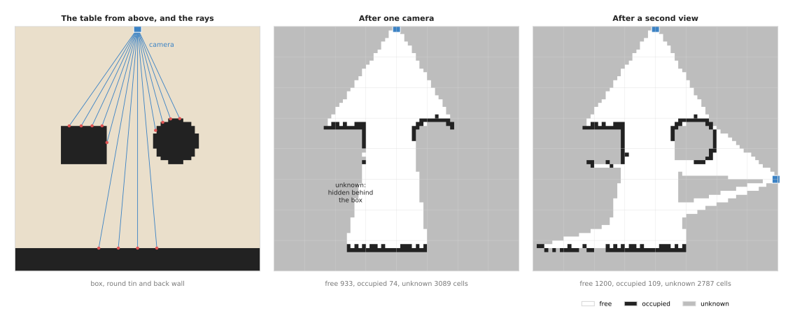
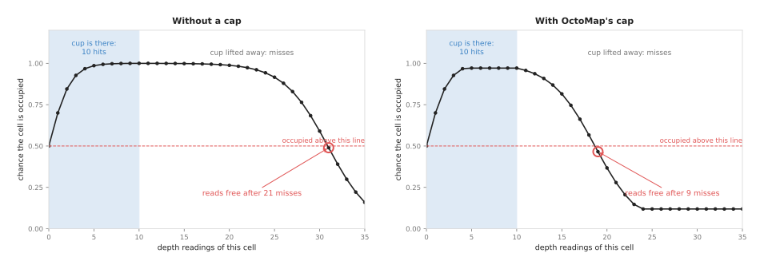
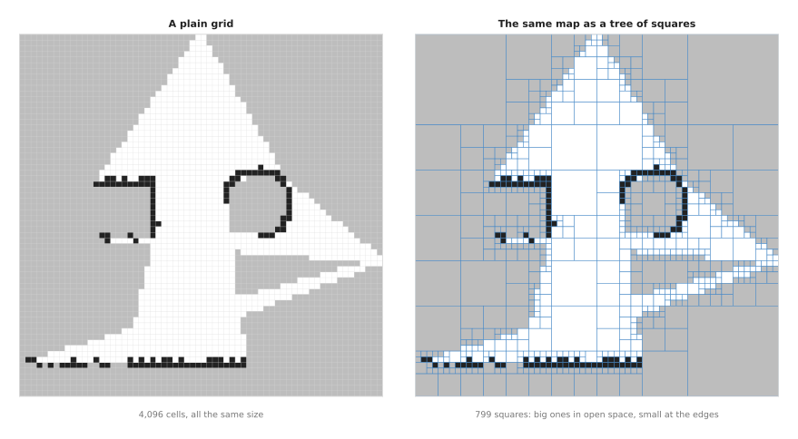
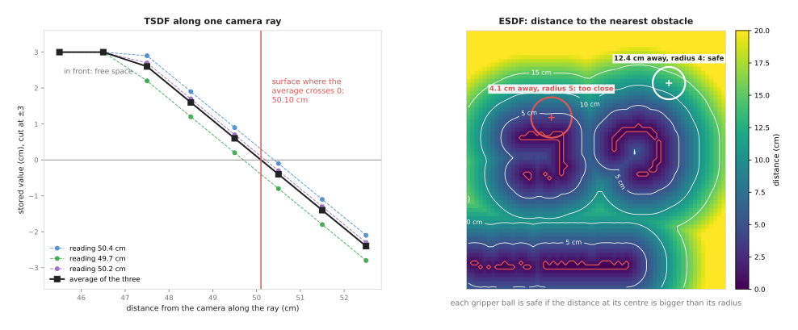

# Volumetric maps

This page explains how a robot turns many depth pictures into one 3D map of the
space round it. It answers five questions, and the first four of them follow the
order in which the map is built. How is space cut into small cubes, and how is
each cube marked as free, occupied or not yet seen? How does a program combine
many noisy depth readings of the same cube into one answer? Why do most maps store
their cubes in a tree instead of a plain grid? What are the truncated signed
distance function (TSDF) and the Euclidean signed distance field (ESDF), and why
do planners like them? And which libraries do this, and which of them are used
most?

It is for a reader who knows what a depth picture and a point cloud are. While a
**depth picture** holds one distance for each pixel, a **point cloud** is the list
of 3D points you get by turning each depth pixel into a point. That step is
explained on the [pinhole camera model](../../02_geometry-and-cameras/02_most-used/01_pinhole-camera-model.md#back-projection-a-pixel-and-a-depth-to-a-point)
page, and it also helps to have read about [voxel downsampling](../02_most-used/03_clustering.md#voxel-downsampling-preparing-the-cloud),
which cuts space into the same small cubes this page uses.

One depth picture only shows the surfaces in front of the camera at one moment.
But a robot arm needs more than that, because it has to remember the shelf behind
it after it has turned away. It also has to know that the space under its gripper
is empty, and to know which space it has never seen at all. A **volumetric map**
holds all of this, and "volumetric" means that it describes the space itself, cube
by cube, and not only the surfaces.

## Contents

1. [The idea in one sentence](#1-the-idea-in-one-sentence)
2. [How it works](#2-how-it-works) ·
   [Step 1: cut space into voxels](#step-1-cut-space-into-voxels) ·
   [Step 2: cast a ray for each depth pixel](#step-2-cast-a-ray-for-each-depth-pixel)
   · [Step 3: combine readings with log-odds](#step-3-combine-readings-with-log-odds)
   · [Step 4: store the map in a tree](#step-4-store-the-map-in-a-tree) ·
   [Step 5: the truncated signed distance function](#step-5-the-truncated-signed-distance-function)
   · [Step 6: the distance field that planners read](#step-6-the-distance-field-that-planners-read)
   · [The steps as pseudocode](#the-steps-as-pseudocode)
3. [Where it is used on a robot arm](#3-where-it-is-used-on-a-robot-arm)
4. [Where it is useful, and where it is not](#4-where-it-is-useful-and-where-it-is-not)
5. [Libraries that provide it](#5-libraries-that-provide-it)
6. [Why a volumetric map, and what it costs](#6-why-a-volumetric-map-and-what-it-costs)
7. [The learned alternative](#7-the-learned-alternative)
8. [Where to read next](#8-where-to-read-next)

---

## 1. The idea in one sentence

A **volumetric map** cuts space into small cubes and, for every depth reading,
marks the cubes the camera saw through as more likely free and the cube where the
reading ended as more likely occupied, so that many readings add up to one steady
answer.

For example, you walk into a dark room with a torch. Each time you shine it, the
beam passes through empty air and stops on a wall or a chair. This means you learn
two things from each beam: the air along the beam is empty, and something solid
stands where the beam stopped. But corners you never shine the torch at stay
unknown. After a few minutes of shining the torch round, you have a good picture
of the room in your head, even though no single beam showed you much. So a
volumetric map does the same with the thousands of beams in each depth picture.

---

## 2. How it works

The map described in the last section is built in six steps. Steps 1 to 4 build an
**occupancy map**, which says for each cube whether it is free, occupied or
unknown. Then steps 5 and 6 build two other kinds of map from the same readings.
While one of them gives a smooth surface, the other gives the distance to the
nearest obstacle, which is what many planners read.

All the pictures on this page show a slice of a table seen from above, 64 cm by 64
cm, cut into cells of 1 cm. A real map is 3D, with cubes instead of squares, but
every step works the same way. The table holds a box, a round tin and, at the
back, a wall.

### Step 1: cut space into voxels

A **voxel**, short for "volume pixel", is one small cube of space. That is why the
map cuts the robot's work space into voxels of equal size and keeps a few numbers
for each one. The size of a voxel is called the **resolution**, and for a
table-top arm it is usually 1 to 2 cm. Because a smaller voxel shows more detail,
it also needs more memory and more time.

But a plain grid of voxels grows fast, because a cube of space 1 m on each side,
cut into 1 cm voxels, has 100 × 100 × 100 = 1,000,000 voxels. So step 4 shows how
a tree cuts that number down.

### Step 2: cast a ray for each depth pixel

Each depth pixel says "along this line from the camera, the first surface is at
this distance". So the program follows that line, called a **ray**, from the
camera to the measured point. This is called **ray casting**, and along the way it
collects two kinds of voxel:

- every voxel the ray passes through before the end. The camera saw through them,
  so they are evidence for **free**. This is called a **miss**.
- the voxel where the ray ends. Something is there, so it is evidence for
  **occupied**. This is called a **hit**.

But voxels behind the end point get nothing, because the camera cannot see behind
a surface, so they stay **unknown**. Unknown is not the same as free, because the
space behind a box might hold another object.



The left panel shows the real scene and every tenth ray of the camera. The camera
has a 70° view and 141 rays, and each ray's reading has a small random error of
about 3 mm. While the middle panel is the map after three pictures from that
camera, the right panel adds three pictures from a second camera position on the
right.

After the first camera, 933 cells are free, 74 are occupied and 3,089 are unknown.
Most of the map is unknown, because the camera only sees a wedge of the table, and
the areas behind the box and the tin are hidden. The second view sees round the
tin and along the right of the table. As a result, free cells rise to 1,200,
occupied cells to 109, and unknown cells fall to 2,787. But the inside of the box
and the tin stays unknown in both maps, because no camera can see inside a solid
object.

However, the occupied cells are not perfect lines: where a ray grazes a surface at
a shallow angle, the small reading error puts its end in the cell next door. Step
3 is how the map copes with that error.

A real program steps along each ray with a method that visits exactly the voxels
the ray crosses, one after another. The usual one was published by John Amanatides
and Andrew Woo in 1987.

### Step 3: combine readings with log-odds

A single reading can be wrong, because a depth camera makes stray points at the
edges of objects, and a hand can pass through the view for one frame. So a map
does not say "free" or "occupied" after one reading. Instead it keeps, for each
voxel, a **probability**: a number from 0 to 1 that says how likely the voxel is
to be occupied. Every voxel starts at 0.5, which means "no idea".

Then each new reading changes that probability a little. The most common library,
OctoMap, uses these default values. While a hit means the voxel is occupied with
probability 0.7, a miss means it is occupied with probability only 0.4. This means
that after one hit, a voxel's probability is 0.7, and after two hits it is 0.845.
After one hit and then one miss it is 0.609.

But multiplying probabilities together is awkward and slow, so the map stores each
voxel's value as a **log-odds** number instead. The **odds** of a voxel are its
probability of being occupied divided by its probability of being free, and the
log-odds is the natural logarithm of the odds. This is useful because, to combine
a new reading, you simply add a fixed number. The table below gives that number
for the two kinds of reading, so read a row as one kind of reading, the
probability it stands for, and the amount it adds to the voxel's log-odds.

| reading | probability it stands for | number added to the log-odds |
|---|---|---|
| hit | 0.7 | +0.847 |
| miss | 0.4 | −0.405 |

So every hit adds 0.847 to the voxel's log-odds, and every miss subtracts 0.405. A
log-odds of 0 means a probability of 0.5. Therefore a positive log-odds means
"probably occupied", and a negative one means "probably free". A voxel that was
never touched by any ray stays at exactly 0, which marks it as unknown.

There is one more rule, because the log-odds is **clamped**: it is not allowed to
go above +3.511, which is a probability of 0.971, or below −2.0, which is a
probability of 0.1192. Without this cap, a voxel that was seen many times would
become so certain that it could hardly change again. The picture below shows why
that cap matters.



Because a cup stands on the table for 10 depth pictures, its voxel gets 10 hits.
Then the arm lifts it away, and every following picture gives the voxel a miss.

Without a cap, 10 hits give a log-odds of 8.47, a probability of 0.9998. Then it
takes 21 misses before the voxel reads free again. At 30 pictures a second, the
map would show a ghost cup for most of a second after the cup has gone. But with
the cap, the log-odds stops at 3.511 after the fifth hit, and it then takes only 9
misses to read free. In other words, the cap costs a little certainty and buys a
map that keeps up with a changing table.

### Step 4: store the map in a tree

Most of a work space is either empty air or unknown. But a plain grid spends the
same memory on a big block of empty air as on the edge of an object. So a tree
avoids that waste.

An **octree** is a tree of cubes, and the whole work space starts as one big cube.
If everything inside it is the same, it stays one cube. But if not, it is cut into
8 equal smaller cubes, and each of those is checked in the same way, down to the
smallest voxel size. In 2D, the same idea cuts a square into 4 smaller squares,
and then the tree is called a **quadtree**.



The left panel is the two-view map from step 2 as a plain grid of 64 × 64 = 4,096
cells. While the right panel is the same map as a quadtree, it needs only 799
squares. Of these, 556 are single cells at the edges of objects and of the
camera's view, 157 are 2 × 2 blocks, 66 are 4 × 4, 17 are 8 × 8 and 3 are 16 × 16.
Because the big squares hold open air and unknown space, the map says exactly the
same thing with a fifth of the pieces.

In 3D the saving is much larger, because a big cube holds 8 times as many voxels
at each level, not 4. This is why OctoMap, the most used occupancy map, is an
octree. It has a second benefit as well, because a program can ask the map at a
coarser level, such as "is anything in this 8 cm cube?", with one look.

### Step 5: the truncated signed distance function

An occupancy map is good for "is this space free?". But it is poor at showing the
exact shape of a surface, because each voxel is only "in" or "out". So a **signed
distance function** stores something more precise: for each voxel it stores the
distance from the voxel's centre to the nearest surface. The sign says which side
the voxel is on: positive in front of the surface, in free space, and negative
behind it, inside the object. This means the surface itself is where the value
crosses zero.

A **truncated** signed distance function (TSDF) only keeps the exact value close
to the surface. So values further than a chosen **truncation distance** are cut
off at that distance. Many libraries go further and only visit the voxels inside
this thin band. Because the camera knows nothing about voxels far behind a
surface, those voxels are not updated at all. So keeping only a thin layer round
each surface saves work, and it stops one side of a thin object from wiping out
the other.

Each new depth picture updates the TSDF by a **weighted average**. For each voxel
near the measured surface, the program works out the signed distance from this
reading, then mixes it into the stored value. For example, take one camera ray,
with 1 cm voxels and a truncation distance of 3 cm. A surface stands 50.0 cm from
the camera, and three depth readings measure it at 50.4, 49.7 and 50.2 cm.



While the left panel shows the TSDF along the ray, the right panel is the distance
field of step 6.

Take the voxel whose centre is at 49.5 cm. Because the first reading says the
surface is at 50.4, this voxel is 50.4 − 49.5 = 0.9 cm in front of it. The other
two readings give 0.2 and 0.7, so the average of the three is 0.6. The next voxel,
at 50.5 cm, gets −0.1, −0.8 and −0.3, which average to −0.4. This means the value
crosses zero between these two voxels, and a straight line between them crosses
zero at 49.5 + 0.6 / (0.6 + 0.4) = 50.10 cm. That is exactly the average of the
three readings, and within 1 mm of the true surface. Because the voxels at 53.5
and 54.5 cm are more than 3 cm behind every reading, they are not updated.

This is how a TSDF turns many noisy depth pictures into one smooth surface, finer
than its own voxels. A program then pulls a triangle mesh out of the zero crossing
with a method called **marching cubes**. The method became well known through
**KinectFusion**, published in 2011, which built live 3D models this way from a
moving depth camera. The TSDF itself goes back to Brian Curless and Marc Levoy in
1996.

### Step 6: the distance field that planners read

A planner does not need to know what an obstacle looks like. Instead it needs to
know how far each point of the arm is from the nearest obstacle. So a **Euclidean
signed distance field** (ESDF) stores exactly that for every voxel: the
straight-line distance from the voxel to the nearest occupied voxel, which is
negative inside obstacles.

This is the same idea as the [distance transform](../02_most-used/02_morphology-and-distance-transform.md#3-how-the-distance-transform-works),
which measures how far each pixel of a mask is from the nearest edge. An ESDF does
it in 3D, for the free space outside the obstacles. Libraries build it from the
TSDF or the occupancy map by spreading a wave out from the surfaces, one layer of
voxels at a time.

The right panel of the picture above shows the ESDF of the two-view map, with
lines at 5, 10 and 15 cm from the nearest obstacle. In this picture only the
occupied cells count as obstacles. A planner models the arm as a set of balls.
This means a ball is clear of every obstacle when the ESDF at its centre is bigger
than its radius, and that is one look-up per ball, however many obstacles there
are.

The picture checks two balls that stand for parts of the gripper. The ball at (50, 13)
cm has a radius of 4 cm, and the ESDF at its centre is 12.4 cm, so it is clear
by 8.4 cm. But the ball at (21, 21.5) cm has a radius of 5 cm, and the ESDF at its
centre is only 4.1 cm. This means it overlaps the box by 0.9 cm, and the planner
rejects that pose.

An ESDF also says which way is "away from the obstacle": the direction in which
the distance grows fastest. So optimisation planners such as CHOMP use that
direction to push a path away from obstacles, as the
[trajectory optimisation](../../06_planning-and-search/02_most-used/03_trajectory-optimisation.md#step-3-a-cost-for-being-near-an-obstacle)
page explains.

### The steps as pseudocode

The six steps above come together in the pseudocode below. It has one function for
the occupancy update, one for reading a voxel's state, one for the TSDF and one
for the ESDF look-up.

```
function update_occupancy(map, camera_position, depth_points):
    for each measured point q in depth_points:
        cells = the voxels on the ray from camera_position to q
        for each voxel v in cells, except the last:
            map.log_odds[v] = max(L_MIN, map.log_odds[v] + L_MISS)    # seen through: free
        v = the voxel that holds q
        map.log_odds[v] = min(L_MAX, map.log_odds[v] + L_HIT)         # seen: occupied

function state(map, v):
    if v was never updated: return UNKNOWN
    if map.log_odds[v] > 0:  return OCCUPIED
    else:                    return FREE

function update_tsdf(tsdf, weight, camera_position, depth_points, trunc):
    for each measured point q in depth_points:
        for each voxel v on the ray, up to trunc behind q:              # nothing further behind
            sd = distance(camera, q) - distance(camera, centre of v)   # + in front, - behind
            sd = min(sd, trunc)
            tsdf[v]   = (tsdf[v] * weight[v] + sd) / (weight[v] + 1)   # running average
            weight[v] = weight[v] + 1

function is_clear(esdf, arm_balls):
    for each ball (centre, radius) in arm_balls:
        if esdf.look_up(centre) <= radius: return false
    return true
```

With OctoMap's defaults, `L_HIT` is +0.847, `L_MISS` is −0.405, `L_MIN` is −2.0
and `L_MAX` is +3.511.

---

## 3. Where it is used on a robot arm

The six steps above describe the map on its own, so this section shows where it
sits in a real arm's software. A volumetric map sits between the depth camera and
the parts of the program that must not hit anything, and the places below are the
common ones.

- **Avoiding obstacles nobody put in the model.** A planning program knows the
  shape of the arm and of the fixed table, but it does not know about a toolbox
  someone left on the table. That is why MoveIt, the most used planning framework
  for arms, builds an OctoMap from the depth camera for exactly this, and its
  planners then treat every occupied voxel as an obstacle. Book 3 describes this
  in [the planning scene](../../../03_frameworks/03_arm-movement/03_planning-a-path.md#7-the-planning-scene-and-what-collision-checking-really-checks).
- **Remembering what the camera cannot see now.** A camera on the wrist looks
  wherever the gripper points, so when the arm turns to a shelf, the table behind
  it leaves the view. The map keeps the table's voxels, so the planner still
  avoids them.
- **Removing the arm from its own map.** The arm is often in the camera's view,
  and its own points would fill the map with false obstacles right where the arm
  wants to move. So MoveIt removes every point that lies on the arm's known shape,
  plus a small margin, before it updates the map.
- **Planning fast with a distance field.** GPU planners such as NVIDIA's cuMotion
  can read an ESDF built by nvblox, and optimisation planners use its distance and
  direction at every waypoint.
- **Scanning an object before grasping it.** A camera on the wrist takes pictures
  from several sides of a part, and a TSDF fuses them into one closed mesh. A
  grasp planner then works on the whole shape, not only the side one picture
  showed.
- **Choosing where to look next.** Unknown voxels show where the robot has not
  looked, so a program can pick the next camera pose that would turn the most
  unknown voxels into known ones. Book 2 covers this in
  [choosing where to look](../../../02_perception/02_object-perception/09_choosing-where-to-look.md),
  and this book in [visibility and next best view](../../06_planning-and-search/03_also-used/03_visibility-and-next-best-view.md).
- **Checking whether a space is empty.** Before placing a part in a bin, the arm
  asks the map whether the voxels where the part will go are free, and not only
  "not occupied", because an unknown voxel means "look first".

But a volumetric map is not a measuring tool. Book 2 warns about this in
[packages for measuring](../../../02_perception/02_object-perception/06_licences-and-platforms.md#41-packages-for-measuring):
an occupancy map with 1 or 2 cm voxels is the model of what the arm must not hit,
not the model of the part it is about to grasp. Instead the part itself is
measured on the point cloud, with the methods on the
[clustering](../02_most-used/03_clustering.md) and
[RANSAC](../../04_fitting-and-estimation/02_most-used/02_ransac.md) pages.

---

## 4. Where it is useful, and where it is not

The places in the last section all assume the same conditions. A volumetric map
works best when the camera's pose is known well, the depth is good, and the scene
changes slowly compared with the camera's frame rate. But it fails in a few common
ways, and the table below lists them.

Read each row as: this is what goes wrong, this is what you would see, and this is
what people do instead.

| what goes wrong | the sign you would see | what people do instead |
|---|---|---|
| The camera's pose is wrong, from a bad [hand-eye calibration](../../02_geometry-and-cameras/02_most-used/03_calibration.md#3-hand-eye-calibration-where-the-camera-is-on-the-arm) or a late joint reading | Walls and objects appear twice, or smeared; free space eats into real obstacles | Recalibrate; use the joint angles from the same moment as the picture; slow the arm while mapping |
| The voxels are too big | The planner refuses gaps the gripper could pass through; thin rods vanish or grow fat | A smaller voxel near the work area; a separate precise model for the part being grasped |
| The voxels are too small | The map update is slow, and memory grows | A larger voxel; a GPU library such as nvblox; update the map at a lower rate than the camera |
| Glass, shiny metal or black foam | Missing hits, so a real obstacle reads as free or unknown | Treat unknown space as blocked near the arm; add the object as a known shape; see Book 2's [the depth hole](../../../02_perception/02_object-perception/03_programmed-methods.md#17-the-depth-hole-for-glass-and-chrome) |
| Objects that move quickly, such as a person's hand | Ghost obstacles that stay after the hand has gone, or a hand that is missed | Clamping, as in step 3; clear the map before each plan; a separate safety sensor for people |
| The arm's own body is not fully removed | A cloud of false voxels round the gripper, and the planner reports that the start pose is in collision | A larger removal margin; check the arm model and the camera's pose |
| Unknown space treated as free | The planner sends the arm into space no camera has seen | Mark unknown voxels near the path as obstacles, or look there first |

---

## 5. Libraries that provide it

None of the six steps has to be written from scratch, because four libraries do
most of this work for robot arms. Read the table below as: this library, used from
these languages, does this, and this is where it is used.

| library | languages | what it builds | where it is used most |
|---|---|---|---|
| [OctoMap](https://github.com/OctoMap/octomap) | C++, with ROS wrappers | A log-odds occupancy octree, with the clamping of step 3. The main class is `octomap::OcTree`, with `insertPointCloud` and `castRay`. | The most used occupancy map for arms, because MoveIt uses it. MoveIt's occupancy map monitor builds it from a point cloud or a depth picture. The library is BSD; its `octovis` viewer is GPL. |
| [Open3D](https://github.com/isl-org/Open3D) | Python, C++ | A TSDF, with `open3d.pipelines.integration.ScalableTSDFVolume` and the newer `open3d.t.geometry.VoxelBlockGrid`, and a mesh from its zero crossing. | The most used way to fuse depth pictures into a mesh in Python: scanning an object, or a scene for a digital twin. It does not build an ESDF for planning. |
| [nvblox](https://github.com/nvidia-isaac/nvblox) | C++ on an NVIDIA graphics card, Python, ROS 2 through Isaac ROS | A TSDF, an ESDF and a mesh, updated on the graphics card many times a second. | NVIDIA's robot stack: its planner cuMotion and its cuRobo library can use its maps. It needs an NVIDIA card. |
| [voxblox](https://github.com/ethz-asl/voxblox) | C++, ROS 1 | A TSDF, then an ESDF built from it step by step as new pictures arrive. | Research, and flying robots, where it began. It is written for ROS 1 and there is no official ROS 2 version, so new arm projects rarely start with it. |

In plain words: if you use MoveIt, you already use OctoMap, and it is the one to
learn first. But if you want a clean 3D model of an object or a scene from a
handful of depth pictures, use Open3D's TSDF. And if you have an NVIDIA card and a
planner that reads a distance field, use nvblox. Since voxblox is the older CPU
version of the same idea as nvblox, you will meet it mainly in papers.

In MoveIt, the map is set up in a file usually called `sensors_3d.yaml`. It names
the sensor plugin, such as `occupancy_map_monitor/PointCloudOctomapUpdater`, the
topic to read, the maximum range, and the margin used to remove the arm's own
body. But the voxel size is a separate setting, `octomap_resolution`.

---

## 6. Why a volumetric map, and what it costs

The libraries in the last section make a volumetric map easy to build. So this
section asks whether you need one at all. It answers the four questions for this
technique: what it is, what it does for you, why it rather than the obvious
alternative, and what it costs.

A volumetric map is a grid of small cubes, often stored as a tree, in which each
cube holds either a probability of being occupied or a distance to the nearest
surface. Then every depth picture updates it by casting rays from the camera.

What it does for you is give one steady answer, built from many noisy pictures, to
three questions: is this space free, is it occupied, or has the robot not looked
there yet? It also remembers space the camera no longer sees. And, with a distance
field, it tells a planner how far every point is from the nearest obstacle in one
look-up.

The obvious alternative is to skip the map and use the latest point cloud directly
as the obstacle. That is simpler and has no delay, and some collision checkers can
take a point cloud. But a single cloud has holes, stray points and no memory, so
it says nothing about the space behind objects, or about space that left the view
a second ago. And it cannot tell "free" from "not seen", which is the difference
between safe and unsafe. So choose the raw cloud when the scene is fully in view
and nothing is hidden. But choose a map when the camera moves, when parts of the
scene are hidden, or when the robot must be sure a space is empty.

A second alternative is a learned model that fills in the 3D shape, and
[Section 7](#7-the-learned-alternative) compares the two.

The costs of a volumetric map come in several parts. Because the map is only as
good as the camera's pose, it needs a good calibration and exact timing. You must
also choose the voxel size, which is a trade between detail, speed and memory.
Since a 3D map at 1 cm has up to a million voxels per cubic metre, updating it at
the camera's full rate takes real computing time. This is why nvblox moves that
work to the graphics card. Moving objects leave ghosts unless the map is clamped
or cleared. And the map is coarse by design, because it tells the arm what not to
hit, not the exact shape of what to grasp.

---

## 7. The learned alternative

Section 6 named a learned model as the second alternative, so this section says
what those models can and cannot do. No model in Book 6 replaces the map as the
record of free, occupied and unseen space, but three kinds of model help it. For
example, a [shape completion](../../../06_learned-models/04_3d-models/03_also-used/01_shape-completion.md)
model guesses the hidden back of an object from one view, where the map keeps it
as unknown. Then [scene reconstruction](../../../06_learned-models/04_3d-models/02_most-used/02_scene-reconstruction.md)
builds a 3D scene from colour photos, so it sees glass and shiny surfaces that
leave holes in a depth map. But it takes seconds to minutes, and the scene must
stay still. A learned collision checker, from
[learned motion planners](../../../06_learned-models/06_movement-models/03_also-used/02_learned-motion-planners.md#4-learned-collision-checking),
gives a fast distance to obstacles like an ESDF. But it is least reliable near the
edge of an obstacle. So for collision avoidance the map still wins, because it
never guesses: it keeps unseen space as unknown, and that honesty is what keeps
the arm safe. In practice the map and the models are often used together.

---

## 8. Where to read next

- [Clustering](../02_most-used/03_clustering.md) covers voxel downsampling, the
  same grid of cubes used to thin a point cloud.
- [Morphology and the distance transform](../02_most-used/02_morphology-and-distance-transform.md)
  explains the 2D distance transform that an ESDF extends to 3D.
- [Sampling-based planning](../../06_planning-and-search/02_most-used/01_sampling-based-planning.md#3-collision-checking-the-only-question-a-sampler-asks)
  explains the collision checks that read this map, and
  [trajectory optimisation](../../06_planning-and-search/02_most-used/03_trajectory-optimisation.md)
  uses the distance field to push a path away from obstacles.
- [Visibility and next best view](../../06_planning-and-search/03_also-used/03_visibility-and-next-best-view.md)
  uses the unknown voxels to choose where the camera should look.
- Book 2's [choosing where to look](../../../02_perception/02_object-perception/09_choosing-where-to-look.md#32-the-ray-cast-in-three-dimensions)
  casts rays in 3D to test what a camera can see.
- The chapter [overview](../01_overview.md) compares all the techniques in this
  chapter.
- The diagrams on this page are drawn by `docs/diagrams/image_processing_3.py`.
  Every number on the page comes from the functions in that script; run it with
  `--numbers` to print them.
