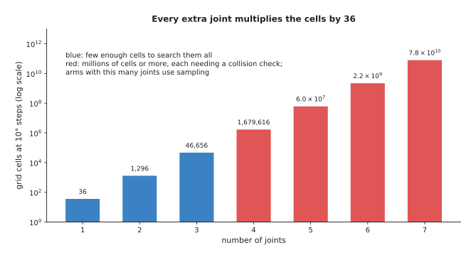
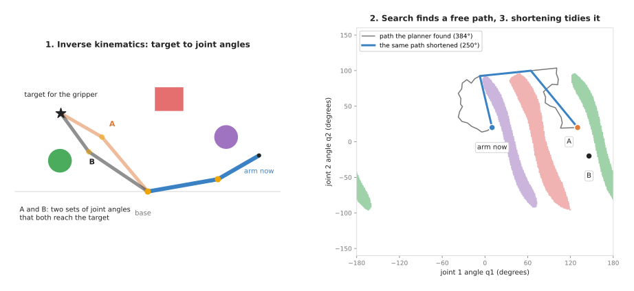

# Planning and search

This chapter is about finding a way for the arm to get from here to there without
hitting anything, and about choosing well among many possible moves. It covers six
techniques: sampling-based planning, numerical inverse kinematics, trajectory
optimisation, graph search, sampling-based optimisation with model-predictive
control, and visibility with next-best-view planning. Each one is a written set of
rules that a program follows, so none of them is trained on examples.

This page is the overview of the chapter, and it answers four questions. The first
two are what job these techniques do for an arm, and what each of the six does in
one line. The other two are how they work together on one real move, and how this
chapter connects to the rest of the book and to the learned planners of Book 6.

It is for a reader who knows what a joint, a joint angle and a frame are, at the
level of Book 1's
[frames and transforms](../../01_robotics-intro/03_arm/01_overview.md) and
[forward kinematics](../../01_robotics-intro/04_kinematics/01_forward-kinematics.md).
You do not need to have met any of the algorithms before, because each page
introduces its own from the start.

## Contents

1. [What planning and search is for](#1-what-planning-and-search-is-for)
2. [Where the search happens: the space of joint angles](#2-where-the-search-happens-the-space-of-joint-angles)
3. [The six techniques](#3-the-six-techniques)
4. [The six side by side](#4-the-six-side-by-side)
5. [How they work together on one move](#5-how-they-work-together-on-one-move)
6. [How this chapter connects to the others](#6-how-this-chapter-connects-to-the-others)
7. [Where to read next](#7-where-to-read-next)

---

## 1. What planning and search is for

The book's
[map of techniques](../01_what-techniques-are/04_the-map-of-techniques.md)
describes this category in one line, as finding a way for the arm to get from here
to there without hitting anything. So this section says what that one line means
once a real arm has to obey it.

Here is the job in everyday terms. Imagine that you are carrying a tray through a
kitchen, and that you know where you are and where the table is. Between you and
the table there are chairs, an open cupboard door and a dog. So you work out a
route before you move, and you pick one that keeps the tray clear of the cupboard
door. In the same way, an arm has this job every time it moves in a place that has
other things in it.

For an arm, the question has three parts.

1. Where should the joints end up? The goal is usually given as a position and a
   direction for the gripper, in metres and angles, but the motors need joint
   angles, so something must turn the one into the other.
2. Which way should the arm go? There are many ways from the current joint angles
   to the goal joint angles, and some of them swing the arm through the box on the
   table, so the route must avoid those.
3. Is the route good enough to run? A route that only just misses the box, or that
   takes a long detour, may be allowed but still be a poor choice, so something
   must make it shorter, smoother or further from the box.

So the first four techniques in this chapter answer these three parts between
them. Numerical inverse kinematics answers the first, while graph search and
sampling-based planning answer the second, and trajectory optimisation answers the
third and sometimes the second as well.

The other two techniques then answer questions that come up around a move.
Sampling-based optimisation and model-predictive control answer "which move is
best right now?" when the cost is awkward or the world keeps changing. This is
done by trying many moves in a model and re-planning every few moments. Visibility
and next-best-view planning answer "where should the camera go?", which is a
planning problem whose goal is to see something rather than to reach it.

What happens after that is the next chapter's job, because
[control and motion](../07_control-and-motion/01_overview.md) takes the route and
turns it into timed, smooth motor commands.

---

## 2. Where the search happens: the space of joint angles

So, to answer the second of those three parts, a planner for an arm does not
search the room itself, but searches the space of joint angles instead. This one
fact explains most of how planners behave, and Book 3's
[planning a path](../../03_frameworks/03_arm-movement/03_planning-a-path.md#1-what-the-planner-is-actually-searching)
starts from it too.

Every set of joint angles is one point in this space. So a two-joint arm has a
two-dimensional space, with one axis for joint 1 and one for joint 2, while a
six-joint arm has a six-dimensional space. This space is called the
**configuration space**, and one set of joint angles in it is called a
**configuration**.

Once the space is drawn this way, each object in the room blocks some of these
points. A configuration counts as blocked when the arm, standing in that
configuration, would overlap the object. So a plain box on a table blocks a curved
band of configurations rather than a box. The
[sampling-based planning](02_most-used/01_sampling-based-planning.md#2-configuration-space-drawn-for-a-real-arm)
page draws that band for the book's two-joint arm.

Why does the number of joints matter so much? One simple way to search is to cut
the space into small squares, called **cells**, and then search the cells. So the
picture below counts the cells when each joint is cut into 10 degree steps, which
gives 36 steps per joint.

Two joints give 1,296 cells, but six joints give 2,176,782,336 cells, which is
more than two billion. Each of those cells needs its own collision check before
the search can use it. So a grid search, which is the subject of
[graph search](03_also-used/01_graph-search.md), is a good tool only for two or
three joints, or for the gripper's position alone. Instead, for a six-joint arm
the usual tool is a
[sampling-based planner](02_most-used/01_sampling-based-planning.md), which tests
a few thousand random configurations rather than every cell.

---

## 3. The six techniques

Because that many joints rule out a plain grid search, the chapter's pages are
split into two groups. The "most used" group holds the three techniques that run
on nearly every arm move. In it, a sampling-based planner finds the route, inverse
kinematics turns a gripper goal into joint angles, and trajectory optimisation
tidies the route. The "also used" group then holds three techniques that are
common but are needed for fewer jobs. Those three are graph search for small
spaces and fixed roadmaps, sampling-based optimisation and model-predictive
control for fast re-planning, and visibility with next-best-view planning for
moving a camera.

Here is each technique in one line, with a link to its page.

**Most used**

- [Sampling-based planning](02_most-used/01_sampling-based-planning.md) tries
  random joint configurations, keeps the ones that hit nothing, and joins them up
  until a route appears. The rapidly-exploring random tree (RRT), RRT-Connect and
  the probabilistic roadmap (PRM) are the main methods, and this is what MoveIt 2
  uses by default.
- [Numerical inverse kinematics](02_most-used/02_numerical-inverse-kinematics.md)
  finds joint angles that put the gripper at a given position and direction. It
  starts from a guess and sees how far the gripper is from the target. It then
  moves the joints a little to close the gap, and repeats until the gap is small
  enough.
- [Trajectory optimisation](02_most-used/03_trajectory-optimisation.md) starts
  from a whole route and improves it step by step, so that the route becomes
  shorter and smoother and is pushed away from obstacles. CHOMP, STOMP and TrajOpt
  are the well-known methods that do this.

**Also used**

- [Graph search](03_also-used/01_graph-search.md) finds the shortest or cheapest
  route through a network of places joined by moves, and breadth-first search,
  Dijkstra's algorithm and A* are the three main methods. On an arm it searches a
  grid of cells, or a small set of taught poses joined by known moves. The same
  page covers topological sort, which puts jobs in an order that respects "this
  before that", such as which object must be moved before another can be reached.
- [Sampling-based optimisation and model-predictive control](03_also-used/02_sampling-based-optimisation-and-mpc.md)
  tries many random sequences of moves in a model, keeps the best, and runs only
  the first step before planning again. Random shooting, the cross-entropy method
  and CMA-ES are the main ways to choose the samples, and model-predictive control
  (MPC) is the plan-a-little, act-a-little loop around them.
- [Visibility and next-best-view](03_also-used/03_visibility-and-next-best-view.md)
  works out what a camera can and cannot see from a pose. It then chooses where to
  put the camera next, so that the camera sees the most of what is still unknown.

---

## 4. The six side by side

Those one-line descriptions say what each technique does on its own. So the table
below puts the six of them side by side, to show where they differ. Read each row
as one technique, where the "answers" column says which part of section 1's
three-part question it answers, or which other question it answers. The last
column then names the most common reason that the technique fails.

| Technique | Answers | What goes in | What comes out | Same answer every run? | Usual way it fails |
| --- | --- | --- | --- | --- | --- |
| Sampling-based planning | which way | a collision checker, a start and a goal configuration | a route that hits nothing, usually with detours | no, it is random | a narrow gap that random samples rarely land in |
| Numerical inverse kinematics | where should the joints end up | a target pose for the gripper, a first guess | joint angles that reach it | yes, from the same guess | no answer found near a bad guess, or near a joint limit |
| Trajectory optimisation | is it good enough (and sometimes which way) | a first route, a cost, a collision distance | a shorter, smoother route with more clearance | yes, from the same first route | stuck on the wrong side of an obstacle |
| Graph search | which way | a grid or a graph, a start and a goal | the shortest or cheapest route on it | yes | too many cells when there are many joints |
| Sampling-based optimisation and MPC | which move is best right now | a model that predicts what a move does, a cost | the first step of the best sequence found, again every cycle | no, it is random | the model is wrong, or too few samples for many joints |
| Visibility and next-best-view | where should the camera go | the objects' shapes, candidate camera poses, what is still unknown | the reachable pose that would show the most | yes | objects not shaped like the model, or the best view out of reach |

Two things in the table are worth saying in words, because they change how you use
the techniques.

First, the two sampling methods give a different answer each run, and Book 3's
[planning a path](../../03_frameworks/03_arm-movement/03_planning-a-path.md#2-sampling-based-planners)
explains why that matters when a cell has to be checked and signed off.

Second, the techniques fail in different ways, so they are often used together. A
sampler is good at finding some way through an awkward space, whereas an optimiser
is good at making a route nice. But an optimiser can get stuck on the wrong side
of an obstacle, so a common pair is a sampler that finds a route and an optimiser,
or a simple shortening step, that then cleans it up.

---

## 5. How they work together on one move

To show that pairing in action, the picture below follows one move of the book's
two-joint arm. In it, link 1 is 3 m long and link 2 is 2 m long, as in Book 1.
There is a box, a post and a jar on the table, and the arm must move its gripper
to the star.

The left panel is the table seen from above, while the right panel is the
configuration space. Each coloured band on the right is the set of joint angles
where the arm would touch the object of the same colour on the left.

The move happens in three steps.

1. Inverse kinematics turns the target into joint angles. The target is a point
   for the gripper, and two sets of joint angles reach it: A, at (130°, 20°), and
   B, at (146°, −20°). They differ in which way the elbow bends, and the program
   picks A.
2. A planner searches for a free route. The straight line from the current joint
   angles to A crosses two bands, so the arm would hit the post and then the box.
   Instead, an RRT-Connect planner finds a route that goes over the top of both
   bands. On the table, that means the arm folds its elbow sharply to pass inside
   the post and the box. That route is 384 degrees long, counting the joint turns
   added together.
3. A shortening step makes the route tidier. It tries to replace parts of the
   route with straight lines, keeping each one only if it hits nothing, and the
   route drops to 250 degrees, with two corners.

The numbers come from a real run of the planner, in
[`planning_and_search_1.py`](../../diagrams/planning_and_search_1.py). The
shortening step used here is the simplest kind, so the
[trajectory optimisation](02_most-used/03_trajectory-optimisation.md) page covers
the methods that also make the route smooth and keep it clear of obstacles.

But after step 3, the route is still only a list of joint angles, because it has
no times and no speeds attached to it. [Trajectory generation](../07_control-and-motion/02_most-used/02_trajectory-generation.md)
adds those, so that the motors can follow it.

---

## 6. How this chapter connects to the others

That one move used a camera goal, a collision checker and a motor command, which
shows how planning sits in the middle of the book's seven categories. So it takes
input from the first four categories and hands its result to the sixth.

- [Geometry and cameras](../02_geometry-and-cameras/01_overview.md) gives the
  planner its goal, because a camera first finds the object in pixels. Then the
  [pinhole camera model](../02_geometry-and-cameras/02_most-used/01_pinhole-camera-model.md)
  and [rigid transforms](../02_geometry-and-cameras/02_most-used/02_rigid-transforms.md)
  turn those pixels into a pose in the arm's frame, which inverse kinematics turns
  into joint angles.
- [Searching and matching](../03_searching-and-matching/01_overview.md) provides a
  piece that every sampling planner uses on every step, namely
  [nearest-neighbour search](../03_searching-and-matching/02_most-used/01_nearest-neighbour-search.md),
  which finds the closest point already in the tree.
- [Fitting and estimation](../04_fitting-and-estimation/01_overview.md) and
  [image and point cloud processing](../05_image-and-point-cloud-processing/01_overview.md)
  build the obstacles that the planner avoids. So a table plane fitted with
  [RANSAC](../04_fitting-and-estimation/02_most-used/02_ransac.md), or a cluster
  of points from [clustering](../05_image-and-point-cloud-processing/02_most-used/03_clustering.md),
  becomes a box in the planner's list of obstacles.
- [Control and motion](../07_control-and-motion/01_overview.md) takes the route
  from this chapter and makes the motors follow it.
- [Decisions and task logic](../08_decisions-and-task-logic/01_overview.md)
  decides which move to plan next, and when the choice is between several places
  to go, it may use graph search itself.

Book 6 has learned versions of some of these techniques, because
[learned motion planners](../../06_learned-models/06_movement-models/03_also-used/02_learned-motion-planners.md)
covers networks that suggest routes, networks that check for collisions, and
networks that do inverse kinematics. That page's advice agrees with this chapter,
since for moving through open space an ordinary planner is usually the better
tool. This is because it is fast enough, it checks every move, and it needs no
training. So learned helpers earn their place only when the same kind of problem
comes up many thousands of times and the answer is needed in the same short time
every run.

---

## 7. Where to read next

Because the six pages do not have to be read in the order they are listed, the
list below gives a reading order that introduces each idea before it is used.

- Start with [graph search](03_also-used/01_graph-search.md), because it explains
  breadth-first search, Dijkstra's algorithm and A*, which the other pages then
  use.
- Then read [sampling-based planning](02_most-used/01_sampling-based-planning.md),
  which is how most arm planners find a route.
- [Trajectory optimisation](02_most-used/03_trajectory-optimisation.md) and
  [numerical inverse kinematics](02_most-used/02_numerical-inverse-kinematics.md)
  complete the most-used group.
- [Sampling-based optimisation and MPC](03_also-used/02_sampling-based-optimisation-and-mpc.md)
  covers re-planning a short way ahead, many times a second.
- [Visibility and next-best-view](03_also-used/03_visibility-and-next-best-view.md)
  covers choosing where to point the camera.
- Book 3's
  [planning a path](../../03_frameworks/03_arm-movement/03_planning-a-path.md)
  covers the same planners in practice: MoveIt's defaults, the planning scene, and
  the ways a planner can succeed and still leave you worse off.
- Book 3's [programmed methods for one arm](../../03_frameworks/04_one-arm-training/02_programmed-methods.md#4-motion-planning)
  places motion planning among the other ways to program an arm.
