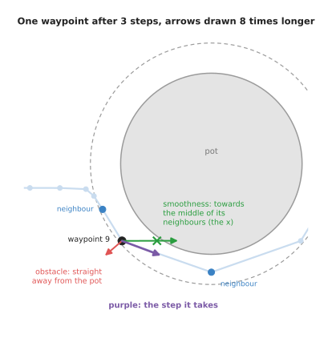
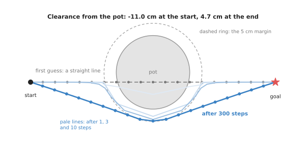
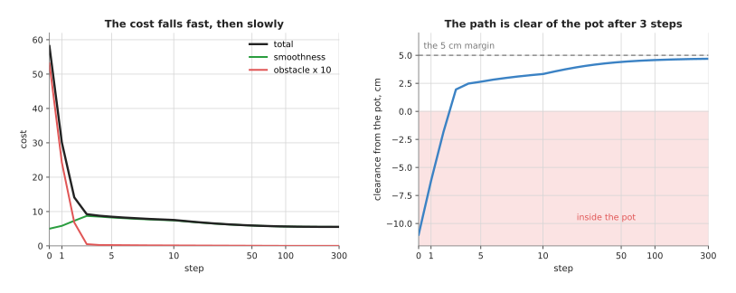
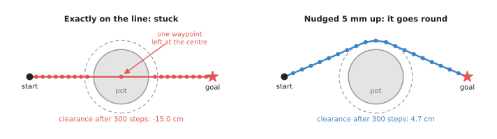

# Trajectory optimisation

This page explains trajectory optimisation: a way to plan an arm's motion by
starting from a rough path and improving it, step by step, until it is short,
smooth and clear of obstacles. It answers five questions. What does it mean to
give a path a cost? How does a program lower that cost? What do the three
well-known methods, CHOMP, STOMP and TrajOpt, do differently? Where does a
robot arm use this? And when does it get stuck?

It is for a reader who has met a path planner before, for example on the pages
about [graph search](../03_also-used/01_graph-search.md) and
[sampling-based planning](01_sampling-based-planning.md). Those planners find
*a* route. This page is about making a route *good*. You do not need any
calculus. The one idea borrowed from it, the gradient, is explained where it
first appears.

Book 3 compares the planner families in
[planning a path](../../../03_frameworks/03_arm-movement/03_planning-a-path.md#3-optimisation-based-planners).
This page agrees with it and goes one level down: it runs a small optimiser, so
you can see every number move.

## Contents

1. [The idea in one sentence](#1-the-idea-in-one-sentence)
2. [How it works](#2-how-it-works)
   · [Step 1: a path is a list of waypoints](#step-1-a-path-is-a-list-of-waypoints)
   · [Step 2: a cost for smoothness](#step-2-a-cost-for-smoothness)
   · [Step 3: a cost for being near an obstacle](#step-3-a-cost-for-being-near-an-obstacle)
   · [Step 4: moving every waypoint downhill](#step-4-moving-every-waypoint-downhill)
   · [Step 5: a worked example around a pot](#step-5-a-worked-example-around-a-pot)
   · [Step 6: the same thing for a real arm](#step-6-the-same-thing-for-a-real-arm)
   · [Pseudocode](#pseudocode)
3. [CHOMP, STOMP and TrajOpt](#3-chomp-stomp-and-trajopt)
4. [Where it is used on a robot arm](#4-where-it-is-used-on-a-robot-arm)
5. [Where it works, and where it does not](#5-where-it-works-and-where-it-does-not)
6. [Libraries that provide it](#6-libraries-that-provide-it)
7. [Why trajectory optimisation, and what it costs](#7-why-trajectory-optimisation-and-what-it-costs)
8. [The learned alternative](#8-the-learned-alternative)
9. [Where to read next](#9-where-to-read-next)

---

## 1. The idea in one sentence

Write down one number that says how bad a path is, then keep nudging the path in
the direction that makes that number smaller.

The number is called the **cost**. A path that is long, jerky or close to an
obstacle has a high cost. A path that is short, smooth and well clear of
everything has a low cost. The program never searches for a route from scratch.
It starts with a guess and improves it.

Here is an everyday example. Think of a garden hose laid straight across a lawn,
with a flower bed in the way. You do not lay a new hose. You push the middle of
the hose sideways, off the bed, and the rest of the hose follows because it is
one piece. Pushing too hard at one point makes a sharp kink, so you push a little
at many points. When the hose is off the bed and has no kinks, you stop.

Trajectory optimisation does the same thing with numbers. The push off the bed is
the obstacle cost. The resistance to kinks is the smoothness cost.

A word on the name. A **path** is the list of positions the arm passes through.
A **trajectory** is a path with times attached. The methods on this page treat
the points as evenly spaced in time, so "smooth" also means "no sudden changes
of speed". The exact timing is set afterwards, by the step on the page about
[trajectory generation](../../07_control-and-motion/02_most-used/02_trajectory-generation.md).

---

## 2. How it works

The steps below go in the order a program runs them. The example is flat, with
two numbers per point, so it can be drawn. Step 6 explains what changes for a
real arm with six joints.

### Step 1: a path is a list of waypoints

The program stores the path as a list of points called **waypoints**. The first
waypoint is the start and the last is the goal. Those two never move. All the
others are free to move.

The example uses 21 waypoints. The start is `(0, 0)` and the goal is `(10, 0)`.
One unit is 10 cm, so the move is 1 m long. The first guess is the obvious one: a
straight line, with the waypoints spread evenly along it, 5 cm apart.

In the middle of the table stands a round pot, 30 cm across. Its centre is at
`(5, 0.4)`, so it sits a little to one side of the straight line. The line goes
straight through it. The program also wants a **margin** of 5 cm: the path
should stay at least that far from the pot, not merely miss it.

### Step 2: a cost for smoothness

The smoothness cost adds up, for every pair of neighbouring waypoints, the square
of the distance between them:

```
smoothness = sum over i of  |waypoint[i+1] - waypoint[i]|²
```

Squaring matters. Two gaps of 1 cost `1 + 1 = 2`. One gap of 0 and one of 2 cost
`0 + 4 = 4`. So the cost is lowest when the waypoints are evenly spaced and in a
straight line. A kink or a sudden jump makes it rise fast.

For the straight first guess there are 20 gaps of 0.5 units each, so the
smoothness cost is `20 × 0.25 = 5.000`. No path between these two ends can do
better, because this is the shortest, most even path there is.

### Step 3: a cost for being near an obstacle

The obstacle cost looks at each waypoint's **distance to the surface** of the
pot. The distance is positive outside the pot and negative inside it. The cost
for one waypoint is:

- zero when the waypoint is more than the margin away from the surface
- small and gently rising as the waypoint comes inside the margin
- large, and rising steadily, once the waypoint is inside the pot

In numbers, with `d` the distance to the surface and `m` the 5 cm margin:

```
if d < 0:       cost = -d + m/2               (inside the pot)
if 0 <= d < m:  cost = (d - m)² / (2m)        (inside the margin)
otherwise:      cost = 0
```

This is the obstacle cost that CHOMP uses. The two pieces meet smoothly at the
surface, so the cost has no sudden step. For the straight first guess, seven
waypoints are inside the pot or its margin, and their costs add up to 5.316.

The program needs the distance from any point to the nearest obstacle surface.
For one round pot it is simple arithmetic. For a real scene it comes from a
**distance field**: a grid that stores, in every cell, the distance to the
nearest occupied cell. The page on
[morphology and the distance transform](../../05_image-and-point-cloud-processing/02_most-used/02_morphology-and-distance-transform.md)
shows how to compute one from a map of occupied cells.

### Step 4: moving every waypoint downhill

The total cost is the smoothness cost plus the obstacle cost times a
**weight**. The weight says how much a unit of obstacle cost counts against a
unit of smoothness. The example uses a weight of 10.

```
total = smoothness + 10 × obstacle
```

Now the program has to find which way to move each waypoint so the total goes
down. That direction is given by the **gradient**. The gradient of the cost at a
waypoint is an arrow that points the way the cost rises fastest. So the program
moves each waypoint a small distance the *opposite* way. This is called
**gradient descent**: walking downhill on the cost, one small step at a time.

Each part of the cost gives its own arrow, and each has a plain meaning.

- The smoothness arrow points from the waypoint towards the middle of its two
  neighbours. Moving there straightens the path at that point.
- The obstacle arrow points straight away from the pot. It is zero outside the
  margin.



The picture shows waypoint 9 after three steps. The green arrow pulls it towards
the green cross, which is halfway between its neighbours; the red arrow pushes it
away from the pot; the purple arrow is their sum, the step it actually takes.

The size of each step is the gradient times a small number called the **step
size**. The example uses 0.05. Too small, and the program needs thousands of
steps. Too large, and waypoints jump past where they should be and the path
shakes instead of settling.

### Step 5: a worked example around a pot

The program runs 300 steps of gradient descent. The table below shows the path
at a few of them. Read each row as one moment: the smoothness cost, the obstacle
cost, the total, the clearance, and the length of the path. The **clearance** is
the smallest distance from the path to the pot's surface, checked all along the
path and not only at the waypoints. A negative clearance means the path goes
through the pot.

| Step | Smoothness | Obstacle | Total | Clearance | Length |
| --- | --- | --- | --- | --- | --- |
| 0 | 5.000 | 5.316 | 58.160 | -11.0 cm | 100.0 cm |
| 1 | 5.831 | 2.427 | 30.103 | -6.2 cm | 102.1 cm |
| 5 | 8.259 | 0.023 | 8.485 | 2.6 cm | 111.0 cm |
| 10 | 7.414 | 0.013 | 7.540 | 3.3 cm | 110.6 cm |
| 50 | 5.914 | 0.002 | 5.933 | 4.4 cm | 107.1 cm |
| 100 | 5.636 | 0.001 | 5.645 | 4.6 cm | 105.6 cm |
| 300 | 5.524 | 0.000 | 5.529 | 4.7 cm | 105.1 cm |



The grey dashed line is the first guess, the pale blue lines are the path after
1, 3 and 10 steps, and the dark blue line is the path after 300 steps, bending
round the side of the pot that the first guess was already nearer to.

Two phases are easy to see in the numbers.

In the first few steps the obstacle term wins. The waypoints inside the pot are
pushed out hard. The path leaves the pot after three steps. It gets longer and
more bent: the smoothness cost rises from 5.000 to 8.259 by step 5. At that point
the path has a sharp dent where it was pushed.

After that the smoothness term wins. The obstacle cost is already close to zero,
so the smoothness pull straightens the dent. The path gets shorter again, from
111.0 cm at step 5 to 105.1 cm at step 300, and it spreads the bend over the whole
move. The clearance keeps rising towards the 5 cm margin, and ends at 4.7 cm.



On the left, the total cost falls steeply for three steps and then slowly; on the
right, the clearance crosses zero after three steps and creeps up towards the
dashed 5 cm line.

The final clearance is 4.7 cm, not 5. That is not a mistake. The margin is part of
a cost, not a hard rule, and the last few millimetres cost more in smoothness
than they save in obstacle cost. If you need a hard guarantee, you either add a
hard constraint, which is what TrajOpt does (section 3), or you check the final
path and set the margin a little larger than what you really need.

The whole run takes a fraction of a second in plain Python. The script that makes
the pictures, `docs/diagrams/planning_and_search_2.py`, runs it and prints every
number in this section.

### Step 6: the same thing for a real arm

A real arm works in the space of joint angles, as the
[planning a path](../../../03_frameworks/03_arm-movement/03_planning-a-path.md#1-what-the-planner-is-actually-searching)
page explains. Three things change.

1. Each waypoint is a list of joint angles, for example six numbers for a
   six-joint arm, instead of an `(x, y)` point.
2. The smoothness cost is the same sum of squared differences, now between
   neighbouring lists of joint angles.
3. The obstacle cost is added up over many points on the arm's body, not over a
   single point. The program places a few dozen small spheres along the links.
   For each sphere it reads the distance field, and it turns the sphere's
   obstacle arrow into joint-angle arrows with the arm's **Jacobian**. The
   Jacobian says how far a point on the arm moves when each joint turns a little.
   The page on [numerical inverse kinematics](02_numerical-inverse-kinematics.md)
   explains it with a small example.

Everything else, the weight, the step size and the loop, stays the same.

### Pseudocode

The pseudocode below is the loop from this section, written without any
particular language.

```
function optimise_path(start, goal, n_waypoints, weight, step_size, n_steps):
    path = n_waypoints points evenly spaced on the straight line start -> goal

    repeat n_steps times:
        for each inner waypoint i (not the first, not the last):
            # smoothness: pull towards the middle of the two neighbours
            g_smooth = 2 * (2 * path[i] - path[i-1] - path[i+1])

            # obstacle: push away from the surface, only inside the margin
            d = signed distance from path[i] to the nearest obstacle surface
            away = unit direction from the obstacle towards path[i]
            if d < 0:           g_obstacle = -away
            else if d < margin: g_obstacle = (d - margin) / margin * away
            else:               g_obstacle = 0

            step[i] = step_size * (g_smooth + weight * g_obstacle)

        for each inner waypoint i:
            path[i] = path[i] - step[i]           # move downhill

        if the total cost has stopped falling: stop early

    check the whole path for collisions, not only the waypoints
    return path
```

The last line matters. The cost only looks at waypoints, so a thin obstacle can
sit between two of them. The final check must test the segments too.

---

## 3. CHOMP, STOMP and TrajOpt

Three methods are well known, and all three are available to ROS 2 users. Book 3
lists where each one lives in
[planning a path](../../../03_frameworks/03_arm-movement/03_planning-a-path.md#3-optimisation-based-planners).
They share the idea of section 2. They differ in how they find the downhill
direction and in how they treat the rules the path must obey.

**CHOMP**, covariant Hamiltonian optimisation for motion planning, is the method
this page runs. It uses the gradient of the cost, as in step 4. One extra idea
gives it its name. Instead of moving each waypoint by its own arrow, CHOMP spreads
each waypoint's step over its neighbours, so a push on one waypoint bends a long
stretch of the path at once. In the hose example, this is like pushing the hose
with a flat board rather than with one finger. The path stays smooth at every
step, and fewer steps are needed.

**STOMP**, stochastic trajectory optimisation for motion planning, does not use
the gradient at all. At each step it makes a handful of noisy copies of the
current path, each with small smooth random changes. It works out the cost of
each copy. Then it moves the path towards a weighted average of the copies, with
the cheaper copies weighted much more. Because it only ever asks "what does this
path cost?", STOMP works with costs that have no gradient: a cost that is simply
1 for a collision and 0 otherwise, a cost that says whether a camera can see the
gripper, or a cost from a simulator.

```
function stomp_step(path, n_copies, noise_size):
    for k in 1 .. n_copies:
        noise[k] = smooth random change, of size noise_size, zero at both ends
        cost[k] = total_cost(path + noise[k])
    weight[k] = exp(-(cost[k] - lowest cost) / temperature), then scale to sum to 1
    return path + sum over k of weight[k] * noise[k]
```

**TrajOpt**, trajectory optimisation, treats the problem as a sequence of simpler
problems. At each step it replaces the true cost with an approximation shaped
like a bowl near the current path, solves that bowl exactly, and only accepts the
move if the true cost really went down. Its main difference is that it handles
**hard constraints**: rules such as "clearance at least 2 cm", "joint 3 stays
within its limits" or "the cup stays level" are kept exactly, not just
encouraged by a cost. It also checks collisions between waypoints, along the
swept path of the arm, which removes the thin-obstacle problem from the
pseudocode above.

The table below compares the three. Read each row as one property.

| | CHOMP | STOMP | TrajOpt |
| --- | --- | --- | --- |
| How it finds the next step | gradient of the cost | trying noisy copies | solving a bowl-shaped approximation |
| Needs a cost with a gradient | yes | no | yes |
| Hard rules, such as joint limits | only as extra cost | only as extra cost | kept exactly |
| Collision checked | at waypoints | at waypoints | along the swept path |
| Main cost | a distance field | many cost evaluations per step | a more complex solver |

---

## 4. Where it is used on a robot arm

**Smoothing a sampled path.** A sampling planner such as RRT-Connect finds a route
that works but zigzags. The page on
[sampling-based planning](01_sampling-based-planning.md) shows why. A common
pattern is to hand that route to an optimiser as its first guess. The sampler
chooses which side of each obstacle to pass. The optimiser makes the path short
and smooth. This pairs the strength of each method with the weakness of the
other.

**A repeated move in a fixed cell.** An arm that moves parts from a conveyor to a
tray makes the same move thousands of times. An optimiser started from the same
guess gives the same path every time, which a random sampler cannot promise. That
matters when the cell has to be checked and signed off.

**Staying well clear, not just clear.** Reaching past a glass on a table, a
sampler's path may pass the glass by 1 mm. The obstacle cost with a 5 cm margin
keeps the arm away from it, which leaves room for the camera's error in where the
glass is.

**Adding a wish to the move.** Carrying a cup of water, the cup should stay
upright. Scanning a shelf with a wrist camera, the camera should keep pointing at
the shelf. Each wish becomes one more term in the cost, or one more constraint in
TrajOpt, and the same optimiser handles it.

**Reusing the last answer.** When the scene changes a little between cycles, for
example a box moved by 2 cm, the program starts from the path it used last time.
Only a few steps are needed, because the old path is already close. GPU-based
planners such as cuRobo use this to replan many times a second, as
[planning a path](../../../03_frameworks/03_arm-movement/03_planning-a-path.md#6-planning-on-a-graphics-card-and-replanning-continuously)
describes.

**Beyond collision.** The same loop is used to plan a throw, to keep a welding
torch at a fixed speed along a seam, or to spread effort evenly over the joints.
Only the cost changes.

---

## 5. Where it works, and where it does not

The method is only as good as its first guess. It finds the best path *near* the
guess, which is called a **local minimum**: a path from which every small nudge
makes the cost higher, even though a very different path would be cheaper.

The sharpest case is a pot centred exactly on the straight line. Every push from
the pot is exactly balanced by a push from the other side. The waypoints on the
left of the pot are pushed left and those on the right are pushed right. The
middle waypoint sits at the pot's centre, where "away from the pot" has no
direction at all, so it is not pushed anywhere.



On the left, after 300 steps, the path still runs through the pot, with a
clearance of -15.0 cm; on the right, the same run started with the middle
waypoint moved up by only 5 mm goes round the pot and ends 4.7 cm clear.

The nudge works fast. After one step the middle waypoint is 5.4 cm off the line.
After ten steps the path is clear of the pot. Real optimisers rarely meet a case
this exact, but they meet its cousins all the time: a path that goes the long way
round, or one pushed into a corner between two obstacles. The usual cures are to
start from a sampler's path, or to start from several guesses and keep the best.

The table below lists the common failures. Read each row as one failure: what
causes it, the sign you would see, and what people do about it.

| Failure | The sign you would see | What people do |
| --- | --- | --- |
| Stuck in a local minimum | the cost stops falling while the obstacle cost is still above zero | start from a sampler's path, or from several guesses |
| A thin obstacle between waypoints | every waypoint is clear, yet the arm clips a shelf edge | use more waypoints, and check the segments afterwards, as TrajOpt does |
| Weight too low | the path cuts through the edge of the margin, or through the obstacle | raise the weight, or use a hard constraint |
| Weight too high | the path swings wide and has a sharp kink | lower the weight, or take more steps |
| Step size too large | the cost goes up and down instead of falling | halve the step size |
| A narrow gap | the path is pushed out of the gap and goes round, or fails | a sampler, which finds gaps by trying many points |
| A cost with no gradient | the path does not move at all | STOMP |
| The distance field is stale | the path avoids where a box used to be | recompute the field from the latest camera scan |

---

## 6. Libraries that provide it

The table below lists well-known libraries. Read each row as one library: the
languages you can call it from, where the method lives, and a note on when to
use it.

| Library | Languages | Function, class or module | Note |
| --- | --- | --- | --- |
| MoveIt 2 | C++, Python | the CHOMP and STOMP planner plugins, in `moveit_planners/chomp` and `moveit_planners/stomp` | the usual choice in ROS 2; selected in the planning pipeline configuration |
| tesseract_planning | C++ | the TrajOpt planner, built on the `trajopt` packages | the maintained TrajOpt, with hard constraints and swept collision checks |
| OMPL | C++, Python | `ompl::geometric::PathSimplifier`, with `shortcutPath` and `smoothBSpline` | not an optimiser, but the cheap smoothing step MoveIt applies after a sampler |
| Drake | C++, Python | `KinematicTrajectoryOptimization` in `pydrake.planning` | optimises a smooth curve through joint space with constraints |
| cuRobo | Python | `MotionGen` | many optimisations in parallel on an NVIDIA graphics card |
| CasADi | C++, Python, MATLAB | the `Opti` class | write your own cost and constraints; good for special tasks |
| SciPy | Python | `scipy.optimize.minimize` | enough for a small experiment such as the one on this page |

For a first project, use what your planning framework already ships: in ROS 2
that is CHOMP or STOMP in MoveIt. Write your own only to learn, or when the cost
is special enough that no library supports it.

---

## 7. Why trajectory optimisation, and what it costs

This section answers the four questions: what it is, what it does for you, why
it rather than the obvious alternative, and what it costs.

It is a way to plan by improving a whole path at once, lowering one number that
scores how long, jerky and close to obstacles the path is. It gives you a smooth
path, with the clearance you asked for, and the same answer every time you ask
the same question.

The obvious alternative is a sampling planner, such as RRT-Connect. A sampler is
better at *finding* a way through a cluttered space, because it tries points all
over the space instead of improving one guess. It will find a narrow gap that an
optimiser pushes the path away from. So why optimise at all? Because a sampler's
path zigzags, differs every run, and passes obstacles by whatever distance it
happened to find. An optimiser gives the path a shape you chose, through the
cost. In practice the two are used together more often than either is used alone.

The costs are these. You need a distance field of the scene, which takes memory
and has to be recomputed when the scene changes. You need to tune the weight and
the step size, and the right values change with the task. You get no promise of
finding a path when one exists: if the first guess is on the wrong side of an
obstacle, the method reports a failure a sampler would have avoided. And a cost
is not a rule: unless you use hard constraints, as TrajOpt does, the path will
trade a little clearance for a little smoothness, as the 4.7 cm in section 2
shows.

---

## 8. The learned alternative

Book 6 has learned helpers for this method and one learned way to replace it. From
[learned motion planners](../../../06_learned-models/06_movement-models/03_also-used/02_learned-motion-planners.md),
a learned collision distance gives the obstacle cost a smooth distance without a
distance field, and a learned route planner gives a quick first guess, which is
what this method depends on most; the exact check still tests the final path. A
[diffusion or flow policy](../../../06_learned-models/06_movement-models/02_most-used/03_diffusion-and-flow-policies.md)
replaces the optimiser: it learns whole stretches of motion from people's
demonstrations, and it picks one real way round an obstacle instead of a blend of
them. It wins when the right motion is easier to show than to write as a cost,
such as bringing the gripper round a mug's handle. The optimiser still wins when
the path must be the same every run, must keep a clearance you chose, or must
avoid an obstacle nobody showed the policy, because a diffusion policy varies by
design and does not check for collisions.

---

## 9. Where to read next

- [Numerical inverse kinematics](02_numerical-inverse-kinematics.md) is the next
  page. It uses the same idea, a cost made smaller step by step, to find the joint
  angles for one pose.
- [Sampling-based planning](01_sampling-based-planning.md) finds the first guess
  that this method improves. [Graph search](../03_also-used/01_graph-search.md) does the same on
  a grid.
- The [planning and search overview](../01_overview.md) places this technique among
  the others in the chapter.
- [Trajectory generation](../../07_control-and-motion/02_most-used/02_trajectory-generation.md)
  puts times on the finished path, so the motors know how fast to go.
- [Morphology and the distance transform](../../05_image-and-point-cloud-processing/02_most-used/02_morphology-and-distance-transform.md)
  computes the distance field the obstacle cost reads.
- [Optimisation solvers](../../08_decisions-and-task-logic/03_also-used/02_optimisation-solvers.md)
  covers the solvers that TrajOpt-style methods call.
- Book 3 goes deeper in
  [planning a path](../../../03_frameworks/03_arm-movement/03_planning-a-path.md),
  including
  [what collision checking really checks](../../../03_frameworks/03_arm-movement/03_planning-a-path.md#7-the-planning-scene-and-what-collision-checking-really-checks).
