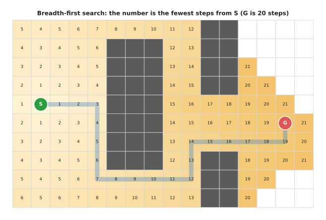
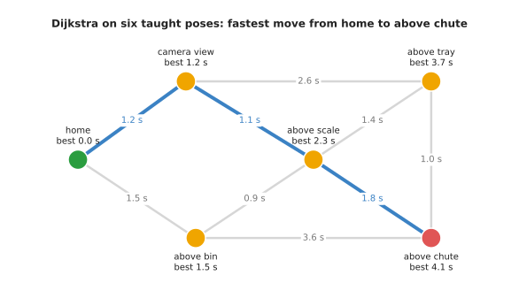
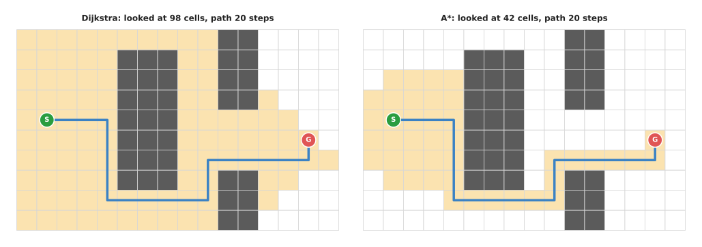
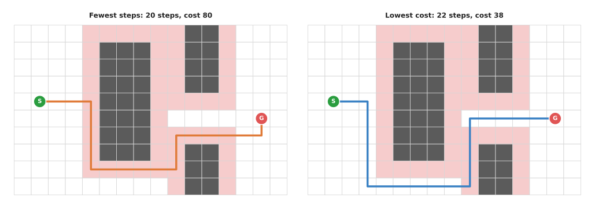
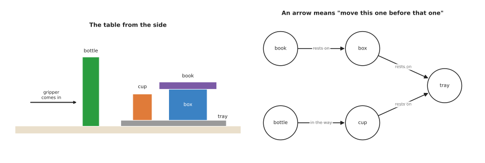
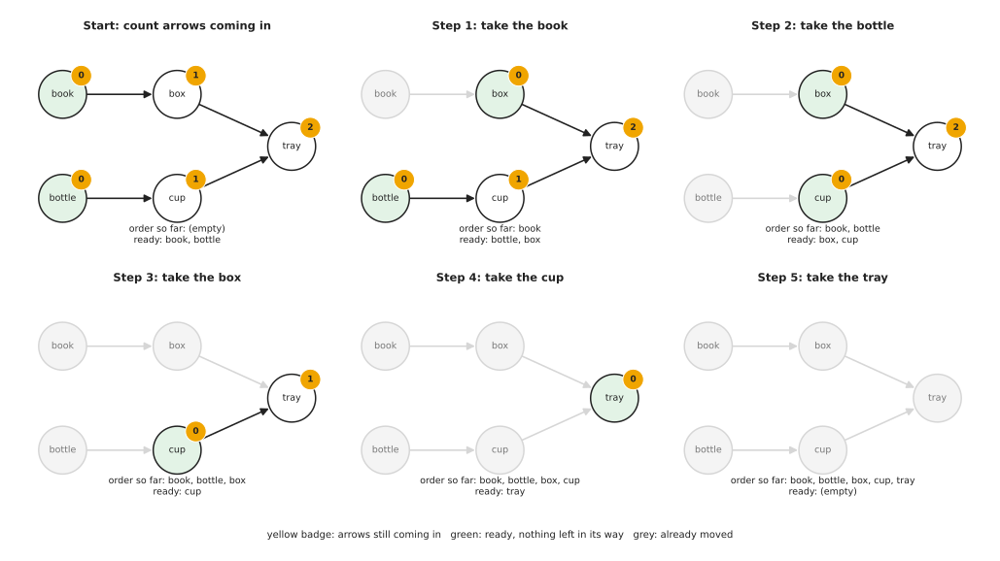
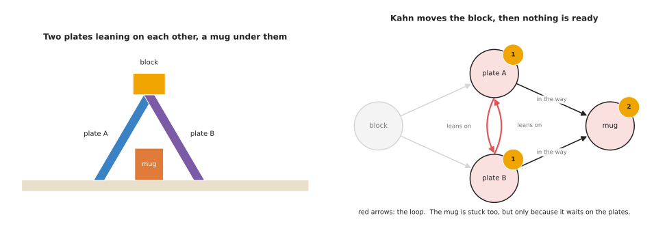

# Graph search

This page explains graph search, which means finding the shortest or cheapest
route through a set of places that are joined by moves. It covers the three
methods everyone uses: breadth-first search, Dijkstra's algorithm and A* (said "A
star"). The page answers four questions. How does each method work, and when is
each one the right choice? Where does a robot arm use them, and when should you
use something else instead? Section 8 then adds one more graph method that
answers a different question: in what order must things be done, when some must
come before others?

It is written for a reader who has read the
[chapter overview](../01_overview.md), and you do not need to have taken an
algorithms course. This is because every term is explained where it first
appears. Every number on this page also comes from a real run of the code in
[`planning_and_search_1.py`](../../../diagrams/planning_and_search_1.py).

Graph search also matters well beyond this page and beyond robot arms. For
example, the
[probabilistic roadmap](../02_most-used/01_sampling-based-planning.md#prm-build-a-map-once-then-ask-it-many-times)
on the next page uses it to answer every query, and a satellite navigation app
uses it every time it finds a route.

## Contents

1. [The idea in one sentence](#1-the-idea-in-one-sentence)
2. [Graphs and grids: the words](#2-graphs-and-grids-the-words)
3. [How it works](#3-how-it-works)
   · [Breadth-first search: fewest steps](#breadth-first-search-fewest-steps)
   · [Dijkstra's algorithm: lowest total cost](#dijkstras-algorithm-lowest-total-cost)
   · [A*: aim at the goal](#a-aim-at-the-goal)
   · [Costs that are not distance](#costs-that-are-not-distance)
   · [The pseudocode](#the-pseudocode)
4. [Where it is used on a robot arm](#4-where-it-is-used-on-a-robot-arm)
5. [Where it is useful, and where it is not](#5-where-it-is-useful-and-where-it-is-not)
6. [Libraries that provide it](#6-libraries-that-provide-it)
7. [Why graph search, and what it costs](#7-why-graph-search-and-what-it-costs)
8. [Doing things in the right order: topological sort](#8-doing-things-in-the-right-order-topological-sort)
9. [The learned alternative](#9-the-learned-alternative)
10. [Where to read next](#10-where-to-read-next)

---

## 1. The idea in one sentence

Graph search grows outwards from the start, one place at a time, always taking
next the place that is cheapest to reach so far, until it reaches the goal.

An everyday example shows how this works in ordinary life. You are in a large
building and want to reach a meeting room, but you do not know the way. So you
try every corridor one door at a time from where you stand. Each time you reach a
door, you write on a sticky note which door you came through. When you
finally reach the meeting room, you follow the notes backwards, and that gives
you the route. Breadth-first search works in exactly this way, one door at a
time. The other two methods then add one rule each. Dijkstra's algorithm counts how
long each corridor is, and A* also looks at a sign that says roughly which way
the meeting room is.

---

## 2. Graphs and grids: the words

The example above talks about places and moves, so this section gives those
things their proper names. A **graph** is a set of places joined by moves, where
the places are called **nodes** and a move between two nodes is called an
**edge**. Each edge can have a **cost**, which is a number that says how bad it
is to take that move. For example, the cost can be a distance, a time, or
anything else you want the route to keep low.

Two kinds of graph come up on a robot arm, and the rest of this page uses both
of them.

- A **grid** cuts a space into equal squares, called **cells**, and each free
  cell is a node joined by an edge to its neighbours. On this page a cell has
  four neighbours: up, down, left and right. A cell that holds an object is left
  out, so no route can pass through it.
- A **roadmap** is a small graph where each node is a pose the arm can be in, and
  each edge is a move between two poses that is known to be safe. A person can
  make a roadmap by teaching poses, or a program can make one by sampling, as the
  [next page](../02_most-used/01_sampling-based-planning.md) shows.

A **route**, also called a **path**, is a list of nodes where each one is joined
to the next by an edge. Its cost is the sum of the costs of its edges. The
search wants the path with the lowest cost of all the paths that reach the goal.

---

## 3. How it works

Now that the words are settled, here is how the three methods actually run, and
all three of them share one loop. They keep a list of nodes that they have
reached but not yet looked at, and this list is called the **open list**. On each
turn of the loop, they take one node off the list, look at its neighbours and add
the new ones. So the three methods differ only in which node they take off next.

The examples in this section all use one grid, which is a table seen from above,
cut into 5 cm squares, 16 across and 10 deep. The gripper moves at a fixed
height. So a square counts as occupied when something on the table is taller than
that height: a box, a tray of parts, and a bottle and a jar. Of the 160 squares,
35 are occupied and 125 are free. In every example the gripper starts at S and
must reach G.

### Breadth-first search: fewest steps

**Breadth-first search**, or BFS, takes nodes off the open list in the order they
were added, so the first node added is the first taken off. A list that works
this way is called a **queue**, like the queue at a shop counter.

This makes the search spread out in rings. It first reaches every cell one step
from S, then every cell two steps away, then three, and so on. So the first time
it reaches a cell, it has already found the fewest steps to that cell.

1. Put S on the queue. Write 0 steps next to it.
2. Take the first cell off the queue.
3. For each free neighbour that has no number yet, write the cell's number plus 1,
   remember which cell you came from, and add the neighbour to the back of the queue.
4. Repeat from step 2 until G comes off the queue.
5. Follow the "came from" notes backwards from G to S. That is the path.

The picture below is the real result of running that loop on the grid.



The number in each cell is its distance from S in steps, and the colour gets
darker as the number grows, so you can see the rings spread around the box. The
pale blue line is the path, which is 20 steps long, and every number along it is
one more than the one before. The white cells at the right were never reached,
because the search stopped as soon as G came off the queue. By then it had taken
98 cells off the queue and reached 106 in all.

Breadth-first search finds the fewest steps, but it does not know that some steps
may cost more than others. When every step costs the same that is all you need,
and the next method is what you reach for when it is not.

### Dijkstra's algorithm: lowest total cost

**Dijkstra's algorithm**, named after Edsger Dijkstra, who published it in 1959,
handles edges with different costs. It does this by always taking off the open
list the node with the lowest total cost found so far. A list that always gives
back its smallest item is called a **priority queue**.

When a node comes off the list its cost is final, and no later route to it can be
cheaper. This is because every other node on the list already costs at least as
much, and costs can only grow along a route. So Dijkstra's algorithm needs every
edge cost to be zero or more.

A worked example on a roadmap shows the loop running. A person has taught an arm
six poses. The picture below shows them, together with the time in seconds for
each move that is known to be safe. The arm is at "home" and must get to "above chute"
as fast as possible.



Each pose is labelled with its best time from home, and the blue route is the one
Dijkstra's algorithm returns.

The table below shows every turn of the loop, and you read it from top to bottom.
The "finalised" column is the pose taken off the list on that turn, and the
"updates" column says which neighbours got a new, lower time.

| Turn | Finalised | Its time | Updates to neighbours |
| --- | --- | --- | --- |
| 1 | home | 0.0 s | camera view 1.2 s, above bin 1.5 s |
| 2 | camera view | 1.2 s | above scale 1.2 + 1.1 = 2.3 s, above tray 1.2 + 2.6 = 3.8 s |
| 3 | above bin | 1.5 s | above chute 1.5 + 3.6 = 5.1 s; above scale via the bin would be 2.4 s, which is not better |
| 4 | above scale | 2.3 s | above tray 2.3 + 1.4 = 3.7 s, better than 3.8; above chute 2.3 + 1.8 = 4.1 s, better than 5.1 |
| 5 | above tray | 3.7 s | above chute via the tray would be 4.7 s, which is not better |
| 6 | above chute | 4.1 s | this is the goal, so stop |

The answer is home, camera view, above scale, above chute, in 4.1 seconds. The
route through the bin to the scale and on to the chute came close at 4.2 seconds.
Turn 4 is the one worth looking at, because the tray's time dropped from 3.8 to
3.7 seconds. This happened because a longer path in moves turned out to be a
shorter path in time. Breadth-first search would have missed it, since it counts
moves and not seconds.

### A*: aim at the goal

Dijkstra's algorithm spreads out evenly in every direction, because it has no
idea where the goal is, so it spends effort on cells behind the start. **A\***
fixes this with a guess about where the goal lies.

For each node, A\* adds two numbers: the cost from the start to the node, which
it knows, and a guess of the cost from the node to the goal. That guess is called
the **heuristic**. So A\* takes off the open list the node with the smallest
total of the two numbers, rather than the smallest cost so far.

On a grid with four neighbours, a good guess is the **Manhattan distance**: the
number of steps across plus the number of steps up or down, ignoring obstacles.
From S to G that is 13 across and 1 down, so the guess is 14 steps. However, the
real path is 20 steps, because it has to go round the box.

The guess must never be more than the real cost, and a guess with that property
is called **admissible**. With an admissible guess A\* still finds the
lowest-cost path. The Manhattan distance is admissible here, because an obstacle
can only ever make the real path longer than the guess.

The picture below runs both methods on the same grid, with every step costing 1.
The shaded cells are the ones each method took off its list.



Both methods find a 20-step path. Dijkstra's algorithm took 98 cells off its
list, the same as breadth-first search, because with equal costs the two behave
alike. A\* took off only 42, because the guess kept it heading towards G, and on
a larger grid that saving grows.

The count depends a little on how ties are broken, which is what the search does
when two cells have the same total. This code breaks ties by taking the cell with
the smaller guess first, which is a common choice.

### Costs that are not distance

The costs so far have been steps and seconds, but a cost can be anything at all
that the route should keep low. A common choice on an arm is **clearance**. This
means a route that passes right next to an object is still allowed, but it counts
as worse than one that keeps away from it.

In the picture below, a move into a pink cell costs 5 instead of 1. A pink cell
is a free cell that touches an occupied one, even at a corner.



On the left is the breadth-first path, which is 20 steps long, but 15 of its
cells are pink, so its cost is 15 × 5 + 5 × 1 = 80. On the right is Dijkstra's
path with the clearance cost, which is 22 steps long and costs only 38. This is
because only 4 of its cells are pink. Those 4 are where it has to pass through
the gap between the box and the tray. A\* with the same costs found a
path of the same cost, 38, and it took 72 cells off its list against 80 for
Dijkstra's algorithm.

The two extra steps buy a path that keeps 5 cm from everything nearly all the
way. This is the same trade Book 3 describes as padding in
[the planning scene](../../../03_frameworks/03_arm-movement/03_planning-a-path.md#71-the-default-clearance-is-zero),
except that it is done here as a cost instead of as a hard rule.

### The pseudocode

One piece of pseudocode covers all three methods, and the comments inside it say
what to change for each one.

```
function search(start, goal):
    cost_so_far[start] = 0
    came_from[start]   = nothing
    open = a list holding start

    while open is not empty:
        # BFS:      take the node that was added first
        # Dijkstra: take the node with the smallest cost_so_far
        # A*:       take the node with the smallest cost_so_far + guess(node, goal)
        current = take the chosen node off open
        if current was already finished:
            skip it and go round again
        mark current as finished
        if current is goal:
            return follow_back(came_from, goal)

        for each neighbour of current that is free:
            new_cost = cost_so_far[current] + move_cost(current, neighbour)
            if neighbour has no cost_so_far yet, or new_cost < cost_so_far[neighbour]:
                cost_so_far[neighbour] = new_cost
                came_from[neighbour]   = current
                put neighbour on open

    return "no path"

function follow_back(came_from, goal):
    path = [goal]
    while came_from[last node of path] is not nothing:
        add came_from[last node of path] to the end of path
    return path reversed
```

The line "skip it" matters for Dijkstra's algorithm and A\*. This is because a
node can be put on the open list more than once, each time with a lower cost.
Only the first copy to come off counts. So every later copy is thrown away.

---

## 4. Where it is used on a robot arm

The three methods above are general, so the useful question is where an arm
actually meets them. Graph search works best when the space has few dimensions or
when the graph is small, and these are the places it turns up around an arm.

- **Choosing a sequence of taught moves.** A cell with a handful of taught poses,
  like the worked example, can hold them as a roadmap, and Dijkstra's algorithm
  then finds the fastest sequence of known-safe moves between any two poses. The
  answer is the same every run, which matters in a cell that has to be signed
  off. The moves themselves are usually computed industrial motions, of the kind
  Book 3 describes in
  [computed industrial motion](../../../03_frameworks/03_arm-movement/03_planning-a-path.md#4-computed-industrial-motion-which-is-not-planning).
- **Answering a query on a probabilistic roadmap.** A PRM planner builds a graph
  of random free configurations, so to plan a move it joins the start and goal to
  that graph and runs Dijkstra's algorithm or A\*. The
  [sampling-based planning](../02_most-used/01_sampling-based-planning.md#prm-build-a-map-once-then-ask-it-many-times)
  page shows this on the two-joint arm.
- **Moving a tool across a table.** When a tool moves at a fixed height, for
  example a gripper pushing objects into a row, the table seen from above is a
  two-dimensional grid. A depth camera gives the height of each cell, so a cell
  counts as occupied when something in it is taller than the tool's height. A\*
  then finds the push path across the free cells.
- **Moving the gripper through a voxel grid.** A **voxel** is a cell in 3D, which
  is a small cube, and a depth camera's points can fill a voxel grid of a bin or
  shelf. A\* can then plan a route for the gripper's position through the free
  voxels. Inverse kinematics must afterwards find joint angles for each point.
  A separate check must then make sure the rest of the arm does not hit anything,
  because the search only looked at the gripper.
- **Moving a mobile base under an arm.** An arm on a wheeled base first needs the
  base to drive to the table, so base navigation plans on a flat grid of the
  floor, and Dijkstra's algorithm and A\* are the standard tools there.
- **Searching joint space for an arm with few joints.** For two or three joints
  the whole configuration space fits in a grid, as the
  [overview](../01_overview.md#2-where-the-search-happens-the-space-of-joint-angles)
  shows, and A\* then gives the shortest path on that grid and gives the same
  answer every time. Search-based planners also exist for more joints, because
  they replace the grid with a small set of fixed joint moves and rely on a
  strong heuristic.
- **Planning the order of a task.** Each state of a task, such as which blocks
  are where, can be a node, and each action an edge, so breadth-first search then
  finds the fewest actions from the start state to the goal state. The
  [decisions and task logic](../../08_decisions-and-task-logic/01_overview.md) chapter
  covers task-level choices. When the question is only which object must be moved
  before which, a much cheaper method answers it:
  [topological sort](#8-doing-things-in-the-right-order-topological-sort).

---

## 5. Where it is useful, and where it is not

Those uses all lean on one strength, which is that graph search is exact on the
graph you give it. If a path exists on that graph it finds it, and if none exists
it says so, which a random planner cannot do. So its weak points come from the
graph you built rather than from the search that runs on it.

The table below lists the common problems, and you read each row as a problem,
the sign you would see, and what people use instead.

| Problem | The sign you would see | What people do instead |
| --- | --- | --- |
| Too many cells: a grid over six joints at 10° steps has over two billion cells | the search runs out of memory, or takes minutes | a [sampling-based planner](../02_most-used/01_sampling-based-planning.md) |
| The grid is too coarse, so a narrow gap fills up | "no path", although the arm could clearly fit | a finer grid near the gap, or a sampler |
| Four-neighbour moves give a staircase path | the tool zig-zags where it should go diagonally | eight neighbours, "any-angle" search such as Theta\*, or a smoothing step |
| The map changes while the arm moves | the path runs through a place that is now blocked | search again each cycle, or an incremental method such as D\* Lite, which reuses the last search |
| The guess is poor, for example zero | A\* is no faster than Dijkstra's algorithm | a guess closer to the true cost |
| The guess is more than the true cost | A\* is fast but the path is not the shortest | keep the guess admissible, or accept the loss on purpose |
| The graph only checks the gripper | the gripper's route is free but the elbow hits the shelf | check the whole arm at each point, or plan in joint space |
| Negative costs | Dijkstra's algorithm returns a wrong answer | keep all costs zero or more; add a constant if needed |

The row about the guess being too large deserves one more sentence, because
making the guess too large on purpose has a name of its own. Multiplying an
admissible guess by a number above 1 is called **weighted A\***. This trades a
slightly longer path for a much faster search, which is often worth it. The point
is to make that trade knowingly rather than by accident.

---

## 6. Libraries that provide it

Because those weak points come from the graph rather than from the code, you
rarely need to write graph search yourself, though it is a good exercise. The
table below lists well-known libraries, and you read each row as one library, the
languages it serves, the names to look for, and a note.

| Library | Languages | Function or class | Note |
| --- | --- | --- | --- |
| NetworkX | Python | `networkx.shortest_path`, `networkx.dijkstra_path`, `networkx.astar_path`, `networkx.bfs_edges` | easiest to start with; slow on very large grids |
| SciPy | Python | `scipy.sparse.csgraph.dijkstra`, `scipy.sparse.csgraph.shortest_path`, `scipy.sparse.csgraph.breadth_first_order` | works on a sparse matrix of edge costs; fast |
| scikit-image | Python | `skimage.graph.route_through_array`, `skimage.graph.MCP` | cheapest path directly on an image or cost grid |
| Boost Graph Library | C++ | `boost::breadth_first_search`, `boost::dijkstra_shortest_paths`, `boost::astar_search` | the standard C++ choice |
| OMPL | C++, Python | the `PRM` planner family | runs a graph search on its roadmap for every query |
| Nav2 | C++ (ROS 2) | the NavFn and Smac planner plugins | grid planners for a mobile base, not for the arm's joints |

---

## 7. Why graph search, and what it costs

With the methods, the uses and the libraries covered, this section answers the
four questions for graph search. What is it, what does it do for you, why choose
it rather than the obvious alternative, and what does it cost you?

Graph search is a loop that grows out from the start, taking the cheapest node
next, until it reaches the goal. It gives you the best route on the graph you
built, and it gives the same route every run. It also tells you for certain when
no route at all exists on that graph.

The obvious alternative for an arm is a
[sampling-based planner](../02_most-used/01_sampling-based-planning.md), which is
what MoveIt uses by default. A sampler copes with six or seven joints where a
grid is hopeless. However, a sampler gives a different path each run, and the
path has detours. When it fails it also cannot tell you whether no path exists or
it simply ran out of time. So choose graph search when the space is small enough
to cut into cells, or when you already have a small roadmap of safe moves. Choose
a sampler instead when the arm has many joints and the space is too big to cover.

A second alternative is to teach every path by hand, which is deterministic too,
meaning it gives the same answer every run. However, a taught path does not adapt
when an object moves. Graph search on a roadmap of taught poses keeps most of that
determinism and still chooses the route at run time.

Against those strengths stand three costs. First, you must build the graph
yourself, which means choosing the cell size, filling in which cells are
occupied, and deciding what each move costs. Second, a small cell size gives a
better path but uses more memory and more time. The number of cells also grows
very fast with the number of dimensions. This is the reason samplers exist.
Third, the path on a grid is only as smooth as the grid itself, so it usually
needs a smoothing step before an arm follows it.

---

## 8. Doing things in the right order: topological sort

The searches above find a route from a start to a goal. However, some robot
problems ask a different question about a graph: **in what order must these jobs
be done, when some jobs must come before others?**

Clearing a cluttered table is the usual example on an arm. A book lying on a box
must come off before the box can be lifted, and a bottle standing in front of a
cup must be moved before the gripper can reach the cup.

The answer is called a **topological sort**, which is a list of all the nodes in
which every arrow points forwards. This means each job comes after every job it
depends on. Book 3's
[ordering and rearrangement](../../../03_frameworks/03_arm-movement/07_ordering-and-rearrangement.md)
page builds these graphs from a real scene and measures how often simple rules of
thumb get the order wrong, while this section is about the algorithm itself.

### Dependencies as a graph

To run that algorithm you first need the graph, and on a table each object is a
node. An arrow from u to v means "u must be moved before v", and on a table such
an arrow comes from one of two facts.

- u **rests on** v, so lifting v first would drop u, or spill it.
- u is **in the way** of v, so the gripper cannot reach v while u stands in its
  path.

A graph whose edges have a direction, like these arrows, is called a **directed
graph**. The picture below shows a small table and its graph, with the gripper
coming in from the left.



There are four arrows in it. The book rests on the box, the box and the cup rest
on the tray, and the bottle is in the way of the cup. However, nothing says
whether the book or the bottle should go first, so either order is fine for those
two.

### Kahn's algorithm

With the graph drawn, the standard way to read an order out of it is **Kahn's
algorithm**, published by Arthur Kahn in 1962. It works by counting, so for each
node you count the arrows coming into it, and that count is called its
**in-degree**. A node with an in-degree of 0 has nothing left that must come
before it, so it is **ready**.

1. Count the arrows coming into every node.
2. Put every node with a count of 0 on a list of ready nodes.
3. Take one node off the ready list, and add it to the order.
4. For each arrow going out of that node, take 1 off the count of the node it points
   to. If a count reaches 0, put that node on the ready list.
5. Repeat from step 3 until the ready list is empty.
6. If every node is in the order, the order is the answer. If some nodes are left
   out, there is no valid order. Those nodes are waiting on each other.

The picture below runs it on the table above, and the yellow badge on each node
is its count of arrows still coming in.



The table below lists the same run with one row per step, and you read the
"counts after" column as the in-degrees of the nodes not yet moved.

| Step | Take | Counts after | Ready list after |
| --- | --- | --- | --- |
| start | nothing | tray 2, box 1, cup 1, book 0, bottle 0 | book, bottle |
| 1 | book | tray 2, box 0, cup 1, bottle 0 | bottle, box |
| 2 | bottle | tray 2, box 0, cup 0 | box, cup |
| 3 | box | tray 1, cup 0 | cup |
| 4 | cup | tray 0 | tray |
| 5 | tray | none left | empty |

The order is book, bottle, box, cup, tray, and every arrow points forwards in
that list, so every "before" is kept.

The ready list often holds more than one node, and at the start the book and the
bottle were both ready. Which one you take does not change whether the algorithm
succeeds, because it only changes which valid order you get. So a robot can spend
that free choice on something else, such as taking the nearest ready object to
save travel. Book 3's
[topological sort, in plain terms](../../../03_frameworks/03_arm-movement/07_ordering-and-rearrangement.md#22-topological-sort-in-plain-terms)
makes the same point.

The work grows with the number of nodes plus the number of arrows, so for five
objects and four arrows that is nine small steps. Trying every order instead
would mean up to 5 × 4 × 3 × 2 × 1 = 120 orders, and for 12 objects it would be
nearly 480 million.

### Detecting a cycle

Step 6 above allows for nodes that are left over at the end, and the reason they
are left over is always the same. A **cycle**, or loop, is a chain of arrows that
comes back to where it started. If the graph has one then no valid order exists.
This is because every node on the loop must come after another node on the loop,
so none of them can go first.

Kahn's algorithm finds this without any extra work, because it simply runs out of
ready nodes while some nodes are still left. The picture below shows the classic
case on a table: two plates leaning against each other, with a block resting on
top of both and a mug underneath.



Each plate leans on the other, so each must be moved before the other, which is a
loop of two arrows. The block rests on both plates, and both plates are in the
way of the mug. So at the start the counts are block 0, plate A 2, plate B 2 and
mug 2. Kahn's algorithm takes the block, and after that the counts drop to plate
A 1, plate B 1 and mug 2. Then the ready list is empty and three nodes are left.

Not all of the left-over nodes are on the loop, because the mug is stuck only
while it waits on the plates. To find the loop itself, start at any left-over
node and keep stepping backwards along an arrow to another left-over node.
Starting at the mug you step back to plate A, then back to plate B, then back to
plate A, which has been visited already. So the loop is plate A and plate B.

Knowing the loop tells the robot what to do, because no order of simple picks can
clear this table. Instead, the robot needs a different kind of action for the
plates, such as holding one while lifting the other, or sliding one flat first.
Book 3's
[scene that has no valid order](../../../03_frameworks/03_arm-movement/07_ordering-and-rearrangement.md#24-a-scene-that-has-no-valid-order)
works through the choices.

### The pseudocode

```
function topological_sort(nodes, arrows):
    count = for each node, the number of arrows coming into it
    ready = every node whose count is 0
    order = empty list
    while ready is not empty:
        n = take one node off ready        # any rule: nearest, first added, ...
        add n to the end of order
        for each arrow from n to m:
            count[m] = count[m] - 1
            if count[m] is 0:
                add m to ready
    if order holds every node:
        return order
    left = the nodes not in order
    return "no order", find_loop(left)

function find_loop(left):
    walk = [any node in left]
    while the last node of walk has not appeared earlier in walk:
        add to walk one node in left with an arrow into the last node
    return the part of walk from the first copy of its last node to the end
```

The step in `find_loop` always finds a next node. This is because every node left
over still has a count above 0, so it still has an arrow coming in from another
left-over node.

### Where it is used on a robot arm

Topological sort turns up wherever an arm must do several things in an order that
the scene itself decides rather than the programmer.

- **Clearing a table or a bin.** The arrows come from "rests on" and "in the
  way", as above, so the order the sort returns is the picking order.
- **Building a stack or an assembly.** The same graph read backwards gives the
  building order, so the tray goes down first and the book goes on last.
- **Taking apart a kit or a product.** Screws come out before the cover, and the
  cover before the board, and each of those facts is an arrow.
- **Ordering the steps of a task.** Open the drawer before reaching into it, and
  close the gripper before lifting, so a task planner can check a list of steps
  this way before running it.
- **Building a robot's software.** colcon, the ROS 2 build tool, builds each
  package after the packages it depends on, and it works out that order the same
  way.

### Where it is useful, and where it is not

Topological sort is exact and fast, so it fails only when the graph is wrong or
when order is not the whole problem. The table below lists the common problems,
and you read each row as a problem, the sign you would see, and what people do
instead.

| Problem | The sign you would see | What people do instead |
| --- | --- | --- |
| An arrow is missing, for example a hidden support | the order is "valid" but an object falls or the gripper collides | build arrows from a conservative test, with a margin round each gripper path |
| The graph has a loop | the algorithm stops with objects left over | find the loop and use a different action: hold, push, or two arms |
| Moving one object changes the others | the order was valid for the scene before the first pick, not after | look again after each pick and rebuild the graph |
| Objects must go to places that are themselves occupied | there is no loop, yet no order of picks works | treat it as rearrangement, with [buffer space](../../../03_frameworks/03_arm-movement/07_ordering-and-rearrangement.md#5-buffer-space), as Book 3 describes |
| Several valid orders differ greatly in travel | the order is correct but slow | break ties by distance, or search over the valid orders for the shortest |

### Libraries

You do not have to write any of this yourself, because Python's standard library
already has it and there is nothing to install.
`graphlib.TopologicalSorter` takes a map from each node to the nodes it depends
on and returns an order. It raises `graphlib.CycleError` when there is no valid
order, and the error carries the loop it found. NetworkX provides
`networkx.topological_sort`, `networkx.is_directed_acyclic_graph` and
`networkx.find_cycle`. In C++, the Boost Graph Library provides
`boost::topological_sort`, which reports a loop by throwing `boost::not_a_dag`.

The obvious alternative is to try orders until one works, or to use a simple rule
such as "take the nearest object first". Trying orders costs a factorial number
of tries. A simple rule costs nothing, but it can give an order that drops an
object, and it cannot tell you when no order exists. Topological sort costs only
the work of building the arrows, and in return it gives a valid order whenever
one exists, or proves that none does.

---

## 9. The learned alternative

Everything above is written by hand, so the last question is what a learned model
would do in its place. A learned route planner, described in Book 6's
[learned motion planners](../../../06_learned-models/06_movement-models/03_also-used/02_learned-motion-planners.md),
guesses a route for the arm directly from a point cloud, in about the same time
every run. It is built for large joint spaces where a grid is hopeless. However, in the
small spaces and roadmaps this page is for, graph search is already fast. Graph
search also gives what no network gives: the best route on its graph, the same
route every run, and a certain "no route" when there is none. This is why a
learned planner's answer is still checked by an ordinary planner. For the order
of a task, a
[language model as planner](../../../06_learned-models/07_language-models/03_also-used/01_language-models-as-planners.md)
chooses the steps from a request in plain words, which suits requests that change
every day. For a task that stays the same, a search or a topological sort is free
and fast, and it gives the same valid order every time.

---

## 10. Where to read next

- The next page is [sampling-based planning](../02_most-used/01_sampling-based-planning.md),
  which covers the planners that take over when the grid becomes too large.
- [Trajectory optimisation](../02_most-used/03_trajectory-optimisation.md) smooths a staircase grid
  path into one the arm can follow well.
- [Nearest-neighbour search](../../03_searching-and-matching/02_most-used/01_nearest-neighbour-search.md)
  is the other search every planner leans on.
- [Greedy algorithms and set cover](../../08_decisions-and-task-logic/03_also-used/01_greedy-algorithms-and-set-cover.md)
  shows the opposite approach: take the best-looking step and never look back.
- Book 3's [planning a path](../../../03_frameworks/03_arm-movement/03_planning-a-path.md)
  covers planning in practice with MoveIt.
- Book 3's [ordering and rearrangement](../../../03_frameworks/03_arm-movement/07_ordering-and-rearrangement.md)
  builds the "what must move first" graph of section 8 from a real scene.
