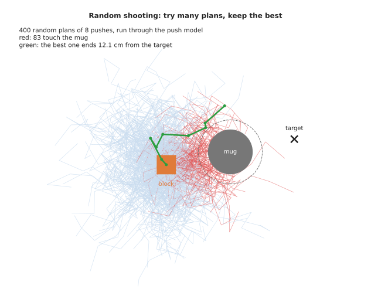
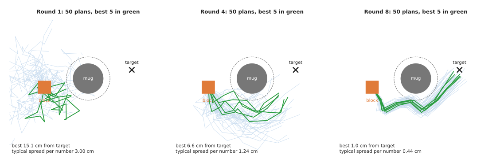
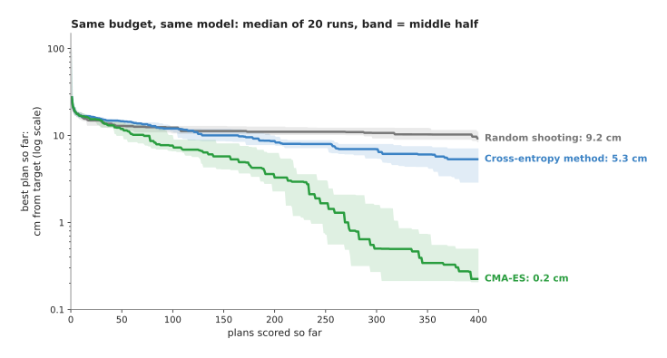
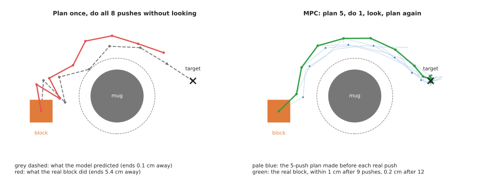
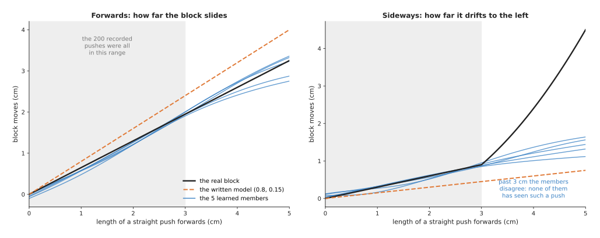
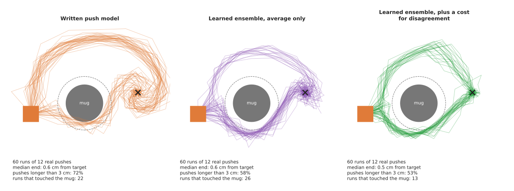

# Sampling-based optimisation and model predictive control

This page explains how to choose the best plan when you can score a plan but
cannot take a gradient of the score. It covers three methods: random shooting,
the cross-entropy method (CEM) and CMA-ES. It then covers model predictive
control (MPC), which runs one of these methods again and again while the arm
moves. It answers four questions. How does each method work? How do they compare
on the same problem? Where does a robot arm use them? And when should you use
something else?

It is for a reader who has read the [chapter overview](../01_overview.md) and
[trajectory optimisation](../02_most-used/03_trajectory-optimisation.md). That
page improves a path by following the **gradient**: the direction in which the
cost goes down fastest. This page is about what to do when there is no gradient
to follow. Every number and picture on this page comes from a real run of
[`planning_and_search_4.py`](../../../diagrams/planning_and_search_4.py).

## Contents

1. [The idea in one sentence](#1-the-idea-in-one-sentence)
2. [The example: pushing a block past a mug](#2-the-example-pushing-a-block-past-a-mug)
3. [How it works](#3-how-it-works)
   · [Random shooting: try many plans, keep the best](#random-shooting-try-many-plans-keep-the-best)
   · [The cross-entropy method: narrow the search](#the-cross-entropy-method-narrow-the-search)
   · [CMA-ES: also learn the shape of the search](#cma-es-also-learn-the-shape-of-the-search)
   · [The three on the same budget](#the-three-on-the-same-budget)
   · [Model predictive control: plan, do one step, look again](#model-predictive-control-plan-do-one-step-look-again)
   · [The pseudocode](#the-pseudocode)
   · [A learned model inside MPC](#a-learned-model-inside-mpc)
4. [Where it is used on a robot arm](#4-where-it-is-used-on-a-robot-arm)
5. [Where it is useful, and where it is not](#5-where-it-is-useful-and-where-it-is-not)
6. [Libraries that provide it](#6-libraries-that-provide-it)
7. [Why sampling, and what it costs](#7-why-sampling-and-what-it-costs)
8. [The learned alternative](#8-the-learned-alternative)
9. [Where to read next](#9-where-to-read-next)

---

## 1. The idea in one sentence

Sampling-based optimisation makes up many candidate plans, scores each one by
simulating it, and uses the best-scoring ones to decide where to look next.

Here is an everyday example. You are adjusting the shower. You cannot see a
formula for the water temperature. You can only turn the tap and feel the result.
So you try a few positions, notice which ones felt best, and try a few more
positions close to those. After a few rounds, the water is right. You never
worked out which way the temperature changes with the tap. You only compared
results. Sampling-based optimisation does the same, with a computer model in
place of your hand under the water.

---

## 2. The example: pushing a block past a mug

The example on this page is a pushing task, seen from above. A block 3 cm across
starts at (0, 0) cm. The target is (20, 4) cm. A mug stands at (10, 2) cm, right
on the straight line between them. The mug is 3.5 cm in radius, so the middle of
the block must stay more than 5 cm from the middle of the mug. The dashed circle
in the pictures shows that limit.

The arm does not grip the block. It pushes it. One **action** is one push: the
pusher moves by some distance to the side and some distance forwards, at most
5 cm in total. A **plan** is a list of 8 pushes. So a plan is 16 numbers.

To score a plan, the program needs a **push model**: a rule that says where the
block ends up after a push. The model on this page is simple on purpose.

- The block slides 0.8 times as far as the pusher moves, because it slips.
- It also drifts to the left by 0.15 times the push length, because the pusher
  meets it a little off centre.

The **score** of a plan is the distance from the block's final position to the
target, plus 100 if the block touches the mug on the way. Lower is better.

This score has no useful gradient. The "plus 100" jumps from 0 to 100 the moment
the block touches the mug. A gradient tells you what a tiny change does, and a
tiny change either does nothing to that part of the score or makes it jump. The
same is true of many scores on a robot: "did the grasp hold", "did the camera see
the part", or a score that comes from a physics simulator. Book 3's
[pushing and sliding](../../../03_frameworks/02_gripping/09_pushing-and-sliding.md)
explains why real pushing is hard to write as a formula at all.

---

## 3. How it works

### Random shooting: try many plans, keep the best

**Random shooting** is the simplest method. The name comes from firing many
random shots and keeping the one that lands nearest the target.

1. Make up many random plans. Here each push is picked at random, up to 5 cm in
   any direction.
2. Run each plan through the push model, and work out its score.
3. Keep the plan with the lowest score.



The picture shows one real run with 400 random plans. Most of them wander
around the start, because random pushes cancel each other out. 83 of them touch
the mug. The best plan, in green, ends 12.1 cm from the target.

Random shooting is poor here because the plan has 16 numbers. For a good plan,
most of the 16 must be right at the same time, and random guessing almost never
does that. With 2 or 3 numbers, random shooting works well.

### The cross-entropy method: narrow the search

The **cross-entropy method**, or **CEM**, repeats random shooting, but each round
it moves the search towards the best plans of the round before. The name comes
from statistics, and you do not need it to use the method.

It describes where to search with two lists of numbers. The **mean** is the
middle of the search: one value for each of the 16 numbers of a plan. The
**spread** says how far from the mean to look, again one value for each number.

1. Start with a mean of zero pushes and a spread of 3 cm.
2. Make 50 plans by adding random amounts to the mean, scaled by the spread.
3. Score all 50, and keep the best 5. These are called the **elites**.
4. Set the new mean to the average of the 5 elites. Set the new spread to how
   much the 5 elites differ from each other.
5. Go back to step 2. Stop after a set number of rounds.



Here are the real numbers from that run. Read each line as one round of 50 plans.

| Round | Best plan, cm from target | Middle plan, cm from target | Spread, cm |
| --- | --- | --- | --- |
| 1 | 15.1 | 25.9 | 3.00 |
| 2 | 10.5 | 21.2 | 2.13 |
| 3 | 8.5 | 16.0 | 1.59 |
| 4 | 6.6 | 11.9 | 1.24 |
| 5 | 4.3 | 8.4 | 0.95 |
| 6 | 2.5 | 5.8 | 0.77 |
| 7 | 1.8 | 4.4 | 0.62 |
| 8 | 1.0 | 3.0 | 0.44 |

The spread shrinks every round. That is how CEM focuses. It is also its weakness.
If the spread shrinks before the mean has reached a good place, the search stops
moving. On this run it got to 1.0 cm. On other runs it stopped further away, as
the comparison below shows.

### CMA-ES: also learn the shape of the search

**CMA-ES** stands for covariance matrix adaptation evolution strategy. It keeps a
mean and a spread, like CEM, and adds two things.

- It learns which numbers should change **together**. In a push plan, pushes 3
  and 4 often need to turn left together. CEM gives each number its own spread,
  so it cannot say that. CMA-ES keeps a table, called the **covariance matrix**,
  that says how each pair of numbers should move together. The search cloud can
  then stretch along a slanted direction instead of only along the axes.
- It keeps a separate **step size**. If the last few rounds all moved the mean
  the same way, the step size grows, so the search moves faster. If the moves
  were back and forth, the step size shrinks. This stops the search from freezing
  too early, which is CEM's weakness.

The maths behind these updates is longer than the idea. You use it from a
library, as section 6 shows. The script uses the standard settings. For a plan of
16 numbers, that means 12 plans per round.

### The three on the same budget

The fair way to compare the methods is to give each one the same number of plan
scores. Here each method scored 400 plans, and each ran 20 times with different
random seeds. A **seed** is the number that starts a random number generator, so
each seed gives a different run.



The table gives the same result as numbers. Read each row as one method, with
the distance from the target of its best plan.

| Method | Median after 100 plans | Median after 400 plans | Best run | Worst run |
| --- | --- | --- | --- | --- |
| Random shooting | 12.3 cm | 9.2 cm | 7.0 cm | 12.8 cm |
| Cross-entropy method | 12.0 cm | 5.3 cm | 1.0 cm | 9.8 cm |
| CMA-ES | 7.7 cm | 0.2 cm | 0.05 cm | 3.7 cm |

On this problem CMA-ES is clearly best. CEM beats random shooting, but it often
narrows too early. This matches common practice. CEM is popular because it is ten
lines of code and it works well on short plans with a good starting guess, which
is the situation inside MPC below. CMA-ES is the usual choice for a longer
one-off search, such as tuning a set of gains.

### Model predictive control: plan, do one step, look again

A plan is only as good as the model it was scored with. The real block is never
exactly like the model. To show this, the script uses a "real" block that slides
only 0.65 times as far as the pusher and drifts 0.30 times the push to the left.
The planner does not know this. It still uses the model's 0.8 and 0.15.

**Model predictive control**, or **MPC**, deals with this by re-planning all the
time.

1. Look at where the block really is now.
2. Plan a short sequence of pushes from there with the model. Here the plan is 5
   pushes, found by CEM.
3. Do only the first push of the plan. Throw the rest away.
4. Go back to step 1.

The short plan is called the **horizon**. Each new plan starts from the last plan,
shifted by one push, so it starts close to a good answer. This is called a
**warm start**, and it is why CEM is enough inside MPC.



The left panel plans all 8 pushes once, with CMA-ES. In the model, the plan ends
0.07 cm from the target, the grey dashed line. The real block, in red, slides
less and drifts more. It ends 5.4 cm from the target. Nothing corrected it,
because nothing looked.

The right panel is MPC. The pale blue lines are the 5-push plans made before each
real push. The green line is the real block. Its distance to the target after
each push was 17.8, 17.1, 15.6, 12.8, 9.7, 6.2, 2.9, 1.1 and then 0.3 cm, and it
stayed within 0.7 cm for the last three pushes. The model was wrong every time,
but each error was small and was corrected at the next look.

MPC for the block uses a slightly different score from the one-off plan. It adds
up the distance to the target after every push, not only the last one, so the
block gets there soon and then stays. It also adds a cost for coming within
1.5 cm of the mug's limit. That margin is there because the model is not exact.
Without it, a plan that passes the mug by a millimetre in the model can touch it
in reality.

This is the same MPC that Book 3's
[controlling the move](../../../03_frameworks/03_arm-movement/04_controlling-the-move.md#7-model-predictive-control)
describes: solve a short optimisation from where you are now, do the first
command, throw the rest away, and solve again. Book 3 also lists the solvers that
use gradients, such as acados and Crocoddyl. This page is the version for scores
without a gradient.

### The pseudocode

Here is CEM and the MPC loop around it.

```
function cem(state_now, mean, horizon, n_plans, n_elites, rounds):
    spread = starting spread, one value per number in a plan
    for round in 1 .. rounds:
        for k in 1 .. n_plans:
            plan[k]  = mean + spread * random normal numbers
            plan[k]  = clip each push to what the arm can do
            score[k] = score_by_simulating(state_now, plan[k], model)
        elites = the n_elites plans with the lowest scores
        mean   = average of elites
        spread = how much the elites differ from each other
    return the best plan seen

function mpc(model):
    mean = zero pushes for the whole horizon
    loop until the task is done:
        state = measure the real world now
        plan  = cem(state, mean, horizon, ...)
        do only plan's first push on the real arm
        mean  = plan without its first push, with a zero push added at the end
```

Random shooting is `cem` with one round and a very wide spread. CMA-ES replaces
the two update lines with its own updates for the mean, the covariance matrix and
the step size.

### A learned model inside MPC

The MPC above scored its plans with a push model written by hand: the block
slides 0.8 times as far as the pusher and drifts 0.15 times to the left.
Sometimes nobody can write such a model. Then the model can be learned from
records of the arm pushing the block. The planner does not change at all. CEM,
the horizon of 5 pushes, the warm start, the score and "do only the first push"
all stay the same. Only the prediction step, the call to the push model inside
`score_by_simulating`, is replaced. Book 6's
[learned dynamics models](../../../06_learned-models/08_world-models/02_most-used/01_learned-dynamics-models.md)
page explains how such a model is built and trained.

A single learned model has a danger that a written one does not. The planner
searches for the plan with the best predicted score. Where the model has seen no
records, its predictions are guesses, and the planner is drawn to any guess that
looks good. So the usual choice is an **ensemble**: several copies of the network,
each trained from different random starting numbers on its own resampled copy of
the records. Where the records are dense, the copies agree. Where there are none,
they disagree. The planner uses the copies' average as the prediction, and adds a
cost for how far apart they end up. This keeps the plans where the model knows
what happens. Only the scoring line of the pseudocode changes:

```
for each copy m of the ensemble:
    path[m] = roll plan[k] forward from state_now through copy m
middle   = the average of the paths
spread   = how far the paths are from middle, added up over the horizon
score[k] = score_of_path(middle) + weight * spread
```

The example runs in [`making_models_work.py`](../../../diagrams/making_models_work.py).
Its "real" block differs from the one above in two ways. Every push has 0.15 cm
of random scatter. And a push longer than 3 cm starts to turn the block, so it
drifts a further 0.3 cm for every centimetre beyond 3 cm. The arm records 200
random pushes, each at most 3 cm long. Five small networks, each with 16 hidden
neurons, learn from them. Each copy's average training error is about 0.18 cm,
which is about the size of the scatter.



Up to 3 cm, the five copies sit on the real block's line, and they are closer to
it than the written model is. At 3 cm they end 0.05 cm apart on average. Beyond
3 cm, where there are no records, they spread to 0.17 cm apart at 4 cm and 0.30 cm
at 5 cm. None of them knows about the extra drift. The spread is the only warning
the planner gets.

Each version of MPC then ran 60 times on the real block, with 12 pushes per run.
Read each row of the table as one prediction step inside the same planner.

| Prediction step | Median distance from target at the end | Runs ending within 1 cm | Runs that touched the mug | Pushes longer than 3 cm |
| --- | --- | --- | --- | --- |
| Written push model | 0.6 cm | 51 of 60 | 22 of 60 | 72% |
| Learned ensemble, average only | 0.6 cm | 50 of 60 | 26 of 60 | 58% |
| Learned ensemble, plus a cost of 0.5 per cm of spread | 0.5 cm | 55 of 60 | 13 of 60 | 53% |



The learned model on its own was no better than the written one. It was accurate
where it had records, but the planner still chose long pushes, where it was
guessing. With the cost for disagreement, the planner chose fewer long pushes, and
the runs that touched the mug fell from 26 to 13 of 60. Sixty runs is only just
enough to show this. The 95% confidence intervals are 30.6% to 56.8% and 12.1% to
34.2%, which barely overlap. Book 6's
[evaluation and failure](../../../06_learned-models/10_making-models-work-on-an-arm/02_most-used/03_evaluation-and-failure.md#3-counting-successes-and-how-sure-the-count-is)
page explains these intervals.

The weight on the spread is a setting to choose. Too much makes the planner timid.
With a weight of 2 instead of 0.5, only 4 of 60 runs touched the mug, but only 4
of 60 ended within 1 cm, and the median run ended 3.9 cm short. The planner
refused the long pushes it needed. PETS, described on the Book 6 page, is the
standard published version of this method, and mbrl-lib in
[section 6](#6-libraries-that-provide-it) provides it.

---

## 4. Where it is used on a robot arm

Sampling-based optimisation is used wherever a program can simulate a plan but
cannot differentiate the result. Here are concrete places.

- **Pushing and sliding objects.** Pushing a mug out of the way before a grasp,
  or sliding a box against a wall. The contact is hard to model with a clean
  formula, so a sampled plan through a rough model, corrected by MPC, is common.
- **MPC with a learned model.** Book 6's
  [learned dynamics models](../../../06_learned-models/08_world-models/02_most-used/01_learned-dynamics-models.md#planning-with-it)
  plan with CEM and MPC through a neural network. The network has a gradient,
  but it is often unreliable, and CEM only needs the network's predictions.
  PETS, listed on that page, is the standard example.
- **Tuning controller gains.** The gains of a
  [PID controller](../../07_control-and-motion/02_most-used/01_pid-control.md#tuning-the-three-gains)
  can be scored by running a test move and measuring the overshoot and the
  settling time. CMA-ES can tune a handful of gains this way, in simulation or on
  the real arm.
- **Choosing a grasp.** Book 6's
  [grasp quality models](../../../06_learned-models/05_grasp-models/03_also-used/02_grasp-quality-models.md#where-the-candidates-come-from)
  use CEM to refine grasp candidates towards the ones the model scores highest.
- **Paths with costs that have no gradient.** STOMP, on the
  [trajectory optimisation](../02_most-used/03_trajectory-optimisation.md#3-chomp-stomp-and-trajopt)
  page, is sampling-based optimisation applied to a whole path. MPPI, model
  predictive path integral control, is the same weighted-average idea used
  inside MPC.
- **Fitting a model to measurements.** When a simulator has unknown settings,
  such as friction, CMA-ES can choose the settings that make the simulator match
  recorded data. This is one approach to
  [system identification](../../04_fitting-and-estimation/03_also-used/01_system-identification.md).

---

## 5. Where it is useful, and where it is not

These methods need only one thing: a way to score a plan. That makes them easy to
apply. It also means they know nothing about the problem beyond the scores they
see.

The table below lists the common problems. Read each row as a problem, the sign
you would see, and what people do instead.

| Problem | The sign you would see | What people do instead |
| --- | --- | --- |
| Too many numbers in a plan | scores stop improving; plans look random | a shorter horizon, fewer numbers per push, or a gradient method |
| CEM narrows too early | every run stops at a different, mediocre plan | more plans per round, a minimum spread, or CMA-ES |
| Scoring is slow | each plan takes seconds, so a search takes hours | run many plans at once on a graphics card, or a cheaper model |
| The model is wrong | the plan looks perfect in simulation and fails on the arm | MPC, which re-plans from the real state; a margin around obstacles |
| MPC too slow for the control rate | the arm waits between pushes, or jerks | fewer plans, warm starts, or MPC only for the slow outer loop |
| A score with a smooth, known gradient | sampling takes far more evaluations than needed | [trajectory optimisation](../02_most-used/03_trajectory-optimisation.md) or a solver |
| A hard safety limit | sometimes a plan breaks the limit | a separate safety check, as Book 3 says MPC cannot replace a safety stop |

The last row matters. A sampled plan satisfies a rule only as far as its score
punishes breaking it, and only in the model. Anything that must never happen
needs its own check outside the optimiser.

---

## 6. Libraries that provide it

CEM is short enough that most people write it themselves, as the pseudocode
shows. CMA-ES is longer, and a library is the safer choice. The table below lists
well-known ones. Read each row as one library, the languages it serves, the names
to look for, and a note.

| Library | Languages | Function or class | Note |
| --- | --- | --- | --- |
| pycma | Python | `cma.CMAEvolutionStrategy`, `cma.fmin` | the reference CMA-ES, by its author |
| Optuna | Python | `optuna.samplers.CmaEsSampler` | CMA-ES inside a tuning framework; handy for gains |
| Nevergrad | Python | the `CMA` optimiser and many others | a collection of gradient-free optimisers |
| MuJoCo MPC | C++ | the Predictive Sampling planner, among others | MPC in the MuJoCo simulator; Book 3 recommends it for building intuition |
| pytorch_mppi | Python | `MPPI` | sampling MPC on a graphics card, with any model you give it |
| mbrl-lib | Python | `CEMOptimizer` | CEM and MPC for learned dynamics models, in the PETS style |

For a first try, write CEM in NumPy around your own model and score. Move to
pycma when the plan has more than a handful of numbers and CEM stops improving.

---

## 7. Why sampling, and what it costs

This section answers the four questions for sampling-based optimisation: what it
is, what it does for you, why it rather than the obvious alternative, and what it
costs.

It is a family of methods that choose a plan by scoring many candidate plans in a
model and moving the search towards the best ones. MPC wraps it in a loop that
re-plans from the real state after every step. Together they let an arm act well
with only a rough model and a score, even when the score jumps, as when a block
touches a mug.

The obvious alternative is a gradient method, such as the
[trajectory optimiser](../02_most-used/03_trajectory-optimisation.md) of this
chapter. When a smooth gradient exists, a gradient method needs far fewer
evaluations, and it scales to hundreds of numbers. But it cannot use a score that
jumps, a simulator it cannot look inside, or a learned model whose gradient is
unreliable. Sampling can. Choose sampling when the score has no useful gradient
and the plan has tens of numbers, not thousands. Choose a gradient method when
the cost is smooth and you can write it down.

The second alternative is to plan once and carry the plan out. That is cheaper,
but the left panel of the MPC picture shows what happens: a plan that was perfect
in the model missed by 5.4 cm on the real block. MPC costs a new search at every
step, and it corrects the error for free.

The costs are these. Many evaluations: hundreds or thousands of model runs per
decision. A result that is random, so two runs give different plans. No
guarantee of the best plan, only a good one. A dependence on the model, which MPC
reduces but does not remove. And settings to choose: the number of plans, the
number of elites, the horizon and the spread. On this page's problem, the choice
of method alone changed the result from 9.2 cm to 0.2 cm.

---

## 8. The learned alternative

[A learned model inside MPC](#a-learned-model-inside-mpc) in section 3 keeps the
search and learns only the prediction. The other learned alternative replaces the
search itself. A policy that learns without a model, such as a
[reinforcement learning policy](../../../06_learned-models/06_movement-models/03_also-used/01_reinforcement-learning-policies.md),
turns the state straight into the next action in one pass, with no rollouts at
each step, so it wins when each decision must be fast and the task stays fixed.
But Book 6 says it
[needs far more attempts to learn](../../../06_learned-models/08_world-models/02_most-used/01_learned-dynamics-models.md#9-why-this-kind-and-what-it-costs),
and it learns one task, while MPC with a model can push the block to a different
mark tomorrow just by changing the score. Choose MPC when the goal changes or the
search fits in the time between steps.

---

## 9. Where to read next

- [Trajectory optimisation](../02_most-used/03_trajectory-optimisation.md)
  covers the gradient methods, and STOMP, the sampling method for whole paths.
- Book 3's
  [controlling the move](../../../03_frameworks/03_arm-movement/04_controlling-the-move.md#7-model-predictive-control)
  covers MPC in practice, and the gradient-based MPC libraries.
- Book 6's
  [learned dynamics models](../../../06_learned-models/08_world-models/02_most-used/01_learned-dynamics-models.md)
  explains the learned model that CEM and MPC most often plan through.
- Book 3's [pushing and sliding](../../../03_frameworks/02_gripping/09_pushing-and-sliding.md)
  explains the physics of the pushing example.
- [Optimisation solvers](../../08_decisions-and-task-logic/03_also-used/02_optimisation-solvers.md)
  covers the exact solvers for problems that can be written as equations.
- [PID control](../../07_control-and-motion/02_most-used/01_pid-control.md)
  explains the gains that CMA-ES is often used to tune.
