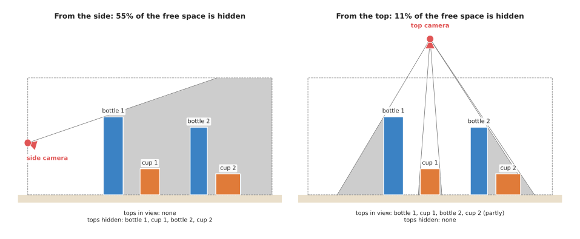
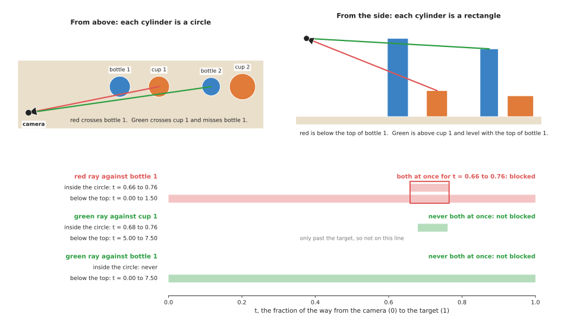
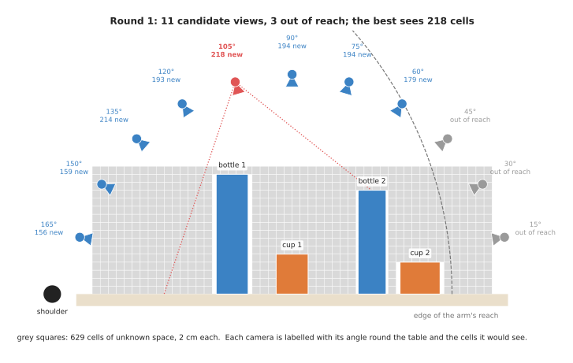
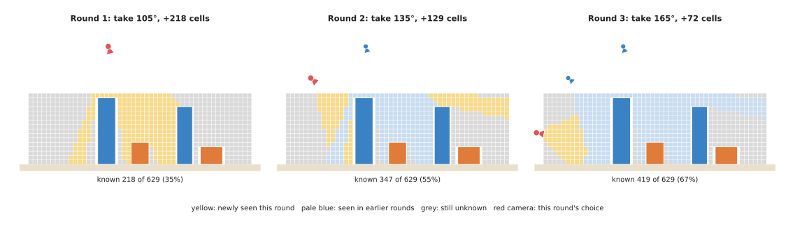

# Visibility and next-best-view

This page explains two linked techniques. The first is **visibility**, which means
working out what a camera can see from a given place, and what is hidden behind
something. The second is **next-best-view planning**, which means choosing where
to put the camera next. This is done so that it sees as much as possible of what
the robot does not know yet. The page answers four questions, and the first two
are about the technique itself. How do you test whether one object hides another,
and how do you score a place to look from? Then come the practical ones: where
does a robot arm use these, and when is a fixed list of views the better choice?

It is for a reader who has read the [chapter overview](../01_overview.md) and knows
what a camera pose is, at the level of the
[pinhole camera model](../../02_geometry-and-cameras/02_most-used/01_pinhole-camera-model.md).
You do not need any geometry beyond a straight line and a circle. Every number on
this page comes from a real run of
[`planning_and_search_3.py`](../../../diagrams/planning_and_search_3.py).

Book 2's [choosing where to look](../../../02_perception/02_object-perception/09_choosing-where-to-look.md)
covers the same subject from the camera's side, with real camera sizes and
measured timings. This page is instead the technique underneath it, which means the
test itself and the loop that uses it.

## Contents

1. [The idea in one sentence](#1-the-idea-in-one-sentence)
2. [Lines of sight and shadows](#2-lines-of-sight-and-shadows)
3. [How it works, step by step](#3-how-it-works-step-by-step)
   · [Testing one sight line against one cylinder](#testing-one-sight-line-against-one-cylinder)
   · [A worked example with two sight lines](#a-worked-example-with-two-sight-lines)
   · [Choosing where to look next](#choosing-where-to-look-next)
   · [A worked example with eleven candidate views](#a-worked-example-with-eleven-candidate-views)
   · [The pseudocode](#the-pseudocode)
   · [Choosing several views at once](#choosing-several-views-at-once)
4. [Where it is used on a robot arm](#4-where-it-is-used-on-a-robot-arm)
5. [Where it is useful, and where it is not](#5-where-it-is-useful-and-where-it-is-not)
6. [Libraries that provide it](#6-libraries-that-provide-it)
7. [Why this, and what it costs](#7-why-this-and-what-it-costs)
8. [The learned alternative](#8-the-learned-alternative)
9. [Where to read next](#9-where-to-read-next)
10. [Using it in Python](#10-using-it-in-python)

---

## 1. The idea in one sentence

A camera sees a point only if the straight line from the camera to that point passes
through nothing on the way. To choose where to look next, test that line for every
point you still know nothing about, from every place the camera could go. Then go
to the place that would show you the most.

An everyday example shows the idea before any robot arm is involved. You are looking
for your keys on a crowded shelf, and from where you stand a tall vase hides a patch
of the shelf behind it. You do not know whether the keys are in that patch, so you
think about where to stand instead. Standing a step to the left would show you the
patch behind the vase. However, standing on a chair would show you the whole shelf
top, but the chair is in the next room. So you take the step to the left, because
it shows you the most for a place you can actually get to. Then you look again from
the new place and decide again.

That everyday choice is already the whole technique. The rest of this page then
makes each part exact: what "passes through nothing" means for a real shape, how
to count what a view would show, and how to handle the places the arm cannot
reach.

---

## 2. Lines of sight and shadows

Before any of that can be counted, the two words the whole page rests on need
definitions. A **line of sight**, also called a **sight line** or a **ray**, is the
straight line from the camera's centre to a point in the scene, and light travels
along it. So if an object sits across that line, the point is **occluded**, which
means hidden.

Each object therefore hides a region behind it, and this region is called its
**shadow**, or its **occlusion shadow**. It is the same shape as a real shadow would
be if the camera were a lamp, and the camera cannot see anything inside it.

The scene on this page is a row of four upright cylinders on a table, with all units
in centimetres and the table top at height 0. The table below lists them, and you
read each row as one object: where its centre is along the table, its radius, and
its height.

| Object | Centre along the table | Radius | Height |
| --- | --- | --- | --- |
| bottle 1 | 35 cm | 4 cm | 30 cm |
| cup 1 | 50 cm | 4 cm | 10 cm |
| bottle 2 | 70 cm | 3.5 cm | 26 cm |
| cup 2 | 82 cm | 5 cm | 8 cm |

The picture below shows the row from the side, where each cylinder appears as a
rectangle. The grey regions are the shadows. The script found them by testing
the sight line to every point on a 2.5 mm grid, from the table to 45 cm up.



On the left, the camera is at the side of the table, 20 cm up, which is lower than
the first bottle. So the first bottle's shadow covers everything behind it,
meaning both cups and the second bottle. As a result, 55% of the free space in the
dashed box is hidden. The camera cannot see the top of any object, so it would
report one bottle and nothing else.

On the right, the camera is 60 cm above the middle of the table, looking down. Each
bottle now casts a thin shadow that leans away from the camera, so only 11% of the
free space is hidden. The camera sees the tops of both bottles and cup 1. It sees
only a small part of the top of cup 2, because bottle 2's shadow falls across it.

Two things follow from this picture, and both of them matter later. First, a tall
object close to the camera hides
far more than a short object further away. Second, the same scene can be almost
invisible from one place and almost fully visible from another, which is why it is
worth choosing where to look at all.

---

## 3. How it works, step by step

Now that shadows have a definition, the technique that uses them has two layers. The
lower layer is a test that answers one question: is this one point visible from this
one camera position? The upper layer is a loop that uses the test many times, to
score each place the camera could go and then pick the best.

### Testing one sight line against one cylinder

Many objects on a table are close to upright cylinders, such as bottles, cups, cans,
jars and posts. An upright cylinder has a very simple exact test, and it is exact
because it uses the real shape rather than a grid of points. A test like this, done
with a formula rather than by trying many points, is called an **analytic** test.

Write every point on the sight line as

```
point(t) = camera + t × (target − camera)
```

The number `t` says how far along the line the point is. At `t = 0` the point is at
the camera, at `t = 1` it is at the target, and halfway along `t` is 0.5.

A point is inside a solid upright cylinder when two things are true at the same
time.

1. **Seen from above, it is inside the circle.** Ignore the height. The distance from
   the point to the cylinder's centre line must be less than the radius. Putting
   `point(t)` into the circle's equation gives a **quadratic equation** in `t`: an
   equation with a `t²` term, a `t` term and a plain number. Its two answers are
   where the line enters and leaves the circle. If it has no answers, the line
   misses the circle completely.
2. **Seen from the side, it is between the table and the top.** Ignore the circle.
   The point's height must be between 0 and the cylinder's height. The height changes
   in a straight line with `t`, so this gives one more stretch of `t`.

Each test gives a stretch of `t`, called an **interval**. So the cylinder blocks
the sight line only if the two intervals overlap. That overlap must also lie
between the camera and the target, which means somewhere between `t = 0` and
`t = 1`.

It is tempting to test from above only, or from the side only, but both are wrong
on their own. For example, a sight line seen from above can cross a cup's circle
while passing well over the cup's top. Seen from the side, a sight line can cross
a bottle's rectangle while passing beside the bottle. The next example shows both
mistakes on the same scene.

For a box whose sides line up with the table, the same idea works with three
intervals, one for each direction. That is the **slab method** in Book 2's
[ray cast in three dimensions](../../../02_perception/02_object-perception/09_choosing-where-to-look.md#32-the-ray-cast-in-three-dimensions).

### A worked example with two sight lines

To see the two traps in action, put a camera at the left end of the table, 10 cm in
front of the row of objects and 30 cm up. Its position is (0, −10, 30), where the
first two numbers are the position on the table and the third is the height. The red
sight line goes to the middle of the top of cup 1, at (50, 0, 10). The green sight
line goes instead to the middle of the top of bottle 2, at (70, 0, 26).



Here is the red line against bottle 1, worked by hand, where bottle 1's centre is at
(35, 0) and its radius is 4.

1. The line moves 50 across, 10 sideways and −20 in height from the camera to the
   target.
2. From above, the circle equation becomes
   `2600 t² − 3700 t + 1309 = 0`. Its two answers are `t = 0.66` and `t = 0.76`.
   So the line is inside the circle from 66% to 76% of the way along.
3. From the side, the height is `30 − 20 t`. It is below the bottle's top of 30 cm
   for every `t` above 0, and it reaches the table at `t = 1.5`. So the line is
   below the top from `t = 0` to `t = 1.5`.
4. The two intervals overlap from `t = 0.66` to `t = 0.76`. That is between the
   camera and the target. So bottle 1 blocks the red line, and the camera cannot see
   the top of cup 1.

The green line then gives the two opposite traps, one for each incomplete test.

- Against cup 1, it is inside the circle from `t = 0.68` to `t = 0.76`, but it is
  below the cup's top only from `t = 5.0` onwards, far past the target. Over that
  stretch the line is about 27 cm up, while the cup is only 10 cm tall. There is no
  overlap, so cup 1 does not block it, although a test from above alone would have
  said it did.
- Against bottle 1, it is below the top all the way, because the camera is at the
  same height as the bottle's top. However, from above it never enters bottle 1's
  circle, so bottle 1 does not block it either, although a test from the side alone
  would have said it did.

The script tests both lines against all four cylinders. The red line is blocked by
bottle 1 only, while the green line is blocked by nothing, so the camera can see the
top of bottle 2.

The test costs one square root and a few multiplications per cylinder. Book 2
[measured](../../../02_perception/02_object-perception/09_choosing-where-to-look.md#33-what-it-costs-measured)
the box version at about 40 nanoseconds per obstacle. So a program can test
thousands of sight lines against dozens of objects in well under a millisecond.

### Choosing where to look next

With a cheap test in hand, the upper layer can afford to run it everywhere, and that
loop is called **next-best-view planning**. The pose it chooses is the **next best
view**, and these are its steps.

1. **Keep a record of what you do not know yet.** The usual record is a grid of small
   cells covering the work area, where each cell is marked free, occupied or
   **unknown**, and at the start every cell is unknown. The page on
   [volumetric maps](../../05_image-and-point-cloud-processing/03_also-used/02_volumetric-maps.md)
   covers these grids.
2. **List the candidate poses.** A **candidate** is one place the camera could go,
   together with the direction it would face. A common choice is a ring or a
   half-sphere of points around the work area, each one facing its centre.
3. **Remove the ones the arm cannot reach.** The cheapest check is distance, because
   a pose further from the arm's shoulder than the arm is long is out. A stricter
   check asks
   [inverse kinematics](../02_most-used/02_numerical-inverse-kinematics.md) for joint
   angles that put the camera there.
4. **Predict what each one would reveal.** For each remaining candidate, test the
   sight line to every unknown cell, and count the cells that are inside the camera's
   picture and not hidden. This count is the candidate's **gain**, and the gain can
   also be the number of objects not yet seen, or any other count of new information.
5. **Take the best.** Move the camera to the candidate with the highest gain, take a
   picture, and mark every cell it saw as known.
6. **Repeat** from step 4, because the gains have changed. Stop when the budget runs
   out, or when no candidate would reveal enough to be worth the move.

Step 6 is the one that matters, because after the first view the cells it saw are no
longer unknown. So a candidate that looks at the same region from nearly the same
place now gains almost nothing, even though it scored well in round 1.

### A worked example with eleven candidate views

To see that recounting happen, the scene is the same row of four cylinders, seen
from the side. The unknown space is the region from the table to 32 cm up, over the
whole 100 cm of table, cut into 2 cm squares. So leaving out the squares inside
objects makes 629 unknown cells.

There are 11 candidate views, and they sit on a half circle of radius 55 cm around
the middle of the table, every 15 degrees from 15° to 165°. The angle is measured
from the right-hand end of the table, and each camera faces a point 5 cm above the
middle of the table, with a picture 70 degrees wide. The arm's shoulder is 10 cm to
the left of the table, and the arm can hold the camera at most 100 cm from the
shoulder. The budget for the whole loop is three views.



Step 3 removes the three candidates at the right-hand end, because they are 114.0,
111.1 and 106.3 cm from the shoulder. The one at 60° is 99.6 cm away, so it just
stays in.

Step 4 then gives the round 1 gains, which the table below lists. You read each
column as one candidate and the number of unknown cells it would see.

| Candidate | 60° | 75° | 90° | 105° | 120° | 135° | 150° | 165° |
| --- | --- | --- | --- | --- | --- | --- | --- | --- |
| Round 1 gain | 179 | 194 | 194 | **218** | 193 | 214 | 159 | 156 |
| Round 2 gain | 48 | 22 | 17 | taken | 42 | **129** | 114 | 117 |
| Round 3 gain | 30 | 13 | 14 | taken | 6 | taken | 51 | **72** |

The loop then runs three rounds, one per line of the table.

1. Round 1 takes 105°, which would see 218 cells. That is 35% of the unknown space.
2. Round 2 recounts. The views at 75° and 90° looked strong in round 1, with 194 cells
   each. Now they would add only 22 and 17, because most of what they see was seen
   from 105°. The view at 135° adds 129, because it sees the space just left of
   bottle 1, which was in bottle 1's shadow from 105°, and a strip high up at the
   right-hand end. The known space rises to 347 cells, which is 55%.
3. Round 3 takes 165°, a low view from the left end of the table. It adds 72 cells
   near the table at the left end, so the known space rises to 419 cells, or 67%.



After three views, most of the right-hand end is still unknown, and the reason is
reach. The views that look into the region behind bottle 2 from the right are the
three out-of-reach candidates, and the one at 45° alone would see 195 cells. So a
robot in this position would need to move its base, or accept that the right-hand
end stays unknown. The loop tells you this plainly, which is useful in itself.

### The pseudocode

The pseudocode below is the whole loop, where `blocked` is the cylinder test from
earlier on this page.

```
function blocked(camera, target, cylinder):
    # points on the line are camera + t × (target − camera), t from 0 to 1
    circle_t  = where the line is inside the cylinder's circle, seen from above
    height_t  = where the line is between the table and the cylinder's top
    if circle_t is empty or height_t is empty:
        return false
    start = the largest of circle_t.start, height_t.start, 0
    end   = the smallest of circle_t.end, height_t.end, 1
    return start < end

function sees(camera, cell, objects):
    if cell is outside the camera's picture:
        return false
    for each object in objects:
        if blocked(camera, cell, object):
            return false
    return true

function next_best_views(candidates, unknown_cells, objects, budget):
    candidates = the ones in candidates the arm can reach
    chosen = empty list
    repeat budget times:
        best = nothing, best_gain = 0
        for each candidate not in chosen:
            gain = number of cells in unknown_cells where sees(candidate, cell, objects)
            if gain > best_gain:
                best = candidate, best_gain = gain
        if best is nothing or best_gain is too small to be worth a move:
            stop
        move the camera to best, take a picture, update the map
        remove every cell best saw from unknown_cells
        add best to chosen
    return chosen
```

On a real robot, the line "update the map" uses the real picture rather than the
prediction, because the prediction assumed that unknown cells are empty. If the
picture shows a new object, the map gains an occupied region, and that object will
cast its own shadow in the next round's predictions.

### Choosing several views at once

The loop above chooses one view, looks, and then chooses again, which is right when
each picture can change the plan. Sometimes the objects are known in advance
instead, and the task is to pick a fixed set of views, all at once, that together
see everything.

That is a different problem called **set cover**. In it, each view is a set of
things it sees, and you want the fewest sets that together cover everything. The
same greedy rule solves it well, because you take the view that adds the most, then
the next, and so on.
[Greedy algorithms and set cover](../../08_decisions-and-task-logic/03_also-used/01_greedy-algorithms-and-set-cover.md#2-set-cover-the-problem-greedy-is-best-known-for)
works an example with eight glasses and shows how far from the best the greedy
choice can be. The visibility test on this page is what builds the sets that page
takes as given.

---

## 4. Where it is used on a robot arm

Both layers earn their place, but in different tasks, so here are the places where
an arm cell uses a visibility test or a full next-best-view loop.

- **Throwing away useless camera poses early.** Before any view reaches the motion
  planner, the visibility test removes the ones from which the target is hidden.
  Book 2's worked scene removed 62% of the views that had passed every other
  check, in its
  [section on occlusion](../../../02_perception/02_object-perception/09_choosing-where-to-look.md#3-occlusion-as-a-precondition-not-a-difficulty).
- **Picking a small fixed set of views for a cell.** When the objects are roughly
  known, an engineer runs the visibility test on many candidates once, offline,
  and keeps two or three good ones, so the arm then drives to them by name every
  cycle.
- **Looking into a bin or a shelf.** The sides of a bin, and the objects near the
  front of a shelf, hide what is behind them, so a next-best-view loop with an
  unknown grid finds a view down past the edge.
- **Finding a hidden object.** When the object the robot needs is not in the first
  picture, the unknown cells are the only places it can be, so the loop scores views
  by how many of those cells they would show.
- **Building a model of an unfamiliar object.** To scan an object it has never seen,
  the robot needs many views, and each new view should show surface that the earlier
  ones missed. This is the job next-best-view planning was invented for.
- **Checking a grasp before committing.** A grasp chosen from a single view may land
  on a side the camera never saw, so a second view aimed at that side, chosen by the
  same test, confirms the surface is there.
- **Keeping the camera's view clear while the arm moves.** A camera on a post can be
  hidden by the arm itself, so the same sight-line test, with the arm's links as the
  obstacles, tells the planner which arm poses would block the camera's view of the
  gripper.

---

## 5. Where it is useful, and where it is not

Those uses divide along one line, and it is worth saying which side each falls on.
The visibility test is exact for the shapes it models. However, the next-best-view
loop is only as good as its record of the unknown and its list of candidates. The
table below lists the common problems, and you read each row as a problem, the
sign you would see, and what people do instead.

| Problem | The sign you would see | What people do instead |
| --- | --- | --- |
| The task needs only one or two views | the loop runs once, and costs an extra move and a map for no gain | a fixed set of views chosen offline, as Book 2's [honest verdict](../../../02_perception/02_object-perception/09_choosing-where-to-look.md#22-the-honest-verdict) recommends |
| Objects are not simple shapes | the test says a view is clear, but a handle or a lid blocks it | wrap each object in a slightly larger cylinder or box, or ray-cast against a mesh |
| The test uses footprints only, ignoring height | views over short objects are thrown away although they were fine | test in three dimensions, with the height interval |
| The best view is out of reach | the gains are high but the arm cannot get there | check reach before scoring; move the base; or accept what is left unknown |
| Every move is slow | the loop finds good views but the cycle time doubles | a fixed set, or a gain that is divided by the time to reach the view |
| The scene changes between pictures | cells marked known are now wrong | re-mark cells as unknown after a set time, or re-scan the changed region |
| Candidates are too few, or all at one height | the loop stops with large regions still unknown | add candidates at other heights and angles; the gains show where they are needed |
| Gains assume unknown cells are empty | a view that should see behind a box sees a new object instead | nothing to fix: update the map from the real picture and score again |
| The number of rounds varies with the scene | the cycle time is different every run and hard to guarantee | cap the budget; fall back to a fixed set when the cap is reached |

The first row is the most important one. Book 2
[counts the views each task needs](../../../02_perception/02_object-perception/08_the-wrist-camera.md#2-how-many-pictures-each-task-needs)
and finds that most arm tasks need one or two. A fixed set of views can also be
tested and signed off, which a loop that decides at run time cannot. So the
visibility test is almost always worth having, while the full loop is worth having
only when the robot genuinely does not know what is in front of it.

---

## 6. Libraries that provide it

Because both layers are short, the cylinder test and the loop on this page are a few
dozen lines of plain code. So no library is needed for them. The libraries below
give you ray casting against more complex shapes, or the grid of unknown cells.
Then you read each row as one library, the languages it serves, the names to look
for, and a note.

| Library | Languages | Function or class | Note |
| --- | --- | --- | --- |
| Open3D | Python, C++ | `open3d.t.geometry.RaycastingScene`, `PointCloud.hidden_point_removal` | casts many rays against meshes at once; the second removes points a camera could not see |
| trimesh | Python | `mesh.ray.intersects_any`, `mesh.ray.intersects_location` | ray tests against triangle meshes |
| MuJoCo | Python, C | `mj_ray`, `mj_multiRay` | ray casts against every shape in a simulated scene |
| PyBullet | Python | `rayTest`, `rayTestBatch` | the same, in the Bullet simulator |
| OctoMap | C++ | `OcTree`, `OcTree::castRay`, `OcTree::computeRay` | the standard free, occupied and unknown grid; cells cost little when empty |
| PCL | C++ | `pcl::VoxelGridOcclusionEstimation` | marks which cells of a voxel grid are hidden from a camera |
| MoveIt 2 | C++ (ROS 2) | `VisibilityConstraint` | asks the planner to keep a sensor's view of a target clear |

Book 2's [libraries section](../../../02_perception/02_object-perception/09_choosing-where-to-look.md#7-the-libraries-and-what-runs-on-an-apple-silicon-mac)
gives the licence of each of these and says which run on an Apple Silicon Mac.

---

## 7. Why this, and what it costs

With the test, the loop and the libraries covered, this section answers the four
questions for visibility and next-best-view planning. What is it, what does it do
for you, why choose it rather than the obvious alternative, and what does it cost?

The visibility test checks whether a straight line from the camera to a point passes
through any object. For simple shapes such as upright cylinders and boxes, it is
an exact formula. Next-best-view planning then uses that test to score candidate
camera poses by how much new they would show, and takes the best one and repeats.

What it does for you is replace guessing with counting. Without it, a program
chooses a view, drives there, takes a picture, and only then finds out the target
was behind a bottle. With it, the program knows before the arm moves at all. Each
wasted move costs between a few hundred milliseconds and a couple of seconds on a
real arm, while the test itself costs microseconds.

The obvious alternative is to **render** each candidate view, which means drawing
the whole scene as a picture from that pose, as a game engine would, and looking at
the picture. That works for any shape and gives a full image. However, it is far
slower than a few sight lines, and it needs a full model of the scene. For the
question "is this target hidden from here?", a handful of sight-line tests answers
it exactly. So choose rendering when you need the whole predicted picture,
for example to predict what a detector will see. Choose sight lines instead when you
need a yes or no, or a count.

The second alternative is to skip the loop and use a **fixed list of views**, which
for most arm tasks is the better choice, as section 5 says. The loop earns its place
only when the robot does not know the scene in advance.

The costs come in four parts. First, you must model each object as a simple shape,
and a shape that is too small lets a blocked view through. Second, the loop needs a
record of the unknown space, which is a map you now have to keep correct. Third,
its cycle time depends on the scene, so it is harder to promise a fixed time per
task. Fourth, its choices are only as good as its candidate list, because it cannot
choose a view you did not offer it.

---

## 8. The learned alternative

Since the test is written by hand, the last question is what a learned model would
do in its place. There is no learned model in Book 6 that replaces the sight-line
test. This is because the test is an exact formula that runs in microseconds, and
a network could only copy it less exactly. The nearest learned alternative is
instead to skip the extra view altogether. A [shape completion](../../../06_learned-models/04_3d-models/03_also-used/01_shape-completion.md)
model guesses the hidden back of an object from one picture. So it wins when the
camera cannot get round the object, such as in a bin or on a shelf, or when every
extra move costs too much time. However, the back it gives is invented rather than
measured, so Book 6's rule is to use completion when you cannot look, and to look
when you can afford it. The two also work together, because a model's low
[confidence](../../../06_learned-models/10_making-models-work-on-an-arm/03_also-used/01_uncertainty-and-confidence.md#7-declining-to-act-the-reject-option-and-cascades)
is the signal to look again, and this page then chooses where.

---

## 9. Where to read next

- Book 2's [choosing where to look](../../../02_perception/02_object-perception/09_choosing-where-to-look.md)
  applies this page with a real camera: distance, viewing angle, reach, and the
  order in which to visit the chosen views.
- [Greedy algorithms and set cover](../../08_decisions-and-task-logic/03_also-used/01_greedy-algorithms-and-set-cover.md)
  covers picking several views at once, and how far greedy can be from the best.
- [Volumetric maps](../../05_image-and-point-cloud-processing/03_also-used/02_volumetric-maps.md)
  covers the grid of free, occupied and unknown cells that the loop scores against.
- [Numerical inverse kinematics](../02_most-used/02_numerical-inverse-kinematics.md)
  is the stricter reach check for each candidate view.
- [Sampling-based planning](../02_most-used/01_sampling-based-planning.md) plans the
  arm's move to the chosen view.
- Book 2's [the wrist camera](../../../02_perception/02_object-perception/08_the-wrist-camera.md)
  covers what a view costs and how many views each task needs.

---

## 10. Using it in Python

Section 3 wrote the sight line as `point(t) = camera + t × (target − camera)`
and tested it against a cylinder by hand, and section 6 said that the cylinder
test itself needs no library while ray casting against real shapes does. This
section shows the library version. After it you will be able to ask, for many
candidate camera positions at once, whether the target is hidden, and you will
know which parts of choosing where to look next remain yours.

The program below uses Open3D's ray casting, which tests many rays against
triangle meshes at once. The useful detail is that a ray is six numbers, a
starting point and a direction, and if you leave the direction as the full
vector from the camera to the target rather than shortening it to length 1, then
`t = 1` lands exactly on the target. That is the same `t` as in section 3.

```python
import numpy as np
import open3d as o3d

# The obstacle: a bottle 35 mm in radius and 200 mm tall, standing on the table.
bottle = o3d.geometry.TriangleMesh.create_cylinder(radius=0.035, height=0.20)
bottle.translate((0.10, 0.02, 0.10))

scene = o3d.t.geometry.RaycastingScene()
scene.add_triangles(o3d.t.geometry.TriangleMesh.from_legacy(bottle))

target = np.array([0.20, 0.00, 0.03])          # the screw you need to see
cameras = np.array([[0.00, 0.00, 0.30],        # candidate camera positions
                    [0.00, -0.25, 0.30],
                    [0.30, -0.25, 0.30]])

# Direction left unnormalised, so t = 1 is the target and t < 1 is in front of it.
rays = o3d.core.Tensor(np.hstack([cameras, target - cameras]).astype(np.float32))
hidden = scene.test_occlusions(rays, tnear=1e-4, tfar=1.0).numpy()
where = scene.cast_rays(rays)["t_hit"].numpy()
```

On that scene `hidden` comes back as `[True, False, False]`, so the first camera
position cannot see the screw and the other two can. The matching `t_hit` for
the first ray is 0.370, which says the bottle blocks the line 37 per cent of the
way from that camera to the screw. The other two rays return infinity, which is
how Open3D reports a ray that hits nothing.

Open3D does the geometry. `add_triangles` builds the tree of boxes that makes a
ray test fast, `test_occlusions` answers the yes-or-no question for every ray in
one call, and `cast_rays` gives you where along each ray the first hit was.
Doing this against real meshes rather than the cylinders of section 3 is the
reason to use a library at all, because a mug with a handle or a bracket with a
hole has no formula.

What you still have to write is everything that makes this a next-best-view
decision rather than a visibility test. Section 3's loop is yours: you generate
the candidate views, you score each one by how much it would reveal, you
subtract what it costs the arm to get there, and you pick the winner. You also
have to write the bookkeeping of which parts of the scene are still unknown,
because `test_occlusions` answers about a point you already know the position
of, and the interesting question is usually about space you have not seen yet,
which is what the
[volumetric maps](../../05_image-and-point-cloud-processing/03_also-used/02_volumetric-maps.md)
page's unknown cells are for. And you have to check that a chosen view is
reachable, because a view the arm cannot get to is worth nothing.

What you have to decide or measure are the candidate views, the tolerances and
the frames. The three camera positions above are a made-up list, and section 3
explains that how you generate candidates decides what you can find: a ring of
views around the object is the usual starting point, and the spacing of that
ring is yours to choose. The `tnear=1e-4` keeps a ray from hitting a shape the
camera is already inside, and the `tfar=1.0` stops it at the target, so both of
those numbers only mean what they mean because the direction was left
unnormalised. Everything here is also in one frame, and mixing the camera's
frame with the table's frame is the most common way to get a confident wrong
answer, so you decide the frame once and convert every position into it before
building the rays. Finally, a real sensor is not a single line of sight, because
it has a field of view and a minimum range, so section 3's scoring has to
account for a target that is in front of the camera but outside the picture.
