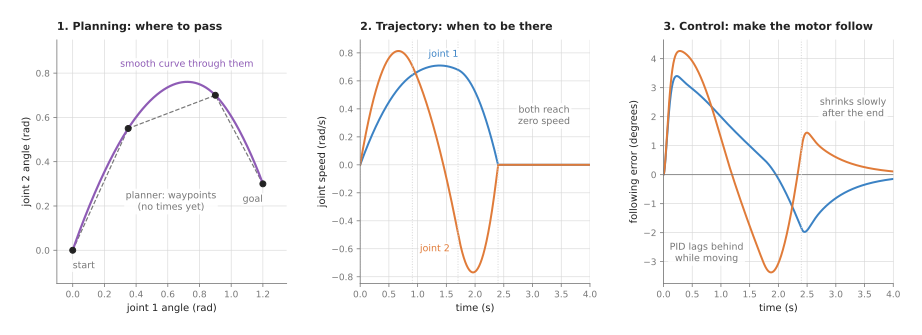
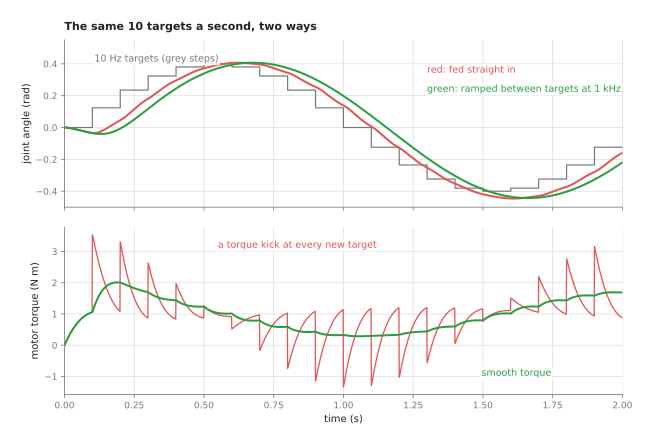

# Control and motion

This chapter is about turning a planned path into smooth, safe motor commands. It
covers five techniques: proportional-integral-derivative (PID) control,
trajectory generation, arm dynamics, safety monitoring, and impedance and force
control. Each one is a written set of rules that a program follows many times a
second. None of them is trained.

This page is the overview of the chapter. It answers four questions. What job do
these techniques do for an arm? What does each of the five do, in one line? How
do they work together on one real move? And how does this chapter connect to the
rest of the book, and to the learned movement models in Book 6?

It is for a reader who knows what a joint, a joint angle and a motor are, at the
level of Book 1's [arm overview](../../01_robotics-intro/03_arm/01_overview.md).
It helps to have read the [planning and search overview](../06_planning-and-search/01_overview.md),
because this chapter starts where that one stops. You do not need any control
theory. Every number on these pages comes from a real run of a diagram script,
such as `docs/diagrams/control_and_motion.py`, which simulates a joint, a move and a
contact rather than drawing them by hand. The arm dynamics page uses
`docs/diagrams/control_and_motion_2.py`, which simulates a two-joint arm.

## Contents

1. [What control and motion is for](#1-what-control-and-motion-is-for)
2. [Three layers, three questions](#2-three-layers-three-questions)
3. [The five techniques](#3-the-five-techniques)
4. [The five side by side](#4-the-five-side-by-side)
5. [How they work together on one move](#5-how-they-work-together-on-one-move)
6. [Loops that run at different rates](#6-loops-that-run-at-different-rates)
7. [How this chapter connects to the others](#7-how-this-chapter-connects-to-the-others)
8. [Where to read next](#8-where-to-read-next)

---

## 1. What control and motion is for

The book's [map of techniques](../01_what-techniques-are/04_the-map-of-techniques.md)
describes this category in one line: turning a planned path into smooth, safe
motor commands.

Here is the job in everyday terms. You carry a full mug of coffee from the kitchen
to a desk. You already know the route. What is left is how you walk it. You do not
start at full speed, because the coffee would slop. You do not stop dead at the
desk for the same reason. While you walk, you keep correcting your hand, because
the mug is never quite where you meant it to be. And when you put the mug down,
you lower it until you feel the desk, and then you stop pushing.

An arm has the same three jobs every time it moves.

1. It must decide how fast to go along the route at each moment, without going
   faster, or speeding up faster, than the motors allow.
2. It must make each motor actually follow that plan, even though gravity, friction
   and the load all push the joint off course.
3. It must behave sensibly when it touches something. A mug put down on a table,
   a peg pushed into a hole, and a person bumping the arm all need the arm to give
   way a little instead of pushing harder.

The planner from the [planning and search](../06_planning-and-search/01_overview.md)
chapter does not do any of these. It hands over a list of joint angles to pass
through. It says where to pass, but not when, and it knows nothing about motors or
contact.

---

## 2. Three layers, three questions

The work is split into layers. Each layer answers one question and hands its
answer to the layer below.

The **trajectory** layer answers "where should each joint be at each instant?". A
**trajectory** is a path with times attached. The same path can be driven slowly or
quickly, and with gentle or sudden changes of speed. This layer chooses.

The **controller** layer answers "what torque should each motor produce right now,
so that the joint is where the trajectory says?". A **torque** is a turning force,
measured in newton metres (N m). The controller reads the joint's sensor, compares
the reading with the target, and chooses a torque. It does this again and again,
often 1,000 times a second. This is called a **feedback loop**, because the
measurement is fed back into the next decision.

The controller works better when it knows the arm's body. The arm's **dynamics**
say how much torque each joint needs to hold the arm up against gravity and to speed
it up. A controller that adds that torque before any error appears follows fast
moves far more closely than one that waits for the error.

The **contact** layer answers "what should happen when the arm touches something?".
A plain position controller has only one answer: push harder until the joint is
where it was told to be. The contact layer replaces that answer with a chosen
behaviour, such as "act like a soft spring" or "stop when the force passes 1
newton".

Beside all three layers runs a **safety monitor**. It does not command the arm. It
watches the commands and the measurements, and stops the arm when a speed, a force, a
position or a distance to a person goes outside its limit, or when a loop stops
sending commands.

The Book 3 page on [controlling the move](../../03_frameworks/03_arm-movement/04_controlling-the-move.md)
describes the same layers in ROS 2, where they are the
[ros2_control](../../03_frameworks/01_tools-and-libraries.md#6-ros2_control-driving-the-motors)
framework and its controllers. This chapter explains the techniques inside them.

---

## 3. The five techniques

Each page in this chapter explains one technique in depth. The pages are split into
two groups. The **most used** group holds the four techniques that run on nearly
every arm, every time it moves: PID control, trajectory generation, arm dynamics and
safety monitoring. Even an arm that only moves between fixed poses uses all four,
although the dynamics and the safety checks are often hidden inside the arm maker's
controller. The **also used** group holds impedance and force control. It is used
often, but only in tasks where the arm touches things on purpose, such as pressing,
inserting or being guided by hand, and it needs an arm or a sensor that supports it.

Here is each technique in a line or two. The first four are the most used group.

- [PID control](02_most-used/01_pid-control.md) makes one joint follow its target. It adds up
  three pushes: one in proportion to the error now, one that grows while an error
  lasts, and one that brakes when the error is changing fast. It is the loop that
  runs inside nearly every joint of nearly every arm.
- [Trajectory generation](02_most-used/02_trajectory-generation.md) decides where each joint
  should be at each instant. It turns a list of waypoints into smooth curves, and
  gives them a speed profile that keeps within the motors' limits of speed,
  acceleration and jerk.
- [Arm dynamics](02_most-used/03_arm-dynamics.md) works out the torque each joint
  needs: inertia times acceleration, plus the pull of gravity, plus a part that grows
  with speed. It holds the arm still with no error, lets a controller follow fast moves
  closely, and lets a simulator predict how the arm will move.
- [Safety monitoring](02_most-used/04_safety-monitoring.md) watches the arm's
  software limits: joint positions, speeds, torques, forces and the distance to
  people. A **watchdog**, a timer that every new command must reset, stops the arm
  when a loop stops sending commands. **Speed and separation monitoring** slows the
  arm as a person comes closer, and stops it if they come too close.

The last one is the also used group.

- [Impedance and force control](03_also-used/01_impedance-and-force-control.md) decides how the
  arm behaves in contact. It makes the arm act like a spring with a stiffness you
  chose, stops a move when a force sensor fires, and keeps contact forces inside a
  limit.

---

## 4. The five side by side

The table below compares the five techniques. Read each row as one technique.
The columns say what goes in, what comes out, how often it runs, and the sign that
tells you it is set up badly.

| Technique | What goes in | What comes out | How often it runs | The sign of a bad setup |
| --- | --- | --- | --- | --- |
| [PID control](02_most-used/01_pid-control.md) | the target angle and the measured angle | a torque or a motor current | 1,000 times a second or more | the joint overshoots and rings, or stops a little short of the target |
| [Trajectory generation](02_most-used/02_trajectory-generation.md) | waypoints and the joint limits | a target angle for every tick of the controller | once per move, then read out at the controller's rate | the arm jerks at the start and end, or the tool wobbles after it stops |
| [Arm dynamics](02_most-used/03_arm-dynamics.md) | the joint angles, speeds and wanted accelerations, and the arm's masses | a torque for each joint, or the accelerations that a torque will cause | 1,000 times a second inside the controller; also inside every simulator | the arm sags when held still, lags on fast moves, or sets off false collision alarms after a grasp |
| [Safety monitoring](02_most-used/04_safety-monitoring.md) | the commands, the measured angles, speeds and forces, and the distance to people | carry on, slow down, or stop | every controller tick, 500 to 1,000 times a second | the arm stops for no reason, or does not stop when a limit is broken |
| [Impedance and force control](03_also-used/01_impedance-and-force-control.md) | the target pose and the measured force or position | a force or torque, or a changed target position | 500 to 1,000 times a second | the arm pushes too hard on contact, bounces off, or buzzes against a hard surface |

---

## 5. How they work together on one move

Here is one real move of two joints, simulated in the diagram script. The planner
has given four waypoints in the space of joint angles. The trajectory layer draws
a smooth curve through them and gives it times. The controller layer drives each
joint along the curve with the PID controller from [the PID page](02_most-used/01_pid-control.md).

The left panel is the planner's output, and the curve the trajectory layer draws
through it. The middle panel is the timing: the speed of each joint over the
2.4 seconds of the move. The right panel is the error of each joint, meaning the
target angle minus the measured angle.

Three things in that picture are worth reading closely.

First, the planner's waypoints have no times. The trajectory layer chose them. In
this run it gave each stretch of the path a share of the 2.4 seconds in proportion
to its length, so the waypoints are passed at 0, 0.91, 1.70 and 2.40 seconds. Both
joints start and end at zero speed.

Second, the controller never follows the trajectory exactly. It lags behind while
the joint is moving. The largest error is 3.4 degrees on joint 1 and 4.3 degrees
on joint 2. This lag is called the **following error**. It is normal, and it is
the thing the Book 3 page means when it warns that a controller with its
tolerances set to zero never checks it; see
[what "the move failed" actually means](../../03_frameworks/03_arm-movement/04_controlling-the-move.md#3-what-the-move-failed-actually-means).

Third, the error is not zero when the trajectory ends. At 2.4 seconds joint 1 is
still 1.85 degrees off, and half a second later it is still 0.96 degrees off. The
controller keeps working after the trajectory has stopped changing, and it closes
the gap slowly. That is why a move that is "done" by the clock is not always done
at the joint. The Book 3 page on
[the cost of a move](../../03_frameworks/03_arm-movement/09_the-cost-of-a-move.md#3-settling-time-the-cost-people-forget)
calls this settling time.

This move has no contact in it. If the gripper were lowering a mug onto a table,
the last few millimetres would be handed to the contact layer, as the
[impedance and force control](03_also-used/01_impedance-and-force-control.md) page shows.

---

## 6. Loops that run at different rates

The three layers do not run at the same speed. A planner runs once per move, and
may take a tenth of a second or more. A controller runs every millisecond. Some
sources of targets sit in between. A camera-based loop may send a new target 30
times a second. A learned policy from Book 6 often sends one 10 to 15 times a
second.

Something has to fill the gap between a slow stream of targets and a fast
controller. The picture below shows why that matters. The same 10 targets a second
are sent to the same joint in two ways.

The red run sends each target straight to the controller and holds it for 100
milliseconds. The green run moves the target smoothly, 1,000 times a second, from
the previous value to the newest one.

In the red run, every new target is a small step. The controller answers each step
with a sudden rise in torque. The largest change from one millisecond to the next
is 2.48 N m, and the arm moves in small jerks. In the green run the largest change
in one millisecond is 0.03 N m. The cost of the green run is also visible: it is
always one target behind, a tenth of a second late. The Book 3 page on
[learned motion](../../03_frameworks/03_arm-movement/05_learned-motion.md) describes
exactly this trade, and it is the reason learned policies still need the trajectory
and controller layers underneath them.

The general rule is simple. Every loop should hand the loop below it a signal that
changes smoothly at the lower loop's rate. The [trajectory generation](02_most-used/02_trajectory-generation.md)
page shows how.

---

## 7. How this chapter connects to the others

Control and motion sits at the end of the chain. The techniques in the other
chapters decide what to do and where to go. This chapter makes it happen.

- [Planning and search](../06_planning-and-search/01_overview.md) hands over the
  path. [Trajectory optimisation](../06_planning-and-search/02_most-used/03_trajectory-optimisation.md)
  can already give a path with times, and then the trajectory layer here only
  checks and smooths it. [Numerical inverse kinematics](../06_planning-and-search/02_most-used/02_numerical-inverse-kinematics.md)
  turns a target pose for the gripper into joint angles, which is also how a
  Cartesian controller works inside.
- [Fitting and estimation](../04_fitting-and-estimation/01_overview.md) cleans up
  the signals the controllers read. A [Kalman filter](../04_fitting-and-estimation/02_most-used/03_kalman-filter.md)
  can smooth a noisy joint speed or a noisy force reading before a controller uses
  it.
- [Geometry and cameras](../02_geometry-and-cameras/01_overview.md) provides the
  frames that a Cartesian impedance controller works in. The stiffness "along the
  tool" only means something once the tool frame is known.
- [Decisions and task logic](../08_decisions-and-task-logic/01_overview.md) decides
  when to switch layers: for example, move fast in free space, then switch to a
  guarded move for the last 30 millimetres, then switch to impedance control to
  press.

Book 6 has learned models that do parts of this job. A
[movement model](../../06_neural-network-models/05_movement-models/01_overview.md)
decides where the arm should go next, from camera pictures. It replaces the planner
and sometimes the trajectory layer, but not the controller: its output is still a
stream of joint targets that a PID loop must follow. A
[learned arm model](../../06_neural-network-models/08_touch-and-body-models/03_also-used/02_learned-arm-models.md)
predicts the torque a joint needs. It usually corrects the physics model from the
[arm dynamics](02_most-used/03_arm-dynamics.md) page rather than replacing it, and
the result is added to a PID loop to make it follow more closely. A [force and slip model](../../06_neural-network-models/08_touch-and-body-models/02_most-used/01_force-and-slip-models.md)
reads touch signals that a force controller could act on. None of these removes the
need for the programmed loops on this chapter's pages. They sit on top of them.

---

## 8. Where to read next

- Start with [PID control](02_most-used/01_pid-control.md). It is the loop inside every joint,
  and the other pages build on it.
- Then read [trajectory generation](02_most-used/02_trajectory-generation.md), which makes the
  targets that PID follows.
- Then read [arm dynamics](02_most-used/03_arm-dynamics.md), which adds the torque a
  PID loop would otherwise have to wait for an error to find.
- Then read [safety monitoring](02_most-used/04_safety-monitoring.md), which watches
  all the other loops and stops the arm when a limit is broken.
- Then read [impedance and force control](03_also-used/01_impedance-and-force-control.md), which
  changes what happens at contact.
- Book 3's [controlling the move](../../03_frameworks/03_arm-movement/04_controlling-the-move.md)
  shows these layers in ROS 2, with the settings that ship with them.
- Book 3's [holding on](../../03_frameworks/02_gripping/05_holding-on.md#3-compliance-impedance-and-admittance)
  covers impedance and admittance from the gripper's point of view.
- Book 6's [movement models overview](../../06_neural-network-models/05_movement-models/01_overview.md)
  shows what a learned policy takes over, and what it still leaves to these loops.
