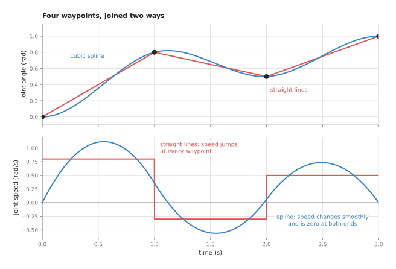
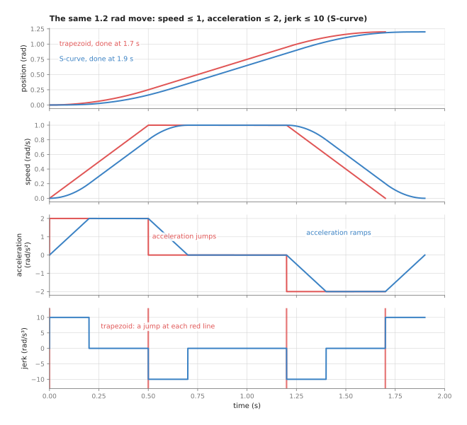
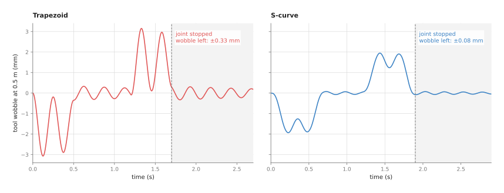
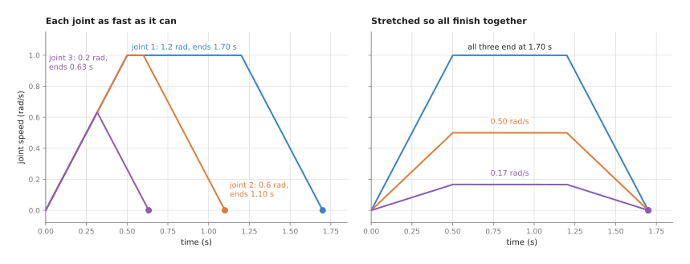

# Trajectory generation

This page explains trajectory generation, which is the step that turns a planned
path into a target for every joint at every instant. It answers four questions. How
do you join a list of waypoints into a smooth curve, and how do you then decide how
fast to go along it without breaking the motors' limits? Why do smooth starts and
stops matter so much on a real arm, and which libraries do this for you?

It is written for a reader who has read the [overview](../01_overview.md) of this
chapter and the [PID control](01_pid-control.md) page, which explains the loop that
follows the targets made here. You also need to know what speed and acceleration
are. Every number on this page comes from a real run of the diagram script,
`docs/diagrams/control_and_motion.py`.

Every arm that moves smoothly uses trajectory generation, whether you see it or not.
In ROS 2 it happens inside MoveIt after planning, and again inside the controller
between the points it is given. So knowing what it does explains a lot of
odd behaviour: moves that take longer than expected, tools that wobble after the arm
stops, and arms that jerk when driven from a slow stream of targets.

## Contents

1. [What this page answers](#1-what-this-page-answers)
2. [The idea in one sentence](#2-the-idea-in-one-sentence)
3. [How it works, step by step](#3-how-it-works-step-by-step)
   · [Four quantities: position, speed, acceleration, jerk](#four-quantities-position-speed-acceleration-jerk)
   · [Joining the waypoints: straight lines or splines](#joining-the-waypoints-straight-lines-or-splines)
   · [The trapezoidal profile](#the-trapezoidal-profile)
   · [The S-curve profile](#the-s-curve-profile)
   · [Why jerk matters: the wobble after the stop](#why-jerk-matters-the-wobble-after-the-stop)
   · [Several joints: finishing together](#several-joints-finishing-together)
   · [Timing a whole path: time-parameterisation](#timing-a-whole-path-time-parameterisation)
   · [The steps as pseudocode](#the-steps-as-pseudocode)
4. [Where it is used on a robot arm](#4-where-it-is-used-on-a-robot-arm)
5. [Where it is useful, and where it is not](#5-where-it-is-useful-and-where-it-is-not)
6. [Libraries that provide it](#6-libraries-that-provide-it)
7. [Why trajectory generation, and what it costs](#7-why-trajectory-generation-and-what-it-costs)
8. [The learned alternative](#8-the-learned-alternative)
9. [Where to read next](#9-where-to-read-next)
10. [Using it in Python](#10-using-it-in-python)

---

## 1. What this page answers

A planner, such as the ones in [sampling-based planning](../../06_planning-and-search/02_most-used/01_sampling-based-planning.md),
gives a **path**, which is a list of joint angles, called **waypoints**, that the arm
should pass through. But it does not say when, so the same path can be driven in one
second or in ten.

The joint controller needs something else, because every millisecond it needs a
target angle for each joint. So something must turn the list of waypoints into a
**trajectory**, meaning a target angle for each joint at every instant, from the
start of the move to the end.

That something must also obey the motors, because each joint has a highest speed and
a highest acceleration it can manage, both given in the arm's data sheet. A
trajectory that asks for more gives a joint that falls behind, a controller that hits
its torque limit, and sometimes a safety stop.

It should be gentle as well, because a move that starts or stops suddenly shakes the
arm, spills what it carries, and blurs the pictures from a camera on the wrist. So
this page shows how a trajectory is built to be both fast and gentle, and what each
choice costs.

---

## 2. The idea in one sentence

Since the job is to be both fast and gentle, here it is in one sentence. A trajectory
generator joins the waypoints with a smooth curve and then chooses how fast to move
along it at each moment, as fast as the limits on speed, acceleration and jerk allow,
starting and ending at rest.

Here is an everyday example of the same choice, a lift in a tall building, whose
route is fixed straight up the shaft. What the lift chooses is only how its speed
changes, and it does not jump to full speed, because the passengers would be thrown
to the floor. Instead it speeds up gently, travels at a steady speed, and slows down
gently, and a good lift even softens the moment the speeding-up begins and ends.
Since its designers chose the fastest ride that stays comfortable, a trajectory
generator does the same thing for each joint of an arm.

---

## 3. How it works, step by step

### Four quantities: position, speed, acceleration, jerk

Because a trajectory has to control speed as well as position, four quantities are
needed to describe how a joint moves. Each one is the rate of change of the one
before it.

- **Position** is the joint angle, in radians. One radian is about 57.3 degrees.
- **Speed** is how fast the angle changes, in radians per second (rad/s). With its
  direction included it is called **velocity**.
- **Acceleration** is how fast the speed changes, in rad/s².
- **Jerk** is how fast the acceleration changes, in rad/s³.

The motors limit the first three of those directly, since speed is limited by the
motor and gearbox, while acceleration is limited by the torque the motor can give.
Jerk has no hard limit, but a sudden change of acceleration is a sudden change of
torque, and that is what shakes the arm. So the rest of this page is about keeping
all four under control.

### Joining the waypoints: straight lines or splines

Since position is the first of those four quantities, the first job is to join the
waypoints into a continuous angle. The simplest way to do that is with straight
lines, moving each joint at a steady speed from one waypoint to the next. The picture
below does that for one joint with four waypoints, at 0, 1, 2 and 3 seconds, and it
also shows the other common choice, a **cubic spline**.



The top panel shows the angle, while the bottom panel shows the speed.

With straight lines the speed is 0.8 rad/s, then −0.3 rad/s, then 0.5 rad/s, and at
each waypoint it jumps from one value to the next in no time at all. Because a jump
in speed needs an infinite acceleration, which no motor can give, the controller
falls behind at every corner and the arm lurches. The speed also jumps from zero to
0.8 at the start and from 0.5 to zero at the end.

A **spline** is a curve made of pieces joined so that there are no corners. A
**cubic** spline uses a cubic polynomial, a curve of the form
a + b·t + c·t² + d·t³, for each piece between two waypoints. The four numbers of each
piece are chosen so that the curve passes through both waypoints, and so that the
speed and the acceleration are the same on both sides of every waypoint. The version
used here also sets the speed to zero at the start and at the end, so the joint
starts and stops at rest. Finding all the numbers then comes down to solving one
small set of linear equations, with one equation per waypoint.

The spline's speed changes smoothly, but two things about it are worth noticing.
First, it peaks at 1.12 rad/s, which is higher than any of the straight-line speeds,
because it swings a little past some waypoints. Second, its highest acceleration is
4.08 rad/s², so if this joint is limited to 2 rad/s², the spline breaks that limit.
This means a spline with fixed times gives smoothness without knowing anything about
limits, which is the job of the next two steps: speed profiles and
time-parameterisation.

### The trapezoidal profile

Since a spline on its own knows nothing about limits, the speed along it has to be
chosen separately. The simplest case is a move from rest at one angle to rest at
another. Take a move of 1.2 radians, with a speed limit of 1.0 rad/s and an
acceleration limit of 2.0 rad/s².

The fastest move that obeys both of those limits has three phases.

1. Speed up at the full acceleration of 2.0 rad/s² until the speed reaches the limit
   of 1.0 rad/s. That takes 1.0 ÷ 2.0 = 0.5 s and covers ½ × 2.0 × 0.5² = 0.25 rad.
2. Travel at the full speed of 1.0 rad/s. Slowing down at the end will also cover
   0.25 rad, so 1.2 − 0.25 − 0.25 = 0.7 rad is left for this phase. It takes 0.7 s.
3. Slow down at the full acceleration, taking 0.5 s and 0.25 rad, to arrive at rest.

The whole move takes 0.5 + 0.7 + 0.5 = 1.7 s. Plotted against time, the speed rises
in a straight line, stays flat, and falls in a straight line, and that shape is a
trapezium, which is why this is called a **trapezoidal profile**.

But a short move may never reach full speed. For a move of 0.3 radians, speeding up
for 0.5 s would already use 0.25 rad and slowing down another 0.25, so there is no
room for a steady-speed phase. Instead the joint speeds up for half the distance and
slows down for the other half, which makes the speed plot a triangle. This move takes
2 × √(0.3 ÷ 2.0) = 0.775 s, and its top speed is 0.775 rad/s, below the limit.

The trapezoid is fast and simple, but its weakness is the acceleration, because at
the start of each phase the acceleration jumps: from 0 to 2.0 rad/s², from 2.0 to 0,
from 0 to −2.0, and back to 0. Each of those jumps is a sudden change of motor
torque.

### The S-curve profile

Because those jumps in acceleration are the trapezoid's weakness, an **S-curve
profile** adds a limit on jerk. This means the acceleration is no longer allowed to
jump, and it has to ramp up and down in straight lines instead. That splits each speeding-up
phase into three, with the acceleration rising, then steady, then falling, so the
whole move has seven phases. The speed plot now has rounded corners and looks like a
stretched letter S at each end, which gives the profile its name.

Take the same 1.2 radian move again, this time with a jerk limit of 10 rad/s³.

- The acceleration rises from 0 to 2.0 rad/s² at 10 rad/s³. That takes 0.2 s.
- It stays at 2.0 rad/s² for 0.3 s.
- It falls back to 0 over another 0.2 s. The speed is now 1.0 rad/s.

So speeding up takes 0.7 s and covers 0.35 rad, and slowing down is the mirror image
of it. That leaves 0.5 rad to travel at full speed, which takes 0.5 s, so the whole
move takes 0.7 + 0.5 + 0.7 = 1.9 s.



The picture shows both profiles from the simulation, with one quantity per panel.
The positions look almost the same, and the speeds differ only at the corners. But
the difference is clear in the bottom two panels. The trapezoid's acceleration jumps,
so its jerk is infinite at four instants, marked by the red lines, while the
S-curve's jerk never goes beyond 10 rad/s³.

The S-curve costs time, because here it takes 1.9 s instead of 1.7 s, about 12 per
cent longer. So the next section shows what that extra time buys.

### Why jerk matters: the wobble after the stop

The extra time buys a steadier tool, because no arm is perfectly stiff. The links
bend a little and the gearboxes twist a little, so the tool sits on the end of what
behaves like a stiff spring. This means that when the joint's acceleration jumps, the
tool is left behind for an instant and starts to swing, and that swing does not stop
when the joint stops.

The diagram script models exactly this. The tool is joined to the joint by a spring
that lets it swing 4 times a second, with very little damping, as a long, light arm
might. It sits 0.5 m from the joint. Then the script drives the joint with
each profile and records how far the tool swings.



During the move both tools swing by a couple of millimetres, so the difference only
shows up after the joint stops, in the grey area. After the trapezoidal move the tool
is still swinging by up to 0.33 mm, and the swing dies away slowly, while after the
S-curve move it swings by only 0.08 mm.

But how much the S-curve helps depends on how fast the arm itself swings. The table
below gives the largest swing left after the stop, for the same two moves, over a
range of swing rates. Read each row as one arm.

| The arm swings this many times a second | Swing left after a trapezoid | Swing left after an S-curve |
| --- | --- | --- |
| 2 | 1.23 mm | 0.88 mm |
| 3 | 7.84 mm | 3.83 mm |
| 4 | 0.33 mm | 0.08 mm |
| 5 | 0.93 mm | 0.02 mm |
| 6 | 0.21 mm | 0.03 mm |
| 8 | 0.19 mm | 0.03 mm |

Three things stand out in that table. First, the S-curve leaves less swing for every
rate listed. Second, it helps most when the arm swings fast compared with the 0.2 s
the acceleration takes to ramp, which here means from 4 swings a second upwards. And
third, for slow swings of 2 or 3 a second, neither profile is gentle enough, because
the whole move is only a few swings long. The swing at 3 a second is especially large,
because the changes of acceleration in this move happen to line up with the swing and
add to it. So for such an arm you would lower the jerk limit or the acceleration
limit.

This is why the wobble matters on a real arm. A wrist camera that takes a picture
while the tool is still swinging gets a blurred or shifted picture. That is why the
Book 2 page on
[the wrist camera](../../../02_perception/02_object-perception/08_the-wrist-camera.md)
waits for a settle time before it takes one. In the same way, a gripper that closes
while the tool is still swinging closes in the wrong place. So a smoother profile
makes that wait shorter, and it often wins back the time the S-curve cost.

### Several joints: finishing together

So far only one joint has moved, but an arm moves several joints at once, and each
one has its own distance to go. So if each joint simply used the fastest profile for
its own distance, they would all start together and finish at different times.



The left panel shows three joints moving 1.2, 0.6 and 0.2 radians, each as fast as it
can, so they finish at 1.70 s, 1.10 s and 0.63 s. In between, the tool follows a bent
route, because early on all three joints move and later only joint 1 does, and that
route is not the one the planner checked for collisions.

The right panel shows the usual fix, which is called **synchronisation**. The slowest
joint sets the time of 1.70 s. Then the others are stretched to finish at the same
moment, by lowering their top speed in proportion to their distance: 0.50 rad/s for
joint 2 and 0.17 rad/s for joint 3. This means every joint is the same fraction of
the way through its move at every instant. So in joint space the arm moves along a
straight line from start to goal, which is the line the planner checked. A
point-to-point move on an industrial arm, such as the one Pilz's planner in MoveIt
produces, works this way.

### Timing a whole path: time-parameterisation

The moves above each went from one pose to one other pose, but a planner's path has
many waypoints and it bends between them. A trapezoid or S-curve for each straight
piece would stop the arm at every waypoint, so instead the whole path is timed at
once, and that is called **time-parameterisation**.

The idea behind it is to separate where from when. The path is described by one
number, s, that runs from 0 at the start to 1 at the goal, and every joint angle is a
fixed function of s. This means time-parameterisation only has to choose how fast s
increases at each moment.

At each point along the path, each joint's speed is the rate of change of s times how
steeply that joint's angle changes with s there. So the speed limit of each joint
sets a highest rate for s at that point. That rate is low where the path bends
sharply, or where one joint has to move a lot for a small step along the path. The acceleration limits then add a similar rule for how quickly the rate of s
can change. So the algorithm finds the fastest rate for s at every point that obeys
all these rules at once, speeding up wherever it can and starting to brake early
enough before every tight spot.

Two well-known algorithms do exactly this.

- **Time-optimal trajectory generation** (TOTG) is MoveIt's default. It finds the
  fastest timing that respects the joint speed and acceleration limits. The Book 3
  page on [planning a path](../../../03_frameworks/03_arm-movement/03_planning-a-path.md#8-turning-a-path-into-a-trajectory)
  shows where it sits.
- **Time-optimal path parameterisation by reachability analysis** (TOPP-RA) does the
  same job with a different method. It works through the path in small steps and
  keeps, at each step, the range of rates for s that can still be reached and still
  stop in time. It can take more kinds of limit, such as torque limits.

But neither of those two limits jerk, so **Ruckig** is the usual tool for that. It
computes a jerk-limited trajectory from any current state, even a moving one, to a
target, and it is fast enough to run inside a control loop every millisecond. That
makes it the choice when the target keeps changing, as it does when the arm follows a
moving object or a person jogs it with a joystick. MoveIt also uses Ruckig to smooth
a timed path. But Book 3 notes one catch worth knowing, which is that the free version
of Ruckig calls a cloud service when it is given intermediate waypoints, as explained
in
[the Ruckig trap](../../../03_frameworks/03_arm-movement/03_planning-a-path.md#81-the-ruckig-trap-which-is-worth-knowing-about).

### The steps as pseudocode

Once all those pieces are in place, the whole method fits in a page of pseudocode.
The code below builds a synchronised trapezoidal move for several joints and reads a
target out of it at any time, and it works in any language. Each joint here has the
same speed limit `v_max` and acceleration limit `a_max`, and with different limits
per joint the slowest joint is found in the same way.

```
function trapezoid_time(distance, v_max, a_max):
    t_acc = v_max / a_max
    if a_max * t_acc * t_acc >= distance:          # never reaches full speed
        return 2 * sqrt(distance / a_max)
    return 2 * t_acc + (distance - a_max * t_acc * t_acc) / v_max

function plan_move(start, goal, v_max, a_max):
    for each joint j:
        distance[j] = abs(goal[j] - start[j])
    T = largest trapezoid_time(distance[j], v_max, a_max) over all joints
    t_acc = time the slowest joint spends speeding up
    for each joint j:
        speed[j] = distance[j] / (T - t_acc)        # stretched to finish at T
        accel[j] = speed[j] / t_acc
    return T, t_acc, speed, accel

function target_at(t, start, goal, T, t_acc, speed, accel):
    for each joint j:
        sign = +1 if goal[j] > start[j] else -1
        if t < t_acc:           moved = 0.5 * accel[j] * t * t
        else if t < T - t_acc:  moved = 0.5 * accel[j] * t_acc * t_acc
                                        + speed[j] * (t - t_acc)
        else if t < T:          moved = distance[j] - 0.5 * accel[j] * (T - t) * (T - t)
        else:                   moved = distance[j]
        target[j] = start[j] + sign * moved
    return target

every controller tick:
    send target_at(time since the move began, ...) to each joint's PID loop
```

An S-curve works the same way, with seven phases instead of three, but its formulas
are much longer, which is one reason people use a library for it.

---

## 4. Where it is used on a robot arm

Because every smooth move needs targets at the controller's rate, trajectory
generation turns up at several places on an arm, and the list below gives the main
ones.

**After every planned move.** MoveIt runs time-parameterisation on every path its
planners return, and optionally Ruckig smoothing after that. The speed and
acceleration scaling factors you set in MoveIt are applied here: they multiply the
limits before the timing is worked out. Book 3's section on
[speed and acceleration scaling](../../../03_frameworks/03_arm-movement/04_controlling-the-move.md#8-speed-and-acceleration-scaling)
explains why that slows later moves but not the one already running.

**Inside the trajectory controller.** ROS 2's `joint_trajectory_controller` is given
a list of timed points, often only a few per second, so between them it fills in a
target for every tick by interpolation. If the points carry speeds and accelerations
as well as positions, it uses a higher-order spline so that those match too.

**Point-to-point and straight-line moves.** Industrial moves such as "go to this joint
pose" and "move the tool in a straight line" use the synchronised trapezoidal or
S-curve profiles described above. MoveIt's Pilz industrial motion planner produces
them, and a robot vendor's own controller does the same thing inside. The sibling
project that turns a part over with its wrist,
[what each joint does](https://github.com/RobinNagpal/robot-arm-projects/blob/main/v3-turn-top-flat/docs/turn-by-wrist/07-what-each-joint-does.md),
names Pilz's point-to-point move as the closest match when only one joint should turn:
a goal that differs only in that joint moves only that joint, with a trapezoid speed
profile.

**Carrying something that can spill or slide.** A cup of liquid, a tray, or an object
held by a light suction grip is sensitive to acceleration and jerk rather than to
speed. So a lower acceleration and jerk limit for the carrying moves, together with
normal limits for the empty moves, keeps the object in place without slowing
everything down.

**Before a picture or a grasp.** A wrist camera and a gripper both need the tool to
be still. So an S-curve profile, or a lower jerk limit on the last move, cuts the
wobble after the stop, as the simulation above shows. This means the wait before the
picture or the grasp can be made shorter.

**Smoothing a slow stream of targets.** A camera loop at 30 Hz, or a learned policy
from Book 6 at 10 Hz, sends targets far more slowly than the controller runs. So a
trajectory generator fills in the targets between them. The
[overview](../01_overview.md#6-loops-that-run-at-different-rates) shows the torque kicks
that appear without it. Ruckig is often used here, because it can start from the arm's
current speed whenever a new target arrives.

**Following a moving target.** Picking from a moving conveyor, or tracking an object a
person is holding, means the goal changes during the move. So an online generator
such as Ruckig recomputes a smooth, limited trajectory from the current state every
tick.

---

## 5. Where it is useful, and where it is not

All of the uses above share one thing, because trajectory generation is useful
whenever the arm moves through free space along a known path. But it stops being
enough when the path itself must change during the move, or when contact matters more
than timing.

The table below lists the common problems. Read each row as one situation, giving the
sign you would see and what people use instead or add to fix it.

| Situation | The sign you would see | What people use instead or add |
| --- | --- | --- |
| The limits in the arm's description are wrong or too high | following error grows mid-move; the controller hits its torque limit; safety stops | measure the real limits; lower the scaling factors |
| A trapezoid on a light, springy arm | the tool wobbles after every stop; blurred wrist-camera pictures | an S-curve with a jerk limit, such as Ruckig or a vendor's jerk-limited profile |
| Straight lines between many waypoints | the arm lurches at each waypoint | a spline through the waypoints, then time-parameterisation |
| A spline with fixed times | the arm cannot keep up on some pieces, even though the waypoints are fine | time-parameterisation (TOTG or TOPP-RA) instead of fixed times |
| The goal moves during the move | the arm stops and starts each time the goal is updated | an online generator, such as Ruckig, that starts from the current speed |
| Joints timed separately | the tool leaves the planned route, sometimes into an obstacle | synchronise the joints so all finish together |
| The path bends sharply | the arm slows almost to a stop at the bend | smooth the path first, as in [trajectory optimisation](../../06_planning-and-search/02_most-used/03_trajectory-optimisation.md) |
| Contact with something | the trajectory is followed perfectly and the part is still not in place | [impedance and force control](../03_also-used/01_impedance-and-force-control.md) for the contact phase |

---

## 6. Libraries that provide it

Writing a trapezoid yourself is easy, but writing a correct jerk-limited,
synchronised, online generator is not, so most people use a library for it. The table
below lists the well-known ones. Read each row as one library, giving the languages it
is used from, the classes or functions, and a note on what it is for.

| Library | Languages | Class or function | Note |
| --- | --- | --- | --- |
| Ruckig | C++, Python | `Ruckig`, `InputParameter`, `OutputParameter`, `Trajectory` | jerk-limited, time-optimal, online, from any state; see the cloud caveat above for intermediate waypoints |
| TOPP-RA | Python, C++ | `toppra.algorithm.TOPPRA`, `toppra.SplineInterpolator`, `toppra.constraint.JointVelocityConstraint`, `toppra.constraint.JointAccelerationConstraint` | time-parameterisation of a whole path, with speed, acceleration and torque limits |
| MoveIt 2 | C++, Python | `trajectory_processing::TimeOptimalTrajectoryGeneration`, `trajectory_processing::RuckigSmoothing` | the default timing after planning, and optional jerk smoothing |
| MoveIt 2 Pilz industrial motion planner | C++, configured from YAML | the `PTP`, `LIN` and `CIRC` planners | synchronised trapezoidal profiles for point-to-point, straight-line and circular moves |
| ros2_controllers | C++ | `joint_trajectory_controller` | fills in targets between timed points by spline interpolation, every tick |
| SciPy | Python | `scipy.interpolate.CubicSpline`, `scipy.interpolate.make_interp_spline` | splines through waypoints, with a choice of end conditions such as zero speed |
| Orocos KDL | C++ | `KDL::VelocityProfile_Trap`, `KDL::VelocityProfile_Spline` | trapezoidal and spline profiles for one axis |
| Drake | C++, Python | `PiecewisePolynomial` | splines of several kinds, including cubic with continuous acceleration |

For most arms running ROS 2 the practical choice is to let MoveIt time the path, and
then to reach for Ruckig directly only when the target changes during the move.

---

## 7. Why trajectory generation, and what it costs

To put all of the above together, a trajectory generator turns a path into a target
for every joint at every tick. It keeps each joint within its speed, acceleration
and, if you choose, jerk limits, and it starts and ends every move at rest. This
means it gives the controller targets it can actually follow, so that the arm moves
where the planner said, as quickly as it safely can.

The obvious alternative is to skip it and send the goal straight to the joint
controller as a step. The [PID page](01_pid-control.md) shows what happens then: the
P term answers the full error at once, so the joint takes off at whatever speed the
motor allows and overshoots. And with a real torque limit the integral term winds up
as well. Between the start and the end, the route is then whatever the controllers
happen to do, rather than the one the planner checked. So a trajectory generator
costs a few lines of code and removes all of that.

The second alternative is to always use the fastest possible profile, with the
acceleration jumping straight between its limits. That gives the shortest moves on
paper, but the simulation above shows the price. A springy arm keeps swinging after
the stop, and the time spent waiting for it to settle can exceed the time saved.

The costs are these. You must know the real limits of every joint, because a generator
given wrong limits produces a trajectory the arm cannot follow. A jerk limit also
makes every move longer, by 12 per cent for the move on this page. Time-optimal timing
runs every joint at its limit somewhere, which leaves no margin for a heavier load
unless you scale the limits down. And the timing is worked out before the move, so a
change of goal mid-move needs an online generator, such as Ruckig, rather than a
fresh plan.

---

## 8. The learned alternative

Because a learned policy decides where to go next, it does part of this job itself.
An
[action chunking transformer](../../../06_learned-models/06_movement-models/02_most-used/02_action-chunking-transformers.md#blending-overlapping-chunks)
gives a whole chunk of targets at once and blends the chunks where they overlap,
so its motion is smooth without a hand-written profile, and its timing is copied
from the person who showed the task. That wins when the right speed depends on
the task, such as slowing down near the object, and is easier to show than to
write down. But a policy does not know the joints' speed, acceleration and jerk
limits, and it sends targets far more slowly than the controller runs. So a
trajectory generator still sits under it, filling in the ticks between targets as
section 4 showed, and a programmed check keeps speed within set limits, as Book
6's [safety checks around a model](../../../06_learned-models/10_making-models-work-on-an-arm/02_most-used/02_running-a-model-on-a-robot.md#7-safety-checks-around-a-model)
describes. For a planned move through free space, where only the limits decide
the timing, the generator alone is the right tool. Between the two sit Book 6's
[movement primitives](../../../06_learned-models/02_classical-machine-learning/03_also-used/02_movement-primitives.md), which learn the
shape of a move from a few demonstrations and replay it smoothly to a new goal,
but still need the limits on this page checked on what they produce.

---

## 9. Where to read next

- The next page is [impedance and force control](../03_also-used/01_impedance-and-force-control.md),
  which takes over when the trajectory ends in contact.
- [PID control](01_pid-control.md) is the loop that follows the targets made on this
  page.
- [Trajectory optimisation](../../06_planning-and-search/02_most-used/03_trajectory-optimisation.md)
  smooths the path before it is timed, and can time it too.
- Book 3's [planning a path](../../../03_frameworks/03_arm-movement/03_planning-a-path.md#8-turning-a-path-into-a-trajectory)
  shows where TOTG, Ruckig and TOPP-RA sit in MoveIt.

---

## 10. Using it in Python

Section 3 explained the trapezoidal and S-curve profiles, why jerk matters, and how
several joints are made to finish together. Section 6 then named the libraries that
produce those profiles. This section shows the two calls you are most likely to write,
so that after reading it you can generate a jerk-limited move and a spline through
waypoints, and you will know which choices the library leaves to you.

The first example uses Ruckig, because it is the one library here that is both
jerk-limited and able to start from whatever state the arm is in, which is what you
need when the target changes during a move.

```python
from ruckig import InputParameter, OutputParameter, Result, Ruckig

otg = Ruckig(2, 0.004)                # 2 joints, one tick every 4 milliseconds
inp = InputParameter(2)
out = OutputParameter(2)

inp.current_position = [0.0, 0.0]         # where the joints are now, radians
inp.current_velocity = [0.0, 0.0]
inp.current_acceleration = [0.0, 0.0]
inp.target_position = [1.5, -0.8]
inp.max_velocity = [2.0, 2.0]             # radians per second
inp.max_acceleration = [4.0, 4.0]         # radians per second squared
inp.max_jerk = [30.0, 30.0]               # radians per second cubed

while otg.update(inp, out) == Result.Working:
    send_joint_targets(out.new_position, out.new_velocity)
    out.pass_to_input(inp)                # this tick's end state starts the next tick
```

Those numbers give a move that `out.trajectory.duration` reports as 1.383 seconds, so
at four milliseconds a tick the loop above runs 345 times before `otg.update` stops
returning `Result.Working`. Both joints finish together, because Ruckig slows the
shorter joint down instead of letting it arrive early, which is the synchronisation
described in section 3.

The second example is different in kind rather than in detail. When you already have
waypoints and you only want a smooth curve through them, SciPy is enough and you do
not need another dependency.

```python
from scipy.interpolate import CubicSpline

times = [0.0, 0.8, 1.6, 2.4]                      # seconds, chosen by you
waypoints = [[0.0, 0.0], [0.4, -0.3], [1.1, -0.6], [1.5, -0.8]]
spline = CubicSpline(times, waypoints, axis=0,
                     bc_type="clamped")    # zero speed at both ends

t = 1.0
position, velocity, acceleration = spline(t), spline(t, 1), spline(t, 2)
```

The two libraries do very different amounts of work for you. Ruckig gives you the
jerk limit, the synchronisation between joints, and the ability to re-plan from the
current state on any tick, and those three together are what makes a correct online
generator hard to write. SciPy gives you only the curve. It never looks at your
limits, so it will happily hand back a spline whose speed is twice what the arm can
do, and checking that is your job. That gap is exactly what the
time-parameterisation tools in section 6, such as TOPP-RA, exist to close.

What you write in both cases is the loop and the sending. Neither library runs a
timer, so you call `otg.update` once per tick from your own fixed-rate loop, and you
pass the result to whatever moves the arm. You also decide when a new target replaces
the old one, and with Ruckig that is simply a matter of setting `inp.target_position`
again before the next tick, because it starts from the current state anyway.

What you have to decide or measure is a short list, but every item on it changes how
the arm moves. The speed
and acceleration limits come from the arm's manual, and they are per joint, so a
single number for all joints will either be too slow for some or too fast for others.
The jerk limit is almost never in a manual, so you find it by lowering it until the
wobble after the stop, shown in section 3, disappears. In the SciPy example the
`times` are your choice as well, and choosing them too close together is the usual way
to produce a spline the arm cannot follow. Finally the units are yours to keep
straight, because Ruckig does not know whether your numbers are radians or degrees and
will not warn you.
