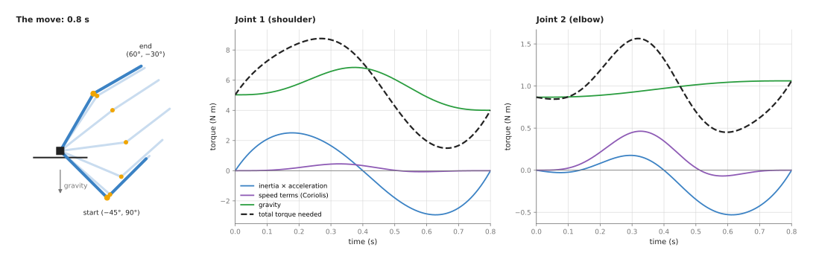
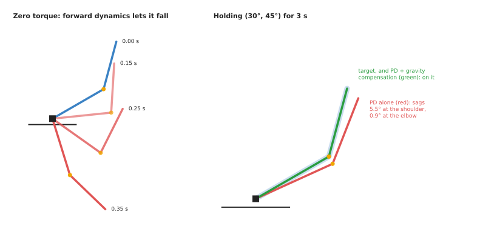
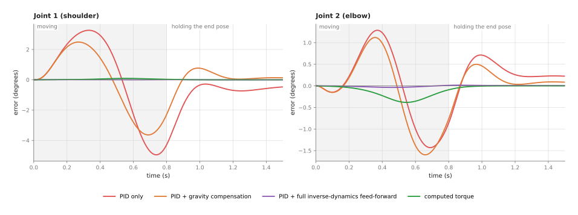
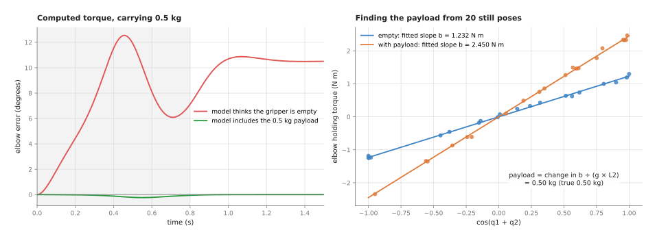

# Arm dynamics

This page explains **arm dynamics**: how the torques at an arm's joints and the
arm's motion are tied together. It answers five questions. What torque does each
joint need to make a given move? What happens to the arm when you send it a given
torque? How does a controller use those answers to hold the arm still and to follow
fast moves closely? What changes when the gripper picks up a load? And how do you
find out how heavy the parts of your own arm are?

It is for a reader who has read the page on [PID control](01_pid-control.md). That
page explains torque, error, feedback and feed-forward on a single joint, and
mentions gravity compensation in one paragraph. This page takes that paragraph and
builds it out for a whole arm. You do not need any mechanics beyond knowing that a
heavier thing is harder to speed up. Every number on this page comes from a real run
of the diagram script, `docs/diagrams/control_and_motion_2.py`, which simulates a
two-joint arm rather than drawing its curves by hand.

Dynamics is one of the most used techniques in arm software, even though most users
never see it. It runs inside the drives of every torque-controlled arm, inside every
arm simulator, and inside the collision detectors that stop an arm when it bumps a
person.

## Contents

1. [What this page answers](#1-what-this-page-answers)
2. [The idea in one sentence](#2-the-idea-in-one-sentence)
3. [How it works, step by step](#3-how-it-works-step-by-step)
   · [The arm in the examples](#the-arm-in-the-examples)
   · [The three parts of a joint torque](#the-three-parts-of-a-joint-torque)
   · [A worked example: one instant by hand](#a-worked-example-one-instant-by-hand)
   · [Inverse and forward dynamics](#inverse-and-forward-dynamics)
   · [Gravity compensation: holding still with no error](#gravity-compensation-holding-still-with-no-error)
   · [Feed-forward plus PID, and computed-torque control](#feed-forward-plus-pid-and-computed-torque-control)
   · [A payload changes the numbers](#a-payload-changes-the-numbers)
   · [Finding the arm's masses](#finding-the-arms-masses)
   · [The steps as pseudocode](#the-steps-as-pseudocode)
4. [Where it is used on a robot arm](#4-where-it-is-used-on-a-robot-arm)
5. [Where it is useful, and where it is not](#5-where-it-is-useful-and-where-it-is-not)
6. [Libraries that provide it](#6-libraries-that-provide-it)
7. [Why a dynamics model, and what it costs](#7-why-a-dynamics-model-and-what-it-costs)
8. [The learned alternative](#8-the-learned-alternative)
9. [Where to read next](#9-where-to-read-next)

---

## 1. What this page answers

The [PID control](01_pid-control.md) page drives one joint that has a fixed inertia
and a fixed pull of gravity. A real arm is not like that. The pull of gravity on the
shoulder depends on how far out the rest of the arm reaches. The effort needed to
speed up the shoulder depends on whether the elbow is bent or straight. And when one
joint swings fast, it pushes and pulls on the others.

A PID loop can still cope, because it corrects whatever error it measures. But it
only corrects an error after the error has appeared. On a fast move, that means the
arm always lags. The PID page's table of failures says what people add in that case:
a torque worked out from a model of the arm's dynamics.

This page is about that model. The **dynamics** of an arm are the rules that link
the forces on it to the way it moves. Once you have them, you can work out, before
the arm moves, most of the torque each motor will need. The feedback loop then only
has to clean up the small part the model got wrong.

---

## 2. The idea in one sentence

The torque each joint needs is the sum of three parts: the arm's inertia times the
acceleration you want, the pull of gravity on the arm in its current pose, and a
part that depends on how fast the joints are already turning.

Here is an everyday example: carrying a full shopping bag at arm's length. Just
holding the bag still takes effort, and more effort the further out your arm
reaches. That is the gravity part. Swinging the bag up quickly takes extra effort
at the start of the swing, and you must hold back at the end to stop it. That is the
inertia part. And if you spin round on the spot while holding the bag, you feel it
pull outwards, even though you are not trying to move your arm at all. That is the
speed part.

A robot arm's software does the same sums. It knows, from the arm's description,
how heavy each link is and where its weight sits. From that it works out all three
parts, for every joint, a thousand times a second.

---

## 3. How it works, step by step

### The arm in the examples

Every picture on this page uses the same arm. It has the same shape as the book's
two-link arm from Book 1's [arm overview](../../../01_robotics-intro/03_arm/01_overview.md),
but it is scaled down to the size of a real table-top arm, and it swings in a
**vertical** plane, so that gravity pulls on it.

- Link 1, from the shoulder to the elbow, is 0.30 m long and weighs 2.0 kg.
- Link 2, from the elbow to the tip, is 0.25 m long and weighs 1.0 kg.
- Each link is a plain rod, so its weight is centred at its middle. The point where
  a link's weight is centred is called its **centre of mass**.
- Angles are measured from the horizontal. Joint 1's angle, q1, is the angle of
  link 1. Joint 2's angle, q2, is the bend at the elbow, measured from link 1.
- The real arm has a little friction in each joint, 0.02 N m for every radian per
  second of speed. The controllers' model of the arm believes it is 0.016, which is
  20 per cent too low, because a measured friction value is never exact.
- The controllers run 1,000 times a second, as on the PID page.

### The three parts of a joint torque

Written as one line, the torque the two joints need is:

```
torque = M(q) × acceleration  +  c(q, speed)  +  g(q)
```

Here `q` stands for the two joint angles together. Each of the three parts has a
name.

**M(q) is the mass matrix.** It is the arm's inertia, as the joints feel it. A
**matrix** here is just a small table of numbers, two rows by two columns for two
joints. The top-left number is how hard it is to speed up the shoulder. It depends
on the pose. With the elbow straight, the shoulder feels 0.246 kg m². With the elbow
bent at a right angle, link 2 sits closer to the shoulder, and the shoulder feels
only 0.171 kg m². The two numbers off the diagonal say how much speeding up one joint
pushes on the other.

**c(q, speed) is the speed-dependent part.** It is often called the **Coriolis and
centrifugal** part, after the two effects it contains. The **centrifugal** effect is
the outward pull you feel when you spin a bag. The **Coriolis** effect is a sideways
push that appears when one joint turns while another joint changes the distance from
its axis. Both are zero when the arm is still, and both grow with the square of the
speed.

**g(q) is the gravity part.** It is the torque each joint needs just to hold the arm
up in this pose. It is largest when the arm reaches out flat and zero when the arm
points straight up.

The picture below splits the torque into these three parts for one fast move. The
arm swings from (−45°, 90°) to (60°, −30°) in 0.8 seconds, along a smooth path that
starts and ends at rest, like the ones on the
[trajectory generation](02_trajectory-generation.md) page.



The left panel shows the move. The two charts show, for each joint, the three parts
as coloured lines and their sum as a dashed black line.

Read the shoulder chart first. Gravity is the largest part the whole time. It is
between 4.0 and 6.8 N m. The inertia part is between −2.9 and +2.5 N m. It is
positive while the arm speeds up and negative while it slows down. The speed part is
small here, at most 0.45 N m. The total the shoulder needs goes from 1.5 up to
8.8 N m.

The elbow chart looks different. Its gravity part is small and steady, about 0.9 to
1.1 N m. The speed part reaches 0.46 N m, which is almost as large as the inertia
part and half of gravity. So on the lighter, outer joints of an arm, the speed part
cannot be ignored on a fast move.

### A worked example: one instant by hand

Here is the torque at one instant, worked out by hand. The arm is at q1 = 30° and
q2 = 45°. The shoulder is turning at 1 rad/s and the elbow at 2 rad/s. We want the
shoulder to speed up at 3 rad/s² and the elbow to slow down at 2 rad/s². The numbers
below come from the script.

First the mass matrix at this pose:

```
M = | 0.2239  0.0473 |
    | 0.0473  0.0208 |       (kg m²)
```

The inertia part is M times the acceleration:

- shoulder: 0.2239 × 3 + 0.0473 × (−2) = 0.5769 N m
- elbow: 0.0473 × 3 + 0.0208 × (−2) = 0.1004 N m

The speed part uses one number, h = m2 × L1 × (distance to link 2's centre of mass)
× sin(q2) = 1.0 × 0.30 × 0.125 × sin 45° = 0.0265 kg m²:

- shoulder: −h × (2 × 1 × 2 + 2²) = −0.0265 × 8 = −0.2121 N m
- elbow: h × 1² = 0.0265 N m

The gravity part:

- elbow: 1.0 kg × 0.125 m × 9.81 × cos(30° + 45°) = 0.3174 N m
- shoulder: (2.0 × 0.15 + 1.0 × 0.30) × 9.81 × cos 30° + 0.3174 = 5.4148 N m

The totals are 0.5769 − 0.2121 + 5.4148 = **5.7796 N m** at the shoulder and
0.1004 + 0.0265 + 0.3174 = **0.4443 N m** at the elbow. More than nine tenths of the
shoulder's torque, even in the middle of a move, is holding the arm up.

The script also computes the same torques a second way, with the
**recursive Newton–Euler algorithm**. It works outwards from the base, link by
link, to find each link's acceleration. Then it works back inwards, adding up the
force each joint must pass on to the links beyond it. That is the method most
libraries use, because it works for any number of joints. It gives 5.7796 and
0.4443 too, and along the whole move the two methods never differ by more than
0.000000000000004 N m.

### Inverse and forward dynamics

The same equation can be used in two directions.

**Inverse dynamics** goes from motion to torques. You give it the angles, the speeds
and the accelerations you want, and it gives back the torque each joint needs. The
worked example above is inverse dynamics. A controller uses it to decide what to
send to the motors.

**Forward dynamics** goes from torques to motion. You give it the angles, the speeds
and the torques, and it gives back the accelerations that will result. To get them,
it solves the equation for the acceleration:

```
acceleration = M(q)⁻¹ × (torque − c(q, speed) − g(q))
```

The `⁻¹` means "undo the matrix", which a program does by solving two equations in
two unknowns. Fed the 5.7796 and 0.4443 N m from the worked example, forward
dynamics gives back exactly 3 and −2 rad/s².

Forward dynamics is what a **simulator** does. It starts from a pose, works out the
accelerations, moves the arm on by a tiny step of time, and repeats. The left panel
of the next picture shows forward dynamics with zero torque: the arm starts still at
(30°, 45°) and the motors are switched off.



The arm does not simply drop like a stiff stick. After 0.15 s the shoulder has
fallen to 5.9°, but the elbow has bent up from 45° to 80.6°. After 0.25 s the
shoulder is at −35.4° and the elbow at 98.7°. The falling upper link flings the lower
link round. That folding comes from the off-diagonal numbers in the mass matrix and
from the speed part. A controller that treats each joint on its own knows nothing
about it.

### Gravity compensation: holding still with no error

When the arm is still, the speed and the acceleration are both zero. The equation
then shrinks to one part:

```
torque needed to hold still = g(q)
```

Adding g(q) to the controller's output is called **gravity compensation**. The PID
page describes it in one paragraph. The right panel of the picture above shows what
it does.

A proportional-derivative (PD) controller, meaning a PID with no integral term, holds
the arm at (30°, 45°) for 3 seconds. The pale blue arm is the target. Without gravity
compensation, the red arm sags 5.5° at the shoulder and 0.9° at the elbow. A PD
controller only pushes when there is an error, so it must keep an error to hold the
arm up, just as the P controller did on the PID page. With gravity compensation, the
green arm sits exactly on the target, with no error at all. The torque it sends is
5.4148 N m at the shoulder and 0.3174 N m at the elbow, which is g(q) at that pose.
The feedback part of the controller has nothing left to do.

An integral term could also remove the sag, by slowly finding the same 5.4 N m. But it
takes time to find it, and it must find it again every time the pose changes, because
g(q) changes with the pose. Gravity compensation gives the right answer at every pose
at once.

Gravity compensation is also how a **hand-guided** arm works. If the controller sends
g(q) and nothing else, the arm floats. A person can push it anywhere and it stays
where it is left. This is the "free drive" or "teach" mode of many arms.

### Feed-forward plus PID, and computed-torque control

On a moving arm there are two common ways to use the whole model.

The first is **feed-forward plus PID**. The controller works out the torque the
planned motion needs, with inverse dynamics, and adds it to the output of an
ordinary PID loop on each joint. The model supplies nearly all of the torque. The
PID supplies the rest.

The second is **computed-torque control**. The controller works out, from the
errors, the acceleration it wants each joint to have: the planned acceleration, plus
a spring-like pull towards the planned angle, plus a damper-like pull towards the
planned speed. It then uses inverse dynamics, at the arm's measured pose and speed, to
turn that acceleration into torques. Because the mass matrix is inside the loop, the
same two gains give the same behaviour at every pose. In this example both joints are
tuned to respond at 20 radians per second.

The picture below runs the same 0.8-second move four times, each with a different
controller, and shows the error of each joint.



The grey area is the move itself. The white area after it is 0.7 seconds of holding
the end pose. The PID-only run starts with its integral already holding the arm up at
the start pose, as it would after standing there for a while.

The table below collects the four runs. Each row is one controller. The columns give
the largest error of each joint during the move, and the error of each joint at the
end of the hold.

| Controller | Largest shoulder error | Largest elbow error | Shoulder error at the end | Elbow error at the end |
| --- | --- | --- | --- | --- |
| PID only | 4.95° | 1.43° | 0.47° | 0.22° |
| PID + gravity compensation | 3.63° | 1.60° | 0.13° | 0.09° |
| PID + full inverse-dynamics feed-forward | 0.009° | 0.036° | 0.003° | 0.006° |
| Computed torque | 0.092° | 0.38° | less than 0.0001° | less than 0.0001° |

Gravity compensation alone helps the shoulder and the hold, but it does not help much
while the arm is moving; at the elbow it is even slightly worse. Most of the moving
error comes from the inertia and speed parts, which gravity compensation leaves out.
The two controllers that use the whole model do much better. At the shoulder they cut
the largest error by 50 to 500 times. At the elbow, feed-forward cuts it by 40 times
and computed torque by about 4 times. The error they leave comes from the friction
value that is 20 per cent too low. The computed-torque run shows it more than the
feed-forward run, because it has no integral term to slowly push it away.

### A payload changes the numbers

A **payload** is whatever the gripper is holding. It adds mass at the very end of the
arm, where it has the most leverage. A 0.5 kg payload at the tip of this arm is only
one sixth of the arm's own 3 kg. Yet it raises the gravity torque at (30°, 45°) from
5.41 to 7.01 N m at the shoulder, and from 0.32 to 0.63 N m at the elbow: the elbow's
number doubles. On the 0.8-second move, the largest torque the shoulder needs rises
from 8.8 to 12.1 N m.

If the controller's model does not know about the payload, it sends the wrong torque.
The left panel below runs computed-torque control on the move with the 0.5 kg payload
in the gripper.



When the model thinks the gripper is empty, the elbow falls behind by up to 12.5°
during the move, and it is still 10.5° low at the end of the hold. The shoulder ends
1.1° off. When the model is told about the payload, the largest elbow error is 0.24°
and the end error is zero.

This is why arm makers ask you to enter the payload's mass and where its centre of
mass sits, and why a gripper that picks up objects of different weights needs the
controller to be told each time, or a feedback loop with an integral term to absorb
the difference.

### Finding the arm's masses

All of this needs the masses, the centres of mass and the inertias of the links.
The arm maker's description gives values, but they are often rounded, and they do
not include your gripper, your cables or your payload. Measuring them on the real
arm is called **identification**.

The key fact that makes it easy is this: the torque is a sum of known terms, each
multiplied by an unknown number made from the masses. For the gravity part of this
arm, it is:

```
g1 = a × cos(q1) + b × cos(q1 + q2)
g2 =               b × cos(q1 + q2)
```

Here a = (m1 × lc1 + m2 × L1) × 9.81 and b = m2 × lc2 × 9.81, where lc1 and lc2 are
the distances from each joint to its link's centre of mass. The cosines can be worked
out from the measured angles. Only a and b are unknown. That is a straight-line fit,
the same problem the [least-squares fitting](../../04_fitting-and-estimation/02_most-used/01_least-squares-fitting.md)
page solves.

The right panel of the picture shows it done. The arm stops at 20 random poses and
records the torque each joint uses to hold still, with sensor noise of 0.05 N m added.
Each dot is one pose. Plotted against cos(q1 + q2), the elbow's torques lie on a
straight line through zero whose slope is b. The fit gives b = 1.232 N m with the
gripper empty (the true value is 1.226) and b = 2.450 N m with the payload (true
2.453). The payload's mass is the change in b divided by 9.81 × 0.25 m, which gives
**0.50 kg**, the true value.

The inertias need more work, because they only show up when the arm accelerates. The
usual method runs the arm along a special path that shakes every joint at several
speeds, called an **exciting trajectory**, records the angles and motor currents, and
fits all the unknowns at once with least squares. The
[system identification](../../04_fitting-and-estimation/03_also-used/01_system-identification.md)
page explains this in general. Friction is fitted at the same time, with its own
unknown numbers.

### The steps as pseudocode

The pseudocode below uses plain names and works in any language. The first part is
inverse dynamics for the two-joint arm. A general library does the same with the
recursive Newton–Euler algorithm, for any number of joints.

```
inverse_dynamics(q, speed, accel):
    M      = mass_matrix(q)                 # 2 × 2 table, depends on q2
    h      = m2 * L1 * lc2 * sin(q2)
    c      = [ -h * (2 * speed1 * speed2 + speed2^2),
                h * speed1^2 ]
    g2     = m2 * lc2 * 9.81 * cos(q1 + q2)
    g      = [ (m1 * lc1 + m2 * L1) * 9.81 * cos(q1) + g2,  g2 ]
    return M * accel + c + g
```

The second part is forward dynamics, as a simulator uses it: one small step of time.

```
simulate_one_step(q, speed, torque, step):
    accel = solve( mass_matrix(q), torque - c(q, speed) - g(q) )
    speed = speed + accel * step
    q     = q + speed * step
    return q, speed
```

The third part is the two controllers, run once per tick.

```
every tick:
    (q_plan, speed_plan, accel_plan) = trajectory at this time
    (q, speed) = read_encoders()
    error      = q_plan - q
    error_rate = speed_plan - speed

    # feed-forward plus PID
    torque = inverse_dynamics(q_plan, speed_plan, accel_plan) + pid(error)

    # or computed torque
    wanted = accel_plan + Kp * error + Kd * error_rate
    torque = inverse_dynamics(q, speed, wanted)

    send torque to the motors
```

Gravity compensation alone is the last line of `inverse_dynamics` with only `g`
returned, added to a PD or PID output.

---

## 4. Where it is used on a robot arm

**Inside the drives of torque-controlled arms.** Collaborative arms such as the Franka
arms and the KUKA LBR iiwa run gravity compensation and dynamics feed-forward inside
their controllers. libfranka's `franka::Model` class gives a program the arm's mass
matrix, its Coriolis torques and its gravity torques at the current pose, so that a
user's own torque controller can use them.

**Hand guiding and teaching.** The "free drive" button on many arms switches to pure
gravity compensation. The arm holds itself up, and a person moves it by hand to teach
it poses.

**Impedance control.** An impedance controller makes the arm act like a soft spring.
It only works if gravity is compensated, or the soft arm sags. The
[impedance and force control](../03_also-used/01_impedance-and-force-control.md) page
says that if the gravity model is wrong the arm drifts as soon as it is made soft;
this page is where that model comes from.

**Collision detection.** A collision detector compares the torque each joint is
using with the torque inverse dynamics says it should need. A large gap means
something the model does not know about is pushing on the arm, such as a person.
Book 6's [collision and failure detection](../../../06_learned-models/09_touch-and-body-models/02_most-used/02_collision-and-failure-detection.md#31-the-gap-between-expected-and-measured)
page calls this the "expected torque". The better the model, the lower the alarm
line can be set. The [safety monitoring](04_safety-monitoring.md) page covers the
checks that act on such alarms.

**Simulators.** Gazebo, MuJoCo, Drake and Isaac Sim all run forward dynamics, a
thousand or more times per simulated second, to move a simulated arm. A policy trained
in simulation, as described in Book 6, only works on the real arm if the simulator's
masses are close to the real ones.

**Checking a trajectory before running it.** Inverse dynamics along a planned move
gives the torque each motor will need. If that is above a motor's limit, the move
must be slowed down before it is sent. Time-parameterisation tools such as TOPP-RA,
named on the [trajectory generation](02_trajectory-generation.md) page, can take torque
limits for exactly this reason.

**Payload checks.** After a grasp, the arm can hold still for a moment and compare its
joint torques with the gravity model. The difference tells it the mass of what it
picked up, as in the identification example. A result of zero means the grasp missed.

---

## 5. Where it is useful, and where it is not

A dynamics model helps most on fast moves, heavy arms, soft (impedance) control and
collision detection. It helps least on slow moves of a stiff, geared, position-controlled
arm, where the drive's own PID loops already keep the error small.

The table below lists the common failures. Each row gives the situation, the sign you
would see, and what people use instead or add.

| Situation | The sign you would see | What people use instead or add |
| --- | --- | --- |
| The payload in the model is wrong or missing | the arm sags or lags after a grasp; false collision alarms while carrying a load | set the payload in the controller after each grasp; estimate it from the holding torques; keep an integral term |
| Friction in the gearboxes is large, as in most geared arms | the model's torque is right in theory but the arm still lags, worst when it starts or reverses | identify a friction model with the masses; a [learned arm model](../../../06_learned-models/09_touch-and-body-models/03_also-used/02_learned-arm-models.md) for the part physics leaves out |
| Cables, hoses and springs pull on the arm | a steady error that changes with pose but not with load | identify the pull as an extra term; a learned correction |
| The link masses in the description are rounded or wrong | gravity compensation leaves a small sag that changes with pose | identification from still poses and an exciting trajectory |
| The links or gearboxes bend | the arm rings after fast moves even with an accurate model | lower speeds and smoother [trajectories](02_trajectory-generation.md); a flexible-joint model |
| The arm touches something | the model's torque no longer matches, because the contact force is missing from it | [impedance and force control](../03_also-used/01_impedance-and-force-control.md), and a force sensor |
| The arm only accepts position commands | there is no place to send a computed torque | use the dynamics only for checks and collision detection; leave control to the drive |

The last row matters in practice. Many industrial arms, and most low-cost ones, only
accept joint positions. Their drives do their own control inside. On such an arm you
can still use dynamics to check torques and detect collisions, but you cannot send
the controller's torque yourself.

---

## 6. Libraries that provide it

You almost never write dynamics by hand for a real arm. You give a library the arm's
description, usually a Unified Robot Description Format (URDF) file, which lists each
link's mass, centre of mass and inertia. The library does the rest. The table below
lists well-known ones. Each row gives the library, the languages it is used from, the
functions to call, and a note.

| Library | Languages | Functions or classes | Note |
| --- | --- | --- | --- |
| Pinocchio | C++, Python | `rnea` (inverse dynamics), `aba` (forward dynamics), `crba` (mass matrix), `computeGeneralizedGravity`, `nonLinearEffects`, `computeJointTorqueRegressor` | fast and widely used; the regressor function gives the table of known terms used for identification |
| Drake | C++, Python | `MultibodyPlant.CalcInverseDynamics`, `CalcMassMatrix`, `CalcBiasTerm`, `CalcGravityGeneralizedForces`; the `InverseDynamicsController` system | a full simulator and planning toolbox; note that `CalcGravityGeneralizedForces` returns the force gravity applies, so the holding torque is its negative |
| KDL (Orocos Kinematics and Dynamics Library) | C++, Python | `ChainIdSolver_RNE` (inverse dynamics), `ChainDynParam` with `JntToMass`, `JntToCoriolis`, `JntToGravity` | older but still common in ROS code |
| MuJoCo | C, Python | `mj_inverse`, `mj_step`; the `qfrc_bias` field holds gravity plus speed terms | a simulator, often used for learning; its inverse dynamics is used for checks |
| RBDL (Rigid Body Dynamics Library) | C++, Python | `InverseDynamics`, `ForwardDynamics`, `NonlinearEffects` | a small library with the same algorithms |
| libfranka | C++ | `franka::Model` with `mass`, `coriolis`, `gravity` | the Franka arm's own model, identified by the maker |

For identification there are also dedicated tools built on these, but the core is a
least-squares fit, which NumPy's `numpy.linalg.lstsq` does in one call, as the diagram
script shows.

---

## 7. Why a dynamics model, and what it costs

A dynamics model is the set of equations that link the torques at the joints to the
arm's motion. It gives a controller most of the torque each joint needs before any
error appears, holds the arm still against gravity with no error at all, and lets a
simulator predict what the real arm will do.

The obvious alternative is to use no model and let the feedback loop do all the work,
with higher gains or a stronger integral term. That is what most position-controlled
arms do, and on slow moves it works. But feedback only corrects an error after it has
appeared, so the error grows with speed. In the example on this page, PID alone left a
4.95° error at the shoulder on a 0.8-second move. Adding the model cut it to 0.009°,
with the same PID gains. Higher gains would shrink the error too, but they make the
arm stiff and noisy, and they push harder on anything it touches, which is the wrong
direction for an arm that works near people.

The second alternative is a learned model of the arm.
[Section 8](#8-the-learned-alternative) says why the usual practice is to use both.

The costs are these. You need the masses, centres of mass and inertias of every link,
and the maker's values may be rough. You must tell the controller about every payload.
The model leaves out friction, cables and bending unless you add them. The equations
are hard to check by hand beyond two or three joints, so you depend on a library and on
a correct URDF file. And the full benefit needs an arm that accepts torque commands,
which many arms do not.

---

## 8. The learned alternative

Book 6's
[learned arm models](../../../06_learned-models/09_touch-and-body-models/03_also-used/02_learned-arm-models.md)
are the learned version of this page. Most keep this physics model and add a small
network that learns only what is left over: the gearbox friction, cable pull and
wear that the equations leave out. A learned correction wins when those effects do
not fit a simple number, such as friction that changes with speed and temperature,
and it trains on the arm's own recordings, which are cheap and safe to collect. The
physics model still wins as the base, because it needs only a handful of numbers
per link and gives sensible answers everywhere, while a learned model needs hours
of varied data and can give strange answers for moves it has not seen. That is why
the usual practice is to keep the physics model and let a learned model correct
it. Book 6's
[learned dynamics models](../../../06_learned-models/08_world-models/02_most-used/01_learned-dynamics-models.md)
do a wider job: they predict how the whole scene moves when the arm acts, not just
the arm.

---

## 9. Where to read next

- [PID control](01_pid-control.md) is the feedback loop that runs on top of the
  model on this page and cleans up what the model gets wrong.
- [Trajectory generation](02_trajectory-generation.md) makes the planned angles,
  speeds and accelerations that inverse dynamics turns into torques.
- The next page, [safety monitoring](04_safety-monitoring.md), covers the software
  checks that watch the arm's limits, including the torque limits this page computes.
- [Impedance and force control](../03_also-used/01_impedance-and-force-control.md)
  uses gravity compensation to make the arm soft on contact.
- [Least-squares fitting](../../04_fitting-and-estimation/02_most-used/01_least-squares-fitting.md)
  and [system identification](../../04_fitting-and-estimation/03_also-used/01_system-identification.md)
  explain the fitting used to find the arm's masses.
- Book 3's [controlling the move](../../../03_frameworks/03_arm-movement/04_controlling-the-move.md#4-position-stiffness-and-force)
  shows where position, stiffness and torque control sit in ROS 2.
