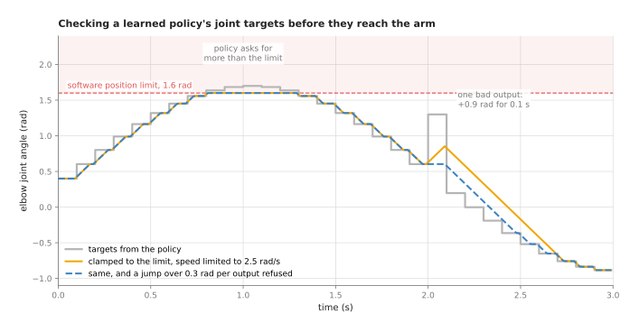
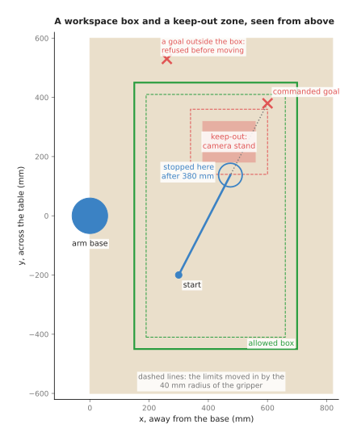
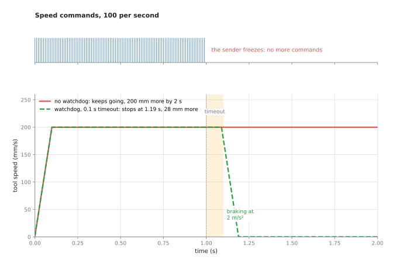
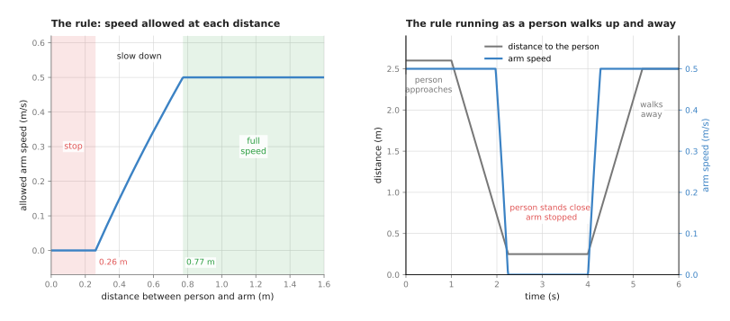

# Safety monitoring

This page explains the software layer that watches every command on its way to
the arm and stops or limits the ones that are unsafe. It answers five questions.
What does the layer check? How does each check work, with real numbers? How do
you check the commands of a learned policy, which can output anything? What
happens when the commands stop arriving? And what is this layer **not**: where
does it stop, and where must certified safety equipment take over?

It is for a reader who has read the [PID control](01_pid-control.md) and
[trajectory generation](02_trajectory-generation.md) pages, or who knows what a
joint limit and a speed limit are. It helps to have read the
[sensor streams](../../04_fitting-and-estimation/02_most-used/04_sensor-streams.md)
page, because a safety check is a threshold on a stream. Every number on this
page comes from a real run of the diagram script,
`docs/diagrams/sensor_streams_and_safety.py`.

**Read this first.** Nothing on this page is a certified safety function. A
certified safety function is one that has been designed, tested and approved to
a safety standard, and that runs on hardware built for it. The software layer
described here runs on an ordinary computer, in ordinary code. It catches
mistakes and makes the arm better behaved. It must never be the only thing
between the arm and a person. Section 7 draws this line in full.

## Contents

1. [What this page answers](#1-what-this-page-answers)
2. [The idea in one sentence](#2-the-idea-in-one-sentence)
3. [How it works, step by step](#3-how-it-works-step-by-step)
   · [Where the layer sits](#where-the-layer-sits)
   · [Joint limits and clamping](#joint-limits-and-clamping)
   · [Checking a learned policy's commands](#checking-a-learned-policys-commands)
   · [Workspace boxes and keep-out zones](#workspace-boxes-and-keep-out-zones)
   · [A watchdog for commands that stop arriving](#a-watchdog-for-commands-that-stop-arriving)
   · [Speed and separation monitoring](#speed-and-separation-monitoring)
   · [Power and force limiting](#power-and-force-limiting)
   · [The steps as pseudocode](#the-steps-as-pseudocode)
4. [Where it is used on a robot arm](#4-where-it-is-used-on-a-robot-arm)
5. [Where it is useful, and where it is not](#5-where-it-is-useful-and-where-it-is-not)
6. [Libraries that provide it](#6-libraries-that-provide-it)
7. [This is not a certified safety function](#7-this-is-not-a-certified-safety-function)
8. [Why a software safety layer, and what it costs](#8-why-a-software-safety-layer-and-what-it-costs)
9. [The learned alternative](#9-the-learned-alternative)
10. [Where to read next](#10-where-to-read-next)

---

## 1. What this page answers

An arm does whatever its commands say. The commands come from a planner, a
teleoperation joystick, a visual servo loop or a learned policy. Any of them can
be wrong. A planner can be given a bad goal. A network cable can drop. A learned
policy can output a target a metre away for no reason anyone can see.

A **safety monitor** is a small piece of code between the command sources and
the arm's controller. It checks every command against a list of rules. If a
command breaks a rule, the monitor limits it, refuses it, or stops the arm. It
also watches the arm's sensors, so it can stop the arm when something is
happening that no command asked for.

The rules fall into six groups, and section 3 takes them in turn.

- Joint position, speed and torque limits.
- Checks on a learned policy's output.
- A workspace box, and keep-out zones inside it.
- A watchdog that stops the arm when commands stop arriving.
- Speed and separation monitoring: slowing down as a person comes closer.
- Power and force limiting: keeping contact gentle.

---

## 2. The idea in one sentence

**Check every command against simple, fixed rules just before it reaches the
arm, and when a rule is broken, prefer stopping and saying so over quietly
changing the command.**

Here is an everyday example. A driving instructor's car has a second brake pedal
on the passenger side. The learner does the driving. The instructor does not
steer, and does not try to drive better than the learner. The instructor watches
for a few simple things: too fast, too close, the wrong side of the road. When
one happens, the instructor brakes. The second pedal is not a replacement for
seat belts and airbags, which work even if both people make a mistake. A safety
monitor is the instructor's pedal. The certified safety functions in section 7
are the seat belts.

---

## 3. How it works, step by step

### Where the layer sits

The monitor sits after every command source and before the controller. The Book 3
page on [controlling the move](../../../03_frameworks/03_arm-movement/04_controlling-the-move.md)
describes that controller layer in ROS 2. Two facts from that page matter here.

- The standard trajectory controller checks less than people assume. Its
  tolerances default to zero, and zero means "do not check". So by default
  nothing compares where a joint is with where it should be during a move.
  Its [section 3](../../../03_frameworks/03_arm-movement/04_controlling-the-move.md#3-what-the-move-failed-actually-means)
  explains this. A monitor that checks the **following error**, the gap between
  the commanded and the measured position, fills that gap.
- Speed scaling is a request, not an enforcement. Its
  [section 8](../../../03_frameworks/03_arm-movement/04_controlling-the-move.md#8-speed-and-acceleration-scaling)
  says so. A software speed limit is also a request, only a more careful one.
  Enforcement belongs to the certified functions in the robot's own controller.

The monitor runs at the control rate, often 100 to 1,000 times a second. Each
check must take a tiny, fixed amount of time, so the checks are kept simple:
comparisons, clamps and a few multiplications.

### Joint limits and clamping

Every joint has a range it can move through, a top speed, and a largest torque.
A **torque** is a turning force, measured in newton metres (N m). The arm maker
gives the hardware limits. A monitor uses **software limits** set a little inside
them, so that the software stops the joint before the hardware has to.

There are two ways to apply a limit. **Clamping** replaces a value outside the
range with the nearest value inside it. **Refusing** rejects the command, keeps
the arm where it is, and reports a fault. Clamping keeps the arm moving.
Refusing tells you something is wrong. Book 1's
[joint class](../../../01_robotics-intro/01_python-and-numpy/01_python-basics.md#11-classes-a-joint-that-knows-its-limits)
shows both, and the Book 3 gripper pages prefer refusing when a force cap is
exceeded.

A speed limit is applied by **rate limiting**: the target may move at most
`speed limit × time step` from one tick to the next. At 2.5 rad/s and 100 ticks
a second, that is 0.025 rad per tick.

### Checking a learned policy's commands

A learned policy is a neural network that turns camera pictures and joint angles
into commands. Book 6's
[movement models](../../../06_neural-network-models/05_movement-models/01_overview.md)
chapter describes them. Unlike a planner, a policy has no built-in idea of the
arm's limits or of obstacles. Book 3's
[learned motion](../../../03_frameworks/03_arm-movement/05_learned-motion.md#5-the-four-things-a-policy-does-not-have)
page lists what it lacks. So its output must be checked every time.

The picture below shows one elbow joint driven by a policy. The policy sends a
new target 10 times a second. The monitor runs 100 times a second.



Two things go wrong in the policy's output.

- Around 1 s, it asks for up to 1.70 rad, past the 1.6 rad software limit. Both
  monitored versions clamp this, and the joint stops at 1.60 rad.
- At 2.0 s, one output jumps 0.9 rad above its neighbours for 0.1 s. The biggest
  step in the raw targets is 1.10 rad in one tick.

The orange line clamps and rate limits. It never moves faster than 2.5 rad/s, so
its biggest step is 0.025 rad per tick. But it still moves towards the bad
target, and the joint goes 0.25 rad (about 14 degrees) the wrong way before the
next good output arrives. Rate limiting has turned a jump into a smooth,
believable mistake.

The blue dashed line adds one more rule. It compares each new output with the
last good one. A step of more than 0.3 rad per output is refused, the joint
holds the last good target, and a fault is logged. It logs exactly one fault, at
2.0 s, and the joint never moves towards the bad target.

This is why a monitor for a learned policy checks more than limits. The usual
checks are these.

1. The output is a real number: no NaN (not a number) and no infinity.
2. The output is fresh: its time stamp is recent, so it was computed from a
   recent picture.
3. Each joint target is inside its limits.
4. The step from the last accepted output is small enough.
5. The tool position it implies is inside the workspace box and outside every
   keep-out zone. The tool position is computed from the joint targets with
   forward kinematics.
6. The expected force is within limits, and the measured force is too.

Book 6's
[safety checks around a model](../../../06_neural-network-models/09_making-models-work-on-an-arm/02_most-used/02_running-a-model-on-a-robot.md#7-safety-checks-around-a-model)
gives the same list from the model's side.

### Workspace boxes and keep-out zones

A **workspace box** is a region the tool must stay inside. A **keep-out zone** is
a region inside it that the tool must never enter, such as a camera stand, a
fixture, or the part of the table where a person works. Both are usually boxes,
because the check is then a few comparisons.

The tool is not a point. So each check treats the gripper as a sphere around the
tool point, 40 mm in radius here. That is the same as moving the box's walls in
by 40 mm and the keep-out zone's walls out by 40 mm.



In the picture, the box runs from 150 to 700 mm away from the base and from −450
to 450 mm across. The camera stand's keep-out zone runs from 380 to 560 mm and
from 180 to 320 mm. A command asks the tool to go in a straight line from
(300, −200) to (600, 380). The whole path is 653 mm long. The goal itself is
inside the box, so a check on the goal alone would pass.

The monitor checks points every 5 mm along the path. At 380 mm, the gripper's
sphere would come within 40 mm of the keep-out zone, so the monitor stops the
tool there, at (475, 138). A second goal, at (260, 530), is outside the box. It
is refused before the arm moves at all.

A path planner with a collision model also avoids the camera stand, as the
[planning and search](../../06_planning-and-search/01_overview.md) chapter
explains. The monitor is still useful, because it also checks commands that did
not come from the planner: a joystick, a servo loop, a policy.

### A watchdog for commands that stop arriving

Many command sources send a stream: "move at this speed" 100 times a second. If
the sender freezes or the network drops, the last command may stay in force. The
arm then keeps going at the last speed.

A **watchdog** is a timer that is reset by every new command. If the timer runs
past a **timeout** with no new command, the watchdog stops the arm. The name
comes from a dog that barks when it stops hearing its owner.



In the picture, the tool is commanded at 200 mm/s. The sender freezes at 1.0 s.
Without a watchdog, the tool has moved 200 mm further by 2.0 s, and it would keep
going until something else stopped it. With a 0.1 s timeout and braking at 2
m/s², the tool stops at 1.19 s, 28 mm after the last command arrived.

The timeout is a trade. A short one stops the arm sooner, but it also stops it
whenever the computer is briefly busy. A common choice is a few times the normal
gap between commands. The braking distance after the timeout must also fit
inside the free space around the arm.

A watchdog can run in both directions. The arm's driver watches the computer,
and the computer's monitor watches the arm's state messages. If the state
messages stop, the monitor cannot see the arm, and it should stop sending motion.

### Speed and separation monitoring

**Speed and separation monitoring** slows the arm as a person comes closer, and
stops it when the person is too close. It needs a sensor that measures where
people are, such as a laser scanner on the floor or a camera above the cell.

The rule comes from one question: if the person walked straight at the arm now,
could the arm stop before they met? The gap needed is the sum of four distances:

1. how far the person walks while the system notices and while the arm brakes;
2. how far the arm moves before it starts braking;
3. how far the arm moves while braking;
4. a margin for sensor error and the size of a hand or arm.

The picture below uses illustrative numbers, not numbers from any standard. The
person walks at 1.6 m/s. The sensor and software take 0.1 s to react. The arm
brakes at 2 m/s². The margin is 0.1 m. The arm's top speed is 0.5 m/s.



At full speed the arm needs a gap of 0.77 m. At a standstill it still needs
0.26 m, because the person keeps walking while the system reacts. In between,
the monitor chooses the highest speed whose gap fits. At 0.6 m, that is
about 0.34 m/s. On the right, a person walks up from 2.6 m. The arm starts slowing at
1.98 s and is stopped at 2.25 s, when the person is 0.25 m away. When they walk
away, it speeds up again.

A software version of this is useful for keeping a cell running smoothly. But
the version that protects people must use a safety-rated sensor and a
safety-rated controller, with the distances and speeds worked out by the method
in the standards. Section 7 says more.

### Power and force limiting

**Power and force limiting** is the other way to work near people. The arm is
allowed to touch a person, but only gently: the force and the pressure of any
contact stay below set values. Collaborative arms, often called cobots, are
built for this. They are light, have rounded shapes, and sense force in their
joints or estimate it from the motor currents.

Two things decide how hard a contact is. The first is the force the controller
is pushing with. The [impedance and force control](../03_also-used/01_impedance-and-force-control.md#force-limits-and-direct-force-control)
page shows how to cap it. The second is the energy of the moving arm when it
meets something. Kinetic energy grows with the square of the speed. A moving
mass of 2 kg at 0.25 m/s carries 0.0625 J. At 1 m/s it carries 1 J, sixteen
times as much. This is why power and force limiting always comes with a speed
limit.

A software force monitor watches the wrist force or the gap between the expected
and the measured joint torques. It uses a filtered signal, a threshold with
hysteresis, and a short debounce, as the
[sensor streams](../../04_fitting-and-estimation/02_most-used/04_sensor-streams.md#thresholds-that-do-not-flicker-hysteresis-and-debouncing)
page explains. The debounce must be short, because every millisecond of waiting
lets the force grow. Book 6's
[collision and failure detection](../../../06_neural-network-models/08_touch-and-body-models/02_most-used/02_collision-and-failure-detection.md)
page covers the expected-against-measured torque method, and the learned
versions of it.

### The steps as pseudocode

```
every control tick (for example 100 times a second):
    now = current time

    # the watchdog
    if now - last_command.stamp > command_timeout:     stop("no commands")
    if now - last_state.stamp   > state_timeout:       stop("cannot see the arm")

    cmd = last_command
    # checks on the command itself
    if cmd has NaN or infinity:                        refuse(cmd, "not a number")
    if any |cmd.q - last_good.q| > jump_limit × outputs_since_good:
                                                       refuse(cmd, "jump")
    q = clamp(cmd.q, soft_lower, soft_upper)
    q = last_sent.q + clamp(q - last_sent.q, -v_max × dt, v_max × dt)

    # where the tool would be
    tool = forward_kinematics(q)
    if tool is not inside (workspace_box shrunk by tool_radius):  refuse(cmd, "outside box")
    for zone in keep_out_zones:
        if distance(tool, zone) < tool_radius:          refuse(cmd, "keep-out")

    # what the sensors say
    if |q_measured - q_commanded| > following_limit:   stop("following error")
    if force_flag(filtered_force) is on:               stop("force")
    v_allowed = speed_for_gap(distance_to_nearest_person)
    q = scale step so that tool speed <= v_allowed

    send q; last_sent = q

refuse(cmd, reason): hold last good target, log reason with time stamp
stop(reason):        brake along the path, then hold; log; wait for a person to reset
```

---

## 4. Where it is used on a robot arm

A software safety layer is used almost everywhere an arm moves under program
control. Here are the common places.

- **Running a learned policy.** Every output is checked for limits, jumps and
  workspace before it reaches the arm. The first runs are made slowly with a
  person holding the emergency stop, as Book 6's
  [running a model on a robot](../../../06_neural-network-models/09_making-models-work-on-an-arm/02_most-used/02_running-a-model-on-a-robot.md#7-safety-checks-around-a-model)
  page describes.
- **Teleoperation.** A person steers the arm with a joystick or a second arm. A
  watchdog stops the arm if the link drops, and a workspace box stops the person
  steering it into the table.
- **Visual servoing.** A camera loop sends a new target every picture. A
  watchdog catches a camera that stops, and a jump check catches a wrong
  detection.
- **Contact tasks.** Insertion and polishing run with a force limit that stops
  the task, not just the motion, when it trips.
- **Development and testing.** Tight software limits and a small workspace box
  let people try new code without risking the arm or the table.
- **Shared cells.** A software speed-and-separation rule slows the arm early and
  smoothly, so that the certified function, set further in, rarely has to stop
  it hard.
- **Checking the controller's work.** A following-error check catches an arm
  that has hit something, a joint that is slipping, or a controller whose
  tolerances were left at zero.

---

## 5. Where it is useful, and where it is not

The software layer is the right tool for catching mistakes in commands, for
keeping a cell running smoothly, and for protecting the arm, the tools and the
work. It is quick to change, it can know about the task, and it can report why
it stopped.

It is not the right tool for protecting people on its own. The table below lists
the ways it fails. Each row gives the cause, the sign you would see, and what
people use instead or in addition.

| What goes wrong | The sign you would see | What to use instead |
| --- | --- | --- |
| Clamping hides a bad command | the arm moves smoothly, but the wrong way, and no fault is logged | refuse jumps and log them; clamp only small overshoots |
| Limits set too tight | frequent stops during normal work; people start to raise or disable them | measure normal peaks on recordings and set limits with a margin above them |
| The monitor runs on the same computer as the fault | a crash or freeze takes the monitor down too | a watchdog in the arm's own controller; certified functions |
| Only the goal is checked, not the path | the tool passes through a keep-out zone on the way to a legal goal | check points along the path, or the swept volume |
| The tool, a held part or a cable is not in the model | a collision with a part of the gripper the sphere did not cover | larger margins; model what the gripper holds |
| A force threshold on a heavily filtered signal | stops come late and forces overshoot | a short filter for the stop, a long one only for measurement |
| The person sensor misses someone | the arm does not slow | safety-rated sensors, and a cell layout where people cannot reach the arm unseen |
| The monitor is trusted as a safety function | none, until someone is hurt | a risk assessment and certified safety functions, as section 7 explains |

---

## 6. Libraries that provide it

The table below lists well-known tools. Each row gives the tool, the languages it
is used from, the part that does the checking, and a note.

| Tool | Languages | Part | Note |
| --- | --- | --- | --- |
| ros2_control | C++ | the `joint_limits` package | reads position, speed, acceleration and effort limits from the robot description, including soft limits |
| ros2_controllers | C++ | `joint_trajectory_controller`: `constraints` and `cmd_timeout` | tolerances on following and goal error, which default to not checking; a timeout for stale commands |
| MoveIt 2 | C++, Python | `moveit_servo` | real-time steering with collision checking, singularity slowing, joint limits and a timeout for incoming commands |
| MoveIt 2 | C++, Python | the planning scene | collision objects for keep-out zones at planning time |
| libfranka | C++ | `franka::limitRate`; `Robot::setCollisionBehavior` | rate limiting of commands, and the thresholds of the arm's own contact detection |
| the arm maker's safety settings | set on the teach pendant | joint limits, tool speed, force limits, safety planes, stopping behaviour | these run in the robot's own controller; some are safety-rated, check which in the manual |

The last row is the most important. The arm's own controller usually offers
limits of the same kinds as this page, and on collaborative arms some of them
are certified. Set those first. The software layer then adds the checks that
only your program can know about.

---

## 7. This is not a certified safety function

This section draws the line that Book 3 draws in
[controlling the move](../../../03_frameworks/03_arm-movement/04_controlling-the-move.md#8-speed-and-acceleration-scaling):
a software limit is a request, and a safety-rated function is an enforcement.

A **safety-rated** or **certified** safety function has four things the software
on this page does not.

- It runs on hardware built for safety, often with two channels that check each
  other, so that one failed part cannot hide a fault.
- Its design, its failure rates and its tests are documented against a safety
  standard.
- It keeps working when the ordinary software crashes, freezes or is wrong.
- Its stopping times and distances have been measured on the real arm.

Two standards cover this for robot arms. **ISO 10218**, in two parts, sets the
safety requirements for industrial robots and for the cells they are built into.
**ISO/TS 15066** is a technical specification for collaborative robots, where
people and arms share a space. Together they describe the ways a person may work
with an arm, including a safety-rated monitored stop, hand guiding, speed and
separation monitoring, and power and force limiting. They also give the methods
for working out separation distances and allowed contact forces. This page does
not quote their numbers. Take them from the standards themselves, in their
current editions.

Two more things sit outside software entirely. An **emergency stop** is a large
red button wired to cut the motors' power directly. A **risk assessment** is a
written study of how the cell could hurt someone and what reduces each risk. The
standards expect one for every cell. The Book 3
[one-arm overview](../../../03_frameworks/04_one-arm-training/01_overview.md#and-be-honest-about-where-the-paid-work-is)
notes that the robot safety standards were republished in 2025, which is one more
reason to read the current editions.

So the layering is this. The certified functions and the emergency stop protect
people. The software monitor on this page protects the arm and the work, catches
mistakes early, and keeps the arm away from the certified limits so they rarely
trip.

---

## 8. Why a software safety layer, and what it costs

A software safety monitor is a set of simple rules that checks every command and
every sensor reading just before the arm's controller. It gives the arm limits
that know about the task, a stop when commands stop arriving, and a clear record
of why it stopped.

The obvious alternative is to rely on the arm's built-in safety functions alone.
They are essential, and they are certified. But they are set for the arm, not
for your task. They do not know that a camera stand is on the table, or that a
policy's output jumped. When they act, they usually stop the arm hard, which
ends the task. The software layer can refuse one bad command and carry on, slow
down smoothly, and say which rule was broken.

A second alternative is to trust the planner. A planner checks the path it
makes. It checks nothing else: not a joystick, not a servo loop, not a policy,
and not a path that goes wrong while it runs.

The costs are these. Every rule needs a limit, and every limit must be measured
and maintained. Limits set too tight cause false stops, and false stops lead
people to loosen or disable them. The checks add a little delay, and a debounce
adds more. The monitor can fail with the computer it runs on. And the largest
cost is a false sense of safety: a monitor that works well in testing can make
people treat it as a certified function, which it is not.

---

## 9. The learned alternative

There is no learned model that replaces this layer, because its value is that
every rule is plain, can be read, and does the same thing every time. Book 6 says
the same from the model's side: its
[safety checks around a model](../../../06_neural-network-models/09_making-models-work-on-an-arm/02_most-used/02_running-a-model-on-a-robot.md#7-safety-checks-around-a-model)
are rules written by people, like the ones on this page. Learned models can add
to one part of the layer, the contact checks. Book 6's
[collision and failure detection](../../../06_neural-network-models/08_touch-and-body-models/02_most-used/02_collision-and-failure-detection.md)
page covers detectors that learn the normal gap between expected and measured
torque, or notice a dropped object, and says they are worth adding when the
textbook model's errors force the stop line so high that gentle bumps are missed.
Like this layer, they sit on top of the certified safety function, never instead
of it.

---

## 10. Where to read next

- [PID control](01_pid-control.md) shows torque limits and clamping inside the
  joint loop.
- [Trajectory generation](02_trajectory-generation.md) keeps planned motion
  inside speed and acceleration limits before it is sent.
- [Arm dynamics](03_arm-dynamics.md) gives the expected joint torques that a
  force monitor compares with the measured ones.
- [Impedance and force control](../03_also-used/01_impedance-and-force-control.md)
  keeps contact forces predictable and shows guarded moves.
- [Sensor streams](../../04_fitting-and-estimation/02_most-used/04_sensor-streams.md)
  covers the filters, thresholds, hysteresis and debouncing the monitor uses.
- [Finite-state machines](../../08_decisions-and-task-logic/02_most-used/01_finite-state-machines.md)
  hold the "running", "paused" and "stopped" states the monitor switches between.
- Book 3's [controlling the move](../../../03_frameworks/03_arm-movement/04_controlling-the-move.md)
  covers the ROS 2 controller layer, its tolerances, and speed scaling.
