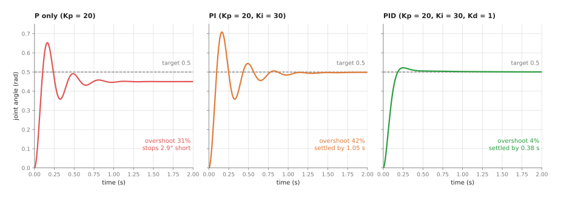
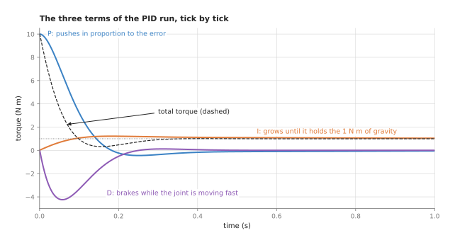
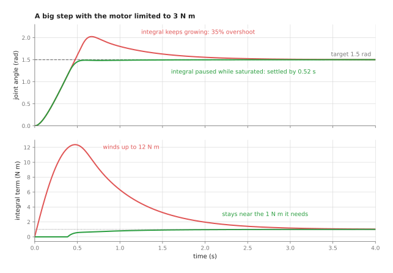
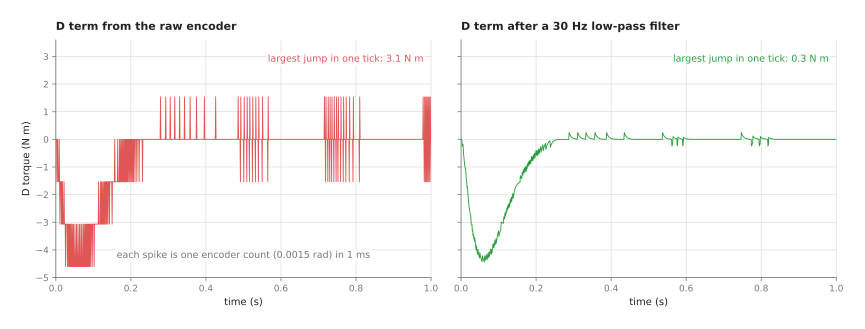

# PID control

This page explains proportional-integral-derivative (PID) control: the standard
way to make one joint of an arm go to a target angle and stay there. It answers
four questions. What do the three parts of a PID controller each do? How does a
program run one, tick by tick? Where does a robot arm use it? And what goes wrong
when it is set up badly?

It is for a reader who has read the [overview](01_overview.md) of this chapter.
You need to know what a joint angle and a motor are. You do not need any control
theory or calculus beyond knowing that a speed is how fast something changes.
Every number on this page comes from a real run of the diagram script,
`docs/diagrams/control_and_motion.py`, which simulates a joint rather than drawing
its curves by hand.

PID is the most used control technique in robotics. It runs inside the drive of
nearly every joint of nearly every arm, and inside most grippers, pan-tilt camera
heads and conveyors too. It is usually the first thing to try, and it is often the
last thing you need.

## Contents

1. [What this page answers](#1-what-this-page-answers)
2. [The idea in one sentence](#2-the-idea-in-one-sentence)
3. [How it works, step by step](#3-how-it-works-step-by-step)
   · [The joint in the examples](#the-joint-in-the-examples)
   · [P: push in proportion to the error](#p-push-in-proportion-to-the-error)
   · [I: push harder while an error lasts](#i-push-harder-while-an-error-lasts)
   · [D: brake when the error is changing fast](#d-brake-when-the-error-is-changing-fast)
   · [A worked example: the first ticks by hand](#a-worked-example-the-first-ticks-by-hand)
   · [The steps as pseudocode](#the-steps-as-pseudocode)
   · [Tuning the three gains](#tuning-the-three-gains)
   · [Two fixes every real PID needs](#two-fixes-every-real-pid-needs)
4. [Where it is used on a robot arm](#4-where-it-is-used-on-a-robot-arm)
5. [Where it is useful, and where it is not](#5-where-it-is-useful-and-where-it-is-not)
6. [Libraries that provide it](#6-libraries-that-provide-it)
7. [Why PID, and what it costs](#7-why-pid-and-what-it-costs)
8. [Where to read next](#8-where-to-read-next)

---

## 1. What this page answers

A motor does not know angles. It produces a **torque**, a turning force measured in
newton metres (N m), in proportion to the electric current sent to it. If you want a
joint at 30 degrees, something has to choose the torque, moment by moment, that gets
it there.

That is harder than it sounds. Gravity pulls the link down. Friction in the gearbox
resists every movement. The load in the gripper changes from one pick to the next.
A torque worked out in advance for one case is wrong for the next case.

The answer is to measure and correct. The joint's **encoder** is a sensor that
reports the joint angle. A controller reads it, compares it with the target, and
chooses a torque. It then does the same again a millisecond later. This repeating
measure-and-correct cycle is a **feedback loop**. PID is the rule the loop uses to
turn the error into a torque.

This page builds that rule one part at a time on a simulated joint, shows the
numbers, and then shows the two faults that every real PID must be protected
against.

---

## 2. The idea in one sentence

A PID controller sets the motor torque to the sum of three terms: one in
proportion to the error now, one in proportion to the error added up over time, and
one in proportion to how fast the error is changing.

Here is an everyday example: the cruise control in a car. The driver sets a speed
of 100 km/h.

- If the car is going 90 km/h, the controller presses the accelerator in proportion
  to the 10 km/h gap. That is the proportional part.
- On a long hill, a fixed press is not enough, and the car settles at 97 km/h. The
  controller notices that the gap has lasted a long time, and slowly presses harder
  until it is gone. That is the integral part.
- When the car is gaining speed quickly, the controller eases off a little before it
  reaches 100 km/h, so it does not shoot past. That is the derivative part.

A joint controller does exactly the same, with an angle instead of a speed and a
motor torque instead of an accelerator pedal.

---

## 3. How it works, step by step

### The joint in the examples

Every picture on this page uses the same simulated joint. It has these properties:

- an **inertia** of 0.05 kg m². Inertia is how hard it is to start or stop the
  joint turning. It plays the part that mass plays in a straight line.
- **friction** of 0.5 N m for every radian per second of speed. A **radian** is the
  unit of angle a program uses; 1 radian is about 57.3 degrees.
- a steady pull of **gravity** of 1.0 N m on the link. The moves are small, so the
  pull is treated as constant.
- a controller that runs **1,000 times a second**, a common rate for a joint loop.
  Each run is called a **tick**.

The task is the same in every picture: the joint rests at 0 and is told to go to
0.5 radians, about 29 degrees. A sudden change of target like this is called a
**step**.

### P: push in proportion to the error

The **error** is the target angle minus the measured angle. The proportional term
is the error times a number called the **proportional gain**, written Kp:

```
P = Kp × error
```

With Kp = 20 N m per radian, an error of 0.5 radians gives a torque of 10 N m. As
the joint gets closer, the error shrinks and so does the push.

The left panel below shows what P alone does.



Each panel is one simulated run of the same step with different terms switched on.
The dashed line is the target.

P alone has two faults. It **overshoots**: the joint swings 31 per cent past the
target before it turns back. And it **stops short**: it comes to rest 0.05 radians,
2.9 degrees, below the target.

The overshoot happens because nothing slows the joint down on its way in. The
torque only reaches zero at the target, so the joint arrives at full speed.

The stopping short is worth understanding, because it is the most common fault of a
P controller. At rest, the motor must hold up the link against gravity's 1.0 N m.
A P controller only produces torque when there is an error. So it must keep an
error of 1.0 ÷ 20 = 0.05 radians just to hold the link up. This leftover error is
called the **steady-state error**. A larger Kp makes it smaller, but it never makes
it zero, and a larger Kp also makes the overshoot worse.

### I: push harder while an error lasts

The integral term adds up the error over time. Each tick, it adds the error times
the length of the tick to a running total. That total, times the **integral gain**
Ki, is the integral term:

```
total = total + error × tick_length
I     = Ki × total
```

While any error remains, the total keeps growing, and so does the push. It only
stops growing when the error is exactly zero. That is how the integral term removes
the steady-state error. It finds, by itself, the 1.0 N m that gravity needs.

The middle panel of the picture shows PI control, with Kp = 20 and Ki = 30. The
joint now ends on the target. But the overshoot is worse, 42 per cent, and the
joint rings for about a second before it settles. The integral term keeps pushing
on the way in, because the total was built up while the joint was still short of the
target.

### D: brake when the error is changing fast

The derivative term looks at how fast the error is changing. For a still target,
that is the same as the joint's speed with the sign turned round. The term is that
rate of change times the **derivative gain** Kd:

```
D = Kd × (rate of change of the error)
  = − Kd × (joint speed)      when the target is not moving
```

When the joint is rushing towards the target, the error is shrinking fast, and D
produces a large torque in the opposite direction. It acts like a brake that is
strongest when the joint is fastest.

The right panel of the picture shows full PID control, with Kp = 20, Ki = 30 and
Kd = 1. The overshoot drops to 4 per cent. The joint is within 2 per cent of the
target by 0.38 seconds and stays there.

The table below collects the three runs. Each row is one controller. The columns are
the overshoot, the time after which the joint stays within 2 per cent of the target,
and the error left at the end of the 3-second run.

| Controller | Overshoot | Settled within 2 per cent by | Error at the end |
| --- | --- | --- | --- |
| P (Kp = 20) | 31 per cent | never | 0.050 rad (2.9 degrees) short |
| PI (Kp = 20, Ki = 30) | 42 per cent | 1.05 s | 0.0003 rad |
| PID (Kp = 20, Ki = 30, Kd = 1) | 4 per cent | 0.38 s | less than 0.0001 rad |

The picture below splits the PID run into its three terms, so you can see what
each one does at each moment.



At the start the P term does almost all the work: it gives 10 N m. The D term
quickly goes strongly negative, down to about −4 N m, while the joint is moving
fast. That is the braking. The I term grows slowly and levels off at 1.0 N m, which
is exactly the pull of gravity. Once the joint is at rest on the target, P and D are
both zero and the I term alone holds the link up. The dashed line is their sum,
the torque actually sent to the motor.

One detail of this controller matters in practice. It takes the rate of change of
the measured angle, not of the error. For a still target the two are the same. But
when the target jumps, the error jumps too, and its rate of change for one tick is
enormous. A controller that differentiates the error would send one huge kick of
torque at every new target. Differentiating the measurement avoids that, and most
library PID controllers offer it as an option.

### A worked example: the first ticks by hand

Here are the first ticks of the PID run, with Kp = 20, Ki = 30, Kd = 1 and a tick of
0.001 s. The numbers come from the simulation.

Tick 0, at time 0. The joint is at 0, so the error is 0.5.

- P = 20 × 0.5 = 10.0 N m.
- The total becomes 0 + 0.5 × 0.001 = 0.0005, so I = 30 × 0.0005 = 0.015 N m.
- The joint has not moved, so D = 0.
- The torque is 10.0 + 0.015 + 0 = 10.015 N m.

Tick 1, at 0.001 s. The torque has moved the joint to 0.0000989 radians.

- The error is 0.5 − 0.0000989 = 0.4999, so P = 9.998 N m.
- The total becomes 0.0005 + 0.4999 × 0.001 = 0.0009999, so I = 0.030 N m.
- The joint moved 0.0000989 radians in 0.001 s, a speed of 0.0989 radians per
  second, so D = −1 × 0.0989 = −0.099 N m.
- The torque is 9.998 + 0.030 − 0.099 = 9.929 N m.

By tick 100, at 0.1 s, the joint is at 0.338 radians and moving fast. P has fallen
to 3.24 N m. I has grown to 1.07 N m. D is −3.34 N m, braking hard. The torque is
0.96 N m, which is less than gravity, so the joint is already slowing down.

At the end of the run, the I term is 1.0014 N m and the other two are almost zero.

### The steps as pseudocode

The whole controller is a few lines, run once per tick. The pseudocode below uses
plain names and works in any language.

```
set total = 0
set previous_measured = read_encoder()

every tick (tick_length seconds):
    measured = read_encoder()
    error    = target - measured

    p = Kp * error

    total = total + error * tick_length
    i = Ki * total

    speed = (measured - previous_measured) / tick_length
    d = -Kd * speed
    previous_measured = measured

    torque = p + i + d
    if torque > torque_limit:     torque = torque_limit
    if torque < -torque_limit:    torque = -torque_limit
    send torque to the motor
```

The last three lines clip the torque to what the motor can give. The two fixes in
the section after next change the `total` line and the `speed` line.

### Tuning the three gains

Choosing Kp, Ki and Kd is called **tuning**. There are formal methods, but most arm
joints are tuned by hand in this order.

1. Set Ki and Kd to zero. Raise Kp until the joint reaches the target quickly and
   overshoots a little. It will stop short under load.
2. Raise Kd until the overshoot is gone. Too much Kd makes the joint sluggish and
   noisy.
3. Raise Ki until the steady-state error disappears in a reasonable time. Too much
   Ki brings back overshoot and ringing, as the PI panel shows.
4. Test with the heaviest and lightest loads the arm will carry, and at the ends of
   its range, where gravity pulls hardest.

A well-known formal starting point is the **Ziegler–Nichols** method. You raise Kp
alone until the joint oscillates steadily, note that gain and the time of one swing,
and read the three gains off a table. The result is usually too aggressive for an
arm, so treat it as a first guess.

A large improvement often comes from outside the three terms. If you know the pull
of gravity at each angle, from the arm's mass model, you can add it to the torque
directly. This is called **gravity compensation**, a kind of **feed-forward**,
meaning a torque sent because you know it is needed rather than because an error
was measured. The I term then has almost nothing left to do, and it can be kept
small.

### Two fixes every real PID needs

The pseudocode above works in the simulation with a perfect encoder and an
unlimited motor. A real joint has neither. Two faults follow, and each has a
standard fix.

The first fault is **integral windup**. A real motor has a torque limit. On a large
move, the controller asks for more than the limit, and the motor gives only the
limit. The joint moves more slowly than the controller expects, so the error stays
large, and the integral total keeps growing the whole time. When the joint finally
reaches the target, the total is far too large. The joint shoots past and takes a
long time to come back.



The picture shows a 1.5 radian step with the motor limited to 3 N m. In the red run
the integral term grows to 12 N m while the motor is at its limit, twelve times the
1 N m it really needs. The joint overshoots by 35 per cent and takes 2.36 seconds to
settle. The fix, called **anti-windup**, is to stop adding to the total while the
torque is being clipped. In the green run the total is paused whenever the motor is
at its limit. The joint does not overshoot at all and settles by 0.52 seconds.

The second fault is **derivative noise**. An encoder does not report a smooth angle.
It counts steps. A common encoder has 4,096 counts per turn, so one count is 0.0015
radians. When the angle moves by one count between ticks, the measured speed jumps
from 0 to 0.0015 ÷ 0.001 = 1.5 radians per second for one tick. The D term turns
that into a sudden spike of torque.



The left panel is the D term of the PID run with a 4,096-count encoder. It is a train
of spikes. The largest jump from one tick to the next is 3.1 N m. After the first
second, when the joint is almost still, the D term's typical size (its standard
deviation) is still 0.81 N m. The motor turns those spikes into noise and heat. The fix is a **low-pass filter**, a
small calculation that lets slow changes through and smooths away fast ones. The
right panel filters the speed so that changes faster than about 30 times a second
are damped. The largest jump falls to 0.3 N m, and the typical size after the first
second falls to 0.09 N m. The step response hardly changes: the overshoot goes from 4.4 per cent to
3.1 per cent.

A filter delays the signal a little, and too much delay makes the loop unstable. So
the filter is set as slow as the noise requires and no slower. A
[Kalman filter](../04_fitting-and-estimation/04_kalman-filter.md) is a more careful way
to get a clean speed from a noisy angle.

---

## 4. Where it is used on a robot arm

PID is used anywhere a measured number must be held at a target. On and around an
arm, that is almost everywhere.

**The joint position loop.** This is the main use. Each joint's drive runs a PID loop
on the joint angle. In many drives this is the outer loop of three: a position loop
chooses a speed, a speed loop chooses a current, and a current loop, often running
10,000 or more times a second, sets the motor current. Each of the three is a PID or
a PI loop. When an arm maker says "position-controlled arm", this cascade is what is
inside.

**Following a trajectory.** The target does not have to be still. The
[trajectory generation](03_trajectory-generation.md) page produces a new target for
every tick, and the same PID loop follows it. The lag in the
[overview's move](01_overview.md#5-how-they-work-together-on-one-move) is a PID loop
following a moving target. Adding the trajectory's own speed and acceleration as
feed-forward shrinks that lag a great deal.

**Gripper fingers.** An electric gripper runs a position loop on its finger gap, with
the current limited so that the squeeze is limited. The Book 3 page on
[holding on](../../03_frameworks/02_gripping/05_holding-on.md#2-what-force-control-a-gripper-actually-gives-you)
explains why that current limit is not the same as a force setting.

**Pointing a camera.** A pan-tilt head, or a wrist camera centred on an object, can be
steered by a PID loop whose error is measured in pixels: how far the object is from
the middle of the picture. This is the simplest form of visual servoing, described in
[controlling the move](../../03_frameworks/03_arm-movement/04_controlling-the-move.md#6-visual-servoing).
It is usually P or PI only, because the camera is slow and noisy.

**Holding a force.** An admittance controller, explained on the
[impedance and force control](04_impedance-and-force-control.md) page, can include a
PI loop on the force error. Its target is a force, such as "press with 10 N", and its
output is a small change of position.

**Conveyors and turntables.** A conveyor that must match the arm's pick timing, or a
turntable that presents parts, is held at speed by a PI loop.

---

## 5. Where it is useful, and where it is not

PID works best when the thing being controlled responds in a simple, steady way, the
sensor is fast and clean, and the target changes smoothly. It struggles when any of
those is false.

The table below lists the common failures. Each row gives the situation, the sign
you would see on the arm or in the logged data, and what people use instead or add.

| Situation | The sign you would see | What people use instead or add |
| --- | --- | --- |
| The load changes a lot, such as an empty gripper against a 3 kg part | good tuning with one load, overshoot or sagging with the other | gravity compensation from a mass model; gains scheduled by load; a [learned arm model](../../06_neural-network-models/08_touch-and-body-models/05_learned-arm-models.md) as feed-forward |
| Fast moves on a heavy arm, where joints push on each other | following error that grows with speed and changes with pose | computed-torque control from a dynamics model, such as Pinocchio's; PID remains on top to clean up |
| A slow or delayed sensor, such as a camera at 30 frames a second | the arm oscillates around the target, more with higher gain | lower gains; model predictive control; a [Kalman filter](../04_fitting-and-estimation/04_kalman-filter.md) that predicts across the delay |
| The motor hits its torque limit | a large overshoot after big moves only | anti-windup, as shown above |
| A noisy sensor | a buzzing or hot motor, spiky torque traces | filter the D term, or drop it and use PI |
| Friction that sticks and then lets go, common in gearboxes | the joint stops just short, then jumps past, and repeats slowly | friction compensation; a small dead band around the target |
| Contact with a rigid surface | the force climbs to the motor's limit | [impedance or force control](04_impedance-and-force-control.md), not a better PID |
| Several goals at once, such as speed limits and staying inside a region | limits broken, or clipping that ruins the tuning | model predictive control, described in [controlling the move](../../03_frameworks/03_arm-movement/04_controlling-the-move.md#7-model-predictive-control) |

The row about contact is the most important. A PID position loop is doing its job
correctly when it pushes harder into a table it cannot pass through. No tuning fixes
that, because it is what the loop is for. The
[impedance and force control](04_impedance-and-force-control.md) page shows the
force climbing to the motor's limit in a simulation.

---

## 6. Libraries that provide it

The loop is short enough that many people write it themselves, but the libraries
below include anti-windup, filtering and tuning helpers that are easy to get wrong.
The table lists well-known ones. Each row gives the library, the languages it is used
from, the class or function, and a note.

| Library | Languages | Class or function | Note |
| --- | --- | --- | --- |
| ros2_controllers | C++, configured from YAML | `pid_controller`; `joint_trajectory_controller` gains | `pid_controller` runs a PID on any command interface; the trajectory controller uses per-joint PID gains when it commands velocity or effort instead of position |
| control_toolbox (ros-controls) | C++ | `control_toolbox::Pid` | the PID class used inside ros2_controllers, with integral clamping |
| simple-pid | Python | `simple_pid.PID` | a small pure-Python PID with output limits and anti-windup, good for scripts and tests |
| python-control | Python | `control.tf`, `control.step_response` | for trying gains on a model of the joint offline, before touching the arm |
| Gazebo (gz-math) | C++ | `gz::math::PID` | the PID used by Gazebo's joint controller plugins |
| MuJoCo | C, Python, XML model files | the `position` actuator, with its `kp` gain | a P controller with a damping option, built into the simulated actuator |
| Pinocchio | C++, Python | `computeGeneralizedGravity`, `rnea` | not a PID; computes the gravity and dynamics torques used as feed-forward alongside one |

On a real arm, you usually do not write the joint loop at all. It runs inside the arm
maker's drive, and you tune it only through their software, if at all. The PIDs you
write yourself are the outer ones: a gripper, a camera head, a force loop, or a joint
on a robot you built.

---

## 7. Why PID, and what it costs

PID is a rule that sets a motor's output from the error now, the error summed over
time, and the error's rate of change. It gives each joint the ability to reach a
target and hold it against gravity, friction and changing loads, using only its own
sensor and three numbers.

The first obvious alternative is to use no feedback at all: work out the torque from
a model of the arm and send it. That is called **open-loop** control. It needs no
sensor and cannot oscillate. But any error in the model, a change of load, or a knock
from outside is never corrected, because nothing measures it. Even the simple joint
on this page shows the problem: a torque that is 10 per cent too small to hold up the
link does not leave it a little short, it lets it fall. Feedback is chosen because the
real arm never matches the model.

The second obvious alternative is a controller built on a full model of the arm's
dynamics, such as **computed-torque control** or **model predictive control**. These
use the arm's masses and inertias to work out the torque for the whole move, and can
follow fast moves far more closely. But they need an accurate model, which means
measuring the inertias of every link, and they are much harder to write, check and
debug. PID needs no model at all, and its three numbers can be tuned by hand in an
afternoon. That is why the usual practice is to add a model's torque on top of a PID
loop rather than replace it.

The costs are these. You must tune three numbers, and the right values change with
the load and the pose. Some error always remains while the joint is moving. The
integral term needs anti-windup and the derivative term needs a filter, or the loop
misbehaves on a real motor. And a PID position loop has no idea of contact: it will
push as hard as the motor allows to reach a target inside a solid object.

---

## 8. Where to read next

- The next page is [trajectory generation](03_trajectory-generation.md). It makes the
  smooth, moving targets that a PID loop follows, instead of sudden steps.
- [Impedance and force control](04_impedance-and-force-control.md) changes what the
  loop does on contact.
- The [Kalman filter](../04_fitting-and-estimation/04_kalman-filter.md) gives a
  cleaner angle and speed to feed into the loop.
- Book 3's [controlling the move](../../03_frameworks/03_arm-movement/04_controlling-the-move.md)
  shows the ROS 2 controllers that contain these loops, and the tolerances that decide
  whether a move "succeeded".
- Book 6's [learned arm models](../../06_neural-network-models/08_touch-and-body-models/05_learned-arm-models.md)
  learn the torque a joint needs, which can be added to a PID loop as feed-forward.
