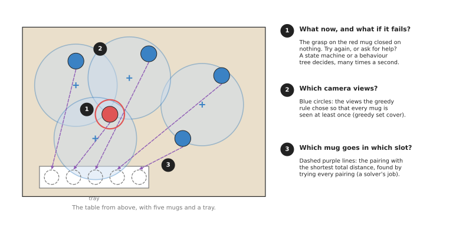
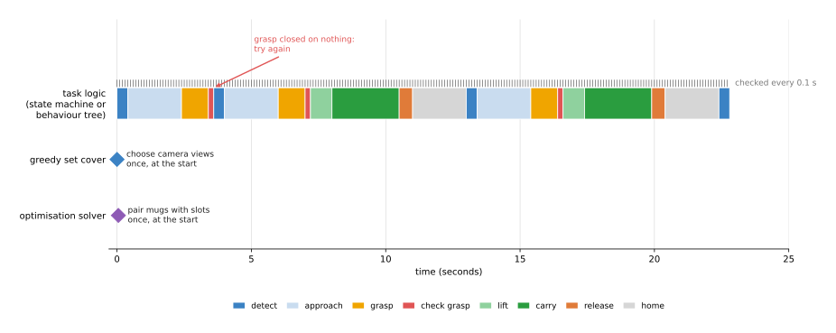

# Decisions and task logic

This chapter is about the part of a robot program that decides what the robot
does next, and in what order. The other chapters of this book find the mug, plan a
path to it and move the joints. Because those chapters do the work of each step,
this chapter answers the questions that sit above them. Which step comes now, what
happens when a step fails, and which mug goes first?

This page is the overview of the chapter. It says what the four techniques in it
are for, gives each one in a line, and compares them in a table. After that it
shows how they connect to the rest of the book and to learned models. This page is
for a reader who already knows what an arm, a camera and a gripper are, but who
has not met these techniques before.

## Contents

1. [What this family of techniques is for](#1-what-this-family-of-techniques-is-for)
2. [The question it answers for an arm](#2-the-question-it-answers-for-an-arm)
3. [The four techniques](#3-the-four-techniques)
4. [How they compare](#4-how-they-compare)
5. [When each one runs](#5-when-each-one-runs)
6. [How this chapter connects to the others](#6-how-this-chapter-connects-to-the-others)
7. [Where to read next](#7-where-to-read-next)

---

## 1. What this family of techniques is for

The introduction above described this work in ordinary words. In the list of
categories that this book is built from, it is the seventh one: **decisions and
task logic**. That means deciding what the robot does next, and in what order.

A real task is never one motion, because picking up a mug and putting it in a bin
takes at least eight steps. First the camera looks for the mug, and then the arm
moves above it. Then the gripper opens, lowers and closes, and a check makes sure
the mug is really in the gripper. After that the arm lifts, carries the mug to the
bin and lets go, and finally it goes home and looks for the next mug.

Any of those steps can fail, and each one fails in its own way. For example, the
gripper can close on nothing because the mug moved a little, or the planner can
find no path because a box is in the way. The mug can also slip out on the way to
the bin. This is why most of the code in a working robot is not the steps
themselves. It is the code that decides what to do when a step fails.

The techniques in this chapter are the standard ways to write that code, so that
it stays correct and readable as the task grows. They are all programmed rules,
and none of them is trained from data. This means they need no training data at
all, and it means the same technique works in every programming language.

---

## 2. The question it answers for an arm

So far the task has been one sequence of steps that can fail. But a chapter on
decisions has to answer two kinds of question, and although the two sound alike,
they need different tools.

The first kind is "what now?", and here the robot must react to events as they
happen, such as the grasp working, the grasp failing, or a person pressing stop.
Because the answer changes from one moment to the next, the robot has to keep
asking the question. A **finite state machine** and a **behaviour tree** both
answer this kind, so they run the whole time the robot works and check many times
a second.

The second kind is "which ones, and in what order?", and here the robot has a list
of choices and wants the best set or the best order out of them. For example,
which camera views see every mug, and which mug should go in which slot of a tray?
Since these questions are asked once, before the work starts, or once per batch,
**greedy algorithms** and **optimisation solvers** answer them instead.

The picture below puts all four questions on one table, so that the two kinds can
be seen side by side.

The red mug is the one whose grasp just failed, so a state machine or a behaviour
tree decides to try again. The blue circles are the four camera views that a
greedy rule chose, out of six, so that every mug is seen. While those views are
chosen once, the purple lines do a different job: they pair each mug with a tray
slot so that the total distance is the shortest of all 120 pairings, which the
script found by trying every one.

---

## 3. The four techniques

Each of the four techniques has its own page, and they split into the two kinds of
question above. While the first two react to events as they happen, the last two
choose the best set or the best order.

- [Finite state machines](02_most-used/01_finite-state-machines.md) describe the task as a small
  set of named situations, such as "grasp" or "carry", joined by arrows that say
  which event moves the robot from one situation to the next.
- [Behaviour trees](02_most-used/02_behaviour-trees.md) describe the task as a tree of steps and
  checks. The tree is re-checked many times a second, and each part answers
  "success", "failure" or "still running", so retries and fallbacks are part of
  its shape rather than extra code.
- [Greedy algorithms and set cover](03_also-used/01_greedy-algorithms-and-set-cover.md) build an
  answer one choice at a time, always taking the choice that looks best right now.
  A common use is choosing the fewest camera views that together see every object.
- [Optimisation solvers](03_also-used/02_optimisation-solvers.md) search for the best answer to a
  problem written as numbers, a goal and rules. They order picks, assign objects
  to places and pack boxes, using libraries such as Google's OR-Tools.

---

### Most used, and also used

The pages of this chapter are in two groups, and the group a page is in tells you
how likely you are to need it. The first group, most used, holds
[finite state machines](02_most-used/01_finite-state-machines.md) and
[behaviour trees](02_most-used/02_behaviour-trees.md). Nearly every arm
program has one of the two, because every task has steps, retries and
failures to handle. The second group, also used, holds
[greedy algorithms and set cover](03_also-used/01_greedy-algorithms-and-set-cover.md)
and [optimisation solvers](03_also-used/02_optimisation-solvers.md). You need
them only when a task has many choices to put in order, such as which views to
take or which part goes in which pocket, and many arm programs never have that
problem.

## 4. How they compare

Since each technique was described on its own above, the table below now sets the
four side by side. Read each row as one technique, and read the columns as the
question it answers, how often it runs, what it needs as input, and what it gives
back.

| Technique | Question it answers | How often it runs | What goes in | What comes out |
|---|---|---|---|---|
| [Finite state machine](02_most-used/01_finite-state-machines.md) | What do I do now, given what just happened? | All the time, on every event | The current state and the latest event | The next state, and the action it starts |
| [Behaviour tree](02_most-used/02_behaviour-trees.md) | What do I do now, and what if it fails? | All the time, often 10 to 100 times a second | The world as the checks see it | The step to run now, and success, failure or running |
| [Greedy algorithm](03_also-used/01_greedy-algorithms-and-set-cover.md) | Which small set of choices covers everything? | Once per task or batch | A list of choices and what each one covers | A set of choices, usually close to the smallest |
| [Optimisation solver](03_also-used/02_optimisation-solvers.md) | What is the best order or assignment? | Once per task or batch | Numbers, a goal and rules | The best answer it can prove, or the best it found in time |

Because the first two rows decide which step runs, they are about control flow,
while the last two rows are about choice, because they decide what those steps
work on. This means a real robot program uses both kinds together, so that a
behaviour tree runs the task and one of its steps calls a greedy rule or a solver.

---

## 5. When each one runs

The table above has a column for how often each technique runs, and that
difference in timing is easiest to see on a single real run. The picture below
comes from the state machine on the [finite state machines](02_most-used/01_finite-state-machines.md)
page, which moves two mugs to a bin and whose first grasp closes on nothing.

The coloured bar is the state that the task logic was in at each moment, and the
small ticks above it show that this state is checked every tenth of a second.
Below that, the two diamonds are single calls made once at the start, where one
chooses the camera views and the other pairs mugs with tray slots.

This timing decides how fast each technique has to be. Because task logic runs
thousands of times in one task, each check must take well under a millisecond. A
chooser, however, runs only once, so it can take a few hundred milliseconds, or
even seconds, if that buys a better answer.

---

## 6. How this chapter connects to the others

Because task logic decides which step runs rather than doing the work of the step
itself, the techniques here sit on top of every other chapter of this book. This
means each step in a state machine or a behaviour tree calls something from one of
those chapters.

- The "detect mug" step uses the
  [image and point cloud processing](../05_image-and-point-cloud-processing/01_overview.md)
  chapter to cut the mug out of the picture, and the
  [geometry and cameras](../02_geometry-and-cameras/01_overview.md) chapter to turn
  its pixels into a position.
- The "is it the same mug as before?" check uses the
  [searching and matching](../03_searching-and-matching/01_overview.md) chapter.
- The "move above mug" step calls the
  [planning and search](../06_planning-and-search/01_overview.md) chapter to find a
  path, and the [control and motion](../07_control-and-motion/01_overview.md) chapter
  to follow it.
- A "holding mug?" check often reads a steady gripper width or force from the
  [fitting and estimation](../04_fitting-and-estimation/01_overview.md) chapter.

Learned models meet this chapter in two places as well. First, a learned model can
be one step inside the tree, in the place where a programmed step would otherwise
sit. A detector from Book 6's
[object detection](../../06_learned-models/03_seeing-models/02_most-used/01_object-detection.md)
page can be the "detect mug" step, and a model from
[collision and failure detection](../../06_learned-models/09_touch-and-body-models/02_most-used/02_collision-and-failure-detection.md)
can be the "did the grasp fail?" check. While those models replace a step, the
tree around them stays the same.

Second, a language model can sit above the tree instead of inside it. The page
[language models as planners](../../06_learned-models/07_language-models/03_also-used/01_language-models-as-planners.md)
shows a model that turns a spoken request into a list of steps. Even then, those
steps usually run inside a state machine or a behaviour tree, because that part
must be fast and must always do the same thing.

The map of the whole book, which shows where this chapter sits among the others,
is on [the map of techniques](../01_what-techniques-are/04_the-map-of-techniques.md).

---

## 7. Where to read next

- Start with [finite state machines](02_most-used/01_finite-state-machines.md), because they are
  the simplest way to write task logic and the next page builds on them.
- Then read [behaviour trees](02_most-used/02_behaviour-trees.md), which most robot arm programs
  use today for the same job.
- [Greedy algorithms and set cover](03_also-used/01_greedy-algorithms-and-set-cover.md) and
  [optimisation solvers](03_also-used/02_optimisation-solvers.md) cover the "which ones, and in
  what order" questions, which come up once a task has many choices in it.
- Book 3 shows behaviour trees in real code in
  [behaviour trees: putting a task in order](../../03_frameworks/01_tools-and-libraries.md#11-behaviour-trees-putting-a-task-in-order),
  and compares state machines and behaviour trees in
  [scripted logic](../../03_frameworks/04_one-arm-training/02_programmed-methods.md#3-scripted-logic-state-machines-and-behaviour-trees).
