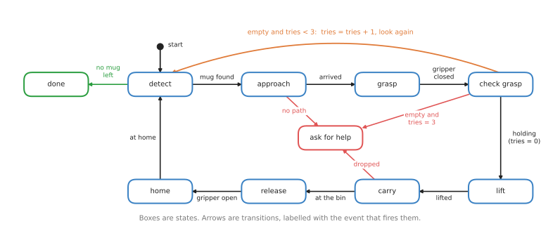
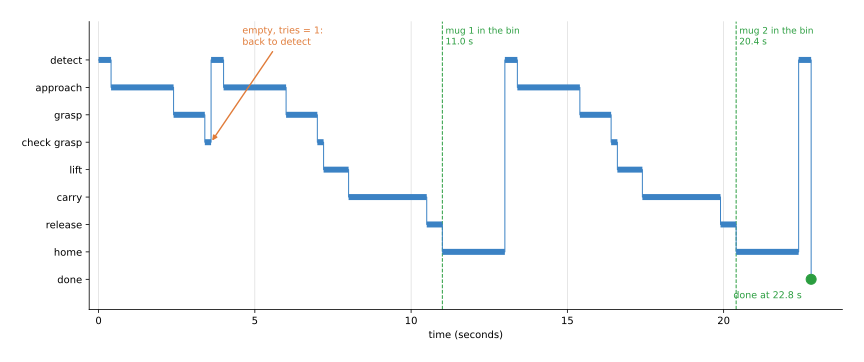
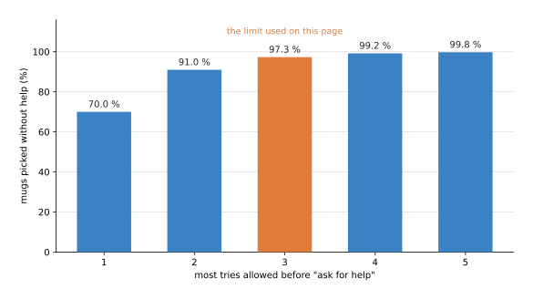
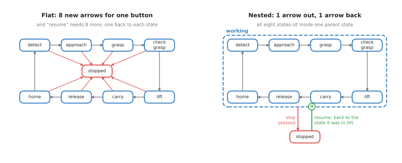

# Finite state machines

This page explains the finite state machine, which is the oldest and simplest way to
write the logic that decides what a robot does next, and it answers five questions.
What is a state machine, and how does it run step by step? Where does a robot arm use
one, when does it stop being a good idea, and which libraries give you one
ready-made?

It is written for a reader who has read the [chapter overview](../01_overview.md) and
who knows what an arm, a gripper and a camera are, but it does not assume any course
on algorithms. The running example is a pick-and-place task, where the arm moves mugs
from a table to a bin and tries again when a grasp fails.

## Contents

1. [Introduction](#1-introduction)
2. [The idea in one sentence](#2-the-idea-in-one-sentence)
3. [How it works, step by step](#3-how-it-works-step-by-step)
   · [States, events and transitions](#states-events-and-transitions)
   · [The pick-and-place machine](#the-pick-and-place-machine)
   · [Adding a counter for retries](#adding-a-counter-for-retries)
   · [A worked run with real numbers](#a-worked-run-with-real-numbers)
   · [Pseudocode](#pseudocode)
   · [How many tries to allow](#how-many-tries-to-allow)
   · [Nested states](#nested-states)
4. [Where it is used on a robot arm](#4-where-it-is-used-on-a-robot-arm)
5. [Where it is useful, and where it is not](#5-where-it-is-useful-and-where-it-is-not)
6. [Libraries that provide it](#6-libraries-that-provide-it)
7. [Why a state machine, and what it costs](#7-why-a-state-machine-and-what-it-costs)
8. [The learned alternative](#8-the-learned-alternative)
9. [Where to read next](#9-where-to-read-next)
10. [Using it in Python](#10-using-it-in-python)

---

## 1. Introduction

A robot arm program must always know what it is doing right now. Is it looking for a
mug, is it moving, or is it waiting for the gripper to close? That answer decides what
the program does with the next piece of news, because the news "the gripper has
closed" means one thing while the arm is grasping and nothing at all while it is
carrying.

A finite state machine is a way to write all of this down so that nothing is left to
chance. First you list every situation the robot can be in, and then, for each
situation, you list the pieces of news that matter and where each one leads. After
that a very small loop follows your list.

State machines are everywhere in robots, often where you do not see them, because the
gripper driver, the controller's safety modes and the start-up of a camera are all
state machines. So learning to read one is useful even if you later write your task
logic with a [behaviour tree](02_behaviour-trees.md).

---

## 2. The idea in one sentence

Since the program has to know what it is doing, here is the technique in one sentence.
A finite state machine is a fixed list of named situations, called states, and a table
that says which event moves the program from one state to the next.

Here is an everyday example of the same idea, a washing machine with states such as
"filling", "washing", "rinsing", "spinning" and "done". It is always in exactly one of
them, and events move it on: the drum is full, the timer ran out, the door was opened.
The door-opened event means "stop and wait" while washing, but it means nothing when
the machine is done. So the machine does not need to remember the whole past, because
knowing its current state is enough to decide what to do with the next event.

The word "finite" means that the list of states is fixed and has an end, so the
program cannot invent a new state while it runs.

---

## 3. How it works, step by step

### States, events and transitions

Once the idea is clear, a state machine turns out to have only three parts.

1. A **state** is a named situation, such as "grasp". The machine is in exactly one
   state at a time. While it is in a state, it usually does one thing: in "grasp", it
   closes the gripper.
2. An **event** is a piece of news from outside, such as "gripper closed" or "no path
   found". Events come from sensors, from other programs, or from a timer.
3. A **transition** is a rule of the form "in state A, event E moves the machine to
   state B". It is drawn as an arrow from A to B, with E written on it.

All the transitions together form the **transition table**, which is a lookup: given
the current state and an event, it gives back the next state. So if the table has no
entry for that pair, the event is simply ignored in that state.

One state is also marked as the **start state**, and some states can be marked as
**final states**, where the machine stops.

### The pick-and-place machine

Because those three parts are easier to see on a real task, the picture below shows a
state machine for the running example. It has eight working states, a final state
called "done" and a state called "ask for help".



The normal path runs clockwise, from "detect" through "approach", "grasp", "check
grasp", "lift", "carry", "release" and "home", and then back to "detect" for the next
mug. Meanwhile the orange arrow over the top is the retry, and the three red arrows
lead to "ask for help".

Here is what each of those states does in turn.

- **detect**: run the camera and the detector, and turn the mug's pixels into a
  position. The event is "mug found" or "no mug left".
- **approach**: plan a path to a point above the mug, and follow it. The event is
  "arrived", or "no path" if the planner fails.
- **grasp**: lower the gripper and close it. The event is "gripper closed".
- **check grasp**: read the gripper's finger width. A mug is 80 mm wide, so a width
  near 80 mm means "holding". A width near zero means the fingers closed on air, so
  the event is "empty".
- **lift**, **carry**, **release** and **home**: move up, move to the bin, open the
  gripper, and go back to the home pose. "carry" can also give "dropped", if the
  finger width suddenly drops to zero.

The machine has 13 transitions in all, and eleven of them are plain entries in a
table. But the other two are the retry arrow and the "tries = 3" arrow, which need a
counter.

### Adding a counter for retries

A plain state machine has no memory beyond its current state, but the retry rule needs
to know how many times the grasp has already failed. So the machine carries one extra
number, a **counter** called `tries`.

A transition can then have a **guard**, meaning a condition that must be true for the
arrow to be taken, and it can also have an **action**, meaning a small change made
when the arrow is taken. So the two arrows out of "check grasp" on the event "empty"
are these:

- "empty and tries < 3" goes back to "detect", and adds 1 to `tries`.
- "empty and tries = 3" goes to "ask for help".

Then the arrow "holding" sets `tries` back to 0, so that the next mug starts fresh.

Going back to "detect", rather than only to "grasp", is a deliberate choice. A grasp
often fails because the mug is not quite where the camera said it was, so looking
again is what fixes it.

A state machine with extra numbers such as `tries` is sometimes called an
**extended state machine**, and almost every real one is of this kind.

### A worked run with real numbers

Since the machine above is easier to trust once you have seen it run, the diagram
script for this page holds that exact machine and runs it on two mugs. The first grasp
on mug 1 closes on nothing, while every other grasp works. Each state takes a fixed
time: 0.4 s to detect, 2.0 s to approach, 1.0 s to grasp, 0.2 s to check, 0.8 s to
lift, 2.5 s to carry, 0.5 s to release and 2.0 s to go home.

The table below is the start of that run, as the script printed it. Read each row as
one state, where the last column is the event that ended the state and so chose the
next row.

| Start (s) | End (s) | State | Event that ended it | Next state |
|---|---|---|---|---|
| 0.0 | 0.4 | detect | mug found | approach |
| 0.4 | 2.4 | approach | arrived | grasp |
| 2.4 | 3.4 | grasp | gripper closed | check grasp |
| 3.4 | 3.6 | check grasp | empty (tries becomes 1) | detect |
| 3.6 | 4.0 | detect | mug found | approach |
| 4.0 | 6.0 | approach | arrived | grasp |
| 6.0 | 7.0 | grasp | gripper closed | check grasp |
| 7.0 | 7.2 | check grasp | holding (tries back to 0) | lift |
| 7.2 | 8.0 | lift | lifted | carry |
| 8.0 | 10.5 | carry | at the bin | release |
| 10.5 | 11.0 | release | gripper open | home |
| 11.0 | 13.0 | home | at home | detect |

Mug 2 then takes the same path without the failure, so the run visits 21 states in all
and ends in "done" at 22.8 s. The picture below shows that whole run as a bar for each
state.



Each horizontal bar is the time spent in one state, and the early drop to "check
grasp" followed by the jump back up to "detect" is the failed grasp and its retry. So
mug 1 reaches the bin at 11.0 s and mug 2 at 20.4 s.

You can also read the cost of one failure straight off the table. The retry repeated
"detect", "approach", "grasp" and "check grasp", which comes to 0.4 + 2.0 + 1.0 + 0.2
= 3.6 s. So without the failure, mug 1 would have been in the bin at 7.4 s.

### Pseudocode

Once the table and the counter are settled, the whole machine is just a table and a
loop. The loop waits for an event, looks up the next state, and then starts that
state's action. The pseudocode below is written for this page's machine, and it does
not depend on any programming language.

```
table:  (state, event) -> next state
    (detect, mug found)          -> approach
    (detect, no mug left)        -> done
    (approach, arrived)          -> grasp
    (approach, no path)          -> ask for help
    (grasp, gripper closed)      -> check grasp
    (check grasp, holding)       -> lift
    (lift, lifted)               -> carry
    (carry, at the bin)          -> release
    (carry, dropped)             -> ask for help
    (release, gripper open)      -> home
    (home, at home)              -> detect

state = detect
tries = 0
start the action of state

repeat until state is done or ask for help:
    wait for the next event
    if state is check grasp and event is empty:
        tries = tries + 1
        if tries < 3: next = detect
        else:         next = ask for help
    else if (state, event) is in table:
        next = table[(state, event)]
        if state is check grasp and event is holding: tries = 0
    else:
        ignore the event, and keep waiting
    state = next
    start the action of state
```

Two details matter once this is written in real code. First, "start the action" must
not block the loop,
because the action, such as a long move, runs on its own and sends an event when it
ends. This means the loop stays free to receive other events, such as a stop button.
Second, every state that waits for something should also have a **timeout**, meaning a
timer that sends its own event, such as "took too long", if the expected event never
comes.

### How many tries to allow

The machine above allowed three tries, and that limit is a real decision which is easy
to reason about with numbers. Say one grasp works 70 % of the time, and that each try
is independent of the last. Then the chance that all of `n` tries fail is 0.3
multiplied by itself `n` times, so the chance of success within `n` tries is 1 − 0.3ⁿ.
The picture below shows that for one to five tries.



One try picks 70.0 % of mugs, while two tries pick 91.0 %, three pick 97.3 %, and five
pick 99.8 %. So each extra try helps less than the one before it. Real failures are
also often not independent, because if a mug is lying on its side, every try fails in
the same way. So a limit of two or three tries, followed by asking for help, is
common.

### Nested states

The machine above has only nine states, but a plain state machine grows badly as
states are added. Suppose you add a stop button that must work in every state. Then you
need a new arrow from each of the eight working states to a new "stopped" state, and to
resume you need eight more arrows back, one to each state. The left half of the picture
below shows the first eight.



The fix, on the right, is a **hierarchical state machine**, also called a nested state
machine. Here the eight working states sit inside one parent state called "working",
and a transition drawn from the parent applies to every state inside it. So a single arrow now
handles "stop pressed" from anywhere in the machine. The circle marked H is a **history** marker,
which means "go back into whichever inner state the machine was in last", so one arrow
also handles "resume".

Nested states are the main tool for keeping a state machine readable, and drawings in
this style are called **statecharts**, which most state machine libraries support.

---

## 4. Where it is used on a robot arm

Because a state machine is small and easy to check, state machines appear at every
level of a robot arm system, and the list below gives several concrete places.

- **The task itself.** The pick-and-place machine above is a real pattern. Small
  cells with one fixed job, such as moving parts from a conveyor to a tray, often use
  exactly this kind of machine.
- **The gripper.** A gripper driver is usually a state machine with states such as
  "open", "closing", "holding", "opening" and "fault". The "holding" state is entered
  when the fingers stop before they are fully closed. The task logic reads this state
  as its "holding mug?" check.
- **The controller's safety modes.** An arm controller is always in a mode such as
  "idle", "running", "paused", "protective stop" or "emergency stop". The rules for
  moving between these are strict, and they are written as a state machine so that
  they can be checked by hand.
- **Starting up software parts.** In ROS 2, a **managed node**, also called a
  lifecycle node, is a program with the fixed states "unconfigured", "inactive",
  "active" and "finalized". A camera driver can be configured, then activated only
  when the arm is ready. The launch system moves each node through these states in
  order.
- **A guarded move.** A move that stops on contact has states such as "moving",
  "contact" and "holding still". The event "force above 10 N" moves it from the first
  to the second. The [impedance and force control](../../07_control-and-motion/03_also-used/01_impedance-and-force-control.md)
  page explains guarded moves.
- **Following an object.** A tracker for a moving mug can be in "searching",
  "tracking" or "lost". It goes from "tracking" to "lost" when no detection has
  matched for, say, five frames. The
  [assignment and matching](../../03_searching-and-matching/02_most-used/03_assignment-and-matching.md)
  page explains the matching.
- **Talking to a device.** Reading a message byte by byte from a serial force sensor
  is a state machine with states such as "waiting for header", "reading length",
  "reading data" and "checking the sum".

---

## 5. Where it is useful, and where it is not

All the uses above are small, because a state machine works well when the number of
states is small and the robot really is in one clear situation at a time. It is then
easy to draw, easy to test and easy to check by hand, since every possible situation is
written down, so you can ask of each state: "what happens if the stop button is pressed
here?".

But it stops working well as soon as the task grows, and the table below lists the
usual problems. Read each row as one thing that goes wrong, giving the sign you would
see on the robot and what people use instead.

| Problem | The sign you would see | What people do instead |
|---|---|---|
| Too many arrows. Each new recovery needs arrows from several states, and the drawing becomes a tangle. | Adding one feature means changing many states. Bugs appear in states you did not touch. | Nested states, or a [behaviour tree](02_behaviour-trees.md), where a recovery is one new branch. |
| An event arrives in a state that has no arrow for it. | The arm stops and waits forever, or ignores a real fault. | A default rule that logs every ignored event; a timeout on every waiting state. |
| A counter is not reset at the right time. | After a few failures on earlier mugs, every new mug goes straight to "ask for help". | Reset counters on the arrow that ends the attempt, as "holding" does here, and test that path. |
| Two things must happen at once, such as carrying a mug while watching the force. | The machine can only be in "carry" or "check force", not both. | Parallel regions in a statechart, or a Parallel node in a behaviour tree. |
| The same steps are needed in two places, such as "detect" before picking and before placing. | States are copied, and the copies drift apart. | Nested machines that can be reused as one state, or behaviour tree subtrees. |
| The task changes every day. | Someone must redraw the machine for each new job. | A task planner, or a [language model as planner](../../../06_learned-models/07_language-models/03_also-used/01_language-models-as-planners.md) that picks the steps. |

A rough guide is this: up to about ten states a flat state machine is often the
clearest choice, but beyond that you should use nested states or move to a behaviour
tree. The book's
[programmed methods](../../../03_frameworks/04_one-arm-training/02_programmed-methods.md#3-scripted-logic-state-machines-and-behaviour-trees)
page makes the same point: the number of possible arrows grows with the square of the
number of states.

---

## 6. Libraries that provide it

You can write a small state machine yourself, as the pseudocode above shows. But a
library adds nested states, a viewer that draws the machine while it runs, and tested
handling of timeouts and stop requests. The table below lists the well-known ones, and
the third column names the main class or module to look for.

| Library | Languages | Where to start | Note |
|---|---|---|---|
| SMACH | Python, ROS | `smach.StateMachine`, `smach.State` | The classic ROS task state machine. Supports nested machines and running states side by side. A viewer shows the active state. |
| YASMIN | C++, Python, ROS 2 | the `yasmin` package | A newer state machine library written for ROS 2, with a web viewer. |
| FlexBE | Python, ROS and ROS 2 | the FlexBE behaviour engine | Build state machines in a graphical editor, and watch and steer them while the robot runs. |
| SMACC2 | C++, ROS 2 | the SMACC2 packages | Nested and parallel state machines for ROS 2, built on Boost.Statechart ideas. |
| transitions | Python | `transitions.Machine` | A small general-purpose library, not tied to robots. Good for learning and for small device drivers. |
| Boost.MSM and Boost.Statechart | C++ | the `boost::msm` and `boost::statechart` libraries | Two general C++ state machine libraries. Boost.MSM builds the transition table when the code is compiled, so it is very fast. |
| ROS 2 managed nodes | C++, Python | `rclcpp_lifecycle::LifecycleNode` | The fixed start-up state machine for ROS 2 programs, described in section 4. |

Industrial arm controllers also have their own ways to write state machines. For
example, many programmable logic controllers (PLCs), the small computers that run
factory cells, use a graphical language called Sequential Function Chart, which is a
state machine drawn as steps and transitions.

---

## 7. Why a state machine, and what it costs

This section answers the four questions for a state machine: what it is, what it does
for you, why it rather than the obvious alternative, and what it costs.

A state machine is a fixed list of states and a table of transitions between them.
This means it gives you a complete, written list of every situation the robot can be
in, and of what each event does in each one. That in turn makes the behaviour easy to
check, because you can test it state by state, and you can show the drawing to someone
who does not read code.

The first obvious alternative is plain code, meaning a long function with `if`
statements and loops. For three steps with no failures, that is simpler. But the state
then lives in which line of code is running, so you cannot ask the program "what are
you doing now?", and you cannot stop it cleanly in the middle. A state machine, in
contrast, makes the state a named value that you can print, log and check.

The second obvious alternative is a [behaviour tree](02_behaviour-trees.md), which
handles retries and fallbacks by its shape and so grows more gracefully.
Choose a state machine when the situations are few and clearly separate, and when
you must be able to prove what happens in each one, as in a safety mode or a device
driver. Choose a behaviour tree for a task with many steps and many ways to recover.

The costs are these. You must list every state and every arrow in advance, and the
number of arrows then grows fast as you add features, because each new recovery touches
several states. Extra memory, such as the retry counter, also lives outside the drawing
and so is easy to forget. And the machine only ever reacts to the events that you
planned for.

---

## 8. The learned alternative

Because a state machine only handles the situations you listed, the learned
alternative is a
[language model as planner](../../../06_learned-models/07_language-models/03_also-used/01_language-models-as-planners.md)
from Book 6, which chooses the robot's steps from a request in plain words and fills in
steps the person never said. It wins when the request changes from one day to the
next and nobody can list every request in advance. A state machine still wins for
a task that stays the same, because it is free to run, fast, and does the same
thing every time, and you can check what happens in every state; even with a
planner, Book 6 puts a checker in ordinary code between the planner and the robot.
More often, learned models feed a state machine instead of replacing it. The
[collision and failure detection](../../../06_learned-models/09_touch-and-body-models/02_most-used/02_collision-and-failure-detection.md)
page shows a learned model that can send the "empty" or "dropped" event, and
[force and slip models](../../../06_learned-models/09_touch-and-body-models/02_most-used/01_force-and-slip-models.md)
shows how a slip can be caught before the mug falls.

---

## 9. Where to read next

- The next page is [behaviour trees](02_behaviour-trees.md). It writes the same
  pick-and-place task as a tree and compares the two.
- The [chapter overview](../01_overview.md) shows how task logic fits with the
  choosers: [greedy algorithms and set cover](../03_also-used/01_greedy-algorithms-and-set-cover.md)
  and [optimisation solvers](../03_also-used/02_optimisation-solvers.md).
- The [building blocks](../../01_what-techniques-are/02_the-building-blocks.md) page
  explains loops that run at a fixed rate, which is how the state machine's loop
  usually runs.
- Book 3 compares state machines with behaviour trees in
  [scripted logic](../../../03_frameworks/04_one-arm-training/02_programmed-methods.md#3-scripted-logic-state-machines-and-behaviour-trees).

---

## 10. Using it in Python

Section 3 drew the pick-and-place machine as states and arrows, added a retry counter, and
wrote the loop as pseudocode. Section 6 then listed the libraries that hold such a
machine for you. This section turns that pseudocode into Python with one of them, so that
after reading it you can write a state machine with a guarded retry and you know exactly
which part the library supplies.

The example uses `transitions`, because it is plain Python with no ROS installation
behind it, which makes it the easiest one to run while reading. The ROS 2 libraries in
section 6, such as YASMIN or SMACH, describe the same machine in the same shape.

```python
from transitions import Machine

states = ["idle", "moving_above", "descending", "closing", "lifting", "failed"]
transitions = [
    {"trigger": "start",   "source": "idle",         "dest": "moving_above"},
    {"trigger": "arrived", "source": "moving_above", "dest": "descending"},
    {"trigger": "arrived", "source": "descending",   "dest": "closing"},
    {"trigger": "gripped", "source": "closing",      "dest": "lifting"},
    # The first matching rule wins, so the retry is tried before giving up.
    {"trigger": "slipped", "source": "closing",      "dest": "moving_above",
     "conditions": "has_tries_left", "before": "use_a_try"},
    {"trigger": "slipped", "source": "closing",      "dest": "failed"},
]

class Task:
    def __init__(self):
        self.tries_left = 3

    def has_tries_left(self):             # a guard: the retry needs this to be true
        return self.tries_left > 0

    def use_a_try(self):
        self.tries_left -= 1

    def on_enter_moving_above(self):      # named for the state, and called on entering it
        send_goal_above_the_mug()

task = Task()
machine = Machine(model=task, states=states, transitions=transitions, initial="idle")

task.start()                              # each trigger name becomes a method on Task
print(task.state)                         # -> "moving_above"
```

What the library does for you is the bookkeeping around the table. It keeps `task.state`,
it adds one method to your object per trigger, and it refuses a trigger that is not legal
from the current state by raising `MachineError`, which turns a whole class of bug into an
immediate complaint instead of a silent wrong move. It also runs the guards in
`conditions` and the callbacks in `before`, and it calls a method named
`on_enter_<state>` when a state begins, which is where the arm is actually told to do
something.

What you still write is everything the robot does. Each `on_enter_` method is yours, and
so is the code that decides when an event has happened, because nothing in the library
watches the arm. `transitions` also does not run a loop: something of yours has to call
`task.arrived()` and `task.slipped()`, normally from a timer at a fixed rate that checks
the arm's state and fires the matching trigger. The nesting and the live viewer mentioned
in section 6 are the main reasons to move to SMACH or YASMIN later.

What you have to decide or measure is the shape of the machine and the numbers in it. The
list of states is a design decision, and section 5 gives a rough guide: up to about ten
states a flat machine like this one stays clear, and beyond that you nest it or move to a
behaviour tree. The retry count is a number you choose, and section 3 works it out with
real percentages, ending at two or three tries because each extra try helps less than the
one before it and because repeated failures on the same mug are usually not independent.
Every event also needs a test behind it with a threshold you measured, such as how close
counts as "arrived" and how small a gripper width counts as "slipped". Finally you need a
timeout on every state that waits for the outside world, because section 5 lists waiting
forever as the failure that a missing arrow produces.
