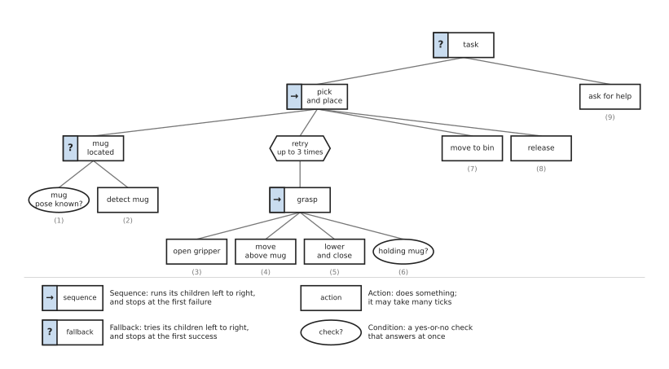
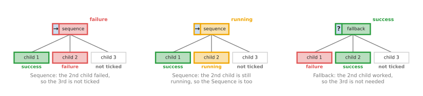
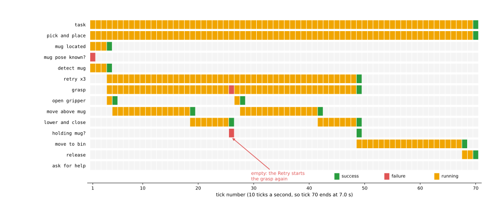
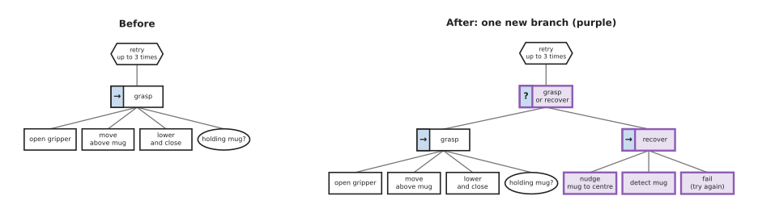

# Behaviour trees

This page explains the behaviour tree: the most common way to write the task logic
of a robot arm today. It answers five questions. What is a behaviour tree? How does
it decide what to run, tick by tick? Where does a robot arm use one? When does it go
wrong? And which libraries give you one ready-made?

It is for a reader who has read the page on
[finite state machines](01_finite-state-machines.md). That page explains states,
events, retries and the pick-and-place task. This page writes the same task as a
tree, so the two can be compared directly.

## Contents

1. [Introduction](#1-introduction)
2. [The idea in one sentence](#2-the-idea-in-one-sentence)
3. [How it works, step by step](#3-how-it-works-step-by-step)
   · [Ticks and the three answers](#ticks-and-the-three-answers)
   · [The kinds of node](#the-kinds-of-node)
   · [The pick-and-place tree](#the-pick-and-place-tree)
   · [How a parent combines its children's answers](#how-a-parent-combines-its-childrens-answers)
   · [A worked run, tick by tick](#a-worked-run-tick-by-tick)
   · [Pseudocode](#pseudocode)
   · [Adding a recovery](#adding-a-recovery)
   · [Reacting while a step runs](#reacting-while-a-step-runs)
   · [Sharing data: the blackboard](#sharing-data-the-blackboard)
4. [Where it is used on a robot arm](#4-where-it-is-used-on-a-robot-arm)
5. [Where it is useful, and where it is not](#5-where-it-is-useful-and-where-it-is-not)
6. [Libraries that provide it](#6-libraries-that-provide-it)
7. [Why a behaviour tree, and what it costs](#7-why-a-behaviour-tree-and-what-it-costs)
8. [The learned alternative](#8-the-learned-alternative)
9. [Where to read next](#9-where-to-read-next)

---

## 1. Introduction

The state machine on the previous page works well for eight states. But real tasks
grow. A customer asks for a second way to grasp, a check that the bin is not full,
and a stop when a person comes near. Each of these adds arrows to several states,
and soon nobody can change the drawing safely.

A behaviour tree solves this by changing the shape. It does not list situations and
arrows between them. It lists steps, and groups them with a small number of rules
such as "do these in order" and "try these until one works". A retry or a recovery
is then one new branch in one place. The rest of the tree does not change.

Behaviour trees came from video games, where they control the characters. Robotics
took them up because of this one property: they stay readable as the task grows.
Most robot arm programs written with ROS 2 today use one for the top layer.

---

## 2. The idea in one sentence

A behaviour tree is a tree of steps and checks that is re-checked many times a
second, where each node answers "success", "failure" or "still running", and each
parent node combines its children's answers by a fixed rule.

Here is an everyday example: making a cup of tea. You do these in order: boil the
water, put tea in the cup, pour the water, and wait. To put tea in the cup, you try
these until one works: use a tea bag, or use loose tea with a strainer. If there are
no tea bags, you do not start over. You just try the next way. And if neither way
works, the whole "make tea" fails, and you know exactly which step stopped it.

The words "in order" and "try until one works" are the two main rules of a
behaviour tree. Everything else is built from them.

---

## 3. How it works, step by step

### Ticks and the three answers

A behaviour tree does not run once from top to bottom. A loop **ticks** the tree
many times a second, often 10 to 100 times. A tick is one visit that starts at the
top node, called the **root**, and passes down to the children.

Every node that is ticked gives back one of three answers:

- **success**: this step is done and it worked;
- **failure**: this step is done and it did not work;
- **running**: this step has started but is not finished yet.

The third answer is what makes behaviour trees fit robots. A move takes two seconds.
The "move above mug" node answers "running" on every tick until the arm arrives, and
then answers "success". Meanwhile the loop is free, and other checks in the tree can
still run on each tick.

### The kinds of node

A tree is built from a small set of node kinds.

1. An **action** does something in the world, such as "move above mug" or "open
   gripper". It may take many ticks, so it can answer "running".
2. A **condition** is a yes-or-no check, such as "holding mug?". It answers at once,
   with "success" for yes or "failure" for no. It never answers "running".
3. A **Sequence** runs its children from left to right. It moves to the next child
   when the current one succeeds. It stops and fails as soon as one child fails. It
   succeeds when every child has succeeded. It is drawn with an arrow, →.
4. A **Fallback** tries its children from left to right. It moves to the next child
   when the current one fails. It stops and succeeds as soon as one child succeeds.
   It fails only when every child has failed. It is drawn with a question mark, ?.
   Some libraries call it a **Selector**.
5. A **decorator** has one child and changes its answer. A **Retry** decorator
   starts its child again after a failure, up to a set number of times. An
   **Inverter** swaps success and failure. A **Timeout** fails its child if it runs
   too long.
6. A **Parallel** node ticks all its children on every tick, and succeeds when
   enough of them have succeeded.

Actions and conditions are the **leaves**: the nodes at the bottom with no
children. You write the leaves yourself. They call the rest of your robot program:
the detector, the planner, the gripper driver. The Sequence, Fallback, decorator and
Parallel nodes come ready-made in every library.

### The pick-and-place tree

The picture below shows the running example as a behaviour tree. It does the same
job as the state machine on the previous page.



The small numbers under the leaves are the order in which they run when everything
works. Read the tree from the top.

- The root, "task", is a Fallback. It first tries "pick and place". If that fails,
  it runs "ask for help". This one node replaces the three red "ask for help" arrows
  of the state machine.
- "pick and place" is a Sequence of four children: make sure the mug is located,
  grasp it with retries, move to the bin, and release.
- "mug located" is a Fallback. If the mug's position is already known, the
  condition succeeds and nothing else runs. If not, "detect mug" runs.
- "retry up to 3 times" is a decorator over the "grasp" Sequence. The Sequence
  opens the gripper, moves above the mug, lowers and closes, and then checks
  "holding mug?". If the check fails, the whole Sequence fails, and the Retry starts
  it again from "open gripper".

There is no retry counter in the task code. The Retry node keeps it. This is the
extra number that the state machine had to carry by hand.

### How a parent combines its children's answers

The rules of Sequence and Fallback are easiest to see on small cases. The picture
below shows three.



On the left, a Sequence's second child failed. The Sequence fails too, and never
ticks the third child. In the middle, the second child is still running, so the
Sequence answers "running" and will tick that child again next time. On the right, a
Fallback's first child failed, so it tried the second, which worked. The Fallback
succeeds without ticking the third.

The two rules mirror each other. A Sequence goes on after success and stops at
failure. A Fallback goes on after failure and stops at success. Both pass "running"
straight up.

### A worked run, tick by tick

The diagram script for this page holds a small behaviour tree engine and the tree
above. It ticks the tree 10 times a second. Each action takes a fixed number of
ticks: 4 to detect, 2 to open the gripper, 15 to move above the mug, 8 to lower and
close, 20 to move to the bin, and 3 to release. The "holding mug?" check fails on the
first try and succeeds on the second.

The picture below shows every node's answer on every tick of that run. Each row is
one node, indented under its parent. Each column is one tick. A grey cell means the
node was not ticked at all on that tick.



Here is what happened, as the script printed it.

1. On tick 1, "mug pose known?" fails, because no picture has been taken yet. So the
   "mug located" Fallback ticks "detect mug", which answers "running".
2. On tick 4, "detect mug" succeeds. In the same tick, "pick and place" moves on to
   its second child, and "open gripper" starts. A Sequence moves to its next child as
   soon as one succeeds; it does not wait for the next tick.
3. Ticks 5 to 26 run the first grasp: "move above mug" from tick 5 to 19, then "lower
   and close" from tick 19 to 26.
4. On tick 26, "holding mug?" fails. The "grasp" Sequence fails. The Retry counts one
   failure and answers "running", so nothing above it notices.
5. Ticks 27 to 49 run the second grasp. On tick 49, "holding mug?" succeeds. The
   Retry succeeds, and "move to bin" starts in the same tick.
6. On tick 70, "release" succeeds. "pick and place" succeeds, and so does the root.
   The loop stops.

The whole task took 70 ticks, which is 7.0 s. Each grasp try took 23 ticks. The
actions add up to 2 + 15 + 8 = 25 ticks, but each new action starts in the tick its
predecessor finishes, which saves one tick at each of the two joins.

The script also ran the same tree with all three grasps failing. Then the third
failure comes on tick 72. The Retry gives up and fails, "pick and place" fails, and
the root Fallback ticks "ask for help" in the same tick. The root answers "success",
because one of its children succeeded. Here "success" means "the task was handled",
not "the mug is in the bin". The log shows which way it went.

### Pseudocode

The whole engine is one short function that calls itself on the children, and a
loop. The pseudocode below does not depend on any programming language. Each
Sequence and Fallback remembers which child was running, and carries on from it on
the next tick.

```
function tick(node):
    if node is a condition:
        if the check is true: return SUCCESS
        else:                 return FAILURE

    if node is an action:
        do a little more of the action (or start it)
        return RUNNING, SUCCESS or FAILURE

    if node is a Sequence:
        for each child, starting from node.current:
            answer = tick(child)
            if answer is RUNNING:
                node.current = this child
                return RUNNING
            if answer is FAILURE:
                node.current = first child
                return FAILURE
        node.current = first child
        return SUCCESS

    if node is a Fallback:
        (the same as Sequence, with SUCCESS and FAILURE swapped)

    if node is a Retry with limit n:
        answer = tick(node.child)
        if answer is FAILURE:
            node.failures = node.failures + 1
            reset node.child, so it starts again from the beginning
            if node.failures < n: return RUNNING
            node.failures = 0
            return FAILURE
        if answer is SUCCESS: node.failures = 0
        return answer

main loop, 10 times a second:
    answer = tick(root)
    if answer is not RUNNING: stop
```

This is the logic the diagram script runs, and the trace above is its output.

### Adding a recovery

The main advantage of a behaviour tree shows when the task changes. Suppose you find
that most failed grasps happen because the mug sits too near the edge of the tray,
where the fingers hit the wall. The fix is to nudge the mug towards the centre and
look again before the next try.

In a behaviour tree, this is one new branch. The picture below shows the grasp part
before and after the change.



The new Fallback "grasp or recover" first tries the grasp. If the grasp fails, it
runs "recover": nudge the mug to the centre, detect it again, and then fail on
purpose. That last failure makes the Retry count one try and start again, now with
the mug in a better place. Nothing outside the purple nodes changed. In the state
machine, the same change needs a new "nudge" state, a new arrow out of "check
grasp" into it, and a new arrow from it back to "detect".

### Reacting while a step runs

The Sequence above checks "mug located" once, and then does not look at it again
while the grasp runs. That is usually right. But some checks must be made on every
tick. A safety check such as "no person in the work area?" must stop a move the
moment it fails, not after the move ends.

For this, libraries offer a **reactive** Sequence. It starts from its first child on
every tick, instead of from the one that was running. So a condition placed first
is re-checked every tick. If it fails while "move to bin" is running, the Sequence
fails, and it tells the running action to stop. Stopping a running action this way
is called **halting** it. Each action you write must handle a halt, for example by
telling the arm controller to stop smoothly.

In BehaviorTree.CPP this node is called `ReactiveSequence`. In py_trees the same
choice is the `memory` setting of a Sequence: `memory=False` makes it reactive.

### Sharing data: the blackboard

Nodes need to pass data to each other. "detect mug" finds a position, and "move
above mug" needs it. A behaviour tree keeps such data in a **blackboard**: a shared
table of named values. "detect mug" writes the value `mug_pose`. "move above mug"
reads it. The condition "mug pose known?" just checks whether `mug_pose` is set.

The blackboard keeps the nodes independent. "move above mug" does not need to know
which node found the mug, so you can swap the detector without touching the move.

---

## 4. Where it is used on a robot arm

Behaviour trees usually sit at the top of the program, above perception, planning
and control. Here are several concrete places.

- **The task.** Pick and place, as above, and longer jobs such as loading a machine:
  open the door, take out the finished part, put in a new one, close the door, press
  start. Each step has its own retries and fallbacks.
- **Choosing a grasp.** A Fallback tries "grasp from above", then "grasp from the
  side", then "push the object away from the wall and try again". Book 3's
  [behaviour trees](../../../03_frameworks/01_tools-and-libraries.md#11-behaviour-trees-putting-a-task-in-order)
  section shows the first two in real code.
- **Planning with a backup.** A Fallback first asks the planner for a path with a
  short time limit, and if that fails, asks again with a longer one or a different
  planner. The [sampling-based planning](../../06_planning-and-search/02_most-used/01_sampling-based-planning.md)
  page explains why a second try can find a path the first missed.
- **Perception with a backup.** A Fallback first tries a fast colour mask, as on the
  [thresholding and colour masks](../../05_image-and-point-cloud-processing/02_most-used/01_thresholding-and-colour-masks.md)
  page. If it finds nothing, it runs a slower learned detector.
- **Safety checks during motion.** A reactive Sequence re-checks "work area clear?"
  and "force below limit?" on every tick while the arm moves, and halts the move when
  either fails.
- **Mobile arms.** The ROS 2 navigation stack, Nav2, runs its navigation as a
  behaviour tree built with BehaviorTree.CPP. An arm on a mobile base often uses one
  tree for driving and another for the arm.
- **Under a language model.** A language model can choose which subtree to run from
  a spoken request, while the tree still does the running. Book 6's
  [language models as planners](../../../06_neural-network-models/06_language-models/03_also-used/01_language-models-as-planners.md)
  page describes this.

---

## 5. Where it is useful, and where it is not

A behaviour tree is useful when the task has many steps and many ways to recover.
It is easy to add a new recovery, to reuse a subtree in two places, and to watch the
tree run in a viewer. Each leaf can be tested on its own.

It goes wrong in a few common ways. The table below lists them. Each row gives the
mistake, the sign you would see, and the usual fix.

| Problem | The sign you would see | What people do instead |
|---|---|---|
| An action blocks the tick. It waits for the move to end before returning. | The whole tree freezes during each move. Safety checks and the stop button stop working. | Actions start the work and return "running" at once. The work runs on its own. |
| A running action is not halted properly. | A move keeps going after its branch failed, or the next move starts while the last is still running. | Write a halt step for every action, and test it. |
| The wrong kind of Sequence. | With memory: a safety check is not re-checked during a move. Reactive: a finished step is started again when an earlier condition flickers. | Use a reactive Sequence only for true "must stay true" checks, and a Sequence with memory for steps. |
| "Success" is read as "the job worked". | The log says success, but the mug is still on the table, because "ask for help" succeeded. | Log which branch succeeded, or write the outcome to the blackboard. |
| Too much data on the blackboard. | Nodes depend on values written far away in the tree. A change in one branch breaks another. | Keep blackboard names few and clear; pass values through each node's declared inputs and outputs. |
| The tree grows into one huge file. | Nobody can find where a behaviour is decided. | Split it into named subtrees, each in its own file. |
| The task changes every day, not just its recoveries. | Someone rewrites the tree for each job. | A task planner, or a language model that picks subtrees. |

A behaviour tree is not the right tool for the lowest levels. A gripper driver or a
controller's safety modes have few, clear states and must be checked by hand. A
[finite state machine](01_finite-state-machines.md) is better there. Behaviour trees
also do not choose the best order or set; that is the job of
[greedy algorithms](../03_also-used/01_greedy-algorithms-and-set-cover.md) and
[optimisation solvers](../03_also-used/02_optimisation-solvers.md), which a tree can call as one
action.

---

## 6. Libraries that provide it

You rarely write the engine yourself. The table below lists well-known libraries.
The third column names the main class or node to look for.

| Library | Languages | Where to start | Note |
|---|---|---|---|
| BehaviorTree.CPP | C++, trees in XML | `BT::BehaviorTreeFactory`; XML nodes `Sequence`, `Fallback`, `ReactiveSequence`, `RetryUntilSuccessful`, `Parallel` | The most used library in ROS 2. You write leaves in C++ and the tree in XML, so the tree can change without rebuilding. |
| Groot2 | a graphical editor | draws and edits BehaviorTree.CPP trees | Shows the tree running live, with each node coloured by its answer. |
| py_trees | Python | `py_trees.composites.Sequence`, `py_trees.composites.Selector`, `py_trees.composites.Parallel`, `py_trees.decorators`, `py_trees.trees.BehaviourTree` | The same ideas in Python. A Fallback is called a Selector. Good for learning and for small projects. |
| py_trees_ros | Python, ROS 2 | the `py_trees_ros` package | Connects py_trees to ROS 2 topics, services and actions, with a viewer. |
| Nav2 | C++, ROS 2 | the `nav2_bt_navigator` package | Not an arm library, but the best-known real behaviour tree in ROS 2, and a good example to read. |

BehaviorTree.CPP and py_trees both offer a blackboard, decorators for retries and
timeouts, and a way to print or log the tree's answers on each tick. Book 3 shows
the same small tree in both libraries in
[behaviour trees: putting a task in order](../../../03_frameworks/01_tools-and-libraries.md#11-behaviour-trees-putting-a-task-in-order).

---

## 7. Why a behaviour tree, and what it costs

This section answers the four questions for a behaviour tree: what it is, what it
does for you, why it rather than the obvious alternative, and what it costs.

A behaviour tree is a tree of actions and checks, grouped by Sequence, Fallback and
a few other ready-made nodes, and ticked many times a second. It gives you a task
that can react to failures, retry, try alternatives and stop safely, written in a
shape that stays readable as the task grows.

The obvious alternative is a [finite state machine](01_finite-state-machines.md).
A state machine is simpler for a handful of clear situations, and easier to prove
correct. But each new recovery adds arrows to several states. In a behaviour tree,
a recovery is one new branch, as the recovery example showed, and a whole subtree
can be reused in another task. The retry counter lives in a Retry node, not in your
own code. That is why most robot arm programs choose a tree for the task layer and
keep state machines for drivers and safety modes.

The costs are these. You must learn a new way to think: steps that answer
"running", ticks, and the difference between a Sequence with memory and a reactive
one. Every action must be written so that it does not block and can be halted.
"Success" at the root does not always mean the job worked, so you need good logging.
You add a library, and with BehaviorTree.CPP a second language, XML, that a newcomer
must read. And a tree only does what you drew; it does not plan a new task on its
own.

---

## 8. The learned alternative

Book 6 compares a behaviour tree directly with a
[language model as planner](../../../06_neural-network-models/06_language-models/03_also-used/01_language-models-as-planners.md),
which chooses the order of the robot's steps from a request in plain words. The
planner earns its place when the request changes from one day to the next and
nobody can list every request in advance. For a task that never changes, such as
the same box packed the same way every day, Book 6 says the tree is the better
choice, because it is free to run, fast, and always does the same thing. A
[vision-language-action model](../../../06_neural-network-models/06_language-models/02_most-used/01_vision-language-action-models.md)
goes further and turns pictures and an instruction straight into arm movements,
but its success rates are still well below what a production line needs. In
practice the two meet: a language model picks a subtree, as section 4 showed, and
a learned model such as
[collision and failure detection](../../../06_neural-network-models/08_touch-and-body-models/02_most-used/02_collision-and-failure-detection.md)
can serve as a condition such as "grasp failed?".

---

## 9. Where to read next

- The [finite state machines](01_finite-state-machines.md) page writes the same task
  as states and arrows. Reading them side by side is the fastest way to see the
  difference.
- The [chapter overview](../01_overview.md) shows how task logic fits with the
  choosers: [greedy algorithms and set cover](../03_also-used/01_greedy-algorithms-and-set-cover.md)
  and [optimisation solvers](../03_also-used/02_optimisation-solvers.md).
- Book 3 has real code in
  [behaviour trees: putting a task in order](../../../03_frameworks/01_tools-and-libraries.md#11-behaviour-trees-putting-a-task-in-order),
  a comparison with state machines in
  [scripted logic](../../../03_frameworks/04_one-arm-training/02_programmed-methods.md#3-scripted-logic-state-machines-and-behaviour-trees),
  and a project that uses a tree in
  [sequencing the job: behaviour trees](../../../03_frameworks/04_one-arm-training/04_learning-path.md#sequencing-the-job-behaviour-trees).
