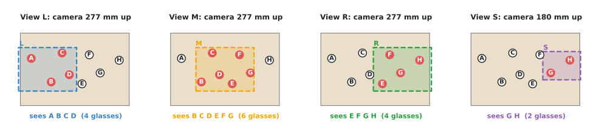
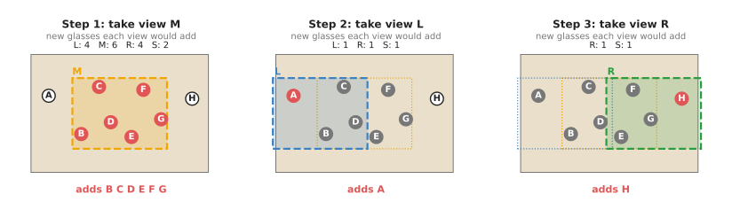
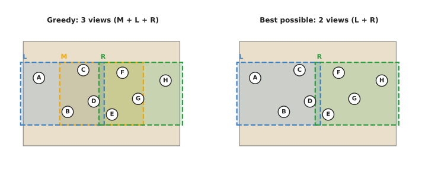
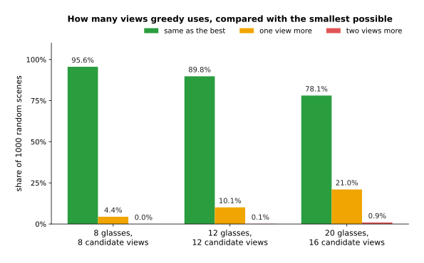

# Greedy algorithms and set cover

This page explains greedy algorithms, together with the most useful problem they
solve on a robot arm, which is set cover, and it answers four questions. What does
"greedy" mean for a program, and how does greedy set cover choose the fewest camera
views that see every object? How close to the best answer does it get, and when
should you use something else instead?

It is written for a reader who has met the arm, the camera on its wrist and the idea
of a viewpoint, as in Books 1 and 2, but who has not taken an algorithms course. So
no knowledge of complexity theory is needed, and where the page uses a term such as
"NP-hard", it explains that term in plain words first.

The page sits in the chapter on [decisions and task logic](../01_overview.md), and it
answers a different question from the two pages before it. While those pages,
[finite state machines](../02_most-used/01_finite-state-machines.md) and
[behaviour trees](../02_most-used/02_behaviour-trees.md), decide which step the robot
does next, this page and the next one,
[optimisation solvers](02_optimisation-solvers.md), instead decide which choice to
make when there are many possible choices and some are better than others.

## Contents

1. [The idea in one sentence](#1-the-idea-in-one-sentence)
2. [Set cover: the problem greedy is best known for](#2-set-cover-the-problem-greedy-is-best-known-for)
3. [How greedy set cover works, step by step](#3-how-greedy-set-cover-works-step-by-step)
   · [A worked example with eight glasses](#a-worked-example-with-eight-glasses)
   · [Checking the answer by trying every group](#checking-the-answer-by-trying-every-group)
   · [The pseudocode](#the-pseudocode)
4. [How far from the best greedy can be](#4-how-far-from-the-best-greedy-can-be)
5. [Where greedy choices are used on a robot arm](#5-where-greedy-choices-are-used-on-a-robot-arm)
6. [Where greedy is good enough, and where it is not](#6-where-greedy-is-good-enough-and-where-it-is-not)
7. [Libraries that provide it](#7-libraries-that-provide-it)
8. [Why greedy, and what it costs](#8-why-greedy-and-what-it-costs)
9. [The learned alternative](#9-the-learned-alternative)
10. [Where to read next](#10-where-to-read-next)
11. [Using it in Python](#11-using-it-in-python)

---

## 1. The idea in one sentence

Since this page is about choosing among many choices, here is the method in one
sentence. A **greedy algorithm** builds an answer one piece at a time, and at each
step it takes the piece that looks best right now, without ever going back to change
an earlier piece.

Here is an everyday example of the same method at work. You have a shopping list of
eight items, and there are four shops in town, each selling some of the items, and you
want to visit as few shops as possible. So the greedy way to choose the shops is
simple. First go to the shop that
sells the most items on your list, and cross those items off. Then go to the shop
that sells the most of the items that are left, and repeat until the list is empty.

That plan is quick to work out, and it is usually good, but it is not always the best
plan. Section 3 shows a case where it visits three shops when two would have been
enough.

The word "greedy" describes two properties together:

- the choice at each step uses only what is known at that step. It does not look
  ahead to see how this choice affects the later ones.
- a choice, once made, is never undone.

Both of those properties make a greedy algorithm fast and short, but both are also
the reason why it can miss the best answer.

---

## 2. Set cover: the problem greedy is best known for

The shopping example above has a name, and it is called **set cover**. Its general
form is this: you have a list of things that must all be covered, called the
**universe**, and you also have a collection of groups, called **sets**, where each
set covers some of the things. Then the task is to choose as few sets as possible so
that every thing is covered by at least one chosen set.

On a robot arm, set cover appears whenever one action serves several needs at once,
and the most common case is choosing camera views.

So think of a camera on the arm's wrist, looking straight down at a table. From each
pose the arm can reach, the camera sees one rectangle of the table, and that
rectangle is called the camera's **footprint**. An object is seen from a pose if it
lies inside that footprint, so each candidate pose is a set, namely the set of
objects it sees. The universe is then the list of objects the robot must look at, and
choosing the fewest poses that together see every object is set cover.

Book 2 treats this choice in depth in
[choosing where to look](../../../02_perception/02_object-perception/09_choosing-where-to-look.md),
including how to test whether one object hides another from a view. Instead this page
takes the sets as given, and looks only at how to choose among them.

Set cover is also **NP-hard**, which in plain words means that no method is known
that always finds the smallest group of sets quickly. Instead, every known exact method takes,
in the worst case, a time that grows faster than any fixed power of the number of
sets. For a handful of views that does not matter, but for hundreds it does. That is
why the greedy method is the usual choice.

---

## 3. How greedy set cover works, step by step

Because an exact method would be too slow at scale, the greedy method for set cover
is used instead, and it has three steps.

1. Start with every object marked as "not yet seen".
2. Look at every candidate view that is not chosen yet. For each one, count how
   many not-yet-seen objects it would see. Take the view with the highest count.
   Mark its objects as seen.
3. Repeat step 2 until every object is seen. If no view can add a new object while
   some objects are still unseen, stop and report those objects as not coverable.

When two views have the same count you can take either one, but a real program takes
the first one in its list, which is what the example below does.

### A worked example with eight glasses

Because those three steps are easier to follow on a real scene, here is one. Eight
glasses, named A to H, stand on a table 600 mm wide and 400 mm deep, and the arm can
place its wrist camera over four candidate points, looking straight down. The camera
is the same one used across this repository, with a 320 by 240 pixel picture and a
focal length of 277.1 pixels. So at a height `h` above the table its footprint is
`h × 320 / 277.1` wide and `h × 240 / 277.1` deep, which at 277 mm up is 320 by
240 mm and at 180 mm up is 208 by 156 mm.

The picture below shows those four footprints, one per panel, together with the
glasses each one contains.



The dashed rectangle is the footprint, while the red glasses are the ones inside it.
These sets were computed by the diagram script from the positions of the glasses and
the footprints, rather than typed in by hand.

The table below lists those same four sets in words. Read each row as one view,
giving where the camera is and which glasses it sees.

| View | Point under the camera | Height | Footprint | Sees |
| --- | --- | --- | --- | --- |
| L | (150, 200) mm | 277 mm | 320 × 240 mm | A, B, C, D (4) |
| M | (300, 200) mm | 277 mm | 320 × 240 mm | B, C, D, E, F, G (6) |
| R | (450, 200) mm | 277 mm | 320 × 240 mm | E, F, G, H (4) |
| S | (500, 220) mm | 180 mm | 208 × 156 mm | G, H (2) |

So the greedy method can now be run on those four sets.

1. All eight glasses are unseen. The counts are L 4, M 6, R 4 and S 2. View M has
   the highest count, so greedy takes M. Glasses B, C, D, E, F and G are now seen.
   Only A and H are left.
2. The counts for the views that are left are L 1 (it adds A), R 1 (it adds H) and
   S 1 (it adds H). They tie. Greedy takes the first, which is L. Now only H is
   left.
3. The counts are R 1 and S 1. Greedy takes R. Every glass is now seen.

The picture below shows those three steps as three panels.



In each panel the red glasses are the ones that step adds, while the grey glasses
were already seen, and the line of numbers under each title is the count greedy
compared at that step. So greedy ends up using three views, which are M, L and R.

### Checking the answer by trying every group

Since there are only four views here, a program can simply try every group of them.
That is called **brute force** or **exhaustive search**, meaning try every
possibility and keep the best. It starts with groups of one view, then groups of two,
and it stops at the first group that sees all eight glasses.

- No single view sees all eight. The largest, M, sees six.
- Of the six possible pairs, L with R sees all eight. L sees A to D and R sees E
  to H.

So the smallest answer is two views, L and R, while greedy used three. This means the
picture below can put those two answers side by side.



The left panel shows greedy's three footprints overlapping, while the right panel
shows that L and R alone already cover the whole row of glasses.

But the reason greedy lost is visible in that picture. View M is the biggest single
set,
so it looks like the best first choice. But M sees the middle six glasses and leaves
one glass at each end, so each of those two glasses then needs its own view. While views L
and R each see fewer glasses than M, they fit together without any overlap. This
happens because greedy never asks "how well does this view fit with the others?",
only "how many new glasses does this view see right now?", which is the whole weakness
of a greedy choice in one example.

This kind of trap is not rare in a real cell, because a camera held high sees the
most, so it wins the first round, and the objects near the edges then need extra
views.

### The pseudocode

Once the method is clear, it fits in a few lines. The pseudocode below is written in
plain steps, not in any programming language.

```
greedy_set_cover(objects, views):
    # views: for each candidate view, the set of objects it sees
    unseen = copy of objects
    chosen = empty list
    while unseen is not empty:
        best_view = none
        best_count = 0
        for each view in views, not already in chosen:
            count = number of objects in (view.sees AND unseen)
            if count > best_count:
                best_view = view
                best_count = count
        if best_view is none:
            return chosen, unseen          # these objects no view can see
        add best_view to chosen
        remove best_view.sees from unseen
    return chosen, empty
```

The exact check used above is just as short to write, but its running time is very
different.

```
smallest_set_cover(objects, views):
    for k = 1, 2, ..., number of views:
        for each group of k views:
            if the union of what the group sees contains every object:
                return the group
    return none                            # no group covers everything
```

With `m` candidate views, the exact check can try up to `2^m` groups. Four views
means 16 groups, while sixteen views means 65,536 groups, which a computer tries in
well under a second. But thirty views means 1,073,741,824 groups, and forty views
means more than a million million. Greedy, in contrast, looks at each view at most
once per step, so it does at most `m × m` counts.

---

## 4. How far from the best greedy can be

The example above was one scene, so two questions matter in practice. How often does
greedy miss the smallest answer, and by how much?

To find out, the diagram script built 1,000 random scenes of each of three sizes. In
each scene the glasses and the candidate views were placed at random on the 600 by
400 mm table, and each view's camera height was drawn between 150 and 350 mm, while
scenes that no group of views could cover were thrown away and drawn again. Then for
each scene the script ran greedy and also found the smallest answer by trying every
group, and the chart below shows the result.



Each group of bars is one scene size, where the green bar is the share of scenes in
which greedy found a smallest answer, and the orange and red bars are the shares
where it used one or two views more.

The table below gives the same numbers, together with the average number of views,
and each row of it is one scene size.

| Scene | Greedy found the smallest | One view more | Two views more | Average, smallest | Average, greedy |
| --- | --- | --- | --- | --- | --- |
| 8 glasses, 8 views | 95.6% | 4.4% | 0% | 3.27 | 3.32 |
| 12 glasses, 12 views | 89.8% | 10.1% | 0.1% | 3.94 | 4.04 |
| 20 glasses, 16 views | 78.1% | 21.0% | 0.9% | 4.57 | 4.79 |

Three things stand out in the numbers of that table.

- Greedy is right most of the time, and never used more than two extra views in
  these trials.
- It gets worse as the scene grows. With 20 glasses it missed the smallest answer
  in about one scene in five.
- On average the extra cost is small: a fifth of a view with 20 glasses.

There is also a proven limit on how badly greedy can do. If the largest set holds
`d` objects, greedy never uses more than `1 + 1/2 + 1/3 + ... + 1/d` times as many
sets as the smallest answer, and that sum grows very slowly, roughly as the natural
logarithm of `d`. In the example the largest view sees six glasses, so the limit
is
`1 + 1/2 + 1/3 + 1/4 + 1/5 + 1/6 = 2.45`. Greedy used 3 views where 2 were
enough, which is 1.5 times, well inside that limit. Researchers have also shown
that, unless a famous open question in computer science has a surprising answer,
no fast method can promise a much better limit than this one. In short: greedy is
about as good as any fast method can promise to be.

But a related question often matters more on a robot. Suppose the arm has time for
only
two views, so which two should it take to see the most glasses? That question is
called **maximum coverage**, and greedy is again the usual method, because you simply
take the view that adds the most, twice. This is proven to see at least about 63 per
cent of what the best pair would see. In the example, greedy's first two picks, M and
L, see seven of the eight glasses, while the best pair, L and R, sees all eight.

---

## 5. Where greedy choices are used on a robot arm

Greedy set cover is only one greedy algorithm among many, because the same "take the
best-looking choice now" rule appears all over robot-arm software, and here are the
common places where it does.

- **Choosing a fixed set of camera views offline.** Book 2 describes this in
  [how to pick them](../../../02_perception/02_object-perception/09_choosing-where-to-look.md#52-how-to-pick-them):
  take the candidate that sees the most target points, remove those points, and
  repeat. It runs once at a desk. Then the chosen poses are tested on the arm.
- **Covering patches that could not be seen.** The
  [glasses-picking project](https://github.com/RobinNagpal/robot-arm-projects/blob/main/v5-pick-glasses/docs/problem-2/solutions/03-move-the-camera.md)
  in the sibling repository uses greedy set cover when some patches of the table
  were hidden behind glasses. So each candidate camera position sees some of the
  hidden patches, and the program takes the one that sees the most, and repeats until
  every patch is seen or the budget of extra looks runs out.
- **Deciding the order to visit places.** Nearest-neighbour ordering is greedy: go
  next to the closest place not yet visited. Book 2 measured it in
  [the order to visit them in](../../../02_perception/02_object-perception/09_choosing-where-to-look.md#6-the-order-to-visit-them-in):
  on average it costs four to ten per cent more travel than the best order, and in
  the worst trial 48 per cent more.
- **Removing duplicate detections.** An object detector gives several boxes for
  one mug. The clean-up step, called non-maximum suppression, is greedy, because it keeps the
  box with the highest confidence, removes the boxes that overlap it, and then
  repeats. Book 6 explains it in
  [cleaning up the extra boxes](../../../06_learned-models/03_seeing-models/02_most-used/01_object-detection.md#cleaning-up-the-extra-boxes).
- **Matching detections to tracked objects.** Greedy matching pairs the closest
  detection and track first, then the next closest, and so on, which is fast. But it
  can make a wrong pair when two objects pass close to each other.
  [Assignment and matching](../../03_searching-and-matching/02_most-used/03_assignment-and-matching.md)
  compares it with the exact Hungarian method.
- **Picking from clutter.** A bin-picking cell often picks the object with the
  highest grasp score first, or the object on top of the pile first. That is a
  greedy order. It works well because the scene changes after each pick, so a
  long plan would be out of date anyway.
- **Online next-best view.** When the robot looks, thinks, and then chooses the
  next pose, it usually takes the pose that would reveal the most unknown space.
  That is maximum coverage, one view at a time.

---

## 6. Where greedy is good enough, and where it is not

All the uses above have something in common, because greedy is a good choice when a
small loss does not matter, when the problem is too big to solve exactly, or when the
scene changes so often that a perfect long plan would be wasted. But it is a poor
choice when each extra action is expensive and the problem is small enough to solve
exactly.

The table below lists the common ways greedy goes wrong on an arm. Read each row as
one situation, giving the sign you would see and what to use instead.

| Situation | What you would see | What to use instead |
| --- | --- | --- |
| One large set overlaps many small ones, as with view M above | Greedy's views overlap a lot, and each extra view adds only one or two objects | Try every group if there are fewer than about 20 candidates; otherwise an integer program ([optimisation solvers](02_optimisation-solvers.md)) |
| Each view has a different cost, such as a long arm move | Greedy picks a view that sees many objects but is far away | Weighted greedy: choose by new objects per second of arm travel, not by new objects alone |
| Ties between views | Different runs pick different views for the same scene | Break ties by a fixed rule, such as the shortest arm move |
| The order must obey rules, such as "C before B" | Nearest-neighbour ordering visits a blocked object first | A [blocking graph](../../../03_frameworks/03_arm-movement/07_ordering-and-rearrangement.md#2-the-blocking-graph), or a solver with constraints |
| Two tracks and two detections are close together | Tracked identities swap when objects pass each other | The Hungarian method in [assignment and matching](../../03_searching-and-matching/02_most-used/03_assignment-and-matching.md) |
| No candidate sees some object at all | The loop finds no view that adds anything | Report the object as unseen; add candidate poses; do not loop forever |

The weighted form in the second row deserves one more sentence. If moving to a view
costs time, divide each view's count of new objects by its cost, and then take the
view with the highest ratio. This is the standard greedy method for **weighted set
cover**, and it keeps the same proven limit.

So two signs tell you that greedy is probably good enough. First, the number of chosen
views is small compared with the number of candidates, and removing any one chosen
view leaves an object unseen. Second, when you run the exact search on a few saved
scenes, it agrees with greedy or finds only one view fewer. But if the exact search
often finds a smaller answer on your real scenes, that is the sign to switch.

---

## 7. Libraries that provide it

Greedy set cover is about fifteen lines of code in any language, so most projects
write it themselves. This means libraries matter more for the exact alternative, and
for the other greedy steps listed in section 5. The table below lists the well-known
ones, and each row is one library, giving the languages it can be used from, the part
that is relevant, and what it gives you.

| Library | Languages | Function or module | Note |
| --- | --- | --- | --- |
| Your own code | any | a loop, as in section 3 | The usual choice for greedy set cover; there is nothing to install |
| Google OR-Tools | C++, Python, Java, C# | `ortools.sat.python.cp_model` (CP-SAT), `ortools.linear_solver.pywraplp` | Solves set cover exactly as an integer program; see [optimisation solvers](02_optimisation-solvers.md) |
| SciPy | Python | `scipy.optimize.milp` | Solves set cover exactly as a mixed-integer linear program |
| OR-Tools routing | C++, Python, Java, C# | `pywrapcp.RoutingModel` with `FirstSolutionStrategy.PATH_CHEAPEST_ARC` | Builds a first route greedily, then improves it |
| NetworkX | Python | `networkx.algorithms.approximation` | Greedy approximations for graph problems, including `greedy_tsp` for a visiting order |
| OpenCV | C++, Python | `cv2.dnn.NMSBoxes` | Greedy non-maximum suppression of detection boxes |
| torchvision | Python | `torchvision.ops.nms` | The same greedy clean-up, on the graphics processor |
| SciPy | Python | `scipy.optimize.linear_sum_assignment` | The exact alternative to greedy matching |

---

## 8. Why greedy, and what it costs

### What it is

A greedy algorithm makes the best-looking choice at each step and then never goes
back on it. So greedy set cover repeatedly takes the set that covers the most things
not yet covered.

### What it does for you

This means it turns a problem that has no known fast exact method into a loop that
finishes in a fraction of a millisecond for any cell-sized problem. And it gives an answer that is
usually the smallest and is never far from it, because in the random trials above it
used at most two views more than needed, and usually none.

### Why greedy rather than the obvious alternative

The obvious alternative is to
compute the best answer exactly, either by trying every group or with an integer
programming solver. So choose greedy when the exact answer is not worth what it
costs. But trying every group becomes slow at about 25 to 30 candidate views, because the
number of groups doubles with each candidate. A solver has no such wall at cell sizes,
but it is a dependency to install, to learn and to run on the robot computer. On many
arms the scene also changes after every move, so the robot re-plans anyway, and one
extra view now and then costs less than any of that. But the reverse also holds, since
when there are fewer than about 20 candidates, trying every group is short, exact and
fast, so there is no reason to accept greedy's loss.

### What it costs you

It costs a guarantee, because greedy can use more views than needed, as it did in
the example, and it does not tell you when it has done so. It also costs
predictability when views tie, unless you fix the tie-break rule. And a greedy order
cannot respect a rule such as "C before B" unless you add that rule to the loop by
hand.

---

## 9. The learned alternative

There is no learned model in Book 6 that replaces greedy set cover, because the
problem is only counting which views see which objects, greedy already solves it
in a fraction of a millisecond with a proven limit, and an exact solver is there
when greedy is not good enough. Instead, where learning appears around greedy choices, it
supplies the scores that greedy ranks. A
[grasp quality model](../../../06_learned-models/05_grasp-models/03_also-used/02_grasp-quality-models.md)
scores each candidate grasp, and a bin-picking cell then takes the highest score
first, as section 5 described; a detector's confidences decide in the same way
which box non-maximum suppression keeps. A
[language model as planner](../../../06_learned-models/07_language-models/03_also-used/01_language-models-as-planners.md)
also chooses one step at a time, but it chooses which task step to do next from a
request in words, not which set of views covers every object.

---

## 10. Where to read next

- [Optimisation solvers](02_optimisation-solvers.md), the next page, solves
  ordering, assignment and packing problems exactly, and shows where greedy loses
  by 39 to 57 per cent on small tasks.
- [Assignment and matching](../../03_searching-and-matching/02_most-used/03_assignment-and-matching.md)
  compares greedy matching with the Hungarian method.
- [Graph search](../../06_planning-and-search/03_also-used/01_graph-search.md) explains A*,
  which also looks at the most promising place first, but, unlike a greedy
  choice, still finds the best path.
- [Choosing a technique](../../01_what-techniques-are/03_choosing-a-technique.md)
  sets out how to weigh speed against accuracy in general.
- Book 2's
  [choosing where to look](../../../02_perception/02_object-perception/09_choosing-where-to-look.md)
  covers the geometry of views: distance, angle, reach and occlusion.
- Book 3's
  [ordering and rearrangement](../../../03_frameworks/03_arm-movement/07_ordering-and-rearrangement.md)
  covers the order in which to move objects.

---

## 11. Using it in Python

Section 3 wrote greedy set cover as pseudocode and ran it by hand on the eight glasses,
and section 7 said that most projects write it themselves because there is nothing to
install. This section keeps that promise and gives the real Python, so that after reading
it you can run the example from section 3 and get the same three views back.

```python
views = {                                  # for each candidate view, the glasses it sees
    "L": {"A", "B", "C", "D"},
    "M": {"B", "C", "D", "E", "F", "G"},
    "R": {"E", "F", "G", "H"},
    "S": {"G", "H"},
}
objects = {"A", "B", "C", "D", "E", "F", "G", "H"}

def greedy_set_cover(objects, views):
    unseen = set(objects)
    chosen = []
    while unseen:
        # how many still-unseen glasses each view that is not chosen yet would add
        gain = {name: len(seen & unseen) for name, seen in views.items()
                if name not in chosen}
        best = max(gain, key=gain.get)     # a tie goes to the first view listed
        if gain[best] == 0:
            return chosen, unseen          # no view can see what is left
        chosen.append(best)
        unseen -= views[best]
    return chosen, unseen

print(greedy_set_cover(objects, views))    # -> (['M', 'L', 'R'], set())
```

That is the whole technique. It returns `['M', 'L', 'R']`, which is the same answer that
section 3 worked out by hand, and it leaves nothing unseen. The exact check from section 3
is nearly as short, because Python's `itertools.combinations` produces the groups for you.

```python
from itertools import combinations

def smallest_set_cover(objects, views):
    for k in range(1, len(views) + 1):                    # groups of 1, then 2, and so on
        for group in combinations(views, k):
            if set().union(*(views[v] for v in group)) >= objects:
                return group                 # ">=" asks whether it covers them all
    return None

print(smallest_set_cover(objects, views))  # -> ('L', 'R')
```

That returns `('L', 'R')`, the two-view answer, so the two functions together reproduce
section 3's result: greedy used three views where two were enough. Section 3 also explains
why you cannot simply always use the exact version, because the number of groups it tries
doubles with every extra view.

No library does either job for you, and that is the honest answer for this page. The only
library call above is `itertools.combinations`, which is in Python's own standard library
and only lists the groups. The part that matters is that `views` dictionary, and nothing
on this page computes it: working out which glasses a camera pose really sees is
geometry, and that work is done in Book 2's
[choosing where to look](../../../02_perception/02_object-perception/09_choosing-where-to-look.md).
Building the sets is almost always harder than covering them.

What you have to decide is small but real. The tie-break rule is yours, and the code above
takes the first view in the dictionary, which means the order you insert the views changes
the answer whenever two views add the same number of glasses. What counts as "seen" is
yours as well: the sets above treat a glass inside the footprint as seen, but a glass at
the very edge of the picture, or one hidden behind another, may not be, and that decision
belongs in the geometry rather than in this loop. Finally you decide which of the two
functions to call, and section 4 gives the numbers for that: with eight glasses and eight
views greedy found a smallest answer in 95.6 per cent of a thousand random scenes, but
with twenty glasses it missed in about one scene in five, and at those sizes the exact
version is still fast enough to run.
