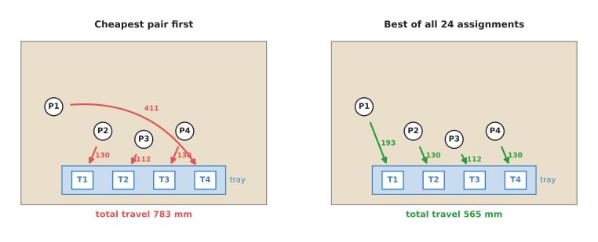
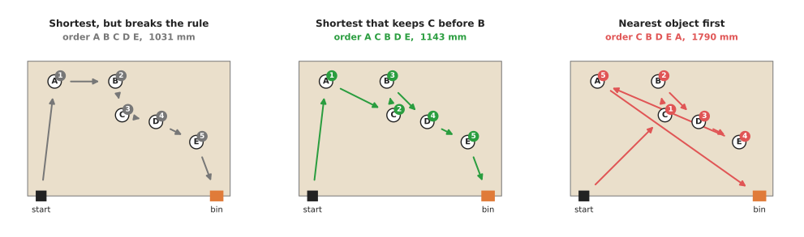
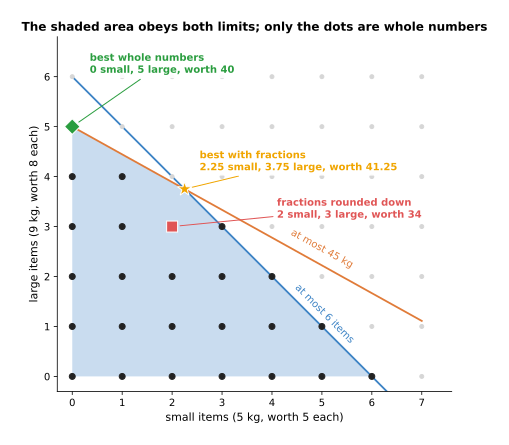
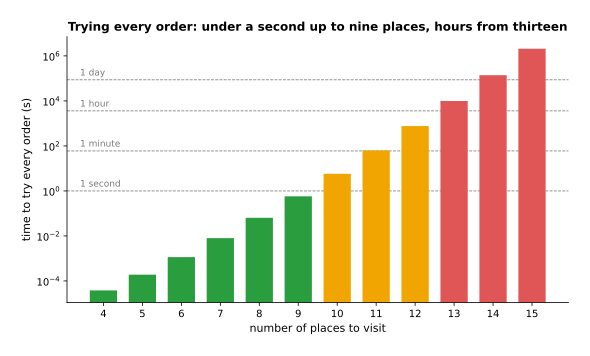

# Optimisation solvers

This page explains optimisation solvers: general programs that find the best
choice among a very large number of choices, while obeying rules you give them. It
answers five questions. What do you have to tell a solver? What are linear,
integer and constraint programming, and how do they differ? How does a solver find
the best answer without trying every possibility? Where does a robot arm need one?
And when is a simple loop, or a greedy rule, the better tool?

It is for a reader who has read
[greedy algorithms and set cover](01_greedy-algorithms-and-set-cover.md). That page
showed a quick rule that is usually close to the best answer. This page is about
getting the best answer itself, and about what that costs. No mathematics beyond
adding and multiplying is needed. The page explains each term where it first
appears.

On a robot arm, solvers answer questions about tasks rather than about motion.
Which part goes into which pocket of a tray? In what order should the arm pick
five objects, when one of them blocks another? How many of each item fit in a box
before it is too heavy? These are the questions in the worked examples below.

## Contents

1. [The idea in one sentence](#1-the-idea-in-one-sentence)
2. [What you tell a solver, and the three main kinds](#2-what-you-tell-a-solver-and-the-three-main-kinds)
3. [How it works, with three worked examples](#3-how-it-works-with-three-worked-examples)
   · [Assignment: which part goes in which pocket](#assignment-which-part-goes-in-which-pocket)
   · [Ordering: which object to pick first, with a rule](#ordering-which-object-to-pick-first-with-a-rule)
   · [Packing: why rounding a fractional answer fails](#packing-why-rounding-a-fractional-answer-fails)
   · [Branch and bound: how an integer solver avoids trying everything](#branch-and-bound-how-an-integer-solver-avoids-trying-everything)
   · [When trying everything stops working](#when-trying-everything-stops-working)
4. [Where solvers are used on a robot arm](#4-where-solvers-are-used-on-a-robot-arm)
5. [Where a solver is useful, and where it is not](#5-where-a-solver-is-useful-and-where-it-is-not)
6. [Libraries that provide it](#6-libraries-that-provide-it)
7. [Why a solver, and what it costs](#7-why-a-solver-and-what-it-costs)
8. [The learned alternative](#8-the-learned-alternative)
9. [Where to read next](#9-where-to-read-next)

---

## 1. The idea in one sentence

An **optimisation solver** is a ready-made program that takes a description of
your choices, your rules and your score, and returns the choice that obeys every
rule and has the best score.

Here is an everyday example. A school has to make a timetable. The choices are
which teacher teaches which class in which room at which hour. The rules are that
no teacher is in two rooms at once, no room holds two classes at once, and every
class gets its hours of each subject. The score might be the number of free gaps
in the teachers' days, which the school wants as small as possible. Nobody writes
a special program for this school. They write the choices, rules and score in the
form a timetable solver accepts, and the solver finds the timetable.

The same split is what makes a solver useful on a robot. You describe the task.
The solver does the searching. When the task changes, for example a new rule that
one object must be picked before another, you add one line to the description,
not a new search algorithm.

---

## 2. What you tell a solver, and the three main kinds

Every problem you give a solver has three parts. The words below are the standard
ones, and every solver's documentation uses them.

- The **decision variables** are the choices the solver makes. For example, "does
  part 1 go into pocket 3?", with the answer 1 for yes and 0 for no.
- The **constraints** are the rules every answer must obey. For example, "each
  pocket holds exactly one part".
- The **objective** is the score. For example, "the total distance the arm
  travels", which the solver makes as small as possible.

Writing these three parts down is called **modelling**, and the result is called
the **model**. The model is the part you write. The solver is the part you
install.

There are three main kinds of solver. They differ in what the variables and rules
are allowed to look like. The table below compares them. Read each row as one
kind: what its variables can be, what its rules can be, and the robot questions it
suits.

| Kind | Variables | Rules and score | Suits |
| --- | --- | --- | --- |
| Linear programming (LP) | Any number, fractions allowed | Sums of variables times fixed numbers, compared with `≤`, `=` or `≥` | Blending and sharing amounts: how much time each arm spends on each job |
| Mixed-integer linear programming (MILP, often shortened to MIP) | Some must be whole numbers, often 0 or 1 | The same sums as LP | Yes-or-no choices: which part to which pocket, which views to use, how many boxes |
| Constraint programming (CP) | Whole numbers from a list of allowed values | Almost any rule: "all different", "A before B", "if this then that" | Orders, schedules and puzzles with many logical rules |

The word "programming" in these names is old. It means "planning", not writing
code. Linear programming was named in the 1940s, when a "programme" was a
military plan.

A fourth kind, **nonlinear optimisation**, allows curved rules and scores, such as
the distance between two joint positions. It is what trajectory optimisation and
numerical inverse kinematics use. Those have their own pages:
[trajectory optimisation](../../06_planning-and-search/02_most-used/03_trajectory-optimisation.md)
and [numerical inverse kinematics](../../06_planning-and-search/02_most-used/02_numerical-inverse-kinematics.md).
This page stays with the first three, which are the ones used for task decisions.

---

## 3. How it works, with three worked examples

Each example below is small enough that the diagram script solves it exactly by
trying every possibility. That gives a true best answer to compare against. Every
number on this page comes from that script.

### Assignment: which part goes in which pocket

Four parts, P1 to P4, lie on a table. A kit tray at the front edge has four
pockets, T1 to T4. The arm must put one part in each pocket. The score is the total
straight-line distance from each part to its pocket, in millimetres. This kind of
problem is called an **assignment problem**.

The table below gives the distance from each part to each pocket. Read each row as
one part, and each column as one pocket.

| | T1 | T2 | T3 | T4 |
| --- | --- | --- | --- | --- |
| P1 | 193.1 | 247.6 | 324.5 | 411.5 |
| P2 | 130.0 | 130.0 | 192.1 | 277.3 |
| P3 | 180.3 | 111.8 | 111.8 | 180.3 |
| P4 | 277.3 | 192.1 | 130.0 | 130.0 |

As a model, this problem has 16 yes-or-no variables and 8 rules:

```
decisions:  x[i][j] = 1 if part i goes to pocket j, otherwise 0
rules:      for each part i:    x[i][1] + x[i][2] + x[i][3] + x[i][4] = 1
            for each pocket j:  x[1][j] + x[2][j] + x[3][j] + x[4][j] = 1
score:      minimise the sum over all i and j of distance[i][j] × x[i][j]
```

There are 4 × 3 × 2 × 1 = 24 ways to assign four parts to four pockets. Trying all
24 gives the best: P1 to T1, P2 to T2, P3 to T3 and P4 to T4, a total of 564.9 mm.
The worst of the 24 is 992.7 mm.

The greedy rule, "take the closest remaining part and pocket first", does much
worse. Its first choice is P3 to T2, at 111.8 mm, the smallest number in the
table. Then it takes P2 to T1 and P4 to T3, both at 130.0 mm. That leaves P1 with
only T4, the most distant pocket, at 411.5 mm. The total is 783.3 mm, which is 39
per cent more than the best. The picture below shows both answers.



The number on each arrow is that part's distance to its pocket in millimetres.
The curved arrow on the left is the 411.5 mm move that greedy is left with at the
end.

The assignment problem has a special property. It has its own exact method, the
**Hungarian algorithm**, which is fast even for hundreds of parts.
[Assignment and matching](../../03_searching-and-matching/02_most-used/03_assignment-and-matching.md)
explains it. So in practice you would not call a general solver for this exact
problem. You would call a general solver as soon as a rule is added that the
Hungarian algorithm cannot express, such as "P2 and P3 must not go into
neighbouring pockets, because the gripper cannot fit between them".

### Ordering: which object to pick first, with a rule

Five objects, A to E, stand on the table. The arm starts at the front left corner,
picks all five, and ends at a bin at the front right corner. The score is the total
straight-line travel. There is one rule: object C stands in front of object B and
blocks the gripper's approach, so C must be picked before B.

There are 5 × 4 × 3 × 2 × 1 = 120 orders. Exactly half of them, 60, pick C before
B. The picture below shows three of them.



The small numbered circles give the order of the picks. The black square is where
the arm starts and the orange square is the bin.

The table below lists the results. Read each row as one way of choosing the
order.

| How the order was chosen | Order | Travel |
| --- | --- | --- |
| Shortest of all 120, ignoring the rule | A B C D E | 1031.3 mm |
| Shortest of the 60 that pick C before B | A C B D E | 1142.7 mm |
| Nearest object first, among those not blocked | C B D E A | 1790.4 mm |
| Longest of the 60 that pick C before B | C E A D B | 1976.7 mm |

The shortest order breaks the rule, so it cannot be used. The best allowed order
costs 111.4 mm more. The nearest-first greedy rule is 57 per cent longer than the
best allowed order. Its first pick, C, is 339 mm from the start and A is 342 mm,
so C wins by 3 mm. Greedy then works its way to the right, and has to come all the
way back for A at the end.

This is the point of a solver. The rule "C before B" is one line in a model. In a
hand-written search it is a special case you have to remember to check. And a
greedy rule can respect it only by refusing to pick B early, which does nothing to
make the rest of its route good.

Book 3's
[ordering and rearrangement](../../../03_frameworks/03_arm-movement/07_ordering-and-rearrangement.md)
shows how to find rules like "C before B" from the scene, with a blocking graph.
The solver's job starts where that page's job ends: once the rules are known, find
the shortest order that obeys them.

### Packing: why rounding a fractional answer fails

The third example shows why whole-number problems are harder than fractional ones.

An arm fills a shipping box. The box holds at most 6 items and at most 45 kg. A
small item weighs 5 kg and is worth 5. A large item weighs 9 kg and is worth 8. How
many of each should go in, to make the box worth the most?

```
decisions:  s = number of small items, l = number of large items (whole numbers)
rules:      s + l ≤ 6
            5 × s + 9 × l ≤ 45
score:      maximise 5 × s + 8 × l
```

The picture below draws the problem. Each axis counts one kind of item. Each rule
is a straight line, and the allowed answers lie below both lines.



The shaded area obeys both rules if fractions of an item were allowed. The black
dots are the 25 whole-number answers that obey both rules.

If fractions were allowed, the problem would be a linear program. A linear
program has a useful property: its best answer can always be found at a
**corner** of the shaded area, where two rule lines meet. So a linear programming solver only has to
look at corners. Here the best corner is where both rules are exactly met: 2.25
small and 3.75 large items, worth 41.25.

The obvious next step is to round that down to whole numbers: 2 small and 3 large.
That obeys both rules, but it is worth only 34. The best whole-number answer is 0
small and 5 large, worth 40. It is not next to the fractional answer at all.

This is why integer problems need more than a linear programming solver and a
rounding step. The best whole-number answer can be far from the best fractional
one.

### Branch and bound: how an integer solver avoids trying everything

An integer solver uses the fractional answer as a guide, not as the answer. The
standard method is called **branch and bound**. It has four steps.

1. Solve the problem with fractions allowed. This is fast, because only corners
   need checking. Its score is a **bound**: no whole-number answer can beat it.
2. If the answer is already whole numbers, it is a candidate. Keep the best
   candidate found so far.
3. If some variable is a fraction, such as `l = 3.75`, split the problem into two
   smaller problems: one with the extra rule `l ≤ 3`, one with `l ≥ 4`. Every
   whole-number answer is in one of the two. This split is the **branch**.
4. Solve each smaller problem the same way. If a problem's fractional score is no
   better than the best candidate so far, drop it without looking inside. No answer
   inside it can win.

On the packing example, it runs like this. Every number comes from a real run.

1. The whole problem, with fractions: 41.25, at 2.25 small and 3.75 large. Split on
   the large count.
2. With `l ≤ 3`: the fractional best is 39, at 3 small and 3 large. These are whole
   numbers, so this is the first candidate, worth 39.
3. With `l ≥ 4`: the fractional best is 41, at 1.8 small and 4 large. That could
   still beat 39, so split on the small count.
4. With `l ≥ 4` and `s ≥ 2`: no answer obeys the weight rule. Drop it.
5. With `l ≥ 4` and `s ≤ 1`: the fractional best is 40.56, at 1 small and 4.44
   large. It could still beat 39, so split on the large count again.
6. With `s ≤ 1` and `l` exactly 4: the best is 37. That cannot beat 39. Drop it.
7. With `s ≤ 1` and `l ≥ 5`: the best is 40, at 0 small and 5 large, in whole
   numbers. That beats 39 and becomes the answer.

The solver solved seven small fractional problems and proved that 40 is the best.
On a problem this size that saves nothing over checking all 25 dots. On a problem
with hundreds of variables, the dropping in step 4 is what makes the difference
between seconds and years. Real solvers add many refinements to this idea, but
they all rest on it.

The same steps, as pseudocode:

```
branch_and_bound(problem):
    best = none
    to_do = [problem]
    while to_do is not empty:
        p = take one problem from to_do
        fractional = solve p with fractions allowed
        if p has no answer:                           continue
        if best is not none and fractional.score is no better than best.score:
            continue                                  # nothing in here can win
        if every whole-number variable in fractional is a whole number:
            best = fractional                         # a new best candidate
            continue
        v = a variable with a fractional value f in fractional
        add (p with rule v ≤ floor(f)) to to_do
        add (p with rule v ≥ floor(f) + 1) to to_do
    return best
```

A **constraint programming** solver searches differently. It keeps, for every
variable, the list of values that are still possible. Each rule removes values
that can no longer work. For example, in the ordering example, "C before B" means
C can never be in the last position and B can never be in the first. Removing
impossible values this way is called **propagation**. When the rules can remove
nothing more, the solver tries one value for one variable, propagates again, and
backs up if it reaches a dead end. Modern solvers such as OR-Tools' CP-SAT combine
this with the integer methods above.

### When trying everything stops working

Each example above was solved by trying every possibility. That is the right
method for small problems: it is short, it is exact, and it cannot have a bug in
its search. The trouble is how quickly the number of possibilities grows.

With `n` places to visit, there are `n × (n − 1) × ... × 2 × 1` orders, written
`n!` and read "n factorial". A plain Python loop on the machine this page was
written on checked about 630,000 orders a second. With ten places, it took 5.76
seconds to check all 3,628,800 orders. The chart below shows what that rate means
for other sizes.



Each bar is the time to check every order at 630,000 orders a second, on a
logarithmic scale where each step up is ten times longer. Green is under a second,
orange is under an hour, red is longer.

The table below gives the same numbers for a few sizes. Read each row as the
number of places, the number of orders and the time to try them all.

| Places | Orders | Time to try every order |
| --- | --- | --- |
| 5 | 120 | under a millisecond |
| 8 | 40,320 | 0.06 s |
| 10 | 3,628,800 | 5.8 s |
| 12 | 479,001,600 | 760 s, about 13 minutes |
| 13 | 6,227,020,800 | 9,884 s, about 2.7 hours |
| 15 | 1,307,674,368,000 | 2,075,674 s, about 24 days |

A faster language would move every bar down by a factor of perhaps a hundred. It
would not change the shape. Each extra place multiplies the work by the number of
places. That is where a solver earns its place. It uses bounds and propagation to
skip most of the possibilities, so it can solve problems far past the point where
trying everything is hopeless.

---

## 4. Where solvers are used on a robot arm

Solvers are used for decisions about a whole task, made before the arm moves or
between moves. Here are the common places.

- **Filling a kit tray.** Which part goes into which pocket, as in the first
  example. Rules like "heavy parts in the bottom row" or "no two tall parts side by
  side" make it a job for an integer or constraint solver rather than the
  Hungarian algorithm.
- **Pick order with blocking rules.** The order in which to clear a cluttered
  table, as in the second example. The rules come from Book 3's
  [blocking graph](../../../03_frameworks/03_arm-movement/07_ordering-and-rearrangement.md#2-the-blocking-graph).
  The solver finds the shortest order that obeys them.
- **Sharing work between two arms.** Which arm picks which object, and in what
  order, so that both finish early and never reach into the same space at the same
  time. The "same space at the same time" rule is a scheduling rule, which
  constraint programming handles well.
- **Palletising and box packing.** Which box goes where on a pallet, subject to
  weight, size and stacking rules, as in the third example but with positions as
  well as counts.
- **Choosing camera views exactly.** The set cover problem from
  [greedy algorithms and set cover](01_greedy-algorithms-and-set-cover.md), written
  as an integer program: one yes-or-no variable per view, one rule per object
  ("at least one chosen view sees it"), and the score "number of views chosen".
  This finds the true smallest set when greedy is not good enough.
- **Scheduling tool changes and machine loading.** When the arm serves several
  machines, which job to load next so that no machine waits, and when to change
  the gripper.
- **Allocating a time budget.** A linear program can split a fixed cycle time
  between inspection, picking and placing, when each has a known effect on the
  score.

Nonlinear solvers, a different family, also run inside motion planning. They
smooth a path in [trajectory optimisation](../../06_planning-and-search/02_most-used/03_trajectory-optimisation.md)
and find joint angles in
[numerical inverse kinematics](../../06_planning-and-search/02_most-used/02_numerical-inverse-kinematics.md).

---

## 5. Where a solver is useful, and where it is not

A solver is useful when there are many choices, when the rules matter, and when
the difference between a good answer and the best one is worth real time or money.
It is less useful when the problem is tiny, when the scene changes after every
move, or when the model leaves out something important.

The table below lists the common problems. Read each row as: the situation, the
sign you would see, and what to do instead.

| Situation | What you would see | What to do instead |
| --- | --- | --- |
| The problem is tiny, such as fewer than about eight objects | The solver takes longer to start than a loop takes to try every order | Try every possibility in a plain loop |
| The scene changes after every pick | The best order is recomputed each time, and only its first step is used | A greedy rule, or a solver with a short time limit |
| The model leaves out a rule, such as a joint limit or a collision | The solver's best answer cannot be carried out on the arm | Add the rule to the model; check each answer with the motion planner before moving |
| Straight-line distance stands in for arm travel time | The "shortest" order is not the fastest on the real arm | Measure move times between places and use those in the model |
| The problem is large and the time budget short | The solver runs until its time limit and returns its best answer so far, without proof | Accept a good answer: set a time limit, and start from a greedy answer |
| Rules contradict each other | The solver reports that no answer exists | Find the smallest set of clashing rules; some solvers can report it |
| The rule is really a preference, such as "try to pick red first" | No answer, or a poor one, because a wish was written as a hard rule | Move the preference into the score with a weight |

One sign is worth knowing in particular. If the solver returns an answer that the
arm cannot carry out, the fault is almost never in the solver. It is in the model.
A solver finds the best answer to the problem you wrote, not to the problem you
meant.

---

## 6. Libraries that provide it

Optimisation solvers are large, well-tested programs, and almost nobody writes
their own. The table below lists well-known ones. Read each row as: the library,
the languages it can be used from, the relevant part, and what it is good for.

| Library | Languages | Function, class or module | Note |
| --- | --- | --- | --- |
| Google OR-Tools | C++, Python, Java, C# | `ortools.sat.python.cp_model.CpModel` and `CpSolver` (CP-SAT) | The usual first choice for assignment, ordering and scheduling with logical rules |
| Google OR-Tools | C++, Python, Java, C# | `ortools.linear_solver.pywraplp.Solver` | One interface to several linear and integer solvers |
| Google OR-Tools | C++, Python, Java, C# | `pywrapcp.RoutingModel` and `RoutingIndexManager` | Visiting orders, with time windows and capacity rules |
| Google OR-Tools | C++, Python, Java, C# | `ortools.graph.python.linear_sum_assignment.SimpleLinearSumAssignment` | Fast exact assignment, with no extra rules |
| SciPy | Python | `scipy.optimize.linprog`, `scipy.optimize.milp` | Linear and mixed-integer programs, with no extra install beyond SciPy |
| SciPy | Python | `scipy.optimize.linear_sum_assignment` | Exact assignment, by a method of the same family as the Hungarian algorithm |
| HiGHS | C++, Python (`highspy`), others | the HiGHS solver | A fast open-source linear and integer solver; SciPy's `linprog` and `milp` call it |
| PuLP | Python | `pulp.LpProblem`, `pulp.LpVariable` | A simple way to write linear and integer models, then hand them to a solver |
| Pyomo | Python | `pyomo.environ.ConcreteModel` | A modelling language for larger models, with many solvers behind it |
| MiniZinc | its own modelling language | the MiniZinc tool | A standard language for constraint models, with many solvers behind it |
| CasADi | C++, Python, MATLAB | `casadi.Opti`, `nlpsol` | Nonlinear optimisation, used for trajectories rather than task decisions |

Commercial solvers such as Gurobi and CPLEX are also widely used, and are often
faster on very large integer problems. The modelling tools above can call them.

---

## 7. Why a solver, and what it costs

### What it is

An optimisation solver is a general program that finds the best answer to a
problem you describe as choices, rules and a score. The three main kinds are
linear programming for fractional amounts, integer programming for yes-or-no and
whole-number choices, and constraint programming for orders and logical rules.

### What it does for you

It separates what you want from how to search for it. You write the task, and a
tested program does the search, with bounds that let it skip most of the
possibilities. It gives the best answer, or tells you how far its answer can be
from the best. New rules are one line each. In the examples above, the solver's
answer beat the greedy rule by 39 per cent on the tray and 57 per cent on the pick
order.

### Why a solver rather than the obvious alternative

There are two obvious alternatives, and each wins in its own range. The first is
trying every possibility in a loop. It is exact and has no dependency, and below
about eight to ten items it is the better choice. The solver wins past that,
because the loop's time grows by a factor of `n` for every extra item. The second
alternative is a greedy rule. It is fast and simple, and it wins when the scene
changes after every move, so a perfect long plan would be thrown away anyway. The
solver wins when a plan is followed for many steps or many cycles, or when the
rules are what make the task hard. A greedy rule cannot plan around a rule. It can
only refuse a choice that breaks one.

### What it costs you

It costs a dependency, and time spent learning to model. Writing a good model is
a skill: the same problem can be written in ways that solve in a second or not at
all. It costs predictability of run time, because a hard problem can take much
longer than an easy one of the same size, so a robot needs a time limit and a
fallback answer. And it costs trust in the model. The answer is only as good as
the rules and the costs you wrote, so straight-line distances, missing collision
rules and hard rules that should have been preferences all show up as answers the
arm cannot use.

---

## 8. The learned alternative

No model in Book 6 finds the best assignment, order or packing under hard rules.
A network gives no proof that its answer obeys every rule, or of how far it is
from the best, and a solver gives both. The nearest learned model is a
[language model as planner](../../../06_neural-network-models/06_language-models/03_also-used/01_language-models-as-planners.md),
which turns a request in plain words into a sequence of steps. It wins when the
task itself changes from day to day and is easier to say than to write as a
model, but it can write steps that sound right and are wrong, so its plan needs a
checker in ordinary code. A common design uses both: the language model writes
the goal and the rules, and a solver finds the order.

---

## 9. Where to read next

- [Greedy algorithms and set cover](01_greedy-algorithms-and-set-cover.md), the
  page before this one, is the fast approximate alternative.
- [Assignment and matching](../../03_searching-and-matching/02_most-used/03_assignment-and-matching.md)
  explains the Hungarian algorithm, the special exact method for assignment.
- [Trajectory optimisation](../../06_planning-and-search/02_most-used/03_trajectory-optimisation.md)
  uses nonlinear optimisation to shape an arm's path.
- [Behaviour trees](../02_most-used/02_behaviour-trees.md) show how the plan a solver produces is
  carried out step by step, with checks after each step.
- [The chapter overview](../01_overview.md) compares all the decision techniques in
  one table.
- Book 3's
  [ordering and rearrangement](../../../03_frameworks/03_arm-movement/07_ordering-and-rearrangement.md)
  explains where ordering rules come from, and why the plan should be recomputed
  after every move.
