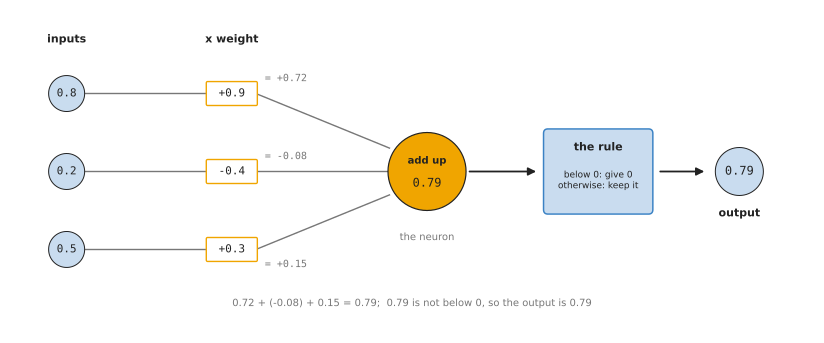
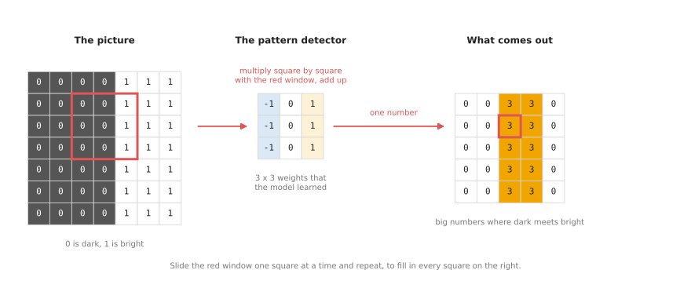
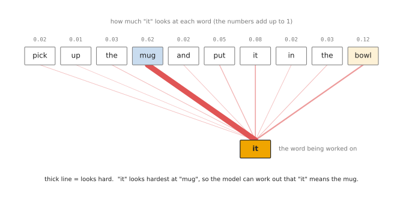
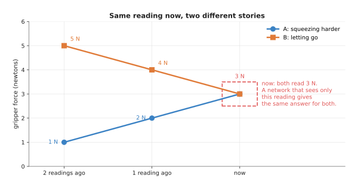
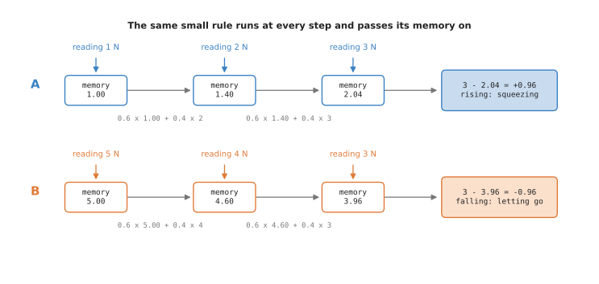
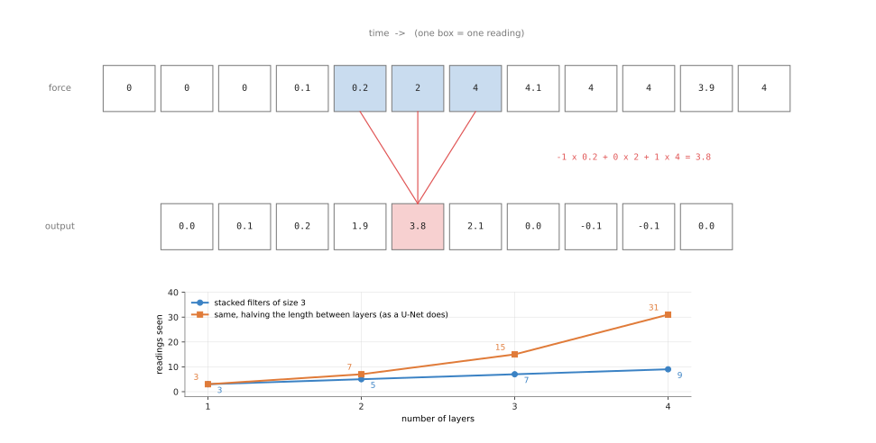
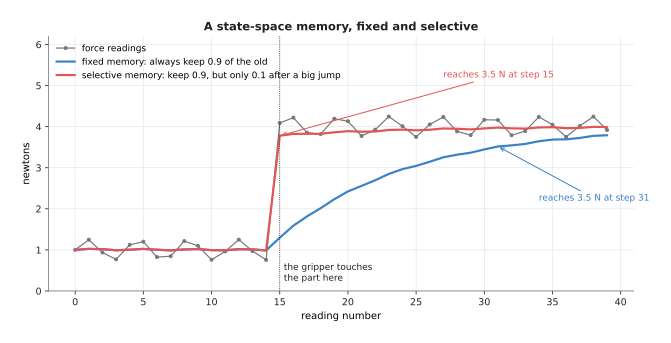

# Inside a neural network

The [first page](01_what-a-model-is.md) said that a neural network is made of
neurons arranged in layers, and the [second page](02_how-a-model-learns.md)
showed how training finds its weights. This page opens the network up. It
answers two questions. What does one neuron calculate? And what special kinds
of layer do networks use for pictures, for sentences and for readings that
arrive over time?

It is for a reader who has read the two pages before it. The page explains the
words that the rest of the book uses to describe models: neuron, layer,
activation, convolutional neural network, transformer, attention, embedding,
encoder, decoder, recurrent network, state-space model and parameter. When a later page says "a transformer that
reads picture patches", this page is where those words are explained.

The only maths on this page is multiplying and adding, and every number in the
pictures is worked out in full.

## Contents

1. [One neuron: a weighted sum, then a simple rule](#1-one-neuron-a-weighted-sum-then-a-simple-rule)
2. [Layers, and why there are many of them](#2-layers-and-why-there-are-many-of-them)
3. [How a picture becomes numbers](#3-how-a-picture-becomes-numbers)
4. [Convolutional layers: small pattern detectors](#4-convolutional-layers-small-pattern-detectors)
5. [Transformers and attention](#5-transformers-and-attention)
6. [Embeddings: a list of numbers that stands for a thing](#6-embeddings-a-list-of-numbers-that-stands-for-a-thing)
7. [Encoders and decoders](#7-encoders-and-decoders)
8. [Layers that remember: sequence models](#8-layers-that-remember-sequence-models)
9. [How big a model is: parameters](#9-how-big-a-model-is-parameters)
10. [Why these layers, and what they cost](#10-why-these-layers-and-what-they-cost)
11. [Where to read next](#11-where-to-read-next)

---

## 1. One neuron: a weighted sum, then a simple rule

A neuron does two small things, one after the other.

First, it works out a **weighted sum**. It takes each number that reaches it
and multiplies it by the weight on that line. Then it adds all the results
together.

Second, it applies a simple **rule** to the total. The most common rule is:
if the total is below 0, give 0; otherwise, keep the total as it is.

The picture below shows one neuron with three inputs.



The inputs 0.8, 0.2 and 0.5 are multiplied by the weights +0.9, -0.4 and +0.3, the three results add up to 0.79, and because 0.79 is not below 0 the neuron's output is 0.79.

Here is the same calculation written out:

```
0.8 x 0.9    =  0.72
0.2 x (-0.4) = -0.08
0.5 x 0.3    =  0.15
                ----
total        =  0.79    ->  not below 0, so the output is 0.79
```

Now suppose the first weight were -0.9 instead of +0.9. The first line would be
-0.72, and the total would be -0.72 - 0.08 + 0.15 = -0.65. That is below 0, so
the neuron's output would be 0.

A real neuron usually also adds one extra number of its own to the total,
before the rule. This number is called the **bias**. It lets the neuron shift
the point where it starts to give an output above 0. The bias is learned in the
same way as the weights.

The rule is called the **activation function**, and the neuron's output is
called its **activation**. The rule described here, "below 0 becomes 0", is
called the **rectified linear unit (ReLU)**. It is the most common one. There
are others with slightly different shapes, but they all do the same job.

The rule matters more than it looks. Without it, every layer would only
multiply and add. Many layers of multiplying and adding can always be replaced
by a single layer that multiplies and adds, so extra layers would give the
network no extra power. The rule breaks this. Because some outputs become 0,
the network can behave differently for different inputs. That is what lets it
learn complicated patterns, such as the difference between a mug and a bowl.

---

## 2. Layers, and why there are many of them

A **layer** is a group of neurons that all read the same inputs. Each neuron in
the layer has its own weights, so each one works out a different weighted sum.
The outputs of one layer are the inputs of the next.

The simplest network joins every neuron in one layer to every neuron in the
next. This is called a **fully connected layer**. The small network on the
[first page](01_what-a-model-is.md#4-what-neural-network-means) was made only of
fully connected layers.

A network with many layers is called a **deep** network, and training one is
called **deep learning**. There is no exact number of layers where "deep"
starts. Networks for photos often have dozens of layers. The largest language
models have around a hundred.

Many layers help because each layer can build on what the one before it found.
In a network that reads photos, researchers have looked at what the neurons
respond to. The early layers respond to simple things, such as an edge between
dark and light, or a patch of one colour. Middle layers respond to shapes built
from those, such as a curve or a corner. Late layers respond to whole parts of
objects, such as a handle or a rim. Nobody tells the network to do this. It
comes out of training.

---

## 3. How a picture becomes numbers

The [first page](01_what-a-model-is.md#3-everything-is-numbers) showed that a
grey photo is a grid of brightness numbers, from 0 for black to 255 for white.
A colour photo has three such grids, one each for red, green and blue.

Before the numbers go into a network, they are usually scaled to be small, for
example divided by 255 so that they run from 0 to 1. Networks train better on
small numbers. The photo is also usually resized to a fixed size, because a
network expects the same number of inputs every time. Many networks for photos
use 224 pixels by 224 pixels.

You could feed these numbers straight into fully connected layers. That works
badly for photos, for two reasons.

- It needs far too many weights. A colour photo of 224 by 224 pixels is 150,528
  numbers. One fully connected layer of 1,000 neurons would need over 150
  million weights, one for each input and neuron pair.
- It ignores where things are. To a fully connected layer, the pixel in the top
  left corner and the pixel next to it are no more related than any other two.
  It would have to learn separately that a mug in the top left and a mug in the
  bottom right are both mugs.

The next two sections describe the two kinds of layer that solve these
problems.

---

## 4. Convolutional layers: small pattern detectors

A **convolutional layer** looks at a picture through a small window, often 3
pixels by 3 pixels. The window has its own weights, one for each pixel in it.
This small grid of weights is called a **filter**. It is a detector for one
small pattern.

The layer places the filter on the top left corner of the picture. It
multiplies each pixel under the window by the filter weight on top of it, and
adds the results. That gives one output number. Then it slides the window one
pixel to the right and does the same again. It does this at every position,
row by row. The output is a new grid of numbers, a little smaller than the
picture.

The picture below shows one filter sliding over a small picture that is dark
on the left and bright on the right.



The filter gives 3 wherever its window covers the line between the dark part and the bright part of the picture, and 0 everywhere else.

Follow the red window. It covers three columns of the picture: 0, 0 and 1 in
every row. The filter's columns are -1, 0 and +1. So each row gives
(-1 x 0) + (0 x 0) + (1 x 1) = 1, and the three rows together give 3. That 3
goes in the matching square of the output grid.

Where the window covers only dark pixels, every product is 0, so the output is
0. Where it covers only bright pixels, each row gives -1 + 0 + 1 = 0. So the
filter gives a big number only where dark changes to bright from left to right.
It is a detector for that kind of edge.

In this example the filter weights were chosen by hand to make the idea clear.
In a real network the filter weights are learned by gradient descent, like
every other weight. The network finds for itself which patterns are worth
detecting.

A convolutional layer has many filters, often 64 or more, and each one detects
a different pattern. The output of the layer is one grid per filter. The next
convolutional layer slides its own filters over those grids, so it detects
patterns made of patterns. This is how the layers described in
[section 2](#2-layers-and-why-there-are-many-of-them) build up from edges to
handles.

Convolutional layers solve both problems from section 3.

- They need few weights. A 3 by 3 filter on a colour picture has 27 weights,
  and it is used at every position in the picture.
- They treat every position the same way. A filter that finds a handle in the
  top left finds it in the bottom right too, because it is the same filter.

A network built mainly from convolutional layers is called a **convolutional
neural network (CNN)**. CNNs were the main kind of network for pictures from
about 2012 until the early 2020s, and they are still widely used on robots
because they are fast. ResNet, used in many robot models, is a CNN.

---

## 5. Transformers and attention

A **transformer** is a different kind of network. It was first built for
sentences, in 2017, and is now also used for pictures, sounds and robot
movements. Most of the large models in this book are transformers.

A transformer works on a list of pieces. Each piece is called a **token**.

- For a sentence, each token is a word or part of a word.
- For a picture, each token is a small square of the picture, called a
  **patch**. A common choice is to cut the picture into patches of 16 pixels by
  16 pixels. A picture of 224 by 224 pixels then becomes 14 by 14 = 196 patches.
- For robot movements, a token can be the arm's joint angles at one moment.

Each token starts as a list of numbers. The key step in a transformer is
called **attention**. In attention, every token looks at every other token and
decides how much each one matters to it. Then it updates its own numbers by
mixing in the numbers of the tokens that matter most.

The picture below shows attention for one word in a sentence given to a robot
arm.



The word "it" looks at every word in the sentence; the thickness of each line shows how much, and the thickest line goes to "mug", which is what "it" means here.

The numbers above the words are how much "it" attends to each word. They were
made up for this picture to show the idea. In a real transformer they are
worked out from the tokens, using weights learned in training. They always add
up to 1.

To understand the instruction, the robot needs to know what "it" refers to.
The word "it" on its own does not say. Attention lets the token for "it" collect
information from the token for "mug". After this step, the numbers for "it"
carry some of the meaning of "mug".

A transformer repeats this many times, in many layers, and every token does it
at the same time. Each layer also has fully connected parts that work on each
token separately.

For pictures, attention lets a patch showing the handle of a mug look at the
patches showing the body of the mug, even when they are far apart. A
convolutional layer only looks at a small window, so it needs many layers
before distant parts of a picture can affect each other. Attention links any
two patches in a single layer. A transformer that reads pictures as patches is
called a **vision transformer (ViT)**.

---

## 6. Embeddings: a list of numbers that stands for a thing

An **embedding** is a list of numbers that stands for a thing. The thing can be
a word, a patch of a picture, a whole picture, a sound or a moment of robot
movement.

You have already met embeddings. The list of numbers that each token carries
through a transformer is an embedding. The numbers that come out of the last
layers of a CNN, just before the output, are an embedding of the whole
picture.

An embedding is usually a few hundred or a few thousand numbers long. The
numbers are not set by hand. Training finds them. A useful embedding has one
important property: things that are alike get lists of numbers that are alike.
The embeddings for "mug" and "cup" are close together. The embeddings for
"mug" and "hammer" are far apart. Two photos of the same mug from slightly
different angles get close embeddings.

Here is a made-up example with only three numbers per embedding, to show what
"close" means. The table lists four words and their made-up embeddings. Compare
the rows to see which lists are alike.

| Thing | Made-up embedding |
| --- | --- |
| mug | 0.9, 0.8, 0.1 |
| cup | 0.8, 0.9, 0.1 |
| bowl | 0.7, 0.2, 0.2 |
| hammer | 0.1, 0.1, 0.9 |

The lists for "mug" and "cup" differ by only 0.1 in two places, so they are
close. The list for "hammer" is different in every place, so it is far from all
the others.

Embeddings are useful on a robot because distance can be measured. If a model
turns both pictures and sentences into embeddings of the same length, a robot
can compare the sentence "a red mug" with every object it sees, and pick the
object whose embedding is closest. The
[open-vocabulary models page](../03_seeing-models/02_most-used/03_open-vocabulary-models.md)
describes models that do exactly this.

---

## 7. Encoders and decoders

Many models are built in two halves.

- The **encoder** reads the input and turns it into embeddings. For a photo,
  the encoder is often a CNN or a vision transformer. Its output is a set of
  embeddings that describe what is in the photo.
- The **decoder** reads those embeddings and turns them into the output the
  job needs: a label, a box, an outline, a sentence, or a list of arm movements.

The two halves are useful because one encoder can serve many decoders. An
encoder trained on millions of photos learns embeddings that describe pictures
well in general. You can then train a small decoder for your own job, such as
finding where to grip a mug, on top of that encoder. This needs far fewer
examples than training the whole network from nothing.

Some models are only an encoder, and some are only a decoder. A model that
turns a photo into one label can be an encoder with a tiny output layer. A
language model that writes text one word at a time is a decoder: it reads the
words so far and gives the next word, again and again. You will see both words
in the names of real models, such as the "image encoder" and "mask decoder" of
the Segment Anything Model (SAM).

## 8. Layers that remember: sequence models

Every layer so far looks at one input at a time. A convolutional layer looks at one
picture. A robot often needs more than that. It needs to know what happened a moment
ago as well as what is happening now.

A **sequence** is a list of inputs in time order, such as the last 50 readings of a
force sensor. A **sequence model** is a network built to read a sequence and use the
order of the readings. This section describes the three kinds that robot models
use most: recurrent networks, convolutions along time, and state-space models.
Transformers, from [section 5](#5-transformers-and-attention), can also read
sequences. They are the fourth kind.

### Why the past matters

Think of a gripper holding a part. Its force sensor reads 3 newtons (N) now. Is the
gripper squeezing harder, or is the part slipping out? The reading alone cannot say.



Story A rises to 3 N and story B falls to 3 N. A network that sees only the reading
now gives the same answer for both.

The same is true for a movement policy. One camera picture of an arm in mid-air does
not show whether the arm is moving up or down. A **force monitor**, a program that
watches the force readings for a collision or a slip, has the same problem. A single
reading shows how hard. Only several readings show whether it is rising, falling or
shaking. The
[force and slip models page](../09_touch-and-body-models/02_most-used/01_force-and-slip-models.md)
shows what slip looks like in a force signal.

The simplest fix is to give a plain network the last few readings side by side, as
one long input. That works for a short, fixed window. It breaks down when the window
must be long, because the number of weights grows with every reading added. The three
kinds below handle long sequences better.

### Recurrent networks: a memory passed from step to step

A **recurrent neural network (RNN)** reads a sequence one step at a time. At every
step it takes two inputs: the new reading, and a small list of numbers it kept from
the step before. This list is called the **hidden state**, or simply the memory. The
network uses the same weights at every step. It gives out a new memory, which it
passes on to the next step.

Here is a tiny recurrent rule, worked out in full. The memory starts at the first
reading. At every later step:

```
new memory = 0.6 x old memory + 0.4 x new reading
```

At the end, the network compares the reading now with its memory.



Both stories end on a reading of 3 N, but their memories differ, so the final answers
differ.

```
A: readings 1, 2, 3   memory 1.00 -> 1.40 -> 2.04    3 - 2.04 = +0.96  rising
B: readings 5, 4, 3   memory 5.00 -> 4.60 -> 3.96    3 - 3.96 = -0.96  falling
```

In a real RNN the memory is a list of many numbers, the rule includes an activation
function, and training finds the weights. The 0.6 and 0.4 here were chosen by hand.

A plain RNN has a known weakness. Over a long sequence, the effect of an early reading
fades after many steps, and training struggles to reach it. The **long short-term
memory (LSTM)** network, from 1997, fixes much of this. It adds **gates**, small
learned switches that decide at each step how much of the memory to keep, how much
of the new reading to let in, and how much to pass to the output. The **gated
recurrent unit (GRU)** is a simpler version with fewer gates. Both are still used
in force and slip monitors, as the
[collision and failure detection page](../09_touch-and-body-models/02_most-used/02_collision-and-failure-detection.md)
describes.

### Convolutions along time

[Section 4](#4-convolutional-layers-small-pattern-detectors) slid a small filter
across a picture. The same idea works along time. A **one-dimensional (1D)
convolution** slides a short filter along a list of readings.



The filter -1, 0, +1 gives the change over two readings. It gives 3.8 where the force
jumps from 0.2 N to 4 N, and about 0 where the force is steady.

The worked number for the highlighted position is:

```
-1 x 0.2  +  0 x 2  +  1 x 4  =  3.8
```

One filter of size 3 sees only 3 readings. Stacking layers widens the view. The
small chart in the picture counts how many readings one output sees. With plain
stacked filters of size 3, it is 3, 5, 7 and 9 readings after 1 to 4 layers. If the
list is halved in length between layers, it is 3, 7, 15 and 31.

Halving between layers is what a **U-Net** does. A U-Net shrinks its input step by
step and then grows it back, and the
[segmentation page](../03_seeing-models/02_most-used/02_segmentation.md) shows it
for pictures. **Diffusion Policy**, a common movement model, uses a U-Net made of 1D
convolutions along time. Its input is a short list of future arm positions, and the
convolutions let each position take account of its neighbours, so the path comes out
smooth. The
[diffusion and flow policies page](../06_movement-models/02_most-used/03_diffusion-and-flow-policies.md)
explains that model.

Convolutions along time are fast, because every position is worked out at once
rather than one step after another. Their cost is that they see only a fixed window.

### State-space models: a running memory that can choose to forget

A **state-space model** also keeps a memory and updates it at every step, like an
RNN. The difference is that the update is a simple weighted sum with no activation
function in between. That makes it much faster to train on long sequences, because
the whole sequence can be worked out at once with a clever rearrangement of the sums.

The simplest version is a running average:

```
memory = keep x old memory + (1 - keep) x new reading
```

With a fixed "keep" of 0.9, the memory changes slowly. That is good for smoothing
noise and bad when something sudden happens. **Mamba**, a state-space model from
2023, makes the model **selective**: the "keep" value is worked out from the new
reading itself. The model can learn to hold on to its memory while nothing is
happening, and to throw it away when something important happens.



The gripper touches a part at step 15. The fixed memory takes until step 31 to catch
up. The selective memory, which keeps only 0.1 of the old value after a big jump,
catches up at once.

In this picture the rule for "keep" was chosen by hand: 0.9, or 0.1 after a jump of
more than 1 N. In Mamba, a small layer learns that rule from data.

### Where they are used on a robot arm

- A slip or collision monitor reads the last fraction of a second of force and
  current readings. LSTMs and 1D convolutions are common here, because they are small
  and fast.
- Diffusion Policy's U-Net uses 1D convolutions along the time steps of the planned
  movement.
- [Force and slip models](../09_touch-and-body-models/02_most-used/01_force-and-slip-models.md)
  shows a sequence model reading force and touch readings over time.
- [Action chunking transformers](../06_movement-models/02_most-used/02_action-chunking-transformers.md)
  use attention along time instead.
- Research policies such as MaIL and RoboMamba try Mamba layers in place of attention,
  to read long histories cheaply.

### Where they fail

An RNN or LSTM must work through the readings one after another, so training on long
sequences is slow. A 1D convolution sees only its window, so an event older than the
window is invisible to it. A selective state-space model is newer, and fewer
ready-made robot models use it. Any sequence model also needs its readings evenly
spaced in time. If readings arrive late or are dropped, the model sees a history that
never happened.

### Libraries

PyTorch provides `torch.nn.LSTM`, `torch.nn.GRU` and `torch.nn.Conv1d`, which cover
the first two kinds. The `mamba-ssm` package from the Mamba authors provides Mamba
layers. It needs an NVIDIA graphics card, because it uses hand-written CUDA code.
LeRobot includes a ready-made Diffusion Policy with its 1D U-Net.

---

## 9. How big a model is: parameters

All the numbers that training changes, the weights and the biases together,
are called the model's **parameters**. The number of parameters is the usual
way to say how big a model is.

Counting them for a small network is simple. Take the network on the
[first page](01_what-a-model-is.md#4-what-neural-network-means), fed with the
64 pixels of the 8 by 8 mug photo. It has 64 inputs, two hidden layers of 6
neurons, and 2 outputs.

```
weights:  64 x 6  +  6 x 6  +  6 x 2  =  384 + 36 + 12  =  432
biases:        6  +      6  +      2                    =   14
parameters:                                               446
```

Real models are far bigger. The table below gives the size of four well-known
models, from a photo network to a very large language model. Read the last
column as the number of learned numbers stored in the model's file.

| Model | What it does | Parameters |
| --- | --- | --- |
| ResNet-50 | a CNN that names the object in a photo | about 25 million |
| ViT-Base | a vision transformer that names the object in a photo | about 86 million |
| OpenVLA | reads a camera picture and an instruction, and outputs arm movements | about 7 billion |
| GPT-3 | a language model that writes text | about 175 billion |

A bigger model can learn more patterns, and usually needs more examples to
train. It also takes more arithmetic every time it runs, so it is slower and
needs a stronger computer. On a robot arm that must react many times a second,
this matters a lot. The
[running-a-model page](../10_making-models-work-on-an-arm/02_most-used/02_running-a-model-on-a-robot.md) covers this choice.

---

## 10. Why these layers, and what they cost

This section answers why networks use convolutional layers and transformers,
rather than the obvious alternative of plain fully connected layers.

Fully connected layers are the simplest choice, and they are still used for
short lists of numbers, such as the joint angles of an arm or the readings of a
force sensor. For pictures and sentences they fail, for the reasons in
[section 3](#3-how-a-picture-becomes-numbers). They need too many weights, and
they cannot tell which inputs are next to each other.

A convolutional layer fixes both by sliding one small filter over the whole
picture. It costs you something too. Each filter sees only a small window, so
the network needs many layers before it can connect distant parts of a
picture.

A transformer fixes that with attention, which links every token to every
other token in one step. Its cost is arithmetic. Every token looks at every
other token, so doubling the number of tokens makes attention about four times
as much work. Transformers also usually need more training examples than CNNs
to reach the same accuracy on pictures, because they start with no built-in
idea that nearby pixels belong together.

In practice, robot models use both. Small, fast models that must run many
times a second on the robot often use CNNs. Large models that read pictures and
instructions together are almost always transformers. Many models join the two:
a CNN encoder for the camera pictures, and a transformer on top.

For readings over time, the obvious alternative is again a plain fully
connected layer, given the last few readings side by side. That is fine for a
short window. The sequence layers in
[section 8](#8-layers-that-remember-sequence-models) are for longer ones. An
LSTM keeps a memory of any length, but it works one step at a time, so it is
slow to train. A 1D convolution is fast, but it sees only a fixed window. A
state-space model such as Mamba is fast and keeps a long memory, and its cost is
that it is newer, with fewer ready-made robot models and a need for an NVIDIA
graphics card.

---

## 11. Where to read next

- [Learning signals](04_learning-signals.md) is the next page. It explains the
  kinds of learning, from labelled examples to trial and error.
- [Where the data comes from](05_where-the-data-comes-from.md) explains how the
  examples for robot models are collected.
- [The map of models](06_the-map-of-models.md) shows the seven families of
  models in this book, and which of these layers each family uses.
- [Image classification](../03_seeing-models/03_also-used/01_image-classification.md) is
  the simplest seeing model: a CNN or vision transformer that names the object
  in a photo.
- [Action chunking transformers](../06_movement-models/02_most-used/02_action-chunking-transformers.md)
  shows a transformer whose tokens are camera pictures and arm movements.
- [Foundation models](../../03_frameworks/08_frontier/02_foundation-models.md)
  in Book 3 describes today's very large models for robots, which are built
  from the layers on this page.
