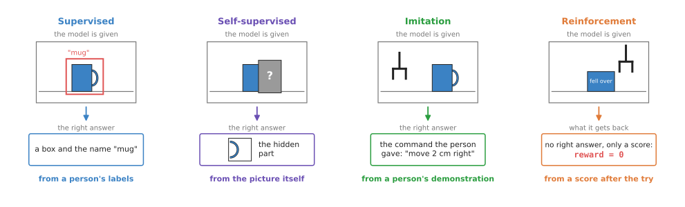
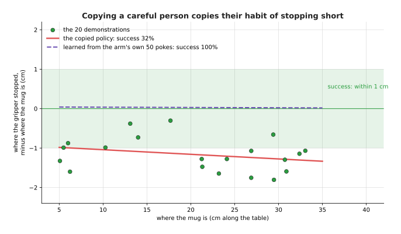
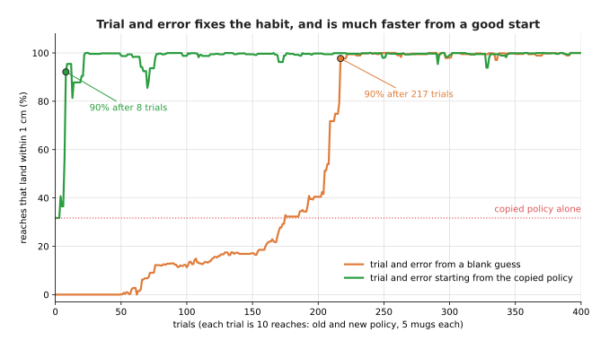
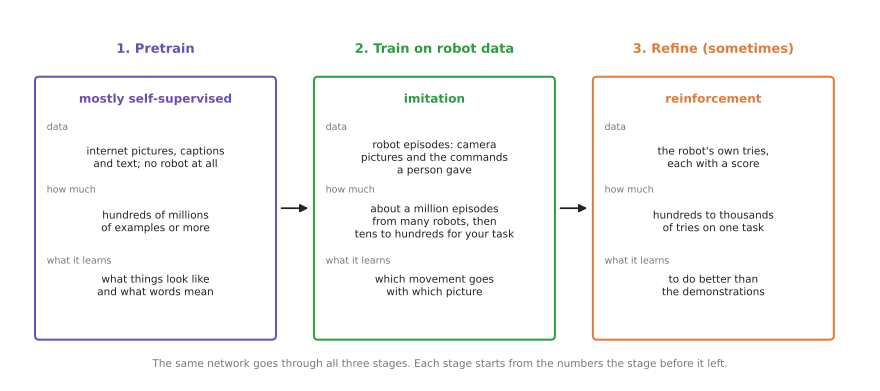

# Learning signals: four ways a model is taught

Every model learns by comparing its answer with something and then changing its numbers.
The [page on how a model learns](02_how-a-model-learns.md) showed the simplest case,
where a person has written down the right answer for every example. But that is only one
kind of learning, so this page answers the question: what can a model be compared with,
and where does that come from?

The thing a model is compared with is called its **learning signal**, and there are four
main kinds of it. **Supervised** learning compares the model with answers a person wrote
down, while **self-supervised** learning takes the answer from the data itself.
**Imitation** learning compares the model with what a person did, and **reinforcement**
learning gives the model no answer at all, only a score after it tries.

It is for a beginner who has read the three pages before this one, so you should already
know what an example, a label and a loss are, from [how a model
learns](02_how-a-model-learns.md). The next page, [where the data comes
from](05_where-the-data-comes-from.md), is about where the examples are collected, while
this page is about what kind of answer each example carries.

## Contents

1. [The idea in one sentence](#1-the-idea-in-one-sentence)
2. [Supervised learning: a person writes the answer](#2-supervised-learning-a-person-writes-the-answer)
3. [Self-supervised learning: the data holds the answer](#3-self-supervised-learning-the-data-holds-the-answer)
   · [Hide a part and guess it](#hide-a-part-and-guess-it)
   · [Match two views of the same thing](#match-two-views-of-the-same-thing)
   · [The robot labels its own tries](#the-robot-labels-its-own-tries)
4. [Imitation learning: copy what a person did](#4-imitation-learning-copy-what-a-person-did)
5. [Reinforcement learning: try, get a score, do better](#5-reinforcement-learning-try-get-a-score-do-better)
6. [A worked example: one arm, three signals](#6-a-worked-example-one-arm-three-signals)
7. [How one modern model mixes them](#7-how-one-modern-model-mixes-them)
8. [All four in one table](#8-all-four-in-one-table)
9. [Why not always use one kind, and what each costs](#9-why-not-always-use-one-kind-and-what-each-costs)
10. [Where to read next](#10-where-to-read-next)

---

## 1. The idea in one sentence

A model learns by comparing its output with a learning signal, and the four kinds
of learning differ only in where that signal comes from.

The training step itself is the same in all four. The model makes a guess, and that
guess is compared with the signal, which gives a number that says how bad the guess was.
The numbers inside the model are then changed a little, so that the next guess is
better. So what changes from one kind to the next is only who, or what, supplies the
signal.

The picture shows one training example of each kind. In the first three, the model is
given a right answer to aim for, but in the fourth it is only told how well its try
went, so it must work out for itself what to change.

---

## 2. Supervised learning: a person writes the answer

The first of the four kinds is the one the earlier pages already used. In **supervised
learning**, every example comes with a right answer that a person supplied, and the word
"supervised" means that someone is watching over the learning and saying what is right.
That right answer is what this book calls the **label**.

The most common robot arm example is an object detector, which is a model that takes a
camera picture and draws a box around each object it knows. To train one, people take a
few thousand pictures of the table, and for each picture a person draws a box around
every mug and writes "mug" next to it. The model is then shown a picture, guesses the
boxes, and is corrected towards the boxes the person drew.

Other examples on an arm:

- A person marks the handle and the rim of each mug in a picture, so a model can learn
  to find those points, and from them the mug's pose. **Pose** means position and
  direction together.
- A robot records the signal from its finger sensors while it holds many objects, and a
  person marks the moments when an object started to slip. So a model can learn to
  notice slip from those marks.

Supervised learning is the easiest kind to understand and to check, because you know
exactly what the model was asked to do. Its weakness is cost, since every label takes a
person's time, and a new object or a new kind of answer means labelling again.

---

## 3. Self-supervised learning: the data holds the answer

Supervised learning needs a person for every single example, which is what the second
kind avoids. In **self-supervised learning** nobody writes the answer, because the
answer is taken from the data itself. The data supervises itself, which is where the
name comes from. This matters because it means any picture, any video or any sensor
recording can be used, not only the ones a person has labelled, and there are far more
of those.

There are three common ways of doing this, and robot work uses all three of them.

### Hide a part and guess it

Take a picture and cover some patches of it with grey squares, then ask the model to
guess what was under them. The right answer is the part you covered, so you already have
it without asking anyone. To guess well, the model must learn what things usually look
like: that a mug handle is curved, and that a table edge is straight.

The same trick works on other data, and not only on pictures. You can hide the next word
of a sentence and guess it, or the next frame of a video, or the next reading from a
joint sensor. Large language models learn mainly by guessing the next word. [Video
prediction models](../08_world-models/03_also-used/01_video-prediction-models.md) learn
by guessing the next frame.

### Match two views of the same thing

Take one picture and make two different versions of it, for example by cropping two
different parts or by changing the colours of one. Then ask the model to give similar
numbers for the two versions, and different numbers for versions of other pictures. The
model learns that the two versions show the same thing, so it learns to ignore crop and
colour and to notice the object.

A picture and its caption are also two views of the same thing. The CLIP model
(Contrastive Language-Image Pretraining) learned by matching 400 million pictures
with the captions that came with them on the internet. That is how an
[open-vocabulary model](../03_seeing-models/02_most-used/03_open-vocabulary-models.md)
can find "the red mug" without ever having been trained on that phrase.

### The robot labels its own tries

In robotics the word has a second use, because a robot can make its own labels by using
its own sensors. For example, the arm tries a grasp, lifts, and checks whether the
gripper fingers stayed apart. If they did, something is between them, so the grasp
worked, and no person had to say so. One well-known study, described on the [grasp
quality models page](../05_grasp-models/03_also-used/02_grasp-quality-models.md), let a
real arm collect its own labels this way over hundreds of hours.

Self-supervised learning is also how **foundation models** are made. A foundation model
is a large model trained on a huge, general dataset, so that many jobs can be built on
top of it. It is trained first with self-supervised learning on data that nobody
labelled, and this first stage is called **pretraining**. What the model learns there is
general, because it does not yet know your task, so a second stage with one of the other
kinds of signal usually follows.

---

## 4. Imitation learning: copy what a person did

A detector answers "what is in this picture?", but an arm also needs an answer to "what
should I do next?". Nobody can easily write that answer down for every moment, so
instead a person shows the robot. They drive the arm through the task, usually with a
second, hand-held arm or a game controller, and this is called a **demonstration**. At
every moment, the robot records what its cameras saw and what command the person gave.

**Imitation learning** trains a model to give the same command the person gave, when it
sees the same kind of picture. In other words, it is supervised learning where the label
is an action instead of a name. The model is shown a picture from the demonstration,
guesses a command, and is corrected towards the person's command, and the simplest form
of this is called **behaviour cloning**.

Imitation learning is the main way robot arms learn tasks today, because a few dozen
demonstrations can be enough for one narrow task on one arm. Its weaknesses all come
from the copying:

- The model copies the person's habits along with their skill, so if the person always
  stops a little short, the model stops short too. The worked example below shows this
  in numbers.
- The model has only seen the situations the person got into, so if the arm drifts a
  little off the person's path, it sees pictures it was never shown. Its next command is
  then a worse guess, which moves it further off, and small errors add up.
- The model can never be much better than the demonstrations.

---

## 5. Reinforcement learning: try, get a score, do better

Imitation still needs a person to show the way, which the fourth kind does without. In
**reinforcement learning** nobody gives the model a right answer at all: the arm tries
something, and then it gets a number that says how well the try went. This number is
called the **reward**, and for example it might be 1 if the mug ended up in the rack and
0 if not. The model then changes its numbers so that tries like the good ones become
more likely, and tries like the bad ones less likely, so over many tries it gets better.

The hard part is that the reward says how well a try went, but not what to change.
If the mug fell over, was it the grip, the speed or the angle? The model must work
that out from many tries. So reinforcement learning needs a great many tries, often
millions. That is too slow and too risky on a real arm, so most of it happens in a
simulator, a program that pretends to be the real world.

Reinforcement learning has one strength that the others lack. It can end up better than
any person, because it is not copying anyone, so it can find a way of doing the task
that nobody showed it.

A reward is also easy to get wrong, because a model will do whatever raises the reward,
even if that is not what you meant. For example, if the reward is "the mug is near the
rack", the model may learn to push the mug there and knock it over.

---

## 6. A worked example: one arm, three signals

The four kinds are easier to compare on one task, so this section runs three of them on
the same arm. The numbers in this section come from a real run of the diagram script
`docs/diagrams/what_models_are_4.py`. The arm is simulated, so that we know the truth
exactly, but the learning methods run on it are real.

Here is the job that all three methods have to learn. A mug sits somewhere on a line
along a table, between 5 cm and 35 cm from the end, and a one-joint arm slides its
gripper along the line. The camera already gives the mug's position, so the model must
turn that position into a command for the joint. A reach counts as a success if the
gripper stops within 1 cm of the mug.

The arm does not go exactly where it is told, because it stops at 0.9 × command + 1.0
cm, plus a small random error of about 0.3 cm. Nobody has written this quirk down, so a
model has to find it from data. A model that turns what the robot sees into a command is
called a **policy**, and here the policy is a straight line with two numbers: command =
w × (mug position − 20) + c. The best values are w = 1.111 and c = 21.11, and with those
all 2,000 test reaches succeed.

First comes imitation, in which a careful person drives the arm to 20 mugs. Because they
can see where the gripper is, they make up for the quirk by eye. But they have a habit:
they stop about 1.2 cm short, so as not to knock the mug, which means only 35% of their
20 demonstrations land within 1 cm. A straight line is fitted to the 20 pairs of mug
position and command, and it gives w = 1.098 and c = 19.82. That policy succeeds on only
31.7% of the test reaches, and on average it stops 1.15 cm short, so it has copied the
habit exactly.

Second comes self-supervised learning, in which no person is involved at all. Instead
the arm sends itself 50 random commands and reads where it stopped from its own joint
sensor. The command is the question and the sensor reading is the answer. A straight
line fitted to the 50 pokes gives a gain of 0.901 and an offset of 0.96 cm, close to the
true 0.9 and 1.0. So turning that line round gives a policy with w = 1.110 and c =
21.14, which succeeds on 100% of the test reaches.

The picture shows how far short or long each reach stops, and the green band is the
success zone. The copied policy runs through the middle of the person's demonstrations,
below the band, while the policy from the arm's own pokes runs along zero.

This worked so well only because the job is so simple. Knowing where the gripper
stops is all there is to it, and the arm's own sensor measures exactly that. Most
real tasks, such as "hang the mug on the peg", have no sensor that gives the right
command.

Third comes reinforcement learning, in which there are no demonstrations and no known
answer, only a score. Each trial makes a small random change to w and c, and then the
old and the new policy each reach for the same 5 random mugs, so the one whose average
miss is smaller is kept, which is 10 reaches per trial.

Starting from a blank guess (w = 0.5, c = 5), almost no reach succeeds for the first 50
trials. The policy first reaches 90% success after 217 trials, which is 2,170 reaches.
Starting instead from the copied policy, it reaches 90% after only 8 trials, or 80
reaches. Both end at w ≈ 1.12 and c ≈ 21.1, close to the best values.

Read the picture from left to right, where the dotted red line is the copied policy on
its own. Trial and error lifts it above 90% almost at once, because it only has to
remove the 1.2 cm habit. But from a blank guess, trial and error has to find everything,
so it takes about 27 times as many trials.

Three lessons come out of this small example:

1. Imitation is fast and needs no reward, but it copies the demonstrator's faults.
2. Trial and error can fix those faults, because it is not copying anyone.
3. Trial and error is far cheaper when it starts from a copied policy. This is why
   real systems often demonstrate first and then practise.

---

## 7. How one modern model mixes them

The worked example mixed two kinds of signal, and the largest robot models today do the
same thing on a much larger scale. A **vision-language-action model** (VLA) is a model
that takes camera pictures and an instruction in words, and gives out arm movements, and
it is usually trained in three stages.

1. **Pretrain, mostly self-supervised.** The model starts as a vision-language model,
   trained on hundreds of millions of internet pictures, captions and texts. Much of
   that training hides words or matches pictures with captions, and no robot is involved
   at this stage. So the model learns what things look like and what words mean.
2. **Train on robot data, by imitation.** The model is then trained on robot
   demonstrations, first from many robots and then from yours. OpenVLA, for example, was
   trained on 970,000 demonstrations from a shared pool. The model learns which movement
   goes with which picture and instruction.
3. **Refine by reinforcement, sometimes.** A few recent models then practise on the real
   task and are scored. For example, Physical Intelligence's π*0.6, from late 2025,
   learned from demonstrations first and then improved by practising, which raised its
   success at assembling boxes from roughly 40% to roughly 90%. The [foundation models
   document](../../03_frameworks/08_frontier/02_foundation-models.md) describes it.

The same network goes through all three stages, because each stage starts from the
numbers that the stage before it left. This is the same order as in the worked example
above, where copying first and practising second was far faster than practising alone.

---

## 8. All four in one table

Now that all four kinds have been described, the table below puts them side by side.
Read each row across: the kind of learning, what one training example looks like, one
example on a robot arm, and the pages of this book whose models are mostly trained that
way.

| Kind | What the data looks like | An arm example | Book 6 pages that use it |
| --- | --- | --- | --- |
| Supervised | an input and the right answer a person wrote | pictures of the table with a box drawn round each mug, to train a detector | [object detection](../03_seeing-models/02_most-used/01_object-detection.md), [segmentation](../03_seeing-models/02_most-used/02_segmentation.md), [keypoints and object pose](../03_seeing-models/02_most-used/04_keypoints-and-object-pose.md), [image classification](../03_seeing-models/03_also-used/01_image-classification.md), [force and slip models](../09_touch-and-body-models/02_most-used/01_force-and-slip-models.md), [collision and failure detection](../09_touch-and-body-models/02_most-used/02_collision-and-failure-detection.md) |
| Self-supervised | data with a part hidden, two views of one thing, or the robot's own sensor readings | a video from the wrist camera, with the next frame hidden | [open-vocabulary models](../03_seeing-models/02_most-used/03_open-vocabulary-models.md), [vision-language models](../07_language-models/02_most-used/02_vision-language-models.md), [3D feature maps](../04_3d-models/03_also-used/02_3d-feature-maps.md), [learned dynamics models](../08_world-models/02_most-used/01_learned-dynamics-models.md), [video prediction models](../08_world-models/03_also-used/01_video-prediction-models.md), [touch sensing models](../09_touch-and-body-models/03_also-used/01_touch-sensing-models.md), [learned arm models](../09_touch-and-body-models/03_also-used/02_learned-arm-models.md) |
| Imitation | pictures and joint angles at each moment, with the command a person gave | fifty recordings of a person driving the arm to put a mug on a rack | [behaviour cloning](../06_movement-models/02_most-used/01_behaviour-cloning.md), [action chunking transformers](../06_movement-models/02_most-used/02_action-chunking-transformers.md), [diffusion and flow policies](../06_movement-models/02_most-used/03_diffusion-and-flow-policies.md), [learning from human video](../06_movement-models/03_also-used/04_learning-from-human-video.md), [vision-language-action models](../07_language-models/02_most-used/01_vision-language-action-models.md) |
| Reinforcement | a try, and a score for how well it went | a simulated arm that tries a million grasps and scores 1 for each one that lifts | [reinforcement learning policies](../06_movement-models/03_also-used/01_reinforcement-learning-policies.md), [reward and progress models](../06_movement-models/03_also-used/03_reward-and-progress-models.md), [latent world models](../08_world-models/03_also-used/03_latent-world-models.md) |

Many pages appear under one kind but use a second kind too. For example, a detector is
often pretrained with self-supervised learning before it is trained on labelled boxes. A
reward and progress model is usually trained by supervised learning, and then used to
give the reward for reinforcement learning. So the table shows only the main kind for
each.

---

## 9. Why not always use one kind, and what each costs

The obvious alternative to all this is to pick one kind and use it for everything.
Supervised learning would be the natural choice, because it is the simplest and the
easiest to check. The trouble is that each kind is cheap for some answers and
impossible for others.

- A person can draw a box round a mug in a few seconds, so supervised learning suits
  seeing. But a person cannot write down the right joint command for every moment of a
  task. That is why movement is taught by imitation.
- Imitation needs a person at the arm for every demonstration, so that limits it to
  thousands of examples rather than billions. Self-supervised learning, however, can use
  billions of unlabelled pictures and words, which is why it is used for pretraining.
- Only reinforcement learning can do better than the people who teach the robot. But it
  needs a reward that says exactly what you want, and a great many tries, usually in a
  simulator. So it is used last, to polish, or where a simulator is good enough.

Each kind also has its own cost, on top of the answers it can and cannot give.
Supervised learning costs labelling time, while self-supervised pretraining costs a
great deal of computing, so it is usually done once by a large lab and shared. Imitation
costs a person's time at the arm, and it copies their mistakes, while reinforcement
learning costs tries, and a badly chosen reward teaches the wrong thing.

---

## 10. Where to read next

- [Where the data comes from](05_where-the-data-comes-from.md) is the next page, and it
  describes how the examples for each kind are collected: labelling, teleoperation,
  simulation and the internet.
- [Behaviour cloning](../06_movement-models/02_most-used/01_behaviour-cloning.md)
  explains imitation learning in full.
- [Reinforcement learning
  policies](../06_movement-models/03_also-used/01_reinforcement-learning-policies.md)
  explains reinforcement learning in full.
- [Fine-tuning](../10_making-models-work-on-an-arm/02_most-used/01_fine-tuning.md)
  explains how a pretrained model is trained a little more for your task.
- [Learned methods for one
  arm](../../03_frameworks/04_one-arm-training/03_learned-methods.md) in Book 3 compares
  learning from demonstrations, from trial and error, and from large-scale pretraining
  for a real arm.
