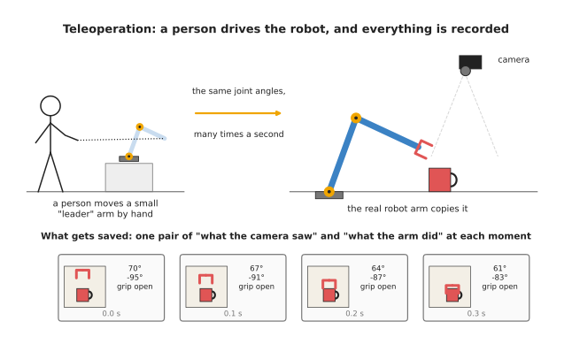
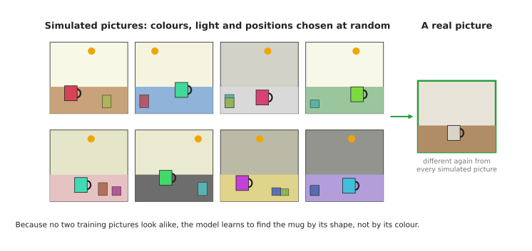
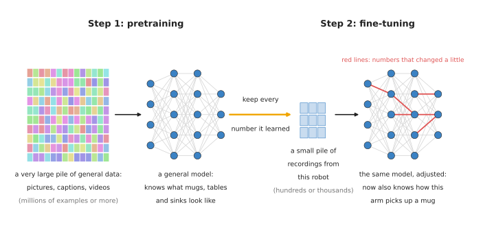

# Where the data comes from

A model learns from examples, and the three pages before this one were about what
happens to those examples. [How a model learns](02_how-a-model-learns.md) showed how the
numbers inside a model are changed, one example at a time, [inside a neural
network](03_inside-a-neural-network.md) showed what those numbers sit in, and [learning
signals](04_learning-signals.md) showed the kinds of learning. So this document answers
the question that comes before all of them: where do the examples come from?

It is for a complete beginner, so you do not need to know anything about machine
learning. You only need to remember one idea from the earlier documents: a model is
shown many examples, each with a question and the right answer, and it slowly changes
its numbers until its own answers match the right ones.

By the end you will know the five main places that robot data comes from, and you will
know what "pretraining", "fine-tuning" and "foundation model" mean. You will also have a
rough idea of how much data each kind of model needs.

## Contents

1. [Why the data matters so much](#1-why-the-data-matters-so-much)
2. [Labelled pictures](#2-labelled-pictures)
3. [Human demonstrations](#3-human-demonstrations)
4. [Simulation](#4-simulation)
   · [The gap between simulation and the real world](#the-gap-between-simulation-and-the-real-world)
   · [Domain randomisation](#domain-randomisation)
5. [Internet-scale data](#5-internet-scale-data)
6. [Self-supervised learning](#6-self-supervised-learning)
7. [Pretraining, then fine-tuning](#7-pretraining-then-fine-tuning)
8. [What a foundation model is](#8-what-a-foundation-model-is)
9. [How much data each kind needs](#9-how-much-data-each-kind-needs)
10. [Why not just collect robot data?](#10-why-not-just-collect-robot-data)
11. [Where to read next](#11-where-to-read-next)
12. [Using it in Python](#12-using-it-in-python)

---

## 1. Why the data matters so much

A model only knows what its examples showed it. For example, suppose every training
picture shows a white mug on a wooden table. The model may then learn "a white thing on
brown wood" instead of "a mug", and if you show it a blue mug on a grey table, it can
fail.

So the examples must look like the jobs the robot will really do, which means they must
cover the different colours, shapes, lights and positions the robot will meet. A set of
examples used for training is called a **dataset**.

Each example in a dataset is made of two parts. The first part is what the model is
given, such as a picture, and this is called the **input**. The second part is the right
answer, such as the word "mug", and this is called the **label**, or the **target**.

Getting inputs is usually easy, because a camera takes thirty pictures every second.
Getting the right answers is the hard part, since somebody, or something, has to supply
them. So each section below is a different way of supplying them.

---

## 2. Labelled pictures

The oldest way of supplying answers is also the simplest one. A person looks at each
picture and writes down the answer, and this is called **labelling**, or **annotation**,
while the person doing it is an **annotator**.

The answer can take several forms, depending on what the model must learn:

- a single word for the whole picture, such as "mug";
- a box drawn around each object, with a name on each box;
- an exact outline of each object, traced pixel by pixel;
- a few marked points, such as the rim and the handle of the mug.

Each form takes longer than the one before it. A person can give a word to a picture in
a second or two, while tracing the exact outline of every object in a busy kitchen
picture takes much longer. So outline datasets are usually much smaller than word
datasets.

A famous example is ImageNet, which is a dataset of about 1.2 million training pictures,
each labelled with one of 1,000 names, such as "coffee mug" or "golden retriever".
People labelled it by hand, and for many years it was the standard test for models that
recognise pictures.

Labelled pictures are how most [seeing models](../03_seeing-models/01_overview.md) are
trained. Their weakness is cost, because every label costs a person's time, and a new
object or a new kind of answer means labelling again.

---

## 3. Human demonstrations

A seeing model answers "what is in this picture?", but a [movement
model](../06_movement-models/01_overview.md) answers a different question: "what should
the arm do next?". No one can easily write that answer down by hand, so instead a person
shows the robot what to do, and this is called a **demonstration**.

The most common way to demonstrate is **teleoperation**, a word that means "operating
from a distance". The person does not push the robot itself, but moves a controller
instead, and the robot copies the controller's movements.

A popular kind of controller is a small second arm, called the **leader arm**, and it
has the same joints as the real robot, which is called the **follower arm**. The person
moves the leader arm by hand, while the computer reads the leader's joint angles many
times a second and sends the same angles to the follower. Other controllers include a
game controller, a virtual reality headset with hand controllers, and a handheld gripper
that the person carries around.



The picture shows one demonstration being recorded. At each moment the computer saves
two things together: what the camera saw, and what the arm did at that moment.

While the person works, the computer records everything at each moment:

1. the pictures from every camera;
2. the angle of every joint;
3. whether the gripper is open or closed;
4. the command that was sent to the arm.

One complete recording of one task, from start to finish, is called an **episode**. For
example, one episode might be "pick up the mug from the left of the table and put it on
the plate", and it might last twenty seconds.

Later, a movement model is trained on many episodes. It is shown the picture at each
moment, and the right answer is the command the person gave at that moment. The model
then learns to give the same command when it sees a similar picture, and copying a
person like this is called **behaviour cloning**. The [behaviour cloning
page](../06_movement-models/02_most-used/01_behaviour-cloning.md) explains it in full.

Demonstrations have one big strength, which is that they are real. The pictures come
from the robot's own cameras, and the movements are movements the robot can actually
make.

They also have one big weakness, which is that they are slow to collect. A person must
sit at the controller for every episode, so one person can record only so many episodes
in a day. The [data and demonstration
document](../../03_frameworks/08_frontier/03_data-and-demonstration.md) describes the
rigs people use and what they cost.

---

## 4. Simulation

Demonstrations are slow because a person has to make every one of them, so the next
source removes the person altogether. A **simulator** is a program that pretends to be
the real world, and it holds a 3D model of the robot, the table and the objects. It
works out how they move when the robot pushes them, using the rules of physics, and it
can also draw what a camera would see.

A simulator can make data very fast, because it can run many copies of the same scene at
once, it never gets tired, and it never breaks a real mug. It also knows every right
answer for free, because it placed every object itself, so it knows exactly where the
mug is, where its handle points and which pixels belong to it. This means that nobody
has to label anything in a simulated picture.

A simulator can also let a robot practise a task over and over. The robot tries
something, the simulator says whether it worked, and the robot tries again, many
thousands of times. Learning by trying like this is called **reinforcement learning**.
The [reinforcement learning
page](../06_movement-models/03_also-used/01_reinforcement-learning-policies.md) explains
it.

### The gap between simulation and the real world

A simulator is never exactly like the real world. Its pictures look a little too clean,
its light falls a little differently, and its mug slides a little differently from a
real one, because real friction is hard to copy exactly.

A model trained only in simulation learns these small differences as if they were true,
so when it meets the real world it does worse than it did in simulation. The difference
between how a model does in simulation and how it does in the real world is called the
**sim-to-real gap**, where "sim" is short for simulation.

### Domain randomisation

The most common fix for that gap is called **domain randomisation**. Here "domain" means
the look and feel of the world the model is trained in, and "randomisation" means
changing that look at random.

Instead of making one simulated world as close to the real one as possible, you make
thousands of different ones. In each training picture, the computer picks the table
colour, the mug colour, the brightness of the lamps, the camera position and the
other objects at random. It can also change the weight of the mug and how slippery
the table is.



The eight pictures on the left are all simulated, and no two look alike. The real
picture on the right looks different again, but the model has already learned to
ignore colour and light.

The model cannot rely on any one colour or lamp, because they keep changing. The only
thing that stays the same in every picture is the shape of the mug, so the shape is what
the model learns. To such a model, the real world then looks like just one more random
variation.

Domain randomisation has a cost of its own, however. The model must learn to cope with
far more variety than the real job needs, so it needs more training. It also cannot fix
every difference, because physics that the simulator gets badly wrong, such as cloth or
liquids, stays wrong however much you randomise it. The [simulation and evaluation
document](../../03_frameworks/08_frontier/04_simulation-and-evaluation.md) describes the
other fixes people use today.

---

## 5. Internet-scale data

Simulation is cheap but never quite real, so the next source is real data that nobody
collected for robots. The internet holds billions of pictures, videos and pages of text,
and many of the pictures come with a few words next to them, such as a caption under a
photo or the text of a web page. Those words are a kind of label that nobody had to
write for the purpose of training.

A well-known model called CLIP (Contrastive Language-Image Pretraining) was trained on
400 million pairs of pictures and captions collected from the internet. It learned to
match a picture with the words that describe it, and it was never told "this is a mug"
in the careful way ImageNet was. Instead it worked that out from millions of loosely
matched pictures and captions. The [open-vocabulary models
page](../03_seeing-models/02_most-used/03_open-vocabulary-models.md) explains how robots
use models like it.

Text on its own is also data that models learn from. Large language models, which the
[language models chapter](../07_language-models/01_overview.md) covers, learned from
huge amounts of text written by people.

Internet data has three clear strengths as a source. There is an enormous amount of it,
it covers almost every everyday object and word, and it costs very little to collect.

It also has two weaknesses that matter for robots. It is messy, because many captions
are wrong or unrelated to the picture, and it contains almost no robot actions. So the
internet can show a model what a mug looks like and what the word "mug" means, but it
cannot show the model how this particular arm should move its joints to pick the mug up.

---

## 6. Self-supervised learning

The methods above all need somebody to supply the right answer, whether that is a
person, a simulator or a caption writer. **Self-supervised learning** is a trick that
makes the right answer come from the data itself.

Here is the first example, which uses a picture. Take a picture and cover some patches
of it with grey squares, then ask the model to guess what was under them. The right
answer is the part of the picture you covered, so you already have it, and no person had
to label anything.

To guess well, the model must learn what things usually look like, such as that a mug
handle is curved and that a table edge is straight. That knowledge is useful later for
other jobs, such as finding mugs.

Here is a second example, which uses text instead. Take a sentence, hide the next word,
and ask the model to guess it. "Put the red mug in the ..." The right answer, "sink",
was in the sentence all along. Large language models learn mainly in this way, one word
at a time.

A third example uses video instead of still pictures. Show the model the first frames of
a clip and ask it to guess the next frame, and the real next frame is the right answer.
[World models](../08_world-models/01_overview.md) are often trained like this.

The name "self-supervised" means that the data supervises itself, because it supplies
both the question and the answer. This matters because it means any picture, any video
and any text can be used, not only the ones a person has labelled.

---

## 7. Pretraining, then fine-tuning

Now that you have seen the five sources, this section says how they are used together.
Most models used on robots today are not trained in one go, but in two separate steps.

The first step is **pretraining**, in which a model is trained on a very large, general
dataset, often from the internet and often with self-supervised learning. It learns
general things: what objects look like, what words mean, and how things usually move.
Pretraining is expensive, because it can use many powerful computers for weeks, so
usually a large company or a research lab does it once and then shares or sells the
result.

The second step is **fine-tuning**, in which you take the pretrained model, with all the
numbers it has learned, and train it a little more on a small dataset for your own job.
For a robot arm, this small dataset is often a few hundred demonstrations recorded on
your own robot. Fine-tuning changes the numbers only a little, so it is much cheaper
than pretraining, and it can often run on one computer in hours or days.



The same network appears twice in the picture. Fine-tuning keeps what pretraining
learned and changes only a small part of it, shown by the red lines.

This two-step method works because most of what the robot needs is general. Knowing what
a mug looks like, from any angle and in any light, is the same skill for every robot,
and only the last part, how this arm moves to this mug, is special to your robot. So the
expensive general part is learned once, from cheap general data, while the cheap special
part is learned from a little expensive robot data.

An everyday example is a person who already speaks English and starts a new job in a
kitchen. They do not need to learn English again, so they only need to learn where the
pans are kept and how this kitchen does things, which takes days rather than years.

---

## 8. What a foundation model is

A **foundation model** is a large model pretrained on a very large, broad dataset, so
that many different jobs can be built on top of it by fine-tuning or by simply asking
it. The name was made popular by a 2021 report from Stanford University, and it is
called a "foundation" because other models and products are built on it, the way a house
is built on its foundation.

For example, CLIP is a foundation model for pictures and words, and the large language
models behind chat assistants are foundation models for text. In robotics, people now
build **vision-language-action models**, which take in camera pictures and a spoken or
typed instruction and give out arm movements. They usually start from a foundation model
for pictures and words, and are then trained further on large collections of robot
demonstrations. The [vision-language-action models
page](../07_language-models/02_most-used/01_vision-language-action-models.md) explains
them. The [foundation models
document](../../03_frameworks/08_frontier/02_foundation-models.md) lists the ones that
exist in 2026.

One large robot dataset shows how these collections are built. Open X-Embodiment
gathered more than a million robot episodes from 22 different kinds of robot, which
many labs had recorded separately. Pooling them gave one dataset large enough to
pretrain on.

Being a foundation model does not make a model always right, because it only means that
the model starts from a broad base. So it still needs to be tested on your robot, and it
still often needs fine-tuning.

---

## 9. How much data each kind needs

The amount of data a model needs depends on the job and on whether it starts from a
pretrained model, and exact numbers vary a great deal from one model to the next. So the
table below gives only rough sizes, to show how the kinds compare. Read each row across:
the kind of data, how much a typical project uses, and what it mostly trains.

| Kind of data | Rough amount | Mostly trains |
| --- | --- | --- |
| Labelled pictures for a new seeing model, from scratch | hundreds of thousands to millions of pictures | [seeing models](../03_seeing-models/01_overview.md) |
| Labelled pictures to fine-tune a pretrained seeing model on your objects | hundreds to a few thousand pictures | [seeing models](../03_seeing-models/01_overview.md) |
| Demonstrations for one task on one robot | tens to hundreds of episodes | [movement models](../06_movement-models/01_overview.md) |
| Demonstrations to pretrain a general robot model | hundreds of thousands to millions of episodes, from many robots | [vision-language-action models](../07_language-models/02_most-used/01_vision-language-action-models.md) |
| Simulated examples | millions or more, because they are cheap | [grasp models](../05_grasp-models/01_overview.md), [movement models](../06_movement-models/01_overview.md) |
| Internet pictures, captions, text and video | hundreds of millions or more | foundation models for pictures and words |

Two patterns stand out from the numbers in the table. First, cheap data is used in huge
amounts, and expensive data is used in small amounts. Second, fine-tuning a pretrained
model needs far less data than training from nothing. That is the main reason
pretraining is so widely used.

---

## 10. Why not just collect robot data?

The obvious alternative to all of this is simple: record lots of real demonstrations on
your own robot, and train on nothing else. Real data is exactly right for the real job,
with no sim-to-real gap and no messy captions.

For one narrow task, this approach really does work. Some movement models learn one
task, such as putting a battery into a slot, from about fifty demonstrations recorded on
that robot.

But it stops working as soon as you want variety. To handle every mug, every table and
every kitchen, you would need to demonstrate on every one of them, and a person can
record only so many episodes in a day. So people mix the sources: internet data and
self-supervised learning for general knowledge, simulation for volume, and real
demonstrations for the final, exact skill.

That mix of sources has costs of its own. Pretrained models are large, and large models
are slower to run on a robot, which is what [Running a model on a
robot](../10_making-models-work-on-an-arm/02_most-used/02_running-a-model-on-a-robot.md),
in the last chapter of this book, is about. You also depend on whoever did the
pretraining, and on the licence they chose. And a model built from many sources is
harder to understand when it fails, because you did not see most of the data it learned
from.

---

## 11. Where to read next

- [Running a model on a
  robot](../10_making-models-work-on-an-arm/02_most-used/02_running-a-model-on-a-robot.md)
  is the next document, and it explains what happens after training, when the model is
  used.
- [The map of models](06_the-map-of-models.md) then shows every kind of model in this
  book and what data each one uses.
- [How a model learns](02_how-a-model-learns.md) explains what the model does with each
  example.
- For much more detail on teleoperation rigs and open robot datasets, read [where
  manipulation data comes
  from](../../03_frameworks/08_frontier/03_data-and-demonstration.md).
- For simulators and the sim-to-real gap, read [simulation, world models and
  evaluation](../../03_frameworks/08_frontier/04_simulation-and-evaluation.md).
- [Learned methods for one
  arm](../../03_frameworks/04_one-arm-training/03_learned-methods.md) shows how these
  kinds of data are used to teach one arm a task.

---

## 12. Using it in Python

This page was about where examples come from, and section 9 said how many of
them each kind of model needs. There is one line of Python that decides whether
the test score you get from those examples means anything at all, and this
section is about that line. It shows the shape of the idea rather than a
technique, because splitting data is something you do before any model is
chosen.

Robot data arrives as demonstrations, and one demonstration is hundreds of
frames recorded a few milliseconds apart. Neighbouring frames look almost
identical, so if you split the frames at random, nearly every test frame has an
almost identical twin in the training set. The model then scores well on the
test set without having learned anything that transfers to a new demonstration.

```python
from sklearn.model_selection import train_test_split, GroupShuffleSplit

# Wrong for robot data: frames of one demonstration land on both sides.
X_train, X_test, y_train, y_test = train_test_split(
    X, y, test_size=0.2, random_state=0)

# Right: demo_id says which demonstration each row came from, and whole
# demonstrations go to one side or the other.
splitter = GroupShuffleSplit(n_splits=1, test_size=0.2, random_state=0)
train_rows, test_rows = next(splitter.split(X, y, groups=demo_id))
X_train, X_test = X[train_rows], X[test_rows]
y_train, y_test = y[train_rows], y[test_rows]
```

Both functions come from scikit-learn, which is the standard Python library for
the older machine learning methods and is described in
[chapter 2](../02_classical-machine-learning/01_overview.md). Here it is used
only for the split, which works the same whether the model that follows is a
random forest or a neural network. The `random_state=0` fixes the shuffling, so
the same split comes back every time you run the script, and that is what lets
you compare two models fairly.

The library gives you the shuffling, the proportions, and the guarantee that no
value of `demo_id` appears on both sides. It also gives you `GroupKFold` and
`StratifiedGroupKFold` for the same idea repeated several times over.

What you have to collect is the data itself, and what you have to record is
`demo_id`. That is the part people forget, because once the frames from many
demonstrations have been stacked into one array without a column saying which
recording each came from, nothing can recover it afterwards. The same applies to
the simulated data of section 4, where the group is usually one randomised scene
rather than one demonstration.

What you have to decide is what a group means for your job. If the arm was
taught by three different people, you may want to test on a person the model has
never seen. If it worked in four bins of parts, testing on an unseen bin tells
you more than testing on unseen frames. Section 10 said that robot data is
expensive, and a split like this is how you get an honest answer out of the
little you have.
