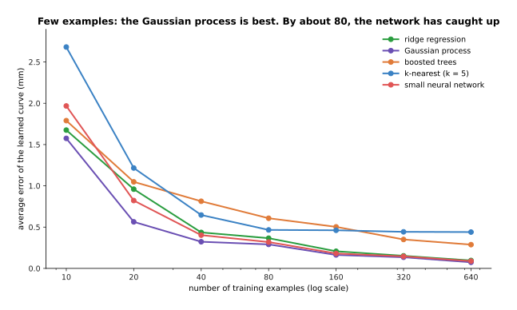

# Classical machine learning

Not every learned model on a robot is a neural network. Older learning methods,
often called **classical machine learning**, are still used every day next to
neural networks. This chapter covers them. This first page is its overview. It
answers four questions. What is classical machine learning? Why does it still
matter on robot arms in 2026? Which methods does this chapter cover, and which
one fits which job? And when does a small dataset make one of them a better
choice than a network?

It is for a reader who has read the first chapter of this book, especially
[what a model is](../01_what-models-are/01_what-a-model-is.md) and
[how a model learns](../01_what-models-are/02_how-a-model-learns.md). You need to
know what an example, a label, a weight, a test set and overfitting are. Nothing
else about machine learning is assumed.

## Contents

1. [What classical machine learning is](#1-what-classical-machine-learning-is)
2. [Why it still matters on arms in 2026](#2-why-it-still-matters-on-arms-in-2026)
3. [The pages in this chapter](#3-the-pages-in-this-chapter)
4. [The methods side by side](#4-the-methods-side-by-side)
5. [When a small dataset makes them the better choice](#5-when-a-small-dataset-makes-them-the-better-choice)
6. [How this chapter connects to the rest](#6-how-this-chapter-connects-to-the-rest)
7. [Where to read next](#7-where-to-read-next)

---

## 1. What classical machine learning is

**Classical machine learning** means the learning methods that were worked out
before neural networks took over, and that are not neural networks. Most of them
date from the 1950s to the 2000s. They are still learning methods: each one
turns examples into a model that makes predictions, and none of them is written
by hand as a rule.

Here is an everyday example. A shop wants to guess how long a delivery will take
from the distance. It has fifty past deliveries. Nobody would build a large
neural network for this. You would draw a line or a smooth curve through the
fifty points and read the answer off it. That is what classical machine learning
does. It fits a simple shape to a small table of numbers.

A **neural network** is a different kind of tool. It has many adjustable weights,
and it can learn very complicated shapes, such as how pixels make up a mug. But it
needs many examples to set all those weights, and a lot of computing to train.
Classical methods have far fewer settings. They usually take a short list of
numbers that already mean something, such as a distance, a force or a joint
angle. These input numbers are called **features**. The methods do not read raw
pictures well.

---

## 2. Why it still matters on arms in 2026

The rest of this book is about neural networks, and large networks now do most of
the seeing and much of the moving on robot arms. Classical methods still matter for
four reasons.

- **Small data.** Many jobs on an arm come with tens or hundreds of examples, not
  millions. Each calibration run, each logged grasp and each demonstration costs
  robot time and a person's time. With so few examples, a classical method usually
  learns as well as a network or better. Section 5 shows this with real numbers.
- **Error bars.** Some classical methods, such as Gaussian processes, say how sure
  they are at every input, with no extra work. A robot can use that to refuse an
  action, or to measure again, when the model is unsure.
- **Speed.** They train in seconds on an ordinary computer, with no graphics card.
  Many of them predict in microseconds, fast enough for a control loop that runs a
  thousand times a second.
- **Explainability.** You can read a regression's weights, or follow a small tree's
  questions. When the arm does something wrong, a person can see why, and a safety
  review can check it.

Classical and neural methods are also often used together. A pretrained network
turns a picture into a short list of numbers, and a classical method learns the
robot's own job on top of those numbers.

---

## 3. The pages in this chapter

The chapter has this overview and eight pages, in two groups.

The **most used** group holds four general tools. Each one learns from a table of
numbers, and each one can be used for almost any job where the input is a few
measured numbers. They are the ones a robot arm project reaches for first:

1. [Linear and logistic regression](02_most-used/01_linear-and-logistic-regression.md).
   A weighted sum of features, for a number or for the chance of a yes. Also ridge
   regression and weighted least squares.
2. [Decision trees and forests](02_most-used/02_decision-trees-and-forests.md).
   Chains of yes-or-no questions, grown one at a time or many together, including
   gradient-boosted trees.
3. [Gaussian processes and Bayesian optimisation](02_most-used/03_gaussian-processes-and-bayesian-optimisation.md).
   A smooth curve with an error bar at every point, and a way to use those error bars
   to tune settings in a few tries.
4. [Nearest neighbours and locally weighted regression](02_most-used/04_nearest-neighbours-and-locally-weighted-regression.md).
   Keep every example, and predict from the ones most like the new input.

The **also used** group holds methods with a narrower job. Two of them are built for
motions and sequences over time, which is why they are common in robot learning from
demonstrations. One is a helper that makes data smaller before another method uses
it. And one was once the leading method for classification, and is now used less
because trees and networks usually do better:

1. [Mixture models and hidden Markov models](03_also-used/01_mixture-models-and-hidden-markov-models.md).
   Data described as a few overlapping blobs, a motion learned from those blobs, and
   a task split into hidden phases.
2. [Movement primitives](03_also-used/02_movement-primitives.md). A motion learned
   from one or a few demonstrations that can be stretched to a new start and goal.
3. [PCA and shrinking data](03_also-used/03_pca-and-shrinking-data.md). Turning many
   numbers into a few that keep most of the information.
4. [Support vector machines](03_also-used/04_support-vector-machines.md). A dividing
   line between two classes, placed as far as possible from both.

Read the four most-used pages first, in order. The also-used pages can be read in any
order, when your task needs them.

---

## 4. The methods side by side

The table below compares the methods of this chapter. Read each row across: the
method, what it predicts, the data it needs, one place it is used on a robot arm, and
the page that explains it.

| Method | What it predicts | Data it needs | An arm example | Page |
| --- | --- | --- | --- | --- |
| Linear and ridge regression | a number | tens of rows; features chosen by hand | turning a force sensor's raw counts into newtons | [regression](02_most-used/01_linear-and-logistic-regression.md) |
| Logistic regression | the chance of a yes | tens to hundreds of labelled rows | the chance a grasp holds, from grip force and object width | [regression](02_most-used/01_linear-and-logistic-regression.md) |
| Decision trees, random forests, gradient-boosted trees | a number or a class | hundreds to thousands of rows; columns in any units | which logged grasps tend to fail; spotting a faulty joint from motor logs | [trees](02_most-used/02_decision-trees-and-forests.md) |
| Gaussian process | a number with an error bar | tens to a few thousand rows | correcting a depth camera's error, and knowing where the correction is unsure | [Gaussian processes](02_most-used/03_gaussian-processes-and-bayesian-optimisation.md) |
| Bayesian optimisation | the next setting to try | one score per try; 20 to 50 tries | tuning a controller's gains or a grip force on the real arm | [Gaussian processes](02_most-used/03_gaussian-processes-and-bayesian-optimisation.md) |
| k-nearest neighbours, locally weighted regression | a number or a class, from similar stored examples | every example kept; few input numbers | reusing the grasp that worked on the most similar stored object | [neighbours](02_most-used/04_nearest-neighbours-and-locally-weighted-regression.md) |
| Gaussian mixture model and regression, hidden Markov model | groups, a motion, or the current phase of a task | a few demonstrations or recordings | telling whether an insertion is in its approach, contact or push phase | [mixture models](03_also-used/01_mixture-models-and-hidden-markov-models.md) |
| Movement primitives | a whole motion, adapted to a new goal | one to ten demonstrations | a pouring or wiping motion moved to a new cup or table position | [movement primitives](03_also-used/02_movement-primitives.md) |
| Principal component analysis | a few numbers that stand for many | unlabelled rows | shrinking a hand's many joint angles to two or three that matter | [PCA](03_also-used/03_pca-and-shrinking-data.md) |
| Support vector machine | a class | tens to thousands of labelled rows | telling contact from no contact in a force signal | [support vector machines](03_also-used/04_support-vector-machines.md) |

All of these take a short list of meaningful numbers as input, or a short recording
of them. None of them reads a raw picture well. That is the job of the neural
network chapters.

---

## 5. When a small dataset makes them the better choice

This test shows the small-data point with real numbers. It comes from the diagram
script `docs/diagrams/what_models_are_3.py`, and the data is simulated so that the
true answer is known.

A robot arm has a **depth camera**: a camera that also measures how far away each
pixel is. Its readings are a little wrong, and the error changes with distance. To
correct it, the robot measures a flat board at known distances from 0.3 to 1.5
metres. Each measurement is one example. The input is the distance, and the label is
the error of the reading in millimetres (mm), with about 1 mm of random noise.

The script trained four classical methods and a small neural network on this
problem, with more and more examples. The network had one hidden layer of 64 neurons
and was trained by gradient descent. For each number of examples, each method was
trained 8 times on fresh random examples. Each was scored by the **root mean square
error (RMSE)** against the true curve: square each difference, take the average, and
take the square root. It is a typical size of the error, in millimetres. Lower is
better.

The table below gives the same results. Read each column as one number of training
examples. Each number is the average error in millimetres.

| Method | 10 | 20 | 40 | 80 | 160 | 320 | 640 |
| --- | --- | --- | --- | --- | --- | --- | --- |
| Ridge regression | 1.67 | 0.96 | 0.44 | 0.37 | 0.21 | 0.15 | 0.10 |
| Gaussian process | 1.57 | 0.56 | 0.32 | 0.29 | 0.16 | 0.13 | 0.07 |
| Boosted trees | 1.79 | 1.05 | 0.81 | 0.61 | 0.50 | 0.35 | 0.29 |
| k-nearest (k = 5) | 2.68 | 1.22 | 0.65 | 0.47 | 0.46 | 0.44 | 0.44 |
| Small neural network | 1.97 | 0.82 | 0.40 | 0.32 | 0.18 | 0.15 | 0.09 |

Four things stand out.

- With 10 examples, the network is worse than the Gaussian process, ridge
  regression and the boosted trees.
- With 20 examples, the Gaussian process is clearly the best, at 0.56 mm against the
  network's 0.82 mm.
- By about 80 examples, the network has caught up with the Gaussian process and ridge
  regression. From there on the three are close.
- On this problem the network never pulls ahead. The input is one number and the
  curve is smooth, so a network's extra power has nothing to do.

A network pulls ahead when the input is large and complicated, such as a picture or
a long recording, and there are many examples. Then no simple shape can describe the
answer, and only a network can learn one. So the rule of thumb is:

- With a few numbers in and tens to hundreds of examples, try ridge regression, a
  Gaussian process or boosted trees first.
- With a picture, a point cloud or a sound in, and thousands of examples or more,
  use a neural network, usually one that someone else has already trained, as in
  [fine-tuning](../10_making-models-work-on-an-arm/02_most-used/01_fine-tuning.md).
- With both, a common mix is a network that turns a picture into a short list of
  numbers, and a classical method on top of those numbers.

---

## 6. How this chapter connects to the rest

**To Book 5.** Many classical methods share their maths with a written technique in
[Book 5](../../05_programming-techniques/01_what-techniques-are/01_programmed-not-learned.md).
The difference is the purpose. Book 5 fits a formula it already knows, and this
chapter learns a shape nobody wrote down. Linear regression is
[least-squares fitting](../../05_programming-techniques/04_fitting-and-estimation/02_most-used/01_least-squares-fitting.md)
used to predict. k-nearest neighbours is built on
[nearest-neighbour search](../../05_programming-techniques/03_searching-and-matching/02_most-used/01_nearest-neighbour-search.md).
A Gaussian mixture model is a softer form of the k-means method in
[clustering](../../05_programming-techniques/05_image-and-point-cloud-processing/02_most-used/03_clustering.md).
A hidden Markov model tracks a hidden state over time, as the
[Kalman filter](../../05_programming-techniques/04_fitting-and-estimation/02_most-used/03_kalman-filter.md)
does, but for a state that jumps between a few phases. Movement primitives are
learned versions of the curves in
[trajectory generation](../../05_programming-techniques/07_control-and-motion/02_most-used/02_trajectory-generation.md).
And Bayesian optimisation is a careful relative of
[sampling-based optimisation](../../05_programming-techniques/06_planning-and-search/03_also-used/02_sampling-based-optimisation-and-mpc.md),
built for when each try is expensive. Each technique page names its written
alternative.

**To the neural network chapters.** The later chapters of this book are about neural
networks, and they meet the methods of this chapter in several places.
[Movement models](../06_movement-models/01_overview.md) learn from demonstrations, as
movement primitives do, but from camera pictures and many more demonstrations.
[Grasp quality models](../05_grasp-models/03_also-used/02_grasp-quality-models.md)
score grasps with a network, where a logistic regression or boosted trees would score
them from a few numbers.
[Learned arm models](../09_touch-and-body-models/03_also-used/02_learned-arm-models.md)
describes the Gaussian-process and locally weighted work on learning how an arm
moves, which came before deep networks.
[Learned dynamics models](../08_world-models/02_most-used/01_learned-dynamics-models.md)
often use a small classical model to correct a physics formula. And
[uncertainty and confidence](../10_making-models-work-on-an-arm/03_also-used/01_uncertainty-and-confidence.md)
explains how a robot uses an error bar, like a Gaussian process's, to decide
whether to act.

---

## 7. Where to read next

- The first page of this chapter is
  [linear and logistic regression](02_most-used/01_linear-and-logistic-regression.md).
  Every other method in the chapter is easier once you know it.
- [The map of models](../01_what-models-are/06_the-map-of-models.md) shows where this
  chapter sits among all the chapters of the book.
- [Uncertainty and confidence](../10_making-models-work-on-an-arm/03_also-used/01_uncertainty-and-confidence.md)
  explains how a robot turns an error bar into a decision.
- [Fine-tuning](../10_making-models-work-on-an-arm/02_most-used/01_fine-tuning.md)
  covers adapting a pretrained network, including training a small classical model on
  top of it.
- [Least-squares fitting](../../05_programming-techniques/04_fitting-and-estimation/02_most-used/01_least-squares-fitting.md)
  in Book 5 explains the maths under linear regression.
