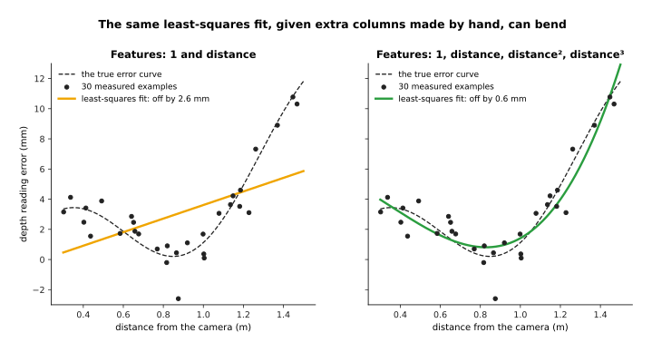
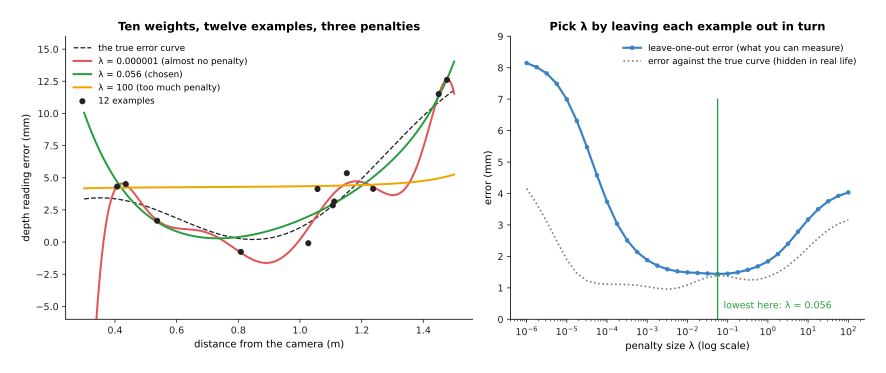
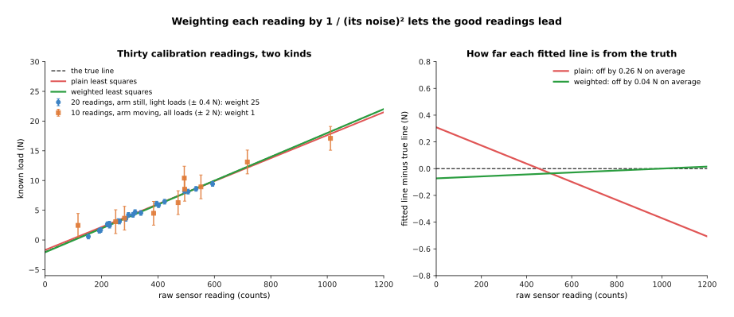
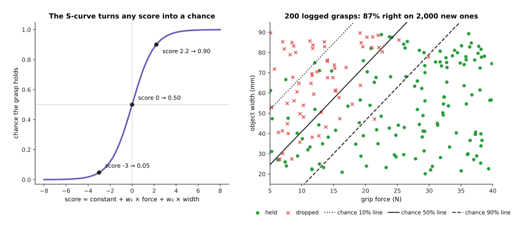

# Linear and logistic regression

This page explains the two simplest learning methods there are. **Linear
regression** learns to predict a number, such as how many newtons a sensor
reading means. **Logistic regression** instead learns to predict the chance of a
yes, such as the chance that a grasp will hold. The page also covers two small
changes that make linear regression work much better in practice: **ridge
regression**, which stops a fit from going wild, and **weighted least squares**,
which lets you trust some readings more than others.

It answers five questions, and the sections below take them in turn. What do
these methods do? How do they work, step by
step? What data do they need? Where does a robot arm use them? And what goes
wrong?

It is for a reader who has read the first chapter of this book, especially
[how a model learns](../../01_what-models-are/02_how-a-model-learns.md). So you
need to know what an example, a label, a weight and overfitting are before you
start.

Every number on this page comes from a real run of the diagram script
`docs/diagrams/classical_ml_1.py`, where the data is simulated so that the true
answer is known exactly. But the methods themselves are real, and they are
written in NumPy.

> Before this page, it helps to have read [least-squares fitting](../../../05_programming-techniques/04_fitting-and-estimation/02_most-used/01_least-squares-fitting.md) in Book 5. Linear regression is least-squares fitting, used to learn from examples.

## Contents

1. [The idea in one sentence](#1-the-idea-in-one-sentence)
2. [Linear regression, step by step](#2-linear-regression-step-by-step)
   · [A worked example: calibrating a force sensor](#a-worked-example-calibrating-a-force-sensor)
   · [Features by hand: letting a line bend](#features-by-hand-letting-a-line-bend)
   · [Ridge regression: a penalty on big weights](#ridge-regression-a-penalty-on-big-weights)
   · [Weighted least squares: trusting some readings more](#weighted-least-squares-trusting-some-readings-more)
3. [Logistic regression: the chance of a yes](#3-logistic-regression-the-chance-of-a-yes)
4. [How they are trained, and how much data they need](#4-how-they-are-trained-and-how-much-data-they-need)
5. [Where they are used on a robot arm](#5-where-they-are-used-on-a-robot-arm)
6. [What goes wrong](#6-what-goes-wrong)
7. [Libraries](#7-libraries)
8. [Why these, and what they cost](#8-why-these-and-what-they-cost)
9. [The written alternative](#9-the-written-alternative)
10. [Where to read next](#10-where-to-read-next)
11. [Using it in Python](#11-using-it-in-python)

---

## 1. The idea in one sentence

Linear regression multiplies each input number by a weight, adds the results,
and picks the weights that make the squared mistakes on the examples as small as
possible; logistic regression does the same sum and then squeezes it into a
chance between 0 and 1.

For example, a taxi fare is a fixed starting charge plus a price per kilometre.
So if you did not know those two prices, you could look at ten old receipts,
each with a distance and a fare, and work the prices out from them. The starting
charge and the price per kilometre are the two weights, so finding them from the
receipts is linear regression.

Now say you want to know whether the taxi will arrive within ten minutes, where
the answer is yes or no rather than a number. But you could still add up the
same kind of weighted sum, from the distance and the time of day, and then turn
that sum into a chance such as 0.8, and that is logistic regression.

---

## 2. Linear regression, step by step

The one-sentence idea above does not say how the weights are chosen, so this
section takes the method apart. Linear regression takes a list of input numbers
for each example, and these input numbers are called **features**. From them it
produces one output number, which is:

> output = constant + w₁ × feature₁ + w₂ × feature₂ + …

The constant and the w's are the weights, so training means choosing them. For
every example the **residual** is the label minus the output, which says how far
off the prediction is. Linear regression then chooses the weights that make the
sum of the squared residuals as small as possible. This is exactly least-squares
fitting from Book 5, and the only difference is the purpose, because here the
fitted line is used to predict new cases.

### A worked example: calibrating a force sensor

A gripper has a force sensor that reports a raw number, called **counts**. To
turn counts into newtons (N), the robot hangs five known loads on it and writes
down what the sensor reports for each one. So each pair is one example, where
the input is the counts and the label is the known load.

| Known load (N) | 0 | 5 | 10 | 15 | 20 |
| --- | --- | --- | --- | --- | --- |
| Reported counts | 102 | 348 | 611 | 849 | 1103 |

The table above holds one example per column, and because there is only one
feature, the best line has a short formula with these steps:

1. Find the average input and the average label, which here are 602.6 counts and
   10.0 N.
2. For every example, take its input minus the average input and its label minus
   the average label. Then multiply the two and add up the five results, which
   gives 12,515.0.
3. For every example, square its input minus the average input, and add up the
   five results, which gives 626,605.2.
4. The slope is step 2 divided by step 3: 0.01997 N per count.
5. The constant is the average label minus the slope times the average input:
   10.0 − 0.01997 × 602.6 = −2.036 N.

So the learned rule is: load = −2.036 + 0.01997 × counts, which means a new
reading of 700 counts becomes 11.95 N. The residuals on the five examples are
all under 0.2 N, so the line fits the readings well. With more than one feature
the same idea is solved as a small set of equations, and every library does that
for you in one call.

### Features by hand: letting a line bend

That example fitted a straight line, but a straight line cannot follow a curve.
However, the "linear" in linear regression only means that the output is a
weighted sum of the features, and it says nothing about what those features are.
So you can make extra features by hand from the input you already have, such as
the input squared and the input cubed. The fit then stays a weighted sum, but
the shape it draws can bend.

So the example here is a depth camera whose readings are a little wrong, by an
amount that changes with distance. Then the robot measures a flat board at 30
known distances between 0.3 and 1.5 metres, and records the error of each
reading in millimetres (mm). To score a fit, the script compares it with the
true error curve at 400 distances and reports the typical difference, which is
the **root mean square error**. That means squaring each difference, taking the
average and then taking the square root.



With the features 1 and distance, the fit is a straight line, and it is off by
2.56 mm. Adding distance squared brings this down to 0.65 mm, and adding
distance cubed as well brings it to 0.59 mm. Nothing about the method changed in
any of this, because only the columns of the table changed.

Choosing features by hand is where most of the skill in linear regression lies,
because good features come from knowing the physics. For example, for a joint's
friction a person might add the sign of the speed as a feature, because friction
pushes against the motion. For a camera lens, the distance from the picture's
centre squared is a common feature, because lens bending grows that way.

### Ridge regression: a penalty on big weights

More features let the curve bend more, but with too many features for the number
of examples it bends wildly to pass through every noisy point. That is
overfitting, and the sign of it here is that the weights become huge and cancel
each other out.

**Ridge regression** fixes this with one change, because it adds a penalty to
the thing being made small: the sum of the squared weights, times a number
called lambda (λ). The fit must now balance two wishes, which are to stay close
to the examples and to keep the weights small. The constant is not penalised,
because shrinking it would only move the whole curve up or down.

For example, the script gave 12 examples to a curve with 10 weights, which are
powers of the distance up to the ninth. With no penalty, the largest weight is
1,288, and the curve is off by 16.6 mm. With a very small penalty, λ = 0.000001,
the largest weight is 422 and the curve is off by 4.2 mm, which is still wild
between the examples.

How big should λ be? You cannot use the true curve here, because in real life
you do not have it. Instead you use **leave-one-out checking**, which means
leaving out one example, fitting on the other eleven, and seeing how far off the
prediction for the left-out one is. Then do this for each of the twelve examples
in turn and average the results, and keep the λ with the lowest average.



Leave-one-out checking picked λ = 0.056, whose fit is off by 1.39 mm against the
true curve and whose largest weight is 6.1. But with λ = 100 the penalty is too
strong, so the curve is almost flat and it is off by 3.2 mm. The dotted line on
the right, which you would not have in real life, shows that the check picked a
good value. Notice the left end of the chosen curve, where there are no examples
below 0.4 metres, so the curve rises where it has no data. This means ridge
regression only keeps a curve calm between the examples, and not beyond them.

### Weighted least squares: trusting some readings more

Plain least squares treats every example as equally reliable, but often the
examples are not equally reliable. For example, a depth camera is less accurate
far away than close up, and a force reading taken while the arm is moving has
more noise than one taken with the arm still.

**Weighted least squares** gives each example a weight of its own, and it makes
the sum of weight × residual² as small as possible. A reading with a big weight
pulls the line hard, while a reading with a small weight pulls it only gently.
The usual choice is weight = 1 / (the reading's noise)², so a reading that is 5
times less noisy gets 25 times the say. If you do not know the noise you can
measure it, by repeating a few readings at the same load and seeing how much
they vary.

So the example calibrates the force sensor again, this time with 30 readings.
Twenty were taken with the arm still, which gives a noise of about 0.2 N, but
only with light loads, below about 600 counts. Ten were taken while the arm
moved, which gives a noise of about 1 N, but they cover the whole range of
loads.



The still readings get weight 25 and the moving ones weight 1. In this run, the
plain fit's line is off by 0.26 N on average across the range, and the weighted
fit's line by 0.04 N. The right-hand picture shows why, because the plain line
is tilted by the noisy readings, and it is worst at high loads, where it matters
most.

One run can be lucky, so the script repeated the whole test 2,000 times with
fresh noise. On average the plain fit was off by 0.246 N and the weighted fit by
0.117 N. Using only the 20 still readings gave 0.123 N, so weighting did better
than both of the alternatives. That is because weighting trusts the still
readings most, but it still uses the moving ones to learn about high loads.

Weighting is not special to this page, because the same idea comes back in
[decision trees and forests](02_decision-trees-and-forests.md), where some
examples count more when a tree is built, and in
[nearest neighbours and locally weighted regression](04_nearest-neighbours-and-locally-weighted-regression.md),
where closer examples count more.

---

## 3. Logistic regression: the chance of a yes

Everything so far predicted a number, but many questions on a robot have a
yes-or-no answer instead. Will this grasp hold? Is this part faulty? Did the peg
go into the hole? These are called **classification** questions, and the answer
to one of them is a **class**. Linear regression is a poor fit for them, because
the script fitted a straight line to 200 grasps labelled 1 for held and 0 for
dropped, and its outputs ran from −0.03 to 1.40. Neither of those two numbers is
a sensible chance, because a chance has to lie between 0 and 1.

**Logistic regression** keeps the weighted sum, which it now calls the
**score**, and passes it through an S-shaped curve called the **logistic
function**, or **sigmoid**:

> chance = 1 / (1 + e^(−score))

A score of 0 gives a chance of 0.50, while a large positive score gives a chance
close to 1 and a large negative score gives a chance close to 0. So the output
is always a chance between 0 and 1.

For example, a robot deciding how hard to squeeze has logged 200 past grasps.
Each one has two features, which are the grip force in newtons and the width of
the object in millimetres. The label is whether the object stayed in the gripper
while the arm lifted it. In this simulation more force helps and a wider object
is harder to hold, and 135 of the 200 grasps held.

Training uses **gradient descent**, which the page on
[how a model learns](../../01_what-models-are/02_how-a-model-learns.md)
explained. The measure of how wrong the model is, called the **loss**, is the
**log loss**. For a grasp that held, the loss is minus the log of the chance the
model gave to "held". For a grasp that dropped, it is minus the log of the
chance it gave to "dropped", so a confident wrong answer costs a lot. There is
no one-step formula here as there is for linear regression, but the loss has a
single lowest point, so gradient descent always finds the same answer. The
features are first scaled to a similar size, so that one step size suits all the
weights.



The learned score is 0.67 + 0.264 × force − 0.081 × width, and on 2,000 new
simulated grasps it said the right answer, held or dropped, 87% of the time. The
lines on the right picture are where the chance is 10%, 50% and 90%. They are
straight, because a fixed chance means a fixed score, and a fixed weighted sum
is a straight line.

So the robot can now use the model before it acts. The table below gives the
chance of holding for three grasps, and you should read each row across: the
force, the width, the score and the chance.

| Grip force | Object width | Score | Chance it holds |
| --- | --- | --- | --- |
| 20 N | 40 mm | 2.72 | 0.94 |
| 20 N | 70 mm | 0.30 | 0.57 |
| 30 N | 70 mm | 2.94 | 0.95 |

For a 70 mm object, the model says that 27.2 N gives a 90% chance of holding.
The weights are also easy to read, because each extra newton adds 0.264 to the
score and each extra millimetre of width takes away 0.081. So about 3 mm of
extra width needs about 1 N of extra force to make up for it.

Features chosen by hand matter here too, because with grip force alone the model
was right 80.3% of the time on the new grasps, against 87.0% with width added.
This means the width column carried information that force alone could not give.
When there are more than two classes, such as "held", "slipped" and "dropped",
the same idea gives each class its own score. Then a function called **softmax**
turns those scores into chances that add up to 1.

---

## 4. How they are trained, and how much data they need

Both methods have been shown on one worked example each, so this section says
what they need in general. Both learn from a table, where each row is one
example and each column is one feature, plus one more column for the label. You
make the features yourself, from measurements that already mean something, such
as a distance, a force or a temperature.

Linear and ridge regression are trained in one step, by solving a small set of
equations, so training takes well under a second even for a million rows.
Logistic regression instead takes a few hundred to a few thousand steps of
gradient descent, which is still under a second for tables of this size.

So a rough rule for how much data you need is at least ten examples per weight.
The force sensor had 2 weights and 5 examples, which worked because the readings
were clean and the true shape really was a line. The ridge example had 10
weights and only 12 examples, which is why it needed a penalty. For logistic
regression you should count the rarer class rather than the rows, because if
only 20 of your 500 grasps dropped, the model has 20 examples of dropping to
learn from and not 500.

Always keep some examples back for checking, as leave-one-out checking does, or
split off a test set, because a fit that looks perfect on its own examples can
still be wrong between them.

---

## 5. Where they are used on a robot arm

Section 4 showed how little data these methods need, and because they are also
small, fast and easy to check, they appear in many places on an arm.

- **Sensor calibration.** Linear regression turns a force sensor's counts into
  newtons, a temperature reading into a correction, or a depth camera's reading
  into the true distance, and this page's two examples are both of this kind.
- **Learning an arm's dynamics.** The torque a joint needs is a weighted sum of
  known features built from the joint's angles, speeds and accelerations, where
  the weights are the links' masses and friction numbers. Finding the weights
  from logged motion is linear regression, often weighted, because some recorded
  motions are more reliable than others. Book 5's
  [arm dynamics](../../../05_programming-techniques/07_control-and-motion/02_most-used/03_arm-dynamics.md)
  page describes the formula.
- **Predicting grasp success from a few numbers.** As in this page's example,
  logistic regression on force, width, mass or approach angle gives a quick
  chance that a grasp will hold.
- **A small head on a big network.** A pretrained network turns each picture
  into a list of numbers, and a logistic regression then learns the robot's own
  classes on top of those numbers, from a few dozen labelled pictures. This is
  called a **linear probe**, and the
  [fine-tuning](../../10_making-models-work-on-an-arm/02_most-used/01_fine-tuning.md)
  page covers it.
- **Correcting a physics formula.** A formula predicts most of what happens, and
  a small linear regression learns what it gets wrong, as described in
  [learned dynamics models](../../08_world-models/02_most-used/01_learned-dynamics-models.md).
- **Simple fault checks.** A logistic regression on motor current, temperature
  and speed gives a chance that a joint is running abnormally.
- **A baseline.** Before training anything bigger, people fit a ridge or
  logistic regression first, because if the big model cannot beat it, the big
  model is not worth its cost.

---

## 6. What goes wrong

Section 5 listed the jobs these methods do well, and this section lists the ways
they fail instead. Each failure has a sign that you can look for, and the table
below collects them. Read each row across: what goes wrong, the sign you would
see, and what people do about it.

| What goes wrong | The sign you would see | What people do about it |
| --- | --- | --- |
| the features cannot draw the true shape | the error stays high however much data you add; the residuals show a pattern, such as all positive in the middle | add features by hand, or move to [decision trees and forests](02_decision-trees-and-forests.md) or [Gaussian processes](03_gaussian-processes-and-bayesian-optimisation.md) |
| too many features for the examples | tiny error on the examples, large error on new ones; very large weights | ridge regression, with λ chosen by leave-one-out checking |
| features of very different sizes | the penalty shrinks some weights much more than others; gradient descent is slow | scale every feature to a similar size first |
| two features carry the same information | the weights jump around between fits and have opposite signs | drop one of them, or use ridge regression |
| a few bad readings | the line tilts towards them | weighted least squares if you know which readings are poor; [RANSAC](../../../05_programming-techniques/04_fitting-and-estimation/02_most-used/02_ransac.md) from Book 5 if you do not |
| a new input beyond the examples | the prediction runs off, as the ridge curve did below 0.4 m | collect examples there, or refuse to predict outside the known range |
| the two classes are perfectly separated (logistic) | the weights keep growing as training goes on | add a ridge penalty, which scikit-learn does by default |
| a rare class (logistic) | the model says "no" almost every time and still looks accurate | weight the rare class's examples more, and judge the model on the rare class |

---

## 7. Libraries

You would not write any of this from scratch in a real project, so the table
below lists real libraries for these methods. Read each row as one library: its
language, what it provides, and a note on when to use it.

| Library | Language | What it provides | Note |
| --- | --- | --- | --- |
| NumPy | Python | `numpy.linalg.lstsq` and `numpy.linalg.solve` | enough for linear, ridge and weighted least squares in a few lines |
| scikit-learn | Python | `LinearRegression`, `Ridge`, `RidgeCV` and `LogisticRegression` in `sklearn.linear_model`; `PolynomialFeatures` and `StandardScaler` in `sklearn.preprocessing` | the place to start; `fit` takes a `sample_weight` argument for weighting; `RidgeCV` chooses λ for you |
| statsmodels | Python | `OLS`, `WLS` and `Logit` | prints each weight with an error bar, which helps when you want to read the weights |
| Eigen | C++ | least-squares solvers on matrices | for fitting inside a robot's C++ control code |

scikit-learn's `LogisticRegression` adds a ridge penalty by default, and its
setting for it is called `C`, where a smaller `C` means a stronger penalty.

---

## 8. Why these, and what they cost

The libraries make these methods cheap to try, but the question is still when to
choose them. These are the simplest learned models there are, and they turn a
table of measured numbers into a number or a chance, using a weighted sum of
features that you choose.

What they do for you: they train in under a second, they need few examples when
the features are good, and you can read every weight. A weight of 0.264 per
newton means something that a person can check, and the residuals show you where
the fit is wrong.

The obvious alternative is a small neural network, which does not need you to
make features by hand because it learns its own. But with a picture as the
input, that difference is decisive. But with a few measured numbers and tens or
hundreds of examples, a network needs more examples to reach the same error, has
many more settings to choose, and gives weights that nobody can read. The
chapter
[overview](../01_overview.md#5-when-a-small-dataset-makes-them-the-better-choice)
shows ridge regression matching a small network on the depth camera problem at
every dataset size.

What they cost:

- They can only draw the shapes that their features allow, so finding good
  features takes both knowledge of the problem and time.
- Logistic regression draws a straight dividing line between the classes, in the
  space of its features, so a curved boundary needs curved features or a
  different method.
- They cannot read pictures, point clouds or sound directly, because someone, or
  some network, must first turn the input into a short list of meaningful
  numbers.
- Plain linear regression gives no error bar with each prediction, and the
  [Gaussian process](03_gaussian-processes-and-bayesian-optimisation.md) page
  covers a method that does.

---

## 9. The written alternative

Section 8 compared these methods with a neural network, but the closer
competitor is a formula that somebody wrote by hand. Book 5's
[least-squares fitting](../../../05_programming-techniques/04_fitting-and-estimation/02_most-used/01_least-squares-fitting.md)
is the same maths used for a different purpose, which is fitting a shape whose
formula is known, such as a plane or a circle, to measured points. Book 5's
[system identification](../../../05_programming-techniques/04_fitting-and-estimation/03_also-used/01_system-identification.md)
finds the numbers in a physics formula, such as a motor's gain or a joint's
friction, from logged motion, which is linear regression with features chosen by
the physics. The written way wins when you know the formula, because then the
features are exact and only a few numbers are unknown. Instead, linear
regression as a learning method takes over when you only suspect the shape, and
try several features to see which ones help. For yes-or-no questions, the
written alternative is a hand-set threshold, such as "the grasp is safe if the
force is above 25 N". So logistic regression is what you use when two or more
numbers matter together and you want the threshold learned from logged results.

---

## 10. Where to read next

- The next page is
  [decision trees and forests](02_decision-trees-and-forests.md), where trees
  find their own features and handle columns in very different units.
- [Gaussian processes and Bayesian optimisation](03_gaussian-processes-and-bayesian-optimisation.md)
  gives a curve with an error bar at every point.
- [Nearest neighbours and locally weighted regression](04_nearest-neighbours-and-locally-weighted-regression.md)
  fits a small weighted line around each new input, instead of one line for all.
- The [chapter overview](../01_overview.md) compares all the methods of this
  chapter on one table.
- [Uncertainty and confidence](../../10_making-models-work-on-an-arm/03_also-used/01_uncertainty-and-confidence.md)
  explains how a robot should use a chance, such as logistic regression's, to
  decide whether to act.
- [Least-squares fitting](../../../05_programming-techniques/04_fitting-and-estimation/02_most-used/01_least-squares-fitting.md)
  in Book 5 goes through the maths of the fit in more detail.

---

## 11. Using it in Python

Section 2 worked the weights of a line out from the readings, and section 7
listed the libraries that do it for you. This section joins the two, by showing
the calls that produce everything this page described. After reading it you will
be able to calibrate a sensor and predict a chance from a table of readings,
without writing any of section 2's arithmetic.

```python
from sklearn.linear_model import LinearRegression, Ridge, LogisticRegression

# counts has one row per reading and one column per raw sensor count.
# newtons holds the true force, measured with weights of a known mass.
line = LinearRegression().fit(counts, newtons)
print(line.coef_, line.intercept_)   # section 2's weights and its offset

# alpha is section 2's penalty. A larger alpha pulls the weights harder to zero.
ridge = Ridge(alpha=1.0).fit(counts, newtons)

# trust holds one weight per reading, which is section 2's weighted least squares.
weighted = LinearRegression().fit(counts, newtons, sample_weight=trust)

# slipped holds 1 if that grasp slipped and 0 if it held.
grip = LogisticRegression(C=1.0).fit(X, slipped)
print(grip.predict_proba(X_new)[:, 1])   # section 3's chance of a slip
```

The column index `[:, 1]` on the last line is there because `predict_proba`
returns one column per class, and column 1 is the chance of the class labelled 1,
which here is a slip. Section 7 already warned about the other detail worth
remembering, which is that `LogisticRegression` applies a ridge penalty by
default and its strength is set by `C`, where a smaller `C` means a stronger
penalty. That is the opposite direction from `Ridge`, where a larger `alpha`
means a stronger penalty.

The library gives you the solving. `LinearRegression` finds the exact
least-squares answer, and `LogisticRegression` runs the iterative fit of section
4, so you never write the normal equations or a gradient. It also gives you
`RidgeCV`, which tries a list of penalties and keeps the best by
cross-validation.

What you have to collect is the pairs. For the force sensor of section 2 that
means physically hanging known weights on the gripper and recording the counts,
and no library can do that part. For the slip model of section 3 it means
recording grasps and writing down which ones slipped.

What you have to decide is the columns. If the sensor response bends, you add the
bent columns yourself with `PolynomialFeatures` from `sklearn.preprocessing`, as
section 2 described, because `LinearRegression` fits a straight relationship in
whatever columns you hand it. You also decide the penalty, and whether to scale
the columns first, which matters for any penalty because the penalty treats all
weights alike and a column measured in millimetres gets a very different weight
from the same column measured in metres.
