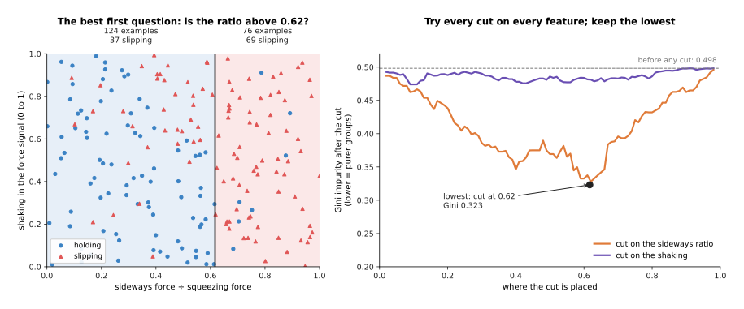
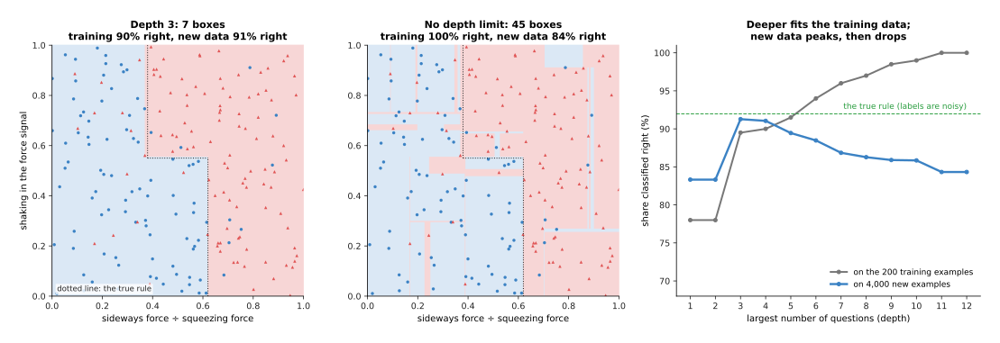
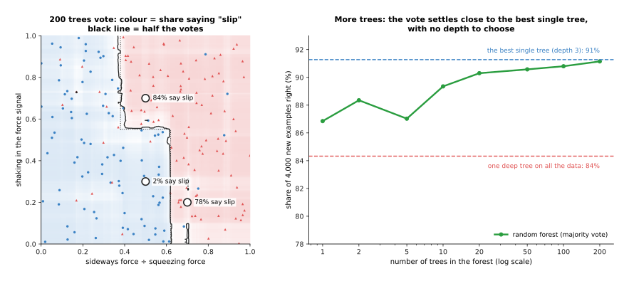
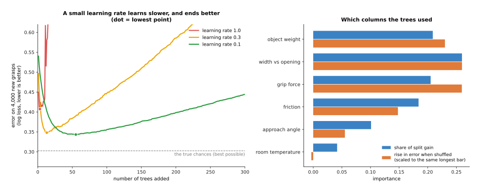

# Decision trees and forests

This page explains decision trees, and the two ways of joining many trees
together: random forests and gradient-boosted trees. It answers five questions.
How does one tree make a decision? How does it choose its questions? Why does a
deep tree go wrong on new data? How do many trees fix that? And where does a robot
arm use them?

It is for a reader who has read Book 6 chapter 1, in particular
[how a model learns](../../01_what-models-are/02_how-a-model-learns.md). You need
to know what an example, a label, a training set, a test set and overfitting are.
The [overview of this chapter](../01_overview.md) shows where trees sit among the
other classical methods.

Trees are the most used learned method for **tabular data**: data that fits in a
table, where each row is one example and each column is one measured number. On a
robot arm that means logged grasps, force readings, motor currents and
temperatures.

Every number on this page comes from a real run of the diagram script
`docs/diagrams/classical_ml_2.py`. The data is simulated from a made-up rule, so
that we know the true answer. The methods are real, written in NumPy.

## Contents

1. [The idea in one sentence](#1-the-idea-in-one-sentence)
2. [How one tree works](#2-how-one-tree-works)
   · [Choosing a question](#choosing-a-question)
   · [Depth, and overfitting](#depth-and-overfitting)
3. [Random forests: many trees vote](#3-random-forests-many-trees-vote)
4. [Gradient-boosted trees: each tree fixes the last one's mistakes](#4-gradient-boosted-trees-each-tree-fixes-the-last-ones-mistakes)
   · [Sample weights: the first way to boost](#sample-weights-the-first-way-to-boost)
   · [Fitting the remaining error](#fitting-the-remaining-error)
   · [The learning rate](#the-learning-rate)
5. [Feature importance: which columns mattered](#5-feature-importance-which-columns-mattered)
6. [How it is trained: what data, and how much](#6-how-it-is-trained-what-data-and-how-much)
7. [Where it is used on a robot arm](#7-where-it-is-used-on-a-robot-arm)
8. [What goes wrong](#8-what-goes-wrong)
9. [Libraries](#9-libraries)
10. [Why trees, and what they cost](#10-why-trees-and-what-they-cost)
11. [The written alternative](#11-the-written-alternative)
12. [Where to read next](#12-where-to-read-next)

---

## 1. The idea in one sentence

A **decision tree** reaches an answer by asking a short chain of yes-or-no
questions, each about one input number, and it learns which questions to ask, and
in what order, from examples.

Here is an everyday example. A doctor on the phone decides whether you need to
come in. "Is your temperature above 38 degrees? If yes, have you had it for more
than three days?" Each question looks at one thing. The answer to one question
decides which question comes next. After two or three questions, the doctor has
an answer. A decision tree works the same way. The difference is that nobody
writes the questions. The tree picks them by looking at many past cases.

A decision tree is not a **behaviour tree**. A behaviour tree is a hand-written
plan that decides what a robot does next. Book 5 explains it in
[behaviour trees](../../../05_programming-techniques/08_decisions-and-task-logic/02_most-used/02_behaviour-trees.md).
The two share only the word "tree".

---

## 2. How one tree works

The example on this page is a slip detector. A robot gripper holds an object. A
force sensor in each finger measures two forces: how hard the fingers squeeze,
and how hard the object pulls sideways along the finger pads. From these readings
the program computes two **features**. A feature is one input number, made from
the raw readings, that the model uses.

- The **sideways ratio** is the sideways force divided by the squeezing force. It
  runs from 0 to 1 here. When it gets near the friction of the surface, the
  object starts to slide.
- The **shaking** is how much the force signal shakes quickly, from 0 to 1. A
  slide makes the force shake before the object falls out.

Each example is one short moment of a grip. Its label says "slipping" or
"holding". The made-up true rule is: the object slips when the ratio is above
0.62, or when the ratio is above 0.38 and the shaking is above 0.55. The script
then flips 8% of the labels at random. Real labels are never perfect, and this
makes the problem fair. It has 200 examples to learn from, and 4,000 more to test
on.

### Choosing a question

A tree grows from the top. At the start, all 200 examples sit in one group. The
tree looks for one question that splits the group into two groups that are as
"pure" as possible. A pure group holds only one label.

To measure how mixed a group is, trees usually use the **Gini impurity**. For a
group with a share p of "slipping" examples, it is 2 × p × (1 − p). It is 0 when
the group is pure, and 0.5 when it is half and half. The 200 examples hold 106
slipping and 94 holding, so the Gini impurity at the top is 0.498.

For a split into two groups, the tree takes the Gini impurity of each group,
weights it by the group's size, and adds the two. Then it searches:

1. Take the first feature. Sort the examples by it.
2. Try a cut between every pair of neighbouring values. For each cut, compute the
   weighted Gini impurity of the two groups.
3. Do the same for every other feature.
4. Keep the cut with the lowest value. This becomes the question at this node.

The picture below shows this search for the first question.

The right half shows the result of every possible cut. Cuts on the shaking barely
help. The best one, at 0.09, only brings the value down to 0.474. Cuts on the
sideways ratio help much more. A cut at 0.2 gives 0.438, a cut at 0.5 gives
0.369, and the lowest is at 0.617, which gives 0.323. So the first question is
"Is the sideways ratio above 0.617?". The left group holds 124 examples, 37 of
them slipping, with a Gini impurity of 0.419. The right group holds 76 examples,
69 of them slipping, with a Gini impurity of 0.167.

The tree then repeats the same search inside each group, and again inside each of
their groups. Each group that is not split any further is called a **leaf**. A
leaf's answer is the most common label of the training examples in it. Its share
of "slipping" examples can serve as a rough chance.

The search is **greedy**. It picks the best question for this step only, without
looking ahead. This is fast, but it can miss a pair of questions that would only
help together.

### Depth, and overfitting

The **depth** of a tree is the largest number of questions on any path from the
top to a leaf. If you let it, a tree keeps splitting until every leaf is pure. The
picture below compares a tree of depth 3 with a tree that has no limit.

The tree of depth 3 found these questions. Read them from the top.

- Is the sideways ratio at most 0.617?
  - Yes: is the shaking at most 0.553?
    - Yes: say "holding". (Its third question, on the ratio, only makes these
      groups a little purer.)
    - No: is the ratio at most 0.369? If yes, say "holding". If no, say
      "slipping".
  - No: say "slipping". (Its extra questions split off one single example near
    0.684.)

That is close to the true rule, with cuts at 0.617, 0.553 and 0.369, against the
true 0.62, 0.55 and 0.38. The one-example box is the first sign of the problem
that deeper trees have.

The tree with no limit grew to depth 11, with 45 leaves. It gets every training
example right. It does so by drawing thin boxes around each flipped label. On new
data it does worse, 84% right against 91% for depth 3.

The right half of the picture shows the pattern. Read the grey line as the score
on the training examples and the blue line as the score on new examples. The
table below gives some of the same numbers.

| Depth | 1 | 2 | 3 | 4 | 6 | 8 | 11 |
| --- | --- | --- | --- | --- | --- | --- | --- |
| Right on the 200 training examples | 78.0% | 78.0% | 89.5% | 90.0% | 94.0% | 97.0% | 100% |
| Right on 4,000 new examples | 83.3% | 83.3% | 91.3% | 91.0% | 88.5% | 86.3% | 84.3% |

Two things stand out. First, depth 2 is no better than depth 1. Its second
question makes the groups purer, but it does not change any group's answer. Only
the third question does. This is the greedy search at work. Second, the score on
new data peaks at depth 3 and then falls, while the training score keeps rising.
That is overfitting. The true rule itself only gets 92% of the new examples
right, because 8% of the labels are flipped. So the depth-3 tree is almost as
good as possible.

The usual limits are a largest depth, or a smallest number of examples per leaf.
The right setting is found by trying several on examples the tree did not train
on. One tree is simple and easy to read. But it is brittle. A few different
training examples can change its first question, and then everything below it
changes too.

---

## 3. Random forests: many trees vote

A **random forest** grows many deep trees, each on a slightly different version of
the data, and lets them vote. The steps are:

1. Draw a new training set of the same size from the original, by picking
   examples at random **with replacement**. Some examples are picked twice or
   more, and some are left out. This is called a **bootstrap sample**.
2. Grow a tree on that sample. At each node, let the tree look at only a random
   few of the features, not all of them. This makes the trees differ more from
   each other.
3. Repeat, for 100 to 500 trees.
4. To answer, ask every tree. Each tree gives one vote. The answer is the label
   with the most votes. The share of votes serves as a rough chance.

Each tree is overfitted in its own way, because it saw different examples. Their
mistakes point in different directions, and the vote cancels much of them out.
The parts they agree on are the parts that come from the true rule.

The script grew 200 trees. Each tree looks at one of the two features at each
node, and grows until its leaves hold 3 examples or fewer.

The left half colours each point of the plane by the share of trees that say
"slip". The black line is where half of them do. It follows the true rule, the
dotted line, more smoothly than any single deep tree. The three circles show some
votes. At a ratio of 0.5 and shaking of 0.7, 84% of trees say slip. At a ratio of
0.5 and shaking of 0.3, only 2% do. At a ratio of 0.7 and shaking of 0.2, 78% do,
which is right but less sure, because a few flipped labels sit there.

The right half shows the score on new data against the number of trees. One tree
from the forest gets 87% right. The 200 single trees score 81% on average, and
anything from 65% to 89%. Their vote gets 91.1% right. That is about as good as
the best single tree, 91.3%, and nobody had to choose its depth. Adding more
trees never makes a forest overfit more. It only makes the vote steadier, and
costs more time.

The vote is an equal vote: every tree counts the same. The next method gives
different trees different weights.

---

## 4. Gradient-boosted trees: each tree fixes the last one's mistakes

A forest grows its trees side by side, each on its own. **Boosting** grows them
one after another. Each new tree looks at what the trees so far still get wrong,
and tries to fix that. The trees in boosting are small, often with a depth of 2
to 6.

### Sample weights: the first way to boost

The first boosting method, **AdaBoost**, short for "adaptive boosting", uses
**sample weights**. A sample weight is a number attached to each training example
that says how much it counts. A tree that gets a heavy example wrong pays more
than one that gets a light example wrong. The Gini search from section 2 simply
counts weights instead of examples.

1. Give every example the same weight. With 200 examples, each weight is 1/200,
   or 0.005.
2. Grow a very small tree, often with one question. A tree with one question is
   called a **stump**.
3. Measure its weighted error: the total weight of the examples it gets wrong.
4. Give the stump a **say**, a number that is large when its error is small.
5. Raise the weight of every example it got wrong, and lower the weight of every
   example it got right. Then scale all weights so they add up to 1.
6. Go back to step 2.

At the end, every stump votes, and each vote counts as much as its say. This is a
**weighted vote**.

On the slip data, the first stump asked "Is the ratio above 0.617?" and got 44 of
200 examples wrong, a weighted error of 0.22. Its say was 0.63. The weight of each
example it got wrong rose from 0.005 to 0.0114. The weight of each example it got
right fell from 0.005 to 0.0032. After this step the 44 wrong examples hold half
the total weight. This always happens in AdaBoost. So the second stump cannot
ignore them. It chose a different question, "Is the ratio above 0.298?".

Sample weights are useful outside boosting too. Every library on this page lets
you pass a weight per example when you train. A robot project uses this to make
rare failures count more, or to make recent data count more than old data.

### Fitting the remaining error

**Gradient boosting** is the method most used today. It does the same job in a
more general way. Instead of changing weights, each new tree learns the error
that is left.

The example here is predicting grasp success. Each row is one logged grasp, with
six columns: the object's weight in kilograms, its width as a share of the
gripper's opening, the grip force in newtons, the friction of the surface, the
approach angle away from straight down in degrees, and the room temperature. The
label is "held" or "dropped". The made-up true rule depends on the holding force
compared with the weight, on objects near the gripper's full opening, and on
steep approach angles. The room temperature does not matter at all. The script
has 600 grasps to learn from, of which 74% held, and 4,000 to test on.

For a yes-or-no label, the model keeps a running **score** for each example.
The score becomes a chance between 0 and 1 by the same squashing step that
[logistic regression](01_linear-and-logistic-regression.md) uses. The steps are:

1. Start every score at the same value: the one that gives the overall success
   rate, 74%.
2. For each example, work out the gap between its label (1 for held, 0 for
   dropped) and its current chance.
3. Grow a small tree that predicts those gaps from the six columns.
4. Add a small share of that tree's answer to each score.
5. Go back to step 2.

The name comes from step 2. The gap is the **gradient** of the error measure,
the direction in which the score should move. Chapter 1 explained gradients in
[how a model learns](../../01_what-models-are/02_how-a-model-learns.md).

### The learning rate

The share in step 4 is the **learning rate**. With a learning rate of 1.0, each
tree tries to fix all of the remaining error at once. With 0.1, it fixes a tenth
of it, and leaves the rest to later trees.

To score the model, the script uses the **log loss**. It is an error measure for
chances. A confident right answer costs almost nothing. A confident wrong answer
costs a lot. Lower is better. A flat guess of 74% for every grasp scores 0.567.
The true chances, which no model can beat, score 0.302.

The left half shows the error on new grasps as trees are added. Each tree has a
depth of 3. The table below gives the same results. Read each row as one learning
rate.

| Learning rate | Lowest log loss | Reached after | Log loss after 300 trees |
| --- | --- | --- | --- |
| 1.0 | 0.407 | 3 trees | 1.359 |
| 0.3 | 0.348 | 13 trees | 0.739 |
| 0.1 | 0.343 | 55 trees | 0.444 |

A large learning rate learns fast and then overfits fast. Its best point is poor,
and it gets much worse with more trees. A small rate learns slowly, reaches a
better best point, and stays near it for longer. At its best, the rate-0.1 model
gets 84.8% of new grasps right. The true chances get 85.6% right.

Unlike a forest, boosting does overfit if you add too many trees. So people keep
some examples aside, watch the error on them as trees are added, and stop when it
stops falling. This is called **early stopping**. A learning rate of 0.05 to 0.1
with early stopping is a common start.

---

## 5. Feature importance: which columns mattered

A tree model can tell you which columns it relied on. This is called **feature
importance**. There are two common ways to measure it.

The first way adds up how much each column's questions lowered the error, over
every question in every tree. This is the **split gain**. It is free, because the
trees computed it while growing.

The second way is **permutation importance**. Take the test examples, shuffle one
column so that its values land on the wrong rows, and measure how much worse the
model gets. A column the model needs makes it much worse. A column it does not
need changes nothing.

The right half of the picture above shows both for the rate-0.1 model. Read each
pair of bars as one column. The width as a share of the opening, the grip force
and the object's weight matter most. Shuffling each of them raises the log loss by
about 0.27 to 0.31. The friction matters a little less, and the approach angle
less again.

The room temperature is the lesson. It had no effect in the true rule. Yet it got
4% of the split gain, because a tree can always find some cut on a noisy column
that helps a little on the training data. Shuffling it did nothing: the log loss
changed by −0.004. So the split gain can give credit to a useless column, and
permutation importance on test data is the more honest check. Neither one says
that a column *causes* success. They say only what this model used.

---

## 6. How it is trained: what data, and how much

A tree model needs a table. Each row is one example. Each column is one number
that the robot can measure at the moment it must decide. The label is the answer
you want: slip or hold, success or failure, or a number.

Trees need little preparation of the data. Columns can have very different units,
such as kilograms next to degrees, because each question looks at one column on
its own. You do not need to scale the columns. Some libraries also handle missing
values and columns of categories, such as the kind of gripper.

How much data depends on how many columns and how complicated the true rule is. As
a rough guide:

- A few hundred rows are enough for a useful model with 5 to 10 columns, as in
  this page's examples.
- Thousands of rows let boosted trees find finer patterns.
- With under about 100 rows, a single shallow tree or
  [logistic regression](01_linear-and-logistic-regression.md) is safer.

Training takes seconds on an ordinary computer for tables of this size. Keep
separate test examples, and if the rows come from runs over time, test on a later
run than you trained on. Otherwise you test on examples very like the ones the
model has already seen, and the score looks better than it is.

---

## 7. Where it is used on a robot arm

**Classifying contact and slip from force features.** This page's example. A
window of force readings becomes a few numbers, such as the sideways ratio, the
shaking, and how fast the force is changing. A small tree or forest says "slip" or
"hold" in well under a millisecond. The page
[force and slip models](../../09_touch-and-body-models/02_most-used/01_force-and-slip-models.md)
covers the problem, and the networks used when the input is a raw signal.

**Predicting grasp success from simple features.** A robot logs every grasp: the
object's size and weight, the grip force, the approach angle, and whether it held.
Boosted trees learn which grasps tend to fail. The robot can then raise the force
or pick another grasp before it tries.

**Ranking candidate grasps.** A grasp planner proposes several grasps. The model
gives each one a chance of success, and the robot tries the highest first. The
script ranked six grasps on the same mug (0.35 kg, friction 0.5) with the
rate-0.1 model from section 4. The table below lists them in the model's order.
Read each row across: what changes in that grasp, the model's chance, and the true
chance from the made-up rule.

| Rank | The grasp | Model's chance | True chance |
| --- | --- | --- | --- |
| 1 | narrow grip (0.40 of the opening), 35 N, 15° | 0.98 | 1.00 |
| 2 | 0.55 of the opening, 25 N, 5° | 0.98 | 0.99 |
| 3 | 0.55 of the opening, 25 N, steep 40° | 0.94 | 0.97 |
| 4 | 0.55 of the opening, weak 12 N, 5° | 0.88 | 0.96 |
| 5 | 0.55 of the opening, very weak 6 N, 5° | 0.47 | 0.80 |
| 6 | near full opening (0.95), 25 N, 5° | 0.03 | 0.72 |

The order is exactly the true order. The chances at the bottom are too low,
because few training grasps look like these ones. For ranking, the order is what
matters. The page
[grasp quality models](../../05_grasp-models/03_also-used/02_grasp-quality-models.md)
covers networks that score grasps straight from a picture.

**Spotting faults in logs.** Motor currents, temperatures and tracking errors,
labelled with past faults, train a model that flags a joint going wrong. The page
[collision and failure detection](../../09_touch-and-body-models/02_most-used/02_collision-and-failure-detection.md)
covers this kind of detector.

**Choosing between a few actions.** From a few numbers about the scene, a tree
can pick which of several hand-written grasp or push routines to run. A small
tree can be printed and read, so people can check it.

---

## 8. What goes wrong

Each problem below has a usual fix.

A single deep tree overfits. It gets every training example right and new ones
wrong, as section 2 showed. The fix is a depth limit or a smallest leaf size,
chosen on held-out data, or a forest instead of one tree.

Boosting with too many trees overfits. The fix is a small learning rate with
early stopping, as in section 4.

Trees cannot answer beyond their data. Each leaf gives an answer it saw in
training. For a number to predict, a tree never goes above the largest label or
below the smallest, so its prediction goes flat beyond the last example. The fix is to collect
data over the whole range the robot will meet, or to use a method that follows a
trend, such as [linear regression](01_linear-and-logistic-regression.md).

Trees draw boundaries as staircases. Each question cuts along one column, so a
diagonal boundary, such as "slip when sideways force is more than half the
squeezing force", becomes many small steps. The fix is to give the tree the
right feature, here the ratio, instead of the two raw forces. Choosing good
features matters more for trees than any setting.

Rare labels get ignored. If 2% of grasps fail, a model that always says "held" is
98% right. The fix is to give the rare examples larger sample weights, as in
section 4, and to judge the model by how many failures it catches, not by the
share it gets right.

The chances are rough. A forest's share of votes and a boosted model's chance are
often too sure or not sure enough. If the robot acts on the number itself, check
it against real outcomes first. The page
[uncertainty and confidence](../../10_making-models-work-on-an-arm/03_also-used/01_uncertainty-and-confidence.md)
explains how.

Importance is misread. Section 5 showed a useless column getting credit. Use
permutation importance on test data, and do not read it as cause and effect.

---

## 9. Libraries

The table below lists real libraries for trees. Read each row as one library: the
classes it provides, and when to use it.

| Library | What it provides | When to use it |
| --- | --- | --- |
| scikit-learn | `DecisionTreeClassifier` and `DecisionTreeRegressor` in `sklearn.tree`; `RandomForestClassifier`, `AdaBoostClassifier`, `GradientBoostingClassifier` and `HistGradientBoostingClassifier` in `sklearn.ensemble`; `permutation_importance` in `sklearn.inspection` | the place to start; one interface for every method on this page |
| XGBoost | `xgboost.XGBClassifier` and `xgboost.XGBRegressor` | fast, widely used boosted trees; can train on a graphics card |
| LightGBM | `lightgbm.LGBMClassifier` and `lightgbm.LGBMRegressor` | very fast on large tables |
| CatBoost | `catboost.CatBoostClassifier` | handles columns of categories with little preparation |

All of them take a `sample_weight` argument in `fit`, which is how you pass the
per-example weights of section 4. scikit-learn's `export_text` in `sklearn.tree`
prints a single tree as questions, much like the list in section 2. XGBoost and
LightGBM also have C interfaces, so a trained model can run inside a C++ robot
program.

---

## 10. Why trees, and what they cost

This section answers the four questions: what trees are, what they do for you, why
them rather than the obvious alternative, and what they cost.

Trees are models that answer with a chain of one-column questions. A forest or a
boosted model adds up hundreds of them. They turn a table of logged numbers into a
yes-or-no answer, a chance or a predicted number, with little tuning and little
preparation of the data.

The obvious alternative is a small neural network, since the rest of this book
uses networks. On a table of a few to a few dozen measured numbers, boosted trees
usually match or beat a network. They need no scaling of the columns. They have
fewer settings that matter. They train in seconds without a graphics card. And
you can read one small tree, or at least ask a forest which columns it used. A
network wins when the input is raw, such as a picture, a point cloud or a long
force signal. Trees need someone to turn those into a short list of meaningful
numbers first.

The second alternative is [logistic regression](01_linear-and-logistic-regression.md),
which weights and adds the columns. It is simpler, it follows trends beyond the
data, and its weights are easy to read. Trees win when columns matter only in some
cases, for example when the approach angle matters only above 30 degrees. A
weighted sum cannot draw that without help.

What trees cost:

- They need good features. The ratio, not the two raw forces, made this page's
  slip tree work.
- They cannot answer beyond the range of their training data.
- A forest or boosted model of hundreds of trees is no longer easy to read.
- Their chances need checking before the robot relies on the numbers.
- Boosting needs early stopping, and every tree model needs its settings checked
  on held-out data.

---

## 11. The written alternative

Book 5 does the same jobs with hand-written rules. For slip, the rule comes from
physics: an object slides when the sideways force is more than the friction times
the squeezing force. Book 5's
[sensor streams](../../../05_programming-techniques/04_fitting-and-estimation/02_most-used/04_sensor-streams.md)
shows how to smooth the force readings, take how fast they change, and turn them
into a flag with thresholds that do not flicker. For contact, the guarded moves in
[impedance and force control](../../../05_programming-techniques/07_control-and-motion/03_also-used/01_impedance-and-force-control.md)
stop the arm when the measured force passes a set limit.

A hand-written rule is itself a tiny decision tree. The difference is who writes
the questions. The written rule wins when the physics is known and steady, for
example rigid objects with a known friction. It needs no data and is easy to
check. The learned tree wins when the thresholds depend on things you cannot
measure well, such as wet or dusty surfaces, or when many columns interact. A
common middle way is to train a small tree, print it, and then check or adjust
its questions by hand.

---

## 12. Where to read next

- [Linear and logistic regression](01_linear-and-logistic-regression.md) is the
  simpler method to try first, and the source of the squashing step used in
  section 4.
- [Gaussian processes and Bayesian optimisation](03_gaussian-processes-and-bayesian-optimisation.md)
  gives an answer with an error bar, which trees do not.
- [Nearest neighbours and locally weighted regression](04_nearest-neighbours-and-locally-weighted-regression.md)
  answers by looking up similar past examples.
- [Support vector machines](../03_also-used/04_support-vector-machines.md) were
  the common classifier for small tables before trees took over.
- [Force and slip models](../../09_touch-and-body-models/02_most-used/01_force-and-slip-models.md)
  covers slip detection with networks on raw signals.
- [Evaluation and failure](../../10_making-models-work-on-an-arm/02_most-used/03_evaluation-and-failure.md)
  explains how to test a model fairly before the robot relies on it.
