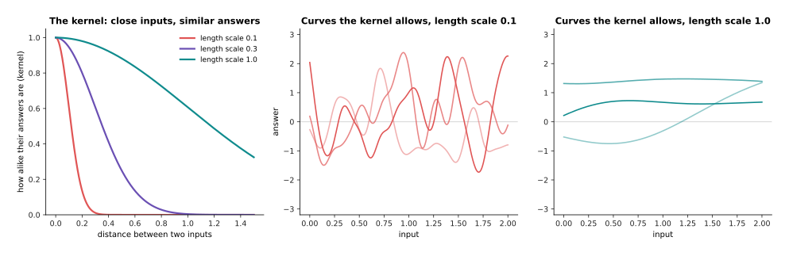
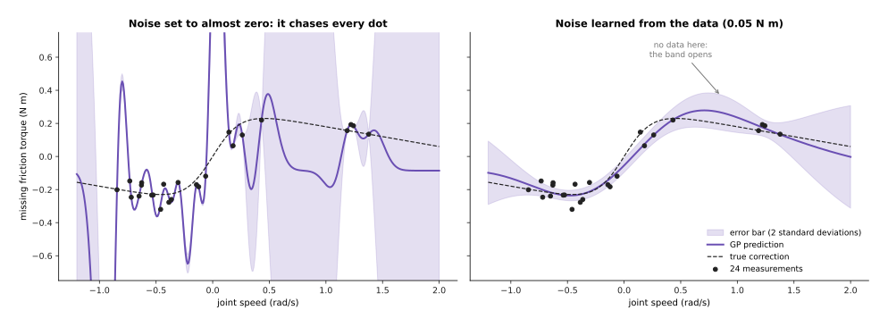
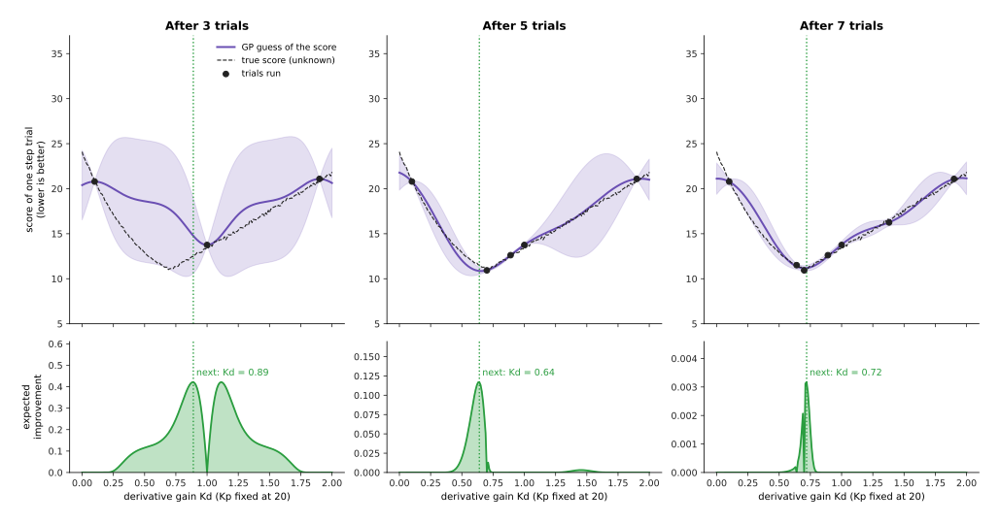
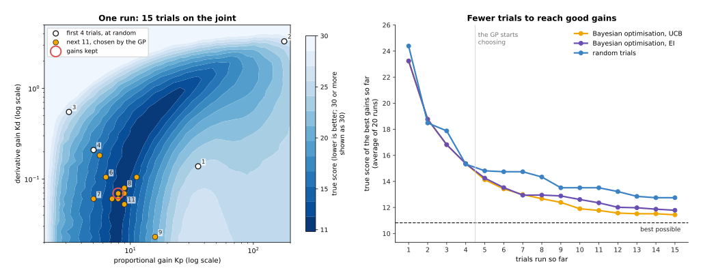

# Gaussian processes and Bayesian optimisation

This page explains two methods that belong together. A **Gaussian process** learns
a smooth curve from a few examples, and it gives an error bar with every answer.
**Bayesian optimisation** uses a Gaussian process to decide which setting to try
next, when every try is slow or costly, such as a test run on a real arm.

It answers five questions. What does a Gaussian process predict, and how? What
decides how smooth its curve is, and how much it trusts each measurement? Why does
it get slow with many examples? How does Bayesian optimisation choose the next
trial? And where does a robot arm use the two, for example to tune a controller in
15 trials instead of 100?

It is for a reader who has read the first chapter of this book, especially
[how a model learns](../../01_what-models-are/02_how-a-model-learns.md). You need
to know what an example, a label and overfitting are. The
[chapter overview](../01_overview.md#5-when-a-small-dataset-makes-them-the-better-choice)
compares a Gaussian process with the other methods on one small dataset.

Every number on this page comes from a real run of the diagram script
`docs/diagrams/classical_ml_3.py`. The data is simulated, so we know the true
answer exactly. The methods are real, written in NumPy.

> Before this page, it helps to have read [PID control](../../../05_programming-techniques/07_control-and-motion/02_most-used/01_pid-control.md) in Book 5. The Bayesian optimisation examples tune its gains, on the same simulated joint.

## Contents

1. [The idea in one sentence](#1-the-idea-in-one-sentence)
2. [How a Gaussian process works](#2-how-a-gaussian-process-works)
   · [The kernel: how alike are two inputs](#the-kernel-how-alike-are-two-inputs)
   · [Noise: how much to trust each measurement](#noise-how-much-to-trust-each-measurement)
   · [A worked example: a correction to the friction model](#a-worked-example-a-correction-to-the-friction-model)
   · [Why it slows down with many points](#why-it-slows-down-with-many-points)
3. [Bayesian optimisation: choosing the next trial](#3-bayesian-optimisation-choosing-the-next-trial)
   · [Tuning one gain, step by step](#tuning-one-gain-step-by-step)
   · [Two ways to choose: expected improvement and upper confidence bound](#two-ways-to-choose-expected-improvement-and-upper-confidence-bound)
   · [Tuning two gains in 15 trials](#tuning-two-gains-in-15-trials)
4. [How it is trained, and how much data it needs](#4-how-it-is-trained-and-how-much-data-it-needs)
5. [Where it is used on a robot arm](#5-where-it-is-used-on-a-robot-arm)
6. [What goes wrong](#6-what-goes-wrong)
7. [Libraries](#7-libraries)
8. [Why this, and what it costs](#8-why-this-and-what-it-costs)
9. [The written alternative](#9-the-written-alternative)
10. [Where to read next](#10-where-to-read-next)

---

## 1. The idea in one sentence

A Gaussian process predicts a number together with an error bar, by assuming that
similar inputs give similar answers, and Bayesian optimisation uses those error
bars to pick each next trial where the answer looks good or is still unknown.

Here is an everyday example. You are adjusting a shower with a single knob. You
try the middle: too cold. You try far to the right: too hot. You do not now try
every position from left to right. You guess that the right temperature lies
between your two tries, closer to the hot one, and you try there next. You also
know how sure you are: very sure near the positions you tried, less sure in
between. A Gaussian process is that guess with its sureness, written as numbers.
Bayesian optimisation is the habit of picking the next knob position from that
guess.

---

## 2. How a Gaussian process works

A **Gaussian process (GP)** takes a set of examples: inputs, and a measured label
for each. For any new input, it gives two numbers. The first is its best guess of
the label. The second is a **standard deviation**, a typical size of how wrong
that guess may be. This page draws the **error bar** as two standard deviations
each side of the guess. If the model is right about itself, the truth falls inside
that band about 95 times in 100.

The name comes from the **Gaussian**, or **normal**, distribution, the bell-shaped
spread of values. A GP treats the unknown curve as a random curve whose values are
spread in that bell shape. It then keeps only the curves that pass close to the
examples. Their average is the guess. How much they disagree is the error bar.

You do not need to follow the maths to use a GP. You need to know the two things
you choose: the kernel and the noise.

### The kernel: how alike are two inputs

The **kernel** is a formula that says how alike the answers at two inputs should
be, given how far apart the inputs are. It gives 1 for two identical inputs, and
falls towards 0 as the inputs move apart. The most used kernel falls in a bell
shape, and it has two settings:

- the **length scale**: how far apart two inputs can be and still have similar
  answers;
- the **signal size**: how far the curve typically moves away from its average.

The left panel below shows this kernel with three length scales. With a length
scale of 0.3, two inputs 0.1 apart score 0.95: nearly the same answer. Two inputs
0.3 apart score 0.61. Two inputs 1.0 apart score 0.00: knowing one tells you
nothing about the other.

The two right panels show what the length scale means for the curve. Each panel
draws three random curves that the kernel allows, before the GP has seen any
example. A length scale of 0.1 allows curves that wiggle quickly. A length scale
of 1.0 allows only slow, gentle curves. Choosing the kernel is choosing what kind
of curve you expect.

To predict at a new input, the GP scores how alike that input is to each example,
using the kernel. It then takes a weighted average of the examples' labels, with
the more alike examples counting more. The error bar comes from the same scores.
If no example scores highly, the guess rests on little, and the band is wide.

### Noise: how much to trust each measurement

A real measurement is never exact. The GP has a third setting, the **noise**: the
typical size of the error in each measured label. If the noise is small, the GP
believes each example and bends its curve to pass through all of them. If the
noise is larger, it lets the curve pass between examples that disagree.

You rarely set these three numbers by hand. The usual way is to try many
combinations and keep the one under which the measured examples are most likely.
This measure is called the **marginal likelihood**. It prefers a curve that fits
the examples, but it also punishes a curve that is more wiggly than the examples
need. So it guards against overfitting by itself, without a separate test set.

### A worked example: a correction to the friction model

Book 5's PID page uses a joint whose friction is a simple rule: 0.5 N m of torque
for each radian per second of speed. A real joint also has friction that this rule
misses. It is strongest just after the joint starts to move, and it changes sign
with the direction. The robot measures the missing torque at 24 speeds and wants a
curve through them. The input is the joint speed in radians per second (rad/s).
The label is the missing torque in newton metres (N m). Each measurement has noise
of 0.04 N m.

The measurements cover speeds from −1.0 to 0.45 rad/s, and a few more between 1.15
and 1.4 rad/s. There is a gap between them, and nothing beyond.

The left panel forces the noise to 0.001 N m, far below the true 0.04. The GP must
then pass through every dot. To do that, it chose a short length scale of 0.1 rad/s,
and the curve swings wildly between the dots. Its average error against the true
curve, over the measured range, is 0.804 N m. That is twenty times the noise.

The right panel lets the marginal likelihood choose all three settings. It chose a
length scale of 0.6 rad/s, a signal size of 0.2 N m and a noise of 0.05 N m, close
to the true 0.04. The average error over the measured range is 0.042 N m.

The table below reads the right-hand GP at four speeds. Each row gives the speed,
where it lies, the GP's answer with its error bar, and the truth.

| Speed | Where it is | GP answer | True value |
| --- | --- | --- | --- |
| 0.0 rad/s | among the examples | −0.054 ± 0.042 N m | 0.000 N m |
| 0.8 rad/s | in the gap | 0.273 ± 0.108 N m | 0.203 N m |
| 1.3 rad/s | among the examples | 0.154 ± 0.053 N m | 0.144 N m |
| 1.9 rad/s | beyond all examples | 0.015 ± 0.278 N m | 0.072 N m |

The band is narrow among the examples and wide in the gap and beyond. At 1.9 rad/s
the GP says, in effect, "I do not know": its band covers −0.26 to 0.29 N m. A
controller can use that. It can add the learned torque only where the band is
narrow.

The first row shows a real weakness. At 0.0 rad/s the truth lies just outside
the band. The true friction changes sharply near zero speed, and the GP chose one
length scale for the whole curve. A length scale of 0.6 is right for the gentle
parts and too long for the sharp part. So the band is too confident exactly where
the curve bends fastest. [Section 6](#6-what-goes-wrong) returns to this.

### Why it slows down with many points

A GP keeps every example, and it compares each example with every other one. With
n examples it builds a table of n × n kernel scores and solves a set of equations
with it. The work to solve it grows with the cube of n: about n³ / 3 multiply-adds.
The script prints the numbers:

- 1,000 examples: about 3.3 × 10⁸ multiply-adds, a fraction of a second on a
  laptop. The table takes 8 megabytes (MB).
- 10,000 examples: about 3.3 × 10¹¹, a thousand times the work. The table takes
  800 MB.
- 100,000 examples: a million times the work of 1,000, and a table of 80,000 MB,
  more memory than most computers have.

So a plain GP suits hundreds to a few thousand examples. That is often all a robot
has, because each example is a real measurement. For more, libraries use
approximations. The most common keeps a few hundred **inducing points**, a small
set of stand-in examples, and compares everything with those instead.

---

## 3. Bayesian optimisation: choosing the next trial

**Bayesian optimisation** finds the best setting of something when each try is
slow or costly. It keeps a GP of the score against the setting. It uses the GP's
guess and error bar to pick the next setting to try. It runs the trial, adds the
result to the GP, and repeats.

On a robot, a "try" is often a real run of the arm: a step move to test controller
gains, or ten grasps to test an approach. Each run takes seconds to minutes and
wears the hardware. So the aim is to find good settings in tens of trials, not
thousands.

### Tuning one gain, step by step

Here the joint from Book 5's PID page is told to move from 0 to 0.5 radians. The
proportional gain Kp is fixed at 20, and the integral gain Ki at 5. The task is to
find the best derivative gain Kd between 0 and 2. The
[PID page](../../../05_programming-techniques/07_control-and-motion/02_most-used/01_pid-control.md#tuning-the-three-gains)
explains the three gains.

Each trial runs the move for one second and gives one **score**, where lower is
better. The score adds three things: the average distance from the target, how far
the joint overshot the target, and how much the motor torque jittered from one
tick to the next. Too little Kd overshoots. Too much Kd makes the torque jitter,
because Kd multiplies the noise in the angle sensor. Each trial also has a little
chance in it: the sensor noise differs, and the load changes by a few percent from
run to run, as it does on a real arm.

A sweep of 201 settings shows the answer that the method does not know: the best
Kd is 0.69, with a score of 11.02. Kd = 0 scores 24.09, and Kd = 2 scores 21.85.

The loop works like this.

1. Run a few trials spread over the range. Here: Kd = 0.10, 1.00 and 1.90.
2. Fit a GP to the scores so far.
3. For every Kd in the range, work out how promising a trial there would be. This
   number is called the **acquisition function**.
4. Run the next trial where the acquisition is largest.
5. Go back to step 2, until the trial budget is spent.
6. Keep the best setting found.

The top row shows the GP after 3, 5 and 7 trials. The bottom row shows the
acquisition, and the dotted line marks the next trial.

- After 3 trials, the best score so far is 13.75, at Kd = 1.00. The GP knows
  little between the trials, so the band is wide. The acquisition is high on both
  sides of Kd = 1.00. It picks Kd = 0.89.
- The fourth trial, at 0.89, scores 12.62. The GP now leans left, and picks 0.70.
  That trial scores 10.93.
- After 5 trials, the GP has found the dip. It picks 0.64, just beside the best.
- After 6 trials, it picks 1.38. That area was still unsure, and the GP checks
  that nothing better hides there.
- After 7 trials it picks 0.72. After 8 trials, the best measured score is 10.77,
  at Kd = 0.72.

Eight trials found a Kd within 0.03 of the best one on a 201-point sweep. The best
measured score, 10.77, is even lower than the swept best of 11.02. That is not a
better gain. It is one lucky trial: the chance in each run happened to help. This
is why the GP has a noise setting, and why a careful user re-runs the kept setting
a few times before trusting its score.

### Two ways to choose: expected improvement and upper confidence bound

The acquisition function turns the GP's guess and error bar into one number per
setting. Two are used most.

**Expected improvement (EI)** asks: if I try here, by how much will I beat my best
score so far, on average? A setting scores high if the guess is already better
than the best so far. It also scores high if the band is wide, because a wide band
leaves room for a much better result. A setting whose whole band is worse than the
best so far scores almost zero. That is why the bottom row above is zero at both
ends: the GP is sure those ends are worse.

**Upper confidence bound (UCB)** asks a simpler question: how good could it be
here, if I am optimistic? It takes the guess and moves it by a set number of error
bars in the good direction. The name comes from problems where a higher score is
better. For a score where lower is better, as here, it is the guess minus the
error bar. A setting wins if it looks good, or if it is so unsure that it might be
good. The number of error bars sets the balance. More error bars send trials to
unexplored places. Fewer send them close to the best so far.

The balance between the two aims has a name: **exploration**, trying where the
model is unsure, against **exploitation**, trying where the model is already
hopeful. Both acquisition functions weigh them. In the one-gain run, they agreed
closely. After 3 trials, expected improvement picked Kd = 0.89, and the bound with
two error bars picked 0.83.

### Tuning two gains in 15 trials

Most controllers have more than one gain. Here Kp and Kd are tuned together. Kp
may lie between 2 and 200, and Kd between 0.02 and 5. Both are searched on a
**log scale**, where each step multiplies the gain by the same factor. People
often do not know a gain's size to within a factor of ten, so a log scale spreads
the trials fairly.

A sweep of 1,681 settings shows the landscape. The best is Kp = 14.2 and
Kd = 0.42, with a score of 10.83. Only 3.2% of the settings score within 1 of
that. The worst scores 76.1.

The script ran three methods, each with 15 trials, 20 times over with different
chance. Both Bayesian optimisation runs start with 4 random trials, then let the
GP choose the other 11. The UCB run uses one error bar. The third method runs all
15 trials at random settings.

The left panel shows a typical run: the one whose result is the middle of the 20.
Darker blue is a better score. The first 4 trials, at random, land in poor places.
From trial 5 on, the GP moves into the dark valley and stays there. It keeps
Kp = 8.0 and Kd = 0.07, whose true score is 11.39. That is not the sweep's best
setting, but the valley is long, and settings along it score nearly the same.

The right panel shows the average over 20 runs. The score shown is the true score
of the gains each method would keep at that point. The table below gives the
result after all 15 trials. Read it across: the method, its average, and its worst
of the 20 runs. The best possible is 10.83.

| Method | Average after 15 trials | Worst of 20 runs |
| --- | --- | --- |
| Bayesian optimisation, UCB | 11.44 | 12.40 |
| Bayesian optimisation, EI | 11.78 | 18.22 |
| Random trials | 12.75 | 15.92 |

Bayesian optimisation with UCB reached 12.67 after 8 trials. Random trials needed
all 15 to reach 12.75. So on this problem it saved about half the trials. On a
real arm, where each trial takes a minute and a person must watch, that matters.

Expected improvement did well on average, but one of its 20 runs ended at 18.22.
That run never found the valley in its 15 trials. No acquisition function is best on every problem, and with 15 trials one
unlucky run can happen. A common fix is to run the kept setting a few more times,
and to compare it with the hand-tuned gains before accepting it.

---

## 4. How it is trained, and how much data it needs

A GP needs a table of examples: an input, which may be several numbers, and one
measured label for each. Training means choosing the kernel's settings and the
noise, by the marginal likelihood. After that, the examples themselves are the
model. Adding an example means refitting, which is quick while the examples number
in the hundreds.

A GP works well from very few examples. The friction curve above used 24. The
one-gain tuning used 8. With 2 to 5 inputs, a few tens of examples often give a
useful curve. The
[chapter overview](../01_overview.md#5-when-a-small-dataset-makes-them-the-better-choice)
showed a GP beating a small neural network with 10 and 20 examples.

It works less well with many inputs. Each input needs its own length scale, and
the space to fill grows fast. Bayesian optimisation is usually used with up to
about 10 or 20 settings. Beyond that, the GP cannot learn the landscape from a few
tens of trials.

Before fitting, scale each input to a similar range, for example 0 to 1, and
subtract the average from the labels. In the two-gain example, the script also
takes the logarithm of the PID score, because a few very bad settings, with scores up to 76, would otherwise
squash the differences between the good ones.

---

## 5. Where it is used on a robot arm

**Tuning controller gains on the real arm.** This page's main example. A PID loop
or an [impedance controller](../../../05_programming-techniques/07_control-and-motion/03_also-used/01_impedance-and-force-control.md#choosing-the-damping)
has gains that a model gets roughly right and the real arm gets exactly right.
Bayesian optimisation runs a short test move, scores it, and picks the next gains,
often reaching good gains in 15 to 30 trials. For impedance control, the settings
are the stiffness and the damping, and the score might add the force overshoot on
contact and the time to settle.

**Tuning grasp approach settings.** A pick routine has settings that no model
predicts well: how far above the object to pause, how fast to descend, how hard to
close, how long to wait before lifting. Each trial is a batch of, say, ten grasps,
scored by how many held. Bayesian optimisation picks the next batch's settings.
The GP's noise setting matters here, because ten grasps give a noisy success rate.

**Learning a small correction to the arm's dynamics.** The worked example above.
Book 5's
[arm dynamics](../../../05_programming-techniques/07_control-and-motion/02_most-used/03_arm-dynamics.md)
gives the torque each joint should need. A real arm needs a little more or less,
because of friction, cables and wear. A GP learns the difference from logged
motion. The controller adds the learned torque as feed-forward, and uses the error
bar to add less where the GP is unsure. Book 6's
[learned arm models](../../09_touch-and-body-models/03_also-used/02_learned-arm-models.md)
covers this with networks too.

**Learning a whole small dynamics model to plan with.** PILCO, a well-known method
from 2011, learns a GP model of how a system moves from a few minutes of real
data, and then improves a controller inside that model. It used the GP's error
bars to avoid trusting the model where it had no data.

**Correcting a sensor.** The chapter overview's example learns a depth camera's
error at each distance, with error bars that say where more measurements are
needed.

**Choosing where to measure next.** The error bar shows where the model knows
least. A robot that maps a surface's height, or a sensor's error, can measure next
where the band is widest.

---

## 6. What goes wrong

**One length scale for the whole curve.** The worked example showed this. A curve
that is gentle in one place and sharp in another gets one compromise length
scale, and the band is too narrow at the sharp part. Fixes: give the GP an input
that makes the sharp part gentler, such as a smoothed sign of the speed as an
extra input; add a written formula for the known part and let the GP learn only
the rest; or use a kernel that allows different smoothness in different places.

**Noise set wrong.** Too little noise makes the curve chase every dot, as in the
left panel above. Too much makes it flat and ignore real bumps. Let the marginal
likelihood choose, and check the chosen noise against what you know about the
sensor.

**Trusting the band beyond the data.** Far from all examples, the GP returns to its
average, with a wide band. The band is honest there, but the guess is not a
prediction at all. Do not act on a guess whose band is wide.

**Too many inputs.** Bayesian optimisation over 30 settings does not work in 30
trials. Choose the few settings that matter most, fix the rest by hand, and tune
those few.

**Unsafe trials.** Bayesian optimisation happily tries a gain that makes the joint
shake, because that area is unsure. On a real arm, limit the search range to gains
you know are safe, stop any trial that trips a torque or speed limit, and give it
a bad score. **Safe Bayesian optimisation**, as in the SafeOpt method, only tries
settings that the GP is confident will stay within a safety limit.

**Chance in each trial.** One lucky trial can look like the best setting, as in the
one-gain example. Re-run the kept setting, and let the GP's noise setting absorb
the chance.

**The world changes.** Gains tuned with one gripper may be wrong with another. The
examples describe the arm on the day they were taken. Re-tune when the hardware
changes.

---

## 7. Libraries

These are real libraries that provide the methods on this page.

- **scikit-learn**: `GaussianProcessRegressor`, with kernels such as `RBF` (the bell
  shape), `Matern` and `WhiteKernel` (the noise). It chooses the settings by the
  marginal likelihood. Good for up to a few thousand examples.
- **GPyTorch**: Gaussian processes on PyTorch, with approximations for large data
  and graphics-card support.
- **BoTorch**: Bayesian optimisation on top of GPyTorch, from Meta. It provides the
  GP models and acquisition functions such as expected improvement and upper
  confidence bound.
- **Ax**: Meta's platform built on BoTorch. It runs the whole loop for you: you ask
  it for the next setting, run the trial, and tell it the score.
- **Optuna**: a popular tuning library. Its default method is not a GP, but it
  offers a GP-based sampler too.
- **GPy**: an older, well-known Gaussian process library in Python, from the
  University of Sheffield.

The script behind this page writes its own GP in about 30 lines of NumPy, which is
worth doing once to see how little is inside.

---

## 8. Why this, and what it costs

This section answers the four questions: what it is, what it does for you, why it
rather than the obvious alternative, and what it costs.

A Gaussian process is a method that draws a smooth curve through a few examples
and gives an error bar with every answer. Bayesian optimisation uses it to choose
each next trial when trials are costly.

What it does for you: it learns from tens of examples, not thousands, and it tells
you where it is unsure. For tuning, it saves trials. In the two-gain example it
needed about half as many trials as random search for the same result.

For a curve from few examples, the obvious alternative is
[ridge regression](01_linear-and-logistic-regression.md#ridge-regression-a-penalty-on-big-weights)
or a small neural network. Ridge regression needs you to choose the curve's shape,
and gives no error bar of its own. A network needs far more examples, and its
error bar needs extra work, such as training several networks. Choose a GP when
examples are few and the error bar matters.

For tuning, the obvious alternatives are hand tuning, a grid of settings, and
random trials. Hand tuning uses a person's knowledge and is fast for one gain, but
slow and uneven for several. A grid spends many trials on settings that are
already known to be poor, and the number of grid points multiplies with each
setting: 5 values of each of 3 gains is already 125 trials. Random trials are
simple and hard to beat when trials are cheap. Choose Bayesian optimisation when
each trial is expensive and there are fewer than about 10 or 20 settings.

The costs are these. You must choose a kernel, which is a guess about the kind of
curve. You must write a score that truly says what "good" means, because the
optimiser finds any gap in it. If the score left out the torque jitter, nothing
would stop it from choosing gains that make the motor buzz. The GP slows down beyond a few thousand examples. And the method gives
no guarantee: the kept setting still needs checking, and the search range must be
safe.

---

## 9. The written alternative

For tuning, Book 5's
[PID page](../../../05_programming-techniques/07_control-and-motion/02_most-used/01_pid-control.md#tuning-the-three-gains)
tunes the gains by hand in a fixed order, or starts from the Ziegler–Nichols
table. The
[impedance page](../../../05_programming-techniques/07_control-and-motion/03_also-used/01_impedance-and-force-control.md#choosing-the-damping)
works out the damping from the stiffness and the mass with a formula. The written
way wins when a formula or a skilled person gets close in a few tries, which for
one joint is common. Bayesian optimisation wins when several settings interact,
when the score is something only a real trial can measure, such as grasp success,
and when a person's time is the scarce thing.

For learning a correction to the arm's motion, Book 5's
[system identification](../../../05_programming-techniques/04_fitting-and-estimation/03_also-used/01_system-identification.md)
fits the numbers in a physics formula, such as a friction coefficient, by least
squares, with error bars of its own. It wins whenever the formula has the right
shape, because it needs fewer examples and it behaves sensibly far from the data.
A GP is for what is left over when the formula is known to miss something, and the
usual choice is both: the physics formula first, and a GP on what it gets wrong.

For search in general, Book 5's
[sampling-based optimisation](../../../05_programming-techniques/06_planning-and-search/03_also-used/02_sampling-based-optimisation-and-mpc.md)
tries many settings and narrows the search around the best. It needs no model of
the score, and wins when a trial is cheap, as in a simulator. Bayesian
optimisation wins when each trial is a run of the real arm.

---

## 10. Where to read next

- The next page is
  [nearest neighbours and locally weighted regression](04_nearest-neighbours-and-locally-weighted-regression.md).
  It also predicts from the examples nearest the new input, with no fixed formula.
- [Linear and logistic regression](01_linear-and-logistic-regression.md) covers
  ridge regression, the simpler alternative for a curve.
- [Uncertainty and confidence](../../10_making-models-work-on-an-arm/03_also-used/01_uncertainty-and-confidence.md)
  explains how a robot turns an error bar into a decision.
- [Learned arm models](../../09_touch-and-body-models/03_also-used/02_learned-arm-models.md)
  learns corrections to the arm's dynamics with larger models.
- [Reinforcement learning policies](../../06_movement-models/03_also-used/01_reinforcement-learning-policies.md)
  learns a whole controller by trial, when there are far too many settings for
  Bayesian optimisation.
- Book 5's
  [system identification](../../../05_programming-techniques/04_fitting-and-estimation/03_also-used/01_system-identification.md)
  is the physics-first way to learn the arm's numbers.
