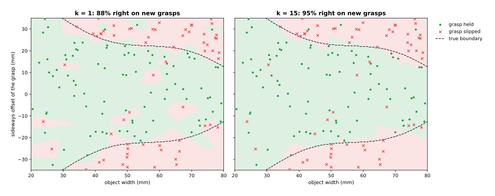
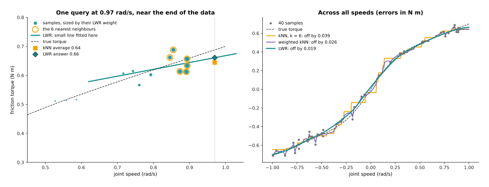
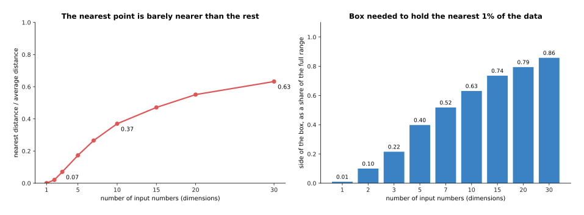
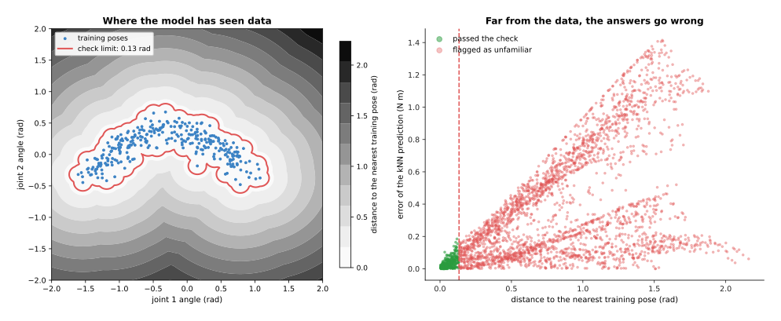

# Nearest neighbours and locally weighted regression

This page explains the learning methods that answer a new question by looking up
the most similar stored examples. **k-nearest neighbours** copies the answers of
the few closest examples, while **weighted neighbours** lets the closer ones
count more. **Locally weighted regression** fits a small straight line around
each new question, using only the examples nearby. These methods are old and
simple, and they are still used on robot arms, from choosing a grasp to learning
the arm's own dynamics while it moves.

It answers six questions, and the sections below take them in turn. How do these
methods predict a class or a number? Why does weighting the neighbours help? How
does locally weighted regression work, and why was it the classic way to learn
an arm's dynamics online? Why do the methods fail when each example has many
numbers? How can the distance to the nearest examples warn that a new input is
unfamiliar? And where does a robot arm use them?

It is for a reader who has read the first chapter of this book, especially
[how a model learns](../../01_what-models-are/02_how-a-model-learns.md). So you
need to know what an example, a label, a test set and overfitting are.

Every number on this page comes from a real run of the diagram script
`docs/diagrams/classical_ml_3.py`. The data is simulated, so that the true
answer is known exactly. But the methods themselves are real, and they are
written in NumPy.

> Before this page, it helps to have read [nearest-neighbour search](../../../05_programming-techniques/03_searching-and-matching/02_most-used/01_nearest-neighbour-search.md) in Book 5. It explains how a program finds the closest stored points quickly, which every method on this page needs.

## Contents

1. [The idea in one sentence](#1-the-idea-in-one-sentence)
2. [k-nearest neighbours, step by step](#2-k-nearest-neighbours-step-by-step)
   · [Classification: a vote among the nearest](#classification-a-vote-among-the-nearest)
   · [Weighted neighbours: closer ones count more](#weighted-neighbours-closer-ones-count-more)
   · [Measuring distance: units matter](#measuring-distance-units-matter)
3. [Regression, and locally weighted regression](#3-regression-and-locally-weighted-regression)
   · [A small line around each query](#a-small-line-around-each-query)
   · [LWPR: learning an arm's dynamics online](#lwpr-learning-an-arms-dynamics-online)
4. [The curse of dimensionality](#4-the-curse-of-dimensionality)
5. [Checking for unfamiliar inputs by distance](#5-checking-for-unfamiliar-inputs-by-distance)
6. [How it is trained, and how much data it needs](#6-how-it-is-trained-and-how-much-data-it-needs)
7. [Where it is used on a robot arm](#7-where-it-is-used-on-a-robot-arm)
8. [What goes wrong](#8-what-goes-wrong)
9. [Libraries](#9-libraries)
10. [Why this, and what it costs](#10-why-this-and-what-it-costs)
11. [The written alternative](#11-the-written-alternative)
12. [Where to read next](#12-where-to-read-next)
13. [Using it in Python](#13-using-it-in-python)

---

## 1. The idea in one sentence

To answer a new question, find the stored examples whose inputs are most like
it, and combine their answers, giving the closest ones the most say.

For example, you want to guess what a house will sell for. You do not write a
formula for house prices, so instead you find the five houses that sold most
recently on the same street, of about the same size, and take the middle of
their prices. If one of them is right next door and nearly identical, you trust
it more than the others, and that is k-nearest neighbours with weighting.

---

## 2. k-nearest neighbours, step by step

Section 1 said the method combines the answers of the most similar examples, so
this section says exactly how. **k-nearest neighbours (kNN)** does no training
at all, because it simply keeps every example. To answer a new input, called the
**query**, it:

1. measures the distance from the query to every stored example's input;
2. takes the k examples with the smallest distances, the **neighbours**;
3. combines their labels: a vote for a class, or an average for a number.

k is a number that you choose, such as 5, and step 1 is the slow part when there
are many examples. So Book 5's
[nearest-neighbour search](../../../05_programming-techniques/03_searching-and-matching/02_most-used/01_nearest-neighbour-search.md)
builds a **k-d tree**, a structure that finds the neighbours without measuring
every distance.

### Classification: a vote among the nearest

For example, an arm has logged 150 grasps, and each grasp has two input numbers:
the object's width in millimetres (mm), and how far the grasp was to one side of
the object's centre, the **offset**, also in mm. The label says whether the
grasp held or slipped. In this simulation a grasp holds if the offset is small
enough for the width, because wide objects leave less room. To make it
realistic, 8% of the labels were flipped, as if some grasps failed for reasons
the two numbers do not show.

Take one query, a 60 mm object grasped 12 mm off centre, whose five nearest
logged grasps are between 3.1 and 3.8 mm away. Three of them held and two
slipped, so the vote is 3 to 2 and kNN predicts "holds". The truth, from the
rule, is also "holds".



The picture shows the answer kNN gives at every point, where green means "holds"
and red means "slips". The dashed line is the true boundary, and the script
scored each setting on 4,000 new grasps.

- With k = 1, every flipped label makes its own island of the wrong colour, so
  it is right only 88% of the time.
- With k = 15, the islands vanish, because one wrong label is outvoted, and it
  is right 95% of the time.

A larger k smooths the answer, but too large a k smooths away real detail,
because with k = 45 the vote reaches so far that it is right only 86% of the
time. So k is chosen by trying several values on examples held back for testing.

### Weighted neighbours: closer ones count more

In a plain vote the 15th neighbour counts as much as the first, even if it is
ten times as far away, so **weighted neighbours** gives each neighbour a weight
that falls with its distance. The most common weight is one divided by the
distance, so a neighbour 2 mm away counts five times as much as one 10 mm away.
The answer is then the weighted vote, or the weighted average.

The table below compares plain and weighted votes on the same 150 grasps. Read
each row across: k, then how often each kind of vote was right on 4,000 new
grasps.

| k | Plain vote | Weighted vote |
| --- | --- | --- |
| 1 | 88.3% | 88.3% |
| 5 | 95.6% | 95.0% |
| 15 | 94.6% | 96.8% |
| 45 | 86.0% | 95.0% |

With k = 1 the two are the same, because there is only one neighbour. With a
small k weighting changes little, but with a large k it matters a lot. At k = 45
the plain vote lets far examples outvote near ones, while the weighted vote
gives them little say and stays at 95%. So weighting makes the choice of k much
less delicate.

### Measuring distance: units matter

The usual distance is the straight-line distance, which means squaring the
difference in each input, adding them up, and taking the square root. This
treats one unit of every input as equally important, so it is only fair if the
units are comparable.

In the grasp example both inputs are in millimetres, and kNN with k = 5 is right
95.6% of the time. The script then gave the width in metres instead, while
keeping the offset in millimetres. Now a 60 mm difference in width counts as
0.06, while a 1 mm difference in offset counts as 1. So the distance almost
ignores the width, and kNN is right only 82.8% of the time.

The fix is to **standardise** each input before measuring distance, which means
subtracting its average and dividing by its spread. With both inputs
standardised kNN is right 95.1% of the time. So always do this when the inputs
have different units, such as a joint angle in radians and a force in newtons.

---

## 3. Regression, and locally weighted regression

Section 2 voted among the neighbours to get a class, and for a number instead
kNN averages the neighbours' labels. In the robot example a joint's friction
torque, in newton metres (N m), depends on its speed, in radians per second
(rad/s). The robot has 40 measurements at speeds from −1 to 1 rad/s, each with
noise of 0.04 N m.

Plain kNN with k = 6 averages the six nearest measurements, while weighted kNN
weights them by one over the distance, and the right panel below shows both.
Plain kNN draws a staircase, because the answer jumps whenever the set of six
neighbours changes. Weighted kNN is smoother, but it bends towards each single
measurement, noise and all.

### A small line around each query

**Locally weighted regression (LWR)** goes one step further, because for each
query it fits a straight line, but only to the examples near that query. It does
this with weighted least squares, which the
[regression page](01_linear-and-logistic-regression.md#weighted-least-squares-trusting-some-readings-more)
explains: each example gets a weight, and the line fits the heavy examples most
closely.

1. Give every example a weight that falls with its distance from the query. Here
   the weight has a bell shape with a **width** of 0.12 rad/s. So an example
   0.12 rad/s away gets weight 0.61, one 0.24 away gets 0.14, and one 0.36 away
   gets 0.01.
2. Then fit a straight line to all the examples, using those weights, so that
   far examples have almost no say.
3. Then read the line's value at the query, and that value is the prediction.
4. For the next query, start again with new weights.

So LWR is not one model, because it is a new small model for every query. The
line also lets it follow a slope, which an average cannot do.



The left panel shows one query, at 0.97 rad/s, where each dot's size shows its
LWR weight. The true torque there is 0.688 N m, and the six nearest measurements
all lie to the left of the query, between 0.85 and 0.89 rad/s. Their average is
0.644 N m, which is too low, because the torque rises with speed and every
neighbour sits at a lower speed. Weighted kNN gives 0.642, for the same reason.
But LWR fits a line through the nearby measurements and follows it out to 0.97,
so its answer is 0.661 N m, which is closer to the truth. Its line rises by 0.24
N m for each rad/s, flatter than the true 0.40, because a few noisy measurements
pull it. So it closes part of the gap, not all of it.

The table below scores the three methods against the true curve. Read each row
across: the method, its average error over all speeds, and its average error
near the two ends of the data, above 0.85 rad/s in either direction.

| Method | Error overall | Error near the ends |
| --- | --- | --- |
| kNN, k = 6 | 0.039 N m | 0.030 N m |
| Weighted kNN, k = 6 | 0.026 N m | 0.030 N m |
| LWR, width 0.12 rad/s | 0.019 N m | 0.016 N m |

LWR has half the error of plain kNN overall, and half the error near the ends.
The ends are where an average suffers most, since all of its neighbours lie on
one side.

The width plays the part that k plays in kNN. A narrow width follows every bump,
including noise, while a wide width smooths away real bends. So it is chosen by
testing several widths on held-back examples.

### LWPR: learning an arm's dynamics online

An arm's **inverse dynamics** is the torque each joint needs to make a given
motion. Book 5's
[arm dynamics](../../../05_programming-techniques/07_control-and-motion/02_most-used/03_arm-dynamics.md)
computes it from a physics formula. For a seven-joint arm the input is 21
numbers, which are the angle, speed and acceleration of each joint, and the
output is seven torques. The formula misses friction, cables and wear, so
researchers in the late 1990s and 2000s set out to learn this mapping from the
arm's own motion, while it moved.

But plain LWR is too slow for that, because it fits a new line for each query
from all the stored examples. So **locally weighted projection regression
(LWPR)**, published by Sethu Vijayakumar, Aaron D'Souza and Stefan Schaal in
2005, was the classic answer, and it works like this.

1. It keeps a set of **local models**, where each one has a centre, a region it
   covers, and a small linear fit that is valid only in that region.
2. When a new measurement arrives, every local model near it updates its fit a
   little. The measurement is then thrown away, so that memory does not grow
   with time.
3. If no local model covers the new measurement well, LWPR creates a new one
   centred there.
4. Each model also adjusts the size of its region: smaller where the mapping bends
   fast, larger where it is nearly flat.
5. To predict, it takes the answers of the local models near the query and
   averages them, weighted by how well each one covers the query.

The word "projection" refers to one more trick. Within each region, LWPR finds
the few directions among the 21 inputs along which the output actually changes,
and it fits its line only along those. Real arm motion covers only a thin slice
of all possible 21-number inputs, so a few directions are usually enough, and
that is how LWPR avoids the problem of the next section.

LWPR learned the dynamics of real research arms, such as the seven-joint SARCOS
arm, in real time, and later work used local Gaussian processes the same way.
Today a small neural network, trained on logged data, often does this job, as in
Book 6's
[learned arm models](../../09_touch-and-body-models/03_also-used/02_learned-arm-models.md).
LWPR's idea of learning online, from local pieces that do not disturb each
other, is still useful when an arm must adapt while it works.

---

## 4. The curse of dimensionality

Section 3 used one input number, and nearest-neighbour methods work well with a
few. With many of them they fail, for a reason that has a famous name: the
**curse of dimensionality**, where each input number counts as one
**dimension**.

In plain words, as you add input numbers, the space grows so fast that the
stored examples become spread thinly, and every example ends up far from every
other. So the "nearest" neighbour is then not near at all, because it is only a
little nearer than the rest.

The script shows this with 2,000 random examples, spread evenly, and 200 random
queries, for 1 to 30 dimensions.



The left panel divides the distance to the nearest example by the average
distance to all examples. In 2 dimensions this is 0.02, which means the nearest
example is fifty times closer than a typical one. But in 10 dimensions it is
0.37, and in 30 dimensions it is 0.63. So the nearest example is then almost as
far as any other, and copying its label means little.

The right panel shows the same problem another way. To gather the nearest 1% of
the examples inside a box, the box must span 10% of each input's range in 2
dimensions, while in 10 dimensions it must span 63% of each input's range. So
the "neighbourhood" then covers most of the space, and it is no longer local.

On a robot this means using neighbours on a few carefully chosen input numbers,
such as an object's width and weight, rather than on raw pixels. Real data helps
a little, because it usually lies on a thin slice of the space, as LWPR used. So
a common trick is to let a neural network turn a picture into a short list of
numbers first, and then search for neighbours among those.

---

## 5. Checking for unfamiliar inputs by distance

Section 4 showed that distance loses its meaning with many inputs, but with a
few inputs distance is useful in its own right. Any learned model can give a
confident wrong answer for an input unlike its training examples, and such an
input is called **out of distribution**. So the distance to the nearest training
examples gives a simple check: if a new input is far from all of them, the model
has not seen anything like it, and its answer should not be trusted.

For example, a model predicts a correction torque from two joint angles. It was
trained on 300 poses from the arm's usual work, which fill a curved band of
angles, but the robot then meets poses from anywhere in the range.

To set a limit, the script first measures, for each training pose, the distance
to its nearest other training pose. Inside the data the typical value is 0.030
radians (rad), and 99% of them are below 0.133 rad. So the check uses 0.133 rad
as its limit, which means a new pose farther than that from every training pose
is flagged.



The left panel shades each point by its distance to the nearest training pose,
and the red line is the limit. The right panel then tests 3,000 random poses,
and it plots the error of a kNN prediction against the distance to the nearest
training pose.

- 13% of the test poses passed the check, and their average error was 0.031 N m,
  so only 4.2% of them had an error above 0.1 N m.
- The other 87% were flagged. Their average error was 0.393 N m, and 79% of them
  had an error above 0.1 N m.

So the check caught most of the bad answers and let through mostly good ones,
and the robot can then refuse to use the correction, move more slowly, or ask a
person.

The check works for any model and not only for kNN. For a neural network,
measure the distance between the network's internal numbers for the new input
and for the training inputs, instead of between the raw inputs. The
[uncertainty and confidence](../../10_making-models-work-on-an-arm/03_also-used/01_uncertainty-and-confidence.md)
page covers other ways to tell when a model is unsure.

---

## 6. How it is trained, and how much data it needs

Section 5 used stored examples as a check rather than as a model, and this
section says what storing them costs. kNN is not trained at all, because
"training" means storing the examples and building a search structure such as a
k-d tree if there are many. Adding a new example is instant, since it is simply
stored, and that makes kNN a natural fit for a robot that learns as it works.

You still choose a few things: k, or the LWR width; the weighting; and how to
scale each input. So choose all of them by testing on held-back examples.

How much data you need depends on the number of inputs. With one or two inputs,
tens of examples give useful answers, as in the friction example with 40. But
every extra input needs many more examples to keep the neighbours near, as
section 4 showed. So beyond about 10 raw inputs, kNN usually does poorly unless
the data lies on a thin slice.

The examples must also cover the inputs the robot will meet, because kNN cannot
guess beyond its data. Far from all examples it still returns the labels of the
nearest ones, however far away they are, and that is why the distance check
matters.

---

## 7. Where it is used on a robot arm

Section 6 said these methods suit a robot that keeps learning while it works,
and six jobs on an arm look like that. **Reusing what worked.** A robot keeps a
store of objects it has grasped, holding a few numbers describing each object's
shape and the grasp that worked. For a new object it finds the most similar
stored object and tries its grasp first. This is kNN with k = 1, and it is one
of the most common learning methods on real arms.

**Predicting whether a grasp will hold.** This is the example in section 2,
where a few numbers about the object and the grasp lead to a vote among similar
past grasps.

**Learning the arm's dynamics online.** This is LWR and LWPR, as in section 3,
where a learned correction torque is added to the physics formula's torque as
feed-forward.

**Choosing an action from demonstrations.** A robot stores the camera view and
the action at each moment of some demonstrations. Then at run time it finds the
stored moments most like the current view, and averages their actions. The VINN
method, published in 2021, did this with a neural network's summary of each
picture, and did about as well as more complex learners in its tests.

**Flagging unfamiliar inputs.** This is the check in section 5, placed in front
of any other model, from a friction correction to a grasp network.

**Finding the stored scene most like the current one.** For example, matching
the current pose of a part to a library of stored poses, each with a known pick
plan.

---

## 8. What goes wrong

Section 7 listed where these methods work, and seven things go wrong often
enough to be worth looking for. **Inputs in different units.** One input with
large numbers swamps the rest, as the metres-and-millimetres test showed. So
standardise every input before measuring distance.

**Too many inputs.** This is the curse of dimensionality, so choose a few
meaningful inputs, or let a network reduce a large input to a short one first.

**Noise in single examples.** With k = 1 every wrong label is copied, so use a
larger k and weight the neighbours.

**Answers at the edge of the data.** An average of neighbours that all lie on
one side is biased, as the query at 0.97 rad/s showed, and LWR's local line
reduces that bias.

**Far from all data.** kNN always answers, even when the nearest example is far
away, so add the distance check in front of it.

**Slow answers with many examples.** Measuring every distance is slow for
millions of examples, so use a search structure, such as a k-d tree, or an
approximate search library.

**Memory.** kNN stores every example, so on a small robot computer a store of
camera pictures fills memory fast. Store short summaries instead, or keep only a
chosen subset of the examples.

---

## 9. Libraries

You would use a library rather than write the search yourself, and these are the
real ones that provide the methods on this page.

- **scikit-learn**: `KNeighborsClassifier` and `KNeighborsRegressor`, both with
  `weights='distance'` for weighted neighbours; `NearestNeighbors` for the
  search on its own, which is useful for the distance check; and
  `StandardScaler` to standardise inputs.
- **FAISS**, from Meta: fast nearest-neighbour search over millions of examples,
  exact or approximate, with graphics-card support.
- **statsmodels**: a `lowess` function, which is locally weighted regression for
  one input.
- **The LWPR library**, from the authors of LWPR: written in C, with interfaces
  for C++, MATLAB and Python.

But kNN and LWR are also short enough to write yourself, and the script behind
this page does each of them in a few lines of NumPy.

---

## 10. Why this, and what it costs

Those libraries make these methods cheap to try, so this section answers the
four questions: what it is, what it does for you, why it rather than the obvious
alternative, and what it costs.

kNN and LWR predict by combining the labels of the stored examples most similar
to the query. They need no training, they learn a new example instantly, and
every answer can be explained by pointing to the examples it came from.

The obvious alternative is one global model, such as
[linear regression](01_linear-and-logistic-regression.md) or a small neural
network, which must have the right shape everywhere at once. A straight line
cannot follow the friction curve's bend, and a network can, but it must be
trained again to take in new examples and it may forget old ones. Instead kNN
and LWR fit the shape piece by piece, so a new example changes only the answers
near it. So choose them when the inputs are few, the shape is unknown, and the
robot keeps learning while it works.

The other alternative is a
[Gaussian process](03_gaussian-processes-and-bayesian-optimisation.md), which
also predicts from nearby examples. A GP gives an error bar, and its curve is
smoother. But kNN and LWR stay fast with many more examples, although they give
no error bar of their own, and LWPR updates in real time.

The costs are these. You must store every example, or LWPR's local models, and
search them at each query, and you must scale the inputs and choose k or the
width. The methods also fail with many raw inputs. And they cannot predict
beyond their data, because far from every example they still answer, so you must
check the distance yourself.

---

## 11. The written alternative

Book 5's
[nearest-neighbour search](../../../05_programming-techniques/03_searching-and-matching/02_most-used/01_nearest-neighbour-search.md)
is the programmed half of kNN, because it finds the closest stored points
exactly. On its own it is a lookup table, where you store the grasps you have
tested by hand and look up the nearest one. That wins when a person can list the
cases ahead of time and there are few of them. But kNN adds the learned part,
which is a vote or a weighted average over several neighbours, so that noise in
one example does not decide the answer.

For the arm's dynamics, the written alternative is Book 5's
[system identification](../../../05_programming-techniques/04_fitting-and-estimation/03_also-used/01_system-identification.md),
which fits the numbers in a physics formula. It wins whenever the formula has
the right shape, because it needs far fewer examples and it behaves sensibly
away from the data. But LWR and LWPR win for effects the formula does not
describe, such as friction that changes with pose. So the usual choice is both:
the formula first, and a local learner on what it gets wrong.

---

## 12. Where to read next

- The previous page is aussian processes and Bayesian
  optimisation](03_gaussian-processes-and-bayesian-optimisation.md), where a GP
  also predicts from nearby examples but adds an error bar.
- [Linear and logistic regression](01_linear-and-logistic-regression.md)
  explains weighted least squares, the fit inside LWR.
- [Learned arm models](../../09_touch-and-body-models/03_also-used/02_learned-arm-models.md)
  learns the arm's dynamics with networks, the modern follow-on to LWPR.
- [Uncertainty and confidence](../../10_making-models-work-on-an-arm/03_also-used/01_uncertainty-and-confidence.md)
  covers other ways to tell when a model should not be trusted.
- The [chapter overview](../01_overview.md) compares all the methods of this
  chapter in one table.
- Book 5's
  [nearest-neighbour search](../../../05_programming-techniques/03_searching-and-matching/02_most-used/01_nearest-neighbour-search.md)
  explains k-d trees and fast search in detail.

---

## 13. Using it in Python

Section 2 looked up the nearest examples by hand, section 5 turned the distance
to the nearest example into a check for unfamiliar input, and section 9 named the
libraries. This section shows the calls, and there are only three of them,
because the method has almost nothing to train.

```python
from sklearn.neighbors import KNeighborsRegressor, NearestNeighbors
from sklearn.preprocessing import StandardScaler
from sklearn.pipeline import make_pipeline

# StandardScaler comes first, because section 2 showed that the units of each
# column decide which examples count as near.
model = make_pipeline(
    StandardScaler(),
    KNeighborsRegressor(n_neighbors=5, weights="distance"))
model.fit(X, y)
print(model.predict(X_new))

# Section 5's check: how far is this input from anything we have seen?
index = NearestNeighbors(n_neighbors=1).fit(X)
distance, _ = index.kneighbors(X_new)
```

The argument `weights="distance"` is section 2's weighted vote, where a closer
neighbour counts for more, and leaving it out gives every one of the five
neighbours an equal say. The `make_pipeline` call matters more than it looks,
because it means the scaling learned from the training rows is applied to
`X_new` too. Scaling the two sets separately is a common mistake and it quietly
ruins the distances.

The library gives you the search, and it picks a data structure for you. With few
columns it builds a k-d tree or a ball tree, which finds the nearest examples
without comparing against every row, and with many columns it falls back to
comparing against every row, because those trees stop helping. That is section
4's curse of dimensionality showing up inside the library.

What you have to keep is the data, and this is the one method where that is
literal. `fit` stores the rows and learns nothing, so all the cost moves to
`predict`, and the saved model is as large as your dataset. If you delete the
training rows you have deleted the model.

What you have to decide is `n_neighbors`, the scaling, and the distance above
which you refuse to answer. Section 2 explained why the first of those is a real
trade, because a small `k` follows the noise and a large `k` smooths over real
detail. The refusal limit of section 5 has no default at all, and you set it the
way section 5 did, by measuring how far each training example sits from its
nearest neighbour and taking the value that 99% of them fall below. For the
locally weighted regression of section 3 with a single input column,
`statsmodels` has a `lowess` function, which scikit-learn does not provide.
