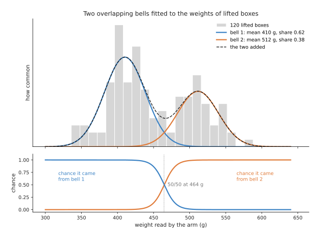
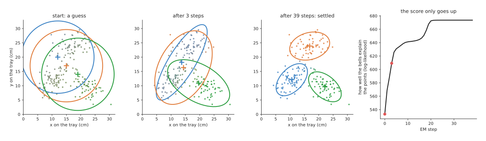
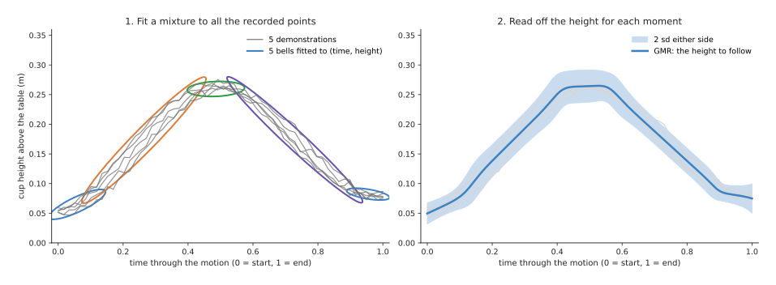
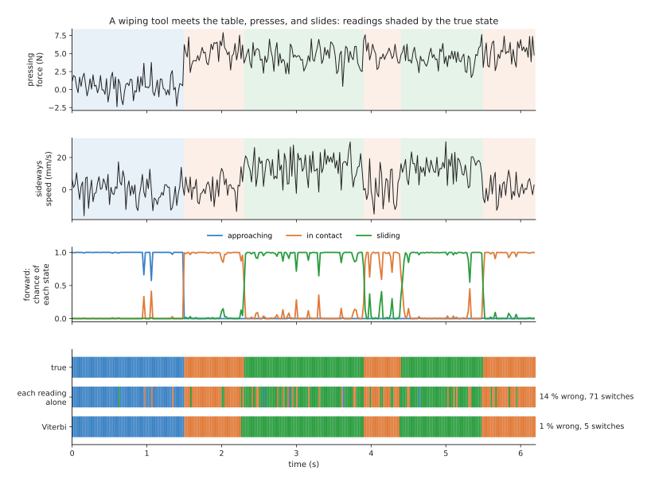

# Mixture models and hidden Markov models

This page explains three related methods. A **Gaussian mixture model** describes
data as a few overlapping bell shapes. **Gaussian mixture regression** uses such a
model to reproduce a motion that a person showed the robot a few times. A **hidden
Markov model** follows a situation you cannot measure directly, such as "the tool is
touching the table", from readings you can measure, such as force. The page answers
four questions. How does each one work? How is it trained? Where does it turn up on
a robot arm? And when is a written rule the better choice?

It is for a reader who has read
[what a model is](../../01_what-models-are/01_what-a-model-is.md) and
[how a model learns](../../01_what-models-are/02_how-a-model-learns.md), and the
[overview](../01_overview.md) of this chapter. Nothing else about machine learning is
assumed.

Every number on this page comes from a real run of the diagram script
`docs/diagrams/classical_ml_4.py`. The data is simulated, so that we know the true
answer. The methods are real, written in NumPy.

> Before this page, it helps to have read the k-means part of [clustering](../../../05_programming-techniques/05_image-and-point-cloud-processing/02_most-used/03_clustering.md#k-means-k-centres-moved-to-the-average), because a Gaussian mixture is a softer version of k-means, and the predict and update steps of the [Kalman filter](../../../05_programming-techniques/04_fitting-and-estimation/02_most-used/03_kalman-filter.md#2-the-idea-in-one-sentence), because the forward algorithm in section 4 works the same way.

## Contents

1. [The idea in one sentence](#1-the-idea-in-one-sentence)
2. [Gaussian mixture models: a few overlapping bells](#2-gaussian-mixture-models-a-few-overlapping-bells)
   · [One reading, two possible sources](#one-reading-two-possible-sources)
   · [Fitting the bells: expectation and maximisation](#fitting-the-bells-expectation-and-maximisation)
   · [A run in two dimensions](#a-run-in-two-dimensions)
3. [Gaussian mixture regression: a motion from a few demonstrations](#3-gaussian-mixture-regression-a-motion-from-a-few-demonstrations)
4. [Hidden Markov models: states you cannot see](#4-hidden-markov-models-states-you-cannot-see)
   · [The three parts of the model](#the-three-parts-of-the-model)
   · [The forward algorithm: which state now?](#the-forward-algorithm-which-state-now)
   · [Viterbi: the best whole story](#viterbi-the-best-whole-story)
   · [A run on a force trace](#a-run-on-a-force-trace)
5. [How they are trained](#5-how-they-are-trained)
6. [Where they are used on a robot arm](#6-where-they-are-used-on-a-robot-arm)
7. [What goes wrong](#7-what-goes-wrong)
8. [Libraries](#8-libraries)
9. [Why these, and what they cost](#9-why-these-and-what-they-cost)
10. [The written alternative](#10-the-written-alternative)
11. [Where to read next](#11-where-to-read-next)

---

## 1. The idea in one sentence

When your data comes from a few different sources mixed together, such as two kinds
of box, or a few steps of a task, you can describe it as a few bell shapes, one for
each source, and then ask which source each reading most likely came from.

Here is an everyday example. A post office weighs every parcel. Letters weigh a few
tens of grams, small parcels a few hundred, and large parcels a few kilograms. If you
plot all the weights, you see three humps. Nobody labelled each item, but the humps
tell you there are three kinds, how common each kind is, and roughly how heavy each
kind is. A new item that weighs 350 grams is almost certainly a small parcel.

A **bell**, in this page, is the familiar bell-shaped curve that most measurements
follow when they vary at random around a typical value. Its proper name is the
**Gaussian**, or **normal distribution**. It has a middle, called the **mean**, and
a width, called the **standard deviation (sd)**. About two readings in three fall
within one sd of the mean.

---

## 2. Gaussian mixture models: a few overlapping bells

A **Gaussian mixture model (GMM)** is a small number of bells added together. Each
bell has its own mean, its own width, and its own **share**: the fraction of the data
it accounts for. The shares add up to 1.

### One reading, two possible sources

A robot arm lifts boxes off a conveyor. Its wrist sensor reads the weight of each
box. Some boxes are empty packaging, and some hold a product. Nobody tells the robot
which is which.

The script made 120 weights: 70 empty boxes around 410 grams (g) and 50 full boxes
around 505 g. It then fitted two bells, without being told which box was which. The
picture shows the result.

The fitted bells have means of 410 g and 512 g, both with an sd of about 28 g. Their
shares are 0.62 and 0.38, close to the true 70 and 50 out of 120.

The lower panel shows the most useful output. For any weight, the model gives the
chance that it came from each bell. A box of 440 g has a 0.04 chance of being full. A
box of 455 g has 0.23, and one of 470 g has 0.64. The two chances are equal at 464 g.
This is a **soft** answer. Near the middle the model says "not sure", instead of
forcing a yes or no.

### Fitting the bells: expectation and maximisation

The bells are fitted by a method called **expectation–maximisation (EM)**. It
solves a chicken-and-egg problem. If we knew which box came from which bell, fitting
each bell would be easy: take the average and spread of its boxes. If we knew the
bells, saying which box came from which would be easy: compare the heights of the
bells at that weight. We know neither, so EM guesses one and improves both in turn.

1. Start with a guess for each bell: a mean, a width and a share. The script
   started with means of 380 g and 560 g.
2. **Expectation step.** For each reading, work out the chance that it came from
   each bell, using the current bells. This gives each reading a set of fractions
   that add up to 1, such as 0.9 for bell 1 and 0.1 for bell 2.
3. **Maximisation step.** Refit each bell from all the readings, but count each
   reading only by its fraction for that bell. A reading that is 0.9 bell 1 counts
   almost fully towards bell 1, and hardly at all towards bell 2.
4. Repeat steps 2 and 3 until the bells stop moving.

For the box weights, EM stopped after 11 rounds.

EM is k-means with soft edges. K-means, from Book 5's
[clustering page](../../../05_programming-techniques/05_image-and-point-cloud-processing/02_most-used/03_clustering.md#k-means-k-centres-moved-to-the-average),
gives each point wholly to its nearest centre. EM gives each point partly to every
bell. It also learns each bell's width and tilt, which k-means does not.

### A run in two dimensions

In two dimensions each bell becomes an oval hill. Its **covariance** is a small table
of numbers that says how wide the oval is in each direction and how it is tilted.

The next picture uses 200 points where a person dropped parts onto a tray, in three
loose heaps. EM starts from three large round guesses near the middle.

Each point is coloured by its fractions: a pure colour means one bell claims it, and
a mixed colour means it is shared. The ovals show two sds around each mean. After 3
rounds the ovals have stretched towards the heaps, but two of them still share one
heap. After 39 rounds they have settled. The fitted means are (10.6, 12.1),
(16.8, 23.9) and (22.1, 9.6) centimetres, against true means of (10, 12), (17, 24)
and (22, 10). The shares are 0.39, 0.31 and 0.30, against true shares of 0.40, 0.30
and 0.30.

The right panel shows the **log-likelihood**. This is a score for how well the bells
explain the points; higher is better. It rose from 533.3 to 673.6, and it never went
down. That is always true of EM, and it is a useful check on your own code.

---

## 3. Gaussian mixture regression: a motion from a few demonstrations

**Gaussian mixture regression (GMR)** turns a mixture into a way of predicting one
number from another. On a robot arm, it is used to learn a motion from a few
demonstrations.

A **demonstration** is one recording of a person doing the motion. A common way to
record one is **hand-guiding**, also called **kinesthetic teaching**: a person holds
the arm and moves it through the motion, while the arm's joints and the position of
its hand are recorded.

The script recorded five demonstrations of lifting a cup, carrying it, and setting it
down. Each gives the cup's height at 60 moments. Time is written from 0 at the start
to 1 at the end, so that fast and slow demonstrations line up.

1. Put every recorded point from all five demonstrations into one table with two
   columns: time and height. That is 300 points.
2. Fit a mixture of five bells to this table with EM. Each bell ends up covering one
   part of the motion: the lift, the top, the lowering, and so on. Each oval is
   tilted along the direction the height changes at that part.
3. To move the arm, ask the mixture: "at time *t*, what height?" Each bell gives its
   own answer, a straight-line guess along its tilt. The answers are blended, weighted
   by how much each bell covers time *t*.

The blue curve is the height the arm follows. It peaks at 26.5 centimetres (cm),
about half-way through. GMR also gives a spread at every moment, shown as the pale
band. The spread is 8.9 millimetres (mm) at the start, 13.5 mm in the middle and
12.3 mm at the end. A controller can use it: where the demonstrations agreed, hold
the path stiffly; where they varied, let the arm give way more.

GMR is more than an average. The largest gap between the GMR curve and a plain
average of the five demonstrations is 7.9 mm, because the demonstrations do not line
up perfectly in time. The mixture smooths over that, and the result is one smooth
curve with no corners.

The next page, [movement primitives](02_movement-primitives.md), covers two other
ways to learn a motion from a few demonstrations. They are used more often than GMR
today, because they also adapt the motion to a new goal.

---

## 4. Hidden Markov models: states you cannot see

A **hidden Markov model (HMM)** tracks a situation that changes over time and that
you cannot measure directly. It works it out from readings you can measure.

Here is the arm example. A wiping tool comes down onto a table, presses, slides
sideways, stops, and slides again. The robot's program needs to know which of three
**states** it is in: *approaching*, *in contact* or *sliding*. No sensor reads the
state. The wrist sensor reads the pressing force, and the arm reads the sideways
speed. Both readings are noisy.

The word **hidden** means the state cannot be read. The word **Markov**, after the
mathematician Andrey Markov, means the model assumes that the next state depends
only on the current state, not on the whole history.

### The three parts of the model

An HMM has three parts.

1. **Starting chances.** How likely each state is at the first reading. Here, the
   tool almost always starts by approaching.
2. **Transition chances.** For each state, the chance of each next state, one
   reading later. The table below shows them for the wiping tool, learned from a
   labelled recording at 50 readings a second. Read each row as "from this state";
   the columns give the chance of each state one reading later.

   | From \ to | approaching | in contact | sliding |
   | --- | --- | --- | --- |
   | approaching | 0.984 | 0.012 | 0.004 |
   | in contact | 0.003 | 0.980 | 0.017 |
   | sliding | 0.002 | 0.010 | 0.988 |

   The large numbers on the diagonal say that the state usually stays the same from
   one reading to the next. This is what lets the model ignore a single odd reading.
3. **Reading chances.** For each state, a bell over the readings. Approaching has a
   force near 0.0 newtons (N) and a speed near 0 mm per second. In contact has
   5.0 N and no speed. Sliding has 4.5 N and about 16 mm per second.

### The forward algorithm: which state now?

The **forward algorithm** answers: given all the readings so far, what is the chance
of each state now? It keeps one chance for each state and repeats two steps at every
new reading.

1. **Predict.** Move the chances one step on with the transition table. If the tool
   was surely in contact, it is now in contact with chance 0.980 and sliding with
   chance 0.017.
2. **Update.** Multiply each state's chance by how well the new reading fits that
   state's bell, then scale the three chances so they add up to 1.

These are the same two steps as the
[Kalman filter](../../../05_programming-techniques/04_fitting-and-estimation/02_most-used/03_kalman-filter.md#predict)
in Book 5. The Kalman filter tracks a number, such as a position. The forward
algorithm tracks a choice between a few states. It uses only past readings, so it
can run live on the robot.

### Viterbi: the best whole story

The **Viterbi algorithm**, named after Andrew Viterbi, answers a different question:
after the whole recording, what single sequence of states best explains all of it?
It is used to split a recording into steps after the fact.

It works through the readings once, from start to end. For each state at each
reading, it keeps only the best way of arriving there, and a note of which state that
way came from. At the end, it picks the best final state and follows the notes
backwards. Because it looks at the whole recording, it can use a later reading to
decide that an earlier moment belonged to one state rather than another.

### A run on a force trace

The script fitted the HMM from one labelled recording of 510 readings. It then ran
it on a new recording of 310 readings, 6.2 seconds long, with 5 true changes of
state.

The top two panels show the readings, shaded by the true state. The third panel shows
the forward algorithm's chance of each state. The bottom panel compares three
answers.

The table below compares them. Read each row as one way of choosing the state.

| Method | Readings wrong | Changes of state reported |
| --- | --- | --- |
| each reading alone, nearest bell | 13.9 % | 71 |
| forward algorithm, most likely state | 1.0 % | 5 |
| Viterbi, best whole sequence | 1.3 % | 5 |

Judging each reading alone flickers between states 71 times, because one noisy
reading can look like any state. Both HMM methods report the true 5 changes. In this
run, Viterbi was very slightly worse per reading, because it chooses the best whole
sequence, not the best state at each moment. Both place every change within two
readings, or 0.04 seconds, of the true moment. The forward algorithm is up to one
reading late, because at each moment it has not yet seen the readings that follow.

---

## 5. How they are trained

A **mixture** needs only the readings, with no labels. It needs you to choose the
number of bells. A common way is to fit several numbers and compare them with a score
that punishes extra bells, such as the **Bayesian information criterion (BIC)**.
Tens of points per bell are usually enough in one or two dimensions. Many more are
needed when each point has many numbers, because each bell's covariance has many
entries to learn.

**GMR** needs a few demonstrations, typically 3 to 10, of the same motion. Each one
must be lined up in time, usually by scaling each recording to run from 0 to 1.

An **HMM** can be trained in two ways. With a labelled recording, where someone has
marked the state at each moment, training is counting: count how often each state
follows each other, and fit a bell to each state's readings. That is what the script
did. Without labels, a version of EM called the **Baum–Welch algorithm** learns all
three parts from the readings alone. It needs more data, and the states it finds may
not match the ones you had in mind, so you usually give it a sensible starting guess.

---

## 6. Where they are used on a robot arm

- **Learning a motion from a few hand-guided demonstrations.** GMR reproduces a
  smooth path with a spread, which a compliant controller can use as a stiffness
  guide.
- **Splitting a demonstration into steps.** Viterbi splits a long recording of, say,
  a peg insertion into "reach", "align", "insert" and "release". Each part can then
  be learned or checked on its own.
- **Tracking contact.** The forward algorithm follows the contact state live from
  force readings, so a program can switch its controller when the tool touches.
- **Spotting that something went wrong.** If a trained HMM or mixture gives a very
  low chance to the current readings, the task is doing something it has never
  seen. This is a simple kind of failure detector.
- **Sorting items by a measured number.** A mixture sorts boxes, parts or grasps by
  weight, width or force, without anyone labelling them first.
- **Describing where things usually are.** A mixture over where objects were found
  on a table gives a map of likely places to look first.

---

## 7. What goes wrong

EM can settle on a poor answer. Where it ends depends on where it starts. Two bells
can end up sharing one heap while another heap has none, as in the "after 3 steps"
panel of the picture. The fix is to start from k-means centres, or to run EM
several times from different starts and keep the best score.

A bell can shrink onto a single point. Its width goes to zero and its score goes to
infinity. The fix is to add a small number to every covariance at every step. The
script adds 0.000001.

The number of bells or states has to be chosen. Too few and the model blurs
different things together. Too many and it fits the noise. Compare scores such as BIC
on held-back data.

A real state's readings may not follow a bell. The force while sliding may have a
long tail, or two humps. The fix is to use a mixture of bells for each state, or to
feed the HMM better readings, such as a filtered force.

The Markov assumption is not quite true. A real contact state lasts a typical time,
but an HMM assumes the chance of leaving is the same at every reading, however long
the state has lasted. For most contact tracking this does not matter. For step
splitting, some people use a variant that learns how long each state lasts.

GMR only reproduces the demonstrated motion. It does not know about a new goal or
an obstacle. [Movement primitives](02_movement-primitives.md) handle the new goal.

---

## 8. Libraries

The table below lists real libraries. Read each row as one library and what it
provides.

| Library | Language | What it provides | Note |
| --- | --- | --- | --- |
| scikit-learn | Python | `GaussianMixture` and `BayesianGaussianMixture` in `sklearn.mixture` | the place to start for mixtures; has `bic` for choosing the number of bells |
| hmmlearn | Python | `GaussianHMM` in `hmmlearn.hmm`, with `fit`, `predict` (Viterbi) and `predict_proba` | the standard small HMM library; follows the scikit-learn pattern |
| gmr | Python | a `GMM` class with a `predict` method for Gaussian mixture regression | small library by Alexander Fabisch, made for robot motions |
| pomegranate | Python | mixtures and HMMs, built on PyTorch | faster on large data; can run on a graphics card |

---

## 9. Why these, and what they cost

A Gaussian mixture describes data as a few overlapping bells. An HMM tracks a hidden
state from noisy readings over time. GMR turns a mixture into a smooth motion.

What they do for you: they turn a handful of readings or demonstrations into a
model that gives a chance for every answer, not just an answer. They train in
seconds, and you can look inside them: each bell and each transition chance means
something you can check.

The obvious alternative to a mixture is k-means, and to an HMM it is a threshold on
each reading. A mixture beats k-means when the groups overlap or have different
widths, and when you want to know how sure the answer is. An HMM beats a threshold
when the readings are noisy, because it uses the fact that states last: the run above
cut the error from 13.9 % to about 1 %. For learning a motion, the obvious
alternative is a [behaviour cloning](../../06_movement-models/02_most-used/01_behaviour-cloning.md)
network. GMR needs far fewer demonstrations and no camera, but it only learns one
motion and cannot react to what it sees.

What they cost: you choose the number of bells or states. EM can end in a poor answer
and needs several starts. The model is only as good as its bell shapes. And none of
them read pictures; the inputs must be a few meaningful numbers.

---

## 10. The written alternative

For sorting readings into groups, Book 5's
[clustering](../../../05_programming-techniques/05_image-and-point-cloud-processing/02_most-used/03_clustering.md)
page does the same job with k-means or mean shift. It wins when the groups are well
apart; the mixture wins when they overlap.

For tracking contact, the written way is a threshold with a
[finite state machine](../../../05_programming-techniques/08_decisions-and-task-logic/02_most-used/01_finite-state-machines.md):
switch to "in contact" when the force stays above a set value for a few readings,
as in the [guarded moves](../../../05_programming-techniques/07_control-and-motion/03_also-used/01_impedance-and-force-control.md#guarded-moves-stop-when-you-feel-it)
of Book 5. It wins when the readings are clean and the states are few; it is easy to
read and to test. The HMM wins when the readings are noisy, when several readings
must be combined, or when you want a chance rather than a yes or no.

For reproducing a motion, the written way is to pick a few waypoints by hand and let
[trajectory generation](../../../05_programming-techniques/07_control-and-motion/02_most-used/02_trajectory-generation.md)
join them smoothly. It wins when you can say where the path should go. GMR wins
when the motion is easier to show than to describe.

---

## 11. Where to read next

- The next page is [movement primitives](02_movement-primitives.md). It learns a
  motion from demonstrations and adapts it to a new goal.
- The chapter [overview](../01_overview.md) compares all the classical methods.
- [Force and slip models](../../09_touch-and-body-models/02_most-used/01_force-and-slip-models.md)
  covers neural networks that read force signals, for when an HMM is not enough.
- [Behaviour cloning](../../06_movement-models/02_most-used/01_behaviour-cloning.md)
  learns movement from many demonstrations with a network.
- Book 5's [Kalman filter](../../../05_programming-techniques/04_fitting-and-estimation/02_most-used/03_kalman-filter.md)
  explains predict and update for a continuous number.
