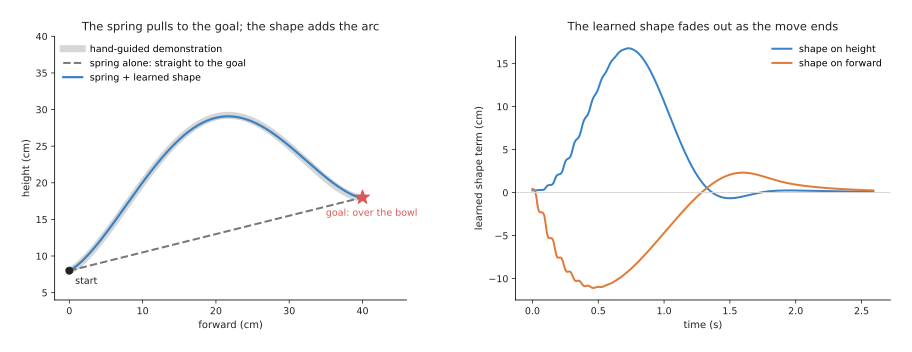
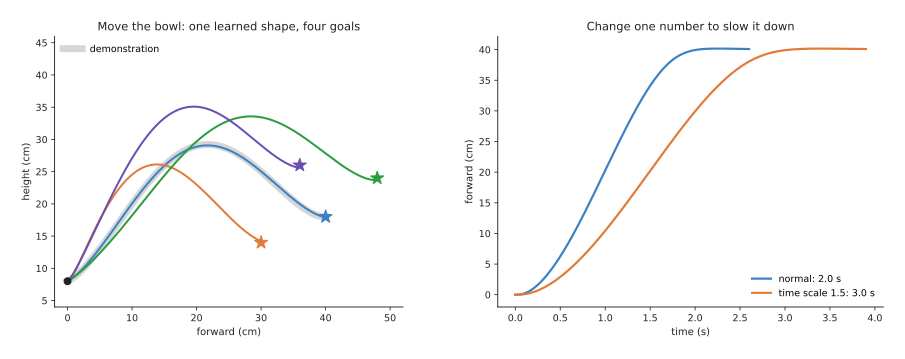
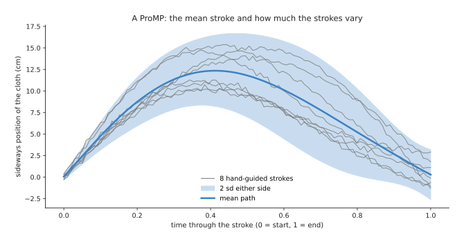
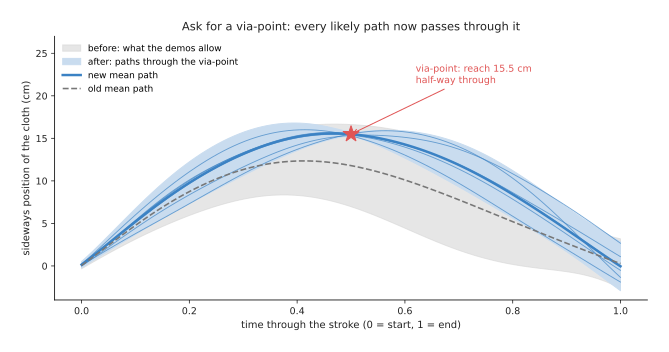

# Movement primitives

This page explains **movement primitives**: small learned models of one smooth
motion, such as pouring from a jug or wiping a table, taught by showing the
motion a few times. It covers the two most used kinds, so a **dynamic movement
primitive** is a spring that pulls the hand to a goal, plus a learned shape. A
**probabilistic movement primitive** is a mean path with a spread, learned from
several demonstrations. The page answers four questions, and the sections below
take them in turn. How does each one work? How do they adapt when the target
moves? How are they trained? And when are they a better choice than a neural
network policy?

It is for a reader who has read
[what a model is](../../01_what-models-are/01_what-a-model-is.md) and
[how a model learns](../../01_what-models-are/02_how-a-model-learns.md). But it
also helps to have read the previous page,
[mixture models and hidden Markov models](01_mixture-models-and-hidden-markov-models.md),
which learns a motion in a different way.

Every number on this page comes from a real run of the diagram script
`docs/diagrams/classical_ml_4.py`. The demonstrations are simulated, but the
methods themselves are real, and they are written in NumPy.

> Before this page, read Book 5's [trajectory generation](../../../05_programming-techniques/07_control-and-motion/02_most-used/02_trajectory-generation.md). It explains what a trajectory is, why a motion must start and stop smoothly, and how a controller follows the targets a movement primitive produces.

## Contents

1. [The idea in one sentence](#1-the-idea-in-one-sentence)
2. [Dynamic movement primitives: a spring and a shape](#2-dynamic-movement-primitives-a-spring-and-a-shape)
   · [The spring](#the-spring)
   · [The learned shape and the phase](#the-learned-shape-and-the-phase)
   · [Learning the shape from one demonstration](#learning-the-shape-from-one-demonstration)
   · [A new goal, and a new speed](#a-new-goal-and-a-new-speed)
3. [Probabilistic movement primitives: a path with a spread](#3-probabilistic-movement-primitives-a-path-with-a-spread)
   · [From demonstrations to a mean and a spread](#from-demonstrations-to-a-mean-and-a-spread)
   · [Asking for a via-point](#asking-for-a-via-point)
4. [How they are trained](#4-how-they-are-trained)
5. [Where they are used on a robot arm](#5-where-they-are-used-on-a-robot-arm)
6. [Primitives or a learned policy](#6-primitives-or-a-learned-policy)
7. [What goes wrong](#7-what-goes-wrong)
8. [Libraries](#8-libraries)
9. [Why movement primitives, and what they cost](#9-why-movement-primitives-and-what-they-cost)
10. [The written alternative](#10-the-written-alternative)
11. [Where to read next](#11-where-to-read-next)

---

## 1. The idea in one sentence

A movement primitive stores the shape of one demonstrated motion in a few dozen
numbers, in a form that still reaches a new goal, can run faster or slower, and
can be told to pass through a chosen point.

For example, you learn to sign your name once, and after that you can sign it
large on a poster or small on a form, quickly or slowly, and start it anywhere
on the page. The shape stays yours, because you did not learn a new signature
for each size. A movement primitive does the same for a robot arm's motion.

A **demonstration**, here, is one recording of a person doing the motion. The
usual way to record one is **hand-guiding**, also called **kinesthetic
teaching**, where a person switches the arm into a mode in which it gives way to
their hands, takes hold of it, and moves it through the motion. The arm records
its own joint angles and hand position as it goes, so no camera is needed.

---

## 2. Dynamic movement primitives: a spring and a shape

A **dynamic movement primitive (DMP)** was introduced by Auke Ijspeert, Jun
Nakanishi and Stefan Schaal in the early 2000s. It describes the motion of each
number, such as the hand's height, with two parts, which are a spring and a
learned shape.

For example, this page uses pouring, where a person hand-guides the arm to lift
a jug from the table, carry it up and over, and stop with the spout above a
bowl. The recording lasts 2.0 seconds, with 100 readings a second, and it gives
the hand's forward position and height.

### The spring

Imagine the hand tied to the goal with a spring, and with a damper so that it
does not bounce. Let go, and the spring pulls the hand to the goal and the hand
stops there. So the motion is smooth, and it always ends at the goal, wherever
the goal is.

In a DMP the spring is not tied straight to the goal, because it is tied to an
**anchor** that starts at the hand and slides towards the goal as the motion
goes on. This makes the start gentle, instead of a sudden pull. The damper is
then set to the value that stops the hand as fast as possible without
overshooting. The script uses a spring
stiffness of 156.25 and a damping of 25, the usual values.

The spring alone gives a straight line to the goal, which is the dashed line in
the picture below. But that line would pour into the bowl by dragging the jug
through the bowl's rim.

### The learned shape and the phase

The spring gives the wrong path on its own, so the second part is a **shape
term**, which is a learned extra push that bends the path away from the straight
line. In this version it moves the spring's anchor up, down, forward or back at
each moment.

The shape term is not written as a function of the clock, because it is written
as a function of a **phase**, which is a number that starts at 1 and falls
smoothly towards 0 as the motion goes on. The shape term is made of 30 small
bells spread along the phase, and each bell has one learned height. So at any
moment the shape term is a blend of the bells near the current phase, multiplied
by the phase itself.

Multiplying by the phase is the key idea. At the start the phase is 1, so the
shape term has its full effect, while at the end the phase is close to 0, so the
shape term has almost no effect and only the spring is left. And the spring
always ends at the goal. So a DMP always reaches its goal, whatever shape it
learned.

On the left, the blue DMP replay lies on the grey demonstration, and the largest
gap between them is 5.1 millimetres (mm). On the right, the learned shape term
is large in the first second, where the arc is, and it fades to nothing by the
end.

### Learning the shape from one demonstration

The 30 heights are the only learned numbers, and a DMP needs only one
demonstration to find them. Training works like this.

1. Record the motion, and work out its speed and acceleration at each reading,
   from the differences between readings.
2. Then at each reading, work out how much extra push the spring would need to
   produce exactly that acceleration, because this is the shape the model must
   learn.
3. Then for each of the 30 bells, fit one number, which is a weighted average of
   that needed push, counting most the readings where that bell is strongest.
   This is **locally weighted regression**, with one small fit per bell, and it
   takes a fraction of a second.

So the result is 30 numbers per axis, 60 in all, plus the start, the goal and
the duration.

### A new goal, and a new speed

Now move the bowl, give the DMP the new goal, and run it again, because nothing
has to be retrained.

On the left, the same 60 numbers produce four paths, and each one lifts, arcs
over and comes down to its own goal. The table below lists each goal, how close
the DMP ends to it, and the highest point of the path, and you should read each
row as one run.

| Goal (forward, height) | Distance from goal at the end | Highest point |
| --- | --- | --- |
| 40 cm, 18 cm (the demonstration's goal) | 1.05 mm | 29.1 cm |
| 30 cm, 14 cm | 2.26 mm | 26.1 cm |
| 48 cm, 24 cm | 0.27 mm | 33.6 cm |
| 36 cm, 26 cm | 1.50 mm | 35.1 cm |

Every run ends within 2.3 mm of its goal, and the small leftover comes from the
shape term, which is small but not exactly zero when the run stops.

On the right is **time scaling**, because a DMP has one number for its duration.
Change it from 2.0 to 3.0 seconds, and the same motion runs one and a half times
slower, while the path stays the same to within 2.1 mm. On an arm this is useful
for a first slow try, or for slowing down near a person.

---

## 3. Probabilistic movement primitives: a path with a spread

A **probabilistic movement primitive (ProMP)** was introduced by Alexandros
Paraschos, Christian Daniel, Jan Peters and Gerhard Neumann in 2013. Unlike a
DMP, it learns from several demonstrations rather than one, and it keeps not
only the typical path but also how much the demonstrations varied at each
moment. The word **probabilistic** means that it describes the chance of each
possible path, and not only one path.

For example, a person hand-guides a cloth across a table in one wiping stroke, 8
times over. Each stroke swings sideways and comes back, but no two are
the same. The script records the sideways position of the cloth at 100 moments
in each stroke, with time written from 0 at the start to 1 at the end.

### From demonstrations to a mean and a spread

1. Describe each demonstration with a few numbers, by placing 10 bells along the
   time axis. Then find the 10 heights that, when the bells are blended, best
   match the demonstration. This is an ordinary least-squares fit, and the
   largest mismatch over all 8 strokes is 5.8 mm.
2. Now each demonstration is 10 numbers, so take the average of the 8 sets, and
   that average is the **mean path**.
3. Then work out how the 10 numbers vary together across the 8 sets. This is
   their **covariance**, which is a table that says how much each number varies
   and which numbers tend to go up and down together, so it holds the spread.

The band shows two **standard deviations (sd)** either side of the mean, so
about 95 in 100 paths fall inside it. At the start the spread is 2.0 mm, because
every stroke starts in the same place. Half-way through, the mean is 11.9
centimetres (cm) out, with a spread of 23.9 mm, and at the end the spread is
14.5 mm.

The spread tells the robot two things. Where the band is narrow the
demonstrations agreed, so that part of the path probably matters, while where
the band is wide the person did not care much, so the robot can bend the path
there. Some controllers use this to hold the arm stiffly where the band is
narrow and softly where it is wide.

### Asking for a via-point

The spread says where the path may bend, and a via-point says where it must not.
A **via-point** is a point that the path must pass through at a set moment.
Suppose a cup stands on the table, and the cloth must reach 15.5 cm out half-way
through the stroke in order to wipe around it.

A ProMP answers this with **conditioning**: of all the paths the demonstrations
allow, keep only those that pass through the via-point, and describe what is
left. This is a short sum with the mean and covariance, with no retraining at
all. It uses the same kind of update as the
[Kalman filter](../../../05_programming-techniques/04_fitting-and-estimation/02_most-used/03_kalman-filter.md#update)
in Book 5, treating the via-point as one very precise measurement.

Before conditioning the mean at half-way is 11.9 cm, and afterwards it is 15.52
cm, with a spread of only 1.47 mm there. The thin blue lines are six paths drawn
at random from the conditioned model, and all of them pass through the point.
The new path does not simply jump to the point and back, because it bends
smoothly, in the way the demonstrations varied, since the covariance says how
each part of the path moves when another part does.
The start and end spreads stay almost as they were, 1.8 mm and 14.4 mm.

A DMP can also reach a new goal, but it has no natural way to add a via-point in
the middle. A ProMP instead can take any number of via-points, and a new start
or goal is just a via-point at time 0 or 1.

---

## 4. How they are trained

Sections 2 and 3 each learned from recordings, so this section says what those
recordings must be like. A **DMP** needs one demonstration of the motion, and
several can be averaged, although one is normal. It must start and end at rest,
and it should be smooth, because the training uses the acceleration, and a shaky
recording has a shaky acceleration. So people usually smooth the recording
first, and training then takes well under a second.

A **ProMP** needs several demonstrations, usually 5 to 20, of the same motion
with some natural variation. With too few of them the covariance is poor,
because with 8 demonstrations and 10 numbers each, the spread is only a rough
guess. The demonstrations must be lined up in time, usually by scaling each to
run from 0 to 1. If people paused at different moments, a method called
**dynamic time warping** can stretch the recordings so matching parts line up
first.

Both learn each axis, or each joint, separately in their simplest form. But a
ProMP can also learn how the joints vary together, by putting all the joints'
numbers into one covariance.

Both kinds are usually learned in the hand's position, so that a new goal from a
camera can be given in metres. They can also be learned in joint angles, when
the arm's pose during the motion matters.

---

## 5. Where they are used on a robot arm

- **Pouring.** A person hand-guides a pour once, then a camera finds the cup and
  the DMP is run with the cup's position as its goal, so the arc over the rim
  comes along for free.
- **Wiping and polishing.** A ProMP learns a stroke from several demonstrations,
  and a via-point then moves the stroke around an object on the table. The
  spread also tells a compliant controller where it may give way.
- **Reaching a moved target.** A reach-and-place learned as a DMP adapts at once
  when the target moves, even during the motion, because the goal can be changed
  while the DMP runs.
- **Joining motions into a task.** A task is often written as a
  [finite state machine](../../../05_programming-techniques/08_decisions-and-task-logic/02_most-used/01_finite-state-machines.md)
  that runs one primitive after another: reach, grasp, lift, pour, put back.
  Each primitive is taught separately.
- **Improving by practice.** Because a DMP is only a few dozen numbers, a robot
  can try small changes to those numbers and keep the ones that do better. This
  is a small, fast form of the
  [reinforcement learning](../../06_movement-models/03_also-used/01_reinforcement-learning-policies.md)
  covered in the movement chapter. It was one of the early successes of robot
  learning, for example for ball-in-a-cup games.
- **Two arms together.** A ProMP over both arms' positions learns how they move
  together, so that when one arm is told where to go, the other adjusts.

---

## 6. Primitives or a learned policy

Section 5 listed the jobs primitives do, and the obvious competitor for all of
them is a neural network. The movement chapter of this book describes
[behaviour cloning](../../06_movement-models/02_most-used/01_behaviour-cloning.md),
which is a neural network that watches the camera and chooses the next move,
trained on many demonstrations. Movement primitives and behaviour cloning both
learn from demonstrations, but they suit very different jobs.

So the table below compares them, and you should read each row as one question,
with the answer for each of the two.

| Question | Movement primitives | Behaviour cloning policy |
| --- | --- | --- |
| How many demonstrations? | 1 for a DMP; 5 to 20 for a ProMP | usually 50 to several hundred |
| Does it need a camera? | no; the goal can come from anywhere | yes, usually, as the main input |
| What does it react to during the motion? | only its goal, via-points and timing | anything the camera sees |
| How many motions per model? | one smooth motion | a whole task, with many steps |
| Training time | under a second on a laptop | hours on a graphics card |
| Can you check it before it runs? | yes; you can compute the whole path first | no; it decides each move as it goes |
| Does it reach the goal? | a DMP always does | only if the training taught it well |

Primitives win when you have few demonstrations, the motion is a single smooth
movement, and the only thing that changes is where it starts or ends. For
example, pouring into a cup at a known place, wiping a stroke, or placing a part
all fit that description. They also win when you must check the path before
running it, or when you have no graphics card.

But a policy wins when the robot must react to what it sees during the motion,
such as a towel that folds differently each time, a drawer that sticks, or an
object that slides. It also wins for long tasks with many steps and choices,
where writing a state machine of primitives would be long and fragile. And it
wins when the task has more than one good way to do it, and the camera must
decide which.

So the two are often combined, where a seeing model or a policy chooses the goal
and a primitive then produces the smooth motion to reach it.

---

## 7. What goes wrong

Section 6 said where primitives win, and this section says how they fail. A DMP
generalises well only near its demonstration, so for a goal far away, or in a
very different direction, the shape can look odd. The arc is added exactly as it
was learned, and it is not rotated or stretched to suit the new direction, which
is why the 36 cm, 26 cm goal above already arcs up to 35.1 cm. Some versions
scale the shape by the distance to the goal, which fixes some cases and causes
others, because when the start and goal are at almost the same height, the
scaled arc shrinks to nothing. So the usual fix is to record demonstrations for
the range of goals you need, or to learn in a frame attached to the target.

A DMP also does not know about obstacles, because the shape clears the bowl's
rim only since the demonstration did. Extra repelling terms can be added near
known obstacles, but for real collision checking a planner is needed.

A shaky demonstration gives a shaky replay, because the shape is learned from
the acceleration, and differences of noisy readings are very noisy. So smooth
the recording first.

A ProMP's spread is only as good as its demonstrations, because with few of them
the covariance is a rough guess and conditioning can give strange paths. In
particular, a via-point far outside the band forces the model to use shapes that
it never saw.

Neither kind checks the joints' limits, because a DMP run with a short duration
or a far goal can ask for more speed than the joints allow. Book 5's
[trajectory generation](../../../05_programming-techniques/07_control-and-motion/02_most-used/02_trajectory-generation.md)
limits and a safety check are still needed underneath.

Orientation needs care, because the hand's turn cannot be learned as three
separate angles without odd results near some poses. So DMP versions exist for
turns written as quaternions, and most libraries include one.

---

## 8. Libraries

You would use a library rather than write a DMP yourself, so the table below
lists the real ones. Read each row as one library and what it provides.

| Library | Language | What it provides | Note |
| --- | --- | --- | --- |
| movement_primitives | Python | DMPs, including a version for the hand's position and turn, and ProMPs, in `movement_primitives.dmp` and `movement_primitives.promp` | from DFKI, by Alexander Fabisch; the most complete Python package |
| pydmps | Python | discrete and rhythmic DMPs, for example `pydmps.dmp_discrete.DMPs_discrete` | small and easy to read; good for learning |
| dmpbbo | C++ and Python | DMPs, plus black-box optimisation to improve them by practice | by Freek Stulp; aimed at practice on real robots |

But the methods are also short enough to write yourself, as the diagram script
shows, because each of them is a few dozen lines of NumPy.

---

## 9. Why movement primitives, and what they cost

The libraries make both kinds cheap to try, so this section says when to choose
them. A movement primitive is a small model of one smooth motion, learned from
one or a few demonstrations, where a DMP is a spring to the goal plus a learned
shape and a ProMP is a mean path with a spread.

What they do for you: you teach a motion by hand-guiding it once or a few times.
The motion reaches a new goal without retraining, can run faster or slower, and,
for a ProMP, can pass through a new via-point. Training takes less than a
second, and the whole path can be computed and checked before the arm moves.

The obvious alternative is a behaviour cloning policy, covered in section 6,
which needs many more demonstrations and a camera but reacts to what it sees.
The other obvious alternative is to write the path by hand as waypoints, covered
in the next section. That needs no demonstration at all, but someone must be
able to say where the path goes.

What they cost: each primitive is one motion, so a task needs several primitives
and written code to join them. They react only to the goal, via-points and
timing, and not to anything the camera sees during the motion. They also do not
avoid obstacles or check joint limits. And they generalise only to goals near
the demonstrated ones.

---

## 10. The written alternative

Book 5's
[trajectory generation](../../../05_programming-techniques/07_control-and-motion/02_most-used/02_trajectory-generation.md)
does the same job with no learning at all. Someone writes down a few waypoints,
such as "lift to 25 cm, move over the bowl, lower to 18 cm", and the generator
joins them with a smooth curve that obeys the joints' limits. For a new goal,
the program simply moves the last waypoints. The written way wins when the path
is easy to describe, such as a lift, a straight move and a lower, because it
obeys the limits by design and can be read by anyone. The primitive wins when
the motion is easier to show than to describe, such as the exact curve of a pour
or the swing of a wiping stroke, and when a ProMP's spread is useful.

When the path must also avoid obstacles, Book 5's
[trajectory optimisation](../../../05_programming-techniques/06_planning-and-search/02_most-used/03_trajectory-optimisation.md)
finds a smooth path that keeps clear of them. So some methods start that
optimisation from a primitive's path, and the result then stays close to the
demonstration.

---

## 11. Where to read next

- [Behaviour cloning](../../06_movement-models/02_most-used/01_behaviour-cloning.md)
  learns a policy that reacts to the camera, from many demonstrations.
- The [movement models overview](../../06_movement-models/01_overview.md)
  compares every kind of learned policy.
- [Mixture models and hidden Markov models](01_mixture-models-and-hidden-markov-models.md)
  learns a motion with Gaussian mixture regression, and splits a demonstration
  into steps.
- [Where the data comes from](../../01_what-models-are/05_where-the-data-comes-from.md#3-human-demonstrations)
  explains teleoperation, the other common way to record demonstrations.
- Book 5's
  [impedance and force control](../../../05_programming-techniques/07_control-and-motion/03_also-used/01_impedance-and-force-control.md)
  explains the springs and dampers used in the controller that follows a
  primitive, and in hand-guiding itself.
