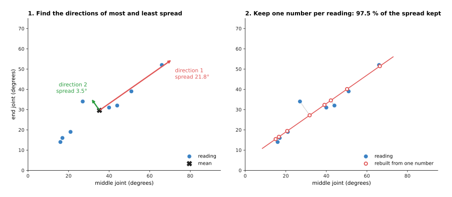
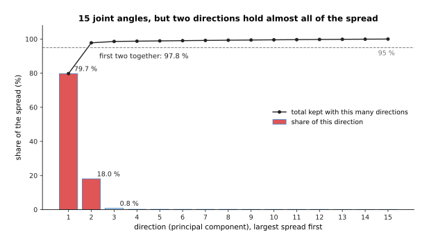
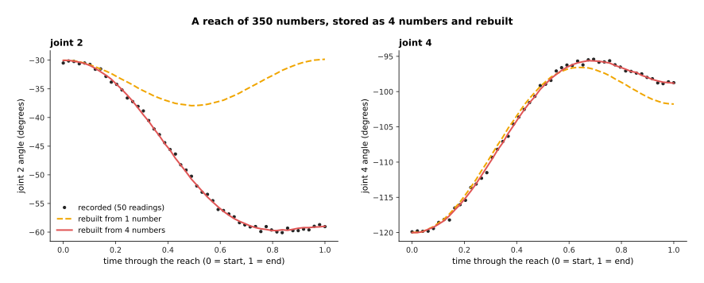
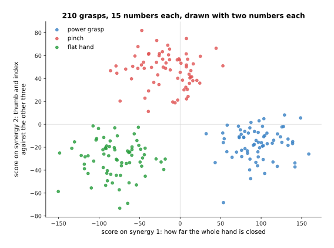

# Principal component analysis: shrinking data to a few numbers

This page explains **principal component analysis (PCA)**. PCA looks at a pile
of examples, each made of many numbers, and finds the few directions in which
the examples differ most. Keeping only those directions turns each example into
a few numbers instead of many. The page answers five questions. What does PCA
find? How does it find it? How many directions should you keep? Where does a
robot arm use it? And what goes wrong?

It is for a reader who has read chapter 1 of this book, in particular
[what a model is](../../01_what-models-are/01_what-a-model-is.md) and
[how a model learns](../../01_what-models-are/02_how-a-model-learns.md). You
need to know what an example is. You do not need labels for this page: PCA
learns from examples alone.

> Before this page, it helps to have read
> [planes: the singular value decomposition](../../../05_programming-techniques/04_fitting-and-estimation/02_most-used/01_least-squares-fitting.md#planes-the-singular-value-decomposition)
> in Book 5. That section finds the directions in which a set of 3D points
> spreads out. PCA is the same calculation, used on any kind of numbers.

Every number on this page comes from a real run of the diagram script
`docs/diagrams/classical_ml_5.py`. The data is simulated, so that we know what
is hidden in it. The method is real, written in NumPy.

## Contents

1. [The idea in one sentence](#1-the-idea-in-one-sentence)
2. [How it works, step by step](#2-how-it-works-step-by-step)
3. [Keeping a few out of many](#3-keeping-a-few-out-of-many)
4. [How it is trained](#4-how-it-is-trained)
5. [Where it is used on a robot arm](#5-where-it-is-used-on-a-robot-arm)
6. [Beyond straight directions: t-SNE, UMAP and autoencoders](#6-beyond-straight-directions-t-sne-umap-and-autoencoders)
7. [What goes wrong](#7-what-goes-wrong)
8. [Libraries](#8-libraries)
9. [Why PCA, and what it costs](#9-why-pca-and-what-it-costs)
10. [The written alternative](#10-the-written-alternative)
11. [Where to read next](#11-where-to-read-next)

---

## 1. The idea in one sentence

PCA finds the directions in which a set of examples varies most, in order from
most to least, so that you can describe each example by how far it lies along
the first few directions and drop the rest.

Here is an everyday example. People stand in a long, straight queue at a bus
stop. To say where each person stands, you could give two numbers: how far east
and how far north. But everyone stands on the same line, so one number is
enough: how far along the queue. The second number, how far a person stands to
the side of the line, is small and tells you little. PCA finds the line of the
queue for you, from the positions alone. It also works when the "positions"
have 15 or 350 numbers instead of two.

The directions PCA finds are called **principal components**. The first
principal component is the direction of most spread. The second is the
direction of most spread that is at right angles to the first, and so on.
"Spread" here means how far the examples lie from their average, measured as
the **variance**: the average of the squared distances from the mean.

---

## 2. How it works, step by step

The example is a robot hand with a finger of three joints. We look at two of
them: the middle joint and the end joint. The hand closes on eight different
objects, and each time the program records the two angles, in degrees. In a
real finger the two joints bend together, so the readings lie close to a line.

| Reading | 1 | 2 | 3 | 4 | 5 | 6 | 7 | 8 |
|---|---|---|---|---|---|---|---|---|
| middle joint | 16 | 27 | 66 | 51 | 17 | 40 | 44 | 21 |
| end joint | 14 | 34 | 52 | 39 | 16 | 31 | 32 | 19 |

Read the table one column at a time: each column is one reading, with two
numbers. PCA then runs these steps.

1. **Find the average of each number.** The mean middle angle is 35.2°, and the
   mean end angle is 29.6°. This is the centre of the readings.
2. **Subtract the average from every reading.** Now the readings sit around
   zero. This step is called **centring**.
3. **Measure how the numbers spread together.** This gives a small table called
   the **covariance matrix**. On its diagonal it holds the variance of each
   number: 323.9 for the middle joint and 165.4 for the end joint. Off the
   diagonal it holds 218.2, which is large and positive. That says the two
   angles tend to go up together.
4. **Find the directions of that spread.** A standard piece of linear algebra,
   the **eigen-decomposition**, turns the covariance matrix into directions and
   the variance along each. NumPy does it with `np.linalg.eigh`. Here it gives
   direction 1 = (0.819, 0.574), which points up and to the right at 35.0°, with
   a variance of 476.9. Direction 2 = (−0.574, 0.819), at right angles to it,
   has a variance of only 12.5.
5. **Describe each reading by its distance along direction 1.** Multiply the
   centred reading by the direction, number by number, and add. The result is
   called the reading's **score**. Reading 3, (66, 52), gets a score of 38.0.
   Reading 1, (16, 14), gets −24.7.
6. **Rebuild a reading from its score, if you need to.** Start at the mean and
   go the score's distance along direction 1. Reading 3 comes back as
   (66.4, 51.4). That is 0.7° from the recorded reading.

The picture below shows the steps. On the left are the readings, their mean and
the two directions. Each arrow is twice as long as the spread along it. On the
right, each reading is dropped straight onto direction 1. Its score is where it
lands.



The spread along direction 1 is 21.8°. The spread along direction 2 is 3.5°.
So direction 1 holds 476.9 / (476.9 + 12.5) = 97.5% of the total variance. By
keeping one number per reading instead of two, we keep 97.5% of the spread. The
rebuilt readings are 2.2° from the recorded ones on average. The worst one,
reading 2, is 8.3° off, because it lies far from the line.

The whole method fits in a few lines of NumPy:

```python
mean = x.mean(axis=0)                     # step 1
centred = x - mean                        # step 2
cov = np.cov(centred.T)                   # step 3
values, vectors = np.linalg.eigh(cov)     # step 4, smallest variance first
order = np.argsort(values)[::-1]          # put the largest first
values, vectors = values[order], vectors[:, order]
scores = centred @ vectors[:, :k]         # step 5: keep k numbers per reading
rebuilt = mean + scores @ vectors[:, :k].T   # step 6
```

Here `x` holds one reading per row, and `k` is how many directions to keep.

---

## 3. Keeping a few out of many

With two numbers, PCA saves one. It becomes useful when each example has many
numbers. The second example is the whole hand: five fingers with three joints
each, so 15 joint angles per posture. The hand grasps 210 objects. Seventy are
held in a **power grasp**, with the whole hand wrapped round the object. Seventy
are held in a **pinch**, between thumb and index finger. Seventy are touched
with a **flat hand**.

In this simulation, every posture is made from a resting posture, two hidden
patterns and a weak third one, plus 3° of random noise on each joint. PCA is not
told this. It sees only 210 rows of 15 numbers.

PCA gives 15 directions, one for each number. The picture below shows the share
of the total variance that each direction holds, and the running total.



The first direction holds 79.7% of the spread. The second holds 18.0%. Together
they hold 97.8%. The third holds only 0.8%, and each of the other twelve holds
0.2% or less, which is the noise.

A common rule is to keep enough directions to hold 95% of the variance. Here
that is two. Another rule is to look for the **elbow**: the point where the bars
drop and then stay low. Here the elbow is after direction 2 as well.

What do the two directions mean? Each direction is a list of 15 weights, one per
joint. The table below gives them. Read each row as one finger, with the
weights for its base, middle and end joints.

| Finger | Direction 1 (base, middle, end) | Direction 2 (base, middle, end) |
|---|---|---|
| thumb | +0.26, +0.29, +0.22 | +0.35, +0.36, +0.27 |
| index | +0.26, +0.29, +0.21 | +0.32, +0.35, +0.20 |
| middle | +0.27, +0.29, +0.22 | −0.12, −0.12, −0.13 |
| ring | +0.27, +0.29, +0.22 | −0.23, −0.23, −0.24 |
| little | +0.27, +0.29, +0.22 | −0.25, −0.25, −0.28 |

Direction 1 bends every joint by about the same amount. It means "close the
whole hand". Direction 2 bends the thumb and index finger and straightens the
other three. It means "pinch". In hand research, such a pattern of joints that
move together is called a **synergy**. PCA found both synergies from the
postures alone.

Keeping few directions loses a little. If each posture is rebuilt from one
number, the joints are 10.1° wrong on average, measured as the **root mean
square (RMS)** error: square each error, average, and take the square root.
With two numbers the error drops to 3.3°. With three it is 2.7°, which is about
the size of the noise that was added. More directions would only copy the noise.

---

## 4. How it is trained

PCA needs no labels. It learns from the examples alone, so it is called an
**unsupervised** method. Its "training" is the calculation in section 2: find
the mean, find the covariance matrix, and find its directions. There is no
repeated nudging of weights and no learning rate. The answer is the same every
time for the same data.

What it learns is the mean and the directions. For the hand, that is 15 numbers
for the mean and 15 for each kept direction. After that, turning a new posture
into its scores is one subtraction and one multiplication.

How much data does it need? More examples than numbers per example is the
minimum. With fewer, some directions cannot be found at all. Several times more
examples than numbers is a safer start: the hand used 210 examples for 15
numbers. The examples must also cover the situations the robot will meet,
because PCA only finds the directions it sees.

The calculation is cheap. For a few thousand examples of a few hundred numbers
it takes well under a second. For very wide data, such as camera pictures, the
program usually uses the **singular value decomposition (SVD)**,
`np.linalg.svd`, straight on the centred data. It gives the same directions
without building the large covariance matrix first.

One choice matters a lot: the units. PCA measures spread in the units it is
given. If one column is a joint angle in degrees and another is a force in
newtons, the column with the larger numbers wins, whatever it means. So the
program first **standardises** each column when units differ: it subtracts the
column's mean and divides by the column's spread. Then every column counts
equally.

---

## 5. Where it is used on a robot arm

### Finding a surface's normal

A **normal** is the direction straight out of a surface. The arm needs it to
push a suction cup square onto a box, or to line up a tool with a wall. The
program takes a small patch of 3D points from the depth camera and runs PCA on
their x, y and z values. The points spread widely in two directions along the
surface and hardly at all out of it. So the direction of least spread, the last
principal component, is the normal.

Book 5 uses exactly this. [Iterative closest point](../../../05_programming-techniques/03_searching-and-matching/02_most-used/02_iterative-closest-point.md#51-surface-normals)
finds a normal at every point of a scan from its nearest neighbours, and
[least-squares fitting](../../../05_programming-techniques/04_fitting-and-estimation/02_most-used/01_least-squares-fitting.md#planes-the-singular-value-decomposition)
fits a whole plane this way, with a real run on 150 points. The same directions
for a whole object give its long axis and its thin axis, which tells a gripper
which way to close. Book 1 shows this for a bar in
[which way an object lies](../../../01_robotics-intro/01_python-and-numpy/02_numpy-intro.md#67-which-way-an-object-lies-cov-and-eigh),
and Book 2 fits a box to an object with it in
[an oriented box round the point cloud](../../../02_perception/02_object-perception/03_programmed-methods.md#26-an-oriented-box-round-the-point-cloud).

### Compressing joint and force signals

A recorded movement has many numbers. Take a 7-joint arm that reaches from a
home posture to an object. If each joint is recorded 50 times during the reach,
one reach is 7 × 50 = 350 numbers. In this simulation, 300 reaches were
recorded. Each one goes to a different place on the table and lifts a little
over whatever is in the way. Behind each reach there are only four hidden
numbers: three for where the object is, and one for how high the lift is. There
is also 0.3° of sensor noise on every reading.

PCA was trained on 250 of the reaches and tested on the other 50. The first
three directions hold 99.53% of the variance, and the first four hold 99.96%.
The picture below shows one test reach, rebuilt from its scores.



With one number, the rebuilt reach is 10.26° RMS off, and the worst joint is
82.30° off: one number cannot say where the object is. With four numbers, the
error is 0.30° RMS, the same as the sensor noise, and the worst reading is
1.33° off. So each reach can be stored or sent as 4 numbers instead of 350. The
program must also keep the mean reach and the four directions, but those are
stored once, for all the reaches.

The same works for a window of force readings. A wrist force sensor gives six
numbers per reading, and a 100-reading window is 600 numbers. PCA can squeeze
such a window into a few scores. The scores then go into a smaller learned
model, such as a
[decision tree](../02_most-used/02_decision-trees-and-forests.md) that
tells "in contact" from "free", or a
[hidden Markov model](01_mixture-models-and-hidden-markov-models.md) that
follows the steps of an insertion. Fewer input numbers means the model needs
fewer examples to learn.

### A few synergies for a many-jointed hand

Section 3 found that two synergies describe a 15-joint hand well. A robot can
use that the other way round. Instead of controlling 15 joints, the controller
sends two numbers: how far to close, and how much to pinch. Each number moves
every joint by its weight in the synergy. This makes a many-jointed hand much
easier to drive by a person with a joystick, or by a planner that searches over
grasps.

This idea comes from real hands. A well-known 1998 study by Santello, Flanders
and Soechting recorded people shaping their hands to hold many objects. It
found that the first two principal components held more than 80% of the
variance of the joint angles. Some robot hands are built on it: the Pisa/IIT
SoftHand closes all its fingers with a single motor, along one synergy.

### Looking at a dataset

People cannot see 15 numbers at once. But they can see two. Plotting each
example by its first two scores gives a picture of the whole dataset. The
picture below does this for the 210 hand postures, coloured by grasp type.



The three grasp types form three separate groups. Power grasps lie to the right,
where the hand is most closed. Pinches lie at the top. Flat hands lie low and to
the left. Such a picture shows at a glance whether the grasp types can be told
apart, whether some examples are odd, and whether a new batch of recordings
looks like the old one. A [Gaussian mixture model](01_mixture-models-and-hidden-markov-models.md)
could then find the three groups from these two scores without being told the
grasp types.

### Shrinking the input for another model

Methods that compare examples by distance, such as
[nearest neighbours](../02_most-used/04_nearest-neighbours-and-locally-weighted-regression.md)
and [Gaussian processes](../02_most-used/03_gaussian-processes-and-bayesian-optimisation.md),
work poorly when each example has hundreds of numbers. In that many numbers,
every example is far from every other, and the noise in the unimportant numbers
drowns the important differences. Running PCA first, and feeding only the first
few scores to the next model, is a common fix.

---

## 6. Beyond straight directions: t-SNE, UMAP and autoencoders

PCA only finds straight directions. Some data lies on a curved surface instead,
such as the postures of an arm that turns all the way round. PCA then needs many
directions to describe something that has only a few real degrees of freedom.
Three other tools are often named next to PCA.

**t-SNE**, short for "t-distributed stochastic neighbour embedding", and
**UMAP**, short for "uniform manifold approximation and projection", draw each
example as a point in two dimensions. They try to keep examples that were close
together close in the picture. They often show groups that PCA's picture hides.
But they are for looking only. The distances between groups in their pictures
mean little, the picture changes with their settings and with the random start,
and they cannot turn a new example into a point without running again. So
engineers use them to look at a dataset, and PCA to shrink data inside a
running program.

An **autoencoder** is the learned, curved version of PCA. It is a neural network
with an encoder, which squeezes an example into a short code, and a decoder,
which rebuilds the example from the code. Training makes the rebuilt example as
close to the original as it can. An autoencoder whose two halves are each one
plain weighted sum, with no simple rule after it, learns to keep the same
directions as PCA. With more layers it can
follow curved data, and it can squeeze a whole camera picture into a few
numbers. Book 6 shows this inside a
[latent world model](../../08_world-models/03_also-used/03_latent-world-models.md#squeezing-a-picture-into-a-code),
and [encoders and decoders](../../01_what-models-are/03_inside-a-neural-network.md#7-encoders-and-decoders)
explains the two halves. The price is the usual price of a network: many more
examples, training that takes a long time, and a code whose numbers have no
clear meaning.

---

## 7. What goes wrong

**Mixed units give the wrong directions.** A column in millimetres beats a
column in metres, only because its numbers are larger. The fix is to
standardise each column first, as section 4 describes, or to choose units that
make the columns similar in size.

**Forgetting to centre gives a wrong first direction.** Without step 2, the
first direction points from zero to the average of the data, not along its
spread. Libraries centre for you. Code written by hand must do it.

**A few bad readings pull the directions.** One depth point on the wall behind a
box can turn the box's normal by several degrees, because PCA squares the
distances. The fix is to remove outliers first, for example with
[RANSAC](../../../05_programming-techniques/04_fitting-and-estimation/02_most-used/02_ransac.md),
or to fit the normal to a smaller patch.

**The largest spread is not always the useful part.** PCA keeps what varies
most, not what matters most for the job. If a slip shows up as a tiny ripple in
the force signal, PCA may put the ripple in a dropped direction. The fix is to
check that the next model still works after the shrinking, and to keep more
directions if it does not.

**Each direction's sign is arbitrary.** A direction and its opposite describe
the same spread, so a library may return either one, and it may change when the
data changes a little. A normal may point into the table instead of out of it.
The fix is a written rule, for example "turn every normal to face the camera".

**New data may not look like the old data.** If the arm gets a new gripper, its
postures move into directions PCA never saw. The scores then hide the change.
A useful check is the rebuild error: when a new example rebuilds badly, it is
unlike the training data, and the program should warn.

**Curved data needs many directions.** As section 6 says, PCA is straight. If
the variance keeps falling slowly across many directions, the data may be
curved, and an autoencoder may do better.

---

## 8. Libraries

- **NumPy** has everything needed for small jobs: `np.cov`, `np.linalg.eigh`
  and `np.linalg.svd`. The code in section 2 is complete.
- **scikit-learn** has `sklearn.decomposition.PCA`. You give it the number of
  directions to keep, call `fit` on the training data and `transform` on new
  data, and read the share of variance from `explained_variance_ratio_`.
  `inverse_transform` rebuilds examples from their scores. `IncrementalPCA`
  learns from data that arrives in batches, and `KernelPCA` handles some kinds
  of curved data. `sklearn.preprocessing.StandardScaler` does the
  standardising.
- **Open3D** estimates the normal at every point of a point cloud with
  `estimate_normals`, and **PCL**, the Point Cloud Library, does it with its
  `NormalEstimation` class. Both use the smallest direction of each point's
  neighbours, as section 5 describes.
- **scikit-learn** also has `sklearn.manifold.TSNE`, and the **umap-learn**
  package has `umap.UMAP`, for the pictures in section 6.
- **PyTorch** is the usual library for building an autoencoder.

---

## 9. Why PCA, and what it costs

This section answers the four questions for PCA: what it is, what it does for
you, why it rather than the obvious alternative, and what it costs.

PCA is a calculation that finds the directions in which a set of examples
varies most. It lets you describe each example with a few numbers instead of
many, find a surface's normal, drive a hand with a few synergies, and draw a
whole dataset in one picture.

The first obvious alternative is to keep some of the numbers and drop the rest
by hand, for example to record only three of the seven joints. That throws away
whatever the dropped numbers held. PCA instead mixes all the numbers into a few
new ones and keeps the most spread possible for that count. In the reach
example, four PCA scores rebuild all 350 numbers to within the sensor noise,
while one kept joint says nothing about the other six.

The second obvious alternative is an autoencoder. It can follow curved data,
which PCA cannot. But it needs thousands of examples, training, and a choice of
network size. PCA needs no training loop, has no settings but the number of
directions, gives the same answer every time, and its directions can be read,
as the synergy table in section 3 shows. Try PCA first. Move to an autoencoder
when PCA needs too many directions.

The costs are these. PCA only finds straight directions. It keeps the largest
spread, which may not be the part your job needs. It depends on the units of
each column, so you must choose a scaling. Each score is a mix of all the
original numbers, so a score is harder to explain than a single joint angle.
And you must store the mean and the directions next to the data, and use the
same ones for every new example.

---

## 10. The written alternative

For surfaces, PCA is itself the written method. Book 5's
[least-squares fitting](../../../05_programming-techniques/04_fitting-and-estimation/02_most-used/01_least-squares-fitting.md#planes-the-singular-value-decomposition)
fits a plane to points with the SVD, and the plane's normal is PCA's last
direction. Nothing is learned there that a person could not also write down.

For movements, the written alternative is to describe each move by the few
numbers that made it. Book 5's
[trajectory generation](../../../05_programming-techniques/07_control-and-motion/02_most-used/02_trajectory-generation.md#the-s-curve-profile)
builds a whole move from its start, its goal and its limits, so the goal
posture already is a short description of the move. That wins whenever your own
program made the moves. PCA wins when the moves were recorded from a person or
a learned policy, and nobody knows which few numbers made them.

For force and sensor signals, the written alternative is to pick the summary
numbers by hand, such as the smoothed force and its slope from Book 5's
[sensor streams](../../../05_programming-techniques/04_fitting-and-estimation/02_most-used/04_sensor-streams.md).
Hand-picked numbers have a clear meaning and need no data. PCA wins when you do
not know which features matter, and have recordings to learn from.

---

## 11. Where to read next

- [Mixture models and hidden Markov models](01_mixture-models-and-hidden-markov-models.md)
  find groups and steps in data, often after PCA has shrunk it.
- [Movement primitives](02_movement-primitives.md) describe a whole movement
  with a few weights, and learn how those weights vary across demonstrations,
  which is close to what section 5 did with PCA.
- [Nearest neighbours and locally weighted regression](../02_most-used/04_nearest-neighbours-and-locally-weighted-regression.md)
  works better after PCA has removed the unimportant numbers.
- [Latent world models](../../08_world-models/03_also-used/03_latent-world-models.md)
  show the learned, curved version of PCA: an encoder that squeezes a camera
  picture into a short code.
- [Least-squares fitting](../../../05_programming-techniques/04_fitting-and-estimation/02_most-used/01_least-squares-fitting.md)
  in Book 5 fits planes with the same calculation, and
  [iterative closest point](../../../05_programming-techniques/03_searching-and-matching/02_most-used/02_iterative-closest-point.md)
  uses its normals to line up two scans.
- The [overview of classical machine learning](../01_overview.md) puts PCA
  next to the other methods of this chapter.
