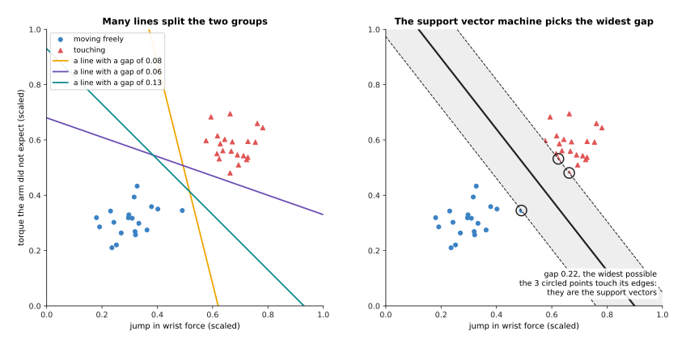
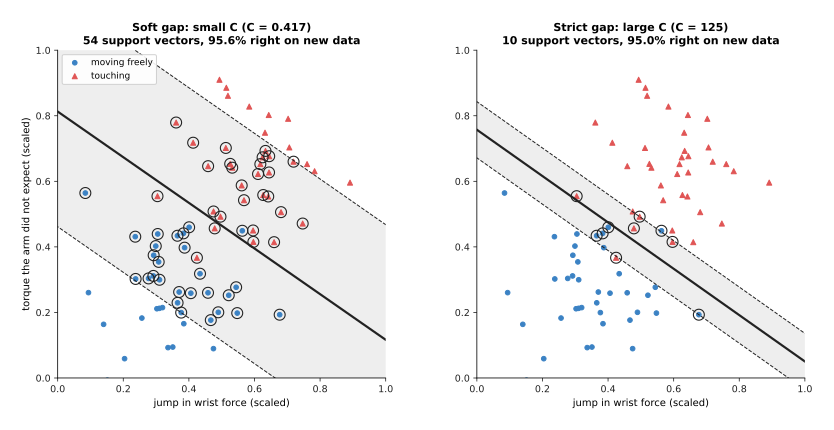
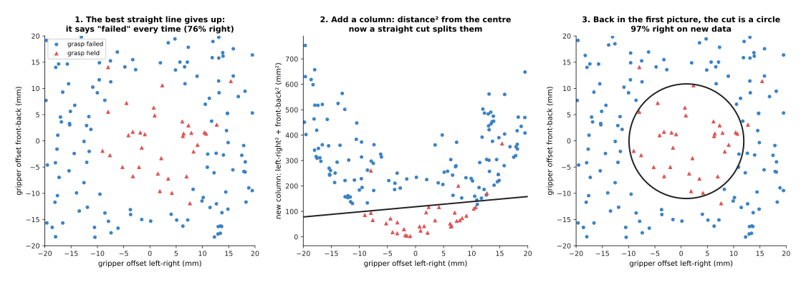
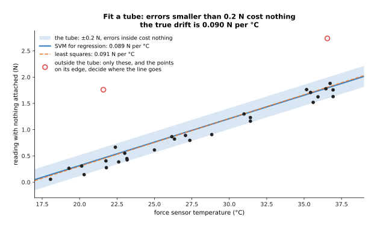

# Support vector machines

This page explains support vector machines (SVMs): classifiers that split two
groups of examples with the line that leaves the widest possible gap between
them. It answers five questions, and the sections below take them in turn. Which
line does an SVM choose, and why? What happens when the groups overlap? How can
it draw a curved boundary? Where were SVMs used on robot arms? And why do trees
and small networks usually do their job today?

It is for a reader who has read Book 6 chapter 1, in particular
[how a model learns](../../01_what-models-are/02_how-a-model-learns.md). So you
need to know what an example, a label, a feature and overfitting are. It also
helps to have read
[linear and logistic regression](../02_most-used/01_linear-and-logistic-regression.md),
because a linear SVM also scores an input with a weighted sum of its features.

SVMs were the most common classifier in robotics research from the late 1990s to
the early 2010s. But they are in the "also used" group of this chapter, because
new projects seldom choose them now. You will still meet them in older papers,
in older code, and in a few small problems where they remain a sound choice.

Every number on this page comes from a real run of the diagram script
`docs/diagrams/classical_ml_2.py`. The data is simulated from a made-up rule, so
that the true answer is known. But the SVM itself is real, and it is trained in
NumPy.

## Contents

1. [The idea in one sentence](#1-the-idea-in-one-sentence)
2. [How it works](#2-how-it-works)
   · [The widest gap](#the-widest-gap)
   · [The soft margin: when the groups overlap](#the-soft-margin-when-the-groups-overlap)
   · [The kernel trick: curved boundaries](#the-kernel-trick-curved-boundaries)
   · [SVMs for predicting a number](#svms-for-predicting-a-number)
3. [How it is trained: what data, and how much](#3-how-it-is-trained-what-data-and-how-much)
4. [Where it was used on a robot arm](#4-where-it-was-used-on-a-robot-arm)
5. [What goes wrong](#5-what-goes-wrong)
6. [Libraries](#6-libraries)
7. [Why an SVM, and what it costs](#7-why-an-svm-and-what-it-costs)
8. [The written alternative](#8-the-written-alternative)
9. [Where to read next](#9-where-to-read-next)
10. [Using it in Python](#10-using-it-in-python)

---

## 1. The idea in one sentence

A **support vector machine** separates two groups of examples with the straight
line that stays as far as possible from the nearest example on each side.

For example, a council paints a line down the middle of a park path to separate
walkers from cyclists, and it could paint that line anywhere between the two
streams of people. The sensible place is right in the middle of the gap, as far
from both streams as it can be. Then a walker who drifts a little to one side
still ends up on the walkers' half. The SVM makes the same choice for data,
so a new example that lands a little off from the training examples is still
likely to fall on the right side.

---

## 2. How it works

Section 1 said the SVM stays as far as it can from both groups, so this section
says how it finds that place. The example on this page is contact detection,
where a robot arm moves through free space and sometimes touches something. From
its sensors the program computes two **features**, each scaled to run from about
0 to 1:

- the **jump in wrist force**: how much the force at the wrist sensor changed in
  the last few milliseconds;
- the **unexpected torque**: the gap between the torque the arm's joints measure
  and the torque the arm's model says it should need.

Each example is one short moment, labelled "touching" or "moving freely".

### The widest gap

A linear SVM gives each feature a weight, multiplies, adds the results and then
adds a constant, and the result is called the **score**. A positive score means
"touching", while a negative score means "moving freely". So the points where
the score is exactly zero form a straight line, which is the **decision
boundary**. With three features it is a flat plane, and with more it is the same
idea in more directions.

When the two groups do not overlap, many lines separate them, and the picture
below shows 40 examples with three lines that all split them without a mistake.



Each of the three lines on the left passes close to some example. The **gap**,
or **margin**, of a line is the width of the empty band around it, from the
nearest example on one side to the nearest on the other. These three lines have
gaps of 0.08, 0.06 and 0.13. The SVM chooses the line with the widest
possible gap, which here is 0.22 wide, shown shaded on the right.

Only three examples touch the edges of the gap, and they are circled. These are
the **support vectors**, and they give the method its name. The line depends
only on them, so you could move or delete any of the other 37 examples, as long
as it stayed outside the gap, and the line would not change.

The SVM sets its weights so that the score is exactly +1 on one edge of the gap
and −1 on the other. The larger the weights, the faster the score changes across
the plane, and so the narrower the band between −1 and +1. So "make the gap as
wide as possible" becomes "make the weights as small as possible, while every
example still has a score of at least +1 or at most −1 on its own side".

### The soft margin: when the groups overlap

The widest gap only exists if there is a gap at all, and real data overlaps. A
light touch can look like free motion, and a fast turn can look like a touch.
Then no line separates the groups, so the rule above has no answer.

The **soft margin** lets some examples sit inside the gap, or even on the wrong
side, but it charges a cost for each one. The cost is zero for an example
outside the gap on its own side. It then grows in a straight line with how far
the example sits inside the gap or beyond it. This cost is called the
**hinge loss**, because its graph is flat and then bends upward, like an opened
hinge.

The SVM now balances two wishes, which are a wide gap and a small total cost,
and a setting called **C** decides the balance. A large C makes each example
inside the gap expensive, so the SVM narrows the gap to keep examples out. A
small C makes them cheap instead, so the SVM keeps a wide gap and lets many
examples in.

The script trained two SVMs on the same 80 overlapping examples, and tested each
on 4,000 new ones.



The table below gives the results. Read each row as one setting of C.

| Setting | Gap width | Support vectors | Training examples on the wrong side | Right on new data |
| --- | --- | --- | --- | --- |
| C = 0.42, soft | 0.58 | 54 | 4 | 95.6% |
| C = 125, strict | 0.14 | 10 | 2 | 95.0% |

With a soft margin, every example inside the gap or on the wrong side is also a
support vector, so there are many more of them. The soft line rests on 54
examples rather than 10, so one odd example moves it less, and here that gave a
slightly better score on new data. The two lines are close, but that is not
always so. As with the depth of a tree, the right C is found by trying several
and testing each on examples it did not train on.

### The kernel trick: curved boundaries

A soft margin copes with overlap, but sometimes no straight line can do the job
at all. The next example is about grasping, where a gripper closes on a small
object. The features are how far the gripper's centre was from the object's
centre, left-right and front-back, in millimetres. The made-up rule is that the
grasp holds when the gripper is within 11 millimetres of the centre, in any
direction. So the "held" examples form a disc in the middle, with "failed"
examples all around it.



The left panel shows a linear SVM on the two offsets, because no straight line
can put a disc on one side and a ring on the other. The best it can do is to
call every grasp a failure. Since 76% of the new grasps did fail, that scores
76%, but it is useless.

The middle panel adds a third column, which is the left-right offset squared
plus the front-back offset squared, and that is the squared distance from the
centre. In this new column every "held" example has a small value and every
"failed" example a large one, so now a straight cut works. The right panel shows
the same cut back in the original picture, where it is a circle, with a radius
of about 10.9 millimetres against the true 11. This SVM gets 97.3% of the new
grasps right.

The script built the new column by hand, but the **kernel trick** is a way to
get the same effect without building the columns at all. The training and the
prediction of an SVM can be written so that they never need the features on
their own, because they only need a similarity number between pairs of examples.
A **kernel** is a formula that gives this number directly from the original
features, and each kernel matches some set of extra columns. So with the right
kernel the SVM works as if it had many extra columns, even an endless number,
while computing only one number per pair of examples.

The most used kernel is the **radial basis function (RBF) kernel**, which says
that two examples are similar when they are close together and that the
similarity fades with distance. An SVM with this kernel can draw almost any
smooth boundary. It has one more setting, often called gamma, that says how fast
the similarity fades, and a large gamma gives a wiggly boundary that can
overfit. The
[Gaussian processes](../02_most-used/03_gaussian-processes-and-bayesian-optimisation.md)
page uses the same kind of kernel, for the same reason.

### SVMs for predicting a number

Everything so far predicted a class, but an SVM can also predict a number, which
is called **support vector regression (SVR)**. Instead of a gap that should stay
empty, it fits a **tube** around a line, and examples should stay inside that
tube. Errors smaller than the tube's half-width cost nothing, while larger
errors cost in a straight line with their size. As before, only the examples on
the tube's edge or outside it decide where the line goes.

The script fitted a linear SVR to 30 readings of a force sensor with nothing
attached, at different sensor temperatures, because the reading drifts as the
sensor warms up. Two of the readings were hit by a knock, so they are far too
high.



The tube's half-width is 0.2 newtons, so only the 2 knocked readings sit outside
it. The SVR found a drift of 0.089 newtons per degree, against the true 0.090,
while plain least squares found 0.091, which is just as good here. So SVR is
seldom the best choice for a number on a robot, because ridge regression,
Gaussian processes and trees usually do the job with less tuning.

---

## 3. How it is trained: what data, and how much

Section 2 showed what an SVM produces, and this section says what it needs to
get there. An SVM needs a table of examples, as a tree does, where each row is
one example, each column one number, and the label is one of two classes. For
more than two classes, libraries train one SVM per pair of classes, or one per
class against the rest, and then combine their answers.

Training means choosing the weights. For a linear SVM the quantity to make small
is the size of the weights, which keeps the gap wide. To that it adds the
average hinge loss over the examples, which keeps examples out of the gap. The
script does this with **subgradient descent**. It is the same as the gradient
descent in
[how a model learns](../../01_what-models-are/02_how-a-model-learns.md), with
one detail: the hinge loss has a sharp bend, where the slope is not defined, so
the script uses the slope on one side of the bend. The steps are:

1. Start with all of the weights at zero.
2. Then find every example that is inside the gap or on the wrong side.
3. Then move the weights a little toward scoring those examples correctly, and
   shrink all the weights a little, which widens the gap.
4. Then make the step a little smaller than last time, and go back to step 2.

The script ran 40,000 to 100,000 such steps, and that took a few seconds. But
libraries use faster, exact methods for the same problem.

Kernel SVMs are trained in a different form, which works with the similarity of
every pair of examples, and that is why they slow down so much as the data
grows. A few thousand examples train in seconds, while tens of thousands take
minutes. So beyond about a hundred thousand, a kernel SVM is usually too slow,
and people switch to a linear SVM, trees or a network.

So SVMs do well with small datasets, from a few dozen to a few thousand
examples. The columns must be scaled to similar ranges first, for example each
to run from 0 to 1, because otherwise the column with the largest numbers
decides what "wide" means.

---

## 4. Where it was used on a robot arm

Section 3 said an SVM wants a small table of scaled numbers, and five jobs on an
arm used to look exactly like that. **Grasp classifiers.** Before deep learning,
many grasp studies described each candidate grasp with a hand-made list of
numbers, such as the object's shape, the hand's pose and the finger positions,
and an SVM then learned which ones would hold. Pelossof and others, in "An SVM
learning approach to robotic grasping" (2004), is an early example. Today
networks score grasps straight from a picture or a point cloud, as in
[grasp quality models](../../05_grasp-models/03_also-used/02_grasp-quality-models.md).

**Contact, slip and material classifiers.** Features from force sensors or
tactile sensors, such as how much the signal shakes or how fast it changes, went
into an SVM that said "slip" or "hold", or that named the material being
touched. This is a small-feature problem, so an SVM fits it well. The page
[force and slip models](../../09_touch-and-body-models/02_most-used/01_force-and-slip-models.md)
describes the modern versions.

**Collision detection.** A few numbers from the joints, such as the gap between
expected and measured torque, went into an SVM that told a collision from normal
motion. The page
[collision and failure detection](../../09_touch-and-body-models/02_most-used/02_collision-and-failure-detection.md)
covers this job.

**Finding objects in pictures.** A well-known detector from 2005, by Dalal and
Triggs, described each patch of a picture with a list of edge directions and
used a linear SVM to decide whether it held a person. Robots used detectors
built the same way to find objects, until the network-based detectors in
[object detection](../../03_seeing-models/02_most-used/01_object-detection.md)
replaced them.

**A small head on a big network.** A linear SVM can still sit on top of the list
of numbers a pretrained network makes from a picture, to learn a few new classes
from a few dozen examples. But logistic regression does the same job and gives a
chance, so it is the more common choice.

---

## 5. What goes wrong

Section 4 listed where SVMs were used, and this section lists how they fail,
because each problem below has a usual fix. Unscaled columns spoil the gap. If
one column is in newtons from 0 to 50 and another is in radians from 0 to 0.1,
the gap is measured almost entirely in newtons. So the fix is to scale every
column to a similar range before training, and to scale new inputs the same way.

The settings matter a lot, because C, and for the RBF kernel gamma, can move the
score on new data from poor to good. So the fix is to try a grid of values and
test each of them on held-out examples.

There is no chance, only a score, because an SVM says which side of the line an
example is on and how far, but it does not say how likely each class is. A robot
that must weigh a 60% chance of slip against the cost of squeezing harder needs
a chance. So the fix is an extra fitting step that turns scores into chances,
called **Platt scaling**, which scikit-learn runs when you set
`probability=True` in `SVC`. Or use logistic regression or trees instead, which
give chances directly.

Kernel SVMs are slow on large data, because training time grows much faster than
the number of examples, and every prediction compares the input with every
support vector. So the fix is a linear SVM, or a switch to boosted trees or a
network.

It cannot read raw input, because like the other methods in this chapter an SVM
needs a short list of meaningful numbers. Feeding it raw pixels or a raw force
recording works poorly. So the fix is to compute good features first, or to use
a network.

---

## 6. Libraries

You would use a library rather than write subgradient descent yourself, so the
table below lists the real ones for SVMs. Read each row as one library: what it
provides, and when to use it.

| Library | What it provides | When to use it |
| --- | --- | --- |
| scikit-learn | `SVC`, `LinearSVC`, `SVR` and `LinearSVR` in `sklearn.svm` | the place to start, in Python |
| LIBSVM | kernel SVMs in C++, with interfaces for many languages | the library behind scikit-learn's `SVC`; use it directly from C++ |
| LIBLINEAR | linear SVMs and logistic regression in C++ | fast on large, linear problems; behind `LinearSVC` |
| OpenCV | `cv::ml::SVM` in C++, `cv2.ml.SVM_create()` in Python | when the robot program already uses OpenCV |

In scikit-learn, put `StandardScaler` from `sklearn.preprocessing` and the SVM
in one `Pipeline` from `sklearn.pipeline`. The pipeline then scales new inputs
the same way as the training data, which fixes the first problem in section 5.

---

## 7. Why an SVM, and what it costs

The libraries make an SVM cheap to try, so this section answers the four
questions: what an SVM is, what it does for you, why it rather than the obvious
alternative, and what it costs.

An SVM is a classifier that chooses the boundary with the widest gap, and with a
kernel it can draw curved boundaries as well. It gives a good yes-or-no answer
from a small table of scaled numbers, and its answer depends only on the few
examples near the boundary.

In its time it won over the alternatives of the day. It found good boundaries
from a few hundred examples, and it was hard to overfit with a sensible C. Its
training also always reaches the single best answer, so two runs give the same
result. Neural networks of that time, by contrast, were hard to train and
needed more data.

Today the obvious alternatives usually win:

- **Boosted trees**, on the
  [decision trees and forests](../02_most-used/02_decision-trees-and-forests.md)
  page, handle columns in different units without scaling, train quickly on
  millions of rows, give chances, and report which columns mattered. So on most
  tables they match or beat an SVM with less tuning.
- **Small neural networks** learn their own features from raw signals and
  pictures, so nobody has to design the list of numbers, and that design work
  was most of the effort in an SVM project.
- **Logistic regression** does the linear SVM's job and gives a chance as well.

But an SVM is still a reasonable choice for a small, clean table of well-scaled
features, of a few hundred to a few thousand rows, where a curved boundary is
needed and you have time to tune C and gamma.

What it costs:

- You must scale the columns and tune C, and for a kernel also gamma.
- It gives a score, not a chance, without an extra step.
- Kernel SVMs become slow beyond tens of thousands of examples.
- A kernel SVM is hard to read. You cannot easily say which columns mattered.
- Someone must design the features.

---

## 8. The written alternative

Section 7 compared an SVM with other learned models, but Book 5 detects contact
without learning at all. The guarded moves in
[impedance and force control](../../../05_programming-techniques/07_control-and-motion/03_also-used/01_impedance-and-force-control.md)
stop the arm when the measured force passes a set limit. The power and force
limits in
[safety monitoring](../../../05_programming-techniques/07_control-and-motion/02_most-used/04_safety-monitoring.md#power-and-force-limiting)
do the same for the whole arm. So each of these is a boundary set by hand, which
means one threshold on one number, or a straight line through two numbers.

A linear SVM is the learned version of that line. The hand-set line wins when
one or two numbers clearly show contact, because it needs no data and a person
can check it. But the learned line wins when the right place for it depends on
the arm, the tool and the speed in ways that are hard to work out by hand. So a
useful middle way is to train the SVM, read its weights, and then fix a
hand-checked line close to it.

---

## 9. Where to read next

- [Decision trees and forests](../02_most-used/02_decision-trees-and-forests.md)
  covers the methods that replaced SVMs for most tables.
- [Linear and logistic regression](../02_most-used/01_linear-and-logistic-regression.md)
  covers the other linear classifier, which gives a chance.
- [Gaussian processes and Bayesian optimisation](../02_most-used/03_gaussian-processes-and-bayesian-optimisation.md)
  uses the same kind of kernel, to give a prediction with an error bar.
- [The overview of this chapter](../01_overview.md) compares classical methods
  with a small network as the data grows.
- [Collision and failure detection](../../09_touch-and-body-models/02_most-used/02_collision-and-failure-detection.md)
  covers contact detection with learned models today.

---

## 10. Using it in Python

Section 2 explained the widest gap, the soft margin and the kernel trick, and
section 6 named the libraries. This section shows the calls, and the whole of
section 2 turns out to be three arguments. After reading it you will be able to
train a support vector machine and choose its two settings properly.

```python
from sklearn.svm import SVC
from sklearn.preprocessing import StandardScaler
from sklearn.pipeline import make_pipeline
from sklearn.model_selection import GridSearchCV

# StandardScaler first, for the reason section 5 gave.
model = make_pipeline(StandardScaler(), SVC(kernel="rbf", C=1.0, gamma="scale"))

# Try every combination and keep the best by 5-fold cross-validation.
grid = {"svc__C": [0.1, 1, 10, 100], "svc__gamma": [0.001, 0.01, 0.1, 1]}
search = GridSearchCV(model, grid, cv=5).fit(X, y)
print(search.best_params_)
print(search.best_score_)
```

The double underscore in `"svc__C"` is how scikit-learn addresses a setting
inside one step of a pipeline, and the name `svc` before it is the step name that
`make_pipeline` builds from the lowercased class name. So `"svc__C"` means the
`C` of the `SVC` step, and writing it that way lets `GridSearchCV` vary the
model's settings while the scaling still happens separately inside each fold.

The library gives you the whole optimisation. `kernel="rbf"` is section 2's
kernel trick as a single string, `C` is its soft margin, and `gamma` is how
quickly the bell-shaped kernel falls off with distance. Underneath, scikit-learn
calls LIBSVM, which section 6 named, so none of the solving is yours.
`gamma="scale"` is a starting value worked out from the spread of your own data
rather than a fixed number, which is why it is the default.

What you have to collect is `X` and `y`, and what you must not forget is the
scaling, because section 5 listed unscaled columns as the first thing that
spoils the gap. If you need a chance rather than a side of the boundary, pass
`probability=True` to `SVC`, which runs the Platt scaling that section 5
described, but expect `fit` to take several times longer, because that extra
fitting is itself done by cross-validation inside the call.

What you have to decide is `C` and `gamma`, and the code above is the honest way
to do it. Section 5 said that these settings matter a lot and that the fix is to
try a grid of values and test each on held-out examples, so a search like this is
the method rather than a refinement of it. The cost is that the search fits the
model 16 x 5 = 80 times, which is quick on the few hundred to few thousand rows
that section 7 says an SVM suits, and slow enough on more to be one reason the
method was left behind.
