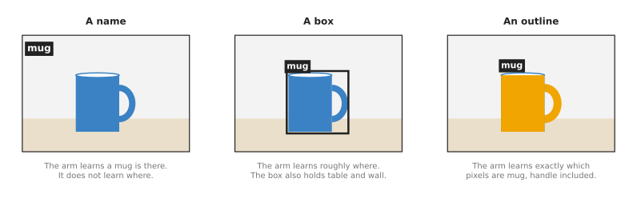
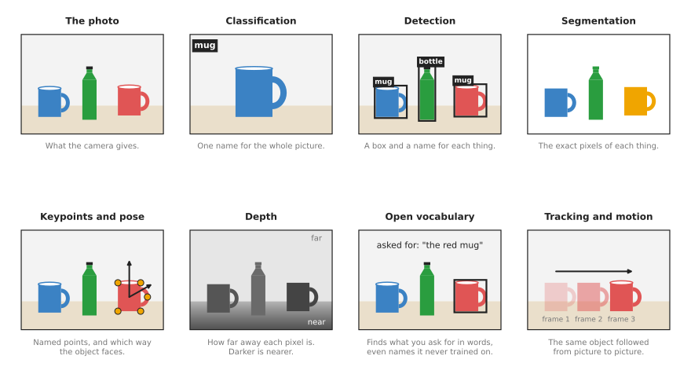

# Seeing models: an overview

This page opens the chapter on seeing models, which are the models that turn a
picture into names, boxes, outlines, poses or depth. They are the first of the
seven kinds of model in this book, and a robot arm with a camera almost always
uses at least one of them.

The page answers four questions: what seeing models are for, what question they
answer for a robot arm, what kinds there are and how they differ, and how they
connect to the other kinds of model in this book.

It is written for a reader who has already read the first chapter,
[what models are](../01_what-models-are/01_what-a-model-is.md), so you should
already know that a model is a function learned from examples, and that a picture
is only a grid of numbers to a computer. However, you do not need to know how any
seeing model works inside, because each of the next seven pages explains one kind
on its own.

## Contents

1. [What seeing models are for](#1-what-seeing-models-are-for)
2. [The question they answer for a robot arm](#2-the-question-they-answer-for-a-robot-arm)
3. [The seven kinds](#3-the-seven-kinds)
4. [How the seven kinds compare](#4-how-the-seven-kinds-compare)
5. [What they have in common](#5-what-they-have-in-common)
6. [How seeing models connect to the other kinds](#6-how-seeing-models-connect-to-the-other-kinds)
7. [Which page to read first](#7-which-page-to-read-first)
8. [Where to read next](#8-where-to-read-next)

---

## 1. What seeing models are for

A camera gives the robot a picture, and that picture is a grid of small coloured
dots called **pixels**. A normal camera picture has hundreds of thousands of
pixels, and each pixel is stored as three numbers: how much red, how much green
and how much blue it has.

But the robot cannot use those numbers directly, because it does not need to know
that pixel number 51,200 is dark blue. It needs to know instead that there is a
mug on the table, where the mug is, and which way its handle points.

This is what a **seeing model** does: it takes a picture in and gives back
something the robot can use, such as the name of the mug and the place where it
stands. People also call these **computer vision models**, because "computer
vision" is the name of the field that teaches computers to make sense of
pictures.

Almost every seeing model in use today is a **neural network**, which is a model
built from many layers of simple sums, as the page [inside a neural
network](../01_what-models-are/03_inside-a-neural-network.md) explains. The
network learns those sums from many example pictures, and each example picture
comes with the correct answer already written down by a person.

Before neural networks, people wrote the steps by hand, so a program could find
every orange pixel and then call that area "the orange ball". Book 2 shows this
method in [finding an object in a
picture](../../02_perception/01_camera/02_finding-objects.md). Hand-written
steps of that kind still work well for simple cases. However, they stop working
when the object has many colours, when the light changes, or when there are many
kinds of object. A seeing model handles those cases, because it has seen
thousands of examples of each.

---

## 2. The question they answer for a robot arm

The previous section said that a seeing model turns pixels into something the
robot can use. Whatever that something turns out to be, every seeing model
answers some form of one question: **what is in front of the camera, and where is
it?**

The different kinds of seeing model answer that question at different levels of
detail. The simplest answer is just a name, a more useful answer adds a box
around each object, and the most detailed answer gives the exact outline of the
object.

The picture below shows the same mug, answered at those three levels of detail.

With only a name, the arm knows that a mug is there but not where to reach, and
with a box it knows roughly where to reach. With an outline it knows exactly
which pixels are mug, so it can then find the handle or the middle of the side.

More detail usually costs more, because a model that gives outlines is often
slower than one that gives boxes. Its training pictures also take longer for a
person to label, since somebody has to trace every outline by hand.

---

## 3. The seven kinds

Because those levels of detail differ so much, this chapter splits seeing models
into seven kinds. The picture below shows the answer each kind gives for the same
photo of two mugs and a bottle on a table.

Each panel is one kind of model, so the top-left panel is the photo that goes in
and the other seven panels show what each kind gives back.

Here is each kind in one line, with a link to its page.

1. [Image classification](03_also-used/01_image-classification.md) gives one name for the
   whole picture, such as "mug".
2. [Object detection](02_most-used/01_object-detection.md) draws a box around each object and
   names it.
3. [Segmentation](02_most-used/02_segmentation.md) marks the exact pixels that belong to each
   object or each kind of thing.
4. [Keypoints and object pose](02_most-used/04_keypoints-and-object-pose.md) finds named points
   on an object, and works out which way the object faces.
5. [Depth from pictures](03_also-used/02_depth-from-pictures.md) works out how far away each
   pixel is.
6. [Open-vocabulary models](02_most-used/03_open-vocabulary-models.md) find objects that you
   describe in words, or that you point at with a click.
7. [Tracking and motion](03_also-used/03_tracking-and-motion.md) follows objects and points
   from one picture to the next.

This is easiest to see in the first three kinds, which build on each other: a
detector contains most of a classifier, and a segmentation model in turn often
contains a detector.

Because some of the seven kinds come up far more often than others, the chapter
puts the seven pages into two groups. The **most used** group holds the four
kinds that almost every robot arm with a camera relies on: object detection,
segmentation, open-vocabulary models, and keypoints and object pose. Together
they answer "which object, exactly where, and which way is it turned", which is
exactly what a pick needs. The pose page also covers following a pose through a
video, called [6D pose
tracking](02_most-used/04_keypoints-and-object-pose.md#7-following-a-pose-over-time-6d-pose-tracking).
The **also used** group holds the three kinds that are common but needed less
often: image classification, depth from pictures, and tracking and motion. Those
three are needed less often because a classifier gives too little detail for
most picks, depth from pictures is mainly for when a depth camera fails, and
tracking matters only when things move.

The list below shows the two groups, in the chapter's reading order.

- Most used:
  [object detection](02_most-used/01_object-detection.md),
  [segmentation](02_most-used/02_segmentation.md),
  [open-vocabulary models](02_most-used/03_open-vocabulary-models.md),
  [keypoints and object pose](02_most-used/04_keypoints-and-object-pose.md).
- Also used:
  [image classification](03_also-used/01_image-classification.md),
  [depth from pictures](03_also-used/02_depth-from-pictures.md),
  [tracking and motion](03_also-used/03_tracking-and-motion.md).

---

## 4. How the seven kinds compare

Now that you have seen each of the seven kinds in a single line, the table below
compares them side by side. Each row is one kind, so read across a row to see its
group, what goes in, what comes out, and a typical use on a robot arm. The last
column is a well-known example of that kind, which its own page explains.

| Kind | Group | What goes in | What comes out | A typical use on an arm | A well-known example |
| --- | --- | --- | --- | --- | --- |
| [Object detection](02_most-used/01_object-detection.md) | most used | one picture | a box, a name and a score for each object | find each cup on a table | YOLO |
| [Segmentation](02_most-used/02_segmentation.md) | most used | one picture | the exact pixels of each object | find the rim or the handle of a mug | Mask R-CNN |
| [Open-vocabulary models](02_most-used/03_open-vocabulary-models.md) | most used | one picture and some words, or a click | boxes or outlines of whatever the words describe | "pick up the red mug" | Grounding DINO, SAM |
| [Keypoints and object pose](02_most-used/04_keypoints-and-object-pose.md) | most used | one picture, sometimes with depth; or a video, for pose tracking | named points, and the object's position and turn in 3D, once or on every frame | line up a peg with a hole | FoundationPose |
| [Image classification](03_also-used/01_image-classification.md) | also used | one picture | one name, with a score | check whether the gripper is holding something | ResNet |
| [Depth from pictures](03_also-used/02_depth-from-pictures.md) | also used | one picture, or two side by side | a distance for every pixel | find the distance to a shiny object that a depth camera misses | Depth Anything |
| [Tracking and motion](03_also-used/03_tracking-and-motion.md) | also used | a video, one picture after another | where each object or point moved | follow a part on a moving conveyor | CoTracker |

Two of those columns matter most when you choose, because the "what comes out"
column tells you whether the answer is detailed enough for your job, while the
"what goes in" column tells you what camera you need. A depth model, for example,
can work from an ordinary camera, while a pose model often wants a depth camera as
well.

---

## 5. What they have in common

However, underneath the differences the table sets out, all seven kinds also share
three things.

First, they all start the same way, because the first layers of the network turn
the pixels into a smaller grid of numbers that describe edges, corners and shapes.
This part of the network is called the **backbone**, and different kinds of seeing
model often use the same backbone and change only the last layers. So the last
layers, called the **head**, are what differ: a classification head gives a name,
a detection head gives boxes, and a segmentation head gives outlines.

Second, they all learn from labelled pictures, where a **label** is the correct
answer that a person wrote down for one picture. For a classifier the label is a
name, for a detector it is a box and a name for each object, and for a
segmentation model it is an outline for each object. The page
[where the data comes from](../01_what-models-are/05_where-the-data-comes-from.md)
explains how people collect these.

Third, they only know what they were trained on, so a model trained on kitchen
photos may well miss a metal part in a factory. Instead of saying "I do not
know", it usually gives a wrong answer, or no answer at all. The usual fix is to
collect a few hundred pictures of your own objects and train the model a little
more on them, which is called **fine-tuning**. The chapter-one page
[fine-tuning](../10_making-models-work-on-an-arm/02_most-used/01_fine-tuning.md)
explains the ways to do it and what each costs, and each of the next pages says
how it is done for that kind.

---

## 6. How seeing models connect to the other kinds

Seeing models rarely work alone, because they usually come first in a robot's
program, where they turn the camera picture into facts about objects. The other
kinds of model then work on those facts rather than on the pixels themselves.

- [3D models](../04_3d-models/01_overview.md) work on 3D points and whole scenes
  instead of flat pictures, so a seeing model often picks out the pixels of one
  object first and the 3D model then works only on that object's points.
- [Grasp models](../05_grasp-models/01_overview.md) decide where and how to hold
  an object. Many of them take a mask from a segmentation model, so that they only
  look for grasps on the object the robot should pick.
- [Movement models](../06_movement-models/01_overview.md) decide how the arm
  should move, moment by moment. Many of them contain a seeing model's backbone
  inside them, which turns each camera picture into numbers.
- [Language models](../07_language-models/01_overview.md) understand words, and
  connect words to pictures and actions, which is why the open-vocabulary models
  in this chapter sit on the border between seeing and language.
- [World models](../08_world-models/01_overview.md) predict what will happen next
  if the arm does something. Some of them predict future pictures, which is close
  to the tracking and motion models here.
- [Touch and body models](../09_touch-and-body-models/01_overview.md) make sense
  of touch, force and the arm's own body, and because some touch sensors produce
  pictures, the same kinds of network read those pictures too.

The page [the map of models](../01_what-models-are/06_the-map-of-models.md) shows
all seven kinds of model together.

---

## 7. Which page to read first

Since the seven kinds connect to each other in the ways just described, the
order you read them in depends on what you already know. If you are new to
seeing models, read the most-used pages in order, starting with [object
detection](02_most-used/01_object-detection.md). If a word such as backbone or
score is new to you there, read [image
classification](03_also-used/01_image-classification.md) first, because it is
the simplest seeing model and it explains the parts that every other seeing
model reuses.

If you already know what you need, the list below points to the right page.

- To find objects on a table and pick them up, read
  [object detection](02_most-used/01_object-detection.md), then
  [segmentation](02_most-used/02_segmentation.md).
- To put a part into a fixture at an exact angle, read
  [keypoints and object pose](02_most-used/04_keypoints-and-object-pose.md).
- To follow a part's full pose while it moves, read
  [6D pose tracking](02_most-used/04_keypoints-and-object-pose.md#7-following-a-pose-over-time-6d-pose-tracking).
- To measure distances with only an ordinary camera, read
  [depth from pictures](03_also-used/02_depth-from-pictures.md).
- To handle objects that no model was trained on, read
  [open-vocabulary models](02_most-used/03_open-vocabulary-models.md).
- To follow objects that move, read
  [tracking and motion](03_also-used/03_tracking-and-motion.md).

---

## 8. Where to read next

The next page is [object detection](02_most-used/01_object-detection.md), the first
of the most-used group, and it explains how a network draws a box round each object
and then names it. If you want the simplest seeing model first,
[image classification](03_also-used/01_image-classification.md) opens the also-used
group instead.

For practical detail on the models you can download, their licences and their
speed, Book 2 has two deeper documents: [models that find
objects](../../02_perception/02_object-perception/04_models-that-find.md) and
[models that
measure](../../02_perception/02_object-perception/05_models-that-measure.md).
