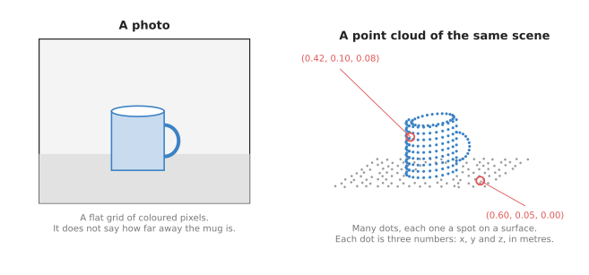
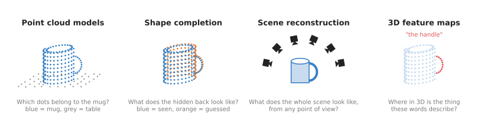

# 3D models: an overview

This chapter is about neural network models that work in three dimensions. The last
chapter, [seeing models](../03_seeing-models/01_overview.md), worked on flat
pictures, while the models in this chapter work on 3D points and whole scenes
instead. So this page says what they are for, which question each kind answers for
a robot arm, and how they connect to the rest of the book.

It is for a reader who has read the first chapter,
[what models are](../01_what-models-are/01_what-a-model-is.md). You should already
know that a model takes some numbers in and gives some numbers out after learning
from examples. You do not need to know anything about 3D maths. This is because the
page starts by explaining the one new idea the whole chapter uses, which is the
point cloud.

## Contents

1. [What a point cloud is](#1-what-a-point-cloud-is)
2. [What 3D models are for](#2-what-3d-models-are-for)
3. [The question they answer](#3-the-question-they-answer)
4. [The four kinds in this chapter](#4-the-four-kinds-in-this-chapter)
5. [Comparing the four kinds](#5-comparing-the-four-kinds)
6. [How 3D models connect to the other chapters](#6-how-3d-models-connect-to-the-other-chapters)
7. [Where to read next](#7-where-to-read-next)

---

## 1. What a point cloud is

Since the whole chapter rests on this one idea, it is worth building it up from a
normal photo. A photo is a flat grid of small coloured squares called **pixels**,
and each pixel says what colour something is without saying how far away that thing
is. So a photo of a mug on a table tells you that the mug is there, but not whether
it is 30 cm away or 3 m away.

A **depth camera** is a camera that also measures distance, because for each pixel
it reports how far away the surface in that pixel is. Book 2 explains how depth
cameras do this, in
[the sensors document](../../02_perception/02_object-perception/02_sensors.md).

Once you know the direction of a pixel and the distance along it, you know one spot
in the room. That spot can be written as three numbers:

- `x`, how far it is to the side,
- `y`, how far it is forwards,
- `z`, how high it is.

These three numbers together are called a **point**. Do this for every pixel and
you get a large collection of points, which is called a **point cloud**. The word
"cloud" only means that the points are scattered in space, with no fixed order and
no lines joining them.

The photo on the left is a grid of colours. The point cloud on the right is a list
of places, and each place is three numbers in metres.

A point cloud has three features that matter for the rest of this chapter.

- It only has points where the camera could see a surface, so the back of the mug
    has no points because the camera never saw it.
- The points have no order, which means point number 1 in the list could be on the
    mug or on the table. Swapping two rows of the list changes nothing about the
    scene.
- A typical depth camera gives tens of thousands of points or more in one shot. The
    camera in Book 2's project gives one point per pixel, and it has 76,800 pixels
    ([the one-box project](../../02_perception/01_camera/03_one-box-intro.md)).

A robot arm wants points more than it wants pixels, because a pixel is only a
direction while a point is a place. So the gripper has to go to a place, not to a
direction.

---

## 2. What 3D models are for

Now that a point cloud has a meaning, the models that work on one can be defined. A
**3D model** in this book is a neural network that takes 3D information in, or gives
3D information out, or both. That information is usually a point cloud, or a set of
photos taken from known places around a scene.

The programmed methods in Book 2 already do some 3D work without any learning. For
example, they can find the flat table in a point cloud and cut it away. They can
also group the points that are left into separate objects
([programmed methods, section 1.6](../../02_perception/02_object-perception/03_programmed-methods.md#16-point-clouds-remove-the-plane-then-cluster)).
Those methods only use the distances between points, and nothing else. So they
cannot say that a group of points is a mug, or that a part of it is the handle.
They also cannot say what the side facing away from the camera looks like.

3D models fill those gaps, because they learn from many examples what 3D shapes
usually look like. Then they use that to name points, guess hidden parts, rebuild a
whole scene, or attach meaning to places in 3D.

---

## 3. The question they answer

Those four jobs sound different, but for a robot arm every model in this chapter
answers some version of one question:

> **What is where, in 3D, around the arm, including the parts I cannot see yet?**

The arm needs the answer in 3D because its gripper moves in 3D. So a box drawn
around a mug in a photo is not enough to pick the mug up. The arm also needs to
know how far away the mug is, how wide it is, and where its handle points.

---

## 4. The four kinds in this chapter

This chapter has four pages after this one, and each of them answers a different
version of that question. The picture below shows what each kind answers, all about
the same mug.

Each panel shows one kind of model and the question it answers about the same mug.

- [Point cloud models](02_most-used/01_point-cloud-models.md) take a point cloud
    and say what it is, or which object each point belongs to, and PointNet is the
    best-known one.
- [Shape completion](03_also-used/01_shape-completion.md) takes the points of the
    side the camera saw and guesses the hidden back of the object.
- [Scene reconstruction](02_most-used/02_scene-reconstruction.md) takes many photos
    from known places and builds a whole 3D scene that can be viewed from any
    direction, and NeRF and Gaussian splatting are the two best-known methods.
- [3D feature maps](03_also-used/02_3d-feature-maps.md) build a 3D map in which
    every point also carries meaning, so that the arm can be asked where the handle
    is in plain words.

---

### Most used, and also used

The pages of this chapter are in two groups, because some of the four kinds come up
far more often than the others. The first group, most used, holds
[point cloud models](02_most-used/01_point-cloud-models.md) and
[scene reconstruction](02_most-used/02_scene-reconstruction.md). Point cloud models
work on what a depth camera gives you directly, so they are the ones most arm
projects meet first. Scene reconstruction, instead, is used widely to build a 3D
copy of a work cell or an object. The second group, also used, holds
[shape completion](03_also-used/01_shape-completion.md) and
[3D feature maps](03_also-used/02_3d-feature-maps.md). Those two solve real
problems, but fewer projects need them, and many of the models are still research
code.

## 5. Comparing the four kinds

Now that all four kinds have been named, the table below puts them side by side.
Read each row across to see what goes into that kind of model, what comes out, and
how it is usually trained.

| Kind | What goes in | What comes out | How it is trained |
| --- | --- | --- | --- |
| Point cloud models | one point cloud | a name for the cloud, or a name for every point | once, on many labelled point clouds |
| Shape completion | the points of the seen side | the points of the whole object | once, on many complete 3D shapes |
| Scene reconstruction | many photos, and where each was taken | a 3D scene you can view from anywhere | fitted again for every new scene |
| 3D feature maps | photos or point clouds, and a trained image model | a 3D map where each point carries meaning | usually no new training; it borrows an image model |

The next table says when a robot arm reaches for each kind, so read it as "if you
need this, then use that".

| If the arm needs to... | use |
| --- | --- |
| know which points are the mug and which are the table | a point cloud model |
| grasp an object from a side the camera cannot see | shape completion |
| see a shiny or see-through object that a depth camera misses | scene reconstruction |
| find "the red cup" or "the handle" from a spoken or typed request | a 3D feature map |

The last column of the first table matters more than it looks. Point cloud models
and shape completion are trained once and then used on new objects, but scene
reconstruction is different. A NeRF or a Gaussian splat is fitted to one scene, so
it has to be fitted again when the scene changes, and the
[scene reconstruction page](02_most-used/02_scene-reconstruction.md) explains
why.

---

## 6. How 3D models connect to the other chapters

Since 3D models are only one family, it helps to see where they sit. The book lists
seven families of model, and each one has a one-line job.

1. Seeing models turn a picture into names, boxes, outlines, poses or depth.
2. 3D models work on 3D points and whole scenes instead of flat pictures.
3. Grasp models decide where and how to hold an object.
4. Movement models decide how the arm should move, moment by moment.
5. Language models understand words, and connect words to pictures and actions.
6. World models predict what will happen next if the arm does something.
7. Touch and body models make sense of touch, force and the arm's own body.

3D models sit between seeing and grasping, so they take in from one side and give
out to the other.

- They take from [seeing models](../03_seeing-models/01_overview.md), because a
    depth model from
    [depth from pictures](../03_seeing-models/03_also-used/02_depth-from-pictures.md)
    can turn a plain photo into a point cloud, and an outline from
    [segmentation](../03_seeing-models/02_most-used/02_segmentation.md) can pick out
    which points belong to one object. 3D feature maps lift the numbers of an
    [open-vocabulary model](../03_seeing-models/02_most-used/03_open-vocabulary-models.md)
    into 3D.
- They give to [grasp models](../05_grasp-models/01_overview.md), since most grasp
    models that choose a full 3D grasp take a point cloud as input, and many of them
    are built on a point cloud model inside. See
    [six-DOF grasps](../05_grasp-models/02_most-used/01_six-dof-grasps.md).
- They give to [movement models](../06_movement-models/01_overview.md), because some
    policies take a point cloud of the scene as their input instead of a photo.
- They give to [language models](../07_language-models/01_overview.md), and a 3D
    feature map is one way to turn "the cup on the left" into a place the arm can
    reach.
- [World models](../08_world-models/01_overview.md) can predict how points will move
    when the arm pushes something, which is the same kind of input used to look
    ahead.

The [map of models](../01_what-models-are/06_the-map-of-models.md) shows all seven
families on one page.

---

## 7. Where to read next

Start with [point cloud models](02_most-used/01_point-cloud-models.md), because the
other three pages in this chapter build on its idea of a model that reads points
directly.

If you want the deeper, non-learned side of 3D first, Book 2 covers it:

- [The one-box project](../../02_perception/01_camera/03_one-box-intro.md) makes a
    point cloud from a depth camera, step by step.
- [Programmed methods](../../02_perception/02_object-perception/03_programmed-methods.md)
    finds objects in a point cloud without any model at all.
- [Models that measure](../../02_perception/02_object-perception/05_models-that-measure.md)
    compares 3D reconstruction methods by how accurate they are, and lists their
    licences.
