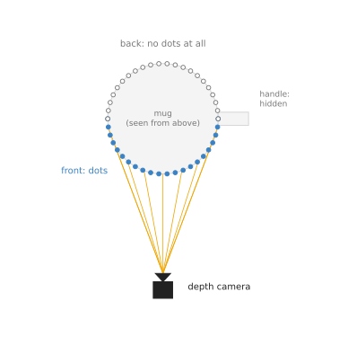
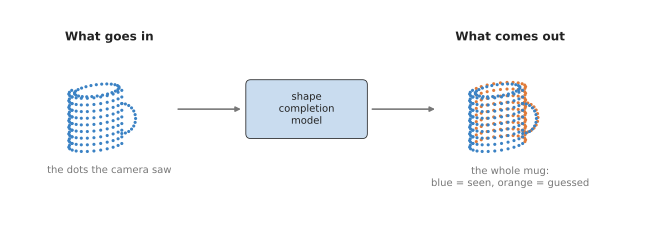
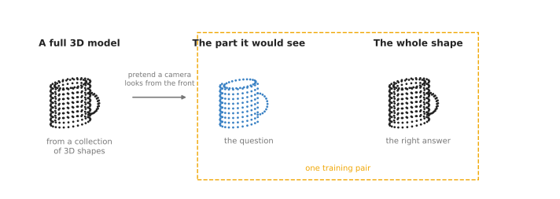
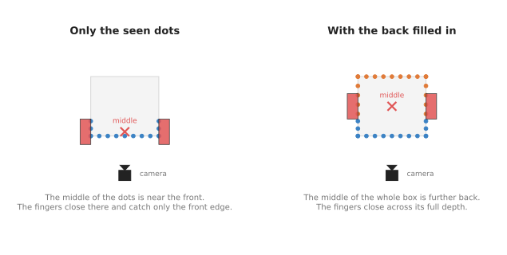

# Shape completion

This page is about models that guess the hidden back of an object. A camera only sees
the side of an object that faces it. A shape completion model takes the points of that
seen side and fills in the rest. This page answers three questions. How can a model
guess a side it never saw? What does it need to learn from? And when should a robot
arm trust the guess instead of just looking again from another side?

It is for a reader who has read the [chapter overview](../01_overview.md) and
[point cloud models](../02_most-used/01_point-cloud-models.md). You should know what a point cloud is,
and that a point cloud model can turn a cloud into a list of numbers that describes
its shape.

## Contents

1. [What it is](#1-what-it-is)
2. [What goes in and what comes out](#2-what-goes-in-and-what-comes-out)
3. [How it works inside](#3-how-it-works-inside)
   · [Squeeze, then grow](#squeeze-then-grow)
   · [Three ways to write down the whole shape](#three-ways-to-write-down-the-whole-shape)
4. [How it is trained](#4-how-it-is-trained)
5. [Well-known models](#5-well-known-models)
6. [A worked example: grasping a box from the side](#6-a-worked-example-grasping-a-box-from-the-side)
7. [What goes wrong](#7-what-goes-wrong)
8. [Why this rather than looking again, and what it costs](#8-why-this-rather-than-looking-again-and-what-it-costs)
9. [The written alternative](#9-the-written-alternative)
10. [Where to read next](#10-where-to-read-next)

---

## 1. What it is

A shape completion model takes the part of an object that a camera saw and guesses
the whole object.

People do this all the time. When you see the front of a mug, you already expect a
round back, a flat bottom and an open top. You have seen thousands of mugs, so you
know what mugs usually look like. You did not need to walk round this one. A shape
completion model learns the same kind of expectation from thousands of 3D shapes.

The problem it solves is easy to see from above. A depth camera sends out its
measurements in straight lines. Each line stops at the first surface it hits.

The lines from the camera reach the front of the mug, so the front has points; the
back and the handle get no points at all.

So the point cloud of a single object is never a whole object. It is a thin shell
over the half that faces the camera. Often it is less than half, because other objects
stand in the way.

---

## 2. What goes in and what comes out

What goes in is the point cloud of one object, as the camera saw it. Usually a
[segmentation model](../02_most-used/01_point-cloud-models.md) or an outline from a
[seeing model](../../03_seeing-models/02_most-used/02_segmentation.md) has already cut this object out
of the scene. Many models also want the points moved so that the middle of the seen
points sits at zero. That makes all inputs look alike in size and position.

What comes out is the whole object, written down in one of three ways. The next
section describes them. The simplest is a new point cloud with points all over the
object, front and back.

The model keeps the blue points it was given and adds the orange points it guessed
for the back and the handle.

---

## 3. How it works inside

### Squeeze, then grow

Most shape completion models have two halves. The two halves are called the
**encoder** and the **decoder**.

1. The **encoder** reads the seen points and squeezes them into one short list of
   numbers. This list describes the shape in general, such as "a round thing, about
   this wide, with something sticking out on one side". The encoder is usually a point
   cloud model like PointNet, from the
   [previous page](../02_most-used/01_point-cloud-models.md).
2. The **decoder** takes that short list and grows a whole shape from it. It has
   never seen the back of this object. It only knows what backs usually look like for
   shapes whose front gives this list.

The squeeze in the middle is what makes this work. The short list has no room for
every point. It can only hold the general shape. The decoder then draws the general
shape in full, including the parts that were missing.

Many decoders work in two passes. The first pass gives a rough cloud of a few hundred
points that shows the overall shape. The second pass adds detail around each of those
points. This is the same "coarse first, fine later" pattern that PointNet++ uses in
the other direction.

### Three ways to write down the whole shape

There are three common ways for the decoder to write down the whole object.

- **A point cloud.** The decoder gives a fixed number of points, such as 2,048 or
  16,384, spread over the whole surface. This is the easiest to use with other point
  cloud tools.
- **A voxel grid.** Space around the object is cut into small cubes. The decoder
  says, for each cube, whether it is inside the object. A grid of 40 cubes along each
  side is already 64,000 cubes, so grids have to stay coarse.
- **A function.** The decoder becomes a small network that answers one question for
  any spot in space: "is this spot inside the object?" Some versions answer "how far
  is this spot from the surface?" instead. You can ask about as many spots as you
  like, so the shape has no fixed resolution. Software then finds the surface where
  the answer changes from inside to outside.

The function form is the most detailed. The point cloud form is the most common on
robots, because the next step, a grasp model, usually wants points.

---

## 4. How it is trained

Shape completion has one great advantage. The training data can be made on a
computer, with no one labelling anything by hand.

The seen part is the question and the whole shape is the right answer, and both come
from the same 3D model.

The training program does this for each example:

1. Take a full 3D model of an object from a collection such as ShapeNet. ShapeNet
   holds many thousands of 3D models of everyday things, made by people in 3D design
   programs.
2. Pick a random viewpoint. Pretend a depth camera looks at the model from there. Keep
   only the points that camera would see. This is the question.
3. Keep points from the whole surface as the right answer.
4. Show the model the question. Compare its guess with the right answer.
5. Adjust the model a little so its next guess is closer.

Each 3D model gives many training pairs, one for every viewpoint. So a few thousand
3D models give hundreds of thousands of pairs.

To compare the guess with the answer, most models use a simple score called the
**Chamfer distance**. For every guessed point, find the nearest point in the right
answer and measure the distance. Then do it the other way round, for every
right-answer point. Add the distances up. A small total means the two clouds lie on
top of each other. Training makes this total as small as it can.

Before it is used on a real robot, the model is usually also trained with noise added
to the question points. A real depth camera never gives the clean points that a
computer model does.

---

## 5. Well-known models

These are real models that come up in robot shape completion work.

- **Shape completion for grasping, by Varley and others** (2017), was one of the first
  to use this on a robot arm. It fills in a voxel grid from one depth view and then
  plans a grasp on the completed shape.
- **PCN**, the Point Completion Network (2018), takes a point cloud and gives a point
  cloud. It uses the coarse-then-fine decoder described above.
- **PoinTr** (2021) uses attention, the same idea that language models use, to let
  groups of seen points decide which missing groups to add.
- **DeepSDF** (2019) writes the shape down as a function. For any spot, it gives the
  distance to the nearest surface, with a minus sign for spots inside the object.
- **Occupancy Networks** (2019) also use a function. For any spot, they give how likely
  it is that the spot is inside the object.

---

## 6. A worked example: grasping a box from the side

An arm has to pick up a closed box from a shelf. The shelf is shallow, so the gripper
has to reach in from the front and close its fingers on the left and right sides of
the box. The camera is in front of the shelf.

The camera sees the front face of the box and a little of each side. It sees nothing
further back. The picture compares two ways of choosing where to close the fingers.

On the left, the grasp is centred on the seen points and holds only the front edge;
on the right, it is centred on the completed box and holds the box across its depth.

Here is what happens on the left, without completion.

1. The software takes the average of the seen points as the middle of the box.
2. Almost all seen points are on the front face. So this "middle" is just behind the
   front face.
3. The fingers close there. They catch only the front edge of the box. The box tips
   and slips out when the arm lifts.

Here is what happens on the right, with completion.

1. The shape completion model adds the back and the back part of both sides.
2. The middle of the completed box is now in the right place, half way back.
3. The fingers close across the whole depth of the box. The grasp holds.

Completion helps a second job too. A motion planner needs to know the whole shape of
the object in the gripper, so that it does not knock the hidden back into the shelf on
the way out. The [learned motion planners page](../../06_movement-models/03_also-used/02_learned-motion-planners.md)
covers planning.

---

## 7. What goes wrong

**The guess is only a guess.** The model fills the back with what backs usually look
like. If this mug has a second handle on the far side, or a dent, the model will not
guess it. It draws the most usual shape. It does not tell you where it is unsure,
unless it was built to.

**Unfamiliar kinds of object.** A model trained on mugs, bottles and boxes has no idea
what the back of a strangely shaped machine part looks like. It will draw something
that looks like a shape it knows.

**Clutter.** If another object hides part of the front too, the model gets even less.
It may also mix up the edge of the other object with the edge of this one, if the
segmentation was not clean.

**Too smooth.** The decoder often gives rounded, blurry shapes. Thin parts such as a
handle or a rim are the first to get lost.

People deal with these problems in four ways.

- Use the guess only for the hidden part. Keep the real measured points where there
  are any. The picture in section 2 does exactly this.
- Ask for several guesses and see how much they disagree. Where the guesses differ a
  lot, the arm should be careful.
- Choose a grasp that does not depend much on the hidden part.
- Check with touch. When the fingers close, the gripper measures how wide the object
  really is. The [touch and body models chapter](../../09_touch-and-body-models/01_overview.md)
  covers this.

---

## 8. Why this rather than looking again, and what it costs

A shape completion model **is** a network that guesses the whole shape of an object
from one partial view. It **does** give the arm a full shape to plan a grasp and a
path around, straight away, from one camera shot.

The obvious alternative is to look again. The arm can move its wrist camera to the
side and behind the object, take more depth shots, and merge the point clouds. Then
there is nothing to guess.

Why guess instead of looking?

- Looking again takes time. Every extra view means a movement of the arm and another
  shot. In a factory that picks thousands of objects an hour, those seconds add up.
- Often the arm cannot look behind. On a shelf, in a bin, or against a wall, there is
  no place for the camera to go.
- A fixed camera on a stand cannot move at all.

A second alternative is to fit a 3D model you already have. If the arm only ever picks
one known part, you can store its exact 3D model and match it to the seen points. Book
2 describes this in
[models that measure](../../../02_perception/02_object-perception/05_models-that-measure.md).
That is more accurate than any guess. But it only works for objects you have a model
of. Shape completion works for new objects of familiar kinds.

What does it cost you?

- The back is invented, not measured. Any grasp or path that depends on it can be
  wrong.
- The model only guesses well for kinds of object that look like its training data.
- It is one more model to run. On a small computer that takes time, though usually
  much less than moving the arm.

A good rule is to use completion when you cannot look, and to look when you can
afford it.

---

## 9. The written alternative

No written method can guess the back of a new object, because the guess comes
from having seen thousands of similar objects. Book 5 offers three written ways
around the problem. For one known part, [iterative closest point](../../../05_programming-techniques/03_searching-and-matching/02_most-used/02_iterative-closest-point.md) lines
up the stored 3D model with the seen points, and the model then gives the whole
shape, measured rather than guessed. For a simple shape, [RANSAC](../../../05_programming-techniques/04_fitting-and-estimation/02_most-used/02_ransac.md) fits a
cylinder or a plane to the seen points, and the fitted shape covers the hidden
side too. To look instead of guess, [visibility and next-best-view](../../../05_programming-techniques/06_planning-and-search/03_also-used/03_visibility-and-next-best-view.md)
chooses where to move the camera to see most of what is hidden. Shape completion
wins for new objects of familiar kinds when the camera cannot move.

---

## 10. Where to read next

- [Scene reconstruction](../02_most-used/02_scene-reconstruction.md) is the next page. It covers the
  "look again" route in full: building a whole scene from many photos.
- [Point cloud models](../02_most-used/01_point-cloud-models.md) explains the encoder that most
  completion models start with.
- [Six-DOF grasps](../../05_grasp-models/02_most-used/01_six-dof-grasps.md) shows the grasp models
  that take the completed points.
- [Models that grasp](../../../03_frameworks/02_gripping/04_models-that-grasp.md) in Book
  3 goes deeper into grasp models and the data they need.
