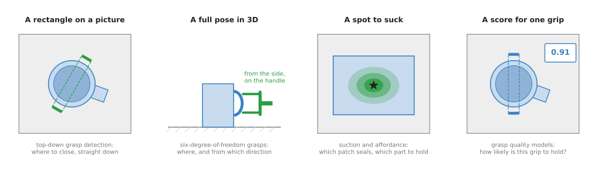
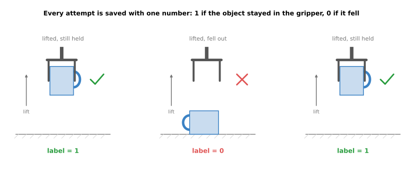

# Grasp models

This chapter is about models that decide where and how to hold an object. A robot
arm can see a mug on a table, and it can move its gripper to any point it can
reach, but neither of those tells it where to put the fingers. So a grasp model is
what answers that question.

So this page, the overview of the chapter, answers four questions. What is a
grasp model for, and what does its answer look like? What kinds are there, and how
do they differ from one another? And how do grasp models connect to the other kinds
of model in this book?

It is for a reader who has read
[what a model is](../01_what-models-are/01_what-a-model-is.md) and
[how a model learns](../01_what-models-are/02_how-a-model-learns.md). Because a
grasp model usually starts from the same pictures, it helps to have read the
[seeing models overview](../03_seeing-models/01_overview.md) as well. Every new
word is explained where it first appears.

## Contents

1. [What a grasp model is for](#1-what-a-grasp-model-is-for)
2. [What a grasp is](#2-what-a-grasp-is)
3. [The label every grasp model learns from](#3-the-label-every-grasp-model-learns-from)
4. [The four kinds of grasp model](#4-the-four-kinds-of-grasp-model)
5. [The four kinds side by side](#5-the-four-kinds-side-by-side)
6. [What a grasp model does not know](#6-what-a-grasp-model-does-not-know)
7. [How grasp models connect to the other kinds](#7-how-grasp-models-connect-to-the-other-kinds)
8. [Where to read next](#8-where-to-read-next)
9. [Using it in Python](#9-using-it-in-python)

---

## 1. What a grasp model is for

As the introduction said, grasp models decide where and how to hold an object, and
this section says why that decision is hard enough to need a model.

For example, think about how you pick up a mug yourself. You do not think hard
about it, but you still make
several choices. You choose which part to hold, which is the handle, the body or
the rim. Then you choose which way your hand comes in, either from above or from
the side, and how wide to open your fingers before they close. A grasp model makes
those same choices for a robot gripper.

The question it answers is this:

> Where should the gripper go, which way should it face, and how wide should it
> open, so that the object stays in the gripper when the arm lifts it?

A robot arm needs this answer before it can pick anything up. For a small number
of known objects a person can write the answer down by hand, and the
[choosing a grip](../../03_frameworks/02_gripping/03_choosing-a-grip.md) document
in Book 3 shows how. Instead, a grasp model is for the case where nobody can write
the answer down, because the objects are new, mixed and lying in any position. The
usual example of that case is a box of mixed shopping.

---

## 2. What a grasp is

Since a grasp model has to answer the question above, it helps to see exactly what
its answer contains. A **grasp** is one complete instruction for the gripper, and
it has three parts.

- A **position**: the point in space where the middle of the gripper's fingertips
  should end up.
- A **direction**: which way the gripper faces as it comes in, and which way its
  fingers close.
- An **opening width**: how far apart the fingers should be just before they close.

A **gripper** here means the two-finger kind, called a **parallel-jaw gripper**
because its two fingers stay parallel as they close, and each finger is called a
**jaw**. Some pages also cover a **suction cup**, which holds an object by sucking
air out from under a soft rubber cup.

However, different grasp models give this answer in different forms. Some give a
rectangle
drawn on a picture, some give a full position and direction in 3D, and some give a
spot where a suction cup should go. Some do not give a grasp at all, and instead
they take a grasp that something else proposed and give it a score. The picture
below shows these four kinds of answer on simple objects.



From left to right, the drawing shows a rectangle on a picture seen from above, a
full pose that comes in from the side, a spot on a box where a suction cup will
seal, and one grip with a score of 0.91 next to it.

---

## 3. The label every grasp model learns from

Whichever of those forms a model gives, it has to learn that form from examples,
and each example needs a **label**, which is the right answer the model should
learn to give. The
[how a model learns](../01_what-models-are/02_how-a-model-learns.md) page explains
this in full.

For grasp models, however, the label is almost always the same simple thing. A grasp was
tried, and then somebody checked whether the object was still in the gripper after
the arm lifted it. So the label is 1 if the object was still held, and 0 if it
fell out.



Each attempt ends with one number: 1 if the object stayed in the gripper, and 0 if
it fell out.

Once the label is defined, those attempts can happen in two places. A real arm can try thousands of grasps on
real objects, or a computer can test grasps on 3D models of objects using the rules
of physics, with no robot at all. The second way is much faster, so most grasp
models today learn from it. The
[grasp quality models](03_also-used/02_grasp-quality-models.md#4-how-it-is-trained)
page shows both ways side by side.

---

## 4. The four kinds of grasp model

Because the label is the same for all of them, the four kinds of grasp model
differ only in the form of their answer. So the four kinds below each get their
own page.

1. [Top-down grasp detection](03_also-used/01_top-down-grasp-detection.md). The
    model looks at one picture taken from above and draws rectangles on it, and
    each rectangle says where the two jaws should close. The gripper always comes
    straight down.
2. [Six-degree-of-freedom grasps](02_most-used/01_six-dof-grasps.md). The model
    looks at a 3D picture of the scene and gives full grasps that can come from any
    direction. "Six degrees of freedom" means six numbers, which are three for the
    position and three for the direction.
3. [Suction and affordance](02_most-used/02_suction-and-affordance.md). The model
    paints a score on every part of the picture, so that for suction the score says
    where a cup will seal, while for affordance it says what each part of an object
    is for, such as "hold here" or "this part cuts".
4. [Grasp quality models](03_also-used/02_grasp-quality-models.md). The model is
    given one possible grasp and says how likely it is to work, because something
    else proposes the grasps and the quality model only picks the best.

---

### Most used, and also used

The pages of this chapter are in two groups, because some of the four kinds come up
far more often than the others. The first group, most used, holds
[6-DoF grasps](02_most-used/01_six-dof-grasps.md) and
[suction and affordance](02_most-used/02_suction-and-affordance.md), since grasp
models that work in any direction are what most new arm projects reach for, and
suction is the most common gripper in warehouse picking. The second group, also
used, holds [top-down grasp detection](03_also-used/01_top-down-grasp-detection.md)
and [grasp quality models](03_also-used/02_grasp-quality-models.md). Top-down
detection still works well for flat bins seen from above, while quality models are
most often met inside a larger system, scoring the grasps another method
proposes.

## 5. The four kinds side by side

Now that all four kinds have been described, the table below compares them side by
side. Each row is one kind, so read across a row to see what that kind takes in,
what it gives back, and what it is good and bad at.

| Kind | What goes in | What comes out | Good at | Bad at |
| --- | --- | --- | --- | --- |
| [Top-down grasp detection](03_also-used/01_top-down-grasp-detection.md) | one depth picture from above | rectangles: where to close, at what angle, how wide | small and fast; runs without a graphics card | only straight-down grasps |
| [Six-degree-of-freedom grasps](02_most-used/01_six-dof-grasps.md) | a point cloud of the scene | many full grasps, each with a score | cluttered bins; grasps from any side | needs a strong graphics card; strict licences |
| [Suction and affordance](02_most-used/02_suction-and-affordance.md) | a colour or depth picture | a score for every pixel | flat-faced objects; knowing which part to hold | objects with no flat face; parts it has not seen labelled |
| [Grasp quality models](03_also-used/02_grasp-quality-models.md) | a picture plus one proposed grasp | one number: the chance it holds | choosing the best of many grasps | slow when there are many grasps to check |

Two words in that table need explaining, and both of them come from Book 2. A
**depth picture** is a picture where
each pixel holds a distance from the camera instead of a colour, while a **point
cloud** is a list of 3D points on the surfaces the camera saw. The
[camera basics](../../02_perception/01_camera/01_basics.md) page in Book 2 explains
both.

The four kinds are often joined together rather than used alone. For example, a
six-degree-of-freedom model proposes grasps and a quality model scores them, or a
suction model and a finger-grasp model run side by side and the robot uses
whichever gives the better score.

---

## 6. What a grasp model does not know

The table above listed what each kind is bad at, but there is one gap they all
share. A grasp model learned one thing only, which is whether the object stayed in
the gripper, so it knows nothing else at all. So three examples below show what
that gap leaves out.

- It does not know which part must not be touched, so it may pick the blade of a
    knife simply because the blade is easy to hold.
- It does not know what happens next, so it may hold a mug by the rim, which is
    fine for lifting but makes it impossible to pour.
- It does not know your arm, so it may choose a grasp that your arm cannot reach,
    or one that is wider than your gripper can open.

So the usual answer is to treat the model's grasps as suggestions rather than
decisions. Other checks then throw away the ones that are unreachable, that would
hit something, or that break a rule about the task. The
[six-degree-of-freedom page](02_most-used/01_six-dof-grasps.md#7-what-goes-wrong)
shows this filtering in a picture, while Book 3's
[models that grasp](../../03_frameworks/02_gripping/04_models-that-grasp.md#9-using-a-model-as-a-candidate-generator)
gives the checks in order.

---

## 7. How grasp models connect to the other kinds

Since those extra checks come from elsewhere, a grasp model is only one step in a
longer chain. Here is the whole chain for picking up a mug.

1. A [seeing model](../03_seeing-models/01_overview.md) finds the mug in the camera
    picture, often as an outline around its pixels.
2. A [3D model](../04_3d-models/01_overview.md) turns the depth picture into a
    point cloud, and it may guess the back of the mug that the camera cannot see.
3. A grasp model chooses where the gripper should go on the mug.
4. A [movement model](../06_movement-models/01_overview.md), or an ordinary motion
    planner, moves the arm to that grasp without hitting anything.
5. A [touch and body model](../09_touch-and-body-models/01_overview.md) checks that
    the mug is really held and is not slipping.

A [language model](../07_language-models/01_overview.md) can sit in front of this
chain and turn "pick up the red mug" into the choice of which mug. Some newer
models join steps 3 and 4 into one, so that a vision-language-action model, for
example, goes from a picture and a sentence straight to arm movements and never
gives a separate grasp. Those models are covered in the
[vision-language-action models](../07_language-models/02_most-used/01_vision-language-action-models.md)
page.

Even so, a separate grasp model is still the common choice in real work, because it
gives an answer that a person can look at, check and filter before the arm moves.

---

## 8. Where to read next

- Start with [top-down grasp detection](03_also-used/01_top-down-grasp-detection.md),
    because it is the simplest kind and the easiest to picture.
- For the full list of real grasp models, their licences, and which ones run
    without an NVIDIA graphics card, read Book 3's
    [models that grasp](../../03_frameworks/02_gripping/04_models-that-grasp.md).
- For grasps you can compute by hand, without any model, read
    [choosing a grip](../../03_frameworks/02_gripping/03_choosing-a-grip.md).
- For what happens after the fingers close, read
    [holding on](../../03_frameworks/02_gripping/05_holding-on.md).
- To see where grasp models sit among all the kinds in this book, go back to
    [the map of models](../01_what-models-are/06_the-map-of-models.md).

---

## 9. Using it in Python

Section 4 said that all four kinds of grasp model give back the same kind of
answer, which is a list of grasps with a score on each one. This section shows what
that list actually looks like in Python, so that after reading it you will know
which part of the work a grasp model does for you, and which part is still yours.

The nearest thing to a standard format for that list is the `GraspGroup` class from
`graspnetAPI`, the package that comes with the GraspNet-1Billion dataset. Many
6-DoF models save their output in exactly this form, so it is a fair picture of what
you receive. You install it with `pip install graspnetAPI`.

```python
import numpy as np
from graspnetAPI import GraspGroup

gg = GraspGroup("grasps.npy")        # one row per grasp, as the model saved it
gg = gg[gg.widths < 0.08]            # my gripper opens to 8 cm, so drop the wider ones
gg = gg.sort_by_score()

camera_to_base = np.load("hand_eye_calibration.npy")   # 4 by 4, measured by me
gg.transform(camera_to_base)         # the grasps are now measured from the robot's base

best = gg[0]
print(best.score, best.width, best.translation, best.rotation_matrix)
```

The library gives you the format and the arithmetic. It knows how to read and write
the file, how to sort by score, how to drop overlapping grasps with `gg.nms()`, and
how to move every grasp into another frame when you hand it a transform. It also
draws the grippers for you, through `gg.to_open3d_geometry_list()`, which is how
most of the pictures of grasps in papers are made.

What it does not give you is anything about your robot. You have to produce the
point cloud or the depth picture in the first place, which means a working depth
camera. You have to measure `camera_to_base` yourself, by the calibration procedure
described in Book 5's
[rigid transforms](../../05_programming-techniques/02_geometry-and-cameras/02_most-used/02_rigid-transforms.md)
page, and a calibration that is 1 cm out will miss the object by 1 cm no matter how
good the model is. You have to check that the arm can actually reach the pose and
get there without hitting the table, because the grasp model never looked at the
arm. And you have to write the motion that approaches the grasp, closes the fingers
and lifts.

The decisions that are yours are the score cut-off below which you refuse to try,
the number of grasps you keep and in what order you attempt them, and what to do
when the first attempt fails. The hardest decision is whether to use a downloaded
model at all. Every trained grasp model in this chapter learned the geometry of one
particular gripper, and section 6 explained why that matters: a model trained on a
gripper that opens to 10 cm will happily propose grasps that your 6 cm gripper
cannot make. Filtering by width, as the third line above does, removes the worst of
those, but it does not fix a model that learned to place its fingers where your
fingers are shaped differently. If your gripper is unusual, you will have to
retrain, and retraining needs the simulator and the dataset that the original
authors used.
