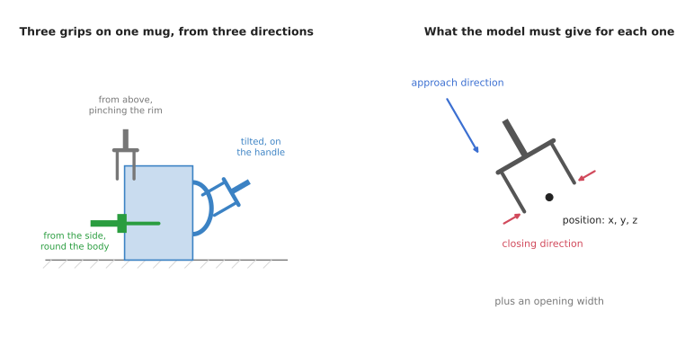
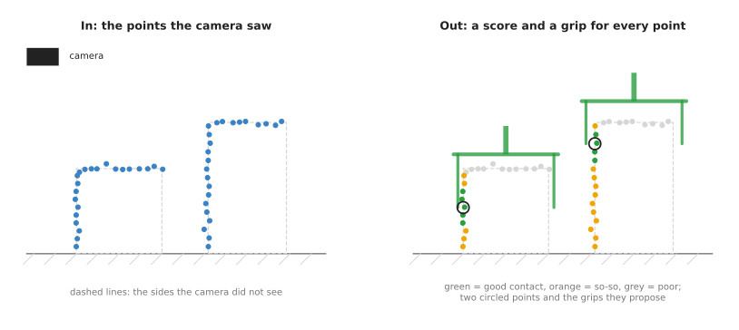
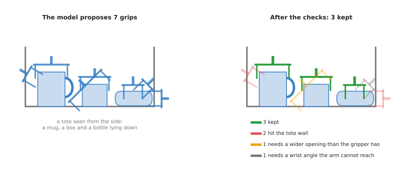

# Six-degree-of-freedom grasps

This page is about grasp models that can grasp from any direction. A
[top-down detector](../03_also-used/01_top-down-grasp-detection.md) can only send the gripper
straight down. The models on this page can send it in from the side, at a tilt, or
under an edge. This is what a real bin of mixed objects needs, and it is where most
grasp research has gone since about 2019.

The page answers these questions. What does "six degrees of freedom" mean? What
does such a model take in, and what does it give back? How does it work inside?
What is it trained on? Which real models do this? What goes wrong, and what does
it cost?

It is for a reader who has read the [grasp models overview](../01_overview.md) and
[top-down grasp detection](../03_also-used/01_top-down-grasp-detection.md). It helps to have read
[point cloud models](../../04_3d-models/02_most-used/01_point-cloud-models.md), because every model
on this page starts from a point cloud.

## Contents

1. [What it is](#1-what-it-is)
2. [What goes in and what comes out](#2-what-goes-in-and-what-comes-out)
3. [How it works inside](#3-how-it-works-inside)
4. [How it is trained](#4-how-it-is-trained)
5. [Well-known models](#5-well-known-models)
6. [A worked example: clearing a tote](#6-a-worked-example-clearing-a-tote)
7. [What goes wrong](#7-what-goes-wrong)
8. [Why this kind, and what it costs](#8-why-this-kind-and-what-it-costs)
9. [The written alternative](#9-the-written-alternative)
10. [Where to read next](#10-where-to-read-next)

---

## 1. What it is

A six-degree-of-freedom grasp model gives full gripper poses in 3D, coming from any
direction.

A **degree of freedom** is one number you can change independently. To place a
gripper anywhere in a room, facing any way, you need six numbers. Three numbers say
where it is: how far along, how far across and how high. Three more say which way
it faces: how far it is turned about each of three lines. Book 1's
[joints and degrees of freedom](../../../01_robotics-intro/05_arm-types/01_joints-and-degrees-of-freedom.md#6-degrees-of-freedom)
page explains this with pictures. A set of all six numbers is called a **pose**.

"Six-degree-of-freedom" is often written **6-DoF**. A 6-DoF grasp is a gripper pose
plus an opening width. A top-down grasp fixes two of the six numbers, because the
gripper must point straight down. A 6-DoF grasp leaves all six free.

Think of picking a mug off a table with your own hand. You can come from above and
pinch the rim. You can come from the side and wrap your fingers round the body. You
can come in at a tilt and hold the handle. Those are three different poses. A 6-DoF
grasp model can suggest any of them.

On the left, three grasps on one mug from three directions. The green gripper comes
from the side, and its two fingers close from the front and the back of the mug, so
only one finger shows. On the right, what the model must give for each grasp: a
position, an approach direction, a closing direction and an opening width.

---

## 2. What goes in and what comes out

The input is a **point cloud** of the scene. A point cloud is a long list of 3D
points, each one a spot on a surface that the depth camera saw. A depth camera
gives a depth picture, and a few lines of code turn each pixel into a 3D point.
Book 2's [sensors](../../../02_perception/02_object-perception/02_sensors.md) page
explains depth cameras.

The camera sees only the sides of objects that face it. The point cloud has no
points on the back or the bottom of anything. The model must guess good grasps from
this half view.

The output is a list of grasps, often hundreds of them. Each grasp has:

- a **position**: where the middle of the fingertips should be, as `x`, `y` and `z`
- an **approach direction**: the line the gripper travels along as it moves in
- a **closing direction**: the line along which the two fingers move together
- an **opening width**: how far apart the fingers should be before they close
- a **score**: a number between 0 and 1 for how likely the grasp is to hold

The approach direction and the closing direction together fix which way the
gripper faces. With the position, they give all six numbers.

---

## 3. How it works inside

There are three main designs. They appeared in this order.

### Sample, then check

The oldest design does not generate grasps with a network at all. Ordinary code
picks thousands of random gripper poses near the point cloud. It throws away any
pose where the gripper would pass through a point, or where the fingers would not
close on anything. A small network then looks at the points between the fingers of
each pose that is left, and says "good" or "bad". This design is easy to follow,
and each rejection has a reason. It is slow, because most random poses are bad.

### Generate directly

The second design trains a network to produce grasps directly. One kind of
network, called a **variational autoencoder**, learns to turn random numbers into
grasp poses that look like the good grasps it saw in training. A second network
then scores each grasp, and a third step nudges each grasp a little to raise its
score.

### A grasp for every point

The third design is the one most current models use. It works like the per-pixel
maps on the [top-down page](../03_also-used/01_top-down-grasp-detection.md#3-how-it-works-inside),
but on points instead of pixels.

1. The point cloud goes into a **point cloud network**. This is a network made to
   read an unordered list of 3D points. The
   [point cloud models](../../04_3d-models/02_most-used/01_point-cloud-models.md) page explains how
   they work.
2. For every point, the network gives a score, an approach direction, a closing
   direction and a width.
3. The trick is in what each point means. Each point is treated as the spot where
   one finger would touch. The network says: "if one finger touches here, the
   gripper should come in this way, close this way, and open this wide".
4. Code keeps the points with the best scores and turns each one into a full
   grasp pose.

On the left, the points the camera saw on a box and a tall can. On the right, each
point is coloured by its score. The two circled points each propose a grasp in which
that point is where one finger touches.

Tying each grasp to a point that the camera actually saw makes the problem much
smaller. The network does not have to search all of space. It only has to answer a
question about each point it was given.

Some newer models add one more step before this. They first ask, for each point,
"is anything near here graspable at all?" Points on a flat table or deep in a gap
get a low answer and are skipped. This saves time in cluttered scenes.

---

## 4. How it is trained

These models learn from millions of grasps that were tested by a computer, not by
a real robot.

The recipe is similar across models.

1. Collect thousands of 3D models of everyday objects. These are the kind of 3D
   files you could print on a 3D printer.
2. For each object, try a very large number of gripper poses in a physics
   simulator, or check them with physics formulas. Each pose gets a label: 1 if it
   would hold, and 0 if it would slip or not close.
3. Place several objects together in a virtual bin to make a cluttered scene. Throw
   away any grasp that would now hit a neighbouring object.
4. Make a point cloud of the scene from a virtual camera, as a real depth camera
   would see it.
5. Train the network to predict the good grasps from the point cloud.

Two datasets built this way are used most.

- **ACRONYM** has millions of simulated grasps on thousands of object models. It
  was made by NVIDIA and was used to train Contact-GraspNet.
- **GraspNet-1Billion** was made at Shanghai Jiao Tong University. It has about
  97,000 real camera pictures of 190 cluttered scenes built from 88 real objects.
  The grasps were computed on 3D models of those objects and then placed into each
  scene, which gives more than a billion labelled grasp poses.

The simulator's pictures are cleaner than a real camera's. Real depth cameras miss
thin edges and add noise. Training therefore adds noise and gaps to the simulated
point clouds on purpose, so the model is not surprised by the real thing. The
[where the data comes from](../../01_what-models-are/05_where-the-data-comes-from.md#4-simulation)
page explains this gap between simulation and the real world.

---

## 5. Well-known models

These are real models of this kind. Book 3's
[models that grasp](../../../03_frameworks/02_gripping/04_models-that-grasp.md#4-six-degree-of-freedom-models)
lists their code, their licences and what hardware each one needs. Read it before
you choose one, because the licences in this area are unusually strict.

- **GPD**, Grasp Pose Detection, is the classic sample-then-check design. It samples
  poses on the point cloud, checks them with geometry, and scores the survivors with
  a small network. It runs without a graphics card.
- **6-DOF GraspNet**, from NVIDIA, was an early model that generated grasps directly,
  using a variational autoencoder and a separate scoring network.
- **Contact-GraspNet**, also from NVIDIA, introduced the idea that each point
  proposes a grasp in which it is a finger contact. Most later models build on this.
- **AnyGrasp**, from the GraspNet-1Billion team, is one of the strongest models
  of this kind. It can also follow grasps on an object that is moving. It is shipped
  as a closed library that needs a licence key tied to one computer.
- **GraspGen**, from NVIDIA in 2025, generates grasps with a diffusion model and
  then scores them. A **diffusion model** starts from random numbers and cleans them
  up, step by step, into a good answer. The
  [diffusion and flow policies](../../06_movement-models/02_most-used/03_diffusion-and-flow-policies.md)
  page explains the idea.

---

## 6. A worked example: clearing a tote

A **tote** is a plastic box of the kind used in warehouses. Here, a tote holds a
mug, a small box and a bottle lying on its side. The arm must lift them out one by
one.

1. A depth camera above and to one side of the tote takes a picture. Code turns it
   into a point cloud.
2. Code crops the point cloud to the inside of the tote, so the model does not
   waste time on the floor or the arm.
3. The model gives a few hundred grasps, each with a score.
4. Code checks each grasp against things the model does not know about, and throws
   away the ones that fail.
5. The arm tries the best grasp that is left, lifts the object and puts it down
   outside the tote.
6. The camera takes a new picture, and the whole loop starts again. The scene has
   changed, so the old grasps are no longer valid.

Step 4 is the one people forget. The picture below shows it.

On the left, seven grasps the model proposed for the tote. On the right, the three
that survive after code checks the tote walls, the gripper's opening and the arm's
reach.

---

## 7. What goes wrong

The model learned whether a grasp holds. It learned nothing else, so most failures
come from what it cannot know.

- The arm may not be able to reach the grasp. The model knows nothing about your arm. A
  grasp that comes in from the far side of the tote may need a wrist angle the arm
  cannot make. Code must check each grasp with the arm's inverse kinematics, the
  maths that turns a gripper pose into joint angles. Book 3's
  [reaching and reachability](../../../03_frameworks/03_arm-movement/02_reaching-and-reachability.md)
  explains that check.
- The gripper may hit something on the way in. The model checks for collisions only
  against the points it saw. It cannot see the back wall of the tote if the wall
  is hidden, so it may send the gripper through it.
- The model may have learned on a different gripper. Most models learned on one gripper, such as a Franka Hand.
  A grasp that suits that gripper's finger length and opening may not suit yours.
- Shiny and see-through objects are missed. Glass and polished metal leave holes in the
  point cloud. The model cannot grasp what it cannot see.
- The back of each object is hidden. The model guesses what is behind each object from
  training. When the guess is wrong, the far finger lands on empty air.
  [Shape completion](../../04_3d-models/03_also-used/01_shape-completion.md) models guess the hidden
  back, which can help.
- The model has no sense of the task. The model does not know that a mug of coffee must stay
  upright, or that a knife should not be held by the blade.

The fix for most of these is the same. Treat the model's grasps as suggestions, and
put your own checks after it. Book 3's
[using a model as a candidate generator](../../../03_frameworks/02_gripping/04_models-that-grasp.md#9-using-a-model-as-a-candidate-generator)
gives the checks in order. It also recommends logging which check rejected each
grasp. When nothing is left, the log tells you whether the problem is the model,
the gripper or the cell.

---

## 8. Why this kind, and what it costs

A 6-DoF grasp model takes a point cloud and gives full gripper poses from any
direction, each with a score.

What it does for you is handle clutter. Objects in a real bin lie at angles, lean
on each other and press against walls. Many of them can only be held from the side
or at a tilt. A 6-DoF model finds those grasps, on objects it has never seen.

The obvious alternative is a [top-down detector](../03_also-used/01_top-down-grasp-detection.md). It
is smaller, faster and easier to run, but it only grasps straight down. Choose the
6-DoF kind when a real share of your objects cannot be picked from above. If every
object lies flat on a table, the top-down kind does the same job for less.

The other alternative is a rule you write by hand. Book 3's
[choosing a grip](../../../03_frameworks/02_gripping/03_choosing-a-grip.md) shows that
when you know the objects, a rule is cheaper and easier to trust. The 6-DoF model is
for the case where the next object could be anything.

What it costs you is large.

- It needs strong hardware. Nearly every model of this kind needs an NVIDIA graphics card. Many
  depend on custom code that only builds for NVIDIA's CUDA system. Book 3's
  [what runs without CUDA](../../../03_frameworks/02_gripping/04_models-that-grasp.md#8-what-runs-without-cuda)
  gives the details for each model.
- Its licences are strict. Most of these models may only be used for research. Several have no
  licence file at all, which means you have no permission to use them.
  [The licence picture](../../../03_frameworks/02_gripping/04_models-that-grasp.md#5-the-licence-picture)
  in Book 3 goes through them one by one.
- You must still write your own checks. The model's grasps are not safe to use on their own.
  You still need reach checks, collision checks and task rules.

---

## 9. The written alternative

The written way to choose a grasp is in Book 3, not Book 5. [Choosing a
grip](../../../03_frameworks/02_gripping/03_choosing-a-grip.md) finds pairs of surface points that face each other, checks that
the gripper has room to close, and writes rules for known kinds of object. Book 5
prepares the shape those rules work on. [Clustering](../../../05_programming-techniques/05_image-and-point-cloud-processing/02_most-used/03_clustering.md) cuts each object out
of the point cloud, and [RANSAC](../../../05_programming-techniques/04_fitting-and-estimation/02_most-used/02_ransac.md) fits a plane or a cylinder to it to
measure it. The written way wins when the objects are known or have a shape you
can describe. The model wins when the next object could be anything, lying at
any angle in clutter.

---

## 10. Where to read next

- [Grasp quality models](../03_also-used/02_grasp-quality-models.md) explains the scoring half of
  these models on its own.
- [Suction and affordance](02_suction-and-affordance.md) covers suction cups and
  models that know which part of an object to hold.
- [Point cloud models](../../04_3d-models/02_most-used/01_point-cloud-models.md) explains the
  networks these models are built on.
- [Learned motion planners](../../06_movement-models/03_also-used/02_learned-motion-planners.md)
  covers what moves the arm to the grasp once it is chosen.
- Book 3's [models that grasp](../../../03_frameworks/02_gripping/04_models-that-grasp.md)
  has the full list of models, licences and hardware needs.
