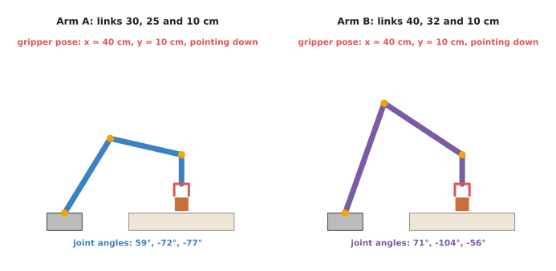
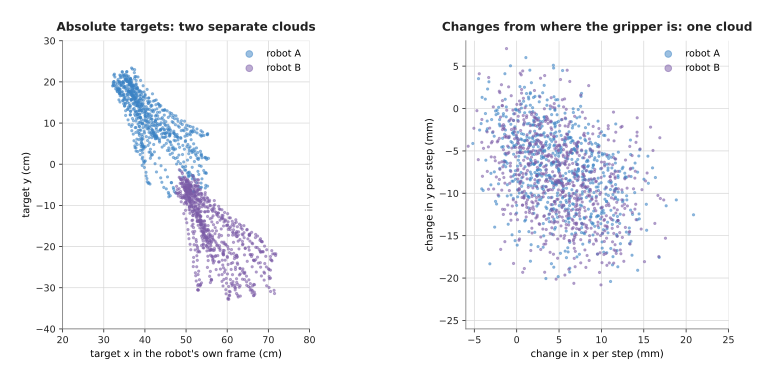
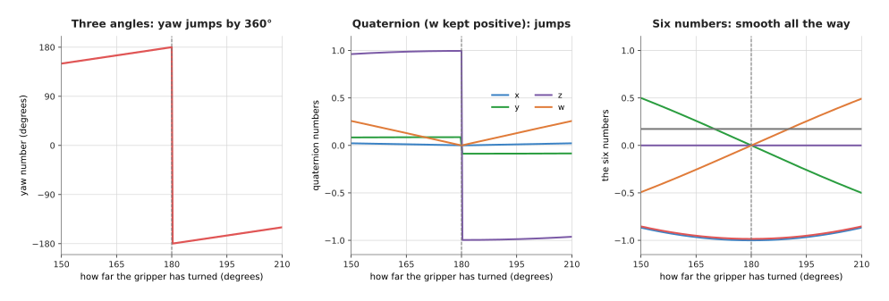
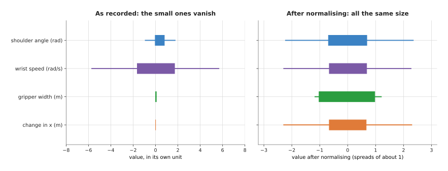

# Actions and observations

The three pages before this one described policies that copy a person, and all
three of them read an observation and write an action. So this page is about
those numbers themselves, and it opens both of them up. It shows what each
number means, how it is written down, and why the choice matters.

It answers six questions, and each one is a choice you have to make before you
record anything. Should the action be joint angles or a position for the
gripper? Should it be a place to go to, or a change from where the arm is now?
How do you write down a turn of the gripper? Why must every number be rescaled
before training starts? How fast should the policy run on the robot? And when
can data recorded on one robot be used to train a policy for another?

It is for a reader who has read [behaviour cloning](01_behaviour-cloning.md) and who
knows what a policy, an observation and an action are. These choices look like small
details, but in practice they decide whether a policy trains at all, and whether
someone else's recordings are any use to you.

> Before this page, it helps to have read [rigid
> transforms](../../../05_programming-techniques/02_geometry-and-cameras/02_most-used/02_rigid-transforms.md),
> which explains frames, rotation matrices and quaternions. Sections 3 to 5 of this
> page use all three.

## Contents

1. [The idea in one sentence](#1-the-idea-in-one-sentence)
2. [What an observation is made of](#2-what-an-observation-is-made-of)
3. [Joint angles or gripper pose](#3-joint-angles-or-gripper-pose)
4. [A place to go to, or a change from here](#4-a-place-to-go-to-or-a-change-from-here)
5. [How a turn is written down](#5-how-a-turn-is-written-down)
6. [The gripper number](#6-the-gripper-number)
7. [Rescaling every number before training](#7-rescaling-every-number-before-training)
8. [How often the policy decides, and chunks](#8-how-often-the-policy-decides-and-chunks)
9. [A worked example: one recorded moment](#9-a-worked-example-one-recorded-moment)
10. [Using data from another robot](#10-using-data-from-another-robot)
11. [What goes wrong](#11-what-goes-wrong)
12. [Libraries and models](#12-libraries-and-models)
13. [Why these choices matter, and what they cost](#13-why-these-choices-matter-and-what-they-cost)
14. [The written alternative](#14-the-written-alternative)
15. [Where to read next](#15-where-to-read-next)
16. [Using it in Python](#16-using-it-in-python)

---

## 1. The idea in one sentence

The introduction said that these choices decide whether a policy trains at all,
and here is the reason in one sentence. A policy only ever sees lists of
numbers, so what each number means, and what size it is, decides what the policy
can learn.

For example, imagine you give a friend directions to your house. You could say
"go to 12 Station Road", which is an address, and it works from anywhere. Or you
could say "turn left, then walk 200 metres", which is a change from where they
stand, so it only works if they start in the right place. You could also give
the directions in miles to someone who thinks in kilometres. All three describe
the same house, but some of them will get your friend lost.

A policy has the same problem, because the same movement of the arm can be
written down in several ways. The network has to learn from whichever way you
chose. So some of those ways are easy for a network to learn, and some of them
are not.

---

## 2. What an observation is made of

Section 1 said that a policy only sees lists of numbers, so this section says
which numbers those are on the way in. The **observation** is everything the
policy is given at one moment, and for a robot arm it usually has three parts.

- **Camera pictures.** Often one camera looks at the table from a fixed place, and
  one camera sits on the arm's wrist. The pictures are usually made smaller before
  they go in, and many policies use 224 by 224 pixels, while ACT uses 480 by 640.
- **The arm's own state.** This is the angle of each joint and how open the gripper
  is, read from the arm's own sensors. People call this **proprioception**, which
  means the body's sense of its own position. Some policies also get the gripper's
  position in space, worked out from the joint angles.
- **Sometimes more.** This can be a sentence saying what task to do, as in
  [vision-language-action models](../../07_language-models/02_most-used/01_vision-language-action-models.md).
  It can be the last one or two moments, so that the policy can tell which way
  things are moving. And it can be force readings, for tasks with a lot of pressing.

Each picture goes through a seeing network first, which turns it into a list of
numbers. So the rest of the policy then sees one long list of numbers, in which
the joint angles, the gripper width and the picture numbers all sit side by
side. This is why the rest of this page matters. Nothing in the list says "this
number is in radians" or "this number is in metres", because the network only
ever sees values.

The **action** is what the policy gives back, and it has three parts: where the
arm should move, how it should be turned, and how open the gripper should be.
Sections 3 to 6 go through those three parts one at a time.

---

## 3. Joint angles or gripper pose

The first part of the action is where the arm should move, and there are two
common ways to say it.

The first is **joint angles**, where the action is one target angle for each
joint, so for a six-joint arm that is six numbers. ACT on ALOHA works this way,
and so do most policies trained with cheap LeRobot arms such as the SO-101.

The second is the **gripper pose**, also called the **end-effector pose**. The
**end-effector** is the tool at the end of the arm, which here is the gripper, and
its **pose** is where it is, as three numbers (x, y and z), together with how it is
turned. The action then says where the gripper should be, and ordinary code works
out the joint angles that put it there. That code is called **inverse kinematics**,
and Book 5 explains it in
[numerical inverse kinematics](../../../05_programming-techniques/06_planning-and-search/02_most-used/02_numerical-inverse-kinematics.md).

So the picture below shows why the choice between them matters. Two different
arms put the gripper in exactly the same place, pointing straight down at a
block, and the script that drew it worked out each arm's joint angles.



The gripper pose is the same for both arms, which is 40 cm out, 10 cm up,
pointing down. But the joint angles are not the same, because arm A needs 59°,
−72° and −77°, while arm B needs 71°, −104° and −56°.

So the two ways of writing the action have different strengths.

- **Joint angles** need no extra code. They say exactly what each motor should do,
  so the arm can never be asked for a pose it cannot reach. They are the natural
  choice when the recording comes from a leader arm, which already records joint
  angles. But they only mean something on one kind of arm.
- **Gripper pose** means the same thing on any arm, because "put the gripper 2 cm
  above the block" makes sense for every robot. It is also closer to the task, since
  the task is about where the gripper goes. But it needs inverse kinematics
  underneath, and that can fail near the edge of the arm's reach.

---

## 4. A place to go to, or a change from here

Section 3 chose what the action refers to, and the second choice is whether the
action names a place or a change.

An **absolute** action names a place, such as "move the gripper to x = 42 cm, y
= 10 cm". The numbers are measured from a fixed point, which is usually the base
of the robot.

A **relative** action, also called a **delta** action, names a change from where
the arm is now, such as "move the gripper 1 cm to the left". The word **delta**
is the name of the Greek letter Δ, which people use to mean "a change in".

The picture below shows the same kind of recording made on two robots. On both
of them, a person reached from a resting spot to a mug somewhere on the table,
and the only difference is that robot B is bolted to the table in a different
place, and each dot in the picture is one recorded moment.



On the left, the targets are measured from each robot's own base, so the two
robots' clouds sit in different places. The middle of robot A's cloud is at
about (42, 10) cm and the middle of robot B's is at about (56, −16) cm. On the
right, the same movements are written as the change from one moment to the next,
so now both clouds are in the same place. For both robots, the average change is
about 5 mm along x and about −7 to −8 mm along y.

This is the main reason people like relative actions. A network trained on the
left-hand numbers has to learn two separate things, one for each robot, whereas
a network trained on the right-hand numbers learns one thing. So the recordings
from the two robots help each other.

But relative actions have two costs of their own.

- **Small errors add up.** Each change is added to where the arm is now, so if each
  step is a little short, then the arm ends up well short after a hundred steps. An
  absolute target does not drift in this way.
- **The change depends on the step length.** "1 cm per step" means 50 cm a second
  at 50 steps a second, and 10 cm a second at 10 steps a second. Section 8 comes
  back to this.

So many recent models use a middle way, in which the action chunk is written
relative to the pose the gripper had at the start of the chunk, and not relative
to the step before. Every target in the chunk then refers to the same starting
point, so small errors do not add up inside the chunk.

---

## 5. How a turn is written down

Sections 3 and 4 dealt with where the arm goes, and the action also says how the
gripper should be turned. A turn in 3D has three degrees of freedom, but there are
several ways to write it as numbers. Book 5's page on [rigid
transforms](../../../05_programming-techniques/02_geometry-and-cameras/02_most-used/02_rigid-transforms.md#quaternions-in-plain-words)
explains each one, so here the question is only which of them a network can learn.

- **Three angles**, often called roll, pitch and yaw, or **Euler angles**. They are
  easy for people to read.
- A **quaternion**, which is four numbers that store the axis of the turn and how
  far it turns.
- A **rotation matrix**, which is nine numbers.
- The **six-number form**, which keeps only the first two columns of the rotation
  matrix, because the third column can always be worked out from the other two.
  This form was proposed for neural networks by Zhou and others in 2019.

But the problem is that some of these forms jump. The picture below turns the
gripper smoothly from 150° to 210° about the vertical, with a small tilt, and it
plots the numbers each form gives.



At 179° the yaw number is 179, but at 181° it is −179. So the gripper moved by
2°, while the number moved by 358°. The quaternion jumps as well, because many
libraries keep its last number positive, so its z number flips from 0.996 to
−0.996 at the same place. The six numbers change by only about 0.03 each.

A jump like this is bad for a network, because a network gives outputs that change
smoothly with its inputs. Near 180°, the recorded answers are sometimes 179 and
sometimes −179 for nearly the same picture. The network is trained to be close to
both, so it learns their average, which is 0. That is a turn of 0° instead of 180°,
which leaves the gripper facing the wrong way. This is the same averaging problem
that
[behaviour cloning](01_behaviour-cloning.md#two-good-ways-become-one-bad-way)
describes, caused here only by how the number is written.

For this reason many policies output the six-number form, while people usually
store rotations as quaternions and show them to people as three angles. Small
changes of rotation from one step to the next are less of a problem, because a
change of a few degrees stays far from the jump, so three angles are often used
for relative actions.

---

## 6. The gripper number

Sections 3 to 5 covered where the gripper goes and how it is turned, and the
last number in the action says how open it should be, and there are two common
forms for that number.

- **A width.** This is a number from fully closed to fully open, such as 0 to 8 cm,
  and it lets the policy close gently on something soft.
- **Open or closed.** This is one number that is 0 or 1, and the gripper's own
  controller then closes until it feels resistance. Many datasets use this form.

But datasets disagree about which way round it goes, because in some of them 1
means open, while in others 1 means closed. So if you mix them without checking,
then the policy learns to open when it should close for half of its data. Always
check the gripper convention of every dataset you use.

---

## 7. Rescaling every number before training

Sections 3 to 6 settled what each number means, and this section is about how
large each one is. This is worth a section of its own, because the numbers in
one observation have very different sizes. A joint angle in radians is often
between −3 and 3, while a wrist speed can be 5 or more. A gripper width in
metres is between 0 and 0.08, and a change in position per step might be 0.002
m.

The picture below shows four such numbers from a made-up set of recordings. The
coloured box covers the middle half of the values, and the line covers nearly
all of them.



On the left, the gripper width and the change in x are so small that they almost
vanish. On the right, each number has had its average taken off and has been
divided by its **spread**. The spread here is the **standard deviation**, which
is a measure of how far the values usually are from their average. After this,
every number has an average of 0 and a spread of 1, and this step is called
**normalising**.

Normalising matters for two reasons, and both of them are about training.

The first reason has to do with the loss. Training adds up the error in every
number, so suppose the policy is wrong by one spread in each of the four
numbers. Without normalising, the script found that the wrist speed makes up
94.6% of the loss, while the gripper width makes up 0.016% and the change in x
makes up 0.0002%. So training works hard on the wrist speed and almost ignores
the gripper, which is often the number that decides whether the task succeeds.

The second reason has to do with the inside of the network. The layers of a
network work best when their inputs are around −1 to 1, because very large or
very small inputs make training slow or unstable.

There are two common ways to normalise a number.

- **Mean and spread.** Take off the average, and divide by the standard deviation.
- **Smallest to largest.** Stretch the values so that the smallest becomes −1 and
  the largest becomes 1. Diffusion and flow policies usually do this for actions,
  because their cleaning-up process assumes the answer lies in a fixed range.

The statistics come from the training data, and they must be saved with the
policy, because the same numbers must be used when the policy runs on the robot.
The policy's output is then turned back into real units with the same numbers,
in reverse. LeRobot does all of this for you, because each dataset keeps a file
of statistics, in `meta/stats.json`, with the average, standard deviation,
smallest and largest value of every number. Each policy's settings then say
which of the two ways to use for pictures, for the arm's state and for actions.

---

## 8. How often the policy decides, and chunks

Section 7 was about the size of each number, and this section is about how often
those numbers arrive. The **control rate** is how many times a second the arm
gets a new target, and it is measured in **hertz**, written Hz, which means
"times a second". ALOHA records at 50 Hz, the DROID dataset records at 15 Hz,
and the Bridge dataset, recorded on small WidowX arms, records at 5 Hz.

The control rate is part of what an action means, and this matters most for
relative actions. Say a recording at 50 Hz has the gripper move 2 mm each step,
which is 10 cm a second. If a policy trained on it runs at 10 Hz and sends the
same 2 mm each step, then the arm moves at 2 cm a second. So it moves the right
way at a fifth of the speed, and it may never reach the mug before the time runs
out.

An **action chunk** is a list of the next few actions, predicted together, and the
[action chunking page](02_action-chunking-transformers.md) explains why chunks help.
A chunk's length only means something together with the control rate. ACT's chunk of
100 steps at 50 Hz covers 2 seconds, while a chunk of 16 steps at 10 Hz covers 1.6
seconds, and a chunk of 16 steps at 50 Hz covers only a third of a second.

So when you use a policy or a dataset, write down three things together: the control
rate, the chunk length, and how many steps of each chunk the arm plays before the
policy is asked again. How fast the policy itself must run is covered in
[running a model on a robot](../../10_making-models-work-on-an-arm/02_most-used/02_running-a-model-on-a-robot.md#2-how-fast-is-fast-enough).

---

## 9. A worked example: one recorded moment

Sections 3 to 8 each made one choice, and this section puts all of them on a
single recorded moment. Here is one moment from a recording on arm A, the arm on
the left of the first picture. The numbers come from the diagram script for this
page, `docs/diagrams/movement_models_3.py`, which prints them when it runs.

The arm is holding the gripper 40 cm out and 10 cm up, pointing straight down.
At the next moment of the recording, the gripper has moved 1 cm towards the
robot and turned 2°. The table below writes that one movement in four ways, and
you read each row as one way a dataset could store the same action.

| Way of writing the action | The numbers |
| --- | --- |
| Absolute joint angles | 61.19°, −75.77°, −73.42° |
| Relative joint angles | +2.61°, −4.23°, +3.63° |
| Absolute gripper pose | x = 39 cm, y = 10 cm, turned −88° |
| Relative gripper pose | x −1 cm, y 0 cm, turn +2° |

There are two things worth noticing in that table. The relative gripper pose is
the only row that a person could read and understand at once. And a small,
simple move of the gripper can need all three joints to change, by different
amounts.

Now consider how that same moment's turn is written down. In 3D, a turn of 30°
about the vertical axis, written in the
six-number form, is (0.866, 0.5, 0, −0.5, 0.866, 0). But a network never outputs six
numbers that fit together exactly, so say it outputs (0.80, 0.55, 0.05, −0.45, 0.84,
0.02). The program then tidies this into a real rotation in three steps.

1. Make the first three numbers length 1. This gives (0.823, 0.566, 0.051).
2. Remove from the second three numbers any part that points along the first, and
   then make the rest length 1. This gives (−0.567, 0.823, 0.015).
3. Work out the third column from the first two with a **cross product**, which
   gives the direction at right angles to both. This gives (−0.034, −0.042, 0.999).

So the result is a turn of about 34.5° about the vertical, which is close to
what the network meant. But the same repair cannot be done for three angles that
jumped by 358°.

Last of all comes the rescaling of each number. In the made-up recordings, the
gripper width has an average
of 0.0387 m and a spread of 0.0326 m, so an open gripper at 0.07 m becomes
(0.07 − 0.0387) / 0.0326 = 0.96. A change in x of 0.010 m, with an average of
0.0020 m and a spread of 0.0040 m, becomes 2.0. So after rescaling both numbers are
of an ordinary size, and the loss treats them fairly.

---

## 10. Using data from another robot

All the choices above were made for one robot, and this section is where they pay
off or fail. Robot recordings are slow and costly to collect, so people want to
train
one policy on recordings from many different robots. This is called
**cross-embodiment** training, where an **embodiment** is one kind of robot body:
its arms, joints, gripper and cameras. So whether it works depends almost entirely on
the choices above.

The first large attempt was **Open X-Embodiment**, from 2023, in which more than
twenty laboratories pooled recordings from 22 kinds of robot into one dataset.
Book 3
tells its story in
[the foundation models document](../../../03_frameworks/08_frontier/02_foundation-models.md#32-open-x-embodiment-and-the-data-that-made-openness-possible).
The policies trained on it, RT-1-X and RT-2-X, wrote every robot's action as the
same
seven numbers, which were a change in gripper position, a change in gripper
turn, and
the gripper. But the numbers were not put into the same frame or the same scale for
every robot. So the same seven numbers could mean different movements on different
robots, and the policy had to guess which robot it was on from the pictures.

**Octo**, from 2024, was trained on about 800,000 recordings from Open
X-Embodiment. It normalised each dataset's actions with that dataset's own
statistics, so that a large arm and a small arm gave numbers of the same size. Its
authors also showed that it can be fine-tuned for a robot with a different kind of
action, such as joint angles, by giving it a new output part.

**NVIDIA's GR00T N1.7**, released in 2026, went further, because its actions are
written relative to the gripper's current pose. The
[foundation models document](../../../03_frameworks/08_frontier/02_foundation-models.md#6-nvidia-isaac-gr00t)
records that NVIDIA names this as the key factor in how well it works across robots.
A move of 3 cm to the left means the same thing on every body, while a target
position does not. The same choice let it learn from 20,000 hours of video of human
hands, because a human hand moving 3 cm to the left is written the same way as a
gripper moving 3 cm to the left. The page on
[learning from human video](../03_also-used/04_learning-from-human-video.md) goes
further into this.

**Physical Intelligence's π0.7**, from 2026, takes another route, because each
training recording carries a label that says whether its actions are joint angles or
gripper poses. The model learns what the label means, so you can choose the kind of
action when you run it. The
[foundation models document](../../../03_frameworks/08_frontier/02_foundation-models.md#4-physical-intelligence-and-the-pi-models)
describes it.

So the pattern is the same in all four of these models. Data from another robot
helps only when its numbers mean the same thing as yours, or when the model is
told what they mean. So the questions to ask of any dataset are the ones on this
page. Are the actions joint angles or gripper poses, and absolute or relative?
Which rotation form do they use, and in which frame? Which way round is the
gripper number, and what is the control rate? And were the numbers normalised,
and with what statistics?

---

## 11. What goes wrong

Each fault below follows from one of the choices above, so each one is given
with its usual cause and its fix.

**The arm moves at the wrong speed.** It goes the right way, but too slowly or too
fast. The usual cause is relative actions played at a different control rate
from the
recording, so check the rate the data was recorded at.

**The gripper spins suddenly by nearly a full turn.** The usual cause is three
angles or a quaternion with a jump in it, near 180°. So use the six-number form for
the network's output, or keep all training turns away from the jump.

**The gripper opens when it should close.** The usual cause is two datasets with
opposite gripper conventions, so check the convention of every dataset.

**The arm ignores the gripper, or moves only one joint.** The usual cause is numbers
that were not normalised, so the loss was dominated by one large number. Or else the
statistics saved with the policy do not match the ones used in training.

**The arm drifts further and further from where it should be.** This is because
relative actions add up small errors. So write the chunk relative to its starting
pose, or use absolute targets for the final approach.

**The arm stops at the edge of its reach, or jerks.** Gripper-pose actions need
inverse kinematics, which can fail or jump near the edge of the reach. So keep the
task well inside the reach, or use joint angles.

**Mixed data makes the policy worse, not better.** This happens because the
datasets' numbers mean different things. So convert them to one convention before
training, or give the model a label for each kind.

---

## 12. Libraries and models

Section 11 listed the faults, and the tools below either make these choices for
you or let you make them yourself.

- **LeRobot**, from Hugging Face, stores recordings in one standard format. Each
  dataset lists its numbers by name, such as `observation.state` and `action`, and
  keeps their statistics in `meta/stats.json`. Each policy's settings choose how to
  normalise pictures, state and actions. Book 3 describes it in
  [data and demonstration](../../../03_frameworks/08_frontier/03_data-and-demonstration.md#71-what-it-is-and-why-it-won).
- **Octo** normalises each dataset separately, and it can be given a new output part
  for a new kind of action.
- **Open X-Embodiment** stores many robots' recordings in one file format, so read
  each dataset's description before mixing it with others.
- **GR00T N1.7** writes its actions relative to the gripper's current pose.
- **SciPy's** `scipy.spatial.transform.Rotation` class converts between three
  angles, quaternions and rotation matrices, and the six-number form is the first
  two columns of the matrix it gives.
- The **Universal Manipulation Interface**, or **UMI** (2024), records
  demonstrations with a handheld gripper and a wrist camera. It writes its actions
  relative to the gripper's current pose, so that the same recordings can train
  policies for different arms.

---

## 13. Why these choices matter, and what they cost

The sections above made each choice in turn, and this section weighs the whole
set. It helps to look at this through four questions: what it is, what it does
for you, why you would pick it over the obvious alternative, and what it costs.

The choices on this page are the way a movement is written as numbers for a
policy.

Choosing them well makes a policy train faster and more reliably, and it decides
whether other people's recordings can help you at all.

The obvious alternative is to store whatever numbers your robot happens to
produce, which is usually absolute joint angles in the robot's own units at the
robot's own rate. This is the right choice for a single robot trained only on
its own data, because it is simple, and nothing needs converting. A policy
trained with ACT on one SO-101 arm works well this way. But the other choices
start to pay when you want to mix data from more than one robot, or from human
video, or to reuse a model someone else trained. Then relative gripper-pose
actions, the six-number rotation form and careful normalising are what make the
numbers mean the same thing everywhere.

What it costs you:

- Gripper-pose actions need inverse kinematics and a correct model of the arm.
- Relative actions drift, and they tie the data to one control rate.
- Converting a dataset means reading its conventions carefully, because a single
  wrong sign or axis order gives no error message, only a policy that does not work.
- The statistics must travel with the policy, because if they are lost or
  mismatched, then the policy's outputs are the wrong size.

---

## 14. The written alternative

There is no written alternative here, because this page does not describe a model
that does a job. Instead it describes the numbers that every policy reads and
writes.
Written code makes the same choices, and Book 5 explains them there. [Rigid
transforms](../../../05_programming-techniques/02_geometry-and-cameras/02_most-used/02_rigid-transforms.md)
covers the ways to write down a turn, and [numerical inverse
kinematics](../../../05_programming-techniques/06_planning-and-search/02_most-used/02_numerical-inverse-kinematics.md)
turns a gripper pose into joint angles.

The difference is only in what a bad choice costs you. A number that jumps, such
as a yaw angle passing 180°, can trouble written code too, but a programmer can
handle the jump with a special case. A network cannot do that, because it learns
the average of the two sides instead, as section 5 shows.

---

## 15. Where to read next

This page finishes the most-used group, so the reading below either shows these
choices at work or moves on to the methods that do not copy a person.

- [Action chunking transformers](02_action-chunking-transformers.md) use absolute
  joint-angle chunks, so they are a good place to see these choices in a working
  policy.
- [Diffusion and flow policies](03_diffusion-and-flow-policies.md) explain why
  their actions are rescaled to a fixed range.
- [Learning from human video](../03_also-used/04_learning-from-human-video.md)
  depends on relative gripper-pose actions.
- Book 5's [rigid transforms](../../../05_programming-techniques/02_geometry-and-cameras/02_most-used/02_rigid-transforms.md)
  explains rotation matrices, quaternions and three angles in detail, and Book 3's
  [Euler angles, intrinsic and extrinsic](../../../03_frameworks/03_arm-movement/08_frames-and-conventions.md#24-euler-angles-intrinsic-and-extrinsic)
  explains why three angles need a stated convention.
- To go back to the list of all the kinds of policy, read
  [the chapter overview](../01_overview.md).

---

## 16. Using it in Python

This page has been about choices: joint angles or gripper poses, absolute targets or
changes, how a turn is written down, and how every number is rescaled before
training. Section 12 said that LeRobot records all of that in the dataset itself. This
section shows how to read those choices out of a dataset in Python, because that is
how you find out what somebody else's recordings actually contain before you train on
them.

```python
from lerobot.datasets import LeRobotDataset, LeRobotDatasetMetadata

meta = LeRobotDatasetMetadata("lerobot/svla_so101_pickplace")   # metadata only, a few MB
print(meta.fps, meta.robot_type, meta.camera_keys)
print(meta.features["action"]["names"])        # what each action number means
print(meta.features["action"]["shape"])        # how many numbers per action
print(meta.stats["action"]["min"], meta.stats["action"]["max"])

dataset = LeRobotDataset(
    "lerobot/svla_so101_pickplace",
    # load the next 16 actions with each frame, spaced one frame apart
    delta_timestamps={"action": [i / meta.fps for i in range(16)]},
)
sample = dataset[0]
print(sample["observation.state"].shape, sample["action"].shape)
```

`LeRobotDatasetMetadata` downloads only the small description files, not the videos, so
these four `print` lines cost a few seconds even for a dataset of hundreds of
gigabytes. That makes them the right first thing to run on any dataset you are
thinking of using. `meta.features["action"]["names"]` is the most useful of them,
because it is where the dataset says whether its actions are joint angles or a gripper
pose: a list such as `shoulder_pan.pos` through `gripper.pos` tells you it is joint
angles, while names such as `x`, `y`, `z` and a rotation tell you it is a pose. The
`shape` tells you how many numbers there are, which is how you catch the mismatch that
section 10 warned about when mixing robots. And `meta.stats` holds the minimum,
maximum, mean and standard deviation of every signal, which are exactly the numbers
that section 7's rescaling needs.

The `delta_timestamps` argument is how section 8's chunks are actually loaded. You
give it a list of time offsets in seconds for each signal, and the dataset returns
that many frames stacked together instead of one. Dividing by `meta.fps` turns a count
of frames into seconds, which is why the frame rate has to be read first. You never
write this by hand for a packaged policy, because each policy's configuration
generates its own offsets, but writing it yourself is how you load a chunk for a
network of your own.

What LeRobot gives you, then, is a file format that carries its own meaning, so that a
dataset is self-describing and the statistics travel with it. What you have to do
yourself is the rescaling if you are not using a LeRobot policy, since these are only
the numbers, not the transformation; `make_pre_post_processors` does it for you when
you are.

What you have to decide is what your own recordings will contain, and that decision is
made once and then is very hard to change. If you record joint angles, your data is
tied to your arm's geometry and cannot train a policy for a different arm. If you
record gripper poses, you need a working inverse kinematics solver at run time, and
you have chosen the turn convention that section 5 discussed. If you record changes
rather than absolute targets, small errors add up over a chunk. None of these can be
converted afterwards without the full calibration and kinematics of the robot that
recorded them, which is usually not in the dataset. So the honest advice is to read
these fields on any dataset you are offered, and to expect that a dataset recorded for
another robot needs work you can measure in weeks rather than an afternoon.
