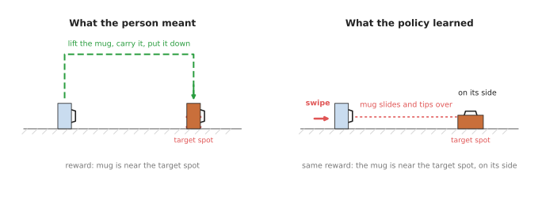

# Reinforcement learning policies

The four pages before this one all assumed that a person can do the task,
because a copying policy has nothing to learn from otherwise. So this page
answers one question: how can a robot arm learn a movement that nobody can show
it, by trying again and again and being told how well each try went? That way of
learning is called reinforcement learning, and the model it produces is a
reinforcement learning policy.

The page is for a reader who has read
[how a model learns](../../01_what-models-are/02_how-a-model-learns.md) and, ideally,
[behaviour cloning](../02_most-used/01_behaviour-cloning.md). Behaviour cloning
copies a person, whereas reinforcement learning does not need a person to do the
task at all, because it needs a way to score each attempt instead. Every new word is
explained where it first appears.

## Contents

1. [What it is](#1-what-it-is)
2. [What goes in and what comes out](#2-what-goes-in-and-what-comes-out)
3. [How it works inside](#3-how-it-works-inside)
4. [How it is trained](#4-how-it-is-trained)
5. [Well-known models and methods](#5-well-known-models-and-methods)
6. [A worked example: pushing a peg into a hole](#6-a-worked-example-pushing-a-peg-into-a-hole)
7. [What goes wrong, and what people do about it](#7-what-goes-wrong-and-what-people-do-about-it)
8. [Why this kind, and what it costs](#8-why-this-kind-and-what-it-costs)
9. [The written alternative](#9-the-written-alternative)
10. [Where to read next](#10-where-to-read-next)

---

## 1. What it is

The introduction said that the arm learns by trying, so here is that idea in one
sentence. The arm tries a movement, a program gives the attempt a score, and the
model is changed a little, so that high-scoring movements become more likely
next time.

The score is called the **reward**, and it is a number that a person writes a
rule for, such as "1 if the peg is in the hole, 0 if it is not". The model that
picks the movements is called the **policy**, as it is on every page in this
chapter. The process of trying, scoring and adjusting, over and over, is called
**reinforcement learning**, which is often shortened to RL. The word
"reinforcement" means that actions which led to a good score are made stronger.

For example, think of a child learning to throw a ball into a bin, where nobody
explains the angle of the arm or the force of the throw. The child throws, sees
whether the ball went in, and throws again a little differently. So after many
throws the child is good at it, and the child needed only one piece of
information each time, which was in or out.

Reinforcement learning works the same way, but with two differences. It needs
far more tries than a child does, often millions of them. And the rule for the
score has to be written down exactly, because the computer follows it exactly.

So the picture shows three attempts from early, middle and late in training. The
first
attempt misses and scores low, while the last one puts the peg in the hole and
scores
1.0. Those numbers are an example of a reward rule, and not a measurement.

---

## 2. What goes in and what comes out

Section 1 introduced the reward, so this section shows where it sits among the
other numbers. A reinforcement learning policy for an arm takes in a description
of the current moment, which is called the **observation**, and for an arm it
can include:

- the joint angles and how fast each joint is turning
- the position of the gripper
- readings from a force sensor at the wrist, which measure how hard the arm is
  pushing on something
- sometimes camera pictures, although many policies use simple numbers instead,
  because pictures make learning much slower

Then it gives back one **action**, which is a small movement command for the
next moment, such as "move the gripper 2 mm down and 1 mm left". The policy is
asked again many times a second, so the arm moves in many small steps.

The table below shows one concrete example of all of these. Read each row as one
input or output of the policy.

| | What it is | An example for pushing a peg into a hole |
| --- | --- | --- |
| In | joint angles and speeds | six angles and six speeds |
| In | gripper position | where the peg tip is, in millimetres |
| In | force at the wrist | how hard the peg presses on the block, and in which direction |
| Out | an action | a small push: 2 mm down and 1 mm left, repeated many times a second |
| Used only in training | the reward | 1.0 when the peg is fully in, less when it is close |

Notice that the reward is not an input to the finished policy. It is only used
while training, to decide how to change the policy.

---

## 3. How it works inside

Section 2 said what goes in and out, and this section says what sits between them.
Inside, the policy is usually a small neural network. A **neural network** is a
calculation with many adjustable numbers, and Chapter 1 explains it in
[inside a neural network](../../01_what-models-are/03_inside-a-neural-network.md).
For a task that uses simple numbers as input, the network can be small, with only a
few layers.

So what makes reinforcement learning different is not the network. It is the
loop around the network during training, and here is that loop.

1. The arm, which is usually a simulated one, starts in some position.
2. The policy looks at the observation and picks an action. While learning, it adds
   a little randomness, so that it sometimes tries something new, and this is called
   **exploration**.
3. The arm makes that movement, and the simulation works out what happened.
4. The program computes the reward for what happened.
5. This repeats until the attempt ends, either because the peg goes in or because
   time runs out, and one whole attempt is called an **episode**.
6. After many episodes, a learning method looks at which actions came before high
   rewards and which came before low ones. Then it changes the network's numbers, so
   that the good actions become more likely.
7. Back to step 1, with the slightly better policy.

Many methods also train a second network, called a **critic** or a **value
function**, which learns to guess how much reward is still to come from the
current moment. This helps, because the real reward often arrives only at the
very end, so the critic lets the learner tell early on whether things are going
well.

One difficulty in that loop is important enough to need a name. When the reward
only arrives at the end, the learner has to work out which of hundreds of small
actions deserved the credit. This is called the **credit assignment problem**,
and it is one reason reinforcement learning needs so many tries.

---

## 4. How it is trained

Section 3 described a loop that runs many times, and this section says where
those runs happen. Reinforcement learning makes its own data by trying things,
so it does not need recorded demonstrations. But it needs a very large number of
tries, often in the millions. A real arm cannot do millions of tries, because it
would take years, and it would wear out or break things. So almost all
reinforcement learning for arms happens in a **simulator**, which is a program
that works out how a virtual arm and virtual objects move and bump into each
other. A simulator can run thousands of virtual arms at once, much faster than
real time, on a graphics card.

But this creates a new problem, because the simulator is never exactly like the
real world. Friction, weight, springiness and camera pictures are all a little
wrong, so a policy that learned in the simulator can fail on the real arm, and
this gap is called the **sim-to-real gap**.

The most common fix for that gap is called **domain randomisation**. Instead of
building one very accurate simulated world, you train in thousands of slightly
different ones. Each one has a different table colour, different lighting, a
different friction, a slightly different mug size, or a camera in a slightly
different place. The policy has to work in all of them, so the real world is,
with luck, just one more variation it has already met.

The picture shows six of the randomised training worlds on the left, each with
one thing changed, and the real table on the right.

But there are two other ways to get the practice.

- **Offline reinforcement learning** learns from a fixed pile of recorded attempts,
  without practising at all.
- **Real-world reinforcement learning** practises on the real arm, but only for a
  short time. It usually starts from a policy that already works a little, which is
  often one trained by copying. A person watches and can take over when the arm goes
  wrong, and those corrections help the learning.

The second of these is where much of the useful work happens in 2026, and the
[learned methods document](../../../03_frameworks/04_one-arm-training/03_learned-methods.md#2-learning-from-trial-and-error)
describes the evidence.

---

## 5. Well-known models and methods

The pages before this one listed famous models, but in reinforcement learning
the famous names are mostly learning methods rather than finished models,
because each task trains its own policy. The methods below are all real, and all
widely used.

- **Proximal Policy Optimization, or PPO** (OpenAI, 2017). This is a learning method
  that changes the policy in small, safe steps, and it is the most common choice for
  training in a fast simulator with many arms at once.
- **Soft Actor-Critic, or SAC** (University of California, Berkeley, 2018). This is a
  learning method that reuses old attempts many times, so it needs fewer tries, which
  makes it popular for learning on real robots.
- **QT-Opt** (Google, 2018). This is a system that learned to grasp objects from a
  bin using reinforcement learning on several real robot arms at once, collecting
  attempts over several weeks. So it showed that learning on real hardware was
  possible, and also how costly it was.
- **Dactyl** (OpenAI, 2018 and 2019). This is a robot hand that learned to turn a
  block, and later a Rubik's Cube, in its fingers. It trained only in simulation with
  heavy domain randomisation, and then worked on the real hand.
- **IndustReal** (NVIDIA, 2023). These are policies for fitting pegs and gears into
  holes, trained only in simulation and then used on a real Franka arm without any
  real practice.
- **HIL-SERL** (University of California, Berkeley, 2024). This is a system that
  fine-tunes a policy on the real arm with a person watching and correcting. It
  learned precise tasks, such as inserting computer parts, in one to two and a half
  hours of real practice.

The tools for running these are listed, with their licences, in the
[learned motion document](../../../03_frameworks/03_arm-movement/05_learned-motion.md#4-reinforcement-learning-for-contact).

---

## 6. A worked example: pushing a peg into a hole

The methods in section 5 all need a task that suits them, and pushing a peg into
a tight hole is the classic one for reinforcement learning on an arm. The gap
around the peg can be smaller than a camera can see, so the arm has to feel its
way in, by reacting to the force it senses. A person finds this hard to
demonstrate with a joystick, but a program can easily check whether the peg is
in.

Here is how such a project would go, step by step.

1. **Build the simulation.** Model the arm, the peg and the block with the hole,
   where the shapes can come from the parts' computer drawings.
2. **Write the reward.** For example: 1.0 when the peg is all the way in, a smaller
   amount the closer the peg tip is to the hole, and a small penalty for pushing too
   hard.
3. **Add randomness.** Each episode starts the peg in a slightly different place,
   with slightly different friction and a slightly different hole position.
4. **Train.** Run thousands of simulated arms at once with PPO. At first the peg
   lands anywhere, but after many attempts it finds the hole, and then it learns to
   wiggle in when it catches the edge.
5. **Move to the real arm.** A classical planner brings the peg to just above the
   hole, and then the learned policy takes over for the last few millimetres, where
   contact matters.
6. **Check and, if needed, fine-tune.** Test it many times on the real arm. If it
   fails often, then a short period of real-world learning with a person watching can
   close the gap.

Note step 5, because the learned policy does only the part near the contact. The
long
move across the table is done by ordinary planning, which is faster and safer for
that job, and the
[learned motion document](../../../03_frameworks/03_arm-movement/05_learned-motion.md#1-which-part-of-the-move-a-policy-stands-in-for)
explains this split.

---

## 7. What goes wrong, and what people do about it

The worked example assumed a reward rule that says what you meant, and that
assumption is the first thing to fail. Each problem below is followed by what
people do about it.

**The reward says something you did not mean.** The learner finds any way to get a
high score, including ways you did not expect. Suppose the reward is "the mug is
near
the target spot". Then the policy may learn to knock the mug across the table, so
that it slides there and falls over, and that scores just as well as carrying it.
So this is a case of what people call **reward hacking**.

The left picture shows what the person meant, while the right picture shows a
movement that earns the same reward and is not what anyone wanted. So people fix
this by adding terms to the reward, such as "the mug must be upright", and by
watching the the trained policy carefully before trusting it.

**The simulator is wrong about contact.** Soft, slippery, bendy or breakable things
are hard to simulate, so a policy trained on a simulated sponge may fail on a real
one. So people use domain randomisation, measure the real parts to tune the
simulator, and finish with a short spell of real practice.

**It needs a huge number of tries.** However, training can take hours or days on a
graphics card, even in simulation. So people start from a policy trained by copying,
so that the learner does not start from nothing.

**It gives no safety guarantee.** The policy can output any action, and nothing
inside it stops it pushing too hard or moving too fast. So a separate layer
under the
policy has to limit forces and speeds. The
[collision and failure detection page](../../09_touch-and-body-models/02_most-used/02_collision-and-failure-detection.md)
covers one part of that layer.

**It does not transfer to a new task or a new arm.** A policy trained to insert one
peg does not insert a different connector, so usually you train again from the
start.

---

## 8. Why this kind, and what it costs

Section 7 listed the costs of the method, and this section asks when to pay
them. So there are two obvious alternatives to weigh against it.

The first is to program the movement by hand, where you write a search pattern:
push down, and if it catches then move in a small spiral, and so on. This is
often good enough, because it is easy to understand and to check. Reinforcement
learning is worth it only when the right reaction depends on forces too
complicated to write rules for.

The second is to copy a person, with
[behaviour cloning](../02_most-used/01_behaviour-cloning.md) or a
[diffusion policy](../02_most-used/03_diffusion-and-flow-policies.md). Copying is
cheaper, and it needs no simulator and no reward. So reinforcement learning is worth
it when a person cannot demonstrate the task well, or when you need the policy to
become better than the person was.

What reinforcement learning gives you is a policy that reacts to what it feels,
and that improves by practice instead of by more recordings.

What it costs you is a great deal more than copying. You need a simulator that
models the contact well enough, and you need a reward rule you trust. You also
need a large amount of computing, and the result is hard to explain when it
fails. So the table below sums up when it is worth the cost. Read each row as a
situation, and the column on the right as the usual choice.

| Situation | Usual choice |
| --- | --- |
| The motion is a free-space move from A to B | a classical planner, not learning |
| A person can easily show the task | copy them: behaviour cloning or ACT |
| The task is contact-heavy and easy to score, and can be simulated | reinforcement learning in simulation |
| A copied policy works most of the time but not reliably | a short burst of real-world reinforcement learning on top of it |
| The contact cannot be simulated and is hard to score | hand-written force control, or more demonstrations |

---

## 9. The written alternative

The table above put hand-written force control in the last row, so this section says
what that code is. The written way to fit a peg into a hole is force control with a
search pattern. [Impedance and force
control](../../../05_programming-techniques/07_control-and-motion/03_also-used/01_impedance-and-force-control.md)
makes the arm give way like a spring, so that when the peg meets the edge of the
hole, the side force pushes it towards the centre. Then a small written search, such
as the spiral in section 8, covers the rest when the hole's position is not known
exactly. For moves through free space, the written choice is [sampling-based
planning](../../../05_programming-techniques/06_planning-and-search/02_most-used/01_sampling-based-planning.md).
Book 3's [position, stiffness and
force](../../../03_frameworks/03_arm-movement/04_controlling-the-move.md#4-position-stiffness-and-force)
explains which contact jobs compliance suits.

The written way is better when the contact is simple enough to describe with a
spring and a few rules. But reinforcement learning is better when the right
reaction depends on forces too complicated to write rules for.

---

## 10. Where to read next

This page covered the first of the also-used methods, and the reading below
either compares it with copying or moves on to the next one.

In this chapter:

- [Diffusion and flow policies](../02_most-used/03_diffusion-and-flow-policies.md) learn by copying
  instead of by scoring.
- [Learned motion planners](02_learned-motion-planners.md) is the next page, and it
  covers networks that speed up classical planning.
- [The movement models overview](../01_overview.md) compares every kind in this
  chapter.

In other chapters of this book:

- [Latent world models](../../08_world-models/03_also-used/03_latent-world-models.md) explains
  learners that practise inside their own imagined world, which needs far fewer real
  tries.
- [Learned simulators](../../08_world-models/03_also-used/02_learned-simulators.md) covers networks
  that stand in for parts of a simulator.
- [Force and slip models](../../09_touch-and-body-models/02_most-used/01_force-and-slip-models.md)
  explains the force signals these policies often react to.

Deeper documents elsewhere in this repository:

- [Learning from trial and error](../../../03_frameworks/04_one-arm-training/03_learned-methods.md#2-learning-from-trial-and-error)
  gives the evidence, the branches of the method and where it stands in 2026.
- [Sim-to-real: what actually closed the gap](../../../03_frameworks/08_frontier/04_simulation-and-evaluation.md#5-sim-to-real-what-actually-closed-the-gap)
  goes deeper into moving from simulation to a real arm.
