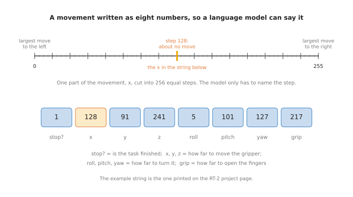
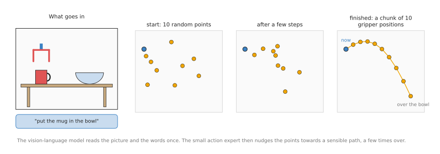
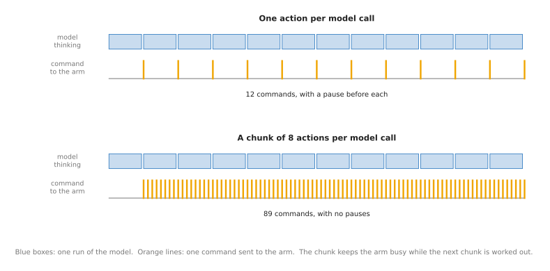

# Vision-language-action models

This page answers one question. How can one model take a camera picture and a
sentence, and move a robot arm to do what the sentence says?

It is for a reader who has read the two pages before it:
[language models as planners](../03_also-used/01_language-models-as-planners.md) and
[vision-language models](02_vision-language-models.md). You should know what a
token is, and how a picture is cut into patches. It also helps to have read the
[movement models overview](../../06_movement-models/01_overview.md), which explains the
words **policy**, **observation** and **action**. This page uses those words in the
same way.

This page explains how these models work. It does not try to list the newest ones.
For that, read
[foundation models and generalist policies](../../../03_frameworks/08_frontier/02_foundation-models.md),
which records what each laboratory has released or shown, as of September 2026.

## Contents

1. [What it is](#1-what-it-is)
2. [What goes in and what comes out](#2-what-goes-in-and-what-comes-out)
3. [How it works inside](#3-how-it-works-inside)
   · [The starting point: a vision-language model](#the-starting-point-a-vision-language-model)
   · [Way 1: write the movement as tokens](#way-1-write-the-movement-as-tokens)
   · [Way 2: add a small action expert](#way-2-add-a-small-action-expert)
   · [Why it outputs a chunk of actions](#why-it-outputs-a-chunk-of-actions)
4. [How it is trained](#4-how-it-is-trained)
5. [Well-known models of this kind](#5-well-known-models-of-this-kind)
6. [A worked example: teaching a small arm to put a mug in a bowl](#6-a-worked-example-teaching-a-small-arm-to-put-a-mug-in-a-bowl)
7. [What goes wrong, and what people do about it](#7-what-goes-wrong-and-what-people-do-about-it)
8. [Why use a vision-language-action model, and what it costs](#8-why-use-a-vision-language-action-model-and-what-it-costs)
9. [The written alternative](#9-the-written-alternative)
10. [Where to read next](#10-where-to-read-next)

---

## 1. What it is

Here is the idea in one sentence. A **vision-language-action model**, or **VLA**, is
a vision-language model that has been taught to output arm movements as well as
words.

Think of asking a person to "put the mug in the bowl". They do not write a plan
first, and they do not say where the mug is. They look, understand and move, all at
once. A VLA tries to do the same in one model.

The two pages before this one split the job into parts. A planner chose the steps.
A vision-language model found the mug and checked the result. Other models and
ordinary code did the moving. A VLA replaces all of those parts with one network.
It is a policy, in the sense of the
[movement models chapter](../../06_movement-models/01_overview.md): it turns an
observation into an action, many times a second. What makes it different from the
other policies in that chapter is where it starts. It starts from a vision-language
model that already knows what mugs and bowls are, and what the words mean.

---

## 2. What goes in and what comes out

Three things go in, each time the model runs:

- one or more camera pictures, often one from above the table and one from a small
  camera on the wrist
- the instruction, in words, such as "put the mug in the bowl"
- the arm's current joint angles, read from the sensors in the joints

One thing comes out: the next movements of the arm. Depending on the model, a
movement is given as target joint angles, or as how far to move and turn the
gripper. It also says whether the gripper should open or close. Most VLAs output a
short sequence of movements each time they run, not just one.

The instruction stays the same for the whole task. The pictures and the joint angles
change every time the model runs. So the model sees the result of its last movement
before it chooses the next one.

---

## 3. How it works inside

### The starting point: a vision-language model

Every VLA starts from a vision-language model, as described on the
[previous page](02_vision-language-models.md#3-how-it-works-inside). The picture is
cut into patches, the patches and the words become one row of tokens, and a
transformer reads the row. That model already knows a great deal about everyday
objects. What it cannot do is say "move 3 mm to the left". There are two main ways to
teach it.

### Way 1: write the movement as tokens

The first way was shown by Google's RT-2 in 2023. It writes each movement as text.
The model then outputs a movement in exactly the same way that it outputs a word.

The picture shows how. A movement of the gripper has several parts. It moves along
three directions, called x, y and z. It turns about three directions, called roll,
pitch and yaw. It also opens or closes. RT-2 adds one more part that says whether the
task is finished. Each part has a smallest and a largest allowed value. That range
is cut into 256 equal steps, numbered 0 to 255. The model does not need to write an
exact distance. It only needs to name the step, such as step 128, which is near the
middle and means "almost no movement". So a whole movement becomes eight numbers,
such as `1 128 91 241 5 101 127 217`.

The benefit is that no new part is needed. The model already writes numbers as
tokens. The training simply adds examples in which the right answer to a picture and
an instruction is a string of eight numbers. OpenVLA, the first open VLA, uses the
same idea.

The drawback is that 256 steps is coarse, and the model writes the numbers one token
at a time. Writing one token takes about as long as writing one word in a chat
window. So a model that writes eight tokens for every movement is slow.

### Way 2: add a small action expert

The second way keeps the vision-language model for the understanding, and adds a
second, smaller network that only produces movements. This smaller network is
called the **action expert**. π0 from Physical Intelligence, GR00T from NVIDIA and
SmolVLA from Hugging Face all work this way.

The picture shows the steps.

1. The vision-language model reads the pictures and the instruction once. It passes
   its internal numbers to the action expert.
2. The action expert starts from random numbers. In the picture, these are ten
   random points. Each point is one future position of the gripper.
3. The action expert moves every point a little towards where it should be. It does
   this a few times, for example ten times. At each step it uses the numbers from
   the vision-language model, so it "knows" where the mug and the bowl are.
4. After the last step, the points form a smooth path from where the gripper is now
   to where it should go next.

This method of starting from random numbers and moving them step by step is called
**flow matching**. The page on
[diffusion and flow policies](../../06_movement-models/02_most-used/03_diffusion-and-flow-policies.md)
explains it in more detail, and why it copes well when a task can be done in more
than one way.

The benefit is that the output is smooth, exact numbers rather than 256 coarse
steps. The action expert is also small, so it is quick to run.

### Why it outputs a chunk of actions

Both ways are slow compared with an arm. An arm's controller wants a new target many
times a second. A large model may take a noticeable part of a second to run once.

The fix is to output a short sequence of movements each time, instead of one. This
sequence is called a **chunk**. The arm works through the chunk while the model is
already working out the next one.

The picture compares the two. In the top row, the model sends one command each time
it finishes, and the arm waits in between. In the bottom row, each run of the model
gives eight commands, spread over the time of the next run. The arm gets a steady
flow of commands. The movement is also smoother, because the commands in one chunk
come from one decision. The page on
[action chunking transformers](../../06_movement-models/02_most-used/02_action-chunking-transformers.md)
explains chunks in detail.

---

## 4. How it is trained

A VLA is trained in three stages. The first stage is the vision-language model's own
training, from the [previous page](02_vision-language-models.md#4-how-it-is-trained).
The next two stages use robot data.

A **demonstration** is one recording of the task being done well. A person usually
drives the robot through the task, and the robot records the camera pictures and
joint angles many times a second. Each recording also has a sentence that says what
the task was. The page on
[where the data comes from](../../01_what-models-are/05_where-the-data-comes-from.md)
describes how demonstrations are recorded.

1. **Train on many robots.** The model is trained on a large pool of demonstrations,
   from many laboratories and many kinds of robot arm. The training teaches it to
   output the recorded movement for each recorded picture and sentence. OpenVLA was
   trained on 970,000 demonstrations from a shared pool called Open X-Embodiment.
   The π0 models were trained on 10,000 hours or more of robot data. Some laboratories
   also mix in the internet pictures and questions from the vision-language model's
   own training. This keeps the model from forgetting what it knew about objects and
   words.
2. **Fine-tune on your robot and your task.** The model from stage 1 is then trained
   a little more, on demonstrations of your task on your robot. This extra training
   is called **fine-tuning**. It usually needs far fewer demonstrations than stage 1,
   often tens to hundreds.

Robot demonstrations are slow and expensive to record, because each one needs a
robot and a person. This is the main limit on the whole field. In 2026, several
laboratories started to replace part of the robot data with video of people doing
everyday tasks with their own hands. NVIDIA's GR00T N1.7, for example, was trained on
20,000 hours of such video alongside robot demonstrations. The
[data and demonstration document](../../../03_frameworks/08_frontier/03_data-and-demonstration.md)
covers this in depth.

---

## 5. Well-known models of this kind

These are the VLAs you will meet most often. The size of a model is given as its
number of **parameters**. A parameter is one of the adjustable numbers inside the
network that training sets. More parameters usually means a more capable model, and
one that needs a bigger computer.

- [RT-2](https://robotics-transformer2.github.io/), from Google in 2023, was the first
  well-known VLA. It introduced the trick of writing movements as tokens. It was never
  released, so nobody outside Google can run it.
- [OpenVLA](https://arxiv.org/abs/2406.09246), from Stanford and others in June 2024,
  was the first VLA that anyone could download. It has 7 billion parameters and was
  trained on 970,000 robot demonstrations. It writes movements as tokens, one
  movement at a time. It is under the MIT licence.
- [π0 and π0.5](https://github.com/Physical-Intelligence/openpi), from Physical
  Intelligence, add a flow-matching action expert to a vision-language model. π0 was
  announced in October 2024 and released in February 2025. They are among the
  strongest models that you can download. They need an NVIDIA graphics card to
  run.
- [GR00T N1.7](https://github.com/NVIDIA/Isaac-GR00T), from NVIDIA in April 2026, has
  3 billion parameters and a flow-matching action expert. It was trained on robot
  demonstrations and on human video. It also needs an NVIDIA graphics card.
- [SmolVLA](https://huggingface.co/blog/smolvla), from Hugging Face in June 2025, has
  450 million parameters. It is small enough to run on an ordinary computer,
  including a Mac. It is the usual starting point for a beginner with a small arm.

Newer and stronger models exist, such as π0.7 from Physical Intelligence and Gemini
Robotics 2 from Google DeepMind. Neither can be downloaded. The
[frontier document](../../../03_frameworks/08_frontier/02_foundation-models.md#10-the-open-shelf-what-you-can-download-today)
lists what you can download today, with the licence of each one.

---

## 6. A worked example: teaching a small arm to put a mug in a bowl

Here is SmolVLA on a small learning arm, such as the SO-101. The arm has a camera
above the table and a camera on the wrist. The software is
[LeRobot](https://github.com/huggingface/lerobot), a free library that records
demonstrations, trains models and runs them.

1. **Record demonstrations.** You move a second, identical arm by hand, and the robot
   arm copies it. This setup is called a **leader arm** and a **follower arm**. You
   put a mug in a bowl a few dozen times. Each time, you place the mug and the bowl
   somewhere different. LeRobot records both camera pictures and the joint angles,
   with the sentence "put the mug in the bowl".
2. **Fine-tune.** You start from the SmolVLA model that Hugging Face trained on many
   robots, and train it further on your recordings. SmolVLA's authors say this can
   be done on a single ordinary graphics card.
3. **Run it.** Each time the model runs, it reads the two pictures, the joint angles
   and the sentence. It outputs a chunk of joint targets. The arm's controller moves
   through the chunk, and the model runs again with new pictures.
4. **Check the result.** The model does not report whether it succeeded. It simply
   keeps outputting movements. So you add a check, such as a
   [vision-language model](02_vision-language-models.md#6-a-worked-example-fetching-the-right-mug)
   asking "Is the mug in the bowl?", or a person watching.

Then try things you did not record. Put a different mug on the table. Say "put the
cup in the bowl" instead of "mug". A model that started from a vision-language model
has a better chance with these than a policy trained from nothing, because it already
knows that a cup and a mug are alike. It is still not certain to work. The only way
to know is to try each change several times and count the successes.

---

## 7. What goes wrong, and what people do about it

VLAs are the newest kind of model in this book, and their limits are important. The
list below gives the main ones. The
[frontier document](../../../03_frameworks/08_frontier/02_foundation-models.md#11-what-none-of-them-can-do-yet)
gives the evidence for each.

- **They do not control force.** A VLA outputs positions, not forces. So it is good
  at tasks where the position is what matters, and weak at tasks where pressing
  gently or firmly matters. Google's own figures for Gemini Robotics 2 show this:
  92 per cent success at unscrewing a light bulb, but 36 per cent at screwing one in.
  People put a force-aware controller underneath the VLA for contact tasks. The
  [touch and body models](../../09_touch-and-body-models/01_overview.md) chapter covers
  the models that sense force.
- **They cannot refuse.** A VLA always outputs a movement, even when it has never
  seen anything like the scene in front of it. It has no way to say "I do not know".
  So the arm's ordinary safety limits must stay switched on, and a separate check
  decides when to stop.
- **They are upset by small changes near the gripper.** A 2026 study found that
  these models cope well with a whole object being hidden, but get much worse when
  small details at the point of contact change. They are also upset when a camera
  picture arrives late. So you test with the lighting, objects and cameras you will
  really use.
- **They need work on each new robot.** A model that works on its builders' robot may
  need new demonstrations and fine-tuning before it works on yours. Treat "works
  with no extra training" as "worked on the authors' robot".
- **They succeed less often than the videos suggest.** Published success rates for
  the best models are often between one-half and three-quarters on hard tasks.
  A factory needs close to every attempt to succeed. People add a success check, a
  retry, and a person who can take over.
- **You cannot easily tell why they failed.** A pipeline of separate models lets you
  see which part went wrong. A VLA is one network, so a failure has no obvious
  cause. Recording every run, with its pictures, is the usual fix.
- **They need a large computer.** Except for the smallest ones, VLAs need an NVIDIA
  graphics card with many gigabytes of memory. The
  [frontier document](../../../03_frameworks/08_frontier/02_foundation-models.md#12-what-runs-on-an-apple-silicon-mac)
  lists what runs on a Mac.

---

## 8. Why use a vision-language-action model, and what it costs

A VLA is one network that turns camera pictures, an instruction and joint angles
into arm movements. It lets one model handle many tasks and many objects, including
some it has not been shown on your robot, because it inherits knowledge about
objects and words from a vision-language model.

There are two obvious alternatives. The first is a pipeline of separate parts: a
[planner](../03_also-used/01_language-models-as-planners.md), a
[seeing model](../../03_seeing-models/01_overview.md), a
[grasp model](../../05_grasp-models/01_overview.md) and a motion planner. Each part can
be tested on its own, and a failure can be traced to one part. The second is a small
policy trained from nothing on one task, such as an
[action chunking transformer](../../06_movement-models/02_most-used/02_action-chunking-transformers.md).
It is much smaller, it can be trained on a Mac, and on one fixed task it often works
just as well.

So the VLA earns its place when the objects and the instructions keep changing, and
you cannot write or train a separate part for each case. For one fixed task, the
small policy or the pipeline is usually the better choice.

It costs you a large graphics card, a pile of demonstrations for fine-tuning, and a
model whose failures are hard to explain. It also costs certainty: the success rates
of today's best VLAs are well below what a production line needs.

---

## 9. The written alternative

The written alternative is a pipeline made only of ordinary code. A [behaviour
tree](../../../05_programming-techniques/08_decisions-and-task-logic/02_most-used/02_behaviour-trees.md)
holds the order of the steps and the retries. [Pose from
points](../../../05_programming-techniques/02_geometry-and-cameras/02_most-used/04_pose-from-points.md)
finds a known object, and [sampling-based
planning](../../../05_programming-techniques/06_planning-and-search/02_most-used/01_sampling-based-planning.md)
moves the arm to it. Book 3's [programmed
methods](../../../03_frameworks/04_one-arm-training/02_programmed-methods.md) shows
these parts working together on one arm.

The written pipeline wins for one fixed task with known objects. Each part can be
tested on its own, and it does the same thing every time. The VLA wins when the
objects and the instructions keep changing.

---

## 10. Where to read next

- [Foundation models and generalist policies](../../../03_frameworks/08_frontier/02_foundation-models.md)
  is the record of the current state of the art. It covers every important VLA as of
  September 2026, with what it can do, what it cannot, and whether you can
  download it.
- [Action chunking transformers](../../06_movement-models/02_most-used/02_action-chunking-transformers.md)
  and [diffusion and flow policies](../../06_movement-models/02_most-used/03_diffusion-and-flow-policies.md)
  explain the two ideas that VLAs borrowed from the movement models chapter.
- [World models](../../08_world-models/01_overview.md) is the next chapter. Some of the
  newest robot models predict the next camera picture as well as the next movement.
- [Learned methods](../../../03_frameworks/04_one-arm-training/03_learned-methods.md)
  in the frameworks book compares VLAs with the other ways of training one arm.
