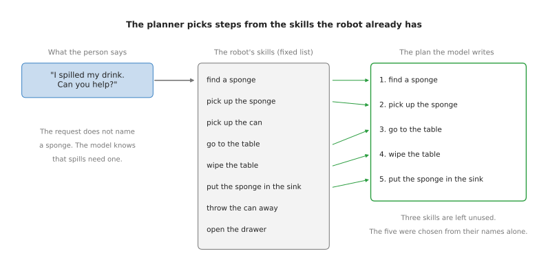
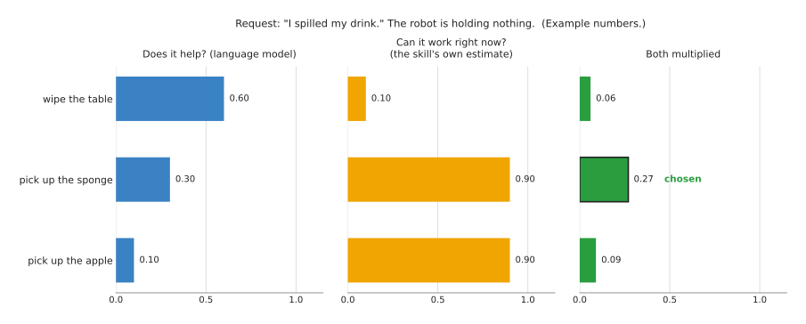
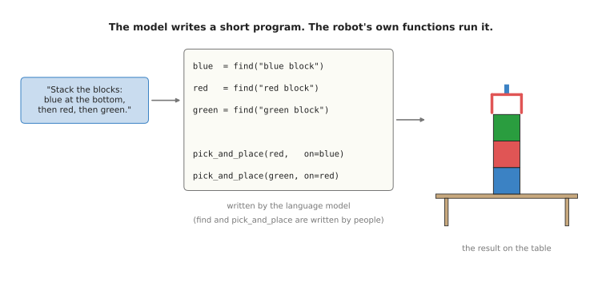

# Language models as planners

This page answers one question: how can a language model, which only reads and writes
text, decide what a robot arm should do next?

This is a page for a reader who has read the [chapter overview](../01_overview.md). So
you should already know what a language model is, and that it turns words into tokens
and tokens into numbers. You do not need to know how to program a robot, because the
page uses only a few lines of Python in one example, and explains each line.

> Before this page, it helps to have read [behaviour
> trees](../../../05_programming-techniques/08_decisions-and-task-logic/02_most-used/02_behaviour-trees.md),
> which shows how the steps and retries of a task are written by hand. The planner
> on this page chooses the same kind of steps from a request in words.

## Contents

1. [What it is](#1-what-it-is)
2. [What goes in and what comes out](#2-what-goes-in-and-what-comes-out)
3. [How it works inside](#3-how-it-works-inside)
   · [Step 1: the robot writes a prompt](#step-1-the-robot-writes-a-prompt)
   · [Step 2: the model writes the plan](#step-2-the-model-writes-the-plan)
   · [Step 3: checking that a step can work](#step-3-checking-that-a-step-can-work)
   · [Another way: the model writes code](#another-way-the-model-writes-code)
   · [Feeding back what happened](#feeding-back-what-happened)
4. [How it is trained](#4-how-it-is-trained)
5. [Well-known models of this kind](#5-well-known-models-of-this-kind)
6. [A worked example: putting the cups away](#6-a-worked-example-putting-the-cups-away)
7. [What goes wrong, and what people do about it](#7-what-goes-wrong-and-what-people-do-about-it)
8. [Why use a planner, and what it costs](#8-why-use-a-planner-and-what-it-costs)
9. [The written alternative](#9-the-written-alternative)
10. [Where to read next](#10-where-to-read-next)

---

## 1. What it is

Here is the idea in one sentence. A language model reads a request in ordinary
words, and writes the order of the steps, using only skills the robot already has.

A **skill** here is a small job that the robot can already do well, such as "pick up
the sponge" or "open the drawer". So people wrote or trained each skill before the
language model was added. The language model does not move the arm itself, because it
only chooses which skills to run, and in what order. This job is called **planning**,
and a model that does it is called a **planner**.

For example, think of a person helping you in a kitchen. You say, "I spilled my
drink." You did not say "sponge", but the helper fetches a sponge anyway, because they
know that spills get wiped up, and that you wipe with a sponge. A language model knows
the same thing, because it read about spills and sponges many times during its
training. So the planner uses that knowledge to fill in steps that the person never
said.

---

## 2. What goes in and what comes out

Three things go in:

- the request, in words, such as "I spilled my drink. Can you help?"
- the list of skills the robot has, each one written as a short phrase
- sometimes, a few words about the scene, such as "you are holding nothing"

One thing comes out, which is a numbered list of skills, or a short program that calls
them.



The picture shows one request going to one plan. Here the robot has eight skills, so
the model picks five of them and puts them in order. It also adds "find a sponge",
although the request never mentions a sponge.

The plan is only text, so a normal program on the robot reads the plan line by line
and runs the matching skill for each line. Each skill then uses other models, such as
a [grasp model](../../05_grasp-models/01_overview.md) to decide where to hold the
sponge.

---

## 3. How it works inside

A planner does not need a new kind of network, because it uses an ordinary language
model, the same kind that answers questions in a chat window. What makes it a planner
is the text the robot gives it, and what the robot does with the answer.

### Step 1: the robot writes a prompt

The text given to a language model is called the **prompt**. So the robot's program
builds the prompt from pieces of fixed text. A short prompt might look like this:

```
You control a robot arm in a kitchen.
The robot can do these things:
find a sponge, pick up the sponge, pick up the can, go to the table,
wipe the table, put the sponge in the sink, throw the can away, open the drawer.

Example.
Request: Throw away the can.
Plan: 1. pick up the can  2. throw the can away

Request: I spilled my drink. Can you help?
Plan:
```

The prompt ends with the word "Plan:" and nothing after it, and it also contains one
worked example. A worked example shows the model the exact form the answer should
take, and giving a model a few examples inside the prompt is called **few-shot
prompting**.

### Step 2: the model writes the plan

Then the language model continues the text, one token at a time, as it always does.
Because the prompt ends that way, the most likely continuation is a numbered list in
the same form as the example. So the model writes that list out, beginning "find a
sponge" and "pick up the sponge", and then stops.

The robot's program then reads the list, checks that every step is a skill on the
list, and runs the steps one after another.

### Step 3: checking that a step can work

A language model knows what usually makes sense, but it does not know what this robot
can do right now. So it cannot see that the sponge is out of reach, or that the
gripper is already full.

So the planner called SayCan solves this with a second score. For each skill, the
language model gives a score for "does this step help with the request?" Each skill
also has its own small model, which looks at the camera picture and gives a score for
"can this skill work right now, from here?" So the planner multiplies the two scores,
and runs the skill with the highest result.



The numbers in the picture are made up to show the method. "Wipe the table" sounds
like the most useful step. But the robot is holding nothing, so wiping cannot work
yet, and its second score is low. "Pick up the sponge" is less useful, but it can work
now, so after multiplying it wins. SayCan then adds the chosen step to the text and
asks again for the next step, and it repeats this until the model says the task is
done.

### Another way: the model writes code

The plan can also be a short program instead of a list, and this way is called Code as
Policies, after the paper that introduced it. So the prompt lists the functions the
robot's programmers have written, such as `find` and `pick_and_place`, and the model
then writes a few lines of Python that call those functions.



In the picture, the request is to stack three blocks. The model writes three lines
that find each block, and then writes two lines that place red on blue, and green on
red. People wrote `find` and `pick_and_place`, so the model only wrote the six lines
that join them together.

Code can do things a list cannot, because it can count, repeat a step for every
object, and do arithmetic, such as "put the block 10 cm to the left of the bowl". It
also has one big practical benefit, which is that a person can read the program before
the robot runs it.

### Feeding back what happened

But a plan written once, at the start, goes wrong when a step fails. If the sponge
slips out of the gripper, the list still says "go to the table" next.

So the fix is to tell the model what happened after each step, in words, and let it
write the rest of the plan again. The robot adds a line to the prompt, such as
"Result: the sponge was dropped." The model then writes "pick up the sponge" again.
The words about what happened can come from a person, from a sensor, or from a
[vision-language model](../02_most-used/02_vision-language-models.md) that looks at
the camera picture. The Inner Monologue paper studied this way of working.

---

## 4. How it is trained

Usually, the language model in a planner is not trained for the robot at all, because
it is an ordinary language model, trained by someone else on text from the internet.
Instead the robot only changes the prompt, and this is the main reason planners became
popular. A laboratory can build one without collecting any robot data for the planning
part.

But the parts that do need robot data are the skills underneath. Each skill was taught
separately, by programming it or by [copying
demonstrations](../../06_movement-models/02_most-used/01_behaviour-cloning.md). In
SayCan, the "can it work right now" scores were also learned from the robot's own
attempts at each skill.

Some newer planners are trained a little further on robot material. For example, a
model can be trained further on videos of robots, with questions about what step
comes next. This makes it better at robot plans, but it is still mostly the same
language model underneath.

---

## 5. Well-known models of this kind

These are the best-known planners, and the first four are research systems that each
introduced one idea, while the last one is a product that you can use today.

- [SayCan](https://say-can.github.io/), from Google in 2022, paired a large language
  model with a set of learned skills on a mobile robot with one arm. It introduced the
  two scores in [step 3](#step-3-checking-that-a-step-can-work): "does it help" times
  "can it work now".
- [Inner Monologue](https://innermonologue.github.io/), also from Google in 2022, fed
  the result of each step back to the language model as text. The model could then
  notice a failure and try again.
- [Code as Policies](https://code-as-policies.github.io/), from Google in 2022, had
  the language model write Python that calls the robot's perception and control
  functions, so the output is a program that you can read before you run it.
- [VoxPoser](https://voxposer.github.io/), from Stanford in 2023, had the model write
  code that marks places in 3D space as good or bad, such as "near the drawer handle"
  and "away from the vase". A normal motion planner then found a path through the good
  places.
- [Gemini Robotics ER
  2](https://blog.google/innovation-and-ai/models-and-research/google-deepmind/gemini-robotics-er-2/),
  from Google DeepMind in July 2026, is a vision-language model built for robot
  planning. It plans, looks at video to check whether a step worked, and can call
  tools. You can use it through Google's online service, and the [frontier
  document](../../../03_frameworks/08_frontier/02_foundation-models.md#5-google-deepmind-gemini-robotics-2-and-er-2)
  describes it in detail.

---

## 6. A worked example: putting the cups away

Here is a planner on a single arm beside a kitchen counter. The arm has a camera above
the counter, and its programmers have written four functions:

- `find(name)` looks for an object with a
  [seeing model](../../03_seeing-models/01_overview.md), and returns where it is
- `pick(obj)` picks the object up, using a
  [grasp model](../../05_grasp-models/01_overview.md) to choose where to hold it
- `place(obj, on=...)` puts the held object down on a named place
- `is_empty(obj)` looks at the object and answers yes or no

A person says: "Put the clean cups on the shelf, and leave the full one out."

1. The robot's program builds a prompt, which lists the four functions, gives one
   short example, and adds the request.
2. The language model writes a program that finds every cup, and for each cup it calls
   `is_empty`. If the cup is empty, the program picks the cup up and places it on the
   shelf, and otherwise it leaves the cup where it is.
3. A small checker, written in ordinary code, reads the program before it runs, and it
   makes sure that the program only calls the four functions, and names only places
   the robot knows. The checker would stop a program that says `place(cup,
   on="dishwasher")`, because this robot has no dishwasher.
4. The program then runs, and the language model is not used again unless something
   fails.
5. One cup slips during `pick`, so the skill reports the failure. The program then
   adds "Result: cup 2 was dropped on the counter" to the prompt, and asks the model
   to continue. The model writes one more `pick` and `place` for cup 2.

So it is worth looking at what each part did. The language model understood "clean"
and "the full one", and turned them into a loop with a check inside. But it did not
decide where to hold a cup, or how to move the arm, because those jobs belong to other
models and to ordinary code. The frameworks book has a case study on [standing a glass
upside down on a drying
rack](../../../03_frameworks/04_one-arm-training/07_case-study/01_place-glass.md#version-4-an-instruction-decides-the-goal).
Its fourth version uses this same split on a real design.

---

## 7. What goes wrong, and what people do about it

A planner fails in ways that are different from the other models in this book. So the
list below gives the common failures, and the usual fix for each one.

- **It writes steps that are impossible.** A language model sometimes writes text that
  sounds right but is wrong, which people call **hallucination**. For a planner, it
  means a step that names a skill the robot does not have, or an object that is not
  there. The fix is a checker in ordinary code, as in the worked example. The checker
  refuses any step that is not on the list.
- **It does not know the robot's state.** It cannot see that the gripper is full, or
  that the drawer is locked, because nothing tells it. The fixes are the "can it work
  now" score from SayCan, and describing the scene in words inside the prompt.
- **It is slow.** A large language model takes from under a second to several seconds
  to write a plan. That is fine once per step, but it is far too slow for
  moment-to-moment control of the arm, which is why the planner only chooses steps.
- **It can give a different plan each time.** The same request can produce two
  slightly different plans. So for a task that must be repeatable, people fix the plan
  once, check it, and save it.
- **It trusts the words too much.** If a person says "put the knife in the cup", the
  model will plan it, even if the cup is full of water. The model has no sense of what
  is safe unless the prompt or the checker supplies it. So a planner is not allowed to
  switch off any of the robot's safety limits.
- **It cannot recover from what it cannot see.** A plain language model only learns
  about a failure if someone tells it so in words. The fix is to add a
  [vision-language model](../02_most-used/02_vision-language-models.md) that looks at
  the camera and reports what happened.

---

## 8. Why use a planner, and what it costs

A planner is a language model that chooses the order of the robot's steps, so it lets
a person give the robot a new task in ordinary words. It also fills in steps that the
person never said.

So the obvious alternative is a hand-written program, such as a fixed sequence or a
**behaviour tree**. A behaviour tree is a chart of steps and checks that a programmer
draws, and the robot follows it exactly. A behaviour tree is free to run, fast, and
always does the same thing, and you can also prove what it will do. So for a task that
never changes, such as the same box packed the same way every day, the behaviour tree
is the better choice. The planner earns its place when the request changes from one
day to the next, and nobody can list every request in advance. For example, a menu of
buttons cannot cover "leave the full one out".

So the planner costs you three things in return. It adds seconds of delay for each
plan, and it needs either a large graphics card or a paid online service. It also adds
a new kind of failure, which is a plan that is wrong in its goal and that nothing
downstream will notice. That last cost is why every serious design puts a checker in
ordinary code between the planner and the robot.

---

## 9. The written alternative

Instead, the written alternative is a task program that a person writes in advance.
[Finite state
machines](../../../05_programming-techniques/08_decisions-and-task-logic/02_most-used/01_finite-state-machines.md)
and [behaviour
trees](../../../05_programming-techniques/08_decisions-and-task-logic/02_most-used/02_behaviour-trees.md)
hold the steps, the checks and the retries, and the robot follows them exactly. When
the order of the steps depends on where things are, Book 3's [task and motion
planning](../../../03_frameworks/04_one-arm-training/02_programmed-methods.md#5-task-and-motion-planning)
searches for an order the arm can really carry out.

The written program wins when the task is known in advance, because it is fast, free
to run and can be checked. But the language model wins when the requests change and
nobody can list them all. Even then, a checker in ordinary code stays between the
planner and the robot.

---

## 10. Where to read next

- [Vision-language models](../02_most-used/02_vision-language-models.md) adds a camera
  picture, so the model can see the table instead of being told about it.
- [Vision-language-action models](../02_most-used/01_vision-language-action-models.md)
  then goes one step further and lets the model move the arm itself.
- The [learned methods
  document](../../../03_frameworks/04_one-arm-training/03_learned-methods.md#5-directed-by-language)
  in the frameworks book compares planners with the other ways of choosing what a
  robot does.
- The [one-arm training
  overview](../../../03_frameworks/04_one-arm-training/01_overview.md) puts SayCan and
  Code as Policies in a table of real systems, with what each one learns and what it
  leaves to ordinary code.
- For the models used today, read [foundation models and generalist
  policies](../../../03_frameworks/08_frontier/02_foundation-models.md).
