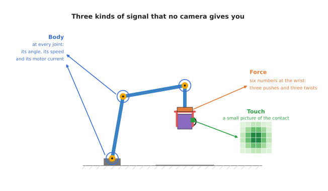
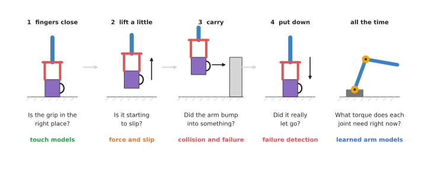

# Touch and body models

This chapter is about the models that make sense of touch, force and the arm's own
body. Every other chapter in this book starts from a camera, but this one starts
from the sensors in the fingers, in the wrist and in the joints. This page is the
overview, so it says what this family of models is for, which question it answers
for a robot arm, and which page to read for each kind.

It is written for a reader who has already read the first chapter of this book,
[what models are](../01_what-models-are/01_what-a-model-is.md). Because that
chapter explains what a model is, you should know that a model is a program that
turns an input into an output, and that a neural network learns how to do that from
examples. You do not need to know anything about touch sensors yet, because this
page explains each one the first time it appears.

## Contents

1. [What this family is for](#1-what-this-family-is-for)
2. [The question it answers](#2-the-question-it-answers)
3. [The three kinds of signal](#3-the-three-kinds-of-signal)
4. [The four kinds of model](#4-the-four-kinds-of-model)
5. [The four kinds side by side](#5-the-four-kinds-side-by-side)
6. [When to use a model here, and when not to](#6-when-to-use-a-model-here-and-when-not-to)
7. [How this chapter connects to the others](#7-how-this-chapter-connects-to-the-others)
8. [Where to read next](#8-where-to-read-next)

---

## 1. What this family is for

Touch and body models make sense of touch, force and the arm's own body, and they
exist because a camera on its own cannot report any of those things.

A camera sees the mug before the arm reaches it. However, once the fingers close, the
camera sees much less. For example, the fingers hide the part of the mug they hold,
and the camera cannot see how hard those fingers press. It cannot see that the mug
has started to slide down between the pads, and it cannot feel the arm's elbow brush
against a box.

But other sensors can do all of those things. A touch sensor on a finger pad
measures the contact itself, and a force sensor at the wrist measures the weight and
the push on the gripper. The motor in each joint reports its angle and how much
electric current it is using. Between them, these sensors give numbers many times a
second. However, those numbers are hard to read by hand, because they are noisy and
they change quickly. So a model can learn to read them instead.

So this family of models turns the signals from touch, force and joint sensors
into plain answers: is the grip in the right place, is the mug starting to slip,
did the arm hit something, and how much turning force does each joint need to
follow the planned path?

## 2. The question it answers

The last section described the sensors, and this section states the one question
they are all used to answer. The question this family answers for a robot arm is:
what is happening at the contact, and in my own body, right now?

"At the contact" means where the fingers touch the object, and where any part of
the arm touches anything else. "In my own body" means the arm itself: its joints,
its motors, its weight and its friction. A robot arm does not come with a perfect
description of itself. Instead, the numbers in its manual are close but not exact.
So some of these models learn the difference between the manual and the real
arm.

## 3. The three kinds of signal

Before any model can answer that question, something has to measure it, and three
kinds of signal do the measuring.

The picture shows the three places these signals come from: the pad of a finger,
the wrist, and every joint.

The first is a touch signal, and it comes from a **tactile sensor**, where
"tactile" means to do with touch. Many tactile sensors are a small camera behind a
soft rubber pad. When the pad presses on something, the camera films the pad
bending. So the signal is a small picture of the contact, many times a second.

The second is a force signal, and it comes from a **force-torque sensor** at the
wrist. A force is a push or a pull, while a torque is a twisting force, such as the
force you use to turn a key. That is why the sensor reports six numbers: a push
along each of three directions, and a twist about each of three directions.

The third is a body signal, and it comes from the joints themselves. Each joint has
an **encoder**, which measures its angle, and each motor also reports its electric
current. That current tells you roughly how hard the motor is working. Some arms
also have a torque sensor inside every joint.

## 4. The four kinds of model

Each of those three signals needs a model to read it, and this chapter has four
kinds of model, one page each.

- [Touch sensing models](03_also-used/01_touch-sensing-models.md) turn a tactile picture into
  facts about the contact: where it is, what shape it has, and how hard it
  presses.
- [Force and slip models](02_most-used/01_force-and-slip-models.md) read force signals over time
  and say whether a held object is starting to slide.
- [Collision and failure detection](02_most-used/02_collision-and-failure-detection.md) notices
  when something has gone wrong: the arm has hit something, or a pick has failed.
- [Learned arm models](03_also-used/02_learned-arm-models.md) learn how the arm's own body
  behaves: how much torque each joint needs, and where the arm really is.

The picture follows one pick of a mug from left to right, and shows which kind of
model answers the question at each moment.

The first three kinds work mainly during contact, while the fourth works all the
time, because the arm always has a body, whether it touches anything or not.

### Most used, and also used

The pages of this chapter are in two groups, because some kinds need hardware that
most arms do not have. The first group, most used, holds
[force and slip models](02_most-used/01_force-and-slip-models.md) and
[collision and failure detection](02_most-used/02_collision-and-failure-detection.md),
which work with the force and joint signals that most arms already have, so no
extra hardware is needed. The second group, also used, holds
[touch sensing models](03_also-used/01_touch-sensing-models.md) and
[learned arm models](03_also-used/02_learned-arm-models.md). Touch sensors are
still uncommon on robot arms. So a learned model of the arm itself is only worth
building when the maker's own model is not good enough.

## 5. The four kinds side by side

Now that all four kinds have been named, the table below compares them. Read each
row across: what goes in, what comes out, which sensor it needs, and how ready it
is for a working robot cell. "Ready" here means whether you can buy or download
something that works, and not whether the research is exciting.

| Kind | What goes in | What comes out | Sensor it needs | How ready |
| --- | --- | --- | --- | --- |
| Touch sensing | a small picture of the contact | where the contact is, its shape, the force | a tactile sensor on the finger | research code; few maintained tools |
| Force and slip | force readings over the last moment | "slipping" or "not slipping" | a tactile sensor, or a fast force sensor | research code; you usually write your own |
| Collision and failure | joint torques, currents or forces over time | "something is wrong", and sometimes where | the joint sensors the arm already has | the classic non-learned method ships in many arms |
| Learned arm models | joint angles, speeds and commands | torques needed, or where the arm will be | the joint sensors the arm already has | mature in research; used as a correction on top of physics |

Two things stand out in the table, and both of them matter when you choose a kind.

The first is that the kinds that need extra sensors are the least ready, because a
tactile sensor is an extra part to buy, fit and replace. The
[holding on](../../03_frameworks/02_gripping/05_holding-on.md#43-the-state-of-the-open-source-software-which-is-worth-saying-plainly)
page in the frameworks book says it plainly: there is almost no maintained
open-source slip-detection software.

The second is that the kinds that use the arm's own joint sensors are cheaper to
try. Every arm already has encoders and motor currents, so a model that reads them
needs no new hardware at all.

## 6. When to use a model here, and when not to

The table said how ready each kind is, and this section says when a learned model
is worth using at all. Many of the jobs in this chapter have a simple method that
does not learn, and it is worth knowing that method first, because it is often
enough.

- To tell whether the fingers are touching something, a threshold works: if the
  force goes above a set value, there is contact.
- To weigh a held object, the wrist sensor and some arithmetic work. The
  [perception book](../../02_perception/02_object-perception/02_sensors.md#2-measuring-by-touch)
  shows how.
- To detect a collision, many arms compare the torque the physics predicts with the
  torque the motors measure, and if the gap is too big, the arm stops.
- To know the torque each joint needs, a physics model built from the arm's
  masses and lengths gets most of the way.

However, a learned model is worth it when the simple method misses something that
the signal still contains. For example, a threshold cannot tell a slip from a jolt, and
a physics model leaves out the friction inside the gearbox. A fixed collision limit
that is low enough to catch a gentle bump also stops the arm every time it moves
fast. In each of these cases, a model trained on examples can learn the pattern
that the simple rule misses.

However, a learned model also costs you three things. First, it needs examples, and
examples of failures are rare and sometimes dangerous to collect. Second, it gives
no guarantee, so it cannot replace a certified safety function. Third, it is tied
to the sensor and the arm it was trained on. The pages that follow return to these
costs for each kind.

## 7. How this chapter connects to the others

This family does not work alone, so this section places it next to the others. The
book has seven families of model, and [the map of
models](../01_what-models-are/06_the-map-of-models.md) lists them all. Here is how
this one fits with the other six.

- [Seeing models](../03_seeing-models/01_overview.md) turn a picture into names,
  boxes, outlines, poses or depth, and they work before contact. Touch models then
  take over when the fingers hide the object.
- [3D models](../04_3d-models/01_overview.md) work on 3D points and whole scenes
  instead of flat pictures. Some research joins touch with 3D shape to rebuild an
  object held in the hand.
- [Grasp models](../05_grasp-models/01_overview.md) decide where and how to hold an
  object, and touch and slip models check afterwards whether that grasp is
  holding.
- [Movement models](../06_movement-models/01_overview.md) decide how the arm should
  move, moment by moment. Some of them take force and touch readings as an extra
  input, so they can react to contact.
- [Language models](../07_language-models/01_overview.md) understand words, and
  connect words to pictures and actions. A vision-language model can look at a
  picture after a task and say whether it worked, which is another kind of failure
  detection.
- [World models](../08_world-models/01_overview.md) predict what will happen next if
  the arm does something. A learned arm model is a world model with a very small
  world: the arm's own body.

## 8. Where to read next

Start with [touch sensing models](03_also-used/01_touch-sensing-models.md) , because
the slip page builds on the tactile pictures it explains. However, if your arm has no
tactile sensor, you can go straight to
[collision and failure detection](02_most-used/02_collision-and-failure-detection.md)
or [learned arm models](03_also-used/02_learned-arm-models.md) , because both of
those use only the sensors an arm already has.

For the hardware behind these models, read
[the sensors that go on a gripper](../../03_frameworks/02_gripping/02_grippers-and-hardware.md#8-the-sensors-that-go-on-a-gripper)
in the frameworks book. For what to do with the readings once you have them, read
[holding on](../../03_frameworks/02_gripping/05_holding-on.md) .
