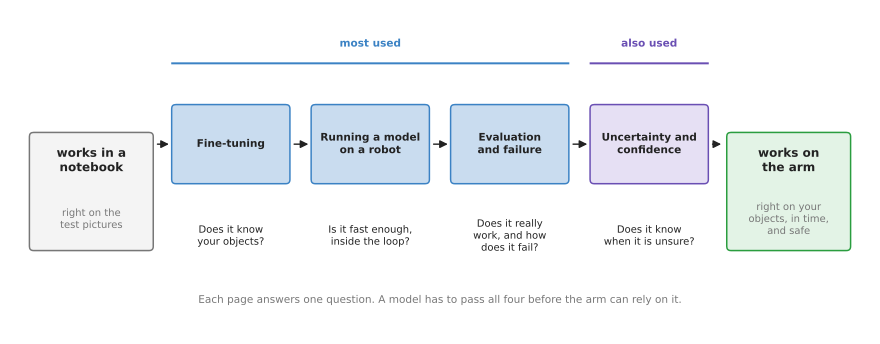

# Making models work on an arm

The seven chapters before this one each describe a family of models: what they take
in, what they give back and how they are trained. This chapter is about what happens
after that, because having a model is not the same as having a working robot. You
have a model that works in a notebook, which here means a program on a computer that
is right on a set of test pictures, and the question this chapter answers is how you
get from there to a model that works on a real robot arm, every day.

This page is the chapter overview, so it says what the chapter is for, lists its four
pages in their two groups, and then says how the chapter connects to the frontier
pages in Book 3.

It is for a reader who has read the first chapter of this book,
[what models are](../01_what-models-are/01_what-a-model-is.md), and at least one of
the family chapters. You should know what training, a test set and fine-tuning mean,
and if you do not, then
[learning signals](../01_what-models-are/04_learning-signals.md) and
[where the data comes from](../01_what-models-are/05_where-the-data-comes-from.md)
explain them.

## Contents

1. [What this chapter is for](#1-what-this-chapter-is-for)
2. [The four pages](#2-the-four-pages)
3. [In what order to read them](#3-in-what-order-to-read-them)
4. [How this chapter connects to Book 3](#4-how-this-chapter-connects-to-book-3)
5. [Where to read next](#5-where-to-read-next)

---

## 1. What this chapter is for

A model that works in a notebook has passed exactly one test, because it gave the
right answers on pictures that were deliberately kept back from training. That is a
good start, however it is only a start, since a robot arm asks much more of a model
than a set of held-back pictures ever does.

On an arm the model sees your objects, in your light, from your camera, and it may
never have seen any of those during training. It must also answer within a fixed
time, many times a second, while the arm is still moving. When it is wrong the arm
does something in the real world, so a wrong grasp can break a mug or hit a person,
which is a cost that a wrong answer in a notebook never carries. Finally it must keep
working long after the first good demonstration, on the hundredth try and on a
different day.

So the gap between "it works in a notebook" and "it works on the arm" is really four
separate questions. Does the model know your objects? Is it fast enough, and does it
fit into the robot's loop? Does it really work, and how does it fail? And does it know
when it is unsure? Each page of this chapter answers one of them.

---

## 2. The four pages

Because the gap is four separate questions, this chapter has one page for each of
them. The picture shows those four questions in the order a project usually meets
them, and a model has to pass all four before the arm can rely on it.

Like every chapter in this book, this one splits its pages into two groups. The
**most used** group holds the steps that nearly every project with a model on an arm
goes through, whereas the **also used** group holds a step that many projects need
but not all of them.

The table below lists the four pages. Read each row across: the page, its group, and
the question it answers.

| Page | Group | The question it answers |
| --- | --- | --- |
| [Fine-tuning](02_most-used/01_fine-tuning.md) | most used | How do I teach a downloaded model my own objects and my own robot, with a small amount of my own data? |
| [Running a model on a robot](02_most-used/02_running-a-model-on-a-robot.md) | most used | How fast must the model be, what computer does it run on, and how does it fit into the loop that drives the arm? |
| [Evaluation and failure](02_most-used/03_evaluation-and-failure.md) | most used | How do I measure whether the model really works on the arm, and how do I find and sort the ways it fails? |
| [Uncertainty and confidence](03_also-used/01_uncertainty-and-confidence.md) | also used | How can the robot tell when the model is unsure, and what should it do then? |

The three most-used pages follow one model through a whole project, so they are best
read as one story. Fine-tuning adapts the model to your objects, then running it on
the robot puts it inside the loop that drives the arm, and evaluation finally checks
whether the result is good enough while showing you where it breaks. The also-used
page then adds one more safeguard, because it lets the robot stop, look again or ask
a person when the model is not sure, instead of acting on a guess.

---

## 3. In what order to read them

Since the three most-used pages follow one model through a project, you should read
them in order, and each one also uses the words that the page before it introduced.
Fine-tuning comes first because adapting a downloaded model is usually the first
thing a project does to it, and evaluation comes last because you can only measure a
model once it is already running on the arm.

Read the uncertainty page when your robot must decide by itself whether to act on an
answer, which is the case for most robots that work near people or handle objects
that break. It builds on section 5 of
[running a model on a robot](02_most-used/02_running-a-model-on-a-robot.md#5-how-sure-the-model-is-and-why-it-can-be-sure-and-wrong),
which shows that a model can be sure and wrong at the same time.

If you use only written techniques and no learned models, then you do not need this
chapter at all. Book 5 covers those techniques instead, and its
[safety monitoring](../../05_programming-techniques/07_control-and-motion/02_most-used/04_safety-monitoring.md)
page is the written check that sits around any model as well.

---

## 4. How this chapter connects to Book 3

This chapter explains ideas rather than current results, so it has a partner
elsewhere in the docs. Book 3's
[frontier chapter](../../03_frameworks/08_frontier/01_overview.md) records what
actually happened to robot arm manipulation in 2026: which models exist, which data
they were trained on and how they were measured. This chapter explains the ideas you
need in order to read those pages, whereas those pages tell you what is true today.

Each page here has a partner there:

- [Fine-tuning](02_most-used/01_fine-tuning.md) explains how to adapt a model. The
  [foundation models document](../../03_frameworks/08_frontier/02_foundation-models.md)
  lists the large models you might adapt, and which of them you can download. The
  [data and demonstration document](../../03_frameworks/08_frontier/03_data-and-demonstration.md)
  describes how the demonstrations for fine-tuning are recorded.
- [Running a model on a robot](02_most-used/02_running-a-model-on-a-robot.md)
  explains why speed and computer matter. The
  [hardware document](../../03_frameworks/08_frontier/05_hardware.md) lists the
  computers people actually put next to an arm, and
  [working without an NVIDIA graphics card](../../03_frameworks/03_arm-movement/10_working-without-a-gpu.md)
  says what runs on a laptop.
- [Evaluation and failure](02_most-used/03_evaluation-and-failure.md) explains how to
  measure a model. The
  [simulation and evaluation document](../../03_frameworks/08_frontier/04_simulation-and-evaluation.md)
  lists the benchmarks people report, and explains why two published numbers are
  often not comparable.
- [Uncertainty and confidence](03_also-used/01_uncertainty-and-confidence.md) has no
  single partner page. The frontier overview's section on
  [how to read a claim](../../03_frameworks/08_frontier/01_overview.md#2-how-to-read-a-claim-in-this-field)
  applies the same caution to published results that this page applies to one
  model's answer.

---

## 5. Where to read next

- [Fine-tuning](02_most-used/01_fine-tuning.md) is the first page of this chapter.
- [The map of models](../01_what-models-are/06_the-map-of-models.md) shows where
  this chapter sits in the whole book.
- [The frontier: what changed in 2026](../../03_frameworks/08_frontier/01_overview.md)
  in Book 3 is where to go for the models, data and results that are current today.
