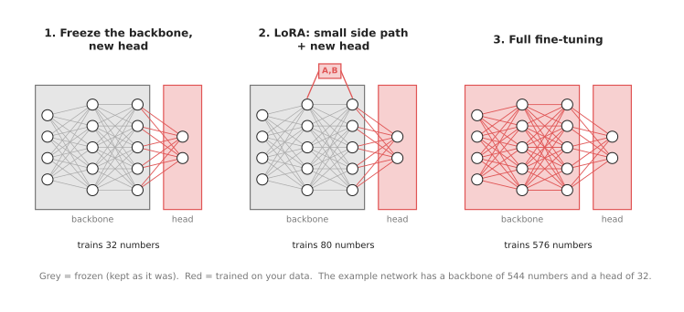
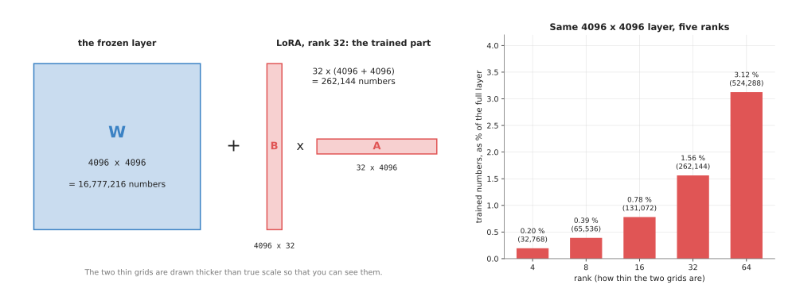
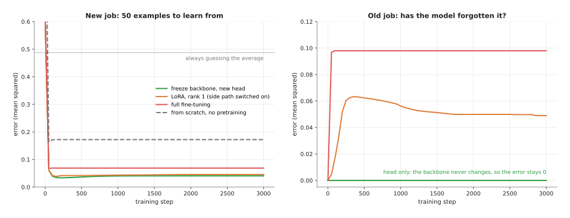
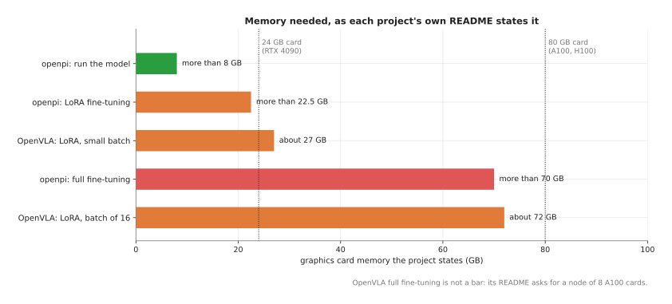

# Fine-tuning

This page answers one question. You have downloaded a model that someone else
trained, and it almost does what your robot needs, so how do you teach it the last
part using only a small amount of your own data?

The page explains the three usual ways to do this, and they differ mainly in how
much of the model you allow training to change. You can freeze most of the model and
train only a new last layer, or you can add a small side path called LoRA and train
only that, or you can train every number in the model. For each of the three the
page says how much data and how much memory it needs, what the model can forget
along the way, and how to choose between them.

It is for a reader who has read the chapter so far, because it uses words that the
earlier pages introduced. You should know what a layer, a backbone, a head and a
parameter are, from
[inside a neural network](../../01_what-models-are/03_inside-a-neural-network.md). You should also know what
pretraining is, from
[where the data comes from](../../01_what-models-are/05_where-the-data-comes-from.md#7-pretraining-then-fine-tuning).
That page introduced fine-tuning in a single section, whereas this page goes inside
it and explains how the work is actually done.

## Contents

1. [The idea in one sentence](#1-the-idea-in-one-sentence)
2. [Three ways to fine-tune](#2-three-ways-to-fine-tune)
3. [LoRA in plain words, with real counts](#3-lora-in-plain-words-with-real-counts)
4. [A worked example: 50 examples, four ways](#4-a-worked-example-50-examples-four-ways)
5. [Forgetting](#5-forgetting)
6. [How much data and how much memory](#6-how-much-data-and-how-much-memory)
7. [Two examples on a robot arm](#7-two-examples-on-a-robot-arm)
8. [Where it works and where it does not](#8-where-it-works-and-where-it-does-not)
9. [Libraries and scripts](#9-libraries-and-scripts)
10. [How to choose, and what each way costs](#10-how-to-choose-and-what-each-way-costs)
11. [Where to read next](#11-where-to-read-next)
12. [Using it in Python](#12-using-it-in-python)

---

## 1. The idea in one sentence

Fine-tuning means taking a model that was already trained on a large, general pile
of data, and training it a little more on a small pile of your own data, so that it
does your job.

Here is an everyday example. When an experienced lorry driver joins a new company,
the driver does not relearn how to steer or brake, and instead learns only the new
routes and where the loading bays are. In the same way a pretrained seeing model
already knows about edges, surfaces and shapes, so it only needs to learn what your
own parts look like.

The model you start from is called the **pretrained model**. Its numbers are the
**pretrained weights**. Most pretrained models are split into a **backbone**, the
large first part that turns the input into useful numbers, and a **head**, the small
last part that turns those numbers into the answer. The
[seeing models overview](../../03_seeing-models/01_overview.md#5-what-they-have-in-common)
describes this split for pictures.

---

## 2. Three ways to fine-tune

The three ways differ in which numbers training is allowed to change, and that
single difference is what decides their cost. A number that training may not change
is called **frozen**.



Grey parts are frozen and red parts are trained. The counts under each network are
for the small network of the worked example in [section 4](#4-a-worked-example-50-examples-four-ways).

**Way 1: freeze the backbone and train a new head.** You keep every number in the
backbone exactly as it was, and then you throw away the old head and put a new, small
head in its place, so that only the new head is trained. People also call this a
**linear probe** when the new head is a single layer. It is the cheapest of the three
ways, because so few numbers change, and it works whenever the backbone already turns
your pictures into numbers that separate your answers well.

**Way 2: add a small side path and train only that.** You keep every original number
frozen, but you add a few small extra layers next to or inside the old ones, and then
train only those together with a new head. These extra layers are called
**adapters**, and the most used kind of adapter is **LoRA**, which stands for
**low-rank adaptation** and is explained in
[section 3](#3-lora-in-plain-words-with-real-counts). This way is useful because it
lets the backbone's behaviour change a little while still training very few
numbers.

**Way 3: full fine-tuning.** Every number in the model may change, which makes this
the most flexible of the three ways. However that flexibility has a price, because it
needs the most memory and it is the most likely to forget what the model knew
before.

There are mixtures of these three ways as well, and a common one is to freeze the
first layers of the backbone while training all the rest. This works because the
first layers find edges and colours, which look the same for every job, so they
rarely need to change at all.

---

## 3. LoRA in plain words, with real counts

A layer in a network holds its weights in a grid of numbers. A layer that turns 4,096
numbers into 4,096 numbers has a grid of 4,096 rows and 4,096 columns. That is
16,777,216 numbers. The large language models inside vision-language-action models,
such as the one inside OpenVLA, are built from many layers of about this size.

Full fine-tuning would change all 16,777,216 numbers in this one grid, whereas LoRA
leaves the grid frozen and adds a separate change to it, building that change from
two thin grids multiplied together.

- Grid A has a few rows and 4,096 columns.
- Grid B has 4,096 rows and a few columns.
- B multiplied by A gives a full 4,096 by 4,096 grid of changes.

The "few" is called the **rank**, so a rank of 32 means that grid A has 32 rows and
grid B has 32 columns. Together the two thin grids then hold 32 x (4,096 + 4,096) =
262,144 numbers, which is only 1.56 % of the full grid. The layer works out its answer
using the frozen grid plus the change, which means the original numbers are never
touched.



The left side shows the frozen grid and the two thin grids that LoRA trains. The bar
chart shows how the trained share grows with the rank, for the same layer.

The table below lists the numbers from the bar chart. Read each row as: the rank, how
many numbers LoRA trains for this one layer, and what share of the full grid that is.

| Rank | Numbers LoRA trains | Share of the full 16,777,216 |
| --- | --- | --- |
| 4 | 32,768 | 0.20 % |
| 8 | 65,536 | 0.39 % |
| 16 | 131,072 | 0.78 % |
| 32 | 262,144 | 1.56 % |
| 64 | 524,288 | 3.12 % |

Why does such a thin change work? The authors of LoRA found that the change which
fine-tuning makes to a large pretrained model usually has a simple shape, and a
simple change can be written well with only two thin grids. You do lose a little
flexibility this way, but in return you train and store far fewer numbers.

LoRA has two further benefits on a robot. First, because the side path is a small
separate file, you can keep one pretrained model together with several small LoRA
files, one for each task, and load only the one you need. Second, you can switch the
side path off, and the model is then exactly the pretrained model again.

OpenVLA's own LoRA script uses a rank of 32 and adds LoRA to every fully connected
layer. The [LoRA paper](https://arxiv.org/abs/2106.09685) reports that, for the
175-billion-parameter language model GPT-3, LoRA cut the number of trained numbers by
10,000 times and the graphics card memory by 3 times, compared with full fine-tuning.

---

## 4. A worked example: 50 examples, four ways

This example is a real run in numpy, in the diagram script
[`models_extras.py`](../../../diagrams/models_extras.py). The network is tiny, so that
the run takes seconds, but the steps are the same as for a large model.

The set-up is this.

1. A "pretrained" network reads 16 numbers. Its backbone has one layer of 32 neurons,
   which is 544 numbers. Its old head gives 4 answers for an old job.
2. The new job needs 1 answer. It uses features close to, but not the same as, the
   ones the backbone already makes. In the script, the new job is built from the same
   backbone with a small change added.
3. There are only 50 examples of the new job to learn from. That is like having 50
   demonstrations of a new task.
4. The network is trained four ways, for 3,000 steps each, and tested on 2,000 new
   examples it never saw.

The error is the **mean squared error**, which is the average of the squared
difference between the answer and the right answer, so a lower number is better. To
give the numbers a scale, a model that always guessed the average answer would score
0.487.

The table below gives the result. Read each row as one way of training: how many
numbers it trained, its error on the new job, and its error on the old job afterwards.

| Way | Numbers trained | Error on the new job | Error on the old job afterwards |
| --- | --- | --- | --- |
| Freeze the backbone, new head | 32 | 0.041 | 0.000 |
| LoRA, rank 1, plus a new head | 80 | 0.045 | 0.049 with the side path on, 0.000 with it off |
| Full fine-tuning | 576 | 0.069 | 0.098 |
| From scratch, with no pretraining | 576 | 0.172 | not meaningful |

Four things show up.

- **Starting from pretrained weights matters most.** All three fine-tuning ways beat
  training from scratch by a wide margin. From scratch, 50 examples are not enough to
  learn good features.
- **With little data, training fewer numbers did better.** Full fine-tuning learned
  the 50 examples perfectly, with a training error of 0.000, and still did worse on
  new examples than the two cheaper ways. It had enough freedom to learn the
  examples' noise as well as their pattern. This is called **overfitting**, as
  [how a model learns](../../01_what-models-are/02_how-a-model-learns.md) explains.
- **Here the new job was close to the old one.** So a new head on the frozen backbone
  was enough, and it did slightly better than LoRA. When the new job needs features
  the backbone does not make, the head alone cannot fit it, and LoRA or full
  fine-tuning pulls ahead.
- **Full fine-tuning damaged the old job.** The next section is about this.

This is only one small run, so with another set-up the order of the first three rows
can change. However the first and the last of the four points above hold in
general.

---

## 5. Forgetting

When full fine-tuning changes the backbone, it also changes the features that the
old head relied on, so the old job gets worse. This is called **catastrophic
forgetting**, although the word "catastrophic" is historical and the loss is often
only partial, as it is here.



The left panel shows the error on the new job during training. The right panel shows
the error on the old job during the same training.

On the right, the green line stays at 0, because freezing the backbone means the old
job's features cannot change at all. The red line jumps to 0.098 within 50 steps,
which shows that full fine-tuning bent the backbone towards the new job straight
away. The orange line is LoRA with its side path switched on, and it damages the old
job too, by 0.049. However switching that side path off gives back the pretrained
model exactly, with an error of 0.000.

Forgetting matters on a robot in two places.

- A vision-language-action model fine-tuned on your task can lose some of its general
  knowledge of objects and words, so it may follow your task well and then fail on a
  new instruction it would once have understood. The
  [vision-language-action page](../../07_language-models/02_most-used/01_vision-language-action-models.md)
  describes how laboratories mix general data into training to reduce this.
- A detector fine-tuned only on your five parts can stop finding people and hands,
  if it once found them, so if a safety check depends on those classes you should
  keep a separate model for them.

There are four usual defences against forgetting, and they can be combined. You can
freeze more of the model, so that fewer of the old features are able to move. You can
use LoRA and keep the pretrained model beside it, because the side path can then be
switched off. You can mix some of the original kind of data into your fine-tuning
data, so that the old job is still being practised. Finally you can train for fewer
steps with a small **learning rate**, which is the size of each step in training.

---

## 6. How much data and how much memory

### Data

The amount of data depends more on how far your job is from the pretrained job than
on the way you fine-tune. The table below gives the usual ranges already quoted in
this book. Read each row as: the kind of model, and how much of your own data people
usually start with.

| Kind of model | Usual amount of your own data | Where this book says so |
| --- | --- | --- |
| Detector for your parts | a few hundred labelled pictures; 80 drawn pictures in a simple case | [object detection](../../03_seeing-models/02_most-used/01_object-detection.md), [Book 2's worked example](../../../02_perception/01_camera/02_finding-objects.md#64-fine-tuning-why-80-pictures-are-enough) |
| Vision-language-action model for a new task | tens to hundreds of demonstrations | [vision-language-action models](../../07_language-models/02_most-used/01_vision-language-action-models.md) |

When your data is at the small end of these ranges you should freeze more of the
model, whereas at the large end you can afford to train more of it.

### Memory

Training needs far more memory than running a model. The graphics card must hold
the model's weights. For every trained number it must also hold that number's
**gradient**, which says which way to change it, and the extra numbers the
**optimiser** keeps. The optimiser is the part of the training program that makes the
changes. A widely used optimiser called Adam keeps two extra numbers for every
trained number.

A rough count shows why full fine-tuning is so expensive. A common figure is about
16 bytes of memory per trained number, when training with Adam and a mix of 16-bit
and 32-bit numbers. OpenVLA has about 7 billion parameters. Full fine-tuning would
need about 7 billion x 16 bytes = 112 GB, before any pictures are loaded. No single
graphics card holds that. With LoRA, only 1 % to 2 % of the numbers are trained, so
the gradients and optimiser numbers become small. The frozen weights still have to
be held. At 2 bytes each, 7 billion weights take about 14 GB.

The real figures come from the projects themselves. Book 3 collects the openpi
figures in
[working without a GPU](../../../03_frameworks/03_arm-movement/10_working-without-a-gpu.md#12-can-i-train-it),
and the [OpenVLA README](https://github.com/openvla/openvla) gives its own.



Each bar is a figure that a project states in its own README, and the two dotted
lines are common graphics card sizes, so you can see at a glance which jobs fit on
which card.

The table below gives the same figures. Read each row as: the project, what you want
to do, and the memory its README states.

| Project | Job | Memory stated |
| --- | --- | --- |
| openpi (π0 and π0.5) | run the model | more than 8 GB |
| openpi | LoRA fine-tuning | more than 22.5 GB |
| openpi | full fine-tuning | more than 70 GB |
| OpenVLA | LoRA fine-tuning, smaller batch | at least about 27 GB |
| OpenVLA | LoRA fine-tuning, batch of 16 | about 72 GB |
| OpenVLA | full fine-tuning | a full node of 8 A100 cards |

A **batch** is the number of examples the training program looks at before it makes
one change, and a smaller batch needs less memory, which is why OpenVLA's LoRA figure
appears as two separate rows.

For a detector, memory is rarely the problem at all, because a small YOLO model
fine-tunes on an ordinary processor with no graphics card whatsoever, as the Book 2
example shows.

---

## 7. Two examples on a robot arm

### Fine-tuning a detector on your parts

A cell sorts five kinds of machined bracket off a conveyor, however a detector
trained on the COCO photo collection knows about cups and bottles and has never seen
a bracket.

1. Take a few hundred pictures of the brackets with the robot's own camera, in the
   cell's own light, with the parts in many positions.
2. Draw a box around each bracket and give it one of five names.
3. Start from a pretrained YOLO model and train it on these pictures. The backbone
   is not frozen by default in Ultralytics, so this is full fine-tuning of a small
   model. Ultralytics' `freeze` training option freezes the first layers if you have
   very few pictures.
4. Test on pictures the model never saw, including awkward ones: parts touching,
   parts half out of the picture, the light turned down.

This works well because the new job is close to the pretrained job, since finding
objects is the same skill either way and only the names and the shapes are new.

### Fine-tuning a vision-language-action model on 50 demonstrations

A lab wants a vision-language-action model to put a cup on a saucer, on its own arm.

1. Record 50 demonstrations. A person drives the arm through the task with a
   leader arm or a hand controller, and the robot records the camera pictures, the
   joint angles and the instruction "put the cup on the saucer". The page
   [where the data comes from](../../01_what-models-are/05_where-the-data-comes-from.md) describes recording.
2. Convert the recordings into the format that the model's scripts expect. openpi
   reads the LeRobot dataset format, and OpenVLA reads a format called RLDS.
3. Run LoRA fine-tuning. This fits the memory of one rented card, as the
   [Book 3 cost section](../../../03_frameworks/03_arm-movement/10_working-without-a-gpu.md#64-rent-a-machine-by-the-hour)
   works out.
4. Test on the real arm, with the cup in places the demonstrations did not use.
   Count successes out of, say, 20 tries.

Fifty demonstrations is at the small end of the usual range, so it can be enough as
long as the scene stays much like the demonstrations themselves. If the model fails
once the cup moves, then the usual fix is more demonstrations with more variety in
them, rather than a different way of fine-tuning.

---

## 8. Where it works and where it does not

The two examples above both worked, so it is worth saying plainly when fine-tuning
does not. Fine-tuning works when the new job is close to what the model was
pretrained on, which is why a detector pretrained on everyday photos adapts well to
parts on a table: both are colour pictures of solid objects.

It works badly in the cases below, and the table gives each one together with the
sign you would see and what people do instead.

| When it goes wrong | The sign you would see | What people do instead |
| --- | --- | --- |
| The new data looks nothing like the pretraining data, such as depth images or X-rays given to a colour-photo model | even full fine-tuning gives poor test results | pick a model pretrained on similar data, or collect much more data |
| Too little data for the number of trained numbers | training error near 0, test error high | freeze more, use LoRA with a small rank, or collect more data |
| Your test pictures are too like your training pictures | good scores in testing, failures in the real cell | test on pictures from another day, another light and new part positions |
| The model forgets something it needs | a class or a skill that used to work now fails | LoRA with the side path kept separate, or mix in general data |
| The labels are inconsistent | the model is unsure in exactly the cases where people disagreed | fix the labels; no training method fixes them for you |

---

## 9. Libraries and scripts

These are all real tools that you can download today, and each one is named below
together with what it does for you.

- **[Hugging Face PEFT](https://huggingface.co/docs/peft/index)** is a Python library
  for "parameter-efficient fine-tuning", which means training a small part of a model.
  You describe the adapter with `LoraConfig`, wrap the model with `get_peft_model`,
  and `print_trainable_parameters()` then tells you how many numbers will be trained.
  OpenVLA's LoRA script is built on it.
- **[OpenVLA](https://github.com/openvla/openvla)** ships `vla-scripts/finetune.py` for
  LoRA fine-tuning, and `vla-scripts/train.py` for full fine-tuning across several
  cards. Its README now also points to a newer recipe, called OFT, for better
  results.
- **[openpi](https://github.com/Physical-Intelligence/openpi)** fine-tunes the π0 and
  π0.5 models. You first run `scripts/compute_norm_stats.py`, which measures the range
  of your robot's numbers, and then `scripts/train.py` with a training configuration.
  Its original version uses the JAX library, whereas its newer PyTorch version does
  not yet support LoRA training.
- **[Ultralytics](https://docs.ultralytics.com/modes/train/)** fine-tunes YOLO
  detectors with one call, `model.train(...)`. Its `freeze` option freezes the first
  layers. Book 2 has a
  [complete worked example](../../../02_perception/01_camera/02_finding-objects.md#6-training-a-model-of-your-own).
- **[LeRobot](https://github.com/huggingface/lerobot)** trains and fine-tunes smaller
  robot policies, such as SmolVLA and ACT, and runs on a Mac.

---

## 10. How to choose, and what each way costs

Start with the cheapest way that could work, and move to the next only if the
results show you need it.

1. **Freeze the backbone and train a new head** when your data is small and your job
   is close to the pretrained job. It is fast, it cannot forget, and it needs little
   memory. It costs you flexibility: if the backbone's features do not separate your
   answers, no head can fix it.
2. **Use LoRA or another adapter** when a new head is not enough, or when the model is
   too big to fully fine-tune on the card you have. For vision-language-action models,
   this is the usual first choice. It costs you a little accuracy compared with full
   fine-tuning on large data, and a few extra settings to choose, such as the rank.
3. **Fully fine-tune** when you have plenty of data, the job is far from the
   pretrained job, and you have the memory. For small detectors, this is the normal
   choice, because the model is small. It costs you memory, time, and the risk of
   forgetting.

The obvious alternative to all three is to train a model from scratch on your own
data. The worked example shows why people rarely do: with 50 examples, the model
trained from scratch had an error of 0.172, against 0.041 to 0.069 for the three
fine-tuning ways. Pretraining gives you knowledge that your small dataset could never
teach. Training from scratch only makes sense when no pretrained model has seen
anything like your data, and you have a very large amount of it.

The cost of fine-tuning in general is the data you collect and label, the graphics
card time, and the testing. The testing is the part that people most often skip, and
the part that decides whether the robot works.

---

## 11. Where to read next

- [Running a model on a robot](02_running-a-model-on-a-robot.md) is the next
  page. It covers what changes once the fine-tuned model runs on the arm.
- [Classical machine learning](../../02_classical-machine-learning/01_overview.md)
  covers smaller models that are not neural networks, which sometimes need no
  fine-tuning at all.
- [Uncertainty and confidence](../03_also-used/01_uncertainty-and-confidence.md)
  explains how to tell when a fine-tuned model is sure and wrong.
- [Object detection](../../03_seeing-models/02_most-used/01_object-detection.md) explains
  the detectors that you would fine-tune on your parts.
- [Vision-language-action models](../../07_language-models/02_most-used/01_vision-language-action-models.md)
  explains the models that are fine-tuned on demonstrations.
- [Working without a GPU](../../../03_frameworks/03_arm-movement/10_working-without-a-gpu.md)
  in Book 3 says what training you can do on your own computer, and what it costs to
  rent a machine for the rest.

---

## 12. Using it in Python

Section 3 explained LoRA as two thin grids, and section 9 named the library that
inserts them. This section puts the two together, so that after reading it you will
know that "use LoRA" means writing one configuration object and one wrapping call, and
that you never touch the thin grids yourself.

```python
import torch
from peft import LoraConfig, get_peft_model
from transformers import AutoModelForVision2Seq

vla = AutoModelForVision2Seq.from_pretrained(
    'openvla/openvla-7b', torch_dtype=torch.bfloat16, trust_remote_code=True)

config = LoraConfig(
    r=32,                          # the rank of section 3
    lora_alpha=16,                 # how strongly the side path is added on
    lora_dropout=0.0,
    target_modules='all-linear',   # a side path on every fully connected layer
    init_lora_weights='gaussian',
)
vla = get_peft_model(vla, config)
vla.print_trainable_parameters()   # how many numbers will really be trained
```

Those are the settings OpenVLA's own `vla-scripts/finetune.py` uses, so the numbers in
the table in section 3 are the numbers this code produces. Training then runs as
normal, and when it finishes `vla.save_pretrained('my-adapter')` writes only the side
paths, which is why an adapter is a few megabytes rather than a few gigabytes.

PEFT gives you the whole of way 2. `get_peft_model` walks through the model, replaces
every layer that `target_modules` matches with a version that has the two thin grids
beside it, and freezes everything else, so the "1 % to 2 % of the numbers" in section 6
happens without your counting anything. `print_trainable_parameters` prints that count,
and it is worth reading every time, because a `target_modules` setting that matches
nothing fails silently and trains nothing at all.

What you have to collect yourself is the data, and that is the part that takes weeks
rather than minutes. You record the demonstrations, and you convert them into the
format the project's scripts read, which is the LeRobot dataset format for openpi and
RLDS for OpenVLA, as section 7 describes. You also have to write the training loop, or
else use the project's script, because PEFT only prepares the model and does not train
it.

What you have to decide is the rank, which layers get a side path, and how long to
train. Start with the rank and the settings above, because they are what the model's
authors used, and change the rank only when the results in section 10 tell you to.
Fine-tuning a detector needs none of this, because the whole job is a single call:
`YOLO('yolo11n.pt').train(data='parts.yaml', epochs=100, imgsz=640, freeze=10)`, where
`freeze=10` keeps the first ten layers fixed for the case where you have very few
pictures.
