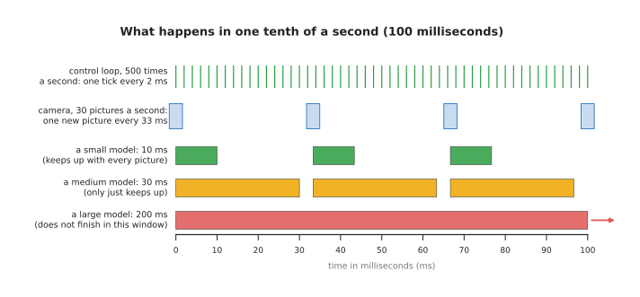
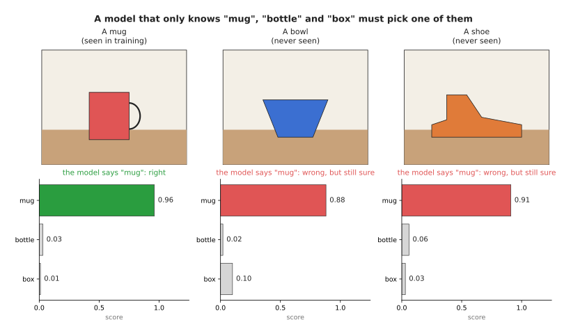
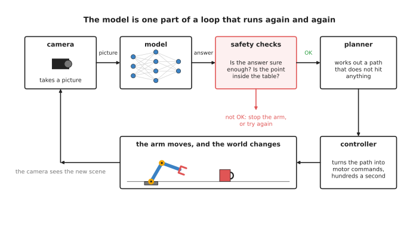

# Running a model on a robot

The earlier documents in this chapter were about making a model: what it is, how it
learns and where its examples come from. This document is about what happens next,
when a finished model is put on a real robot arm and used.

It answers six questions, and they follow one after another. What is the difference
between training a model and using it? How fast must a model be? Why do models run on
a graphics card? Why are big models slower? What does it mean when a model is "sure",
and why can it be sure and wrong? And what else must sit around a model to keep the
arm safe?

It is written for a complete beginner, so you only need to know what a robot arm and
a camera are, and you should have read [what a model is](../../01_what-models-are/01_what-a-model-is.md). Nothing else is
assumed.

## Contents

1. [Training and using are two different jobs](#1-training-and-using-are-two-different-jobs)
2. [How fast is fast enough](#2-how-fast-is-fast-enough)
3. [CPU and GPU](#3-cpu-and-gpu)
4. [Model size and speed](#4-model-size-and-speed)
5. [How sure the model is, and why it can be sure and wrong](#5-how-sure-the-model-is-and-why-it-can-be-sure-and-wrong)
6. [The model is one part of a loop](#6-the-model-is-one-part-of-a-loop)
7. [Safety checks around a model](#7-safety-checks-around-a-model)
8. [Why use a model at all, and what it costs](#8-why-use-a-model-at-all-and-what-it-costs)
9. [Where to read next](#9-where-to-read-next)
10. [Using it in Python](#10-using-it-in-python)

---

## 1. Training and using are two different jobs

A model has two lives, and almost everything in this document follows from the
difference between them.

The first life is **training**, during which the model is shown many examples and its
numbers are changed a little at a time until its answers are good. Training happens
once, or at most a few times, and it usually happens on powerful computers in a data
centre far away from the robot, where it can take hours, days or even weeks.

The second life is using the model, and by then its numbers are fixed. The robot
gives the model an input, such as a camera picture, and the model gives back an
answer, such as "there is a mug at this spot". Using a trained model to get an answer
in this way is called **inference**, which is a word that simply means "working
something out".

During inference the model does not learn at all, so if it gives a wrong answer its
numbers do not change, which means it will give exactly the same wrong answer the
next time it sees the same picture. To fix it, somebody must collect new examples and
train the model again.

Because the two lives are so different, they need different things from a computer.
Training needs a great deal of computing power and memory, but it does not need to be
quick, since nobody is waiting for any single step of it. Inference needs much less
computing power for each answer, however it must be quick, because the robot really
is waiting for that answer. The rest of this document is about inference.

---

## 2. How fast is fast enough

Since inference must be quick, the next question is how quick. The time a model takes
to give one answer is called its **latency**, and it is measured in **milliseconds
(ms)**, where a millisecond is one thousandth of a second.

How much latency is acceptable depends entirely on the job, because three jobs on a
robot arm run at very different speeds.

A typical camera takes 30 pictures every second, which is one new picture every
33 milliseconds, so a model that looks at every picture must finish within 33 ms or
it falls behind.

The **control loop** is the part of the robot's software that tells the motors what
to do, because it reads the joint sensors, works out a small correction and then
sends a new command to each motor. Many arms run this loop hundreds of times a
second, so at 500 times a second each pass has only 2 ms to finish in.

Deciding the next step of a task, such as "now pick up the mug", happens much less
often than either of those, so taking a second or more to decide is usually fine,
because the arm is still busy doing the current step while the decision is made.



The picture shows one tenth of a second, during which the control loop ticks fifty
times while the camera takes only three pictures. A small model finishes well within
each picture's time, a medium one only just keeps up, and a large one is still busy
at the end.

This is why a neural network is almost never placed inside the control loop itself,
since it is usually far too slow to answer every 2 ms. Instead the work is split
between two parts. The model runs at its own slower speed and gives a goal, such as a
target position or a short list of the next few movements, and then a simple, fast,
programmed controller follows that goal at hundreds of steps a second. Some
[movement models](../../06_movement-models/01_overview.md) are designed around this
idea. The [action chunking page](../../06_movement-models/02_most-used/02_action-chunking-transformers.md)
shows one that gives a whole chunk of movements at once, so that it needs to be asked
less often.

Latency is not the only kind of speed, because **throughput** is how many answers a
model gives each second. A slow model can sometimes have good throughput by working
on several pictures at the same time, however a robot usually cares about latency
instead, since it needs the answer about this picture now.

---

## 3. CPU and GPU

Meeting those time budgets depends on which processor the model runs on. A computer
has a main processor called the **CPU (central processing unit)**, and a CPU has a
small number of powerful workers called **cores**, usually between a few and a few
dozen of them. Each core can do almost any job very quickly, one step after another,
which is why the CPU runs the operating system, the robot's programs and the control
loop.

Many computers also have a **GPU (graphics processing unit)**. A GPU was first built
to draw pictures on a screen. Drawing a picture means doing the same small sum for
millions of pixels. So a GPU has thousands of simpler cores, and they all do the same
kind of sum at the same time, on different numbers.

A neural network, inside, is mostly one kind of work. It multiplies a very large
number of numbers together and adds up the results. The
[inside a neural network](../../01_what-models-are/03_inside-a-neural-network.md) document showed why. Every
one of these multiplications is small and independent of the others. That is exactly
the kind of work a GPU was built for. So a GPU can often run a neural network many
times faster than a CPU can.

This is why training almost always uses GPUs, and why most robots that run models
carry one. There are small computers made for robots that include a GPU, such as
NVIDIA's Jetson boards. Some laptops and desktop computers, such as Apple's Mac
computers, have the CPU and GPU on one chip and can run smaller models well. There
are also chips built only for neural networks. They are often called **NPUs (neural
processing units)** or accelerators.

A CPU can still run a small model. For a small model that answers only a few times a
second, a CPU is often good enough, and it avoids the cost, heat and power use of a
GPU.

---

## 4. Model size and speed

Whichever processor you use, the model's own size decides much of its speed. The
size of a model is usually given as the number of numbers inside it, and those
numbers are called **parameters**, or **weights**. A small seeing model may have a
few million of them, whereas a large language model may have many billions.

Every parameter is used at least once each time the model gives an answer, so more
parameters mean more multiplications, and more multiplications take more time. That
is why bigger models are usually slower.

Bigger models also need more memory, because every parameter must be stored in the
memory of the chip that runs the model. If each parameter takes 2 bytes, then a model
with 1 billion parameters needs about 2 gigabytes just to hold its numbers, and a
model with 7 billion parameters needs about 14 gigabytes, which a small robot
computer may simply not have.

Bigger models are often better, though, because they hold more knowledge and cope
better with unusual pictures. Choosing a model size is therefore a trade, and what
you want is the largest model that still answers fast enough on the computer your
robot actually has.

There are ways to make a model smaller or faster:

- **Use a smaller version.** Many well-known models come in several sizes, such as
  small, medium and large. You pick the one that fits.
- **Store each number with fewer bits.** This is called **quantisation**. Each
  parameter is rounded to a less exact number that takes less memory. The model gets
  smaller and faster, and usually only a little less accurate.
- **Train a small model to copy a big one.** This is called **distillation**. The
  large model gives answers, and a small model is trained to give the same answers.
- **Use a smaller picture.** A model that looks at a picture half as wide and half as
  tall has a quarter as many pixels to process.

Each of these four costs some accuracy, so you check how much it costs by testing the
smaller model on exactly the same tasks as the large one.

---

## 5. How sure the model is, and why it can be sure and wrong

Speed is not the only thing a robot needs from a model, because it also needs to know
how far to trust the answer. Many models give a number with each answer that says how
sure the model is, and that number is called the **confidence**, or the **score**. It
usually runs from 0 to 1, so a score of 0.96 next to the word "mug" means the model is
very sure it sees a mug.

The score is useful, because a robot can ignore answers with a low score, or go and
look again from another angle.

However the score is not a promise, since a common kind of model can only choose from
the names it was trained on. Suppose a model was trained to tell apart just three
things: "mug", "bottle" and "box". Its scores for those three always add up to 1, so
it has no way at all to say "none of these". When it is then shown something it has
never seen, such as a shoe, it must still share its score between "mug", "bottle" and
"box", and it may well give most of that score to one of them.



The scores in this picture are made-up examples that show what can happen. The model
is right and sure about the mug, but it is equally sure about the bowl and the shoe,
where it is wrong.

A model is most trustworthy on pictures that look like its training examples, and a
picture unlike any of them is called **out of distribution**, which simply means "out
of the range of things it was trained on". On such pictures the score can be high for
no good reason at all, and a new kind of object, strange lighting, a dirty camera lens
or a reflection in a window can each cause it.

People do several things about it:

- They add an extra answer such as "nothing I know" and train the model with
  examples of it.
- They check the score against other information. For example, a depth camera
  can confirm that there really is an object of the right size at that spot.
- They adjust the scores after training, so that a score of 0.9 really is right
  about 9 times in 10 on test pictures. This is called **calibration**.
- They test the model on pictures from the real place where the robot will work,
  not only on the pictures it was trained on.

None of these four makes the score perfect, so a robot should treat a model's answer
as a good guess rather than a fact, and the rest of the system must always be ready
for that guess to be wrong.

---

## 6. The model is one part of a loop

Because a model's answer is only a good guess, it is never the whole system. A model
on its own does not move anything, so it sits inside a loop together with other
parts, where each part does one job and then passes its result on.

1. The **camera** takes a picture.
2. The **model** looks at the picture and gives an answer, such as "the mug is here,
   and it is best held by its body from above".
3. **Safety checks** look at the answer and decide whether it is sensible.
4. The **planner** works out a path for the arm from where it is now to the mug. It
   makes sure the path does not hit the table or anything else.
5. The **controller** turns the path into motor commands, hundreds of times a
   second, and the arm moves.
6. The world changes, because the mug has moved or the gripper has closed, so the
   camera takes a new picture and the whole loop starts again.



The picture shows that loop. If the safety checks do not accept the model's answer,
then the arm does not move on it at all, and instead the arm stops or the model is
asked again.

The planner and the controller are often not neural networks, because they are
usually programs written by people from the geometry of the arm. Book 3 covers them
in
[planning a path](../../../03_frameworks/03_arm-movement/03_planning-a-path.md) and
[controlling the move](../../../03_frameworks/03_arm-movement/04_controlling-the-move.md).
Some models do more than one of these jobs at once. A
[vision-language-action model](../../07_language-models/02_most-used/01_vision-language-action-models.md)
takes the picture and gives arm movements directly, doing the job of the model and
the planner together. Even then, a programmed controller and safety checks still sit
between it and the motors.

---

## 7. Safety checks around a model

Because a model can be wrong, and sure while it is wrong, the rest of the robot must
not trust it blindly, which is why most real systems wrap a model in simple checks
written by people. These checks are plain rules, so anyone can read them and know
exactly what they do, which is the opposite of a model's numbers.

The table below lists common checks. Read each row across: what is checked, and what
the check stops from going wrong.

| Check | What it stops |
| --- | --- |
| Is the score above a set level, such as 0.8? | acting on a guess the model itself was unsure about |
| Is the target inside the area the arm is allowed to reach? | the arm reaching off the table or towards a person |
| Does a second sensor agree, such as a depth camera? | acting on a mug that the model imagined |
| Is the planned path clear of known obstacles? | the arm hitting the table, a wall or itself |
| Are the speed and force below set limits? | a fast or hard movement that could hurt someone or break something |
| Did the model answer in time? | the arm acting on an old picture after the mug has moved |
| After grasping, is the gripper really holding something? | carrying on as if the grasp worked when it did not |

The speed and force limits usually live inside the controller or in the arm's own
safety system rather than in the robot's main program, because that way they still
work even if the main program has a mistake in it. Most industrial arms also have an
**emergency stop**, which is a large red button that cuts power to the motors
straight away.

When a model is new, people also test it slowly at first. They run the arm at low
speed with a person watching and a hand near the emergency stop, and they start with
soft objects on an empty table. Only when the model has done well many times do they
let it run faster.

---

## 8. Why use a model at all, and what it costs

Given everything a model costs, it is worth asking why anyone uses one. The obvious
alternative to a neural network is a programmed rule, such as "the mug is the largest
red patch in the picture". A programmed rule is fast and runs easily on a CPU, and it
is never sure and wrong in a surprising way, because you can read it and see exactly
what it does.

The problem is that such a rule breaks as soon as the world changes, since a blue
mug, a red plate or a shadow over the mug can each defeat "the largest red patch". A
model trained on many varied examples copes with those changes far better, which is
why models are used for jobs where the world varies a lot, such as recognising
objects, choosing grasps and following spoken instructions.

The cost is everything else in this document. A model needs a computer fast enough to
run it, often with a GPU, and it needs to be small enough to answer in time. Its
answers come with a score that you cannot fully trust, and it needs programmed checks
around it, because nobody can read its numbers and know what it will do on a picture
it has never seen.

So most robots mix the two approaches rather than choosing between them. A model does
the part that has to cope with variety, such as finding the mug, while programmed
parts do everything that must be exact and safe, such as planning the path, driving
the motors and checking the limits. The
[programmed methods document](../../../03_frameworks/04_one-arm-training/02_programmed-methods.md)
describes those parts.

---

## 9. Where to read next

- [Evaluation and failure](03_evaluation-and-failure.md) is the next page. It
  shows how to tell whether the model is good enough to leave running.
- [The map of models](../../01_what-models-are/06_the-map-of-models.md) shows every
  kind of model in this book and where each one sits in the loop above.
- [Where the data comes from](../../01_what-models-are/05_where-the-data-comes-from.md) explains the data
  that a model is trained on before it ever runs on a robot.
- [Movement models](../../06_movement-models/01_overview.md) are the models that work
  closest to the control loop, so speed matters most for them.
- [Collision and failure detection](../../09_touch-and-body-models/02_most-used/02_collision-and-failure-detection.md)
  covers models that help check whether something has gone wrong.
- [Models that find](../../../02_perception/02_object-perception/04_models-that-find.md)
  in Book 2 compares real seeing models that you can download and use.
- [Working without a GPU](../../../03_frameworks/03_arm-movement/10_working-without-a-gpu.md)
  in Book 3 says what robot arm work you can still do on a computer with no NVIDIA
  graphics card, such as an Apple Silicon Mac.

---

## 10. Using it in Python

Section 2 gave the time budget of 33 milliseconds per camera picture, and section 7
gave the first safety check, which is to act only on answers the model scored highly.
This section measures the first and applies the second, because both of them are a few
lines around a call you already have. After reading it you will be able to say whether
a model is fast enough on the computer your robot actually has.

```python
import time

from ultralytics import YOLO

model = YOLO('yolo11n.pt')      # downloaded on first use
times = []

for frame in camera_frames():   # your own camera, one picture at a time
    start = time.perf_counter()
    result = model(frame, verbose=False)[0]
    times.append((time.perf_counter() - start) * 1000)
    # Section 7's first check: keep only the boxes the model itself was sure about.
    sure = result.boxes[result.boxes.conf > 0.8]

times.sort()
print(f'middling {times[len(times) // 2]:.0f} ms, slowest {times[-1]:.0f} ms, '
      f'budget 33 ms')
```

Ultralytics gives you the model, the download, the resizing of your picture and the
answer, so the only line that is yours is the timing around it. Each `result` also
carries its own `result.speed`, a dictionary whose `'inference'` entry is the
milliseconds the network itself took. That number is smaller than the one this snippet
prints, because `perf_counter` also counts the resizing before and the sorting of boxes
afterwards, and it is the larger number that has to fit inside 33 milliseconds, because
that is the time your program really spends.

What you have to write yourself is `camera_frames`, and what happens to `sure`
afterwards. Reporting the slowest time as well as the middling one is also yours to
remember, and it matters more than it looks: a model that answers in 20 milliseconds
almost always and in 90 milliseconds once a second still drops a picture every second,
so a single average would have hidden the problem.

What you have to decide is the score limit, the picture size, and the model size. All
three trade accuracy against time, as section 4 explains, so measure them on the
computer that will sit next to the arm and not on your laptop. Do not choose the score
limit as a round number, because the
[uncertainty and confidence](../03_also-used/01_uncertainty-and-confidence.md#8-setting-the-threshold-from-the-cost-of-being-wrong)
page shows how to work it out from what a mistake would cost instead.
