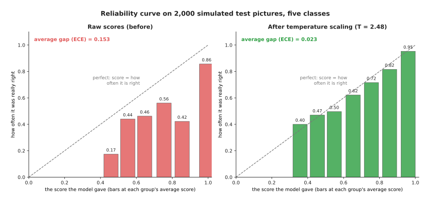
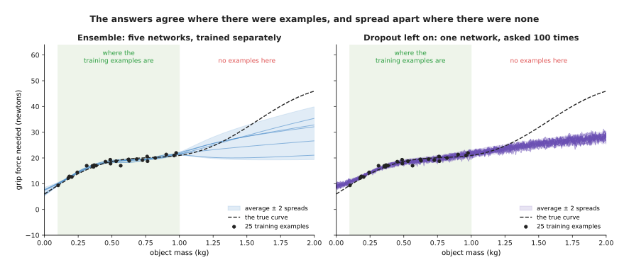
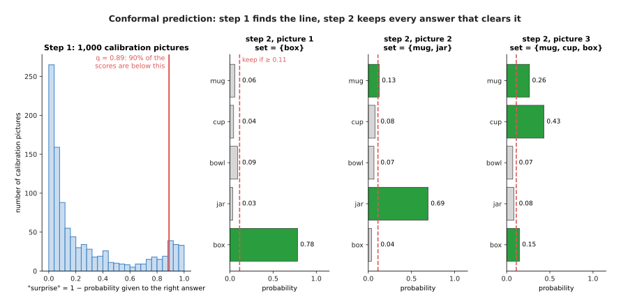
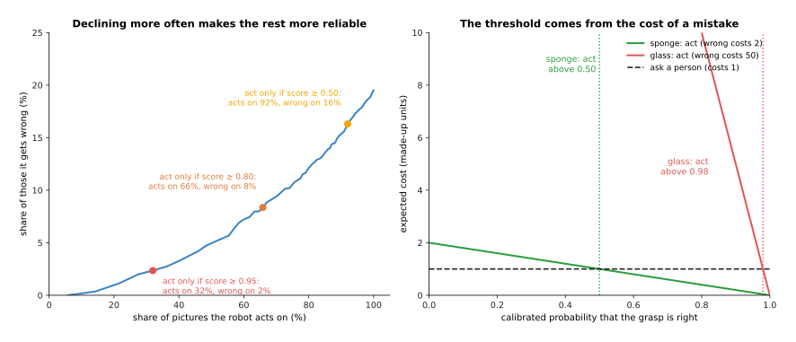

# Uncertainty and confidence

A model always gives an answer, and it gives one even when it has no good reason to.
This page therefore answers one question: how can a robot tell when a model is
unsure, and what should it do about it?

It is for a beginner who has read the earlier pages of this chapter, especially
[running a model on a robot](../02_most-used/02_running-a-model-on-a-robot.md),
because section 5 of that page showed that a model can be sure and wrong at the same
time. This page goes further than that, since it shows how to check a model's scores,
how to fix them, how to measure how unsure a model really is, and finally how to turn
all of that into one decision: act, look again, or ask a person.

Every number on this page comes from a real run of the diagram script
`docs/diagrams/what_models_are_3.py`, although the model and its pictures are
simulated. The script makes up a five-class "model" and draws its right answers at
random, so that we know the truth exactly, however the methods run on those numbers
are the real ones.

> Before this page, it helps to have read [the Kalman filter](../../../05_programming-techniques/04_fitting-and-estimation/02_most-used/03_kalman-filter.md#what-the-filter-keeps), which explains the spread of a set of readings and how a program keeps track of how unsure it is.

## Contents

1. [The idea in one sentence](#1-the-idea-in-one-sentence)
2. [A score is not a probability until it is checked](#2-a-score-is-not-a-probability-until-it-is-checked)
3. [Checking the scores: the reliability curve](#3-checking-the-scores-the-reliability-curve)
4. [Fixing the scores: temperature scaling](#4-fixing-the-scores-temperature-scaling)
5. [Measuring how unsure a model is: ensembles and dropout](#5-measuring-how-unsure-a-model-is-ensembles-and-dropout)
6. [A guaranteed set of answers: conformal prediction](#6-a-guaranteed-set-of-answers-conformal-prediction)
7. [Declining to act: the reject option and cascades](#7-declining-to-act-the-reject-option-and-cascades)
8. [Setting the threshold from the cost of being wrong](#8-setting-the-threshold-from-the-cost-of-being-wrong)
9. [Where it is used on a robot arm](#9-where-it-is-used-on-a-robot-arm)
10. [Where it works, and where it does not](#10-where-it-works-and-where-it-does-not)
11. [Libraries](#11-libraries)
12. [Why do this, and what it costs](#12-why-do-this-and-what-it-costs)
13. [Where to read next](#13-where-to-read-next)

---

## 1. The idea in one sentence

A model's confidence is only useful if a score of 0.9 really means "right about 9
times in 10", so you first check and fix the scores, and then let the robot act
only when the chance of being right is high enough for what a mistake would cost.

Here is an everyday example. A weather forecast says "70% chance of rain", and a good
forecaster is right about this in a simple way, because on all the days they said 70%
it rained on about 70 of every 100. A forecaster who says 70% but gets rain on only
40 of every 100 such days is not useful at all, even if they are often right about
sunny days. You would also act differently on the very same forecast depending on
what is at stake, since for a walk to the shop you might ignore a 30% chance of rain,
whereas for a wedding outdoors you would put up a tent.

A robot needs both halves of this. It needs scores that mean what they say, and it
also needs a rule that turns a score into an action, based on what a mistake would
cost.

---

## 2. A score is not a probability until it is checked

Since a robot needs scores that mean what they say, it is worth knowing where those
scores come from. The last layer of a classifying network gives one number per class,
and these raw numbers are called **logits**, which can be any size and can be
negative. A small function called **softmax** then turns them into scores between 0
and 1 that add up to 1, and it does this by making big logits bigger and small ones
smaller, in proportion. The
[what a model is](../../01_what-models-are/01_what-a-model-is.md#3-everything-is-numbers) page showed two
such scores for "mug" and "bowl".

Scores that add up to 1 look like probabilities, and a **probability** is a number
that says how often something happens, so a probability of 0.9 means "9 times in 10".
However nothing in training forces the scores to match how often the model is
actually right, because training only pushes the score of the right class upwards. A
large network trained for a long time learns to push that score very high indeed,
even on the examples it gets wrong, which is why modern networks are often
**overconfident**: they give scores that are higher than their real rate of being
right.

The simulated model on this page shows the problem clearly. It was tested on 2,000
pictures of five kinds of object, namely mug, cup, bowl, jar and box, and it gave the
right class for 80.5% of them. However its average score for its chosen class was
0.957, so it said "about 96% sure" while being right about 80% of the time. On the
1,751 test pictures where its score was above 0.9, it was right on only 85.6% of
them.

A score that matches how often the model is right is called **calibrated**, so the
next two sections show first how to check this and then how to fix it.

---

## 3. Checking the scores: the reliability curve

Because a score only means something once it has been checked, the check comes first.
It needs pictures the model did not train on, with the right answers already known,
so a test set works, as described in
[how a model learns](../../01_what-models-are/02_how-a-model-learns.md#6-keeping-some-examples-back-the-test-set).
The check itself has four steps.

1. Run the model on every test picture. Write down its top score and whether its
   answer was right.
2. Sort the pictures into groups by score. The usual groups are ten equal slices:
   scores from 0 to 0.1, from 0.1 to 0.2, and so on up to 0.9 to 1.
3. In each group, work out two numbers: the average score, and the share of
   pictures the model got right.
4. Draw one bar per group. The bar sits at the group's average score, and its
   height is the share it got right.

This drawing is called a **reliability curve**, or reliability diagram. If the model
is calibrated, every bar reaches the diagonal line, where "score" equals "how often
right". A bar below the line means the model was overconfident in that group.

The left half of the picture shows the raw scores, and almost all the pictures, 1,751
of 2,000, fall into the top group with an average score of 0.99, where the model was
right on only 0.86 of them. The lower groups sit further below the line still. Groups
with fewer than 20 pictures are left out, because a share worked out from a handful
of pictures is mostly chance.

To sum up the whole curve in a single number, people use the **expected calibration
error (ECE)**, which is the gap between each bar and the diagonal, averaged over all
the pictures so that each group counts in proportion to how many pictures it holds.
For the raw scores the ECE is 0.153, which means the scores are off by about 15
percentage points on average.

---

## 4. Fixing the scores: temperature scaling

Once the check has shown that the scores are wrong, the next step is to fix them, and
the simplest fix is called **temperature scaling**. It divides every logit by one
number, T, before softmax, and T is called the **temperature**. A temperature above 1
pulls the logits closer together, so softmax then gives less extreme scores, whereas
a temperature below 1 does the opposite. The name comes from physics, where a hotter
system is more spread out.

T is chosen on a set of pictures kept aside for exactly this purpose, called the
**calibration set** or validation set, and it must not be the test set, because
otherwise the check in section 3 would no longer be honest. The steps are these.

1. Run the model once on the calibration pictures and store the logits.
2. Try many values of T. For each one, divide the logits by T, apply softmax, and
   measure how well the scores match the right answers. The usual measure is the
   **log loss**: the average of minus the logarithm of the score given to the right
   class. It is small when the right class gets a high score, and very large when
   the right class gets a score near 0.
3. Keep the T with the smallest log loss.
4. From then on, divide the logits by that T every time the model runs.

The script tried every T from 0.50 to 5.00 in steps of 0.01 on 1,000 calibration
pictures, and the best value was T = 2.48. The right half of the picture above shows
the test pictures with that temperature applied, and the bars now sit close to the
diagonal, because the ECE fell from 0.153 to 0.023. Of the 970 test pictures that now
score above 0.9, the model was right on 95.3%.

Temperature scaling has one very useful property, which is that dividing every logit
by the same positive number never changes which logit is largest. This means the
model's answers do not change at all and its accuracy stays at exactly 80.5%, so only
the scores change, which makes temperature scaling a safe step to add to any trained
classifier.

Two other fixes are also common. **Platt scaling** fits a small formula with two
numbers instead of one, whereas **isotonic regression** fits a staircase that maps
each raw score to a calibrated one. Isotonic regression can fix more shapes of error,
however it needs more calibration pictures, because it has more numbers to fit.

---

## 5. Measuring how unsure a model is: ensembles and dropout

Calibration fixes the scores on pictures that look like the calibration pictures,
however it does not tell you when an input is unlike anything the model has ever
seen. For that you need a second kind of signal, which answers a different question:
does the model's answer depend on luck?

The idea behind that signal is simple. You train the same kind of model more than
once, each time with different random starting weights. Where there were many
training examples the copies are forced to agree, because they all had to match the
same examples, whereas where there were no examples nothing forced them to agree, so
they give different answers. The spread between their answers is therefore a measure
of how unsure the model is, and it is often called **model uncertainty**.

There are two common ways to get several answers.

- An **ensemble** is a group of separately trained copies of the model. The
  [learned dynamics models](../../08_world-models/02_most-used/01_learned-dynamics-models.md)
  page uses one to see how far a prediction can be trusted. Five copies is a common
  choice.
- **Dropout** is a trick used during training, because at each training step it
  switches off a random share of the neurons, for example one in five, and it was
  invented to stop overfitting. **Monte Carlo dropout** (MC dropout) keeps dropout
  switched on when the model is used and runs the model many times on the same
  input, so that each run switches off different neurons and therefore gives a
  slightly different answer. "Monte Carlo" is simply a name for any method that uses
  repeated random tries.

The script tested both of these on a small example. A network learns how hard a
gripper must squeeze to hold an object, using the object's mass as its only input,
and it has 25 training examples, all with masses between 0.1 and 1.0 kilograms. The
true curve is made up, and the network does not know it.

The table below gives the average answer and the spread at three masses. The spread
is the **standard deviation**: a measure of how far the answers typically sit from
their average. Read each row as one mass.

| Mass | True force | Ensemble of 5 | MC dropout, 100 runs |
| --- | --- | --- | --- |
| 0.5 kg (inside the examples) | 18.6 N | 18.6 ± 0.3 N | 18.3 ± 0.5 N |
| 1.5 kg (outside) | 31.9 N | 26.0 ± 3.4 N | 25.4 ± 1.0 N |
| 2.0 kg (far outside) | 46.0 N | 29.6 ± 5.1 N | 28.1 ± 1.1 N |

Inside the training range both methods agree closely with each other and with the
truth. Outside that range, however, the ensemble's copies spread apart, and that
spread is exactly the warning sign you want, because it says "I have not seen objects
this heavy". MC dropout also spreads a little more outside the range, but much less
than the ensemble does, and its answers are all wrong in the same direction, which is
a known weakness of it. MC dropout is cheaper, because it needs
only one trained network, but it tends to report too little uncertainty. An ensemble
costs more to train and to run, and usually gives a more honest spread.

The table uses the sign ± ("plus or minus") to show the spread next to the average.
At 1.5 kilograms the ensemble's spread grew from 0.3 to 3.4 newtons, more than ten
times. MC dropout's spread only doubled.

Note what neither method says. Neither gives the right answer at 2.0 kilograms. The
truth, 46.0 newtons, is far outside even the ensemble's spread. So the spread is not
a range the truth is sure to be in. It only tells you that the answer there should
not be trusted. That is what the robot needs to know.

---

## 6. A guaranteed set of answers: conformal prediction

Sections 3 and 4 made the scores match the truth on average, whereas **conformal
prediction** goes one step further, because it gives a promise you can write down:
"the right answer will be in this set of answers at least 90% of the time."

Instead of one answer, the model gives a **prediction set**, which is a short list of
answers. When the model is sure the list holds one answer, whereas when it is unsure
the list holds two or more. The list is never empty in practice, so its length is
itself a measure of how unsure the model is.

The simplest version, called **split conformal prediction**, needs a calibration
set and works in two steps.

**Step 1: learn how surprised the model usually is.**

1. Choose how often you are willing to miss. Call it alpha. Here alpha is 0.1, which
   means "miss at most 10% of the time".
2. For each calibration picture, look at the score the model gave to the right
   answer, and work out the **surprise**, which is 1 minus that score. A surprise
   near 0 therefore means the model gave the right answer a high score, whereas a
   surprise near 1 means it gave the right answer almost nothing.
3. Sort the surprises. Find the value q that 90% of them are below. (For exactness,
   the formula uses a slightly higher share: (n + 1) × 0.9 / n of them, where n is the
   number of calibration pictures.)

**Step 2: build a set for each new picture.**

4. Put into the set every answer whose score is at least 1 − q.

The script did this with the temperature-scaled scores from section 4, using 1,000
calibration pictures that were not used to choose T, and it found q = 0.889, which
means each set holds every answer with a score of at least 0.111.

The left part of the picture shows step 1, where most calibration pictures have a
small surprise and only a few have a large one, and the red line is q. The three
parts on the right then show step 2, for three test pictures.

- Picture 1 gives "box" a score of 0.78 and every other class 0.09 or less. Only
  "box" clears 0.111, so the set is {box}.
- Picture 2 gives "jar" 0.69 and "mug" 0.13. Both clear the line, so the set is
  {mug, jar}.
- Picture 3 gives "cup" 0.43, "mug" 0.26 and "box" 0.15. All three clear the line,
  so the set is {mug, cup, box}. The model is plainly unsure.

On the 2,000 test pictures, 71.4% of the sets had one answer, 16.5% had two, 8.6% had
three, 3.2% had four and 0.3% had all five, so the average set held 1.44 answers. The
right answer was inside the set for 88.3% of the test pictures, which is worth
comparing with the single best guess, since that was right for only 80.5%.

88.3% is a little under 90%, however this is not a fault, because the promise is
about the average over many possible calibration sets and any one set of pictures
wobbles a little around it. The script checked exactly this by mixing the 3,000
pictures and splitting them into a new calibration set and a new test set 200 times,
and the average coverage was 90.1%, with the lowest at 87.3% and the highest at
92.8%.

The promise does need one condition, which is that the new pictures must come from
the same kind of situation as the calibration pictures. The technical word for this
is **exchangeable**, meaning that you could swap a calibration picture with a new
picture and not be able to tell which was which. So if the robot moves to a darker
room, the promise no longer holds.

Conformal prediction also works for numbers, not only for names. Then it gives a
range, such as "the object is between 41 and 47 centimetres away", instead of a set.

---

## 7. Declining to act: the reject option and cascades

Once a robot has a trustworthy measure of how sure a model is, it can choose not to
act on some answers. This is called the **reject option**. The model is allowed to
say "I don't know".

The simplest rule is a threshold, where the robot acts only when the calibrated score
is at least some value t. The higher t is, the fewer pictures the robot acts on, and
the fewer of those it gets wrong.

The left half of the picture shows this for the 2,000 calibrated test pictures, and
the table below gives five points on that curve. Read each row as one threshold,
showing the share of pictures the robot acts on and the share of those it gets
wrong.

| Act only if score is at least | Acts on | Wrong on |
| --- | --- | --- |
| 0 (always act) | 100% | 19.5% |
| 0.50 | 92.0% | 16.3% |
| 0.80 | 65.8% | 8.4% |
| 0.90 | 48.5% | 4.7% |
| 0.95 | 32.0% | 2.3% |

So declining is not free, because to cut mistakes from 19.5% down to 2.3% the robot
must decline on 68% of the pictures. This means what the robot does with the declined
pictures matters just as much as the threshold itself.

A robot has three useful things it can do instead of acting.

- **Look again.** Move the camera to a different angle, turn on a light, or wait for
  the arm to move out of the view, and ask the model again. A picture from a new
  angle often removes the doubt. Choosing the best new viewpoint is its own
  technique, covered in Book 5's
  [visibility and next-best-view](../../../05_programming-techniques/06_planning-and-search/03_also-used/03_visibility-and-next-best-view.md)
  page.
- **Ask a bigger model.** A **cascade** is a chain of models, from cheap to
  expensive. The small, fast model answers first. Only when it is unsure does the
  robot pass the picture on to a larger, slower, more accurate model. Most pictures
  never reach the large model, so the system is nearly as fast as the small model and
  nearly as accurate as the large one.
- **Ask a person.** Show the picture on a screen and let a person choose. This is
  slow, so it suits rare cases. The person's answer can also be saved as a new
  training example, so the model improves where it was weakest.

With conformal sets the rule becomes even simpler, because if the set holds one
answer the robot acts, whereas if it holds more than one the robot looks again or
asks.

---

## 8. Setting the threshold from the cost of being wrong

Section 7 showed that the threshold decides how often the robot declines, so the next
question is which threshold is right. That depends on what a mistake costs compared
with what declining costs, and the answer comes from a short calculation.

Say the calibrated probability that the model is right is p, that a mistake costs W,
and that asking a person costs A, where both costs are in the same made-up units,
such as seconds of a person's time or money.

- If the robot acts, it is wrong with probability 1 − p. The **expected cost**, the
  average cost over many such cases, is (1 − p) × W.
- If the robot asks, the cost is always A.
- So the robot should act when (1 − p) × W is less than A. That is the same as
  acting when p is greater than 1 − A / W.

The right half of the picture in section 7 shows two examples, with asking costing
1 unit:

- **A sponge.** Dropping a sponge costs little, because it only means a second try,
  which is 2 units, so the threshold is 1 − 1/2 = 0.50 and the robot acts on any
  grasp that is more likely right than wrong.
- **A glass.** Dropping a glass costs a broken glass and a clean-up, which is 50
  units, so the threshold is 1 − 1/50 = 0.98 and the robot acts only when the model
  is very sure.

The same model and the same calibrated scores therefore give different thresholds for
different objects, and this is the right way to set a threshold. A fixed number, such
as "always 0.8", is only a guess, whereas a threshold worked out from the costs has a
reason behind it.

This calculation only works if the scores are calibrated, however. With the raw
scores from section 2, a score of 0.99 meant "right 86% of the time", so a robot that
trusted that score with the glass would break about one glass in seven.

---

## 9. Where it is used on a robot arm

Now that the whole method is in place, it is worth seeing where it is actually used,
because the ideas on this page appear in many places on a robot arm.

- **Before a grasp.** A grasp model gives each candidate grasp a score. The
  [grasp quality models](../../05_grasp-models/03_also-used/02_grasp-quality-models.md)
  page describes these. With calibrated scores, the arm tries a grasp only when its
  chance of success is high enough for the object.
- **Object detection.** A detector's scores decide which boxes the robot believes, so
  calibrating those scores and then using a cost-based threshold is what stops the
  arm reaching for objects that are not there.
- **Sorting and picking in a warehouse.** A cascade sends the rare unclear item to a
  person while the arm handles all the rest, which is how many commercial picking
  cells work.
- **Movement models.** An ensemble of movement policies, or of world models, can warn
  when the robot is in a situation that none of its demonstrations covered, so that
  the robot can then slow down or stop. See the
  [learned dynamics models](../../08_world-models/02_most-used/01_learned-dynamics-models.md)
  page.
- **Checking success.** A model that answers "did the grasp work?" or "is the task
  done?" should also be able to say "not sure". The
  [collision and failure detection](../../09_touch-and-body-models/02_most-used/02_collision-and-failure-detection.md)
  page covers such models.
- **Learning with error bars.** A Gaussian process gives a range with every
  prediction, as shown in
  [Gaussian processes and Bayesian optimisation](../../02_classical-machine-learning/02_most-used/03_gaussian-processes-and-bayesian-optimisation.md). It is often used
  when a robot tunes a setting, such as grip force, from a few tries.

---

## 10. Where it works, and where it does not

These methods are useful, but each has a known way of failing. The table below
lists the main ones. Read each row across: the method, what makes it fail, the sign
you would see, and what people do instead.

| Method | What makes it fail | The sign you would see | What people do instead |
| --- | --- | --- | --- |
| Temperature scaling | the robot works in a new place, light or set of objects | the reliability curve, re-checked on new pictures, drops below the line | calibrate again on pictures from the new place |
| Ensembles | all copies learned the same wrong thing from the same data | copies agree, but are all wrong | add varied training data; check with a second sensor |
| MC dropout | dropout spreads the answers too little | small spread even far from the examples | use an ensemble when the cost of a mistake is high |
| Conformal prediction | new pictures are not like the calibration pictures | the right answer is missing from the set more often than promised | re-calibrate; keep a log of misses to notice the change |
| Any threshold | costs were guessed, not measured | the robot asks far too often, or breaks things | measure real costs, and review them after a few days of running |

Two limits apply to all of them. First, they all need labelled pictures that the
model did not train on. Without a calibration set there is nothing to check
against. Second, none of them makes the model more accurate. They make the model
honest about how accurate it is. A model that is right only half the time will,
after calibration, say so, and the robot will decline to act on many pictures.

---

## 11. Libraries

The table below lists real libraries that provide these methods. Read each row as
one library: its language, what it provides, and a note on when to use it.

| Library | Language | What it provides | Note |
| --- | --- | --- | --- |
| scikit-learn | Python | `sklearn.calibration.calibration_curve` for the reliability curve; `sklearn.calibration.CalibratedClassifierCV` for Platt scaling and isotonic regression | for models trained with scikit-learn, or any scores you can pass to it |
| TorchMetrics | Python | `torchmetrics.classification.MulticlassCalibrationError`, which computes the ECE | for PyTorch models during testing |
| PyTorch | Python | temperature scaling is a few lines: one learnable number, divided into the logits, fitted with the log loss | no extra library needed |
| MAPIE | Python | split conformal prediction for classification and regression, around scikit-learn-style models | the simplest way to get prediction sets |
| TorchCP | Python | conformal prediction for PyTorch models | for sets from a neural network |
| netcal | Python | temperature scaling, histogram binning, isotonic regression and reliability diagrams | many calibration methods in one place |

Ensembles and MC dropout need no special library. An ensemble is several trainings
of the same model with different random seeds. MC dropout is the same trained model,
run with its dropout layers left switched on.

---

## 12. Why do this, and what it costs

The obvious alternative is to take the model's score as it comes, and act when it
is above a round number such as 0.8. That is what most first versions of a robot do.

Checking and fixing the scores is better for three reasons. First, the raw score
from a modern network is usually too high, as section 2 showed. A threshold on the
raw score does not mean what you think. Second, only a calibrated score can be
combined with the cost of a mistake, as in section 8, to give a threshold with a
reason behind it. Third, uncertainty from an ensemble or a conformal set warns the
robot about inputs unlike its training pictures, which a single score often misses.

The costs are real, though:

- You need a calibration set: labelled pictures the model did not train on, taken
  in the place where the robot works. A few hundred to a few thousand is typical.
- An ensemble of five models costs five times the training and five times the
  running time. MC dropout costs many runs of one model per answer.
- Declining costs time. A robot that looks again or asks a person is slower than one
  that just acts.
- The work is never finished. Whenever the robot moves to a new place, new objects or
  new lighting, the calibration must be checked again.

Temperature scaling is almost free once you have a calibration set, and it never
changes the model's answers. So it is worth doing on every classifier that feeds a
decision. Ensembles and conformal sets are worth their cost where a mistake is
expensive.

---

## 13. Where to read next

- [Fine-tuning](../02_most-used/01_fine-tuning.md) shows how to adapt a
  trained model to your own robot. After fine-tuning, calibrate the scores again.
- [Gaussian processes and Bayesian optimisation](../../02_classical-machine-learning/02_most-used/03_gaussian-processes-and-bayesian-optimisation.md) covers Gaussian
  processes, which give a range with every prediction.
- [Running a model on a robot](../02_most-used/02_running-a-model-on-a-robot.md) describes the loop
  and the safety checks that use these scores.
- [Learned dynamics models](../../08_world-models/02_most-used/01_learned-dynamics-models.md)
  shows an ensemble used to decide how far ahead a prediction can be trusted.
- [Grasp quality models](../../05_grasp-models/03_also-used/02_grasp-quality-models.md)
  are the models whose scores most often decide whether an arm acts.
- [Safety monitoring](../../../05_programming-techniques/07_control-and-motion/02_most-used/04_safety-monitoring.md)
  in Book 5 covers the programmed checks that stop an arm whatever a model says.
